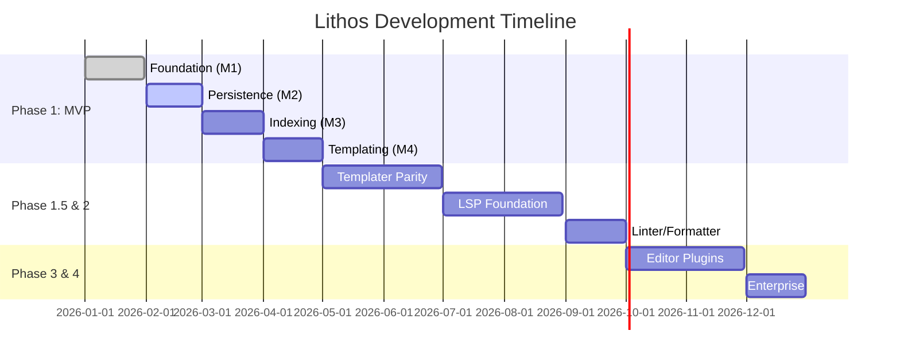

# Lithos

[](https://github.com/jack/lithos-rust/actions)
[](LICENSE-MIT)
[](https://www.rust-lang.org)
[](https://crates.io/crates/lithos)
[](https://docs.rs/lithos)

> Powerful, scriptable template generation for Obsidian vaults.

Lithos is a command-line powerhouse for Obsidian vaults, bridging the gap between terminal efficiency and structured knowledge management. It provides a robust engine for executing modular templates, enforcing metadata schemas, and performing vault-wide queries without ever leaving your editor or terminal.

Whether you're an Alex Chen power user needing scriptable note creation or a Sarah Martinez researcher managing thousands of interconnected files, Lithos ensures your vault stays consistent and performant. Built in Rust with a quality-first mindset, it leverages zero-copy persistence and a hexagonal architecture to deliver sub-500ms operations even in massive vaults.

---

## Table of Contents

- [Installation](#installation)
- [Quick Start](#quick-start)
- [Architecture](#architecture)
- [API Documentation](#api-documentation)
- [Development](#development)
- [Testing](#testing)
- [Contributing](#contributing)
- [Roadmap](#roadmap)
- [License](#license)
- [License](#license)
- [Changelog](#changelog)
- [Acknowledgments](#acknowledgments)

---

## Installation

### Prerequisites

- **Rust 1.92+**: [Install Rust](https://www.rust-lang.org/tools/install)
- **mise**: (Recommended) For tool versioning and task orchestration.

### From Source

```bash
git clone https://github.com/jack/lithos-rust.git
cd lithos-rust
cargo build --release
```

### Via Cargo (Coming Soon)

```bash
cargo install lithos
```

---

## Quick Start

Initialize a new note interactively from a template:

```bash
# Run the interactive template picker
lithos new --interactive

# Or specify a template directly
lithos new project-decision --vault ~/my-obsidian-vault
```

---

## Architecture

Lithos follows a **Hexagonal Architecture** (Ports and Adapters) combined with **CQRS** (Command Query Responsibility Segregation) to ensure the core domain logic remains isolated and testable.

### Bounded Contexts

- **Note**: The primary unit of knowledge, containing frontmatter, links, and content.
- **Schema**: Machine-readable metadata definitions enforcing vault consistency.
- **Template**: Modular, reusable rendering blocks powered by `MiniJinja`.
- **Config**: Hierarchical settings management (Global -> User -> Project -> Vault).

### Component Overview

- **Crates**:
  - `crates/domain`: Pure business logic, entities, and Port traits. No external I/O.
  - `crates/app`: Use case orchestrators (Commands/Queries) and event handling.
  - `crates/adapters`: Infrastructure implementations (Redb storage, MiniJinja rendering, miette diagnostics).
  - `crates/lithos`: Binary CLI entry point.

For more details, see the [Architecture Documentation](_bmad-output/planning-artifacts/architecture.md) and the [System Data Flow Diagram](_bmad-output/planning-artifacts/architecture.md#architectural-integrity).

---

## API Documentation


Detailed API documentation for each crate is available via `docs.rs`:

- [lithos-domain](https://docs.rs/lithos-domain): Core traits and models.
- [lithos-app](https://docs.rs/lithos-app): Service orchestration.
- [lithos-adapters](https://docs.rs/lithos-adapters): Implementation details.

---

## Development

We use `mise` as our primary task runner to ensure development parity.

### Setup

```bash
# Install required tools via mise
mise install

# Run the dev setup task
mise run dev-setup
```

### Quality Tools

Lithos enforces strict quality standards through `pre-commit` hooks and Clippy limits:

- **Formatting**: `mise run fmt` (Import sorting enabled)
- **Linting**: `mise run lint` (Cognitive complexity < 25)
- **Security**: `mise run deny` (Dependency auditing)
- **Verification**: `mise run verify` (Runs all quality checks)

---

## Testing

We prioritize a high-fidelity testing suite with **80%+ coverage**.

```bash
# Run all tests using nextest
mise run test

# Run tests with coverage report
mise run test:coverage
```

- **Unit Tests**: Located inline in `src/` modules.
- **Integration Tests**: Located in `tests/integration/`.
- **E2E Tests**: Located in `tests/e2e/` (validating CLI behavior).

---

## Contributing

We welcome contributions! Please follow our established patterns:

1. **Architecture First**: Ensure changes respect hexagonal boundaries.
2. **Quality Gates**: All PRs must pass `mise run verify`.
3. **ADR Process**: Significant changes require an Architectural Decision Record in `docs/adr/`.
4. **Commits**: Follow conventional commits for clean history.

See [CONTRIBUTING.md](CONTRIBUTING.md) for more details.

---

## Community & Support

- **GitHub Discussions**: For questions and brainstorming.
- **Issues**: For bug reports and feature requests.

## Maintainers

- **Jack** (@jack) - Project Lead

---

## License

This project is licensed under either of:

- Apache License, Version 2.0 ([LICENSE-APACHE](LICENSE-APACHE) or http://www.apache.org/licenses/LICENSE-2.0)
- MIT license ([LICENSE-MIT](LICENSE-MIT) or http://opensource.org/licenses/MIT)

at your option.

---

## Changelog

See [CHANGELOG.md](CHANGELOG.md) for a history of changes.

---

## Acknowledgments

- **Richard Littauer** for the [Standard README](https://github.com/RichardLitt/standard-readme) specification.
- **Standard-Readme** community for best practices.
- The **Rust Ecosystem** for provide the tools (Tokio, Serde, Redb, etc.) that make Lithos possible.
- **Obsidian** for inspiring a new wave of personal knowledge management.

---

## Roadmap

Lithos development is organized into four major phases, following the [Product Requirements Document](_bmad-output/planning-artifacts/prd.md) and [Architectural Decisions](_bmad-output/planning-artifacts/architecture.md).

### Phase 1: MVP Core
**Goal:** High-performance CLI tool for interactive, schema-validated templating.
- **Milestone 1: Foundation (In-Progress)** - Workspace, quality gates, and domain models.
- **Milestone 2: Persistence** - Redb + rkyv storage and hierarchical configuration.
- **Milestone 3: Intelligence** - Incremental indexing and metadata query service.
- **Milestone 4: Interactive Templates** - Core MiniJinja engine with schema-driven prompts.

### Phase 1.5: Core Templater Parity & Basic UX
- Essential Templater functions (file, frontmatter, date functions).
- Dynamic commands and whitespace control.
- Beginner mode with guided template creation.

### Phase 2: Advanced Intelligence & Ecosystem
- **Phase 2a: Advanced Templater** - Full module system (app, config, web) and complex hooks.
- **Phase 2b: LSP Foundation** - Tree-sitter grammar and LSP implementation (Go-to-definition, backlinks).
- **Phase 2c: Linter & Formatter** - Built-in Markdown linting and automatic formatting.

### Phase 3: Editor Integration
- **Phase 3a: Neovim Plugin** - Native Neovim experience leveraging the Lithos LSP.
- **Phase 3b: VS Code & Zed** - Broadening the ecosystem support.

### Phase 4: Enterprise & Scale
- Multi-vault support and cross-vault linking.
- Encrypted configuration and secret management.
- Advanced audit logging and access control.

### Timeline Visualization



### Critical Path & Risks
The project's critical path is driven by the **Vault Indexing Engine (Epic 10)**, which depends on the **Storage Foundation (Epic 8)**. Technical risks regarding Redb/rkyv complexity and async performance are mitigated through early technical spikes and continuous benchmarking.

For the detailed roadmap including full success metrics and risk assessments, see [ROADMAP.md](ROADMAP.md).
