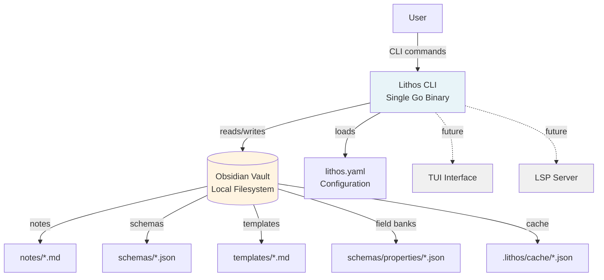

# High Level Architecture

## Technical Summary

Lithos employs a **Hexagonal Architecture (Ports & Adapters)** pattern built as a single-binary Go CLI application. The core domain logic (template engine, schema system, validator) remains pure and framework-agnostic, depending only on port interfaces it defines. External concerns (CLI framework, file I/O, interactive UI) are implemented as adapters that plug into these ports. This architecture directly supports the PRD's "Interface-Driven Architecture" principle, enables trivial testing through adapter substitution, and naturally accommodates the post-MVP roadmap where multiple adapters (CLI, TUI, LSP server) will interact with the same core logic.

## High Level Overview

**Architectural Style:** Hexagonal Architecture (Ports & Adapters)

The system is organized around a **pure domain core** containing all business logic for template processing, schema validation, and note generation. This core defines port interfaces for external dependencies (storage, user interaction, file system). **Adapters** implement these ports using specific technologies (Cobra CLI, file-based cache, PromptUI). The core never depends on adapters; dependency arrows point inward toward the domain.

**Repository Structure:** Single Repository (Monorepo)

The project uses a **single Git repository** containing the Go application source code, test data vault (`testdata/`), and supporting documentation. This aligns with the PRD's MVP scope and solo developer resource constraint.

**Service Architecture:** Monolithic Binary

A **self-contained Go binary** with no external runtime dependencies, distributed as platform-specific executables (macOS x86_64/ARM64, Linux x86_64/ARM64, Windows x86_64). The hexagonal core compiles alongside its adapters into one binary for the MVP; the architecture supports future distribution as a library (Go module) post-MVP.

### Primary User Interaction Flow

1. **CLI Adapter** (Cobra) receives command (`lithos new`, `find`, `index`)
2. **Configuration Adapter** (Viper) loads `lithos.yaml` via FileSystem port
3. **Core Domain** orchestrates:
   - Template Engine loads template via FileSystem port
   - Executes template, calling Interactive port for prompts/suggesters
   - Query Engine retrieves vault data via Storage port
   - Validator checks output via Schema port
4. **FileSystem Adapter** writes generated note to vault
5. **CLI Adapter** displays confirmation or errors to user

### Key Architectural Decisions

- **Hexagonal Over Layered:** Chosen to isolate domain logic from framework churn (Cobra today, TUI tomorrow). Aligns with PRD Technical Assumptions: "Interface-Driven Architecture" and post-MVP vision (Phase 4: LSP, TUI). The slight upfront cost of defining ports is justified by the PRD's explicit future roadmap.

- **Ports Defined by Core:** The domain defines port interfaces for what it needs (storage, user interaction, file operations), not what adapters provide. This prevents core logic from coupling to adapter implementation details (e.g., core doesn't know about CLI framework specifics or UI library styling).

- **Domain Uses Abstract Identifiers:** Core domain uses abstract identifiers rather than infrastructure-specific references (filesystem paths, database keys). Adapters translate between domain identifiers and infrastructure concerns. This decouples domain from storage implementation.

- **Single Binary for MVP:** While hexagonal architecture supports distributed systems, the PRD requires "single standalone binary" (NFR2). All adapters compile with the core. Future: Core could be extracted as a Go module consumed by multiple binaries (CLI, LSP server, TUI).

- **Test Adapters as First-Class Citizens:** Test infrastructure is implemented as test adapters. Production code and test code use the same ports, eliminating the need for mocking frameworks.

- **True CQRS for Storage Layer:** CQRS (Command Query Responsibility Segregation) separates write operations from read operations with distinct models and optimization strategies. Write operations optimize for validation and data integrity. Read operations use denormalized data with in-memory indices for fast queries. Synchronization service keeps read model consistent with write model. This provides independent scaling, multiple specialized indices, and supports future event sourcing.

## High Level Project Diagram



**System Boundaries:**

- **Lithos CLI:** Single standalone Go binary, runs locally on user's machine
- **Obsidian Vault:** Local directory containing markdown notes, JSON schemas, and templates
- **No External Services:** Entirely local operation, no network dependencies for MVP

**Data Flow:**

1. User invokes CLI commands (`lithos new`, `lithos index`, `lithos find`)
2. Lithos reads configuration from `lithos.yaml` (with defaults if not present)
3. Lithos reads templates, schemas, and field banks from vault
4. Lithos generates notes with user interaction (prompts, fuzzy finding)
5. Lithos writes generated notes and cache to vault
6. Lithos validates notes against schemas

**Future Integrations (Post-MVP):**

- TUI interface for terminal-based knowledge management
- LSP server for IDE integration with VS Code, NeoVim

## Architectural and Design Patterns

**1. Hexagonal Architecture (Ports & Adapters)**

*Core domain defines port interfaces; external adapters implement them*

- **Rationale:** Isolates business logic from framework changes. When Phase 4 adds TUI (post-MVP), only a new primary adapter is needed—core remains untouched. Aligns with PRD principle: "Interface-Driven Architecture" and enables trivial testing (swap production adapters for test doubles). → *(Supports Post-MVP Vision: TUI, LSP, Logseq integration)*

*Note: Each port naturally enables the Strategy Pattern—multiple adapter implementations can be swapped at runtime (e.g., production PromptUIAdapter vs. test MockInteractiveAdapter for the InteractivePort).*

**2. Repository Pattern (via StoragePort)**

*StoragePort interface abstracts vault indexing and cache access*

- **Rationale:** Decouples query/indexing logic from storage implementation. Epic 3 uses hybrid BoltDB (hot cache <1ms) + SQLite (deep storage <50ms) architecture. Post-Epic 3 can add additional storage systems without changing core. PRD Technical Assumptions explicitly require: "Storage must be implemented behind interface." → *(Epic 3 Course Correction)*

**3. Dependency Injection (Constructor-Based)**

*CLI adapter layer constructs concrete adapter instances and injects them into core components via constructors*

- **Rationale:** Core remains framework-agnostic and doesn't import adapter packages. Enables test seams—unit tests construct core components with mock adapters instead of production ones. No DI framework needed; Go's constructor pattern (`NewTemplateEngine(storage StoragePort, interactive InteractivePort)`) is sufficient for MVP scope. → *(Epic 1.1/4.1: Test harness uses injected mock adapters)*

**4. Builder Pattern (Schema Inheritance Resolution)**

*Schema system resolves inheritance chains (C extends B extends A) into flattened schemas*

- **Rationale:** Simplifies multi-level inheritance while detecting circular dependencies at load time (fail-fast). Immutable source schemas remain unchanged; builder creates resolved copies. → *(Epic 2, Stories 2.5-2.6: Multi-level inheritance + circular detection)*

**5. CQRS (Command Query Responsibility Segregation)**

*Separation of write model and read model with distinct optimization strategies*

- **Rationale:** Data indexing (write) and data querying (read) have fundamentally different optimization needs. The separation is in both **models** (separate structures for writes vs reads) and **operations** (distinct port interfaces). Write model optimizes for validation and data integrity - enforces business rules and maintains canonical representation. Read model optimizes for queries - denormalized with pre-built indices. Synchronization service keeps models consistent. This true CQRS provides independent scaling, multiple specialized indices, and supports future event sourcing. → *(Epic 3: Vault indexing, Epic 4: Template queries)*

*Note: The CQRS pattern future-proofs for larger datasets. Write side can add validation caching and batch processing. Read side can maintain multiple projections optimized for different query patterns without impacting write performance.*

**6. Unit of Work Pattern**

*Coordinates transactional writes across multiple storage systems with atomicity guarantees*

- **Rationale:** Hybrid storage architecture (BoltDB + SQLite) requires coordinated writes to maintain consistency. CacheUnitOfWork ensures both storage systems are updated atomically - if either write fails, both are rolled back. Prevents partial writes (note in BoltDB but not SQLite, or vice versa). Enables two-phase commit with automatic rollback on context cancellation. Foundation for future saga pattern if eventual consistency needed. → *(Epic 3, Story 3.22: CacheUnitOfWork implementation)*

*Note: Unit of Work simplifies VaultIndexer by extracting transaction coordination logic. Future storage system additions (e.g., Redis cache) only require updating CacheUnitOfWork, not business logic.*

**7. Singleton Pattern**

*Ensures single instance of critical resources with thread-safe initialization*

- **Rationale:** Config and PropertyBank are loaded once at application startup and never modified. Using `sync.Once` ensures thread-safe initialization even with concurrent goroutines. Prevents duplicate loading of schemas/properties from disk. Guarantees consistent state across all domain services - all services see the same Config/PropertyBank instance. Go's `sync.Once` provides race-free initialization without global variables. → *(Story 3.28: Singleton Pattern Implementation)*

**Implementation Details:**

- **Double-Checked Locking:** Uses `sync.RWMutex` with `sync.Once` for optimal performance
  - Fast path: `RLock` check if instance exists (no blocking for concurrent readers)
  - Slow path: `sync.Once` initialization (executed exactly once)
  - Minimal lock contention after initialization

- **Thread-Safety Guarantees:**
  - `sync.Once` ensures initialization happens exactly once
  - No data races even with 100+ concurrent goroutines
  - Verified with Go race detector (`go test -race`)

- **Test Isolation:**
  - `SetInstanceForTesting()` allows custom instances for tests
  - `ResetConfigForTesting()` / `ResetPropertyBankForTesting()` for cleanup
  - Enables independent parallel test execution
  - Prevents global state pollution across test suites

**API:**
```go
// Config singleton
cfg := config.Instance()                    // Thread-safe accessor
config.SetInstanceForTesting(&customCfg)    // Test isolation
defer config.ResetConfigForTesting()        // Test cleanup

// PropertyBank singleton
bank := propertybank.PropertyBankInstance()              // Thread-safe accessor
propertybank.SetPropertyBankForTesting(customBank)       // Test isolation
defer propertybank.ResetPropertyBankForTesting()         // Test cleanup
```

*Note: Singleton pattern is limited to immutable resources loaded at startup (Config, PropertyBank). Runtime state (indexes, caches) uses different concurrency patterns (sync.RWMutex for read-heavy access). Future DI container (Story 3.30) will provide singleton instances to services via dependency injection.*

**8. Factory Pattern**

*Centralizes object construction with validation and initialization logic*

- **Rationale:** Domain model constructors (`NewVaultFile`, `NewSchema`, `NewProperty`) encapsulate complex initialization and validation. Ensures all domain objects are valid at creation time (fail-fast). Computed fields (Basename, Folder, MimeType) calculated once during construction and cached in struct. Prevents invalid objects from entering the domain. Go's exported constructor functions (`New*`) serve as factories without requiring separate factory classes. → *(All domain models use factory constructors per data-models.md)*

*Note: Factory pattern enables future builder pattern for complex objects. Factories can be enhanced with fluent interfaces or builder pattern without changing client code.*

**9. DTO Pattern (Layered Architecture)**

*Data transfer objects with layered architecture for different use cases*

- **Rationale:** VaultFile uses 3-layer DTO architecture to address multiple concerns: (Layer 1) Eliminate field duplication by leveraging Go stdlib `fs.FileInfo`, (Layer 2) Separate metadata-only from full content for memory efficiency, (Layer 3) Provide storage-specific DTOs optimized for BoltDB hot cache and SQLite deep storage. Each layer solves specific problem: Layer 1 eliminates duplication, Layer 2 enables memory-efficient scanning, Layer 3 optimizes for storage system. Migration path from current implementation to full layered architecture. → *(Epic 3, Story 3.17: VaultFile DTO redesign)*

*Note: Layered DTO pattern is more nuanced than traditional DTO. Each layer builds on previous layer, enabling progressive enhancement. Services choose appropriate layer based on needs (metadata-only vs with-content vs storage-specific).*

## Design Principles

**Dependency Inversion Principle (DIP):** High-level domain modules depend on abstractions (ports), not concrete adapters. Adapters import core packages and implement port interfaces; core never imports adapters. Enables independent evolution—replace frameworks by swapping adapters. Prevents Go import cycles (mandatory for clean hexagonal architecture).

**Lean Ports:** Port interfaces have 2-5 focused methods representing specific service needs. Adapters handle infrastructure complexity. Prevents God Object ports and interface bloat.

**Interface Segregation Principle (ISP):** Separate interfaces for different concerns even when same adapter implements multiple interfaces. Read operations separate from write operations. User interaction separate from file operations. Services depend only on interfaces they need.

**Lean Domain Models:** Domain models contain only essential data with no behavior or infrastructure dependencies. Complex operations implemented in domain services. Models are pure data structures that can be easily serialized, tested, and composed.

**CQRS with Separate Models:** Write and read concerns use distinct models optimized for their respective purposes. Write models enforce validation and business rules. Read models denormalized for query performance. Synchronization layer keeps models consistent.

**Dependency Injection via main.go:** All dependency wiring happens in application entry point using constructor injection. Infrastructure built first, then domain services, then application services, finally adapters. No DI framework needed—pure Go constructors. See detailed DI pattern documentation in Components section.

**Idiomatic Go Error Handling:** Standard `(T, error)` return signatures throughout. Domain-specific error types implement standard `error` interface. Error wrapping using `fmt.Errorf("context: %w", err)` for proper unwrapping with `errors.Is()` and `errors.As()`.

---

## Orchestration Pattern Decision

**Epic 3 Decision (Story 3.30):** Implement **Event-Driven Architecture** for Epic 3 to eliminate god-objects and enable clean CQRS separation.

### Decision Rationale

**Problem Identified:** Orchestrator pattern attempted (CLICommander) resulted in god-objects:
- CLICommander: 7 dependencies (cliAdapter, templateEngine, schemaEngine, vaultIndexer, vaultWriter, cfg, log)
- VaultIndexer: 7 dependencies (vaultScanner, cacheWriter, cacheReader, frontmatterService, schemaEngine, cfg, log)
- Pattern: Each service becoming mini-orchestrator → multiple god-objects spreading

**Solution:** Event-driven architecture decouples services through domain events, eliminating direct dependencies and god-object proliferation.

### Event-Driven Architecture Implementation

**Pattern Characteristics:**
- **Decoupled components:** Services publish events, subscribers react independently
- **Asynchronous execution:** Events processed asynchronously with eventual consistency
- **Event bus infrastructure:** Central message routing with pub/sub semantics
- **Multiple subscribers:** Same event triggers multiple reactions across services

**EventBus Interface:**

```go
type EventBus interface {
    Publish(ctx context.Context, event DomainEvent) error
    Subscribe(eventType string, handler EventHandler) error
    Unsubscribe(eventType string, handler EventHandler) error
}

type EventHandler func(ctx context.Context, event DomainEvent) error
```

**Domain Events (Epic 3 Active):**

```go
// Domain events implemented in Epic 3
type DomainEvent interface {
    EventType() string
    OccurredAt() time.Time
    AggregateID() string
}

// Indexing events
type NoteIndexed struct {
    NoteID      NoteID
    Path        string
    FileClass   string
    OccurredAt  time.Time
}

type VaultIndexingComplete struct {
    NotesIndexed int
    Duration     time.Duration
    OccurredAt   time.Time
}

// Validation events
type FrontmatterValidated struct {
    NoteID       NoteID
    SchemaName   string
    IsValid      bool
    Errors       []ValidationError
    OccurredAt   time.Time
}

// Configuration events
type SchemaLoaded struct {
    SchemaName   string
    PropertyCount int
    OccurredAt   time.Time
}

type SchemasReloaded struct {
    SchemaCount  int
    OccurredAt   time.Time
}
```

**Publisher/Subscriber Architecture:**

**Publishers:**
- VaultIndexer publishes `NoteIndexed` (after each note) and `VaultIndexingComplete` (after full scan)
- FrontmatterService publishes `FrontmatterValidated` (after validation)
- SchemaEngine publishes `SchemaLoaded`/`SchemasReloaded` (schema lifecycle)

**Subscribers:**
- VaultIndexer subscribes to `NoteIndexed` → updates cache indices
- QueryService subscribes to `VaultIndexingComplete` → rebuilds in-memory query structures
- MetricsService subscribes to `FrontmatterValidated` → validation statistics

**God-Object Elimination:**
- CLICommander no longer directly calls services → publishes command events instead
- VaultIndexer dependency count reduced → publishes events instead of calling services
- Services communicate via events → no direct coupling

**CQRS Alignment:**
- Command side (write): VaultIndexer publishes events after writes
- Query side (read): QueryService subscribes to events, rebuilds indices asynchronously
- RefreshFromCache() removed from QueryService (was CQRS violation)

**Event-Driven Benefits for Epic 3:**
- **Reduced coupling:** Services don't directly depend on each other
- **Independent evolution:** Add new event subscribers without modifying publishers
- **CQRS separation:** Clean command/query split via events
- **God-object elimination:** Services communicate via events, not direct dependencies
- **Testability:** Mock EventBus for unit tests, test event flows independently

**Event-Driven Trade-offs:**
- **Infrastructure complexity:** EventBus, message routing, subscription management
- **Debugging difficulty:** Asynchronous execution harder to trace than sequential calls
- **Eventual consistency:** Subscribers process events with delay (mitigated by synchronous dispatch for critical events)
- **Testing complexity:** Event flow testing in addition to method call testing

**Epic 3 Implementation Strategy:**

1. **Story 3.30:** Implement EventBus infrastructure with in-memory goroutine-based dispatch
2. **Service Refactoring:** Refactor services to publish/subscribe events instead of direct calls
3. **CQRS Compliance:** Remove write operations from QueryService (subscribe to events only)
4. **Performance Validation:** Event overhead < 5ms per event (acceptable for consistency benefits)

### Implementation Status (Story 3.30 - Complete)

**EventBus Implementation (`internal/app/events/bus.go`):**
- In-memory pub/sub with async goroutine-based dispatch
- Worker pool pattern with configurable worker count (default: 10)
- Thread-safe handler registry using `sync.RWMutex`
- Error isolation: Failed handlers don't block other subscribers
- Graceful shutdown with context cancellation and worker termination
- Structured logging for all publishes and handler executions

**Domain Events (`internal/domain/events.go`):**
- Implemented 6 event types with immutable payloads
- Constructor validation ensures event integrity
- Must* constructors for convenience (panic on invalid construction)
- Defensive copies of slices/maps to prevent external mutation

**Service Integration:**
- `VaultIndexer`: Publishes `NoteIndexed`, `VaultIndexingComplete`; Subscribes to `CommandIssuedEvent`
- `FrontmatterService`: Publishes `FrontmatterValidated`
- `SchemaEngine`: Publishes `SchemaLoaded`, `SchemasReloaded`
- `QueryService`: Subscribes to `VaultIndexingComplete` for cache invalidation
- `MetricsService`: New service subscribing to `FrontmatterValidated` for validation stats

**God-Object Elimination Results:**
- CLICommander now publishes `CommandIssuedEvent` instead of calling VaultIndexer directly
- VaultIndexer reduced from direct service calls to event-driven coordination
- Services communicate through EventBus, eliminating direct coupling

**CQRS Verification:**
- QueryService is strictly read-only (all write operations removed in Story 3.22)
- QueryService subscribes to events for cache invalidation (no direct refresh calls)
- VaultIndexer is command-side (writes + publishes events)

**Test Coverage:**
- EventBus: 84.2% coverage with concurrency tests
- MetricsService: 94.1% coverage with thread-safety verification
- All integration tests passing with event-driven flows

---
