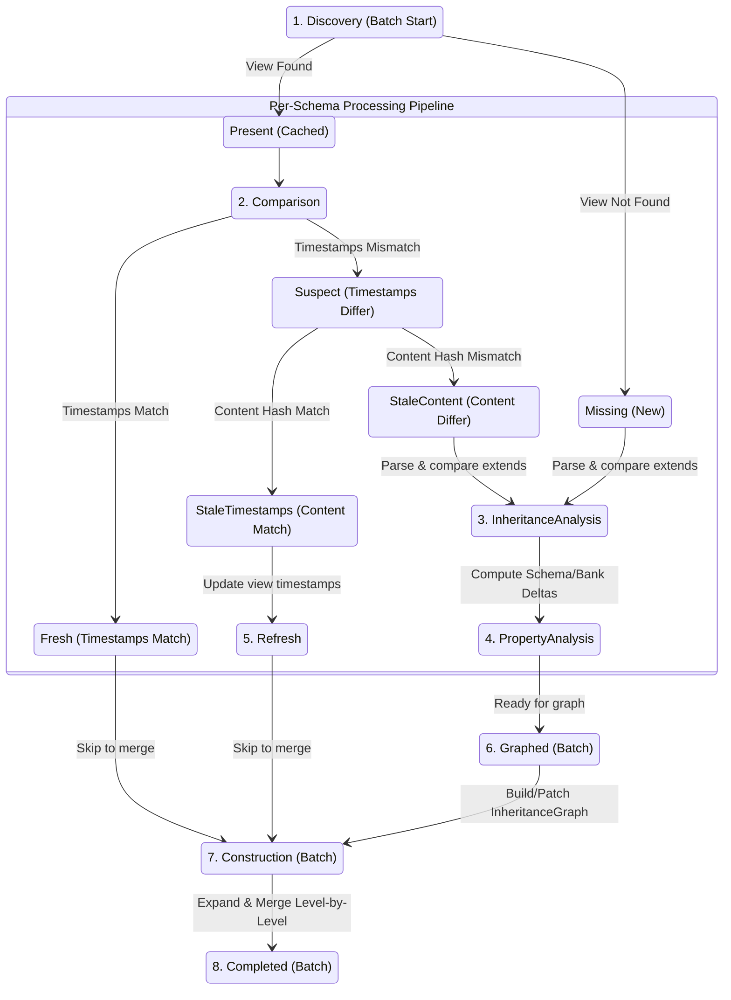

# Schema Pipeline Typestate Redesign (DEFINITIVE)

**Date**: 2026-03-27
**Status**: **READY FOR IMPLEMENTATION**
**Purpose**: Authoritative specification for the schema pipeline typestate state machine

---

## Table of Contents

1. [Executive Summary](#executive-summary)
2. [Architecture Overview](#architecture-overview)
3. [Complete Stage Taxonomy](#complete-stage-taxonomy)
4. [Status Types and Data](#status-types-and-data)
5. [Branching Enums](#branching-enums)
6. [Delta Structures](#delta-structures)
7. [Processing Flow Diagrams](#processing-flow-diagrams)
8. [Per-Schema vs Batch Operations](#per-schema-vs-batch-operations)
9. [Code Skeleton Examples](#code-skeleton-examples)
10. [Quick Reference Tables](#quick-reference-tables)
11. [Migration Guide](#migration-guide)

---

## Executive Summary

The schema pipeline implements a **hybrid typestate state machine** combining per-schema processing with batch operations. It follows the same pattern as `PropertyBankProcessor` but handles the complexity of:

- **Multiple schemas** processed in parallel with different staleness levels
- **Global operations** (graph building, inheritance resolution) that require coordination
- **Level-by-level processing** with incremental optimizations

### Key Design Decisions

1. **8 Stages** with clear stage + status dimensions (following PropertyBankProcessor pattern)
2. **Per-schema state machine** for stages 1-5 (Discovery → PropertyAnalysis)
3. **Batch orchestration** for stages 6-8 (Graphed → Completed)
4. **Explicit branching enums** at every decision point (`#[must_use]`)
5. **Refresh stage** for early metadata persistence (matching PropertyBank)
6. **Construction status names**: `Fresh`, `Changed`, `New` (matching PropertyBank terminology)

---

## Architecture Overview

### Design Philosophy

**Hybrid Per-Schema + Batch Model**:

```
┌─────────────────────────────────────────────────────────────┐
│  PER-SCHEMA PROCESSING (Stages 1-5)                        │
│  Each schema flows independently through its own pipeline   │
│                                                             │
│  Discovery → Comparison → InheritanceAnalysis →            │
│      PropertyAnalysis → (Refresh if needed)                │
└──────────────────────┬──────────────────────────────────────┘
                       │
                       ↓ Collect all analyzed schemas
┌─────────────────────────────────────────────────────────────┐
│  BATCH PROCESSING (Stages 6-8)                             │
│  All schemas processed together with coordination          │
│                                                             │
│  Graphed → Construction → Completed                        │
└─────────────────────────────────────────────────────────────┘
```

**Why Hybrid?**

- **Per-schema** (stages 1-5): Independent operations benefit from early branching
- **Batch** (stage 6): Graph building requires global view of all relationships
- **Batch with per-schema branching** (stages 7-8): Level-by-level processing with fresh schema skipping

### Comparison to PropertyBank

| Aspect | PropertyBank | Schema Pipeline |
|--------|-------------|-----------------|
| **Processing Model** | Single file | Multiple files (hybrid) |
| **Stage Count** | 6 | 8 |
| **Branching Paths** | 4 (NEW/FreshTS/FreshContent/STALE) | Same per-schema, then batch |
| **Refresh Stage** | Yes (timestamps + content hash) | Yes (same pattern) |
| **Status Names** | Fresh/New/Changed | Fresh/New/Changed (aligned) |
| **Dependencies** | None | PropertyBank + inter-schema |

---

## Complete Stage Taxonomy

### Stage Sequence

```
1. Discovery        (batch start, per-schema branch)
   ↓
2. Comparison       (per-schema: timestamp + hash checks)
   ↓
3. InheritanceAnalysis  (per-schema: extends/excludes delta)
   ↓
4. PropertyAnalysis (per-schema: schema + bank ref delta)
   ↓
5. Refresh          (per-schema: early metadata persistence)
   ↓
   [Collect all schemas ready for batch processing]
   ↓
6. Graphed          (batch: build InheritanceGraph)
   ↓
7. Construction     (batch: level-by-level expand + merge)
   ↓
8. Completed        (batch: persist all schemas)
```

### Stage Descriptions

#### Stage 1: Discovery (Batch Start, Per-Schema Branch)

**Purpose**: Initialize batch processing, query DB, detect deletions, branch schemas into pipelines

**Scope**: Batch operation producing per-schema pipelines

**Operations**:
1. Scan schema directory (excluding `property_bank` file)
2. Batch query: Load all `RawSchemaView`s from DB (`find_raw_schema_views_by_paths`)
3. Build global indexes: `name_to_id`, `id_to_name` from DB data
4. Detect deleted schemas: Schemas in DB but not on filesystem
5. Check PropertyBank staleness (from upstream `PropertyBankProcessor`)
6. For each schema file: timestamp check, determine branch path
7. Produce: `Vec<SchemaProcessor<Comparison, Status>>` (one per file)

**Outputs**:
- `Vec<DiscoveryBranch>` (one per schema)
- Global context: `name_to_id`, `id_to_name`, deleted schema IDs, PropertyBank delta

**Errors**: `SchemaRepositoryError`, `SchemaFileError`

---

#### Stage 2: Comparison (Per-Schema)

**Purpose**: Compare timestamps and content hashes to determine staleness level

**Scope**: Per-schema operation (independent)

**Operations**:
1. **Timestamp check** (fast path):
   - Compare file timestamps with `RawSchemaView.file_times`
   - If match → `Fresh` status → skip to Construction
   - If mismatch → proceed to content hash check
2. **Content hash check** (slow path):
   - Read file content
   - Compute `blake3::hash(content)`
   - Compare with `RawSchemaView.hashes.content`
   - If match → `StaleTimestamps` → Refresh stage
   - If mismatch → `StaleContent` → PropertyAnalysis stage

**Outputs**: `ComparisonBranch::Fresh | Suspect`

**Errors**: `SchemaFileError` (if file read fails)

---

#### Stage 3: InheritanceAnalysis (Per-Schema)

**Purpose**: Compute extends and excludes deltas to determine if graph rebuild is needed

**Scope**: Per-schema with global context (needs `name_to_id` map)

**Operations**:
1. **Extract old metadata** from `RawSchemaView`:
   - `old_extends = view.current().extends()`
   - `old_excludes = view.current().excludes()`
2. **Parse new schema** (if `StaleContent`):
   - Parse file into `RawSchema`
   - Extract `new_extends = raw.extends()`
   - Extract `new_excludes = raw.excludes()`
3. **Compute ExtendsDelta**:
   - Compare old vs new parent
   - If different → schema structurally stale
4. **Verify parent exists** (if `new_extends.is_some()`):
   - Check `name_to_id.contains_key(new_extends)`
   - Error if parent not found
5. **Compute ExcludesDelta**:
   - `added = new_excludes - old_excludes`
   - `removed = old_excludes - new_excludes`

**Outputs**: `InheritanceBranch::Unchanged | Changed`

**Carried Data in Changed**:
```rust
pub struct Changed {
    pub extends_delta: ExtendsDelta,
    pub new_schema_ids: Vec<SchemaId>,  // Only for NEW schemas
}
```

**Errors**: `SchemaError::Inheritance(ParentNotFound)`

---

#### Stage 4: PropertyAnalysis (Per-Schema)

**Purpose**: Compute property-level deltas and bank reference deltas

**Scope**: Per-schema with global context (needs PropertyBank delta)

**Operations**:
1. **Compute SchemaPropertyDelta** (if `StaleContent`):
   - Parse `RawSchema.properties` (if not already parsed)
   - Compute per-property hashes
   - Compare with `RawSchemaView.hashes.properties`
   - Partition into: new, modified, removed
2. **Compute BankReferenceDelta** (if PropertyBank is stale):
   - Load `bank_references` from `RawSchemaView.bank_references`
   - Intersect with `PropertyBank.PropertyDelta.changed`
   - Result: Set of schema properties needing re-expansion
3. **Compute ExcludesDelta**:
   - Compare old vs new `excludes` lists
   - Partition into: added, removed

**Outputs**: `PropertyAnalysisBranch::Unchanged | Changed`

**Carried Data in Changed**:
```rust
pub struct Changed {
    pub schema_delta: SchemaDelta,           // Property changes
    pub bank_ref_delta: BankReferenceDelta,  // Affected bank refs
    pub excludes_delta: ExcludesDelta,       // Excludes changes
}
```

**Errors**: None (pure computation)

---

#### Stage 5: Refresh (Per-Schema)

**Purpose**: Early-persist metadata updates when only timestamps or content hash changed

**Scope**: Per-schema operation

**Entry Conditions**:
- **StaleTimestamps**: Content hash matches, timestamps differ
- **StaleContent**: Property hashes match, content hash differs

**Operations**:
1. **For StaleTimestamps**:
   - Update `RawSchemaView` file times
   - Persist view to DB
   - Transition to `Construction<Fresh>` (retrieve cached schema from DB)
2. **For StaleContent**:
   - Rebuild `SchemaVersion` from `RawSchema` (re-compute property hashes)
   - Update file times + content hash
   - Persist view to DB
   - Transition to `Construction<Fresh>` (retrieve cached schema from DB)

**Outputs**: `SchemaProcessor<Construction, Fresh>`

**Errors**: `SchemaRepositoryError`

**Why Separate Stage?**: Matches PropertyBank pattern - early checkpoint avoids re-parsing on retry

---

#### Stage 6: Graphed (Batch)

**Purpose**: Build or incrementally update the `InheritanceGraph` with structural validation

**Scope**: Batch operation (requires all schema relationships)

**Inputs**:
- All schemas from PropertyAnalysis (with their `ExtendsDelta`)
- Fresh schemas (IDs only, from DB)
- Global context: `name_to_id`, `id_to_name`

**Operations**:
1. **Determine graph strategy**:
   - All extends unchanged + no new schemas → **Reuse**: Load graph from DB
   - Has new schemas → **Insert**: Add new nodes, revalidate affected subtrees
   - Has extends changes → **Patch**: Rewire edges, recompute affected depths
2. **Build InheritanceGraph** (lightweight structure):
   ```rust
   pub struct InheritanceGraph {
       order: Vec<SchemaId>,              // Topologically sorted
       nodes: HashMap<SchemaId, InheritanceNode>,
   }

   pub struct InheritanceNode {
       id: SchemaId,
       name: SchemaName,
       parent_id: Option<SchemaId>,
       children: Vec<SchemaId>,
       depth: usize,
       excludes: Vec<PropertyName>,
       // NO properties yet!
   }
   ```
3. **Structural validation**:
   - Cycle detection (DFS)
   - Parent existence verification
   - Depth limit check (max 10 levels)
   - **FAIL FAST** on errors

**Outputs**: `GraphBranch::GraphFresh | GraphPatched`

**Carried Data**:
- `InheritanceGraph` (topologically ordered)
- Affected subtree IDs (for incremental optimization)

**Errors**: `SchemaError::Inheritance(CircularInheritance, DepthExceeded, ParentNotFound)`

**Why Batch?**: Graph building requires global view of all relationships; cycle detection crosses boundaries

---

#### Stage 7: Construction (Batch with Per-Schema Branching)

**Purpose**: Expand $refs and merge properties level-by-level with incremental optimizations

**Scope**: Batch orchestration with per-schema branching logic

**Operations** (level-by-level in topological order):

For each level L:
  For each schema S at level L:
    1. **Determine construction path**:
       - `Fresh` schemas with `Fresh` parents → Retrieve from DB (skip everything)
       - `Changed` schemas → Full ref expansion + property merging
       - `New` schemas → Full ref expansion + property merging

    2. **Ref expansion** (for Changed/New only):
       - If `BankReferenceDelta` non-empty → Re-expand affected properties
       - If `SchemaPropertyDelta` non-empty → Expand new/modified properties
       - Update `expanded_properties` cache

    3. **Property merging** (for Changed/New, or Fresh with stale parent):
       - Get parent's already-resolved properties (from cache or DB)
       - Merge child's expanded properties (child overrides parent)
       - Apply excludes list (skip excluded parent properties)
       - Result: `HashMap<PropertyName, Property>`

    4. **Construct Schema**:
       - `Schema::new(id, name, parent_id, children, merged_properties)`

    5. **Cache for child levels**:
       - Store resolved schema for children to use

**Outputs**: `ConstructionBranch::Fresh | Changed | New`

**Carried Data**:
- `Vec<Schema>` (fully resolved with inheritance)

**Errors**: `SchemaError::Resolution(PropertyRefError)`, `SchemaError::Inheritance(DepthExceeded)`

**Why Batch?**: Level-by-level processing requires coordination; parent-child dependencies

---

#### Stage 8: Completed (Batch)

**Purpose**: Persist all schemas and metadata to DB

**Scope**: Batch operation

**Operations**:
1. **Persist schemas**: `repository.save_schemas(&schemas)`
2. **Persist inheritance metadata** (for each schema):
   ```rust
   pub struct SchemaInheritanceView {
       parent: Option<SchemaId>,
       ancestors: Vec<SchemaId>,
       depth: usize,  // Pre-computed
       ancestors_hash: u64,
       resolved_at: SystemTime,
   }
   ```
3. **Update descendants index**: `SCHEMA_DESCENDANTS` multimap (for BFS traversal)
4. **Cleanup deleted schemas**: Remove from all tables

**Outputs**: `Vec<Schema>` (final)

**Errors**: `SchemaRepositoryError::Storage`

---

## Status Types and Data

### Discovery Stage Statuses

#### `Unknown`

**Zero-sized marker** - Initial state before any knowledge gathered.

```rust
#[derive(Debug)]
pub(crate) struct Unknown;
```

**Invariants**: None

---

#### `Missing`

**Schema file exists but no cached view in DB** - NEW schema path.

```rust
#[derive(Debug)]
pub(crate) struct Missing {
    pub(crate) id: SchemaId,           // Newly generated
    pub(crate) times: RawFileTimes,    // From filesystem
}
```

**Invariants**:
- `id` is freshly generated `SchemaId::new()` (UUID v7)
- File exists on filesystem
- No corresponding entry in DB

---

#### `Present`

**Cached view exists** - schema has been processed before.

```rust
#[derive(Debug)]
pub(crate) struct Present {
    pub(crate) id: SchemaId,
    pub(crate) times: RawFileTimes,
    pub(crate) view: RawSchemaView,
}
```

**Invariants**:
- `view` loaded from DB via `find_raw_schema_view_by_path`
- `id` matches view's schema ID
- File still exists on filesystem

---

### Comparison Stage Statuses

#### `Fresh`

**Timestamps and content hash both match** - schema completely up-to-date.

```rust
#[derive(Debug)]
pub(crate) struct Fresh {
    pub(crate) id: SchemaId,
}
```

**Invariants**:
- Timestamps match: `view.current().file_times().is_timestamp_match(times)`
- No file I/O needed beyond stat check
- Can skip directly to Construction (retrieve from DB)

---

#### `Suspect`

**Timestamps mismatch** - need content hash check to determine actual staleness.

```rust
#[derive(Debug)]
pub(crate) struct Suspect {
    pub(crate) id: SchemaId,
    pub(crate) times: RawFileTimes,
    pub(crate) view: RawSchemaView,
    pub(crate) content: String,  // File content retained for hash check
}
```

**Invariants**:
- Timestamps differ from cached view
- File content loaded (needed for hash computation)
- Not yet determined if content actually changed

---

### Refresh Stage Statuses

#### `StaleTimestamps`

**Content hash matches, timestamps differ** - clock skew or file touch.

```rust
#[derive(Debug)]
pub(crate) struct StaleTimestamps {
    pub(crate) id: SchemaId,
    pub(crate) view: RawSchemaView,
    pub(crate) times: RawFileTimes,
}
```

**Invariants**:
- Content hash matches: `view.current().hashes().is_content_match(hash)`
- Only timestamps need updating
- Schema domain object unchanged (can fetch from DB)

---

#### `StaleContent`

**Property hashes match, content hash differs** - comments or formatting changed.

```rust
#[derive(Debug)]
pub(crate) struct StaleContent {
    pub(crate) id: SchemaId,
    pub(crate) view: RawSchemaView,
    pub(crate) times: RawFileTimes,
    pub(crate) content_hash: [u8; 32],
}
```

**Invariants**:
- Content hash differs
- Property hashes match (no semantic changes)
- Schema domain object unchanged (can fetch from DB)

---

### InheritanceAnalysis Stage Statuses

#### `Unchanged`

**No inheritance changes** - extends and excludes are identical.

```rust
#[derive(Debug)]
pub(crate) struct Unchanged {
    pub(crate) id: SchemaId,
}
```

**Invariants**:
- `extends` unchanged: `old_extends == new_extends`
- `excludes` unchanged: `old_excludes == new_excludes`
- No graph rebuild needed

---

#### `Changed`

**Inheritance structure changed** - extends or excludes differ.

```rust
#[derive(Debug)]
pub(crate) struct Changed {
    pub(crate) id: SchemaId,
    pub(crate) extends_delta: ExtendsDelta,
    pub(crate) excludes_delta: ExcludesDelta,
}
```

**Invariants**:
- At least one of: `extends_delta.changed()` or `excludes_delta.changed()`
- Graph rebuild or patch required

---

### PropertyAnalysis Stage Statuses

#### `Unchanged`

**No property or bank reference changes**.

```rust
#[derive(Debug)]
pub(crate) struct Unchanged {
    pub(crate) id: SchemaId,
    pub(crate) view: RawSchemaView,
}
```

**Invariants**:
- Schema properties unchanged
- Bank references unchanged OR PropertyBank fresh
- Can skip ref expansion

---

#### `Changed`

**Properties or bank references changed** - re-expansion needed.

```rust
#[derive(Debug)]
pub(crate) struct Changed {
    pub(crate) id: SchemaId,
    pub(crate) schema_delta: SchemaDelta,
    pub(crate) bank_ref_delta: BankReferenceDelta,
    pub(crate) excludes_delta: ExcludesDelta,
}
```

**Invariants**:
- At least one non-empty delta
- Ref expansion required for changed properties

---

### Graphed Stage Statuses

#### `GraphFresh`

**Reuse existing graph** - all inheritance unchanged.

```rust
#[derive(Debug)]
pub(crate) struct GraphFresh {
    pub(crate) graph: InheritanceGraph,
}
```

**Invariants**:
- All schemas have `extends` unchanged
- No new schemas
- Graph loaded from DB (O(1) operation)

---

#### `GraphPatched`

**Graph incrementally updated** - some inheritance changed.

```rust
#[derive(Debug)]
pub(crate) struct GraphPatched {
    pub(crate) graph: InheritanceGraph,
    pub(crate) affected_subtrees: Vec<SchemaId>,
}
```

**Invariants**:
- Some schemas have `extends` changed OR new schemas added
- Only affected subtrees revalidated
- Incremental update (O(S) where S = affected schemas)

---

### Construction Stage Statuses

#### `Fresh`

**Schema retrieved from DB** - no processing needed.

```rust
#[derive(Debug)]
pub(crate) struct Fresh {
    pub(crate) id: SchemaId,
}
```

**Invariants**:
- Schema properties unchanged
- Parent unchanged (or parent also fresh)
- Domain object fetched via `repository.find_schema_by_id(id)`

---

#### `Changed`

**Schema re-expanded and merged** - properties or parent changed.

```rust
#[derive(Debug)]
pub(crate) struct Changed {
    pub(crate) schema: Schema,
}
```

**Invariants**:
- Schema properties changed OR parent changed
- Ref expansion performed
- Properties merged with parent

---

#### `New`

**Schema built from scratch** - first time seeing this schema.

```rust
#[derive(Debug)]
pub(crate) struct New {
    pub(crate) schema: Schema,
}
```

**Invariants**:
- No cached view existed
- Full ref expansion performed
- SchemaId newly generated

---

### Completed Stage Status

#### `Ready`

**Final resolved schemas** - ready for delivery.

```rust
#[derive(Debug)]
pub(crate) struct Ready {
    pub(crate) schemas: Vec<Schema>,
}
```

**Invariants**:
- All schemas fully resolved with inheritance
- All schemas persisted to DB
- Inheritance metadata persisted

---

## Branching Enums

All branching enums are `#[must_use]` to force explicit handling.

### `DiscoveryBranch`

**Returned from**: `SchemaProcessor<Discovery, Unknown>::discover()`

```rust
#[derive(Debug)]
#[must_use = "branch outcomes must be handled"]
pub(crate) enum DiscoveryBranch {
    Missing(SchemaProcessor<Comparison, Missing>),
    Present(SchemaProcessor<Comparison, Present>),
}
```

**Decision Logic**:
- Query DB for `RawSchemaView`
- If `None` → `Missing`
- If `Some(view)` → `Present`

---

### `ComparisonBranch`

**Returned from**: `SchemaProcessor<Comparison, Present>::check_timestamps()`

```rust
#[derive(Debug)]
#[must_use = "branch outcomes must be handled"]
pub(crate) enum ComparisonBranch {
    Fresh(SchemaProcessor<Construction, Fresh>),
    Suspect(SchemaProcessor<Comparison, Suspect>),
}
```

**Decision Logic**:
- If timestamps match → `Fresh` (skip to Construction)
- If timestamps differ → `Suspect` (need content hash check)

---

### `ContentBranch`

**Returned from**: `SchemaProcessor<Comparison, Suspect>::check_content()`

```rust
#[derive(Debug)]
#[must_use = "branch outcomes must be handled"]
pub(crate) enum ContentBranch {
    StaleTimestamps(SchemaProcessor<Refresh, StaleTimestamps>),
    StaleContent(SchemaProcessor<PropertyAnalysis, Suspect>),
}
```

**Decision Logic**:
- Compute `blake3::hash(content)`
- If hash matches → `StaleTimestamps` (go to Refresh)
- If hash differs → `StaleContent` (go to PropertyAnalysis)

---

### `InheritanceBranch`

**Returned from**: `SchemaProcessor<InheritanceAnalysis, _>::analyze_inheritance()`

```rust
#[derive(Debug)]
#[must_use = "branch outcomes must be handled"]
pub(crate) enum InheritanceBranch {
    Unchanged(SchemaProcessor<PropertyAnalysis, Unchanged>),
    Changed(SchemaProcessor<PropertyAnalysis, Changed>),
}
```

**Decision Logic**:
- Compare `extends` old vs new
- Compare `excludes` old vs new
- If both unchanged → `Unchanged`
- If either changed → `Changed` (carries `ExtendsDelta` + `ExcludesDelta`)

---

### `PropertyAnalysisBranch`

**Returned from**: `SchemaProcessor<PropertyAnalysis, _>::analyze_properties()`

```rust
#[derive(Debug)]
#[must_use = "branch outcomes must be handled"]
pub(crate) enum PropertyAnalysisBranch {
    Unchanged(SchemaProcessor<Graphed, Unchanged>),
    Changed(SchemaProcessor<Graphed, Changed>),
}
```

**Decision Logic**:
- Compute `SchemaDelta` (property changes)
- Compute `BankReferenceDelta` (if PropertyBank stale)
- If both empty → `Unchanged`
- If either non-empty → `Changed`

---

### `GraphBranch`

**Returned from**: `GraphBuilder::build()` (batch operation)

```rust
#[derive(Debug)]
#[must_use = "branch outcomes must be handled"]
pub(crate) enum GraphBranch {
    GraphFresh(SchemaProcessor<Construction, Fresh>),
    GraphPatched(SchemaProcessor<Construction, Changed>),
}
```

**Decision Logic**:
- Check all schemas' `ExtendsDelta`
- If all unchanged + no new schemas → `GraphFresh`
- Otherwise → `GraphPatched`

---

### `ConstructionBranch`

**Returned from**: Level-by-level construction (per schema)

```rust
#[derive(Debug)]
#[must_use = "branch outcomes must be handled"]
pub(crate) enum ConstructionBranch {
    Fresh(SchemaProcessor<Completed, Ready>),
    Changed(SchemaProcessor<Completed, Ready>),
    New(SchemaProcessor<Completed, Ready>),
}
```

**Decision Logic** (per schema at each level):
- Schema `Fresh` + parent `Fresh` → `Fresh`
- Schema properties changed OR parent changed → `Changed`
- Schema is NEW → `New`

---

## Delta Structures

### `ExtendsDelta`

**Computed In**: InheritanceAnalysis stage

**Used In**: Graphed stage (determines graph rebuild strategy)

```rust
#[derive(Debug, Clone, PartialEq)]
pub(crate) struct ExtendsDelta {
    pub(crate) old_parent: Option<SchemaName>,
    pub(crate) new_parent: Option<SchemaName>,
}

impl ExtendsDelta {
    pub fn changed(&self) -> bool {
        self.old_parent != self.new_parent
    }
}
```

**Example**:
```rust
// Schema A previously extended B, now extends C
ExtendsDelta {
    old_parent: Some("schema_b".into()),
    new_parent: Some("schema_c".into()),
}

// Schema was root, now extends A
ExtendsDelta {
    old_parent: None,
    new_parent: Some("schema_a".into()),
}
```

---

### `ExcludesDelta`

**Computed In**: PropertyAnalysis stage

**Used In**: Construction stage (determines which parent properties to skip)

```rust
#[derive(Debug, Clone, PartialEq)]
pub(crate) struct ExcludesDelta {
    pub(crate) added: Vec<PropertyName>,
    pub(crate) removed: Vec<PropertyName>,
}

impl ExcludesDelta {
    pub fn changed(&self) -> bool {
        !self.added.is_empty() || !self.removed.is_empty()
    }
}
```

**Example**:
```rust
// Old excludes: ["prop_a", "prop_b"]
// New excludes: ["prop_b", "prop_c"]
ExcludesDelta {
    added: vec!["prop_c".into()],    // Now excluding prop_c
    removed: vec!["prop_a".into()],  // No longer excluding prop_a
}
```

---

### `SchemaDelta`

**Computed In**: PropertyAnalysis stage

**Used In**: Construction stage (determines which properties need ref expansion)

```rust
#[derive(Debug, Clone, PartialEq)]
pub(crate) struct SchemaDelta {
    pub(crate) new: HashSet<PropertyName>,
    pub(crate) modified: HashSet<PropertyName>,
    pub(crate) removed: HashSet<PropertyName>,
}

impl SchemaDelta {
    pub fn is_empty(&self) -> bool {
        self.new.is_empty() && self.modified.is_empty() && self.removed.is_empty()
    }

    pub fn affected_properties(&self) -> HashSet<PropertyName> {
        self.new.union(&self.modified).cloned().collect()
    }
}
```

---

### `BankReferenceDelta`

**Computed In**: PropertyAnalysis stage (only if PropertyBank is stale)

**Used In**: Construction stage (determines which properties need re-expansion due to bank changes)

```rust
#[derive(Debug, Clone, PartialEq)]
pub(crate) struct BankReferenceDelta {
    pub(crate) affected_properties: HashSet<PropertyName>,
}

impl BankReferenceDelta {
    pub fn from_intersection(
        bank_references: &HashMap<PropertyName, PropertyName>,
        property_delta: &PropertyDelta,
    ) -> Self {
        let affected = bank_references
            .iter()
            .filter(|(_, bank_prop)| property_delta.changed.contains(bank_prop))
            .map(|(schema_prop, _)| schema_prop.clone())
            .collect();

        Self { affected_properties: affected }
    }
}
```

---

## Processing Flow Diagrams

### Flow 1: NEW Schema (No Cached View)

```
START
  │
  ├─▶ Discovery
  │   └─▶ Query DB: RawSchemaView not found
  │       └─▶ Missing status (generate new SchemaId)
  │
  ├─▶ Comparison
  │   └─▶ (Skip - no cached view to compare)
  │
  ├─▶ InheritanceAnalysis
  │   ├─▶ Parse RawSchema from file
  │   ├─▶ Extract extends (verify parent exists)
  │   ├─▶ Extract excludes
  │   └─▶ Changed status (NEW schema)
  │
  ├─▶ PropertyAnalysis
  │   ├─▶ Compute SchemaDelta (all properties are new)
  │   ├─▶ Extract bank_references from $refs
  │   └─▶ Changed status
  │
  ├─▶ [Batch Boundary]
  │
  ├─▶ Graphed
  │   ├─▶ Insert new node into graph
  │   ├─▶ Validate parent exists
  │   ├─▶ Recompute depths for affected subtree
  │   └─▶ GraphPatched status
  │
  ├─▶ Construction
  │   ├─▶ Level-by-level processing:
  │   │   ├─▶ Expand all $refs against PropertyBank
  │   │   ├─▶ Get parent's merged properties (if parent exists)
  │   │   ├─▶ Merge: child properties + inherited parent properties
  │   │   └─▶ Apply excludes list
  │   └─▶ New status
  │
  └─▶ Completed
      ├─▶ Persist Schema to DB
      ├─▶ Persist RawSchemaView to DB
      ├─▶ Persist SchemaInheritanceView to DB
      └─▶ Update SCHEMA_DESCENDANTS index
          └─▶ END (Schema delivered)
```

---

### Flow 2: FRESH Schema + FRESH PropertyBank

```
START
  │
  ├─▶ Discovery
  │   └─▶ Query DB: RawSchemaView found
  │       └─▶ Present status
  │
  ├─▶ Comparison
  │   ├─▶ Check timestamps: MATCH
  │   └─▶ Fresh status → SKIP TO CONSTRUCTION
  │
  ├─▶ [Batch Boundary]
  │
  ├─▶ Graphed
  │   ├─▶ All schemas unchanged + no new schemas
  │   ├─▶ Load InheritanceGraph from DB
  │   └─▶ GraphFresh status
  │
  ├─▶ Construction
  │   ├─▶ Retrieve Schema from DB (no processing)
  │   └─▶ Fresh status
  │
  └─▶ Completed
      └─▶ No persistence needed (already up-to-date)
          └─▶ END (Schema delivered from cache)
```

---

### Flow 3: FRESH Schema + STALE PropertyBank

```
START
  │
  ├─▶ Discovery
  │   └─▶ Query DB: RawSchemaView found
  │       └─▶ Present status
  │
  ├─▶ Comparison
  │   ├─▶ Check timestamps: MATCH
  │   └─▶ Fresh status
  │
  ├─▶ InheritanceAnalysis
  │   ├─▶ extends unchanged
  │   ├─▶ excludes unchanged
  │   └─▶ Unchanged status
  │
  ├─▶ PropertyAnalysis
  │   ├─▶ SchemaDelta: empty (properties unchanged)
  │   ├─▶ BankReferenceDelta: compute intersection
  │   │   ├─▶ bank_references ∩ PropertyDelta.changed
  │   │   └─▶ Result: affected_properties = {prop_x, prop_y}
  │   └─▶ Changed status (if intersection non-empty)
  │
  ├─▶ [Batch Boundary]
  │
  ├─▶ Graphed
  │   ├─▶ All extends unchanged + no new schemas
  │   └─▶ GraphFresh status
  │
  ├─▶ Construction
  │   ├─▶ Level-by-level processing:
  │   │   ├─▶ Deserialize raw_properties from view
  │   │   ├─▶ Re-expand ONLY affected_properties (prop_x, prop_y)
  │   │   ├─▶ Keep other expanded_properties cached
  │   │   ├─▶ Merge with parent's merged properties
  │   │   └─▶ Apply excludes list
  │   └─▶ Changed status
  │
  └─▶ Completed
      ├─▶ Persist updated Schema to DB
      ├─▶ Persist updated RawSchemaView (with new expanded_properties)
      └─▶ END (Schema delivered)
```

---

### Flow 4: STALE Schema + FRESH PropertyBank

```
START
  │
  ├─▶ Discovery
  │   └─▶ Query DB: RawSchemaView found
  │       └─▶ Present status
  │
  ├─▶ Comparison
  │   ├─▶ Check timestamps: MISMATCH
  │   ├─▶ Read file content
  │   ├─▶ Compute hash: MISMATCH
  │   └─▶ Suspect → StaleContent status
  │
  ├─▶ InheritanceAnalysis
  │   ├─▶ Parse RawSchema from file
  │   ├─▶ Compare extends: CHANGED (or unchanged)
  │   ├─▶ Compare excludes: CHANGED (or unchanged)
  │   └─▶ Changed status (if either changed)
  │
  ├─▶ PropertyAnalysis
  │   ├─▶ Compute SchemaDelta (compare property hashes)
  │   │   ├─▶ new: {prop_z}
  │   │   ├─▶ modified: {prop_a}
  │   │   └─▶ removed: {prop_b}
  │   ├─▶ BankReferenceDelta: empty (PropertyBank fresh)
  │   ├─▶ Compute ExcludesDelta
  │   └─▶ Changed status
  │
  ├─▶ [Batch Boundary]
  │
  ├─▶ Graphed
  │   ├─▶ If extends changed:
  │   │   ├─▶ Patch graph (rewire edges)
  │   │   ├─▶ Recompute depths for affected subtree
  │   │   └─▶ Revalidate (cycle detection)
  │   └─▶ GraphPatched status
  │
  ├─▶ Construction
  │   ├─▶ Level-by-level processing:
  │   │   ├─▶ Expand NEW and MODIFIED properties (prop_z, prop_a)
  │   │   ├─▶ Keep unchanged properties cached
  │   │   ├─▶ Merge with parent's merged properties
  │   │   └─▶ Apply excludes list
  │   └─▶ Changed status
  │
  └─▶ Completed
      ├─▶ Persist updated Schema to DB
      ├─▶ Persist updated RawSchemaView
      ├─▶ Update SchemaInheritanceView (if extends changed)
      └─▶ END (Schema delivered)
```

---

### Flow 5: STALE Timestamps Only (Clock Skew)

```
START
  │
  ├─▶ Discovery
  │   └─▶ Query DB: RawSchemaView found
  │       └─▶ Present status
  │
  ├─▶ Comparison
  │   ├─▶ Check timestamps: MISMATCH
  │   ├─▶ Read file content
  │   ├─▶ Compute hash: MATCH (content unchanged)
  │   └─▶ StaleTimestamps status
  │
  ├─▶ Refresh
  │   ├─▶ Update RawSchemaView.file_times
  │   ├─▶ Persist view to DB
  │   └─▶ Fresh status → SKIP TO CONSTRUCTION
  │
  ├─▶ [Batch Boundary]
  │
  ├─▶ Graphed
  │   └─▶ (Schema participates in graph as fresh)
  │
  ├─▶ Construction
  │   ├─▶ Retrieve Schema from DB (no processing)
  │   └─▶ Fresh status
  │
  └─▶ Completed
      └─▶ No schema persistence needed (only view updated)
          └─▶ END (Schema delivered from cache)
```

---

### Flow 6: STALE Content Only (Comments Changed)

```
START
  │
  ├─▶ Discovery
  │   └─▶ Query DB: RawSchemaView found
  │       └─▶ Present status
  │
  ├─▶ Comparison
  │   ├─▶ Check timestamps: MISMATCH
  │   ├─▶ Read file content
  │   ├─▶ Compute hash: MISMATCH (content changed)
  │   └─▶ StaleContent status
  │
  ├─▶ InheritanceAnalysis
  │   ├─▶ Parse RawSchema
  │   ├─▶ Compare extends: UNCHANGED
  │   ├─▶ Compare excludes: UNCHANGED
  │   └─▶ Unchanged status
  │
  ├─▶ PropertyAnalysis
  │   ├─▶ Compute property hashes: MATCH (properties unchanged)
  │   ├─▶ SchemaDelta: empty
  │   ├─▶ BankReferenceDelta: empty (or PropertyBank fresh)
  │   └─▶ Unchanged status
  │
  ├─▶ Refresh
  │   ├─▶ Rebuild SchemaVersion from RawSchema
  │   ├─▶ Update file_times + content_hash
  │   ├─▶ Persist view to DB
  │   └─▶ Fresh status → SKIP TO CONSTRUCTION
  │
  ├─▶ [Batch Boundary]
  │
  ├─▶ Graphed
  │   └─▶ (Schema participates as fresh)
  │
  ├─▶ Construction
  │   ├─▶ Retrieve Schema from DB (no processing)
  │   └─▶ Fresh status
  │
  └─▶ Completed
      └─▶ No schema persistence needed (only view updated)
          └─▶ END (Schema delivered from cache)
```

---

## Per-Schema vs Batch Operations

### Detailed Breakdown

| Stage | Model | Rationale | Coordination Needed |
|-------|-------|-----------|---------------------|
| **1. Discovery** | **Batch Start** → Per-Schema Branch | Needs global view (deleted schemas, indexes), but produces per-schema pipelines | Global: DB query, index maps, deleted set |
| **2. Comparison** | **Per-Schema** | Timestamp/hash checks are independent | None |
| **3. InheritanceAnalysis** | **Per-Schema** (with global context) | Delta computation independent, but parent verification needs global `name_to_id` | Read-only: `name_to_id` map |
| **4. PropertyAnalysis** | **Per-Schema** (with global context) | Delta computation independent, but needs PropertyBank delta | Read-only: `PropertyDelta` from PropertyBank |
| **5. Refresh** | **Per-Schema** | Metadata updates are independent; early persistence is per-schema checkpoint | None (direct DB write per schema) |
| **6. Graphed** | **Pure Batch** | Graph building requires ALL schema relationships; cycle detection crosses boundaries | Full: All schema metadata, extends relationships |
| **7. Construction** | **Batch Orchestrated** (per-schema branching) | Level-by-level requires topological order, but within each level schemas branch independently | Level ordering, parent-child caching |
| **8. Completed** | **Pure Batch** | Bulk persistence, index updates | Full: All schemas, metadata, indexes |

### Implementation Pattern

```rust
// Builder orchestrates the hybrid pipeline
impl<R: Repository> Builder<'_, R> {
    pub fn load_schemas(&mut self) -> Result<Vec<Schema>, SchemaError> {
        // ━━━━━━━━━━━━━━━━━━━━━━━━━━━━━━━━━━━━━━━━━━━━━━━━━━━
        // PHASE 1: PER-SCHEMA PROCESSING (Discovery → PropertyAnalysis)
        // ━━━━━━━━━━━━━━━━━━━━━━━━━━━━━━━━━━━━━━━━━━━━━━━━━━━

        // 1. Batch Discovery (global context)
        let discovery = SchemaDiscovery::discover_all(
            &self.source,
            &self.repository,
            &self.property_delta,
        )?;

        // 2. Per-schema pipelines (parallel processing possible)
        let mut ready_for_graph = Vec::new();
        let mut fresh_schema_ids = Vec::new();

        for schema_branch in discovery.schema_branches {
            let result = match schema_branch {
                DiscoveryBranch::Missing(proc) => {
                    // NEW schema: full pipeline
                    proc.parse_file()?
                        .analyze_inheritance(&discovery.name_to_id)?
                        .analyze_properties(&self.property_delta)?
                        .into_ready()
                }
                DiscoveryBranch::Present(proc) => {
                    // Existing schema: branch on staleness
                    match proc.check_timestamps()? {
                        ComparisonBranch::Fresh(fresh) => {
                            fresh_schema_ids.push(fresh.id());
                            continue;  // Skip to batch phase
                        }
                        ComparisonBranch::Suspect(suspect) => {
                            match suspect.check_content()? {
                                ContentBranch::StaleTimestamps(stale_ts) => {
                                    // Early persist, then skip
                                    stale_ts.sync_metadata(&self.repository)?;
                                    fresh_schema_ids.push(stale_ts.id());
                                    continue;
                                }
                                ContentBranch::StaleContent(stale) => {
                                    // Full analysis pipeline
                                    stale.analyze_inheritance(&discovery.name_to_id)?
                                        .analyze_properties(&self.property_delta)?
                                        .into_ready()
                                }
                            }
                        }
                    }
                }
            };

            ready_for_graph.push(result);
        }

        // ━━━━━━━━━━━━━━━━━━━━━━━━━━━━━━━━━━━━━━━━━━━━━━━━━━━
        // PHASE 2: BATCH PROCESSING (Graphed → Completed)
        // ━━━━━━━━━━━━━━━━━━━━━━━━━━━━━━━━━━━━━━━━━━━━━━━━━━━

        // 3. Build InheritanceGraph (batch)
        let graph = InheritanceGraphBuilder::build(
            ready_for_graph,
            fresh_schema_ids,
            &discovery.name_to_id,
        )?;

        // 4. Level-by-level Construction (batch orchestrated, per-schema branching)
        let schemas = SchemaConstructor::merge_levels(
            graph,
            &self.repository,
        )?;

        // 5. Persist all (batch)
        self.repository.save_schemas(&schemas)?;
        self.repository.save_inheritance_metadata(&schemas)?;

        Ok(schemas)
    }
}
```

### Key Insights

1. **Stages 1-5 can run in parallel** (per-schema independent with shared read-only context)
2. **Stage 6 requires synchronization** (global graph building)
3. **Stage 7 is hybrid** (batch orchestration with per-schema branching per level)
4. **Stage 8 requires synchronization** (bulk persistence)

---

## Code Skeleton Examples

### Per-Schema State Machine Structure

```rust
// ═══════════════════════════════════════════════════════════════════════════
//  Schema Pipeline Core
// ═══════════════════════════════════════════════════════════════════════════

/// Core typestate pipeline for schema processing.
#[derive(Debug)]
#[must_use]
pub(crate) struct SchemaProcessor<P, S> {
    status: S,
    _stage: PhantomData<P>,
}

impl<P, S> SchemaProcessor<P, S> {
    #[inline]
    fn transition<NP, NS>(_stage: NP, status: NS) -> SchemaProcessor<NP, NS> {
        SchemaProcessor {
            status,
            _stage: PhantomData,
        }
    }
}

// ═══════════════════════════════════════════════════════════════════════════
//  Stage Markers (Zero-Sized Types)
// ═══════════════════════════════════════════════════════════════════════════

#[derive(Debug)] pub(crate) struct Discovery;
#[derive(Debug)] pub(crate) struct Comparison;
#[derive(Debug)] pub(crate) struct InheritanceAnalysis;
#[derive(Debug)] pub(crate) struct PropertyAnalysis;
#[derive(Debug)] pub(crate) struct Refresh;
#[derive(Debug)] pub(crate) struct Graphed;
#[derive(Debug)] pub(crate) struct Construction;
#[derive(Debug)] pub(crate) struct Completed;
```

---

### Discovery Stage Implementation

```rust
// ═══════════════════════════════════════════════════════════════════════════
//  Discovery Stage (Batch Start)
// ═══════════════════════════════════════════════════════════════════════════

impl SchemaProcessor<Discovery, Unknown> {
    #[inline]
    pub(crate) fn new() -> Self {
        SchemaProcessor {
            status: Unknown,
            _stage: PhantomData,
        }
    }
}

/// Batch discovery - produces per-schema pipelines
pub(crate) struct SchemaDiscovery;

impl SchemaDiscovery {
    /// Discover all schemas and branch into per-schema pipelines
    pub(crate) fn discover_all<R: Repository>(
        source: &FsReader,
        repository: &R,
        property_delta: &PropertyDelta,
    ) -> Result<DiscoveryResult, SchemaLoaderError>
    where
        R::Error: Into<SchemaRepositoryError>,
    {
        // 1. Scan schema directory
        let schema_files = source.list_files_with_extension(
            config.schema_dir(),
            &["toml", "json", "yaml"],
        )?;

        // 2. Batch query: Load all RawSchemaViews
        let views = repository
            .find_raw_schema_views_by_paths(&schema_files)
            .map_err(|e| SchemaLoaderError::Repository(e.into()))?;

        // 3. Build global indexes from DB data
        let mut name_to_id = HashMap::new();
        let mut id_to_name = HashMap::new();
        for (path, view) in &views {
            let name = path.file_stem().unwrap().to_string_lossy();
            let id = view.id();
            name_to_id.insert(name.into(), id);
            id_to_name.insert(id, name.into());
        }

        // 4. Detect deleted schemas (in DB but not on filesystem)
        let deleted_schemas = /* ... */;

        // 5. Create per-schema branches
        let mut schema_branches = Vec::new();

        for file_path in schema_files {
            let times = RawFileTimes {
                created_at: source.created_at(&file_path),
                modified_at: source.modified_at(&file_path),
            };

            let branch = if let Some(view) = views.get(&file_path) {
                // Has cached view
                DiscoveryBranch::Present(SchemaProcessor::transition(
                    Comparison,
                    Present {
                        id: view.id(),
                        times,
                        view: view.clone(),
                    },
                ))
            } else {
                // NEW schema
                DiscoveryBranch::Missing(SchemaProcessor::transition(
                    Comparison,
                    Missing {
                        id: SchemaId::new(),  // Generate new ID
                        times,
                    },
                ))
            };

            schema_branches.push(branch);
        }

        Ok(DiscoveryResult {
            schema_branches,
            name_to_id,
            id_to_name,
            deleted_schemas,
        })
    }
}

pub(crate) struct DiscoveryResult {
    pub schema_branches: Vec<DiscoveryBranch>,
    pub name_to_id: HashMap<SchemaName, SchemaId>,
    pub id_to_name: HashMap<SchemaId, SchemaName>,
    pub deleted_schemas: HashSet<SchemaId>,
}
```

---

### Comparison Stage Implementation

```rust
// ═══════════════════════════════════════════════════════════════════════════
//  Comparison Stage (Per-Schema)
// ═══════════════════════════════════════════════════════════════════════════

impl SchemaProcessor<Comparison, Present> {
    /// Check if timestamps match (fast path)
    #[inline]
    #[must_use = "state transitions must be used"]
    pub(crate) fn check_timestamps(self, content: &str) -> ComparisonBranch {
        let timestamps_match = self.status.view.current().is_some_and(|v| {
            v.file_times().is_timestamp_match(
                self.status.times.created_at,
                self.status.times.modified_at,
            )
        });

        if timestamps_match {
            // FAST PATH: Skip to Construction (retrieve from DB)
            ComparisonBranch::Fresh(Self::transition(Construction, Fresh {
                id: self.status.id,
            }))
        } else {
            // SLOW PATH: Need content hash check
            ComparisonBranch::Suspect(Self::transition(Comparison, Suspect {
                id: self.status.id,
                times: self.status.times,
                view: self.status.view,
                content: content.into(),
            }))
        }
    }
}

impl SchemaProcessor<Comparison, Suspect> {
    /// Check if content hash matches (slow path)
    #[inline]
    #[must_use = "state transitions must be used"]
    pub(crate) fn check_content(self) -> ContentBranch {
        let content_hash = blake3::hash(self.status.content.as_bytes());
        let content_match = self.status.view.current().is_some_and(|v| {
            v.hashes().is_content_match(content_hash.as_bytes())
        });

        if content_match {
            // Content unchanged, only timestamps differ (clock skew)
            ContentBranch::StaleTimestamps(Self::transition(
                Refresh,
                StaleTimestamps {
                    id: self.status.id,
                    times: self.status.times,
                    view: self.status.view,
                },
            ))
        } else {
            // Content changed, need full analysis
            ContentBranch::StaleContent(Self::transition(
                PropertyAnalysis,
                self.status,
            ))
        }
    }
}
```

---

### InheritanceAnalysis Stage Implementation

```rust
// ═══════════════════════════════════════════════════════════════════════════
//  InheritanceAnalysis Stage (Per-Schema with Global Context)
// ═══════════════════════════════════════════════════════════════════════════

impl SchemaProcessor<InheritanceAnalysis, Suspect> {
    /// Analyze inheritance structure (extends + excludes)
    pub(crate) fn analyze_inheritance(
        self,
        name_to_id: &HashMap<SchemaName, SchemaId>,
    ) -> Result<InheritanceBranch, SchemaLoaderError> {
        // 1. Parse RawSchema from content (if not already parsed)
        let raw: RawSchema = FsReader::parse_structured_from_str(
            &format!("{}.toml", self.status.id),
            &self.status.content,
        )?;

        // 2. Extract old metadata from cached view
        let old_extends = self.status.view.current()
            .and_then(|v| v.extends().cloned());
        let old_excludes = self.status.view.current()
            .map(|v| v.excludes().to_vec())
            .unwrap_or_default();

        // 3. Extract new metadata from parsed schema
        let new_extends = raw.extends().cloned();
        let new_excludes = raw.excludes().to_vec();

        // 4. Verify parent exists (if specified)
        if let Some(ref parent_name) = new_extends {
            if !name_to_id.contains_key(parent_name) {
                return Err(SchemaLoaderError::Ingestion(
                    SchemaIngestionError::Schema {
                        path: format!("{}.toml", self.status.id).into(),
                        source: SchemaError::Inheritance(
                            SchemaInheritanceError::ParentNotFound {
                                name: parent_name.clone(),
                            },
                        ),
                    },
                ));
            }
        }

        // 5. Compute deltas
        let extends_delta = ExtendsDelta {
            old_parent: old_extends,
            new_parent: new_extends,
        };

        let old_excludes_set: HashSet<_> = old_excludes.iter().collect();
        let new_excludes_set: HashSet<_> = new_excludes.iter().collect();

        let excludes_delta = ExcludesDelta {
            added: new_excludes_set
                .difference(&old_excludes_set)
                .map(|&name| name.clone())
                .collect(),
            removed: old_excludes_set
                .difference(&new_excludes_set)
                .map(|&name| name.clone())
                .collect(),
        };

        // 6. Branch based on changes
        if !extends_delta.changed() && !excludes_delta.changed() {
            Ok(InheritanceBranch::Unchanged(Self::transition(
                PropertyAnalysis,
                inheritance_status::Unchanged {
                    id: self.status.id,
                },
            )))
        } else {
            Ok(InheritanceBranch::Changed(Self::transition(
                PropertyAnalysis,
                inheritance_status::Changed {
                    id: self.status.id,
                    extends_delta,
                    excludes_delta,
                },
            )))
        }
    }
}
```

---

### Refresh Stage Implementation

```rust
// ═══════════════════════════════════════════════════════════════════════════
//  Refresh Stage (Per-Schema Early Persistence)
// ═══════════════════════════════════════════════════════════════════════════

impl SchemaProcessor<Refresh, StaleTimestamps> {
    /// Sync timestamps only (content unchanged)
    pub(crate) fn sync_metadata<R: Repository>(
        self,
        repository: &R,
    ) -> Result<SchemaProcessor<Construction, Fresh>, SchemaLoaderError>
    where
        R::Error: Into<SchemaRepositoryError>,
    {
        let new_file_times = FileTimesMetadata::new(
            self.status.times.created_at,
            self.status.times.modified_at,
        );

        let mut view = self.status.view;
        let updated = view.current_mut().is_some_and(|current| {
            current.set_file_times(new_file_times);
            true
        });

        if !updated {
            return Err(SchemaLoaderError::Ingestion(
                SchemaIngestionError::Storage(SchemaStorageError::NotFound {
                    name: "schema version".into(),
                }),
            ));
        }

        // Early persist (checkpoint)
        repository
            .save_raw_schema_view(self.status.id, &view)
            .map_err(|e| SchemaLoaderError::Repository(e.into()))?;

        Ok(Self::transition(Construction, Fresh {
            id: self.status.id,
        }))
    }
}

impl SchemaProcessor<Refresh, StaleContent> {
    /// Sync timestamps + content hash (properties unchanged)
    pub(crate) fn sync_metadata<R: Repository>(
        self,
        repository: &R,
    ) -> Result<SchemaProcessor<Construction, Fresh>, SchemaLoaderError>
    where
        R::Error: Into<SchemaRepositoryError>,
    {
        let new_file_times = FileTimesMetadata::new(
            self.status.times.created_at,
            self.status.times.modified_at,
        );

        let mut view = self.status.view;

        // Rebuild SchemaVersion from RawSchema (re-compute property hashes)
        let raw: RawSchema = view
            .to_raw()
            .map_err(SchemaLoaderError::Ingestion)?
            .ok_or_else(|| {
                SchemaLoaderError::Ingestion(SchemaIngestionError::Storage(
                    SchemaStorageError::NotFound {
                        name: "raw schema".into(),
                    },
                ))
            })?;

        let property_hashes =
            HashMetadata::compute_property_hashes(raw.properties());
        let hashes =
            HashMetadata::new(self.status.content_hash, property_hashes);
        let version = SchemaVersion::new(new_file_times, hashes, &raw)
            .map_err(SchemaLoaderError::Ingestion)?;

        view.add_version(version);

        // Early persist (checkpoint)
        repository
            .save_raw_schema_view(self.status.id, &view)
            .map_err(|e| SchemaLoaderError::Repository(e.into()))?;

        Ok(Self::transition(Construction, Fresh {
            id: self.status.id,
        }))
    }
}
```

---

### Batch Orchestration Example (Graphed → Construction)

```rust
// ═══════════════════════════════════════════════════════════════════════════
//  Batch Operations (Graphed → Construction → Completed)
// ═══════════════════════════════════════════════════════════════════════════

pub(crate) struct InheritanceGraphBuilder;

impl InheritanceGraphBuilder {
    /// Build InheritanceGraph from analyzed schemas
    pub(crate) fn build(
        analyzed_schemas: Vec<AnalyzedSchema>,
        fresh_schema_ids: Vec<SchemaId>,
        name_to_id: &HashMap<SchemaName, SchemaId>,
    ) -> Result<InheritanceGraph, SchemaError> {
        // Determine strategy
        let has_new = analyzed_schemas.iter().any(|s| s.is_new());
        let has_extends_changes = analyzed_schemas.iter().any(|s| {
            s.extends_delta.as_ref().map_or(false, |d| d.changed())
        });

        if !has_new && !has_extends_changes {
            // REUSE: Load graph from DB
            // ... (simplified)
        } else if has_new && !has_extends_changes {
            // INSERT: Add new nodes
            // ... (simplified)
        } else {
            // PATCH: Rewire edges
            // ... (simplified)
        }

        // Build lightweight nodes (no properties yet)
        let mut nodes = HashMap::new();
        for schema in analyzed_schemas {
            nodes.insert(
                schema.id,
                InheritanceNode {
                    id: schema.id,
                    name: schema.name,
                    parent_id: schema.extends_delta
                        .and_then(|d| d.new_parent)
                        .and_then(|name| name_to_id.get(&name).copied()),
                    children: Vec::new(),
                    depth: 0,  // Computed later
                    excludes: schema.excludes,
                },
            );
        }

        // Structural validation
        Self::detect_cycles(&nodes)?;
        Self::populate_children(&mut nodes)?;
        Self::compute_depths(&mut nodes)?;

        // Topological sort
        let order = Self::topological_sort(&nodes)?;

        Ok(InheritanceGraph { order, nodes })
    }

    fn detect_cycles(nodes: &HashMap<SchemaId, InheritanceNode>) -> Result<(), SchemaError> {
        // DFS cycle detection
        // ... (see existing Extender implementation)
    }

    fn populate_children(nodes: &mut HashMap<SchemaId, InheritanceNode>) -> Result<(), SchemaError> {
        // ... (see existing Extender implementation)
    }

    fn compute_depths(nodes: &mut HashMap<SchemaId, InheritanceNode>) -> Result<(), SchemaError> {
        // BFS depth computation
        // ... (see existing Extender implementation)
    }

    fn topological_sort(nodes: &HashMap<SchemaId, InheritanceNode>) -> Result<Vec<SchemaId>, SchemaError> {
        // Kahn's algorithm
        // ... (see existing Extender implementation)
    }
}
```

---

## Quick Reference Tables

### Stage Quick Reference

| # | Stage | Model | Input | Output | Key Operations |
|---|-------|-------|-------|--------|----------------|
| 1 | Discovery | Batch Start | Schema dir + DB | `Vec<DiscoveryBranch>` | Query DB, build indexes, detect deletions |
| 2 | Comparison | Per-Schema | File path + view | `ComparisonBranch` | Timestamp check, content hash check |
| 3 | InheritanceAnalysis | Per-Schema | RawSchema + view | `InheritanceBranch` | Compute `ExtendsDelta`, verify parent |
| 4 | PropertyAnalysis | Per-Schema | RawSchema + PB delta | `PropertyAnalysisBranch` | Compute `SchemaDelta`, `BankRefDelta`, `ExcludesDelta` |
| 5 | Refresh | Per-Schema | Updated metadata | `SchemaProcessor<Construction, Fresh>` | Persist view, early checkpoint |
| 6 | Graphed | Batch | All schemas | `InheritanceGraph` | Build graph, cycle detection, topological sort |
| 7 | Construction | Batch | Graph + schemas | `Vec<Schema>` | Level-by-level ref expansion + merging |
| 8 | Completed | Batch | Resolved schemas | `Vec<Schema>` | Persist schemas, metadata, indexes |

---

### Status Quick Reference

| Stage | Status | Meaning | Data Carried |
|-------|--------|---------|--------------|
| Discovery | `Unknown` | Initial state | None |
| Discovery | `Missing` | NEW schema | `id`, `times` |
| Discovery | `Present` | Cached view exists | `id`, `times`, `view` |
| Comparison | `Fresh` | Timestamps match | `id` |
| Comparison | `Suspect` | Timestamps differ | `id`, `times`, `view`, `content` |
| Refresh | `StaleTimestamps` | Hash matches, timestamps differ | `id`, `view`, `times` |
| Refresh | `StaleContent` | Property hashes match, content differs | `id`, `view`, `times`, `content_hash` |
| InheritanceAnalysis | `Unchanged` | No inheritance changes | `id` |
| InheritanceAnalysis | `Changed` | Extends or excludes changed | `id`, `extends_delta`, `excludes_delta` |
| PropertyAnalysis | `Unchanged` | No property changes | `id`, `view` |
| PropertyAnalysis | `Changed` | Properties or bank refs changed | `id`, `schema_delta`, `bank_ref_delta`, `excludes_delta` |
| Graphed | `GraphFresh` | Reuse graph from DB | `graph` |
| Graphed | `GraphPatched` | Graph rebuilt/patched | `graph`, `affected_subtrees` |
| Construction | `Fresh` | Retrieve from DB | `id` |
| Construction | `Changed` | Re-expanded/merged | `schema` |
| Construction | `New` | Built from scratch | `schema` |
| Completed | `Ready` | Final resolved | `schemas` |

---

### Branching Enum Quick Reference

| Enum | Variants | Condition |
|------|----------|-----------|
| `DiscoveryBranch` | `Missing`, `Present` | View exists in DB? |
| `ComparisonBranch` | `Fresh`, `Suspect` | Timestamps match? |
| `ContentBranch` | `StaleTimestamps`, `StaleContent` | Content hash match? |
| `InheritanceBranch` | `Unchanged`, `Changed` | Extends/excludes changed? |
| `PropertyAnalysisBranch` | `Unchanged`, `Changed` | Properties/bank refs changed? |
| `GraphBranch` | `GraphFresh`, `GraphPatched` | All inheritance unchanged? |
| `ConstructionBranch` | `Fresh`, `Changed`, `New` | Schema staleness level |

---

### Delta Structure Quick Reference

| Delta | Computed In | Used In | Purpose |
|-------|-------------|---------|---------|
| `ExtendsDelta` | InheritanceAnalysis | Graphed | Determines graph rebuild strategy |
| `ExcludesDelta` | PropertyAnalysis | Construction | Determines which parent properties to skip |
| `SchemaDelta` | PropertyAnalysis | Construction | Determines which properties need ref expansion |
| `BankReferenceDelta` | PropertyAnalysis | Construction | Determines which properties need re-expansion (PB changed) |

---

## Migration Guide

### From Old Design to New Design

#### Stage Name Changes

| Old Name | New Name | Notes |
|----------|----------|-------|
| `FileParsed` | **Integrated into InheritanceAnalysis** | Parsing happens on-demand |
| `RawPropertiesDeserialized` | **Removed** | Deserialization happens per stage as needed |
| `InheritanceEvaluated` | `InheritanceAnalysis` | Renamed for clarity |
| `TreeConstructed` | `Graphed` | Renamed to emphasize graph nature |
| `RefsExpanded` | **Integrated into Construction** | Part of level-by-level processing |
| `PropertiesMerged` | **Integrated into Construction** | Part of level-by-level processing |
| `Persisted` | `Completed` | Matches PropertyBank terminology |

#### Status Name Changes

| Old Name | New Name | Rationale |
|----------|----------|-----------|
| `Full` | `Changed` | Matches PropertyBank pattern |
| `Merge` | **Removed** (merged into `Changed`) | Simplified; merge-only is internal optimization |

#### Architectural Changes

1. **Per-Schema State Machine**: Old design was batch-oriented; new design uses per-schema state machines for stages 1-5
2. **Hybrid Model**: Batch operations only for stages 6-8 (Graphed → Completed)
3. **Refresh Stage Added**: Early metadata persistence (matches PropertyBank)
4. **Branching Enums Required**: All decision points must return explicit branching enums
5. **Delta Structures Formalized**: `ExtendsDelta`, `ExcludesDelta`, `SchemaDelta`, `BankReferenceDelta` are first-class types

#### Code Migration Steps

1. **Replace `Loader` with `Builder`**:
   - Old: Complex orchestrator with implicit state
   - New: Thin facade that drives state machines

2. **Replace `Ingestor` calls with State Machine transitions**:
   - Old: `ingestor.ingest_schema(path)` (black box)
   - New: Explicit state transitions with branching enums

3. **Update Error Handling**:
   - Old: Generic `SchemaError`
   - New: Stage-specific error variants

4. **Update Tests**:
   - Old: Integration tests only
   - New: Per-stage unit tests + integration tests

---

## Final Notes

### Implementation Checklist

- [ ] Define all stage marker types
- [ ] Define all status types with data fields
- [ ] Define all branching enums with `#[must_use]`
- [ ] Define all delta structures
- [ ] Implement Discovery stage (batch orchestration)
- [ ] Implement Comparison stage (per-schema)
- [ ] Implement InheritanceAnalysis stage (per-schema)
- [ ] Implement PropertyAnalysis stage (per-schema)
- [ ] Implement Refresh stage (per-schema)
- [ ] Implement Graphed stage (batch)
- [ ] Implement Construction stage (batch with per-schema branching)
- [ ] Implement Completed stage (batch)
- [ ] Add unit tests for each stage
- [ ] Add integration tests for all flows
- [ ] Update Builder to orchestrate hybrid pipeline

### Testing Strategy

1. **Unit Tests**: One test per stage transition
2. **Integration Tests**: One test per flow (6 flows total)
3. **Property Tests**: Cycle detection, depth limits
4. **Benchmark Tests**: Compare performance vs old implementation

---

## Visual State Machine Diagram



---

**END OF DEFINITIVE SCHEMA PIPELINE TYPESTATE REDESIGN**
