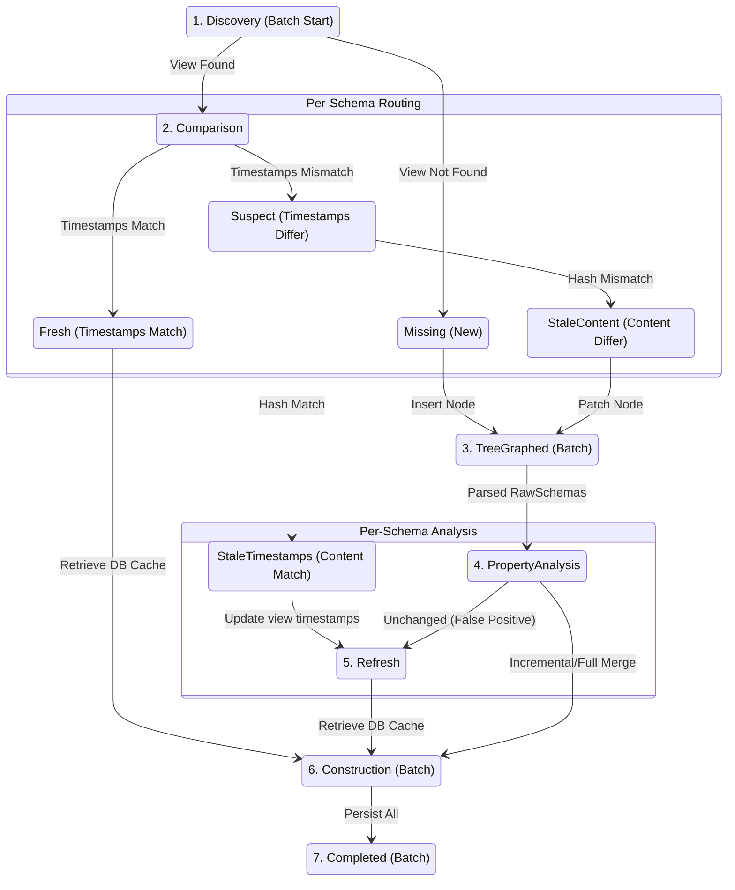

# Schema Pipeline Typestate Redesign (DEFINITIVE)

**Date**: 2026-03-27
**Status**: **READY FOR IMPLEMENTATION**
**Purpose**: Authoritative specification for the schema pipeline typestate state machine, reflecting the highly optimized zero-copy singleton graph architecture.

---

## Table of Contents

1. [Executive Summary](#executive-summary)
2. [Architecture Overview](#architecture-overview)
3. [Complete Stage Taxonomy](#complete-stage-taxonomy)
4. [Status Types and Data](#status-types-and-data)
5. [Branching Enums](#branching-enums)
6. [Delta Structures](#delta-structures)
7. [Incremental Optimizations (Excludes & Cascade Shields)](#incremental-optimizations-excludes--cascade-shields)
8. [Processing Flow Diagrams](#processing-flow-diagrams)
9. [Code Skeleton Examples](#code-skeleton-examples)
10. [Quick Reference Tables](#quick-reference-tables)
11. [Migration Guide](#migration-guide)
12. [Visual State Machine Diagram](#visual-state-machine-diagram)

---

## Executive Summary

The schema pipeline implements a **hybrid typestate state machine** combining per-schema processing with batch operations. It utilizes a zero-copy (`rkyv`) singleton graph to instantly resolve topological relationships, eliminating legacy multimaps and relational caching tables.

### Key Design Decisions

1. **7 Stages** with clear stage + status dimensions, jumping between Batch and Per-Schema contexts.
2. **Fail-Fast `TreeGraphed` Stage**: Moves structural validation *before* property analysis to instantly catch cycles.
3. **Singleton `SCHEMA_TOPOLOGICAL_GRAPH`**: Replaces `SCHEMA_INHERITANCE` and `SCHEMA_CHILDREN_BY_PARENT`, storing nodes, children, and depths natively in a zero-copy graph.
4. **2-Component Extends Delta**: Separates graph patching logic (internal) from construction merge directives.
5. **Unified `SchemaPropertyDelta`**: Combines inline and ref upserts into strongly-typed maps, bypassing double-parsing.
6. **Cascade Shields**: Leverages `ExcludesDelta` to proactively halt expensive O(N) tree updates.
7. **Graceful Downgrade**: Safely routes `StaleContent` schemas with no actual semantic changes to a `Refresh` stage, skipping construction.

---

## Architecture Overview

### Design Philosophy

**Hybrid Per-Schema + Batch Model**:

```text
┌─────────────────────────────────────────────────────────────┐
│  STAGE 1: Discovery (Batch Start)                           │
│  Queries DB, detects deletions, creates per-schema pipelines│
└──────────────────────┬──────────────────────────────────────┘
                       │
┌──────────────────────▼──────────────────────────────────────┐
│  STAGE 2: Comparison (Per-Schema)                           │
│  Independent timestamp and hash comparisons                 │
└──────────────────────┬──────────────────────────────────────┘
                       │
┌──────────────────────▼──────────────────────────────────────┐
│  STAGE 3: TreeGraphed (Batch)                               │
│  Parses stale schemas, patches singleton graph, fails fast  │
└──────────────────────┬──────────────────────────────────────┘
                       │
┌──────────────────────▼──────────────────────────────────────┐
│  STAGE 4-5: PropertyAnalysis & Refresh (Per-Schema)         │
│  Computes Excludes/Property deltas. Early exit for no-ops.  │
└──────────────────────┬──────────────────────────────────────┘
                       │
┌──────────────────────▼──────────────────────────────────────┐
│  STAGE 6-7: Construction & Completed (Batch)                │
│  Level-by-level incremental merges, bulk persistence        │
└─────────────────────────────────────────────────────────────┘
```

### Singleton Graph over Relational Tables

By storing the entire graph natively:
- **`SCHEMA_CHILDREN_BY_PARENT` is eliminated**: Children arrays are stored directly in `InheritanceNode`.
- **`SCHEMA_INHERITANCE` is eliminated**: Depths and ancestors are implicitly accessible via instantaneous zero-copy graph traversal.
- **Topological Sorting is cached**: The singleton natively stores `topological_order`, skipping Kahn's algorithm dynamically unless the graph is patched.

---

## Complete Stage Taxonomy

### Stage Sequence

1. **Discovery** (Batch Start → Per-Schema Branch)
2. **Comparison** (Per-Schema)
3. **TreeGraphed** (Batch)
4. **PropertyAnalysis** (Per-Schema)
5. **Refresh** (Per-Schema early persistence)
6. **Construction** (Batch with Per-Schema branching)
7. **Completed** (Batch)

---

### Stage Descriptions

#### Stage 1: Discovery (Batch Start, Per-Schema Branch)
**Purpose**: Initialize batch processing, query DB, detect deletions, branch schemas into pipelines.
**Operations**:
1. Scan schema directory (excluding `property_bank` file).
2. Load all `RawSchemaView`s from DB in a single batch query.
3. Build global indexes (`name_to_id`, `id_to_name`).
4. Detect deleted schemas (in DB but not on filesystem).
5. For each file, perform timestamp check and return `DiscoveryBranch`.

#### Stage 2: Comparison (Per-Schema)
**Purpose**: Determine physical staleness level.
**Operations**:
1. **Timestamp check**: If match → `Fresh` (skip to Construction).
2. **Content hash check**: Read file content, hash via blake3. If hash match → `StaleTimestamps`, else `StaleContent` (proceed to TreeGraphed).

#### Stage 3: TreeGraphed (Batch)
**Purpose**: Fail-fast structural validation and singleton graph patching.
**Operations**:
1. Attempt to load `SCHEMA_TOPOLOGICAL_GRAPH` singleton (if missing, treat all as new).
2. Parse all `StaleContent` and `Missing` (new) schemas into `RawSchema`.
3. Compare `extends` from `RawSchema` with the cached `SchemaVersion`.
4. Generate an internal `ExtendsDelta` map of reparented nodes.
5. Apply patches in-memory. Execute DFS cycle detection and compute `depth` for subtrees. Fail fast if cycle detected or `depth > 10`.
6. Pass the topologically sorted graph, parsed `RawSchemas`, and `affected_subtrees` down to `PropertyAnalysis`.

#### Stage 4: PropertyAnalysis (Per-Schema)
**Purpose**: Compute Excludes and Property deltas to drive construction.
**Operations**:
1. Compute `ExcludesDelta` (added/removed excludes).
2. Compute unified `SchemaPropertyDelta` comparing the pre-parsed `RawSchema` against `RawSchemaView`.
3. Separate property updates into strongly typed `inline` vs `refs` maps.
4. If all deltas are empty despite `StaleContent` (e.g., formatting change), route to `Refresh`.

#### Stage 5: Refresh (Per-Schema)
**Purpose**: Early-persist metadata updates when only timestamps or hashes changed without semantic shifts.
**Operations**:
1. Update `RawSchemaView` file times and/or content hash.
2. Persist view to DB immediately.
3. Transition schema to `Fresh` so Construction retrieves it from DB without re-merging.

#### Stage 6: Construction (Batch with Per-Schema Branching)
**Purpose**: Expand `$refs` and merge properties level-by-level with incremental optimizations.
**Operations**:
1. Iterate over the graph's `topological_order` level-by-level.
2. Fresh schemas skip processing (fetch from DB).
3. If only `ExcludesDelta` changed, perform an O(1) incremental map update (remove added excludes, insert removed excludes from parent).
4. If properties changed, re-expand only the specific `refs` listed in `SchemaPropertyDelta.upserts.refs`. Apply `inline` directly.
5. Cache resolved properties for child levels.

#### Stage 7: Completed (Batch)
**Purpose**: Bulk persistence.
**Operations**:
1. Save `SCHEMA_TOPOLOGICAL_GRAPH` singleton if patched.
2. Bulk save all fully resolved `Schema` objects.
3. Save updated `RawSchemaView` metadata.

---

## Status Types and Data

### Discovery & Comparison Statuses

*   **`Unknown`**: Initial ZST marker.
*   **`Missing`**: NEW schema. Carries `id`, `times`.
*   **`Present`**: Cached view exists. Carries `id`, `times`, `view`.
*   **`Fresh`**: Timestamps match. Carries `id`.
*   **`Suspect`**: Timestamps differ. Carries `id`, `times`, `view`, `content`.

### TreeGraphed Statuses

*   **`GraphFresh`**: Reuse existing graph. Carries `graph`.
*   **`GraphPatched`**: Graph incrementally updated. Carries `graph`, `affected_subtrees`.

### PropertyAnalysis Statuses

*   **`Unchanged`**: No property/excludes changes (Formatting only). Route to `Refresh`. Carries `id`, `view`.
*   **`Changed`**: Semantic changes. Carries `id`, `schema_property_delta`, `excludes_delta`.

### Refresh Statuses

*   **`StaleTimestamps`**: Hash matches. Carries `id`, `view`, `times`.
*   **`StaleContent`**: Hash differs, but properties match. Carries `id`, `view`, `times`, `content_hash`.

### Construction Statuses

*   **`Fresh`**: Retrieve from DB. Carries `id`.
*   **`Changed`**: Incremental or Full merge required. Carries `schema`.
*   **`New`**: Built from scratch. Carries `schema`.
*   **`Ready`**: Final resolved schemas. Carries `schemas`.

---

## Branching Enums

All branching enums are `#[must_use]` to force explicit handling.

```rust
#[derive(Debug)]
#[must_use = "branch outcomes must be handled"]
pub(crate) enum DiscoveryBranch {
    Missing(SchemaProcessor<Comparison, Missing>),
    Present(SchemaProcessor<Comparison, Present>),
}

#[derive(Debug)]
#[must_use = "branch outcomes must be handled"]
pub(crate) enum ComparisonBranch {
    Fresh(SchemaProcessor<Construction, Fresh>),
    Suspect(SchemaProcessor<Comparison, Suspect>),
}

#[derive(Debug)]
#[must_use = "branch outcomes must be handled"]
pub(crate) enum ContentBranch {
    StaleTimestamps(SchemaProcessor<Refresh, StaleTimestamps>),
    StaleContent(SchemaProcessor<TreeGraphed, Suspect>),
}

#[derive(Debug)]
#[must_use = "branch outcomes must be handled"]
pub(crate) enum GraphBranch {
    GraphFresh(SchemaProcessor<PropertyAnalysis, Unchanged>),
    GraphPatched(SchemaProcessor<PropertyAnalysis, Changed>),
}

#[derive(Debug)]
#[must_use = "branch outcomes must be handled"]
pub(crate) enum PropertyAnalysisBranch {
    Unchanged(SchemaProcessor<Refresh, StaleContent>),
    Changed(SchemaProcessor<Construction, Changed>),
}
```

---

## Delta Structures

### `SCHEMA_TOPOLOGICAL_GRAPH` Singleton Components

```rust
use rkyv::{Archive, Deserialize, Serialize};
use std::collections::HashMap;

/// The singleton structure storing the entire inheritance state.
#[derive(Debug, Clone, Archive, Serialize, Deserialize)]
pub struct InheritanceGraph {
    /// O(1) lookup mapping `SchemaId` to its tree relationships.
    pub nodes: HashMap<SchemaId, InheritanceNode>,
    /// Pre-computed topological ordering.
    pub topological_order: Vec<SchemaId>,
}

#[derive(Debug, Clone, Archive, Serialize, Deserialize)]
pub struct InheritanceNode {
    pub parent: Option<SchemaId>,
    pub children: Vec<SchemaId>,
    /// Pre-computed depth (1-indexed). Capped at 10.
    pub depth: u8,
}
```

### Extends Delta (Internal to TreeGraphed)

```rust
#[derive(Debug, Default)]
pub(crate) struct ExtendsDelta {
    /// Map of schemas whose parent changed.
    /// Format: schema_id -> (old_parent_id, new_parent_id)
    pub reparented: HashMap<SchemaId, (Option<SchemaId>, Option<SchemaId>)>,
}
```

### Excludes Delta (Computed in PropertyAnalysis)

```rust
#[derive(Debug, Clone, PartialEq)]
pub(crate) struct ExcludesDelta {
    pub(crate) added: Vec<PropertyName>,
    pub(crate) removed: Vec<PropertyName>,
}

impl ExcludesDelta {
    pub fn changed(&self) -> bool {
        !self.added.is_empty() || !self.removed.is_empty()
    }
}
```

### Unified SchemaPropertyDelta

```rust
use crate::schema::property::PropertyName;
use crate::schema::raw::{RawPropertyInline, RawPropertyRef};
use std::collections::HashMap;

#[derive(Debug, Clone, PartialEq)]
#[non_exhaustive]
pub struct SchemaPropertyUpserts {
    /// Newly added or modified inline properties requiring direct construction.
    pub inline: HashMap<PropertyName, RawPropertyInline>,
    /// Newly added or modified reference properties requiring bank expansion.
    pub refs: HashMap<PropertyName, RawPropertyRef>,
}

#[derive(Debug, Clone, PartialEq)]
#[non_exhaustive]
pub struct SchemaPropertyDelta {
    /// Properties that were added or structurally modified.
    pub upserts: SchemaPropertyUpserts,
    /// Property names that were removed from the schema.
    pub removed: Vec<PropertyName>,
}
```

---

## Incremental Optimizations (Excludes & Cascade Shields)

By utilizing `ExcludesDelta` and `SchemaPropertyDelta`, the pipeline transforms O(N) top-down rebuilds into O(1) targeted patches during the `Construction` phase:

1. **Local Incremental Resolution**: If only `ExcludesDelta` changed, fetch the cached resolved schema, `remove()` properties in `ExcludesDelta.added`, and `insert()` inherited properties in `ExcludesDelta.removed`. No full re-merge required.
2. **The Shadowed Add**: If an exclude is added, but the schema explicitly defines that property locally, the exclude is moot. Skip the DB mutation entirely.
3. **The Cascade Shield**: When a parent mutates a property, it triggers a cascading update to descendants. If the pipeline inspects a child's `RawSchemaView::excludes()` and finds the mutated property, the pipeline **halts the cascade** at that child, sparing all subsequent descendants from being loaded or rebuilt.
4. **Targeted DB I/O**: `Construction` iterates exclusively over `SchemaPropertyDelta.upserts.refs` to re-expand bank references (which requires DB I/O). The `upserts.inline` apply directly via CPU without external lookups.

---

## Processing Flow Diagrams

### Flow 1: NEW Schema

```text
START
  │
  ├─▶ Discovery
  │   └─▶ Query DB: RawSchemaView not found
  │       └─▶ Missing status (generate new SchemaId)
  │
  ├─▶ Comparison
  │   └─▶ (Skip - no cached view to compare)
  │
  ├─▶ TreeGraphed (Batch)
  │   ├─▶ Parse RawSchema from file
  │   ├─▶ Read extends, Insert node into singleton InheritanceGraph
  │   ├─▶ Validate parent exists & cycle detection
  │   └─▶ Pass parsed RawSchema down
  │
  ├─▶ PropertyAnalysis
  │   ├─▶ Compute SchemaPropertyDelta (all properties are upserts)
  │   └─▶ Changed status
  │
  ├─▶ Construction (Batch)
  │   ├─▶ Expand $refs against PropertyBank
  │   ├─▶ Get parent's merged properties
  │   ├─▶ Merge & Apply excludes
  │   └─▶ New status
  │
  └─▶ Completed (Batch)
      ├─▶ Persist Schema, RawSchemaView
      ├─▶ Persist SCHEMA_TOPOLOGICAL_GRAPH
      └─▶ END
```

### Flow 2: FRESH Schema + FRESH PropertyBank

```text
START
  │
  ├─▶ Discovery
  │   └─▶ Query DB: RawSchemaView found → Present status
  │
  ├─▶ Comparison
  │   ├─▶ Check timestamps: MATCH
  │   └─▶ Fresh status → SKIP TO CONSTRUCTION
  │
  ├─▶ [Batch Boundary]
  │
  ├─▶ TreeGraphed
  │   ├─▶ All schemas unchanged + no new schemas
  │   ├─▶ Load InheritanceGraph from DB
  │   └─▶ GraphFresh status
  │
  ├─▶ Construction
  │   ├─▶ Retrieve Schema from DB (no processing)
  │   └─▶ Fresh status
  │
  └─▶ Completed
      └─▶ No persistence needed (already up-to-date)
          └─▶ END (Schema delivered from cache)
```

### Flow 3: STALE Schema (Content Hash Changed, Formatting Only)

```text
START
  │
  ├─▶ Discovery
  │   └─▶ Query DB: RawSchemaView found → Present status
  │
  ├─▶ Comparison
  │   ├─▶ Check timestamps: MISMATCH
  │   ├─▶ Read file content & Hash: MISMATCH
  │   └─▶ Suspect → StaleContent status
  │
  ├─▶ TreeGraphed (Batch)
  │   ├─▶ Parse RawSchema from file
  │   ├─▶ Compare extends: UNCHANGED
  │   └─▶ Pass parsed RawSchema down
  │
  ├─▶ PropertyAnalysis
  │   ├─▶ Compare Excludes: UNCHANGED
  │   ├─▶ Compare Properties: UNCHANGED
  │   └─▶ Unchanged status (False Positive Staleness)
  │
  ├─▶ Refresh
  │   ├─▶ Update file_times + content_hash on RawSchemaView
  │   ├─▶ Persist view to DB early
  │   └─▶ Fresh status → SKIP CONSTRUCTION RE-MERGE
  │
  └─▶ Completed (Batch)
      └─▶ END (Schema delivered from cache)
```

---

## Code Skeleton Examples

### Discovery Stage Implementation

```rust
impl SchemaProcessor<Discovery, Unknown> {
    pub(crate) fn discover_all<R: Repository>(
        source: &FsReader,
        repository: &R,
    ) -> Result<DiscoveryResult, SchemaLoaderError> {
        let schema_files = source.list_files_with_extension(config.schema_dir(), &["toml", "json", "yaml"])?;
        let views = repository.find_raw_schema_views_by_paths(&schema_files)?;

        let mut name_to_id = HashMap::new();
        for (path, view) in &views {
            name_to_id.insert(path.file_stem().unwrap().to_string_lossy().into(), view.id());
        }

        let mut schema_branches = Vec::new();
        for file_path in schema_files {
            let times = RawFileTimes {
                created_at: source.created_at(&file_path),
                modified_at: source.modified_at(&file_path),
            };

            let branch = if let Some(view) = views.get(&file_path) {
                DiscoveryBranch::Present(SchemaProcessor::transition(Comparison, Present { id: view.id(), times, view: view.clone() }))
            } else {
                DiscoveryBranch::Missing(SchemaProcessor::transition(Comparison, Missing { id: SchemaId::new(), times }))
            };
            schema_branches.push(branch);
        }

        Ok(DiscoveryResult { schema_branches, name_to_id })
    }
}
```

### PropertyAnalysis Stage Implementation

```rust
impl SchemaProcessor<PropertyAnalysis, Suspect> {
    pub(crate) fn analyze_properties(
        self,
        new_raw_schema: &RawSchema,
    ) -> Result<PropertyAnalysisBranch, SchemaLoaderError> {
        let old_raw_schema = self.status.view.current().to_raw()?;
        let mut delta = SchemaPropertyDelta::new();

        let old_props = old_raw_schema.properties().as_map();
        let new_props = new_raw_schema.properties().as_map();

        // Removals
        for old_name in old_props.keys() {
            if !new_props.contains_key(old_name) {
                delta.removed.push(old_name.clone());
            }
        }

        // Upserts (Inline vs Refs)
        for (new_name, new_prop) in new_props {
            let is_upserted = old_props.get(new_name).map_or(true, |old| old != new_prop);

            if is_upserted {
                match new_prop {
                    RawProperty::Inline(inline) => {
                        delta.upserts.inline.insert(new_name.clone(), inline.clone());
                    }
                    RawProperty::Ref(reference) => {
                        delta.upserts.refs.insert(new_name.clone(), reference.clone());
                    }
                }
            }
        }

        let excludes_delta = compute_excludes_delta(&old_raw_schema, new_raw_schema);

        if delta.is_empty() && !excludes_delta.changed() {
            Ok(PropertyAnalysisBranch::Unchanged(Self::transition(Refresh, StaleContent { /*...*/ })))
        } else {
            Ok(PropertyAnalysisBranch::Changed(Self::transition(Construction, Changed {
                id: self.status.id,
                property_delta: delta,
                excludes_delta,
            })))
        }
    }
}
```

---

## Quick Reference Tables

### Stage Quick Reference

| # | Stage | Model | Key Operations |
|---|-------|-------|----------------|
| 1 | Discovery | Batch Start | Query DB, build indexes, detect deletions |
| 2 | Comparison | Per-Schema | Timestamp check, content hash check |
| 3 | TreeGraphed | Batch | Parse Stale, build/patch singleton graph, DFS cycle detection |
| 4 | PropertyAnalysis | Per-Schema | Compute `SchemaPropertyDelta` and `ExcludesDelta` |
| 5 | Refresh | Per-Schema | Persist view for False Positives, early checkpoint |
| 6 | Construction | Batch Orch. | Level-by-level incremental merge & ref expansion |
| 7 | Completed | Batch | Persist schemas and singleton graph to DB |

### Delta Structure Quick Reference

| Delta | Computed In | Used In | Purpose |
|-------|-------------|---------|---------|
| `ExtendsDelta` | TreeGraphed | TreeGraphed | Internal map to rewire graph edges without DB lookups |
| `ExcludesDelta` | PropertyAnalysis | Construction | Targeted incremental property removals/inserts |
| `SchemaPropertyDelta` | PropertyAnalysis | Construction | Targeted inline mappings and `$ref` DB lookups |

---

## Migration Guide

### Architectural Changes

1. **Singleton Graph**: Remove `SCHEMA_INHERITANCE` table and `SCHEMA_CHILDREN_BY_PARENT` multimap. Create a single `SCHEMA_TOPOLOGICAL_GRAPH` row using `rkyv`.
2. **Fail-Fast `TreeGraphed`**: Move graph validation before PropertyAnalysis.
3. **Unified Deltas**: Delete `BankReferenceDelta` and `SchemaDelta`. Replace with `SchemaPropertyDelta` utilizing `SchemaPropertyUpserts` (`inline` vs `refs`).

### Code Migration Steps

1. **Replace `Loader` with `Builder`**: Migrate from an implicit orchestrator to a thin typestate facade.
2. **Remove `Ingestor`**: Eliminate the black-box abstraction. Execute file I/O directly within State Machine transitions.
3. **Refactor Extender**: Drop `NodeDepth` struct and topological sort caching; embed directly into `InheritanceGraph` and `InheritanceNode`.

---

## Visual State Machine Diagram



---

**END OF DEFINITIVE SCHEMA PIPELINE TYPESTATE REDESIGN**
