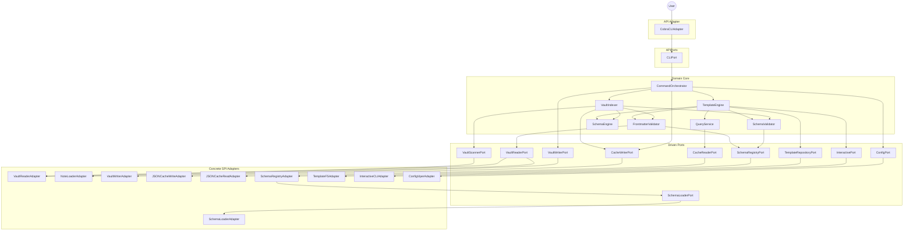

# Components

This section identifies the major logical components and services that implement the system's functionality, organized by architectural layer per hexagonal architecture. Components are classified as:

- **Domain Services:** Business logic components in the core (pure, no infrastructure dependencies)
- **API Port Interfaces:** Contracts for primary/driving adapters (CLI, TUI, LSP) defined by domain
- **API Adapters:** Application driving components (CLI, future TUI/LSP)
- **SPI Port Interfaces:** Contracts for secondary/driven adapters (storage, filesystem, UI, config) defined by domain
- **SPI Adapters:** Service provider implementations (storage, filesystem, UI, config)
- **Shared Internal Packages:** Cross-cutting concerns (logging, errors, registries) used across layers

## Domain Services

The following core services implement PRD epics inside the hexagonal domain. Method signatures below illustrate contractual expectations rather than literal Go declarations; concrete interfaces live in the architecture layer packages. All services must honor context cancellation and propagate errors without leaking infrastructure concerns.

### TemplateEngine

**Responsibility:** Execute template rendering for `lithos new`/`find`, wiring together interactive prompts, lookups, and frontmatter validation. Pure domain service orchestrating template execution with custom function map for user interaction and file path control. Enhanced with goldmark for markdown rendering capabilities in templates.

**Key Interfaces:**

- `Render(ctx context.Context, templateID TemplateID) (string, error)` - Render template to markdown string with goldmark markdown processing
- `Load(ctx context.Context, templateID TemplateID) (Template, error)` - Load template via TemplateLoader port

**Dependencies:** TemplateLoader (port), InteractivePort, QueryService, FrontmatterService, Config, Logger.

**Technology Stack:** Go `text/template`, `github.com/yuin/goldmark` for markdown rendering in templates, custom function map with user interaction and file control functions, closures wrapping port calls for dependency injection, zerolog for instrumentation.

**Custom Template Functions:**

The TemplateEngine provides a function map injected into Go's `text/template` for interactive prompts, vault queries, and file path control:

**User Interaction Functions:**
- `prompt(name, label, default)` - Text input prompt via InteractivePort
- `suggester(name, label, options)` - Selection from list via InteractivePort
- `now(format)` - Current timestamp with Go time layout format

**Vault Query Functions:**
- `lookup(basename)` - Find note by basename via QueryService
- `query(filter)` - Query notes by criteria via QueryService
- `fileClass(noteID)` - Get note's fileClass field

**File Path Control Functions** (inspired by Templater file module):
- `path()` - Returns the target file path for the note being created. Used to determine where the note will be saved.
- `folder(path)` - Returns parent directory of path. Can be chained to navigate up directory tree.
- `basename(path)` - Returns filename without extension from path.
- `extension(path)` - Returns file extension from path.
- `join(parts...)` - Joins path segments using OS-appropriate separator.
- `vaultPath()` - Returns absolute vault root path from Config.

**File Path Function Examples:**

```go
// Template can control its own save location
{{- $targetPath := join (vaultPath) "contacts" (printf "%s.md" (prompt "filename" "Filename" "")) -}}
// Sets target path for CommandOrchestrator to use when saving

// Or derive from frontmatter fields
{{- $slug := lower (replace (prompt "title" "Title" "") " " "-") -}}
{{- $targetPath := join (vaultPath) "notes" (printf "%s.md" $slug) -}}

// Access current path context (during rendering)
{{- $currentFolder := folder (path) -}}
{{- $currentName := basename (path) -}}
```

**Note:** The `path()` function returns the target path being constructed during rendering. Templates set this implicitly through frontmatter or explicitly via `$targetPath` variable. CommandOrchestrator uses the resolved path to save the note via `atomicwriter.WriteFile` directly (no FileWriter port - YAGNI principle).

### FrontmatterService

**Responsibility:** Extract YAML frontmatter from markdown using goldmark-frontmatter extension and validate against schema rules with strict type checking. Single domain service handling both extraction and validation concerns. Leverages goldmark-frontmatter extension for robust frontmatter parsing instead of custom AST manipulation.

**Key Interfaces:**

- `Extract(content []byte) (Frontmatter, error)` - Parse YAML frontmatter from markdown content using goldmark-frontmatter extension for reliable delimiter detection and parsing
- `Validate(ctx context.Context, frontmatter Frontmatter) error` - Validate frontmatter against schema (looked up via FileClass) with in-memory type normalization for validation logic only

**Dependencies:** SchemaRegistry (port), VaultReaderPort (for reading file data with VaultFile DTO), Logger.

**Note:** QueryService depends on FrontmatterService for reliable frontmatter validation during searches, not the reverse. FrontmatterService is independent and provides validation capabilities that QueryService consumes. The Extract method outputs Frontmatter struct that can be searched. In post-MVP, frontmatter should be cached for QueryService to search directly.

**Technology Stack:** Go stdlib (`regexp`, `time`, `reflect`, `math`), `go.abhg.dev/goldmark/frontmatter` for type-safe frontmatter extraction with built-in YAML/TOML parsing (replaces custom goldmark AST parsing), `github.com/yuin/goldmark` for markdown processing, PropertySpec polymorphism for type-specific validation, in-memory type normalization for validation logic, structured FrontmatterError with remediation hints.

**Frontmatter Validation (Business Rules with Strict Type Checking):**

FrontmatterService.Validate() performs strict validation with in-memory type normalization for validation logic only. **Important:** Validation never modifies files—normalization is purely in-memory for validation purposes. Data transformations (like scalar→array coercion or type conversions) are linting concerns, not validation concerns.

- **Purpose:** Validate YAML frontmatter data strictly against schema business rules
- **When:** Every note indexing and validation operation
- **Complexity:** High - requires YAML type handling and cross-field validation
- **Philosophy:** Validator is strict and raises errors when data doesn't match schema. A future linter would be permissive and auto-fix issues.

**Validation Workflow:**

1. **Schema Lookup:** Get schema from SchemaRegistry using frontmatter.FileClass
2. **Required Field Check:** Ensure all required properties present in frontmatter.Fields
3. **Array vs Scalar Check:** Verify array/scalar expectation matches (no auto-coercion)
4. **Type Normalization (In-Memory Only):** Normalize YAML types for validation logic without modifying files
5. **Constraint Validation:** Validate normalized value against PropertySpec constraints (pattern, min/max, enum, etc.)
6. **File Reference Validation:** For FileSpec properties, validate file exists via QueryService.ByPath()
7. **Error Aggregation:** Return all validation errors with field-level remediation hints

**YAML Type Handling:**

The `goccy/go-yaml` parser handles YAML syntax and returns Go types. FrontmatterService validates these Go types against schema expectations:

```yaml
# Strings (quoted or unquoted - both valid YAML)
title: hello world           # Unquoted string → string
title: "hello world"         # Quoted string → string
title: 'single quoted'       # Single-quoted → string
description: |               # Block scalar → string
  Multiline text

# Numbers (YAML doesn't distinguish int/float)
count: 42                    # Integer notation → int64 in Go
price: 42.5                  # Float notation → float64 in Go
# Validator normalizes to float64 IN-MEMORY for validation only
# Files remain unchanged!

# Booleans (YAML liberal syntax)
active: true                 # Boolean literal → bool
active: yes                  # YAML boolean → bool (parser converts)
active: on                   # YAML boolean → bool (parser converts)

# Arrays
tags: [work, personal]       # Flow style → []any
tags:                        # Block style → []any
  - work
  - personal
```

**Type Validation Strategy:**

```go
// StringSpec validation
title: "hello"  ✓ (string type matches)
title: 42       ✗ ERROR: Expected string, got number

// NumberSpec validation
count: 42       ✓ (int normalized to float64 in-memory for validation)
count: 42.5     ✓ (float already float64)
count: "42"     ✗ ERROR: Expected number, got string
# Note: If NumberSpec.Step = 1.0, validator checks value == floor(value)

// BoolSpec validation
active: true    ✓ (bool type)
active: yes     ✓ (YAML parser converts to bool)
active: 1       ✗ ERROR: Expected boolean, got number
active: "true"  ✗ ERROR: Expected boolean, got string

// Array validation (NO auto-coercion)
tags: [work]    ✓ (array when Property.Array = true)
tags: work      ✗ ERROR: Expected array, got scalar
tags: [work]    ✗ ERROR: Expected scalar, got array (when Property.Array = false)
```

**Validation vs Linting:**

- **Validator (FrontmatterService):** Strict enforcement. Raises errors when data doesn't match schema. User must fix data or schema.
- **Linter (Future feature):** Permissive transformation. Auto-fixes common issues like `tags: work` → `tags: [work]` or type conversions.

**In-Memory Normalization:**

Validator normalizes types in-memory for validation logic only:

- YAML integers → float64 for NumberSpec validation (files unchanged)
- Step attribute determines int vs float semantics:
  - `Step: 1.0` → Requires integer values (checks `value == math.Floor(value)`)
  - `Step: 0.1` → Allows fractional values
  - `Step: nil` → Any precision allowed

**Implementation Note:**

All public methods with multiple steps follow Single Responsibility Principle by decomposing into private methods. For example, Validate() orchestrates via private methods: lookupSchema(), validateAgainstSchema(), validateProperty(), validateArrayExpectation(), coerceValue(), validateAgainstSpec(), etc. Each private method has one clear responsibility.

**Error Format:**

Validation errors returned as structured FrontmatterError types with schema name, field name, rule violated, actual value, and remediation message for CLI display.

### SchemaEngine

**Responsibility:** Coordinate schema loading, validation, resolution, and provide unified access to schemas and properties. Orchestrates SchemaLoader, SchemaValidator, SchemaResolver, and SchemaRegistry using Go generics for type-safe retrieval.

**Key Interfaces:**

- `Load(ctx context.Context) error` - Load schemas and property bank, validate structure, resolve inheritance, populate SchemaRegistry
- `Get[T Schema | Property](ctx context.Context, name string) (T, error)` - Retrieve schema or property by name using generics
- `Has[T Schema | Property](ctx context.Context, name string) bool` - Check if schema or property exists using generics

**Dependencies:** SchemaLoader (port), SchemaValidator (service), SchemaResolver (service), SchemaRegistry (port), Logger.

**Technology Stack:** Pure Go orchestration layer with Go 1.18+ generics. Delegates to SchemaLoader for I/O, SchemaValidator for structural validation, SchemaResolver for inheritance resolution, and SchemaRegistry for lookups. Idiomatic (T, error) return signatures.

**Schema Loading and Validation Workflow:**

The Load() method orchestrates the complete schema initialization pipeline:

1. **Load:** SchemaLoader reads JSON files from disk and parses into Schema DTOs and PropertyBank
2. **Validate:** SchemaValidator validates structural integrity by calling schema.Validate() on each schema (which delegates to property.Validate() → propertySpec.Validate()). Also performs cross-schema validation (Extends references exist).
3. **Resolve:** SchemaResolver resolves inheritance chains (flattens Extends/Excludes) and substitutes $ref with PropertyBank definitions. Detects circular dependencies.
4. **Register:** SchemaRegistry populates in-memory maps with resolved schemas for fast lookups

**Fails Fast:** Any error in steps 1-3 terminates application at startup. No invalid schemas reach runtime.

**Usage Examples:**
```go
// At startup
if err := schemaEngine.Load(ctx); err != nil {
    log.Fatal("schema loading failed:", err)
}

// Runtime lookups
schema, err := schemaEngine.Get[Schema](ctx, "contact")
property, err := schemaEngine.Get[Property](ctx, "standard_title")
exists := schemaEngine.Has[Schema](ctx, "contact")
```

### SchemaValidator

**Responsibility:** Orchestrate schema validation by calling model-level Validate() methods and performing cross-schema validation that requires seeing multiple schemas together. Pure domain service with no external dependencies.

**Key Interfaces:**

- `ValidateAll(ctx context.Context, schemas []Schema, bank PropertyBank) error` - Orchestrate validation of all schemas and check cross-schema references

**Dependencies:** None (pure domain logic).

**Technology Stack:** Orchestrates schema.Validate() calls, validates cross-schema references, aggregates errors using errors.Join().

**Validation Responsibilities:**

SchemaValidator has two distinct responsibilities that require service-level logic:

1. **Orchestrate Model Validation:**
    - Calls schema.Validate() on each schema
    - Each schema delegates to property.Validate() → propertySpec.Validate()
    - Aggregates all structural validation errors
    - **Why service needed:** Centralized orchestration and error aggregation across all schemas

2. **Cross-Schema Validation:**
    - Validates Extends references point to existing schemas
    - Validates PropertyBank $ref references exist
    - Ensures no duplicate schema names
    - **Why service needed:** Individual schemas can't validate references without seeing other schemas and PropertyBank

**What SchemaValidator Does NOT Do:**

- Structural validation of individual schemas (delegated to schema.Validate())
- Inheritance resolution (handled by SchemaResolver)
- Circular dependency detection (handled by SchemaResolver during topological sort)

**Example Implementation Pattern:**

```go
func (v *SchemaValidator) ValidateAll(ctx context.Context, schemas []Schema, bank PropertyBank) error {
    var errors []error

    // 1. Orchestrate model-level validation
    for _, schema := range schemas {
        if err := schema.Validate(ctx); err != nil {
            errors = append(errors, fmt.Errorf("schema %s: %w", schema.Name, err))
        }
    }

    // 2. Cross-schema validation
    schemaMap := buildSchemaMap(schemas)
    for _, schema := range schemas {
        if schema.Extends != "" {
            if _, exists := schemaMap[schema.Extends]; !exists {
                errors = append(errors, fmt.Errorf("schema %s extends non-existent schema %s",
                    schema.Name, schema.Extends))
            }
        }
        // Check $ref references in properties
        for _, prop := range schema.Properties {
            if err := v.validatePropertyRefs(prop, bank); err != nil {
                errors = append(errors, err)
            }
        }
    }

    if len(errors) > 0 {
        return errors.Join(errors...)
    }
    return nil
}
```

### SchemaResolver

**Responsibility:** Resolve schema inheritance chains and PropertyBank $ref substitutions. Pure domain service implementing inheritance resolution algorithm.

**Key Interfaces:**

- `Resolve(ctx context.Context, schemas []Schema, bank PropertyBank) ([]Schema, error)` - Resolve all schemas, returning flattened schemas with inheritance applied and $ref substituted

**Dependencies:** None (pure domain logic).

**Technology Stack:** Topological sort for dependency ordering, depth-first search for cycle detection, property merging with override semantics.

**Resolution Algorithm:**

1. **Build Dependency Graph:** Map each schema to its Extends parent
2. **Detect Cycles:** DFS to find circular inheritance chains (Schema A extends B extends A)
3. **Topological Sort:** Order schemas so parents resolve before children
4. **Resolve Inheritance:** For each schema in order:
    - Get parent's resolved properties (or empty if root schema)
    - Apply Excludes (remove properties by name)
    - Merge child properties (override parent properties with same name)
    - Store as resolved properties
5. **Substitute $ref:** Replace all `{$ref: "#/properties/name"}` with PropertyBank.Properties[name]

**Example:**
```go
resolver := NewSchemaResolver()
resolved, err := resolver.Resolve(ctx, schemas, propertyBank)
if err != nil {
    return fmt.Errorf("schema resolution failed: %w", err)
}
```

### SchemaEngine

**Responsibility:** Coordinate schema loading, validation, resolution, and provide unified access to schemas and properties. Orchestrates SchemaLoader, SchemaValidator, SchemaResolver, and SchemaRegistry using Go generics for type-safe retrieval.

**Key Interfaces:**

- `Load(ctx context.Context) error` - Load schemas and property bank, validate structure, resolve inheritance, populate SchemaRegistry
- `Get[T Schema | Property](ctx context.Context, name string) (T, error)` - Retrieve schema or property by name using generics
- `Has[T Schema | Property](ctx context.Context, name string) bool` - Check if schema or property exists using generics

**Dependencies:** SchemaLoader (port), SchemaValidator (service), SchemaResolver (service), SchemaRegistry (port), Logger.

**Technology Stack:** Pure Go orchestration layer with Go 1.18+ generics. Delegates to SchemaLoader for I/O, SchemaValidator for structural validation, SchemaResolver for inheritance resolution, and SchemaRegistry for lookups. Idiomatic (T, error) return signatures.

**Schema Loading and Validation Workflow:**

The Load() method orchestrates the complete schema initialization pipeline:

1. **Load:** SchemaLoader reads JSON files from disk and parses into Schema DTOs and PropertyBank
2. **Validate:** SchemaValidator validates structural integrity by calling schema.Validate() on each schema (which delegates to property.Validate() → propertySpec.Validate()). Also performs cross-schema validation (Extends references exist).
3. **Resolve:** SchemaResolver resolves inheritance chains (flattens Extends/Excludes) and substitutes $ref with PropertyBank definitions. Detects circular dependencies.
4. **Register:** SchemaRegistry populates in-memory maps with resolved schemas for fast lookups

**Fails Fast:** Any error in steps 1-3 terminates application at startup. No invalid schemas reach runtime.

**Usage Examples:**
```go
// At startup
if err := schemaEngine.Load(ctx); err != nil {
    log.Fatal("schema loading failed:", err)
}

// Runtime lookups
schema, err := schemaEngine.Get[Schema](ctx, "contact")
property, err := schemaEngine.Get[Property](ctx, "standard_title")
exists := schemaEngine.Has[Schema](ctx, "contact")
```

### SchemaValidator

**Responsibility:** Orchestrate schema validation by calling model-level Validate() methods and performing cross-schema validation that requires seeing multiple schemas together. Pure domain service with no external dependencies.

**Key Interfaces:**

- `ValidateAll(ctx context.Context, schemas []Schema, bank PropertyBank) error` - Orchestrate validation of all schemas and check cross-schema references

**Dependencies:** None (pure domain logic).

**Technology Stack:** Orchestrates schema.Validate() calls, validates cross-schema references, aggregates errors using errors.Join().

**Validation Responsibilities:**

SchemaValidator has two distinct responsibilities that require service-level logic:

1. **Orchestrate Model Validation:**
   - Calls schema.Validate() on each schema
   - Each schema delegates to property.Validate() → propertySpec.Validate()
   - Aggregates all structural validation errors
   - **Why service needed:** Centralized orchestration and error aggregation across all schemas

2. **Cross-Schema Validation:**
   - Validates Extends references point to existing schemas
   - Validates PropertyBank $ref references exist
   - Ensures no duplicate schema names
   - **Why service needed:** Individual schemas can't validate references without seeing other schemas and PropertyBank

**What SchemaValidator Does NOT Do:**

- Structural validation of individual schemas (delegated to schema.Validate())
- Inheritance resolution (handled by SchemaResolver)
- Circular dependency detection (handled by SchemaResolver during topological sort)

**Example Implementation Pattern:**

```go
func (v *SchemaValidator) ValidateAll(ctx context.Context, schemas []Schema, bank PropertyBank) error {
    var errors []error

    // 1. Orchestrate model-level validation
    for _, schema := range schemas {
        if err := schema.Validate(ctx); err != nil {
            errors = append(errors, fmt.Errorf("schema %s: %w", schema.Name, err))
        }
    }

    // 2. Cross-schema validation
    schemaMap := buildSchemaMap(schemas)
    for _, schema := range schemas {
        if schema.Extends != "" {
            if _, exists := schemaMap[schema.Extends]; !exists {
                errors = append(errors, fmt.Errorf("schema %s extends non-existent schema %s",
                    schema.Name, schema.Extends))
            }
        }
        // Check $ref references in properties
        for _, prop := range schema.Properties {
            if err := v.validatePropertyRefs(prop, bank); err != nil {
                errors = append(errors, err)
            }
        }
    }

    if len(errors) > 0 {
        return errors.Join(errors...)
    }
    return nil
}
```

### SchemaResolver

**Responsibility:** Resolve schema inheritance chains and PropertyBank $ref substitutions. Pure domain service implementing inheritance resolution algorithm.

**Key Interfaces:**

- `Resolve(ctx context.Context, schemas []Schema, bank PropertyBank) ([]Schema, error)` - Resolve all schemas, returning flattened schemas with inheritance applied and $ref substituted

**Dependencies:** None (pure domain logic).

**Technology Stack:** Topological sort for dependency ordering, depth-first search for cycle detection, property merging with override semantics.

**Resolution Algorithm:**

1. **Build Dependency Graph:** Map each schema to its Extends parent
2. **Detect Cycles:** DFS to find circular inheritance chains (Schema A extends B extends A)
3. **Topological Sort:** Order schemas so parents resolve before children
4. **Resolve Inheritance:** For each schema in order:
   - Get parent's resolved properties (or empty if root schema)
   - Apply Excludes (remove properties by name)
   - Merge child properties (override parent properties with same name)
   - Store as resolved properties
5. **Substitute $ref:** Replace all `{$ref: "#/properties/name"}` with PropertyBank.Properties[name]

**Example:**
```go
resolver := NewSchemaResolver()
resolved, err := resolver.Resolve(ctx, schemas, propertyBank)
if err != nil {
    return fmt.Errorf("schema resolution failed: %w", err)
}
```

### VaultIndexer

**Responsibility:** Orchestrate vault scanning and indexing workflow (CQRS write side). Coordinates vault scanning, frontmatter extraction, validation, cache persistence, and query index population. Enhanced with goldmark for robust heading extraction and markdown processing during vault indexing.

**Key Interfaces:**

- `Build(ctx context.Context) (IndexStats, error)` - Full vault scan, cache rebuild, and query index population with goldmark-enhanced processing
- `Refresh(ctx context.Context, since time.Time) error` - Incremental update for large vaults (post-MVP optimization)

**Dependencies:** VaultScannerPort, FrontmatterService, CacheWriterPort, QueryService (direct access to populate indices), Logger, Config.

**Technology Stack:** Pure Go orchestration, `github.com/yuin/goldmark` for heading extraction and markdown processing, delegates file operations to ports, atomic indexing with temp file + rename pattern for consistency, directly populates QueryService in-memory indices after cache write completes, zerolog for metrics and progress tracking.

**Note:** VaultIndexer has direct access to QueryService's internal index structures (same package or package-private methods) to populate indices after successful cache write. This keeps write-side concerns (index building) in VaultIndexer while read-side concerns (querying) in QueryService.

### QueryService

**Responsibility:** Provide fast CQRS read-side access for template functions, suggesters, and validators. Maintains in-memory indices for optimized queries.

**Key Interfaces:**

- `ByID(ctx context.Context, id NoteID) (Note, error)` - Retrieve note by NoteID
- `ByPath(ctx context.Context, path string) ([]Note, error)` - Find notes by path (returns single note if file path, multiple if directory path)
- `ByFileClass(ctx context.Context, fileClass string) ([]Note, error)` - Find all notes with matching fileClass (convenience for common frontmatter query)
- `ByFrontmatter(ctx context.Context, field string, value any) ([]Note, error)` - Generic frontmatter field query

**Dependencies:** CacheReader (port), FrontmatterService (for frontmatter validation during searches), Logger.

**Technology Stack:** In-memory indices backed by Go maps with `sync.RWMutex` for concurrent safety, multiple specialized indices (by ID, path, fileClass, frontmatter fields) for fast lookups, indices populated directly by VaultIndexer after cache write.

### CommandOrchestrator

**Responsibility:** Orchestrate use case workflows by coordinating domain services. Acts as the application service layer that CLI, TUI, and LSP adapters invoke via CLIPort. Owns application startup and control flow.

**Key Interfaces:**

- `Run(ctx context.Context) error` - Start the application by calling CLIPort.Start()
- `NewNote(ctx context.Context, templateID TemplateID) (Note, error)` - Create new note from template (implements CommandPort)
- `IndexVault(ctx context.Context) (IndexStats, error)` - Rebuild vault index and cache (implements CommandPort)
- `FindTemplates(ctx context.Context, query string) ([]Template, error)` - List available templates (implements CommandPort)

**Dependencies:** CLIPort (injected API port), TemplateEngine, VaultIndexer, QueryService, FrontmatterService, SchemaEngine, VaultWriterPort, CacheWriterPort, Config, Logger.

**Technology Stack:** Pure Go orchestration, implements CommandPort interface for CLI callbacks, uses dependency injection from main.go.

**NewNote Use Case Workflow:**

The NewNote method orchestrates the complete note creation workflow:

1. **Load Template:** Load template via TemplateEngine.Load()
2. **Render Template:** Execute template with user prompts via TemplateEngine.Render()
3. **Extract Frontmatter:** Parse YAML frontmatter via FrontmatterService.Extract()
4. **Validate Frontmatter:** Validate against schema via FrontmatterService.Validate()
5. **Generate NoteID:** Derive NoteID from frontmatter fields (filename, title slug, or UUID)
6. **Resolve File Path:** Determine target path from template's path control functions or derive from frontmatter
7. **Create Note Object:** Construct Note with ID, Content, and Frontmatter
8. **Persist to Vault:** Write note via VaultWriterPort.Persist() (source of truth)
9. **Persist to Cache:** Write note via CacheWriterPort.Persist() (projection - keeps index in sync)
10. **Return Note:** Return Note object for CLI to display confirmation and optionally show content

**NoteID Generation Strategy:**

```go
func (o *CommandOrchestrator) generateNoteID(fm Frontmatter) (NoteID, error) {
    // Priority 1: Use explicit filename field from frontmatter
    if filename, ok := fm.Fields["filename"].(string); ok {
        return NoteID(filename), nil
    }

    // Priority 2: Slugify title field
    if title, ok := fm.Fields["title"].(string); ok {
        slug := slugify(title)  // Convert "My Note" → "my-note"
        return NoteID(slug), nil
    }

    // Priority 3: Generate UUID-based ID
    return NoteID(generateUUID()), nil
}
```

**File Path Resolution:**

Templates can control their save location via file path template functions:

```go
// Template sets target path
{{- $targetPath := join (vaultPath) "contacts" (printf "%s.md" (prompt "filename" "Filename" "")) -}}
```

CommandOrchestrator extracts the resolved path from template execution context and passes to FileWriter.

**Example Implementation:**

```go
func (o *CommandOrchestrator) NewNote(ctx context.Context, templateID TemplateID) (Note, error) {
    // Load and render
    template, err := o.templateEngine.Load(ctx, templateID)
    if err != nil {
        return Note{}, fmt.Errorf("template not found: %w", err)
    }

    rendered, err := o.templateEngine.Render(ctx, template)
    if err != nil {
        return Note{}, fmt.Errorf("rendering failed: %w", err)
    }

    // Extract and validate
    fm, err := o.frontmatterService.Extract([]byte(rendered))
    if err != nil {
        return Note{}, fmt.Errorf("frontmatter extraction failed: %w", err)
    }

    if err := o.frontmatterService.Validate(ctx, fm); err != nil {
        return Note{}, fmt.Errorf("frontmatter validation failed: %w", err)
    }

    // Generate ID and create note
    noteID, err := o.generateNoteID(fm)
    if err != nil {
        return Note{}, fmt.Errorf("note ID generation failed: %w", err)
    }

    note := Note{
        ID:          noteID,
        Content:     rendered,
        Frontmatter: fm,
    }

    // Dual write pattern (vault + cache)
    // 1. Persist to vault (source of truth)
    if err := o.vaultWriter.Persist(ctx, note, path); err != nil {
        return Note{}, fmt.Errorf("failed to persist note to vault: %w", err)
    }

    // 2. Persist to cache (projection) - keeps index in sync
    if err := o.cacheWriter.Persist(ctx, note); err != nil {
        // Log warning but don't fail - can rebuild index later
        o.log.Warn().Err(err).Msg("failed to update cache")
    }

    return note, nil
}
```

---

## API Port Interfaces

Primary (driving) ports define the contracts that domain exposes to adapters. These are the application's use cases.

### CLIPort

**Responsibility:** Define the contract for CLI framework integration. Implemented by CLI adapter to handle command parsing, flag processing, and output formatting. Domain injects this port into CommandOrchestrator to decouple from specific CLI frameworks.

**Key Interfaces:**

- `Start(ctx context.Context, handler CommandPort) error` - Start the CLI event loop, parse commands, and delegate to handler for business logic

**CommandPort Interface:**

The CLI adapter calls back to CommandOrchestrator through this interface:

```go
type CommandPort interface {
    NewNote(ctx context.Context, templateID TemplateID) (Note, error)
    IndexVault(ctx context.Context) (IndexStats, error)
    FindTemplates(ctx context.Context, query string) ([]Template, error)
}
```

**Architecture Pattern:**

```
CommandOrchestrator (Domain)
  └─> Calls CLIPort.Start(itself as CommandPort)
      └─> CobraCLIAdapter receives control
          └─> Sets up Cobra commands
          └─> Parses user input
          └─> Calls back to CommandPort.NewNote/IndexVault/FindTemplates
              └─> CommandOrchestrator orchestrates domain services
              └─> Returns result to CLI adapter
          └─> Formats and displays output
```

**Why This Design:**

- **Decouples CLI framework from domain:** CommandOrchestrator never imports Cobra
- **Enables multiple adapters:** TUI/LSP can implement CLIPort without affecting domain
- **Testable:** Mock CLIPort to test CommandOrchestrator without CLI framework
- **Inversion of Control:** Domain starts the application and delegates command parsing to adapter

**Dependencies:** Implemented by CobraCLIAdapter. Injected into CommandOrchestrator via constructor.

**Technology Stack:** Defined in `internal/ports/api/` as pure Go interfaces. No framework dependencies.

---

## SPI Port Interfaces

Driven ports describe how the domain expects infrastructure services to behave. Adapters implement these interfaces so the core can remain environment-agnostic.

### CacheWriterPort

**Responsibility:** Persist indexed notes to on-disk cache (CQRS write side).

**Key Interfaces:**

- `Persist(ctx context.Context, note Note) error` - Persist note to cache
- `Delete(ctx context.Context, id NoteID) error` - Remove note from cache

**Dependencies:** Implemented by JSONFileCacheAdapter.

**Technology Stack:** Go `encoding/json`, `moby/sys/atomicwriter` for atomic writes, filesystem directory management under `.lithos/cache`.

**Note:** No separate FileWriterPort needed - adapters use `atomicwriter.WriteFile` directly. YAGNI principle - we don't have multiple cache storage implementations for MVP.

### CacheReaderPort

**Responsibility:** Read indexed notes from on-disk cache (CQRS read side).

**Key Interfaces:**

- `Read(ctx context.Context, id NoteID) (Note, error)` - Fetch single note from cache
- `List(ctx context.Context) ([]Note, error)` - List all cached notes

**Dependencies:** Implemented by JSONFileCacheAdapter.

**Technology Stack:** Go `encoding/json`, lazy loading, optional memoization with `sync.RWMutex`.

**Note:** No separate FileReaderPort needed - adapters use `os.ReadFile` and `filepath.Walk` directly. YAGNI principle - we don't have multiple file sources for MVP. If future needs arise (S3, HTTP, embedded), ports can be added then.

### VaultScannerPort

**Responsibility:** Provide CQRS read-side access to vault scanning operations for indexing. Abstracts vault scanning operations at business level. Supports both full scans (initial indexing) and incremental scans (large vault optimization).

**Key Interfaces:**

- `ScanAll(ctx context.Context) ([]VaultFile, error)` - Full vault scan for initial index build
- `ScanModified(ctx context.Context, since time.Time) ([]VaultFile, error)` - Incremental scan for large vaults (future optimization for NFR4)

**Dependencies:** Implemented by VaultReaderAdapter.

**Technology Stack:** Go `filepath.Walk` for scanning, `os.Stat` for ModTime filtering (ScanModified). Returns VaultFile DTOs (FileMetadata + Content).

**Why Business-Level Abstraction:**
- Expresses domain intent: "scan vault" (business operations)
- NOT infrastructure operations: "walk directory" (too low-level)
- Future-proof: Can swap filesystem → S3 → HTTP without changing domain
- Enables incremental indexing for hybrid index architecture (NFR4)

### VaultReaderPort

**Responsibility:** Provide CQRS read-side access to individual vault files for validation and processing. Abstracts single file reading operations at business level.

**Key Interfaces:**

- `Read(ctx context.Context, path string) (VaultFile, error)` - Single file read for validation (any vault file, not just .md)

**Dependencies:** Implemented by VaultReaderAdapter and NoteLoaderAdapter.

**Technology Stack:** `os.ReadFile` for content, `os.Stat` for metadata. Returns VaultFile DTOs (FileMetadata + Content).

**Why Business-Level Abstraction:**
- Expresses domain intent: "read file" (business operations)
- NOT infrastructure operations: "read bytes" (too low-level)
- Future-proof: Can swap filesystem → S3 → HTTP without changing domain
- Enables focused file access for validation operations

### VaultWriterPort

**Responsibility:** Provide CQRS write-side access for persisting notes to vault. Abstracts vault persistence operations at business level with atomic write guarantees.

**Key Interfaces:**

- `Persist(ctx context.Context, note Note, path string) error` - Write note to vault with atomic guarantees
- `Delete(ctx context.Context, path string) error` - Remove note from vault

**Dependencies:** Implemented by VaultWriterAdapter.

**Technology Stack:** `moby/sys/atomicwriter` for atomic writes (temp + rename), `os.Remove` for deletion.

**Dual Write Pattern:**

CommandOrchestrator uses dual writes to keep vault (source of truth) and cache (projection) in sync:

```go
// 1. Persist to vault (source of truth)
if err := o.vaultWriter.Persist(ctx, note, path); err != nil {
    return Note{}, err
}
// 2. Persist to cache (projection) - eventual consistency
if err := o.cacheWriter.Persist(ctx, note); err != nil {
    // Log warning but don't fail - can rebuild index later
    o.log.Warn().Err(err).Msg("failed to update cache")
}
```

**Why Separate from CacheWriter:**
- Vault is source of truth (persistent storage)
- Cache is projection (can be rebuilt from vault)
- Different failure modes (vault write failure = hard error, cache write failure = soft error)
- CQRS pattern: VaultWriter + CacheWriter = write side, CacheReader + QueryService = read side

### SchemaPort

**Responsibility:** Load, validate, and resolve schema and property bank definitions. Handles schema inheritance resolution, $ref substitution, and circular dependency detection.

**Key Interfaces:**

- `Load(ctx context.Context) ([]Schema, PropertyBank, error)` - Load all schemas and property bank with full resolution

**Dependencies:** Implemented by SchemaLoaderAdapter.

**Technology Stack:** Go `encoding/json`, `os.ReadFile`, `filepath.Walk` for directory scanning (`schemas/*.json` and `schemas/property_bank.json`), schema inheritance resolution algorithm, $ref resolution.

**Note:** SchemaLoaderAdapter handles all validation and inheritance resolution internally. Domain receives fully resolved schemas (no Extends/Excludes, flattened properties with $ref substituted). Fails fast at startup on circular dependencies or invalid $ref. SchemaEngine consumes this port and provides generic `Get[T](name)` access to loaded schemas/properties.

### SchemaRegistryPort

**Responsibility:** Provide fast in-memory access to loaded and resolved schemas and properties. Acts as registry for schema lookups by FrontmatterService and QueryService.

**Key Interfaces:**

- `GetSchema(ctx context.Context, name string) (Schema, error)` - Retrieve schema by name
- `GetProperty(ctx context.Context, name string) (Property, error)` - Retrieve property from bank by name
- `HasSchema(ctx context.Context, name string) bool` - Check if schema exists
- `HasProperty(ctx context.Context, name string) bool` - Check if property exists in bank

**Dependencies:** Implemented by SchemaRegistryAdapter.

**Technology Stack:** In-memory map with `sync.RWMutex` for concurrent reads, populated by SchemaEngine at startup from SchemaPort.Load() results.

**Note:** SchemaEngine wraps this port with generic API: `Get[T Schema | Property](name)` and `Has[T Schema | Property](name)` for convenient type-safe access. Engine translates generic calls to specific port methods (GetSchema/GetProperty).

### TemplatePort

**Responsibility:** Load template content from storage. Provides templates to TemplateEngine for rendering.

**Key Interfaces:**

- `List(ctx context.Context) ([]TemplateID, error)` - List available template IDs
- `Load(ctx context.Context, id TemplateID) (Template, error)` - Load template by ID

**Dependencies:** Implemented by TemplateLoaderAdapter.

**Technology Stack:** Go `os.ReadFile`, `filepath.Walk` for scanning Config.TemplatesDir, FileMetadata for mapping TemplateID ↔ filesystem paths, derives TemplateID from basename (filename without extension).

### PromptPort

**Responsibility:** Deliver interactive UX primitives (prompts, suggesters) to template engine for `{{prompt}}` and `{{suggester}}` template functions. Segregated from FinderPort per ISP.

**Key Interfaces:**

- `Prompt(ctx context.Context, cfg PromptConfig) (string, error)` - Text input prompt
- `Suggester(ctx context.Context, cfg SuggesterConfig) (string, error)` - Selection from list

**Dependencies:** Implemented by PromptUIAdapter.

**Technology Stack:** `github.com/manifoldco/promptui`, `golang.org/x/term` for TTY detection.

**Note:** Post-MVP (Phase 4) will migrate to `charmbracelet/huh` + `charmbracelet/bubbletea` for TUI support. Port abstraction enables this swap without changing TemplateEngine.

### FinderPort

**Responsibility:** Provide fuzzy finder for interactive template selection in `lithos find` command. Segregated from PromptPort per ISP.

**Key Interfaces:**

- `Find(ctx context.Context, templates []Template) (Template, error)` - Fuzzy finder for template selection

**Dependencies:** Implemented by FuzzyfindAdapter.

**Technology Stack:** `github.com/ktr0731/go-fuzzyfinder`, `golang.org/x/term` for TTY detection.

**Note:** Only CLI adapter depends on this port (not TemplateEngine). Post-MVP TUI will use different finder implementation.

### ConfigPort

**Responsibility:** Load and expose resolved configuration (vault path, directories, log level) to domain services and adapters.

**Key Interfaces:**

- `Load(ctx context.Context) (Config, error)` - Load config from `lithos.json`, env vars, and CLI flags with precedence

**Dependencies:** Implemented by ViperAdapter.

**Technology Stack:** `github.com/spf13/viper`, precedence: CLI flags > env vars > config file > defaults, searches upward from CWD for `lithos.json`.

**Note:** Config is value object (immutable). Loaded once at startup. Post-MVP: Add `Reload()` for dynamic config updates.

---

## SPI Adapters

Concrete adapters live in `internal/adapters/spi/` and satisfy the driven ports with environment-specific implementations.

**Note on Filesystem Operations:** Per YAGNI principle, no separate FileSystemAdapter for MVP. Adapters use Go stdlib (`os.ReadFile`, `filepath.Walk`) and `moby/sys/atomicwriter` directly. If future needs arise (S3, HTTP, embedded), filesystem ports can be added.

### JSONCacheWriteAdapter

**Responsibility:** Implement `CacheWriterPort` with atomic JSON persistence (CQRS write side). Handles write concerns: atomic guarantees, consistency, error handling.

**Key Interfaces:**

- `Persist(ctx context.Context, note Note) error` - Persist note to cache with atomic guarantees
- `Delete(ctx context.Context, id NoteID) error` - Remove note from cache

**Dependencies:** Go `encoding/json`, `moby/sys/atomicwriter`, `os`, `filepath`, Config (cache directory), Logger.

**Technology Stack:** JSON serialization, `atomicwriter.WriteFile` for atomic writes (temp + rename), directory management under `.lithos/cache`, one JSON file per note (filename: `{NoteID}.json`).

**Note:** Shared helper functions (file path construction, directory creation) live in `internal/adapters/spi/cache/helper.go` to avoid duplication with read adapter.

### JSONCacheReadAdapter

**Responsibility:** Implement `CacheReaderPort` with JSON deserialization (CQRS read side). Handles read concerns: lazy loading, error handling, listing performance.

**Key Interfaces:**

- `Read(ctx context.Context, id NoteID) (Note, error)` - Fetch single note from cache
- `List(ctx context.Context) ([]Note, error)` - List all cached notes

**Dependencies:** Go `encoding/json`, `os`, `filepath`, Config (cache directory), Logger.

**Technology Stack:** JSON deserialization, `os.ReadFile` for reads, `filepath.Walk` for directory listing, optional in-memory memoization with `sync.RWMutex` for frequently accessed notes.

**Note:** Read adapter optimized for query performance. Can add caching layer without affecting write adapter.

### VaultReaderAdapter

**Responsibility:** Implement both `VaultScannerPort` and `VaultReaderPort` by providing filesystem-based vault scanning and reading operations (CQRS read side).

**Key Interfaces (VaultScannerPort):**

- `ScanAll(ctx context.Context) ([]VaultFile, error)` - Full vault scan using filepath.Walk
- `ScanModified(ctx context.Context, since time.Time) ([]VaultFile, error)` - Incremental scan filtering by ModTime

**Key Interfaces (VaultReaderPort):**

- `Read(ctx context.Context, path string) (VaultFile, error)` - Single file read with metadata

**Dependencies:** Go `os`, `filepath`, Config (vault path), Logger.

**Technology Stack:**
- `filepath.Walk` for vault directory traversal
- `os.ReadFile` for file content
- `os.Stat` for file metadata (ModTime, Size)
- Constructs VaultFile DTOs from FileMetadata + Content

**Implementation Pattern:**

```go
type VaultReaderAdapter struct {
    config Config
    log    Logger
}

func (a *VaultReaderAdapter) ScanAll(ctx context.Context) ([]VaultFile, error) {
    var files []VaultFile
    err := filepath.Walk(a.config.VaultPath, func(path string, info os.FileInfo, err error) error {
        if err != nil || info.IsDir() {
            return err
        }
        content, err := os.ReadFile(path)
        if err != nil {
            return err
        }
        metadata := NewFileMetadata(path, info)
        files = append(files, NewVaultFile(metadata, content))
        return nil
    })
    return files, err
}

func (a *VaultReaderAdapter) Read(ctx context.Context, path string) (VaultFile, error) {
    content, err := os.ReadFile(path)
    if err != nil {
        return VaultFile{}, err
    }

    info, err := os.Stat(path)
    if err != nil {
        return VaultFile{}, err
    }

    metadata := NewFileMetadata(path, info)
    return NewVaultFile(metadata, content), nil
}
```

**Note:** Implements both scanning and reading interfaces for comprehensive vault access. Shared helper functions for FileMetadata construction can live in `internal/adapters/spi/vault/helper.go` to avoid duplication with write adapter.

### NoteLoaderAdapter

**Responsibility:** Implement `VaultReaderPort` by providing filesystem-based single file reading specifically optimized for markdown file validation operations (CQRS read side). Returns generic VaultFile DTOs, delegating domain-specific parsing to FrontmatterService.

**Key Interfaces:**

- `Read(ctx context.Context, path string) (VaultFile, error)` - Single file read with metadata, optimized for markdown files

**Dependencies:** Go `os`, Config (vault path), Logger.

**Technology Stack:**
- `os.ReadFile` for file content
- `os.Stat` for file metadata
- Constructs VaultFile DTOs from FileMetadata + Content
- Optimized for markdown file handling but returns generic DTOs

**Implementation Pattern:**

```go
type NoteLoaderAdapter struct {
    config Config
    log    Logger
}

func (a *NoteLoaderAdapter) Read(ctx context.Context, path string) (VaultFile, error) {
    content, err := os.ReadFile(path)
    if err != nil {
        return VaultFile{}, err
    }

    info, err := os.Stat(path)
    if err != nil {
        return VaultFile{}, err
    }

    metadata := NewFileMetadata(path, info)
    return NewVaultFile(metadata, content), nil
}
```

**Note:** Follows hexagonal architecture principles by keeping adapters focused on infrastructure concerns (file I/O) while delegating domain logic (frontmatter parsing) to FrontmatterService. This maintains clean separation between infrastructure and domain layers.

### VaultWriterAdapter

**Responsibility:** Implement `VaultWriterPort` by providing filesystem-based vault persistence with atomic write guarantees (CQRS write side).

**Key Interfaces:**

- `Persist(ctx context.Context, note Note, path string) error` - Atomic write using atomicwriter
- `Delete(ctx context.Context, path string) error` - File deletion

**Dependencies:** Go `os`, `moby/sys/atomicwriter`, Config (vault path), Logger.

**Technology Stack:**
- `atomicwriter.WriteFile` for atomic writes (temp + rename pattern)
- `os.Remove` for file deletion
- `os.MkdirAll` for directory creation

**Implementation Pattern:**

```go
type VaultWriterAdapter struct {
    config Config
    log    Logger
}

func (a *VaultWriterAdapter) Persist(ctx context.Context, note Note, path string) error {
    // Ensure directory exists
    if err := os.MkdirAll(filepath.Dir(path), 0755); err != nil {
        return fmt.Errorf("failed to create directory: %w", err)
    }

    // Atomic write (temp + rename)
    return atomicwriter.WriteFile(path, bytes.NewReader([]byte(note.Content)), 0644)
}

func (a *VaultWriterAdapter) Delete(ctx context.Context, path string) error {
    return os.Remove(path)
}
```

**Why Separate Adapters:**
- CQRS pattern: Separate read and write concerns
- ISP compliance: Adapters implement only what they need
- Optimization: Read adapter can add caching, write adapter ensures atomicity
- Testing: Can test read and write operations independently

### SchemaLoaderAdapter

**Responsibility:** Implement `SchemaPort` by loading, validating, and resolving schema and property bank definitions from disk.

**Key Interfaces:**

- `Load(ctx context.Context) ([]Schema, PropertyBank, error)` - Load all schemas and property bank with full resolution

**Dependencies:** Go `encoding/json`, `os.ReadFile`, `filepath.Walk`, Config (schemas directory and property bank file), Logger.

**Technology Stack:** JSON deserialization, schema inheritance resolution algorithm (topological sort, DFS for cycle detection), $ref substitution from property bank, fails fast at startup on circular dependencies or invalid $ref.

**Note:** All validation and resolution happens in this adapter. Domain receives fully resolved schemas (flattened properties, no Extends/Excludes, $ref substituted).

### TemplateLoaderAdapter

**Responsibility:** Implement `TemplatePort` by loading template content from filesystem and managing TemplateID ↔ file path mappings.

**Key Interfaces:**

- `List(ctx context.Context) ([]TemplateID, error)` - List available template IDs
- `Load(ctx context.Context, id TemplateID) (Template, error)` - Load template by ID

**Dependencies:** Go `os.ReadFile`, `filepath.Walk`, FileMetadata (for mapping), Config (templates directory), Logger.

**Technology Stack:** Filesystem scanning of Config.TemplatesDir, derives TemplateID from basename (filename without .md extension), uses FileMetadata for TemplateID ↔ Path mapping.

### PromptUIAdapter

**Responsibility:** Implement `PromptPort` for terminal-based text input and selection interactions used by template engine.

**Key Interfaces:**

- `Prompt(ctx context.Context, cfg PromptConfig) (string, error)` - Text input prompt
- `Suggester(ctx context.Context, cfg SuggesterConfig) (string, error)` - Selection from list

**Dependencies:** `github.com/manifoldco/promptui`, `golang.org/x/term`, Logger.

**Technology Stack:** `promptui` library for prompts, TTY detection via `x/term`, graceful fallback to non-interactive mode when TTY unavailable.

**Note:** Post-MVP (Phase 4) will migrate to `charmbracelet/huh` for TUI support. Port abstraction enables swap without domain changes.

### FuzzyfindAdapter

**Responsibility:** Implement `FinderPort` for fuzzy finding template selection in `lithos find` command.

**Key Interfaces:**

- `Find(ctx context.Context, templates []Template) (Template, error)` - Fuzzy finder for template selection

**Dependencies:** `github.com/ktr0731/go-fuzzyfinder`, `golang.org/x/term`, Logger.

**Technology Stack:** `go-fuzzyfinder` library for fzf-like interface, TTY detection, fullscreen terminal mode.

### ViperAdapter

**Responsibility:** Implement `ConfigPort` by loading configuration from `lithos.json`, environment variables, and CLI flags with proper precedence.

**Key Interfaces:**

- `Load(ctx context.Context) (Config, error)` - Load and resolve configuration from all sources

**Dependencies:** `github.com/spf13/viper`, Go `os`, `filepath`, Logger.

**Technology Stack:** Viper configuration bindings, precedence: CLI flags > env vars > config file > defaults, searches upward from CWD for `lithos.json`, environment variable mapping (e.g., `LITHOS_VAULT_PATH`).

**Note:** Config is immutable value object - loaded once at startup. Post-MVP: Add `Reload()` for dynamic configuration updates.

### SchemaRegistryAdapter

**Responsibility:** Implement `SchemaRegistryPort` by providing fast in-memory registry for schema and property lookups.

**Key Interfaces:**

- `GetSchema(ctx context.Context, name string) (Schema, error)` - Retrieve schema by name
- `GetProperty(ctx context.Context, name string) (Property, error)` - Retrieve property from bank
- `HasSchema(ctx context.Context, name string) bool` - Check if schema exists
- `HasProperty(ctx context.Context, name string) bool` - Check if property exists

**Dependencies:** Go maps, `sync.RWMutex`, Logger.

**Technology Stack:** In-memory registry with concurrent read access via `sync.RWMutex`, populated at startup from SchemaPort.Load() results via SchemaEngine.

**Note:** SchemaEngine wraps this adapter and provides generic `Get[T](name)` API. Registry is read-only after startup initialization.

---

## API Adapters

Driving adapters implement API ports and coordinate domain services. Located in `internal/adapters/api/`.

### CobraCLIAdapter

**Responsibility:** Implement `CLIPort` by handling Cobra-specific command parsing, flag processing, and output formatting. Receives CommandPort from CommandOrchestrator to delegate business logic.

**Key Interfaces (implements CLIPort):**

- `Start(ctx context.Context, handler CommandPort) error` - Set up Cobra command tree, parse user input, delegate to handler, format output

**Dependencies:** FinderPort (for fuzzy template selection), Logger, `github.com/spf13/cobra`, `github.com/spf13/pflag`.

**Technology Stack:** Cobra command tree, `pflag` for flag parsing, Cobra's RunE pattern for command handlers, structured output (human-readable + JSON with `--json` flag), zerolog instrumentation.

**SRP Decomposition Pattern:**

All public methods decompose into focused private methods following Single Responsibility Principle:

- **Public:** `Start(ctx, handler)` - Orchestrates command tree setup
- **Private Builders:** `buildRootCommand()`, `buildNewCommand()`, `buildIndexCommand()`, `buildFindCommand()` - Construct commands
- **Private Handlers:** `handleNewCommand()`, `handleIndexCommand()`, `handleFindCommand()` - Execute command workflows
- **Private Helpers:** `selectTemplate()`, `displayNoteCreated()`, `formatError()`, `getNotePathForDisplay()` - Single-purpose utilities

**Example Decomposition:**

```go
// Public - orchestrates
func (a *CobraCLIAdapter) Start(ctx context.Context, handler CommandPort) error {
    rootCmd := a.buildRootCommand()
    rootCmd.AddCommand(
        a.buildNewCommand(handler),
        a.buildIndexCommand(handler),
        a.buildFindCommand(handler),
    )
    return rootCmd.ExecuteContext(ctx)
}

// Private - builds new command
func (a *CobraCLIAdapter) buildNewCommand(handler CommandPort) *cobra.Command {
    cmd := &cobra.Command{
        Use:   "new [template-id]",
        Short: "Create a new note from template",
        Args:  cobra.MaximumNArgs(1),
        RunE: func(cmd *cobra.Command, args []string) error {
            return a.handleNewCommand(cmd, args, handler)
        },
    }
    cmd.Flags().BoolP("view", "v", false, "Display note content after creation")
    return cmd
}

// Private - handles new command workflow
func (a *CobraCLIAdapter) handleNewCommand(cmd *cobra.Command, args []string, handler CommandPort) error {
    templateID, err := a.selectTemplate(cmd.Context(), args, handler)
    if err != nil {
        return err
    }

    note, err := handler.NewNote(cmd.Context(), templateID)
    if err != nil {
        return a.formatError(err)
    }

    return a.displayNoteCreated(cmd, note)
}

// Private - template selection (direct or fuzzy)
func (a *CobraCLIAdapter) selectTemplate(ctx context.Context, args []string, handler CommandPort) (TemplateID, error) {
    if len(args) > 0 {
        return TemplateID(args[0]), nil
    }

    templates, err := handler.FindTemplates(ctx, "")
    if err != nil {
        return TemplateID(""), err
    }

    selected, err := a.finder.Find(ctx, templates)
    return selected.ID, err
}

// Private - display result
func (a *CobraCLIAdapter) displayNoteCreated(cmd *cobra.Command, note Note) error {
    fmt.Printf("✓ Created: %s\n", a.getNotePathForDisplay(note.ID))

    if viewFlag, _ := cmd.Flags().GetBool("view"); viewFlag {
        fmt.Println("\n" + strings.Repeat("─", 80))
        fmt.Println(note.Content)
        fmt.Println(strings.Repeat("─", 80))
    }

    return nil
}
```

**Responsibilities:**

- **Command Parsing:** Cobra-specific command tree setup and flag handling
- **Workflow Logic:** Handle `lithos new` without template → show finder → call NewNote
- **Output Formatting:** Display confirmation messages, optional content view with `--view` flag
- **Error Formatting:** Convert domain errors to user-friendly messages

**What It Does NOT Do:**

- Business logic orchestration (delegated to CommandPort)
- Domain service coordination (handled by CommandOrchestrator)
- Template rendering, validation, or persistence (all domain concerns)

**Implementation Note:** Each public method with multiple steps decomposes into focused private methods with single responsibilities (build, handle, select, display, format).

### BubbleTeaTUIAdapter (Post-MVP)

**Responsibility:** Planned TUI that provides rich terminal UX (status dashboard, live previews) while calling `CLIPort`.

**Key Interfaces:**

- `Run(ctx context.Context) error`
- `Update(msg tea.Msg) (tea.Model, tea.Cmd)`

**Dependencies:** `CLIPort`, `InteractivePort`, `github.com/charmbracelet/bubbletea`, Logger.

**Technology Stack:** Bubble Tea state machine (`tea.Model`), `lipgloss` styling, reuse of existing prompt/fuzzy finder ports for list selections.

### LSPAdapter (Post-MVP)

**Responsibility:** Planned Language Server Protocol adapter enabling editors to trigger template generation and index operations.

**Key Interfaces:**

- `Initialize(params protocol.InitializeParams) (protocol.InitializeResult, error)`
- `ExecuteCommand(params protocol.ExecuteCommandParams) (interface{}, error)`

**Dependencies:** `CLIPort`, `ConfigPort`, LSP JSON-RPC server library, Logger.

**Technology Stack:** `golang.org/x/tools` LSP packages or `sourcegraph/jsonrpc2`, JSON message codecs, reuse of command results formatted for editor diagnostics.

---

## Shared Internal Packages

### Logger

**Responsibility:** Centralized structured logging wrapper around zerolog. Provides consistent log formatting across all components. Supports both JSON (machine-readable) and pretty-print (human-readable) output modes. Filters sensitive data and provides context-aware logging.

**Architecture Layer + Rationale:** Shared Internal Package (Cross-Cutting Concern). Used by all layers. Not domain logic or infrastructure—pure technical concern. Centralized to enforce consistent logging patterns.

**Key Interfaces:**

- `Log zerolog.Logger` - Global logger instance
- `WithComponent(component string) zerolog.Logger` - Add component context
- `WithOperation(operation string) zerolog.Logger` - Add operation context
- `WithCorrelationID(id string) zerolog.Logger` - Add correlation ID

**Dependencies:**

- ConfigPort - For log level configuration
- `golang.org/x/term` - For TTY detection (pretty-print vs JSON)

**Technology Stack:**

- `github.com/rs/zerolog` v1.34.0 for structured logging
- Go stdlib `os` for stdout/stderr detection

---

### Error Package

**Responsibility:** Defines domain-specific error types for better error handling and user messaging. Implements Rust-style Result<T> pattern for functional error handling. Wraps stdlib errors with context. Provides error factories and helper functions.

**Architecture Layer + Rationale:** Shared Internal Package (Cross-Cutting Concern). Used by all layers. Not domain logic or infrastructure—pure technical concern. Centralized error definitions enable consistent error handling.

**Key Types:**

- `BaseError` – Lightweight foundation (message + optional cause)
- `ValidationError` – Property-level validation failures (property, reason, value)
- `ResourceError` – Resource operations (resource, operation, target, cause)
- Domain-specific wrappers:
  - `SchemaError`, `SchemaValidationError`, `SchemaNotFoundError`
  - `RequiredFieldError`, `ArrayConstraintError`, `FieldValidation`
  - `TemplateError`
- `Result[T]` – Custom Result type with generics (no external dependencies)
- Error helpers: `Wrap()`, `WrapWithContext()`, `NewFieldValidationError()`, `NewPropertySpecError()`

**Dependencies:**

- Go stdlib `errors` package for wrapping and `errors.Join()`
- Go stdlib `fmt` for error formatting

**Technology Stack:**

- Go 1.23+ minimum version requirement (for generics support)
- Custom Result[T] pattern using Go generics (no external dependencies)
- Go stdlib `errors` package for error wrapping
- Go stdlib `fmt` for error formatting

---

### Registry Package

**Responsibility:** Generic in-memory registry implementation with CQRS-aware interfaces. Provides thread-safe storage for schemas and templates loaded at startup. Supports read-only access for validators/queries and write-only access for loaders. Generic implementation reusable across different data types.

**Architecture Layer + Rationale:** Shared Internal Package (Cross-Cutting Concern). Used by Schema Service and Template Service. Not domain logic or infrastructure—pure technical pattern. Centralized to avoid code duplication.

**Key Interfaces:**

- `Reader[T any]` - Read-only access (`Get`, `Exists`, `ListKeys`)
- `Writer[T any]` - Write-only access (`Register`, `Clear`)
- `Persister` - Persistence operations (`SaveIndex`, `LoadIndex`)
- `Registry[T any]` - Full registry combining all capabilities
- `New[T any]() Registry[T]` - Constructor

**Dependencies:**

- Go stdlib `sync` package for RWMutex
- Go stdlib `encoding/json` for Persister (optional)

**Technology Stack:**

- Pure Go with generics (requires Go 1.23+)
- Go stdlib `sync.RWMutex` for thread-safe access

---

## Component Diagrams



**Legend:**

- CSP = CLIPort
- VSP = VaultScannerPort, VRA = VaultReaderAdapter (implements both VSP and VRP)
- VRP = VaultReaderPort, NLA = NoteLoaderAdapter (markdown-optimized)
- VW = VaultWriterPort, VWA = VaultWriterAdapter
- CW = CacheWriterPort, JCWA = JSONCacheWriteAdapter
- CR = CacheReaderPort, JCRA = JSONCacheReadAdapter
- FV = FrontmatterValidator
- SE = SchemaEngine
- SL = SchemaLoaderPort, SLA = SchemaLoaderAdapter
- SRP = SchemaRegistryPort, SRA = SchemaRegistryAdapter
- SV = SchemaValidator
- TR = TemplateRepositoryPort, TFA = TemplateFSAdapter
- IP = InteractivePort, ICA = InteractiveCLIAdapter
- CP = ConfigPort, CVA = ConfigViperAdapter

---

## Dependency Injection Pattern

Lithos uses **constructor-based dependency injection** wired in `main.go` without requiring a DI framework. All dependencies flow explicitly through constructors following the hexagonal architecture principle of dependency inversion.

### Initialization Order

Dependencies are constructed in a specific order to satisfy the dependency graph:

**1. Infrastructure Layer (bottom-up):**
- Logger (zero dependencies)
- Config via ViperAdapter (depends on Logger)

**2. SPI Adapters (driven):**
- VaultReaderAdapter, VaultWriterAdapter (depend on Config, Logger)
- JSONCacheWriteAdapter, JSONCacheReadAdapter (depend on Config, Logger)
- SchemaLoaderAdapter (depends on Config, Logger)
- SchemaRegistryAdapter (depends on Logger)
- TemplateLoaderAdapter (depends on Config, Logger)
- PromptUIAdapter, FuzzyfindAdapter (depend on Logger)

**3. Domain Services (core):**
- SchemaEngine (depends on SchemaLoaderPort, SchemaRegistryPort, Logger)
  - **Internally instantiates:** SchemaValidator, SchemaResolver (not injected - used only by SchemaEngine)
- QueryService (depends on CacheReaderPort, FrontmatterService, Logger)
- FrontmatterService (depends on SchemaRegistryPort, VaultReaderPort, Logger)
- TemplateEngine (depends on TemplatePort, PromptPort, QueryService, FrontmatterService, Config, Logger)
- VaultIndexer (depends on VaultReaderPort, FrontmatterService, CacheWriterPort, QueryService, Logger, Config)

**4. CommandOrchestrator (application service):**
- CommandOrchestrator (depends on CLIPort, TemplateEngine, VaultIndexer, QueryService, FrontmatterService, SchemaEngine, VaultWriterPort, CacheWriterPort, Config, Logger)

**5. API Adapters (driving):**
- CobraCLIAdapter (depends on FinderPort, Logger)

### Example main.go Structure

```go
func main() {
    ctx := context.Background()

    // 1. Infrastructure Layer
    log := logger.New(os.Stdout, logger.LevelInfo)

    configAdapter := viper.NewAdapter(log)
    cfg, err := configAdapter.Load(ctx)
    if err != nil {
        log.Fatal().Err(err).Msg("failed to load configuration")
    }

    // 2. SPI Adapters
    vaultReader := vault.NewReaderAdapter(cfg, log)    // Implements both VaultScannerPort and VaultReaderPort
    noteLoader := vault.NewNoteLoaderAdapter(cfg, log) // Implements VaultReaderPort (markdown-optimized)
    vaultWriter := vault.NewWriterAdapter(cfg, log)

    cacheWriter := cache.NewJSONCacheWriter(cfg, log)
    cacheReader := cache.NewJSONCacheReader(cfg, log)

    schemaLoader := schema.NewLoaderAdapter(cfg, log)
    schemaRegistry := schema.NewRegistryAdapter(log)

    templateLoader := template.NewLoaderAdapter(cfg, log)

    prompter := promptui.NewAdapter(log)
    finder := fuzzyfind.NewAdapter(log)

    // 3. Domain Services
    // SchemaEngine internally instantiates SchemaValidator and SchemaResolver
    schemaEngine := domain.NewSchemaEngine(
        schemaLoader,
        schemaRegistry,
        log,
    )
    if err := schemaEngine.Load(ctx); err != nil {
        log.Fatal().Err(err).Msg("failed to load schemas")
    }

    frontmatterService := domain.NewFrontmatterService(
        schemaRegistry,
        noteLoader,  // VaultReaderPort for file data access
        log,
    )

    queryService := domain.NewQueryService(cacheReader, frontmatterService, log)

    templateEngine := domain.NewTemplateEngine(
        templateLoader,
        prompter,
        queryService,
        frontmatterService,
        cfg,
        log,
    )

    vaultIndexer := domain.NewVaultIndexer(
        vaultReader,  // VaultScannerPort for scanning operations
        frontmatterService,
        cacheWriter,
        queryService,
        log,
        cfg,
    )

    // 4. API Adapter
    cliAdapter := cobra.NewCLIAdapter(finder, log)

    // 5. CommandOrchestrator (application service)
    orchestrator := domain.NewCommandOrchestrator(
        cliAdapter,  // CLIPort injected!
        templateEngine,
        vaultIndexer,
        queryService,
        frontmatterService,
        schemaEngine,
        vaultWriter,
        cacheWriter,
        cfg,
        log,
    )

    // Start the application (orchestrator controls flow)
    if err := orchestrator.Run(ctx); err != nil {
        log.Fatal().Err(err).Msg("application failed")
    }
}
```

### Design Principles

- **No DI Framework:** Pure Go constructors are sufficient for MVP scope
- **Explicit Dependencies:** All dependencies visible in constructor signatures
- **Fail Fast:** Infrastructure errors (config, schema loading) terminate at startup
- **Single Instantiation:** Each component instantiated once, passed by reference
- **Constructor Injection:** All dependencies provided via `New*()` functions
- **Interface Types:** Services depend on port interfaces, not concrete adapters
- **Internal Instantiation:** Services that are only used internally (SchemaValidator, SchemaResolver) are instantiated within their parent service, not injected

### Internal vs Injected Dependencies

**Injected Dependencies** (cross boundaries or need substitution):
- Ports (cross architectural boundaries)
- Shared services (used by multiple components)
- Configuration (external data)

**Internal Dependencies** (single-use, internal logic):
- SchemaValidator - only used by SchemaEngine, instantiated internally
- SchemaResolver - only used by SchemaEngine, instantiated internally

**Rationale:** Reduces main.go complexity by not exposing internal implementation details. SchemaEngine's constructor signature shows only what it needs from outside, not internal orchestration details.

### Testing Implications

The DI pattern enables trivial test setup by substituting test doubles for ports:

```go
func TestTemplateEngine(t *testing.T) {
    // Use test doubles instead of production adapters
    mockLoader := &FakeTemplateLoader{}
    mockPrompter := &FakePrompter{}
    mockQuery := &FakeQueryService{}
    mockFrontmatter := &FakeFrontmatterService{}
    testCfg := &Config{VaultPath: "/test"}
    testLog := logger.NewTest()

    engine := domain.NewTemplateEngine(
        mockLoader,
        mockPrompter,
        mockQuery,
        mockFrontmatter,
        testCfg,
        testLog,
    )

    // Test engine without touching filesystem or prompting user
}
```

---

## Validation Architecture Overview

Lithos implements validation at two distinct levels with different concerns and complexity:

### Schema Validation (Structural Integrity)

**Purpose:** Validate that JSON schema definition files themselves are well-formed and internally consistent.

**When:** Schema load time (once at startup) - fail-fast approach

**Complexity:** Low - structural checks only

**Responsibility:** SchemaValidator service orchestrates, Schema/Property/PropertySpec models self-validate

**Architecture:**

```
Schema Models (Rich Domain Models)
  └─> schema.Validate() checks own structure
      └─> property.Validate() checks each property
          └─> propertySpec.Validate() checks constraints (e.g., regex compiles, min <= max)

SchemaValidator Service (Orchestrator)
  └─> Calls schema.Validate() on each schema
  └─> Cross-schema validation (Extends references exist, no duplicate names, $ref valid)
```

**What It Checks:**
- Valid JSON syntax (done by SchemaLoaderAdapter)
- Required fields present (Name, Properties)
- Property structures valid
- PropertySpec constraints valid (regex patterns compile, min <= max, step > 0)
- Inheritance references valid (Extends refers to existing schemas)
- No duplicate schema names
- $ref targets exist in PropertyBank

**Error Handling:** Any structural issues cause application termination at startup. No invalid schemas reach runtime.

### Frontmatter Validation (Business Rules)

**Purpose:** Validate YAML frontmatter data in notes against schema rules with strict type checking.

**When:** Every note indexing and validation operation

**Complexity:** High - requires YAML type handling, no semantic coercion, cross-field validation

**Responsibility:** FrontmatterService (anemic Note/Frontmatter models)

**Architecture:**

```
FrontmatterService (Domain Service)
  └─> Schema lookup via SchemaRegistryPort
  └─> For each property in schema:
      1. Check required fields present
      2. Check array vs scalar expectation (NO auto-coercion)
      3. Normalize YAML types in-memory for validation logic
      4. Validate against PropertySpec constraints
      5. File references validated via QueryService
  └─> Aggregate errors with field-level remediation hints
```

**What It Checks:**
- Required fields present
- Array/scalar expectations match (no `tags: work` → `[work]` coercion)
- Types match (no `count: "42"` → `42` coercion)
- PropertySpec constraints satisfied (pattern, min/max, enum, etc.)
- File references exist in vault (FileSpec validation)
- Date formats valid

**Validation Philosophy:**
- **Strict enforcement:** Raises errors when data doesn't match schema
- **No semantic coercion:** `tags: work` with `Array: true` is ERROR, not auto-fixed
- **In-memory normalization only:** YAML int→float64 for validation logic, files unchanged
- **User must fix:** Either correct the data or adjust the schema

**Validation vs Linting:**
- **Validator (Current):** Strict, raises errors, no transformations
- **Linter (Future):** Permissive, auto-fixes issues like scalar→array or type conversions

### Key Differences Summary

| Aspect | Schema Validation | Frontmatter Validation |
|--------|------------------|------------------------|
| **What** | JSON schema file structure | YAML frontmatter data |
| **When** | Once at startup | Every note operation |
| **Complexity** | Low (structural) | High (business rules) |
| **Models** | Rich (self-validating) | Anemic (service validates) |
| **Dependencies** | None (pure domain logic) | SchemaRegistry, QueryService |
| **Failure Impact** | Application won't start | Note indexing fails |
| **Validation Type** | Structural integrity | Business rule enforcement |
| **Coercion** | None | In-memory normalization only |

---
