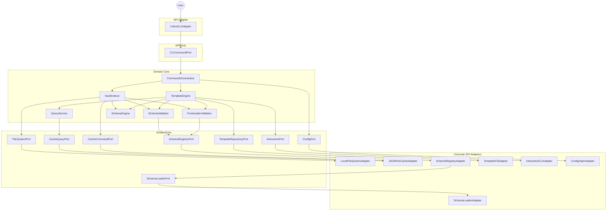

# Components

This section identifies the major logical components and services that implement the system's functionality, organized by architectural layer per hexagonal architecture. Components are classified as:

- **Domain Services:** Business logic components in the core (pure, no infrastructure dependencies)
- **API Port Interfaces:** Contracts for primary/driving adapters (CLI, TUI, LSP) defined by domain
- **API Adapters:** Application driving components (CLI, future TUI/LSP)
- **SPI Port Interfaces:** Contracts for secondary/driven adapters (storage, filesystem, UI, config) defined by domain
- **SPI Adapters:** Service provider implementations (storage, filesystem, UI, config)
- **Shared Internal Packages:** Cross-cutting concerns (logging, errors, registries) used across layers

## Domain Services

The following core services implement PRD epics inside the hexagonal domain. Method signatures below illustrate contractual expectations rather than literal Go declarations; concrete interfaces live in the architecture layer packages. All services must honor context cancellation and propagate errors without leaking infrastructure concerns.

### TemplateEngine

**Responsibility:** Execute template rendering for `lithos new`/`find`, wiring together interactive prompts, lookups, and frontmatter validation. Pure domain service orchestrating template execution.

**Key Interfaces:**

- `Render(ctx context.Context, templateID TemplateID) (string, error)` - Render template to markdown string
- `Load(ctx context.Context, templateID TemplateID) (Template, error)` - Load template via TemplateLoader port

**Dependencies:** TemplateLoader (port), InteractivePort, QueryService, FrontmatterService, Logger.

**Technology Stack:** Go `text/template`, custom function map (`prompt`, `suggester`, `lookup`, `query`, `now`), closures wrapping port calls for dependency injection, zerolog for instrumentation.

### FrontmatterService

**Responsibility:** Extract YAML frontmatter from markdown and validate against schema rules. Single domain service handling both extraction and validation concerns.

**Key Interfaces:**

- `Extract(content []byte) (Frontmatter, error)` - Parse YAML frontmatter from markdown content
- `Validate(ctx context.Context, frontmatter Frontmatter) error` - Validate frontmatter against schema (looked up via FileClass)

**Dependencies:** SchemaRegistry (port for schema lookup), QueryService (for FileSpec resolution), Logger.

**Technology Stack:** Go stdlib (`regexp`, `time`, `reflect`), `goccy/go-yaml` for YAML parsing, PropertySpec polymorphism for type-specific validation, YAML→JSON type coercion for validation, structured FrontmatterError with remediation hints.

### SchemaEngine

**Responsibility:** Coordinate schema loading and provide unified access to schemas and properties. Acts as facade over SchemaLoader and SchemaRegistry using Go generics for type-safe retrieval.

**Key Interfaces:**

- `Load(ctx context.Context) error` - Load schemas and property bank through SchemaLoader port, populate SchemaRegistry
- `Get[T Schema | Property](ctx context.Context, name string) (T, error)` - Retrieve schema or property by name using generics
- `Has[T Schema | Property](ctx context.Context, name string) bool` - Check if schema or property exists using generics

**Dependencies:** SchemaLoader (port), SchemaRegistry (port), Logger.

**Technology Stack:** Pure Go orchestration layer with Go 1.18+ generics, delegates to SchemaLoader for loading (which handles validation and inheritance resolution) and SchemaRegistry for lookups. Idiomatic (T, error) return signatures.

**Usage Examples:**
```go
schema, err := schemaEngine.Get[Schema](ctx, "contact")
property, err := schemaEngine.Get[Property](ctx, "standard_title")
exists := schemaEngine.Has[Schema](ctx, "contact")
```

### VaultIndexer

**Responsibility:** Orchestrate vault scanning and indexing workflow (CQRS write side). Coordinates file walking, frontmatter extraction, validation, cache persistence, and query index population.

**Key Interfaces:**

- `Build(ctx context.Context) (IndexStats, error)` - Full vault scan, cache rebuild, and query index population
- `Refresh(ctx context.Context, paths []string) error` - Incremental update for specific paths and indices (post-MVP)

**Dependencies:** FileWalker (port), FileReader (port), FrontmatterService, CacheWriter (port), QueryService (direct access to populate indices), Logger, Config.

**Technology Stack:** Pure Go orchestration, delegates file operations to ports, atomic indexing with temp file + rename pattern for consistency, directly populates QueryService in-memory indices after cache write completes, zerolog for metrics and progress tracking.

**Note:** VaultIndexer has direct access to QueryService's internal index structures (same package or package-private methods) to populate indices after successful cache write. This keeps write-side concerns (index building) in VaultIndexer while read-side concerns (querying) in QueryService.

### QueryService

**Responsibility:** Provide fast CQRS read-side access for template functions, suggesters, and validators. Maintains in-memory indices for optimized queries.

**Key Interfaces:**

- `ByID(ctx context.Context, id NoteID) (Note, error)` - Retrieve note by NoteID
- `ByPath(ctx context.Context, path string) ([]Note, error)` - Find notes by path (returns single note if file path, multiple if directory path)
- `ByFileClass(ctx context.Context, fileClass string) ([]Note, error)` - Find all notes with matching fileClass (convenience for common frontmatter query)
- `ByFrontmatter(ctx context.Context, field string, value any) ([]Note, error)` - Generic frontmatter field query

**Dependencies:** CacheReader (port), Logger.

**Technology Stack:** In-memory indices backed by Go maps with `sync.RWMutex` for concurrent safety, multiple specialized indices (by ID, path, fileClass, frontmatter fields) for fast lookups, indices populated directly by VaultIndexer after cache write.

---

## API Port Interfaces

Primary (driving) ports define the contracts that domain exposes to adapters. These are the application's use cases.

### CLICommandPort

**Responsibility:** Define application use cases for CLI commands. Implemented directly by CLI adapter through orchestrating domain services.

**Key Interfaces:**

- `New(ctx context.Context, templateID TemplateID) (string, error)` - Execute template to generate new note
- `Find(ctx context.Context) ([]Template, error)` - List available templates for selection
- `Index(ctx context.Context) (IndexStats, error)` - Rebuild vault index and cache

**Dependencies:** Implemented by CLI adapter (CobraAdapter), which composes TemplateEngine, VaultIndexer, QueryService, FrontmatterService, and SchemaEngine via dependency injection.

**Technology Stack:** Defined in `internal/ports/api/` as pure Go interface. CLI adapter implements these use cases by orchestrating domain services. Dependency injection happens in main.go.

---

## SPI Port Interfaces

Driven ports describe how the domain expects infrastructure services to behave. Adapters implement these interfaces so the core can remain environment-agnostic.

### CacheWriterPort

**Responsibility:** Persist indexed notes to on-disk cache (CQRS write side).

**Key Interfaces:**

- `Write(ctx context.Context, note Note) error` - Write note to cache
- `Delete(ctx context.Context, id NoteID) error` - Remove note from cache

**Dependencies:** Implemented by JSONFileCacheAdapter.

**Technology Stack:** Go `encoding/json`, `moby/sys/atomicwriter` for atomic writes, filesystem directory management under `.lithos/cache`.

**Note:** No separate FileWriterPort needed - adapters use `atomicwriter.WriteFile` directly. YAGNI principle - we don't have multiple cache storage implementations for MVP.

### CacheReaderPort

**Responsibility:** Read indexed notes from on-disk cache (CQRS read side).

**Key Interfaces:**

- `Read(ctx context.Context, id NoteID) (Note, error)` - Fetch single note from cache
- `List(ctx context.Context) ([]Note, error)` - List all cached notes

**Dependencies:** Implemented by JSONFileCacheAdapter.

**Technology Stack:** Go `encoding/json`, lazy loading, optional memoization with `sync.RWMutex`.

**Note:** No separate FileReaderPort needed - adapters use `os.ReadFile` and `filepath.Walk` directly. YAGNI principle - we don't have multiple file sources for MVP. If future needs arise (S3, HTTP, embedded), ports can be added then.

### SchemaPort

**Responsibility:** Load, validate, and resolve schema and property bank definitions. Handles schema inheritance resolution, $ref substitution, and circular dependency detection.

**Key Interfaces:**

- `Load(ctx context.Context) ([]Schema, PropertyBank, error)` - Load all schemas and property bank with full resolution

**Dependencies:** Implemented by SchemaLoaderAdapter.

**Technology Stack:** Go `encoding/json`, `os.ReadFile`, `filepath.Walk` for directory scanning (`schemas/*.json` and `schemas/property_bank.json`), schema inheritance resolution algorithm, $ref resolution.

**Note:** SchemaLoaderAdapter handles all validation and inheritance resolution internally. Domain receives fully resolved schemas (no Extends/Excludes, flattened properties with $ref substituted). Fails fast at startup on circular dependencies or invalid $ref. SchemaEngine consumes this port and provides generic `Get[T](name)` access to loaded schemas/properties.

### TemplatePort

**Responsibility:** Load template content from storage. Provides templates to TemplateEngine for rendering.

**Key Interfaces:**

- `List(ctx context.Context) ([]TemplateID, error)` - List available template IDs
- `Load(ctx context.Context, id TemplateID) (Template, error)` - Load template by ID

**Dependencies:** Implemented by TemplateLoaderAdapter.

**Technology Stack:** Go `os.ReadFile`, `filepath.Walk` for scanning Config.TemplatesDir, FileMetadata for mapping TemplateID ↔ filesystem paths, derives TemplateID from basename (filename without extension).

### PromptPort

**Responsibility:** Deliver interactive UX primitives (prompts, suggesters) to template engine for `{{prompt}}` and `{{suggester}}` template functions. Segregated from FinderPort per ISP.

**Key Interfaces:**

- `Prompt(ctx context.Context, cfg PromptConfig) (string, error)` - Text input prompt
- `Suggester(ctx context.Context, cfg SuggesterConfig) (string, error)` - Selection from list

**Dependencies:** Implemented by PromptUIAdapter.

**Technology Stack:** `github.com/manifoldco/promptui`, `golang.org/x/term` for TTY detection.

**Note:** Post-MVP (Phase 4) will migrate to `charmbracelet/huh` + `charmbracelet/bubbletea` for TUI support. Port abstraction enables this swap without changing TemplateEngine.

### FinderPort

**Responsibility:** Provide fuzzy finder for interactive template selection in `lithos find` command. Segregated from PromptPort per ISP.

**Key Interfaces:**

- `Find(ctx context.Context, templates []Template) (Template, error)` - Fuzzy finder for template selection

**Dependencies:** Implemented by FuzzyfindAdapter.

**Technology Stack:** `github.com/ktr0731/go-fuzzyfinder`, `golang.org/x/term` for TTY detection.

**Note:** Only CLI adapter depends on this port (not TemplateEngine). Post-MVP TUI will use different finder implementation.

### ConfigPort

**Responsibility:** Load and expose resolved configuration (vault path, directories, log level) to domain services and adapters.

**Key Interfaces:**

- `Load(ctx context.Context) (Config, error)` - Load config from `lithos.json`, env vars, and CLI flags with precedence

**Dependencies:** Implemented by ViperAdapter.

**Technology Stack:** `github.com/spf13/viper`, precedence: CLI flags > env vars > config file > defaults, searches upward from CWD for `lithos.json`.

**Note:** Config is value object (immutable). Loaded once at startup. Post-MVP: Add `Reload()` for dynamic config updates.

### SchemaRegistryPort

**Responsibility:** Provide fast in-memory access to loaded and resolved schemas and properties. Acts as registry for schema lookups by FrontmatterService and QueryService.

**Key Interfaces:**

- `GetSchema(ctx context.Context, name string) (Schema, error)` - Retrieve schema by name
- `GetProperty(ctx context.Context, name string) (Property, error)` - Retrieve property from bank by name
- `HasSchema(ctx context.Context, name string) bool` - Check if schema exists
- `HasProperty(ctx context.Context, name string) bool` - Check if property exists in bank

**Dependencies:** Implemented by SchemaRegistryAdapter.

**Technology Stack:** In-memory map with `sync.RWMutex` for concurrent reads, populated by SchemaEngine at startup from SchemaPort.Load() results.

**Note:** SchemaEngine wraps this port with generic API: `Get[T Schema | Property](name)` and `Has[T Schema | Property](name)` for convenient type-safe access. Engine translates generic calls to specific port methods (GetSchema/GetProperty).

---

## SPI Adapters

Concrete adapters live in `internal/adapters/spi/` and satisfy the driven ports with environment-specific implementations.

**Note on Filesystem Operations:** Per YAGNI principle, no separate FileSystemAdapter for MVP. Adapters use Go stdlib (`os.ReadFile`, `filepath.Walk`) and `moby/sys/atomicwriter` directly. If future needs arise (S3, HTTP, embedded), filesystem ports can be added.

### JSONCacheWriteAdapter

**Responsibility:** Implement `CacheWriterPort` with atomic JSON persistence (CQRS write side). Handles write concerns: atomic guarantees, consistency, error handling.

**Key Interfaces:**

- `Write(ctx context.Context, note Note) error` - Write note to cache with atomic guarantees
- `Delete(ctx context.Context, id NoteID) error` - Remove note from cache

**Dependencies:** Go `encoding/json`, `moby/sys/atomicwriter`, `os`, `filepath`, Config (cache directory), Logger.

**Technology Stack:** JSON serialization, `atomicwriter.WriteFile` for atomic writes (temp + rename), directory management under `.lithos/cache`, one JSON file per note (filename: `{NoteID}.json`).

**Note:** Shared helper functions (file path construction, directory creation) live in `internal/adapters/spi/cache/helper.go` to avoid duplication with read adapter.

### JSONCacheReadAdapter

**Responsibility:** Implement `CacheReaderPort` with JSON deserialization (CQRS read side). Handles read concerns: lazy loading, error handling, listing performance.

**Key Interfaces:**

- `Read(ctx context.Context, id NoteID) (Note, error)` - Fetch single note from cache
- `List(ctx context.Context) ([]Note, error)` - List all cached notes

**Dependencies:** Go `encoding/json`, `os`, `filepath`, Config (cache directory), Logger.

**Technology Stack:** JSON deserialization, `os.ReadFile` for reads, `filepath.Walk` for directory listing, optional in-memory memoization with `sync.RWMutex` for frequently accessed notes.

**Note:** Read adapter optimized for query performance. Can add caching layer without affecting write adapter.

### SchemaLoaderAdapter

**Responsibility:** Implement `SchemaPort` by loading, validating, and resolving schema and property bank definitions from disk.

**Key Interfaces:**

- `Load(ctx context.Context) ([]Schema, PropertyBank, error)` - Load all schemas and property bank with full resolution

**Dependencies:** Go `encoding/json`, `os.ReadFile`, `filepath.Walk`, Config (schemas directory and property bank file), Logger.

**Technology Stack:** JSON deserialization, schema inheritance resolution algorithm (topological sort, DFS for cycle detection), $ref substitution from property bank, fails fast at startup on circular dependencies or invalid $ref.

**Note:** All validation and resolution happens in this adapter. Domain receives fully resolved schemas (flattened properties, no Extends/Excludes, $ref substituted).

### TemplateLoaderAdapter

**Responsibility:** Implement `TemplatePort` by loading template content from filesystem and managing TemplateID ↔ file path mappings.

**Key Interfaces:**

- `List(ctx context.Context) ([]TemplateID, error)` - List available template IDs
- `Load(ctx context.Context, id TemplateID) (Template, error)` - Load template by ID

**Dependencies:** Go `os.ReadFile`, `filepath.Walk`, FileMetadata (for mapping), Config (templates directory), Logger.

**Technology Stack:** Filesystem scanning of Config.TemplatesDir, derives TemplateID from basename (filename without .md extension), uses FileMetadata for TemplateID ↔ Path mapping.

### PromptUIAdapter

**Responsibility:** Implement `PromptPort` for terminal-based text input and selection interactions used by template engine.

**Key Interfaces:**

- `Prompt(ctx context.Context, cfg PromptConfig) (string, error)` - Text input prompt
- `Suggester(ctx context.Context, cfg SuggesterConfig) (string, error)` - Selection from list

**Dependencies:** `github.com/manifoldco/promptui`, `golang.org/x/term`, Logger.

**Technology Stack:** `promptui` library for prompts, TTY detection via `x/term`, graceful fallback to non-interactive mode when TTY unavailable.

**Note:** Post-MVP (Phase 4) will migrate to `charmbracelet/huh` for TUI support. Port abstraction enables swap without domain changes.

### FuzzyfindAdapter

**Responsibility:** Implement `FinderPort` for fuzzy finding template selection in `lithos find` command.

**Key Interfaces:**

- `Find(ctx context.Context, templates []Template) (Template, error)` - Fuzzy finder for template selection

**Dependencies:** `github.com/ktr0731/go-fuzzyfinder`, `golang.org/x/term`, Logger.

**Technology Stack:** `go-fuzzyfinder` library for fzf-like interface, TTY detection, fullscreen terminal mode.

### ViperAdapter

**Responsibility:** Implement `ConfigPort` by loading configuration from `lithos.json`, environment variables, and CLI flags with proper precedence.

**Key Interfaces:**

- `Load(ctx context.Context) (Config, error)` - Load and resolve configuration from all sources

**Dependencies:** `github.com/spf13/viper`, Go `os`, `filepath`, Logger.

**Technology Stack:** Viper configuration bindings, precedence: CLI flags > env vars > config file > defaults, searches upward from CWD for `lithos.json`, environment variable mapping (e.g., `LITHOS_VAULT_PATH`).

**Note:** Config is immutable value object - loaded once at startup. Post-MVP: Add `Reload()` for dynamic configuration updates.

### SchemaRegistryAdapter

**Responsibility:** Implement `SchemaRegistryPort` by providing fast in-memory registry for schema and property lookups.

**Key Interfaces:**

- `GetSchema(ctx context.Context, name string) (Schema, error)` - Retrieve schema by name
- `GetProperty(ctx context.Context, name string) (Property, error)` - Retrieve property from bank
- `HasSchema(ctx context.Context, name string) bool` - Check if schema exists
- `HasProperty(ctx context.Context, name string) bool` - Check if property exists

**Dependencies:** Go maps, `sync.RWMutex`, Logger.

**Technology Stack:** In-memory registry with concurrent read access via `sync.RWMutex`, populated at startup from SchemaPort.Load() results via SchemaEngine.

**Note:** SchemaEngine wraps this adapter and provides generic `Get[T](name)` API. Registry is read-only after startup initialization.

---

## API Adapters

Driving adapters implement API ports and coordinate domain services. Located in `internal/adapters/api/`.

### CobraCLIAdapter

**Responsibility:** Implement `CLICommandPort` by orchestrating domain services for CLI commands. Translates flags/arguments into domain requests and presents results to users.

**Key Interfaces (implements CLICommandPort):**

- `New(ctx context.Context, templateID TemplateID) (string, error)` - Execute template to generate new note
- `Find(ctx context.Context) ([]Template, error)` - List available templates for selection
- `Index(ctx context.Context) (IndexStats, error)` - Rebuild vault index and cache

**Dependencies:** TemplateEngine, VaultIndexer, QueryService, FrontmatterService, SchemaEngine (domain services), ConfigPort, FinderPort, Logger, `github.com/spf13/cobra`.

**Technology Stack:** Cobra command tree, `pflag` for flag parsing, orchestrates domain services via dependency injection (no CommandOrchestrator), structured output (human-readable + JSON), zerolog instrumentation.

**Note:** CLI adapter implements use cases by composing domain services. Dependency injection happens in main.go. No facade/orchestrator layer needed—direct service composition is clean for MVP.

### BubbleTeaTUIAdapter (Post-MVP)

**Responsibility:** Planned TUI that provides rich terminal UX (status dashboard, live previews) while calling `CLICommandPort`.

**Key Interfaces:**

- `Run(ctx context.Context) error`
- `Update(msg tea.Msg) (tea.Model, tea.Cmd)`

**Dependencies:** `CLICommandPort`, `InteractivePort`, `github.com/charmbracelet/bubbletea`, Logger.

**Technology Stack:** Bubble Tea state machine (`tea.Model`), `lipgloss` styling, reuse of existing prompt/fuzzy finder ports for list selections.

### LSPAdapter (Post-MVP)

**Responsibility:** Planned Language Server Protocol adapter enabling editors to trigger template generation and index operations.

**Key Interfaces:**

- `Initialize(params protocol.InitializeParams) (protocol.InitializeResult, error)`
- `ExecuteCommand(params protocol.ExecuteCommandParams) (interface{}, error)`

**Dependencies:** `CLICommandPort`, `ConfigPort`, LSP JSON-RPC server library, Logger.

**Technology Stack:** `golang.org/x/tools` LSP packages or `sourcegraph/jsonrpc2`, JSON message codecs, reuse of command results formatted for editor diagnostics.

---

## Shared Internal Packages

### Logger

**Responsibility:** Centralized structured logging wrapper around zerolog. Provides consistent log formatting across all components. Supports both JSON (machine-readable) and pretty-print (human-readable) output modes. Filters sensitive data and provides context-aware logging.

**Architecture Layer + Rationale:** Shared Internal Package (Cross-Cutting Concern). Used by all layers. Not domain logic or infrastructure—pure technical concern. Centralized to enforce consistent logging patterns.

**Key Interfaces:**

- `Log zerolog.Logger` - Global logger instance
- `WithComponent(component string) zerolog.Logger` - Add component context
- `WithOperation(operation string) zerolog.Logger` - Add operation context
- `WithCorrelationID(id string) zerolog.Logger` - Add correlation ID

**Dependencies:**

- ConfigPort - For log level configuration
- `golang.org/x/term` - For TTY detection (pretty-print vs JSON)

**Technology Stack:**

- `github.com/rs/zerolog` v1.34.0 for structured logging
- Go stdlib `os` for stdout/stderr detection

---

### Error Package

**Responsibility:** Defines domain-specific error types for better error handling and user messaging. Implements Rust-style Result<T> pattern for functional error handling. Wraps stdlib errors with context. Provides error factories and helper functions.

**Architecture Layer + Rationale:** Shared Internal Package (Cross-Cutting Concern). Used by all layers. Not domain logic or infrastructure—pure technical concern. Centralized error definitions enable consistent error handling.

**Key Types:**

- `BaseError` – Lightweight foundation (message + optional cause)
- `ValidationError` – Property-level validation failures (property, reason, value)
- `ResourceError` – Resource operations (resource, operation, target, cause)
- Domain-specific wrappers:
  - `SchemaError`, `SchemaValidationError`, `SchemaNotFoundError`
  - `RequiredFieldError`, `ArrayConstraintError`, `FieldValidation`
  - `TemplateError`
- `Result[T]` – Custom Result type with generics (no external dependencies)
- Error helpers: `Wrap()`, `WrapWithContext()`, `NewFieldValidationError()`, `NewPropertySpecError()`

**Dependencies:**

- Go stdlib `errors` package for wrapping and `errors.Join()`
- Go stdlib `fmt` for error formatting

**Technology Stack:**

- Go 1.23+ minimum version requirement (for generics support)
- Custom Result[T] pattern using Go generics (no external dependencies)
- Go stdlib `errors` package for error wrapping
- Go stdlib `fmt` for error formatting

---

### Registry Package

**Responsibility:** Generic in-memory registry implementation with CQRS-aware interfaces. Provides thread-safe storage for schemas and templates loaded at startup. Supports read-only access for validators/queries and write-only access for loaders. Generic implementation reusable across different data types.

**Architecture Layer + Rationale:** Shared Internal Package (Cross-Cutting Concern). Used by Schema Service and Template Service. Not domain logic or infrastructure—pure technical pattern. Centralized to avoid code duplication.

**Key Interfaces:**

- `Reader[T any]` - Read-only access (`Get`, `Exists`, `ListKeys`)
- `Writer[T any]` - Write-only access (`Register`, `Clear`)
- `Persister` - Persistence operations (`SaveIndex`, `LoadIndex`)
- `Registry[T any]` - Full registry combining all capabilities
- `New[T any]() Registry[T]` - Constructor

**Dependencies:**

- Go stdlib `sync` package for RWMutex
- Go stdlib `encoding/json` for Persister (optional)

**Technology Stack:**

- Pure Go with generics (requires Go 1.23+)
- Go stdlib `sync.RWMutex` for thread-safe access

---

## Component Diagrams



**Legend:**

- CSP = CLICommandPort,
- FS = FileSystemPort,
- CC = CacheCommandPort,
- CQ = CacheQueryPort,
- FV = FrontmatterValidator,
- SE = SchemaEngine,
- SL = SchemaLoaderPort,
- SRP = SchemaRegistryPort,
- SV = SchemaValidator,
- TR = TemplateRepositoryPort,
- IP = InteractivePort,
- CP = ConfigPort,
  and similarly for adapter abbreviations.

---
