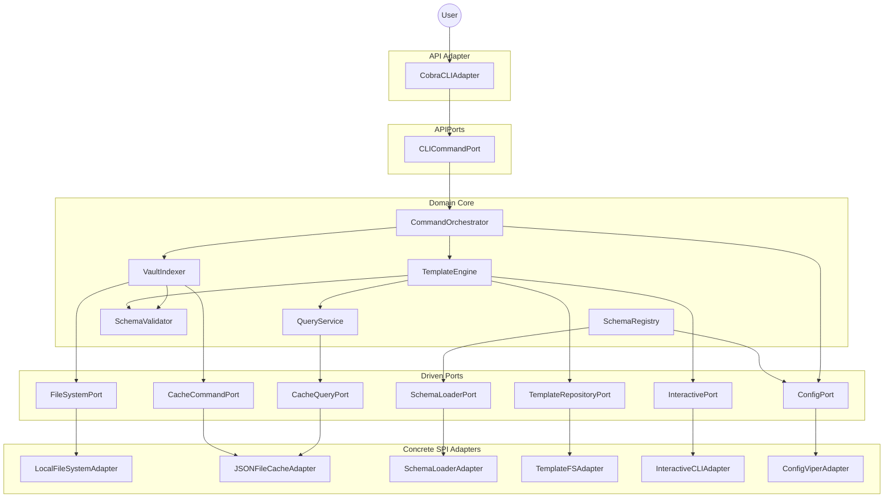

# Components

This section identifies the major logical components and services that implement the system's functionality, organized by architectural layer per hexagonal architecture. Components are classified as:

- **Domain Services:** Business logic components in the core (pure, no infrastructure dependencies)
- **API Port Interfaces:** Contracts for primary/driving adapters (CLI, TUI, LSP) defined by domain
- **SPI Port Interfaces:** Contracts for secondary/driven adapters (storage, filesystem, UI, config) defined by domain
- **SPI Adapters:** Service provider implementations (storage, filesystem, UI, config)
- **API Adapters:** Application driving components (CLI, future TUI/LSP)
- **Shared Internal Packages:** Cross-cutting concerns (logging, errors, registries) used across layers

## Domain Services

The following core services implement PRD epics inside the hexagonal domain. Method signatures below illustrate contractual expectations rather than literal Go declarations; concrete interfaces live in the architecture layer packages. All services must honor context cancellation and propagate errors without leaking infrastructure concerns.

### TemplateEngine

**Responsibility:** Execute template rendering for `lithos new`/`find`, wiring together interactive prompts, lookups, and schema validation.

**Key Interfaces:**

- `Execute(templateID string, ctx context.Context) (RenderResult, error)`
- `Register(template Template)`

**Dependencies:** TemplateRepositoryPort, InteractivePort (PromptPort/FuzzyFinderPort), QueryService (read interface), SchemaValidator, Logger.

**Technology Stack:** Go `text/template`, custom function map (`prompt`, `suggester`, `lookup`, `query`, `now`), closures wrapping port calls, zerolog for instrumentation.

### SchemaRegistry

**Responsibility:** Load schemas/property banks, resolve inheritance/exclusions, and expose an immutable registry.

**Key Interfaces:**

- `Load(ctx context.Context) error`
- `Get(name string) (Schema, bool)`

**Dependencies:** SchemaLoaderPort (filesystem adapter), PropertyBank loader, Config (schema directory resolution), Registry package, Logger.

**Technology Stack:** Go `encoding/json`, custom builder pattern for inheritance resolution, cycle detection via DFS, `sync.RWMutex` guarded registry.

### SchemaValidator

**Responsibility:** Validate frontmatter against schema rules prior to note creation or during indexing.

**Key Interfaces:**

- `Validate(schemaName string, fm Frontmatter) []ValidationError`
- `Lint(template Template) []ValidationError` (stretch goal hook)

**Dependencies:** SchemaRegistry, QueryService (for FileProperty resolution), Logger, Error package.

**Technology Stack:** Go stdlib (`reflect`, `regexp`, `time`), PropertySpec polymorphism, structured errors enriched with remediation tips.

### VaultIndexer

**Responsibility:** Scan vaults, parse frontmatter, and persist the hybrid cache that powers lookups.

**Key Interfaces:**

- `Rebuild(ctx context.Context, vaultPath string) (IndexStats, error)`
- `Refresh(paths []string) error` (post-MVP incremental updates)

**Dependencies:** FileSystemPort, CacheCommandPort, SchemaValidator, QueryService (writer side), Logger, Config.

**Technology Stack:** Custom frontmatter extractor + `goccy/go-yaml`, Go filesystem walk, JSON serialization to `.lithos/cache`, zerolog metrics, atomic write pattern (temp file + rename) to guarantee readers never observe partial files.

### QueryService

**Responsibility:** Provide fast read-side access for template functions, suggesters, and validators.

**Key Interfaces:**

- `Lookup(ctx context.Context, criteria LookupCriteria) (Note, error)`
- `Query(ctx context.Context, filter QueryFilter) ([]Note, error)`

**Dependencies:** CacheQueryPort, Registry package, Logger.

**Technology Stack:** In-memory indices backed by Go maps plus `sync.RWMutex` for concurrent safety, priority resolution (path > YAML `id` > basename), stale cache detection via mod-time checks, future sharding/LRU options for large vaults.

### CommandOrchestrator

**Responsibility:** Facade consumed by API adapters, coordinating domain services for CLI workflows.

**Key Interfaces:**

- `New(ctx context.Context, templateID string) (RenderResult, error)`
- `Find(ctx context.Context) (RenderResult, error)`
- `Index(ctx context.Context) (IndexStats, error)`

**Dependencies:** TemplateEngine, QueryService, VaultIndexer, SchemaValidator, Logger, Config.

**Technology Stack:** Pure Go orchestration layer, context-aware method signatures, structured result objects for adapters, zerolog-backed tracing.

---

## API Port Interfaces

Primary (driving) ports define the contracts that adapters such as the Cobra CLI—and future TUI/LSP front-ends—use to interact with the domain core.

### CLICommandPort

**Responsibility:** Provide a stable interface for command-oriented workflows (`new`, `find`, `index`) exposed to all driving adapters.

**Key Interfaces:**

- `New(ctx context.Context, templateID string) (RenderResult, error)`
- `Find(ctx context.Context) (RenderResult, error)`
- `Index(ctx context.Context) (IndexStats, error)`

**Dependencies:** Implemented by CommandOrchestrator, which composes TemplateEngine, VaultIndexer, QueryService, and SchemaValidator behind the scenes.

**Technology Stack:** Defined in `internal/app/ports/api.go` as pure Go interfaces; shared response structs (`RenderResult`, `IndexStats`) live alongside the port for reuse by adapters.

---

## SPI Port Interfaces

Driven ports describe how the domain expects infrastructure services to behave. Adapters implement these interfaces so the core can remain environment-agnostic.

### FileSystemPort

**Responsibility:** Provide safe file read/write/walk operations so domain services can interact with the vault without importing `os`.

**Key Interfaces:**

- `ReadFile(path string) ([]byte, error)`
- `WriteFileAtomic(path string, data []byte) error`
- `Walk(root string, fn WalkFunc) error`

**Dependencies:** Implemented by LocalFileSystemAdapter.

**Technology Stack:** Go `os`, `io`, and atomic write helpers (temp file + rename); honors config-defined vault roots.

### CacheCommandPort

**Responsibility:** Persist index writes to the on-disk cache as part of the hybrid storage model.

**Key Interfaces:**

- `Store(note Note) error`
- `Remove(path string) error`

**Dependencies:** JSONFileCacheAdapter (write view).

**Technology Stack:** Go `encoding/json`, filesystem directory management under `.lithos/cache`.

### CacheQueryPort

**Responsibility:** Serve read-side cache access for lookup/query operations.

**Key Interfaces:**

- `Fetch(path string) (Note, error)`
- `List() ([]Note, error)`

**Dependencies:** JSONFileCacheAdapter (read view) plus in-memory index maintained by QueryService.

**Technology Stack:** Go JSON decoding with optional in-memory memoization backed by `sync.RWMutex`.

### SchemaLoaderPort

**Responsibility:** Load schema and property bank definitions for the registry.

**Key Interfaces:**

- `LoadSchemas(ctx context.Context) ([]SchemaDefinition, error)`
- `LoadPropertyBank(ctx context.Context) ([]PropertyDefinition, error)`

**Dependencies:** SchemaLoaderAdapter.

**Technology Stack:** Go filesystem abstractions, `encoding/json`, directory scanning for `schemas/*.json` and `properties/*.json`.

### TemplateRepositoryPort

**Responsibility:** Enumerate available templates and supply their content to the engine.

**Key Interfaces:**

- `ListTemplates(ctx context.Context) ([]TemplateMetadata, error)`
- `GetTemplate(ctx context.Context, id string) (Template, error)`

**Dependencies:** TemplateFSAdapter (initially), future adapters for remote packs.

**Technology Stack:** Filesystem scanning (`templates/`), optional caching, Go `text/template` metadata helpers.

### InteractivePort (PromptPort & FuzzyFinderPort)

**Responsibility:** Deliver interactive UX primitives (prompts, suggesters, fuzzy finder) to the template engine.

**Key Interfaces:**

- `Prompt(cfg PromptConfig) (string, error)`
- `Suggester(cfg SuggesterConfig) (string, error)`
- `Find(items []TemplateMetadata) (TemplateMetadata, error)` (fuzzy finder)

**Dependencies:** InteractiveCLIAdapter; future adapters may wrap Bubble Tea or GUI libraries.

**Technology Stack:** `github.com/manifoldco/promptui`, `github.com/ktr0731/go-fuzzyfinder`, terminal detection via `golang.org/x/term`.

### ConfigPort

**Responsibility:** Expose resolved configuration (vault path, template/schema directories, log level) to domain services.

**Key Interfaces:**

- `Config() Config`
- `Reload(ctx context.Context) (Config, error)` (post-MVP)

**Dependencies:** ConfigViperAdapter.

**Technology Stack:** `github.com/spf13/viper`, environment variable binding, default resolution logic.

---

## SPI Adapters

Concrete adapters live in `internal/adapters/` and satisfy the driven ports with environment-specific implementations.

### LocalFileSystemAdapter

**Responsibility:** Implement `FileSystemPort`, wrapping filesystem interactions with safe defaults for vault operations.

**Key Interfaces:**

- `ReadFile(path string) ([]byte, error)`
- `WriteFileAtomic(path string, data []byte) error`
- `Walk(root string, fn WalkFunc) error`

**Dependencies:** Go `os`, `io`, `path/filepath`, Config (vault root), Logger for error reporting.

**Technology Stack:** Stdlib-only adapter with atomic write helpers (temp file + rename); tested via temp directories to ensure portability.

### JSONFileCacheAdapter

**Responsibility:** Provide disk-backed persistence for both `CacheCommandPort` and `CacheQueryPort`.

**Key Interfaces:**

- `Store(note Note) error`
- `Remove(path string) error`
- `Fetch(path string) (Note, error)`
- `List() ([]Note, error)`

**Dependencies:** LocalFileSystemAdapter (optional composition), Go `encoding/json`, Config (cache directory), Logger.

**Technology Stack:** JSON serialization/deserialization, directory management under `.lithos/cache`, path hashing for filenames, atomic write/rename workflow mirroring VaultIndexer.

### SchemaLoaderAdapter

**Responsibility:** Fulfill `SchemaLoaderPort` by loading schema/property bank definitions from disk.

**Key Interfaces:**

- `LoadSchemas(ctx context.Context) ([]SchemaDefinition, error)`
- `LoadPropertyBank(ctx context.Context) ([]PropertyDefinition, error)`

**Dependencies:** LocalFileSystemAdapter, Config (schemas directory), Logger for validation warnings.

**Technology Stack:** Go filesystem globbing, `encoding/json`, optional caching to avoid repeated loads during runtime.

### TemplateFSAdapter

**Responsibility:** Implement `TemplateRepositoryPort`, indexing template metadata and retrieving content.

**Key Interfaces:**

- `ListTemplates(ctx context.Context) ([]TemplateMetadata, error)`
- `GetTemplate(ctx context.Context, id string) (Template, error)`

**Dependencies:** LocalFileSystemAdapter, Config (templates directory), optional in-memory cache, Logger.

**Technology Stack:** Filesystem scanning, file hashing for change detection, lazy loading of template bodies.

### InteractiveCLIAdapter

**Responsibility:** Implement `PromptPort` and `FuzzyFinderPort` for terminal-based interactions.

**Key Interfaces:**

- `Prompt(cfg PromptConfig) (string, error)`
- `Suggester(cfg SuggesterConfig) (string, error)`
- `Find(items []TemplateMetadata) (TemplateMetadata, error)`

**Dependencies:** `github.com/manifoldco/promptui`, `github.com/ktr0731/go-fuzzyfinder`, `golang.org/x/term`, Logger.

**Technology Stack:** Prompt/fuzzy finder libraries, terminal capability detection, graceful fallback to non-interactive modes, dependency health monitoring with contingency to migrate if PromptUI stagnation becomes a blocker.

### ConfigViperAdapter

**Responsibility:** Provide configuration resolution for `ConfigPort`, combining file, environment, and flag sources.

**Key Interfaces:**

- `Config() Config`
- `Reload(ctx context.Context) (Config, error)`

**Dependencies:** `github.com/spf13/viper`, Config defaults (`lithos.yaml` schema), Logger for warning messages on missing/invalid keys.

**Technology Stack:** Viper configuration bindings, environment variable mapping, optional flag integration, Go structs for strong typing.

---

## API Adapters

Driving adapters invoke the domain through API ports. Today only the Cobra CLI exists, but future UI channels will reuse the same contracts.

### CobraCLIAdapter

**Responsibility:** Wire command-line interactions to `CLICommandPort`, translating flags/arguments into domain requests and presenting results.

**Key Interfaces:**

- `Execute(args []string) int`
- `registerCommands(root *cobra.Command)`

**Dependencies:** `CLICommandPort`, `ConfigPort`, `github.com/spf13/cobra`, Logger.

**Technology Stack:** Cobra command tree, `pflag` for flag parsing, structured output helpers (human-readable + JSON), zerolog instrumentation.

### BubbleTeaTUIAdapter (Post-MVP)

**Responsibility:** Planned TUI that provides rich terminal UX (status dashboard, live previews) while calling `CLICommandPort`.

**Key Interfaces:**

- `Run(ctx context.Context) error`
- `Update(msg tea.Msg) (tea.Model, tea.Cmd)`

**Dependencies:** `CLICommandPort`, `InteractivePort`, `github.com/charmbracelet/bubbletea`, Logger.

**Technology Stack:** Bubble Tea state machine (`tea.Model`), `lipgloss` styling, reuse of existing prompt/fuzzy finder ports for list selections.

### LSPAdapter (Post-MVP)

**Responsibility:** Planned Language Server Protocol adapter enabling editors to trigger template generation and index operations.

**Key Interfaces:**

- `Initialize(params protocol.InitializeParams) (protocol.InitializeResult, error)`
- `ExecuteCommand(params protocol.ExecuteCommandParams) (interface{}, error)`

**Dependencies:** `CLICommandPort`, `ConfigPort`, LSP JSON-RPC server library, Logger.

**Technology Stack:** `golang.org/x/tools` LSP packages or `sourcegraph/jsonrpc2`, JSON message codecs, reuse of command results formatted for editor diagnostics.

---

## Shared Internal Packages

### Logger

**Responsibility:** Centralized structured logging wrapper around zerolog. Provides consistent log formatting across all components. Supports both JSON (machine-readable) and pretty-print (human-readable) output modes. Filters sensitive data and provides context-aware logging.

**Architecture Layer + Rationale:** Shared Internal Package (Cross-Cutting Concern). Used by all layers. Not domain logic or infrastructure—pure technical concern. Centralized to enforce consistent logging patterns.

**Key Interfaces:**

- `Log zerolog.Logger` - Global logger instance
- `WithComponent(component string) zerolog.Logger` - Add component context
- `WithOperation(operation string) zerolog.Logger` - Add operation context
- `WithCorrelationID(id string) zerolog.Logger` - Add correlation ID

**Dependencies:**

- ConfigPort - For log level configuration
- `golang.org/x/term` - For TTY detection (pretty-print vs JSON)

**Technology Stack:**

- `github.com/rs/zerolog` v1.34.0 for structured logging
- Go stdlib `os` for stdout/stderr detection

---

### Error Package

**Responsibility:** Defines domain-specific error types for better error handling and user messaging. Implements Rust-style Result<T> pattern for functional error handling. Wraps stdlib errors with context. Provides error factories and helper functions.

**Architecture Layer + Rationale:** Shared Internal Package (Cross-Cutting Concern). Used by all layers. Not domain logic or infrastructure—pure technical concern. Centralized error definitions enable consistent error handling.

**Key Types:**

- `ValidationError` - Schema validation failures (field, message, value)
- `ConfigError` - Configuration issues (key, message)
- `TemplateError` - Template syntax/execution errors (template, line, message)
- `SchemaError` - Schema loading/resolution errors (schema, message)
- `StorageError` - Cache access failures (operation, path, cause)
- `FileSystemError` - File I/O failures (operation, path, cause)
- `Result[T]` - Custom Result type with generics (no external dependencies)
- Error wrapping functions: `Wrap()`, `WrapWithContext()`
- Factory functions: `NewValidationError()`, `NewNotFoundError()`, `NewConfigurationError()`, `NewTemplateError()`, `NewSchemaError()`, `NewStorageError()`, `NewFileSystemError()`

**Dependencies:**

- Go stdlib `errors` package for wrapping and `errors.Join()`
- Go stdlib `fmt` for error formatting

**Technology Stack:**

- Go 1.23+ minimum version requirement (for generics support)
- Custom Result[T] pattern using Go generics (no external dependencies)
- Go stdlib `errors` package for error wrapping
- Go stdlib `fmt` for error formatting

---

### Registry Package

**Responsibility:** Generic in-memory registry implementation with CQRS-aware interfaces. Provides thread-safe storage for schemas and templates loaded at startup. Supports read-only access for validators/queries and write-only access for loaders. Generic implementation reusable across different data types.

**Architecture Layer + Rationale:** Shared Internal Package (Cross-Cutting Concern). Used by Schema Service and Template Service. Not domain logic or infrastructure—pure technical pattern. Centralized to avoid code duplication.

**Key Interfaces:**

- `Reader[T any]` - Read-only access (`Get`, `Exists`, `ListKeys`)
- `Writer[T any]` - Write-only access (`Register`, `Clear`)
- `Persister` - Persistence operations (`SaveIndex`, `LoadIndex`)
- `Registry[T any]` - Full registry combining all capabilities
- `New[T any]() Registry[T]` - Constructor

**Dependencies:**

- Go stdlib `sync` package for RWMutex
- Go stdlib `encoding/json` for Persister (optional)

**Technology Stack:**

- Pure Go with generics (requires Go 1.23+)
- Go stdlib `sync.RWMutex` for thread-safe access

---

## Component Diagrams

**Legend:**

- CSP = CLICommandPort,
- FS = FileSystemPort,
- CC = CacheCommandPort,
- CQ = CacheQueryPort,
- SE = SchemaLoaderPort,
- TR = TemplateRepositoryPort,
- IP = InteractivePort,
- CP = ConfigPort,
  and similarly for adapter abbreviations.

---
