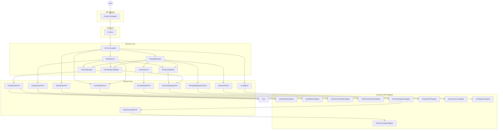

# Components

This section identifies the major logical components and services that implement the system's functionality, organized by architectural layer per hexagonal architecture. Components are classified as:

- **Domain Services:** Business logic components in the core (pure, no infrastructure dependencies)
- **API Port Interfaces:** Contracts for primary/driving adapters (CLI, TUI, LSP) defined by domain
- **API Adapters:** Application driving components (CLI, future TUI/LSP)
- **SPI Port Interfaces:** Contracts for secondary/driven adapters (storage, filesystem, UI, config) defined by domain
- **SPI Adapters:** Service provider implementations (storage, filesystem, UI, config)
- **Shared Internal Packages:** Cross-cutting concerns (logging, errors, registries) used across layers

## Domain Services

The following core services implement PRD epics inside the hexagonal domain. Method signatures below illustrate contractual expectations rather than literal Go declarations; concrete interfaces live in the architecture layer packages. All services must honor context cancellation and propagate errors without leaking infrastructure concerns.

### TemplateEngine

**Responsibility:** Execute template rendering for `lithos new`/`find`, wiring together interactive prompts, lookups, and frontmatter validation. Pure domain service orchestrating template execution with custom function map for user interaction and file path control. Enhanced with goldmark for markdown rendering capabilities in templates.

**Key Interfaces:**

- `Render(ctx context.Context, templateID TemplateID) (string, error)` - Render template to markdown string with goldmark markdown processing
- `Load(ctx context.Context, templateID TemplateID) (Template, error)` - Load template via TemplateLoader port

**Dependencies:** TemplateLoader (port), InteractivePort, QueryService, FrontmatterService, Config, Logger.

**Technology Stack:** Go `text/template`, `github.com/yuin/goldmark` for markdown rendering in templates, custom function map with user interaction and file control functions, closures wrapping port calls for dependency injection, zerolog for instrumentation.

**Custom Template Functions:**

The TemplateEngine provides a function map injected into Go's `text/template` for interactive prompts, vault queries, and file path control:

**User Interaction Functions:**
- `prompt(name, label, default)` - Text input prompt via InteractivePort
- `suggester(name, label, options)` - Selection from list via InteractivePort
- `now(format)` - Current timestamp with Go time layout format

**Vault Query Functions:**
- `lookup(basename)` - Find note by basename via QueryService
- `query(filter)` - Query notes by criteria via QueryService
- `fileClass(path)` - Get note's fileClass field by vault-relative path

**File Path Control Functions** (inspired by Templater file module):
- `path()` - Returns the target file path for the note being created. Used to determine where the note will be saved.
- `folder(path)` - Returns parent directory of path. Can be chained to navigate up directory tree.
- `basename(path)` - Returns filename without extension from path.
- `extension(path)` - Returns file extension from path.
- `join(parts...)` - Joins path segments using OS-appropriate separator.
- `vaultPath()` - Returns absolute vault root path from Config.

**File Path Function Examples:**

```go
// Template can control its own save location
{{- $targetPath := join (vaultPath) "contacts" (printf "%s.md" (prompt "filename" "Filename" "")) -}}
// Sets target path for CLICommander to use when saving

// Or derive from frontmatter fields
{{- $slug := lower (replace (prompt "title" "Title" "") " " "-") -}}
{{- $targetPath := join (vaultPath) "notes" (printf "%s.md" $slug) -}}

// Access current path context (during rendering)
{{- $currentFolder := folder (path) -}}
{{- $currentName := basename (path) -}}
```

**Note:** The `path()` function returns the target path being constructed during rendering. Templates set this implicitly through frontmatter or explicitly via `$targetPath` variable. CLICommander uses the resolved path to save the note via `atomicwriter.WriteFile` directly (no FileWriter port - YAGNI principle).

### FrontmatterService

**Responsibility:** Validate frontmatter against schema rules with semantic business logic enforcement. Pure domain service focused on schema compliance validation. Delegates markdown parsing to MarkdownParserPort (adapter layer) to maintain clean hexagonal architecture separation.

**Key Interfaces:**

- `IsSchemaCompliant(ctx context.Context, frontmatter Frontmatter) error` - Validate frontmatter against schema (semantic validation only)

**Dependencies:** MarkdownParserPort (for syntactic parsing), SchemaRegistryPort (for schema lookups), VaultReaderPort (for FileSpec validation), Logger.

**Note:** FrontmatterService is a pure domain service with zero infrastructure dependencies. MarkdownParserAdapter (adapter layer) performs syntactic validation (YAML structure) via FrontmatterDTO.ValidateSyntax(), then converts to domain.Frontmatter. FrontmatterService performs semantic validation only (schema compliance, business rules). Clean separation: syntactic validation (YAML parsing, structure) in adapter layer, semantic validation (schema rules, type constraints) in domain layer.

**Technology Stack:** Pure Go domain logic (`regexp`, `time`, `reflect`, `math`), PropertySpec polymorphism for type-specific validation, in-memory type normalization for validation logic, structured FrontmatterError with remediation hints. No direct markdown parsing dependencies.

**Frontmatter Validation (Business Rules with Strict Type Checking):**

FrontmatterService.Validate() performs strict validation with in-memory type normalization for validation logic only. **Important:** Validation never modifies files—normalization is purely in-memory for validation purposes. Data transformations (like scalar→array coercion or type conversions) are linting concerns, not validation concerns.

- **Purpose:** Validate YAML frontmatter data strictly against schema business rules
- **When:** Every note indexing and validation operation
- **Complexity:** High - requires YAML type handling and cross-field validation
- **Philosophy:** Validator is strict and raises errors when data doesn't match schema. A future linter would be permissive and auto-fix issues.

**Validation Workflow:**

1. **Schema Lookup:** Get schema from SchemaRegistry using frontmatter.FileClass
2. **Required Field Check:** Ensure all required properties present in frontmatter.Fields
3. **Array vs Scalar Check:** Verify array/scalar expectation matches (no auto-coercion)
4. **Type Normalization (In-Memory Only):** Normalize YAML types for validation logic without modifying files
5. **Constraint Validation:** Validate normalized value against PropertySpec constraints (pattern, min/max, enum, etc.)
6. **File Reference Validation:** For FileSpec properties, validate file exists via VaultReaderPort.Read() (avoids circular dependency with QueryService)
7. **Error Aggregation:** Return all validation errors with field-level remediation hints

**YAML Type Handling:**

The `goccy/go-yaml` parser handles YAML syntax and returns Go types. FrontmatterService validates these Go types against schema expectations:

```yaml
# Strings (quoted or unquoted - both valid YAML)
title: hello world           # Unquoted string → string
title: "hello world"         # Quoted string → string
title: 'single quoted'       # Single-quoted → string
description: |               # Block scalar → string
  Multiline text

# Numbers (YAML doesn't distinguish int/float)
count: 42                    # Integer notation → int64 in Go
price: 42.5                  # Float notation → float64 in Go
# Validator normalizes to float64 IN-MEMORY for validation only
# Files remain unchanged!

# Booleans (YAML liberal syntax)
active: true                 # Boolean literal → bool
active: yes                  # YAML boolean → bool (parser converts)
active: on                   # YAML boolean → bool (parser converts)

# Arrays
tags: [work, personal]       # Flow style → []any
tags:                        # Block style → []any
  - work
  - personal
```

**Type Validation Strategy:**

```go
// StringSpec validation
title: "hello"  ✓ (string type matches)
title: 42       ✗ ERROR: Expected string, got number

// NumberSpec validation
count: 42       ✓ (int normalized to float64 in-memory for validation)
count: 42.5     ✓ (float already float64)
count: "42"     ✗ ERROR: Expected number, got string
# Note: If NumberSpec.Step = 1.0, validator checks value == floor(value)

// BoolSpec validation
active: true    ✓ (bool type)
active: yes     ✓ (YAML parser converts to bool)
active: 1       ✗ ERROR: Expected boolean, got number
active: "true"  ✗ ERROR: Expected boolean, got string

// Array validation (NO auto-coercion)
tags: [work]    ✓ (array when Property.Array = true)
tags: work      ✗ ERROR: Expected array, got scalar
tags: [work]    ✗ ERROR: Expected scalar, got array (when Property.Array = false)
```

**Validation vs Linting:**

- **Validator (FrontmatterService):** Strict enforcement. Raises errors when data doesn't match schema. User must fix data or schema.
- **Linter (Future feature):** Permissive transformation. Auto-fixes common issues like `tags: work` → `tags: [work]` or type conversions.

**In-Memory Normalization:**

Validator normalizes types in-memory for validation logic only:

- YAML integers → float64 for NumberSpec validation (files unchanged)
- Step attribute determines int vs float semantics:
  - `Step: 1.0` → Requires integer values (checks `value == math.Floor(value)`)
  - `Step: 0.1` → Allows fractional values
  - `Step: nil` → Any precision allowed

**Implementation Note:**

All public methods with multiple steps follow Single Responsibility Principle by decomposing into private methods. For example, Validate() orchestrates via private methods: lookupSchema(), validateAgainstSchema(), validateProperty(), validateArrayExpectation(), coerceValue(), validateAgainstSpec(), etc. Each private method has one clear responsibility.

**Error Format:**

Validation errors returned as structured FrontmatterError types with schema name, field name, rule violated, actual value, and remediation message for CLI display.

### SchemaEngine

**Responsibility:** Pure orchestration service coordinating schema initialization and providing unified access to loaded schemas and properties. Delegates all infrastructure concerns (validation, inheritance resolution, $ref substitution) to adapter layer components.

**Key Interfaces:**

- `Load(ctx context.Context) error` - Orchestrate schema loading through SchemaLoader adapter (which handles validation, inheritance resolution, and registration internally)
- `Get[T Schema | Property](ctx context.Context, name string) (T, error)` - Retrieve schema or property by name using generics
- `Has[T Schema | Property](ctx context.Context, name string) bool` - Check if schema or property exists using generics

**Dependencies:** SchemaLoader (port), SchemaRegistry (port), Logger.

**Technology Stack:** Pure Go orchestration layer with Go 1.18+ generics. Delegates complex infrastructure logic to adapter layer components. Maintains stable interface for Epic 3+ compatibility.

**Schema Loading Workflow:**

The Load() method orchestrates schema initialization through the adapter layer:

1. **Load & Process:** SchemaLoader adapter handles complete pipeline (JSON parsing → validation → inheritance resolution → $ref substitution → registration)
2. **Register:** SchemaRegistry populated with fully resolved schemas for fast lookups

**Fails Fast:** Any error in adapter layer terminates application at startup. No invalid schemas reach runtime.

**Usage Examples:**
```go
// At startup
if err := schemaEngine.Load(ctx); err != nil {
    log.Fatal("schema loading failed:", err)
}

// Runtime lookups
schema, err := schemaEngine.Get[Schema](ctx, "contact")
property, err := schemaEngine.Get[Property](ctx, "standard_title")
exists := schemaEngine.Has[Schema](ctx, "contact")
```

### SchemaValidator (Adapter Layer)

**Responsibility:** Infrastructure adapter for JSON schema file structure validation. Performs cross-schema validation that requires seeing multiple schemas together. Pure infrastructure logic separated from domain concerns.

**Key Interfaces:**

- `ValidateAll(ctx context.Context, schemas []Schema) error` - Orchestrate validation of all schemas and check cross-schema references

**Dependencies:** None (pure infrastructure logic).

**Technology Stack:** Orchestrates schema.Validate() calls, validates cross-schema references, aggregates errors using errors.Join().

**Location:** `internal/adapters/spi/schema/validator.go`

### PropertyDereferencer (Adapter Layer)

**Responsibility:** Infrastructure adapter handling $ref substitution with PropertyBank lookups. Pure infrastructure concern for JSON pointer resolution.

**Key Interfaces:**

- `Dereference(ctx context.Context, schemas []Schema, bank PropertyBank) ([]Schema, error)` - Replace all $ref references with PropertyBank property definitions

**Dependencies:** None (pure infrastructure logic).

**Technology Stack:** JSON pointer resolution, PropertyBank lookups, error aggregation.

**Location:** `internal/adapters/spi/schema/dereferencer.go`

### SchemaExtender (Adapter Layer)

**Responsibility:** Infrastructure adapter handling extends/excludes inheritance attribute processing. Pure infrastructure concern for inheritance resolution.

**Key Interfaces:**

- `Extend(ctx context.Context, schemas []Schema) ([]Schema, error)` - Resolve inheritance chains, flatten Extends/Excludes, detect circular dependencies

**Dependencies:** None (pure infrastructure logic).

**Technology Stack:** Topological sorting, inheritance merging, cycle detection.

**Location:** `internal/adapters/spi/schema/extender.go`

**Validation Responsibilities:**

SchemaValidator has two distinct responsibilities that require service-level logic:

1. **Orchestrate Model Validation:**
   - Calls schema.Validate() on each schema
   - Each schema delegates to property.Validate() → propertySpec.Validate()
   - Aggregates all structural validation errors
   - **Why service needed:** Centralized orchestration and error aggregation across all schemas

2. **Cross-Schema Validation:**
   - Validates Extends references point to existing schemas
   - Validates PropertyBank $ref references exist
   - Ensures no duplicate schema names
   - **Why service needed:** Individual schemas can't validate references without seeing other schemas and PropertyBank

**What SchemaValidator Does NOT Do:**

- Structural validation of individual schemas (delegated to schema.Validate())
- Inheritance resolution (handled by SchemaExtender adapter)
- $ref substitution (handled by PropertyDereferencer adapter)
- Circular dependency detection (handled by SchemaExtender during topological sort)

**Example Implementation Pattern:**

```go
func (v *SchemaValidator) ValidateAll(ctx context.Context, schemas []Schema) error {
    var errors []error

    // 1. Orchestrate model-level validation
    for _, schema := range schemas {
        if err := schema.Validate(ctx); err != nil {
            errors = append(errors, fmt.Errorf("schema %s: %w", schema.Name, err))
        }
    }

    // 2. Cross-schema validation
    schemaMap := buildSchemaMap(schemas)
    for _, schema := range schemas {
        if schema.Extends != "" {
            if _, exists := schemaMap[schema.Extends]; !exists {
                errors = append(errors, fmt.Errorf("schema %s extends non-existent schema %s",
                    schema.Name, schema.Extends))
            }
        }
        // Check $ref references in properties
        for _, prop := range schema.Properties {
            if err := v.validatePropertyRefs(prop, bank); err != nil {
                errors = append(errors, err)
            }
        }
    }

    if len(errors) > 0 {
        return errors.Join(errors...)
    }
    return nil
}
```

### VaultIndexer

**Responsibility:** Orchestrate vault scanning and indexing workflow with hybrid storage architecture (Epic 3). Coordinates vault scanning, note parsing, validation, and write coordination across multiple storage systems (BoltDB hot cache + SQLite deep storage). Delegates frontmatter extraction to FrontmatterService and markdown parsing to MarkdownParserPort.

**Key Interfaces:**

- `Build(ctx context.Context) (IndexStats, error)` - Full vault scan and complete index rebuild (BoltDB + SQLite)
- `Refresh(ctx context.Context, since time.Time) (IndexStats, error)` - Incremental update for files modified since timestamp
- `AddNote(ctx context.Context, note domain.Note) error` - Add single note to index (used by CLICommander.NewNote)
- `RemoveNote(ctx context.Context, path string) error` - Remove note from index by vault-relative path

**Dependencies:** VaultScannerPort (returns Notes), CacheWriterPort (BoltDB), MetadataQueryPort (SQLite writer), CacheUnitOfWork (write coordination), FrontmatterService, Logger, Config.

**Technology Stack:** Pure Go orchestration, CacheUnitOfWork for transactional dual-write coordination, atomic indexing with rollback on partial failure, zerolog for metrics and progress tracking.

**Write Coordination Pattern:**

```go
func (v *VaultIndexer) Build(ctx context.Context) (IndexStats, error) {
    // 1. Scan vault
    files, err := v.vaultScanner.ScanAll(ctx)

    // 2. Begin Unit of Work
    uow := v.newUnitOfWork()
    uow.Begin()

    // 3. For each file, parse and add to UoW
    for _, file := range files {
        // Parse markdown and construct Note via MarkdownParserPort
        note, err := v.markdownParser.ParseNote(ctx, file.Path, file.Content)
        if err != nil {
            continue // Log and skip invalid files
        }

        // Validate frontmatter against schema (semantic validation)
        if err := v.frontmatterService.IsSchemaCompliant(ctx, note.Frontmatter); err != nil {
            continue // Log and skip invalid notes
        }

        // Stage write
        uow.AddWrite(note)
    }

    // 4. Commit writes to both BoltDB and SQLite atomically
    if err := uow.Commit(ctx); err != nil {
        uow.Rollback(ctx)
        return IndexStats{}, err
    }

    return IndexStats{NotesIndexed: len(files)}, nil
}
```

**Rationale:**
- Updated for Epic 3 hybrid storage architecture (BoltDB + SQLite)
- Coordinates dual writes to hot cache (BoltDB <1ms) and deep storage (SQLite <50ms)
- Uses CacheUnitOfWork for transactional guarantees across storage systems
- Delegates markdown parsing to MarkdownParserPort (adapter layer)
- Delegates frontmatter validation to FrontmatterService (domain layer)
- Foundation for future optimizations (parallel processing, batch operations)

**Note:** VaultIndexer is write-only (CQRS command side). QueryService is read-only (CQRS query side). Clean separation enables independent optimization and scaling.

### CacheUnitOfWork

**Responsibility:** Coordinate transactional writes across multiple storage systems (BoltDB + SQLite) using Unit of Work pattern. Ensures atomicity for dual-write operations with rollback on partial failure.

**Key Interfaces:**

- `Begin() error` - Start new unit of work (open transactions on both storages)
- `AddWrite(note domain.Note) error` - Stage note write operation
- `AddDelete(path string) error` - Stage note delete operation by vault-relative path
- `Commit(ctx context.Context) error` - Commit all staged operations atomically to both storages
- `Rollback(ctx context.Context) error` - Rollback all staged operations on failure

**Dependencies:** CacheWriterPort (BoltDB writer), MetadataQueryPort (SQLite writer - also provides write operations), Logger.

**Technology Stack:** Pure Go orchestration, transactional coordination across BoltDB bolt.Tx and SQLite sql.Tx, two-phase commit pattern, automatic rollback on context cancellation.

**Transaction Lifecycle:**

```go
// 1. Create Unit of Work
uow := NewCacheUnitOfWork(boltWriter, sqliteWriter, log)

// 2. Begin transactions
if err := uow.Begin(); err != nil {
    return err
}

// 3. Stage operations (accumulate in memory)
uow.AddWrite(note1)
uow.AddWrite(note2)
uow.AddDelete("notes/old-note.md")

// 4. Commit atomically
if err := uow.Commit(ctx); err != nil {
    uow.Rollback(ctx) // Automatic rollback on failure
    return err
}

// Both BoltDB and SQLite now contain consistent data
```

**Failure Handling:**

- **BoltDB write succeeds, SQLite write fails:** Rollback BoltDB transaction
- **SQLite write succeeds, BoltDB write fails:** Rollback SQLite transaction
- **Context cancelled during Commit:** Rollback both transactions
- **Network partition:** Each storage system maintains its own transaction isolation

**Rationale:**
- Ensures dual-write atomicity across heterogeneous storage systems
- Prevents partial writes (note in BoltDB but not SQLite, or vice versa)
- Simplifies VaultIndexer by extracting transaction coordination logic
- Enables future storage system additions without changing business logic
- Foundation for saga pattern if eventual consistency needed later

**Note:** CacheUnitOfWork is internal coordination service, not exposed via ports. Only VaultIndexer depends on it.

### QueryService

**Responsibility:** CQRS query side providing fast read access with hybrid storage routing. Routes queries between BoltDB hot cache (<1ms) and SQLite deep storage (<50ms) based on query complexity. Pure read-only service (no write operations).

**Key Interfaces:**

- `ByPath(ctx context.Context, path string) (Note, error)` - Retrieve note by vault-relative path (hot path: BoltDB)
- `ByFileClass(ctx context.Context, fileClass string) ([]Note, error)` - Find notes by fileClass (hot path if common class, deep path if rare)
- `ByTag(ctx context.Context, tag string) ([]Note, error)` - Find notes by tag using indexed lookup (delegates to MetadataQueryPort)
- `ByLink(ctx context.Context, targetPath string) ([]Note, error)` - Find notes linking to target (delegates to MetadataQueryPort deep path)
- `ByFrontmatterField(ctx context.Context, field string, value any) ([]Note, error)` - Generic frontmatter field query (delegates to MetadataQueryPort)

**Dependencies:** CacheReaderPort (BoltDB hot cache), MetadataQueryPort (SQLite deep storage with indexed queries), Logger.

**Technology Stack:** Hybrid storage routing with performance-based selection, BoltDB for hot-path queries (<1ms), SQLite for deep-path indexed queries (<50ms), no in-memory indices (storage-native indexing only), concurrent read access with storage-level concurrency control.

**Query Routing Strategy:**

```go
func (s *QueryService) ByFileClass(ctx context.Context, fileClass string) ([]Note, error) {
    // Hot path: Common fileClass queries served by BoltDB
    if s.isHotFileClass(fileClass) {
        return s.boltReader.FileClassQuery(ctx, fileClass)
    }

    // Deep path: Rare fileClass queries served by SQLite
    return s.metadataQuery.FileClassQuery(ctx, fileClass)
}

// Hot set determination (configured or learned)
func (s *QueryService) isHotFileClass(fileClass string) bool {
    // Common file classes: contact, project, daily-note, meeting-note
    return contains(s.hotFileClasses, fileClass)
}
```

**Hybrid Storage Benefits:**
- **Hot Path (BoltDB):** <1ms response for common queries (by path, common fileClass)
- **Deep Path (SQLite):** <50ms response for complex queries with indexed lookups
- **No O(n) Scanning:** All queries use storage-native indices (BoltDB buckets, SQLite indexes)
- **Memory Efficiency:** No large in-memory indices, storage systems provide indexing
- **Scalability:** SQLite handles large datasets efficiently with proper indexing

**Rationale:**
- Replaced in-memory indices with storage-native indexing (BoltDB + SQLite)
- True CQRS query side (read-only, no RefreshFromCache method - removed)
- Query routing enables sub-millisecond performance for common queries
- MetadataQueryPort provides indexed queries (O(1)) instead of O(n) scanning
- Foundation for future query optimizations (query plan analysis, adaptive hot set)

**Note:** QueryService is read-only (CQRS query side). VaultIndexer is write-only (CQRS command side). Clean separation enables independent optimization and scaling.

### CLICommander

**Responsibility:** Orchestrate use case workflows by coordinating domain services. Acts as the application service layer that CLI, TUI, and LSP adapters invoke via CLIPort. Owns application startup and control flow.

**Key Interfaces:**

- `Run(ctx context.Context) error` - Start the application by calling CLIPort.Start()
- `NewNote(ctx context.Context, templateID TemplateID) (Note, error)` - Create new note from template (implements CommandPort)
- `IndexVault(ctx context.Context) (IndexStats, error)` - Rebuild vault index and cache (implements CommandPort)
- `FindTemplates(ctx context.Context, query string) ([]Template, error)` - List available templates (implements CommandPort)

**Dependencies:** CLIPort (injected API port), TemplateEngine, VaultIndexer, QueryService, FrontmatterService, SchemaEngine, VaultWriterPort, CacheWriterPort, Config, Logger.

**Technology Stack:** Pure Go orchestration, implements CommandPort interface for CLI callbacks, uses dependency injection from main.go.

**NewNote Use Case Workflow:**

The NewNote method orchestrates the complete note creation workflow:

1. **Load Template:** Load template via TemplateEngine.Load()
2. **Render Template:** Execute template with user prompts via TemplateEngine.Render()
3. **Parse Frontmatter:** MarkdownParserAdapter extracts frontmatter (syntactic validation in adapter)
4. **Validate Frontmatter:** Validate against schema via FrontmatterService.IsSchemaCompliant() (semantic validation in domain)
5. **Resolve File Path:** Determine target vault-relative path from template's path control functions or derive from frontmatter
6. **Create Note Object:** Construct Note with Path, Content, and Frontmatter
7. **Persist to Vault:** Write note via VaultWriterPort.Persist() (source of truth)
8. **Persist to Cache:** Write note via CacheWriterPort.Persist() (projection - keeps index in sync)
9. **Return Note:** Return Note object for CLI to display confirmation and optionally show content

**Path Generation Strategy:**

```go
func (c *CLICommander) generatePath(fm Frontmatter, cfg Config) (string, error) {
    // Priority 1: Use explicit path from template path control functions
    if templatePath, ok := fm.Fields["__template_path"].(string); ok {
        return templatePath, nil
    }

    // Priority 2: Use explicit filename field from frontmatter
    if filename, ok := fm.Fields["filename"].(string); ok {
        // Construct vault-relative path
        return filepath.ToSlash(filepath.Join(cfg.DefaultFolder, filename+".md")), nil
    }

    // Priority 3: Slugify title field
    if title, ok := fm.Fields["title"].(string); ok {
        slug := slugify(title)  // Convert "My Note" → "my-note"
        return filepath.ToSlash(filepath.Join(cfg.DefaultFolder, slug+".md")), nil
    }

    // Priority 4: Generate timestamp-based filename
    timestamp := time.Now().Format("20060102-150405")
    return filepath.ToSlash(filepath.Join(cfg.DefaultFolder, timestamp+".md")), nil
}
```

**File Path Resolution:**

Templates can control their save location via file path template functions:

```go
// Template sets target path
{{- $targetPath := join (vaultPath) "contacts" (printf "%s.md" (prompt "filename" "Filename" "")) -}}
```

CLICommander extracts the resolved path from template execution context and passes to VaultWriterPort.

**Example Implementation:**

```go
func (c *CLICommander) NewNote(ctx context.Context, templateID TemplateID) (Note, error) {
    // Load and render
    template, err := o.templateEngine.Load(ctx, templateID)
    if err != nil {
        return Note{}, fmt.Errorf("template not found: %w", err)
    }

    rendered, err := o.templateEngine.Render(ctx, template)
    if err != nil {
        return Note{}, fmt.Errorf("rendering failed: %w", err)
    }

    // Parse frontmatter (syntactic validation in adapter)
    frontmatterFields, err := o.markdownParser.ParseFrontmatter(ctx, []byte(rendered))
    if err != nil {
        return Note{}, fmt.Errorf("frontmatter parsing failed: %w", err)
    }

    // Convert to domain model
    fm := domain.NewFrontmatter(frontmatterFields)

    // Validate against schema (semantic validation only)
    if err := o.frontmatterService.IsSchemaCompliant(ctx, fm); err != nil {
        return Note{}, fmt.Errorf("frontmatter validation failed: %w", err)
    }

    // Generate path from frontmatter
    path, err := o.generatePath(fm, o.config)
    if err != nil {
        return Note{}, fmt.Errorf("path generation failed: %w", err)
    }

    // Parse full Note now that we have path
    note, err := o.markdownParser.ParseNote(ctx, path, []byte(rendered))
    if err != nil {
        return Note{}, fmt.Errorf("note construction failed: %w", err)
    }

    // Dual write pattern (vault + cache)
    // 1. Persist to vault (source of truth)
    if err := o.vaultWriter.Persist(ctx, note, path); err != nil {
        return Note{}, fmt.Errorf("failed to persist note to vault: %w", err)
    }

    // 2. Persist to cache (projection) - keeps index in sync
    if err := o.cacheWriter.Persist(ctx, note); err != nil {
        // Log warning but don't fail - can rebuild index later
        o.log.Warn().Err(err).Msg("failed to update cache")
    }

    return note, nil
}
```

---

## API Port Interfaces

Primary (driving) ports define the contracts that domain exposes to adapters. These are the application's use cases.

### CLIPort

**Responsibility:** Define the contract for CLI framework integration. Implemented by CLI adapter to handle command parsing, flag processing, and output formatting. Domain injects this port into CLICommander to decouple from specific CLI frameworks.

**Key Interfaces:**

- `Start(ctx context.Context, handler CommandPort) error` - Start the CLI event loop, parse commands, and delegate to handler for business logic

**CommandPort Interface:**

The CLI adapter calls back to CLICommander through this interface:

```go
type CommandPort interface {
    NewNote(ctx context.Context, templateID TemplateID) (Note, error)
    IndexVault(ctx context.Context) (IndexStats, error)
    FindTemplates(ctx context.Context, query string) ([]Template, error)
}
```

**Architecture Pattern:**

```
CLICommander (Domain)
  └─> Calls CLIPort.Start(itself as CommandPort)
      └─> CobraCLIAdapter receives control
          └─> Sets up Cobra commands
          └─> Parses user input
          └─> Calls back to CommandPort.NewNote/IndexVault/FindTemplates
              └─> CLICommander orchestrates domain services
              └─> Returns result to CLI adapter
          └─> Formats and displays output
```

**Why This Design:**

- **Decouples CLI framework from domain:** CLICommander never imports Cobra
- **Enables multiple adapters:** TUI/LSP can implement CLIPort without affecting domain
- **Testable:** Mock CLIPort to test CLICommander without CLI framework
- **Inversion of Control:** Domain starts the application and delegates command parsing to adapter

**Dependencies:** Implemented by CobraCLIAdapter. Injected into CLICommander via constructor.

**Technology Stack:** Defined in `internal/ports/api/` as pure Go interfaces. No framework dependencies.

---

## SPI Port Interfaces

Driven ports describe how the domain expects infrastructure services to behave. Adapters implement these interfaces so the core can remain environment-agnostic.

### CacheWriterPort

**Responsibility:** Persist indexed notes to on-disk cache (CQRS write side).

**Key Interfaces:**

- `Persist(ctx context.Context, note Note) error` - Persist note to cache
- `Delete(ctx context.Context, path string) error` - Remove note from cache by vault-relative path

**Dependencies:** Implemented by JSONFileCacheAdapter.

**Technology Stack:** Go `encoding/json`, `moby/sys/atomicwriter` for atomic writes, filesystem directory management under `.lithos/cache`.

**Note:** No separate FileWriterPort needed - adapters use `atomicwriter.WriteFile` directly. YAGNI principle - we don't have multiple cache storage implementations for MVP.

### CacheReaderPort

**Responsibility:** Read indexed notes from on-disk cache (CQRS read side).

**Key Interfaces:**

- `Read(ctx context.Context, path string) (Note, error)` - Fetch single note from cache by vault-relative path
- `List(ctx context.Context) ([]Note, error)` - List all cached notes

**Dependencies:** Implemented by JSONFileCacheAdapter.

**Technology Stack:** Go `encoding/json`, lazy loading, optional memoization with `sync.RWMutex`.

**Note:** No separate FileReaderPort needed - adapters use `os.ReadFile` and `filepath.Walk` directly. YAGNI principle - we don't have multiple file sources for MVP. If future needs arise (S3, HTTP, embedded), ports can be added then.

### VaultScannerPort

**Responsibility:** Provide CQRS read-side access to vault scanning operations for indexing. Abstracts vault scanning operations at business level. Supports both full scans (initial indexing) and incremental scans (large vault optimization).

**Key Interfaces:**

- `ScanAll(ctx context.Context) ([]domain.Note, error)` - Full vault scan returning domain Notes (adapter constructs Notes internally from VaultFile DTOs)
- `ScanModified(ctx context.Context, since time.Time) ([]domain.Note, error)` - Incremental scan for large vaults (future optimization for NFR4)

**Dependencies:** Implemented by VaultReaderAdapter.

**Technology Stack:** Go `filepath.Walk` for scanning, `os.Stat` for ModTime filtering (ScanModified). Internally uses VaultFile DTOs, constructs domain.Note via MarkdownParserPort, returns Notes to application layer.

**Why Business-Level Abstraction:**
- Expresses domain intent: "scan vault" (business operations)
- NOT infrastructure operations: "walk directory" (too low-level)
- Future-proof: Can swap filesystem → S3 → HTTP without changing domain
- Enables incremental indexing for hybrid index architecture (NFR4)

### VaultReaderPort

**Responsibility:** Provide CQRS read-side access to individual vault files for validation and processing. Abstracts single file reading operations at business level.

**Key Interfaces:**

- `Read(ctx context.Context, path string) (domain.Note, error)` - Single file read returning domain Note (adapter constructs Note internally from VaultFile DTO)

**Dependencies:** Implemented by VaultReaderAdapter.

**Technology Stack:** `os.ReadFile` for content, `os.Stat` for metadata. Internally uses VaultFile DTO, constructs domain.Note via MarkdownParserPort, returns Note to application layer.

**Why Business-Level Abstraction:**
- Expresses domain intent: "read file" (business operations)
- NOT infrastructure operations: "read bytes" (too low-level)
- Future-proof: Can swap filesystem → S3 → HTTP without changing domain
- Enables focused file access for validation operations

### VaultWriterPort

**Responsibility:** Provide CQRS write-side access for persisting notes to vault. Abstracts vault persistence operations at business level with atomic write guarantees.

**Key Interfaces:**

- `Persist(ctx context.Context, note Note, path string) error` - Write note to vault with atomic guarantees
- `Delete(ctx context.Context, path string) error` - Remove note from vault

**Dependencies:** Implemented by VaultWriterAdapter.

**Technology Stack:** `moby/sys/atomicwriter` for atomic writes (temp + rename), `os.Remove` for deletion.

**Dual Write Pattern:**

CLICommander uses dual writes to keep vault (source of truth) and cache (projection) in sync:

```go
// 1. Persist to vault (source of truth)
if err := o.vaultWriter.Persist(ctx, note, path); err != nil {
    return Note{}, err
}
// 2. Persist to cache (projection) - eventual consistency
if err := o.cacheWriter.Persist(ctx, note); err != nil {
    // Log warning but don't fail - can rebuild index later
    o.log.Warn().Err(err).Msg("failed to update cache")
}
```

**Why Separate from CacheWriter:**
- Vault is source of truth (persistent storage)
- Cache is projection (can be rebuilt from vault)
- Different failure modes (vault write failure = hard error, cache write failure = soft error)
- CQRS pattern: VaultWriter + CacheWriter = write side, CacheReader + QueryService = read side

### SchemaPort

**Responsibility:** Load, validate, and resolve schema and property bank definitions. Handles schema inheritance resolution, $ref substitution, and circular dependency detection.

**Key Interfaces:**

- `Load(ctx context.Context) ([]Schema, PropertyBank, error)` - Load all schemas and property bank with full resolution

**Dependencies:** Implemented by SchemaLoaderAdapter.

**Technology Stack:** Go `encoding/json`, `os.ReadFile`, `filepath.Walk` for directory scanning (`schemas/*.json` and `schemas/property_bank.json`), schema inheritance resolution algorithm, $ref resolution.

**Note:** SchemaLoaderAdapter handles all validation and inheritance resolution internally. Domain receives fully resolved schemas (no Extends/Excludes, flattened properties with $ref substituted). Fails fast at startup on circular dependencies or invalid $ref. SchemaEngine consumes this port and provides generic `Get[T](name)` access to loaded schemas/properties.

### SchemaRegistryPort

**Responsibility:** Provide fast in-memory access to loaded and resolved schemas and properties. Acts as registry for schema lookups by FrontmatterService and QueryService.

**Key Interfaces:**

- `GetSchema(ctx context.Context, name string) (Schema, error)` - Retrieve schema by name
- `GetProperty(ctx context.Context, name string) (Property, error)` - Retrieve property from bank by name
- `HasSchema(ctx context.Context, name string) bool` - Check if schema exists
- `HasProperty(ctx context.Context, name string) bool` - Check if property exists in bank

**Dependencies:** Implemented by SchemaRegistryAdapter.

**Technology Stack:** In-memory map with `sync.RWMutex` for concurrent reads, populated by SchemaEngine at startup from SchemaPort.Load() results.

**Note:** SchemaEngine wraps this port with generic API: `Get[T Schema | Property](name)` and `Has[T Schema | Property](name)` for convenient type-safe access. Engine translates generic calls to specific port methods (GetSchema/GetProperty).

### TemplatePort

**Responsibility:** Load template content from storage. Provides templates to TemplateEngine for rendering.

**Key Interfaces:**

- `List(ctx context.Context) ([]TemplateID, error)` - List available template IDs
- `Load(ctx context.Context, id TemplateID) (Template, error)` - Load template by ID

**Dependencies:** Implemented by TemplateLoaderAdapter.

**Technology Stack:** Go `os.ReadFile`, `filepath.Walk` for scanning Config.TemplatesDir, FileMetadata for mapping TemplateID ↔ filesystem paths, derives TemplateID from basename (filename without extension).

### PromptPort

**Responsibility:** Deliver interactive UX primitives (prompts, suggesters) to template engine for `{{prompt}}` and `{{suggester}}` template functions. Segregated from FinderPort per ISP.

**Key Interfaces:**

- `Prompt(ctx context.Context, cfg PromptConfig) (string, error)` - Text input prompt
- `Suggester(ctx context.Context, cfg SuggesterConfig) (string, error)` - Selection from list

**Dependencies:** Implemented by PromptUIAdapter.

**Technology Stack:** `github.com/manifoldco/promptui`, `golang.org/x/term` for TTY detection.

**Note:** Post-MVP (Phase 4) will migrate to `charmbracelet/huh` + `charmbracelet/bubbletea` for TUI support. Port abstraction enables this swap without changing TemplateEngine.

### FinderPort

**Responsibility:** Provide fuzzy finder for interactive template selection in `lithos find` command. Segregated from PromptPort per ISP.

**Key Interfaces:**

- `Find(ctx context.Context, templates []Template) (Template, error)` - Fuzzy finder for template selection

**Dependencies:** Implemented by FuzzyFinderAdapter.

**Technology Stack:** `github.com/ktr0731/go-fuzzyfinder`, `golang.org/x/term` for TTY detection.

**Note:** Only CLI adapter depends on this port (not TemplateEngine). Post-MVP TUI will use different finder implementation.

### ConfigPort

**Responsibility:** Load and expose resolved configuration (vault path, directories, log level) to domain services and adapters.

**Key Interfaces:**

- `Load(ctx context.Context) (Config, error)` - Load config from `lithos.json`, env vars, and CLI flags with precedence

**Dependencies:** Implemented by ViperAdapter.

**Technology Stack:** `github.com/spf13/viper`, precedence: CLI flags > env vars > config file > defaults, searches upward from CWD for `lithos.json`.

**Note:** Config is value object (immutable). Loaded once at startup. Post-MVP: Add `Reload()` for dynamic config updates.

### MarkdownParserPort

**Responsibility:** Parse markdown content and construct Note entities. Dedicated port for markdown parsing operations, enabling clean separation between markdown parsing infrastructure and domain validation logic. Constructs Note directly in adapter layer with all parsed metadata.

**Key Interfaces:**

- `ParseFrontmatter(ctx context.Context, content []byte) (map[string]any, error)` - Extract YAML frontmatter from markdown content
- `ParseNote(ctx context.Context, path string, content []byte) (domain.Note, error)` - Parse markdown and construct Note with all metadata (frontmatter, links, headings, tags, tasks)

**Dependencies:** Implemented by MarkdownParserAdapter.

**Technology Stack:** `github.com/yuin/goldmark` for markdown AST parsing, `go.abhg.dev/goldmark/frontmatter` for frontmatter extraction, goldmark extensions for wikilink and tag parsing.

**Rationale:**
- Separates markdown parsing infrastructure from FrontmatterService semantic validation
- Enables testability by mocking parsing behavior
- Allows swapping markdown parser implementation without affecting domain logic
- Supports future enhancements (e.g., different markdown flavors, additional metadata extraction)
- Constructs Note directly with path as identifier and embedded metadata

**Note Construction:**

The adapter constructs Note entities directly from parsed markdown:

```go
// MarkdownParserAdapter.ParseNote()
note := domain.NewNote(
    path,           // Vault-relative path as identifier
    frontmatter,    // Enriched Frontmatter entity
    links,          // Parsed Links
    headings,       // Parsed Headings
    tags,           // Parsed Tags
    tasks,          // Parsed TaskItems
)
// Backlinks populated later by BacklinkService
return note, nil
```

**Note:** FrontmatterService validates the Note's Frontmatter field (semantic validation), while MarkdownParserAdapter handles parsing (syntactic extraction).

### MetadataQueryPort

**Responsibility:** Provide O(1) indexed queries for note metadata using storage-native indices. Enables fast lookups by basename, alias, file class, and flexible path selectors without scanning the entire cache.

**Key Interfaces:**

- `ByBasename(ctx context.Context, basename string) ([]domain.Note, error)` - Find notes by filename (no extension) with duplicate handling.
- `ByAlias(ctx context.Context, alias string) ([]domain.Note, error)` - Resolve notes that publish a specific alias in frontmatter.
- `ByFileClass(ctx context.Context, fileClass string) ([]domain.Note, error)` - Group notes by schema for validation and template lookups.
- `PathQuery(ctx context.Context, opts PathQueryOptions) ([]domain.Note, error)` - Resolve notes by full path, basename, or folder scope using a single method.

**PathQueryOptions:**

```go
type PathQueryOptions struct {
    Scope PathQueryScope // full, basename, folder
    Value string         // path fragment matched according to scope
}
```

Adapters validate the options (Value required, Scope defaults to `full`) and return empty slices when no matches exist.

**Dependencies:** Implemented by BoltDBReaderAdapter (hot path) and, for more advanced selectors, by future SQLite adapters.

**Technology Stack:**
- BoltDB secondary index buckets for `/indices/byBasename`, `/indices/byAlias`, `/indices/byFileClass`, and folder listings.
- Optional SQLite implementations can reuse the same port to route deep-path folder queries without exposing SQL.

**Query Routing Strategy:**

```go
// Hot path (<1ms): BoltDB serves ByBasename, ByAlias, ByFileClass, and PathQuery scopes
// Deep path (<50ms): Future SQLite adapter can implement PathQuery(folder) using JSON views
```

**Rationale:**
- Eliminates O(n) scanning for common metadata lookups.
- Keeps QueryService decoupled from adapter internals while still supporting hybrid storage routing.
- The unified PathQuery contract prevents API proliferation while still allowing adapters to optimise per-scope indices.

**Note:** QueryService uses MetadataQueryPort for all indexed queries and falls back to CacheReaderPort only when raw cache iteration is unavoidable.

---

## SPI Adapters

Concrete adapters live in `internal/adapters/spi/` and satisfy the driven ports with environment-specific implementations.

**Note on Filesystem Operations:** Per YAGNI principle, no separate FileSystemAdapter for MVP. Adapters use Go stdlib (`os.ReadFile`, `filepath.Walk`) and `moby/sys/atomicwriter` directly. If future needs arise (S3, HTTP, embedded), filesystem ports can be added.

### JSONCacheWriteAdapter

**Responsibility:** Implement `CacheWriterPort` with atomic JSON persistence (CQRS write side). Handles write concerns: atomic guarantees, consistency, error handling.

**Key Interfaces:**

- `Persist(ctx context.Context, note Note) error` - Persist note to cache with atomic guarantees
- `Delete(ctx context.Context, path string) error` - Remove note from cache by vault-relative path

**Dependencies:** Go `encoding/json`, `moby/sys/atomicwriter`, `os`, `filepath`, Config (cache directory), Logger.

**Technology Stack:** JSON serialization, `atomicwriter.WriteFile` for atomic writes (temp + rename), directory management under `.lithos/cache`, one JSON file per note (filename derived from path hash for filesystem safety).

**Note:** Shared helper functions (file path construction, directory creation) live in `internal/adapters/spi/cache/helper.go` to avoid duplication with read adapter.

### JSONCacheReadAdapter

**Responsibility:** Implement `CacheReaderPort` with JSON deserialization (CQRS read side). Handles read concerns: lazy loading, error handling, listing performance.

**Key Interfaces:**

- `Read(ctx context.Context, path string) (Note, error)` - Fetch single note from cache by vault-relative path
- `List(ctx context.Context) ([]Note, error)` - List all cached notes

**Dependencies:** Go `encoding/json`, `os`, `filepath`, Config (cache directory), Logger.

**Technology Stack:** JSON deserialization, `os.ReadFile` for reads, `filepath.Walk` for directory listing, optional in-memory memoization with `sync.RWMutex` for frequently accessed notes.

**Note:** Read adapter optimized for query performance. Can add caching layer without affecting write adapter.

### VaultReaderAdapter

**Responsibility:** Implement both `VaultScannerPort` and `VaultReaderPort` by providing filesystem-based vault scanning and reading operations (CQRS read side).

**Key Interfaces (VaultScannerPort):**

- `ScanAll(ctx context.Context) ([]domain.Note, error)` - Full vault scan returning domain Notes
- `ScanModified(ctx context.Context, since time.Time) ([]domain.Note, error)` - Incremental scan filtering by ModTime

**Key Interfaces (VaultReaderPort):**

- `Read(ctx context.Context, path string) (domain.Note, error)` - Single file read returning domain Note

**Dependencies:** Go `os`, `filepath`, Config (vault path), MarkdownParserPort (for Note construction), Logger.

**Technology Stack:**
- `filepath.Walk` for vault directory traversal
- `os.ReadFile` for file content
- `os.Stat` for file metadata (ModTime, Size)
- Internally constructs VaultFile DTOs (never exposed)
- Uses MarkdownParserPort to construct domain.Note from VaultFile

**Implementation Pattern:**

```go
type VaultReaderAdapter struct {
    config         Config
    markdownParser ports.MarkdownParserPort
    log            Logger
}

func (a *VaultReaderAdapter) ScanAll(ctx context.Context) ([]domain.Note, error) {
    // 1. Scan filesystem → []VaultFile (internal DTO)
    vaultFiles := a.scanFilesystem()

    // 2. Parse each VaultFile → Note
    notes := make([]domain.Note, 0, len(vaultFiles))
    for _, vf := range vaultFiles {
        // Parse markdown → Note with all metadata
        note, err := a.markdownParser.ParseNote(ctx, vf.Path, vf.Content)
        if err != nil {
            a.log.Warn().Err(err).Str("path", vf.Path).Msg("failed to parse note")
            continue
        }
        notes = append(notes, note)
    }

    // 3. Return domain models (not DTOs)
    return notes, nil
}

// scanFilesystem is internal helper (VaultFile never exposed)
func (a *VaultReaderAdapter) scanFilesystem() []VaultFile {
    var files []VaultFile
    filepath.Walk(a.config.VaultPath, func(path string, info os.FileInfo, err error) error {
        if err != nil || info.IsDir() {
            return err
        }
        content, _ := os.ReadFile(path)
        files = append(files, NewVaultFile(path, info, content))
        return nil
    })
    return files
}

func (a *VaultReaderAdapter) Read(ctx context.Context, path string) (domain.Note, error) {
    // 1. Read file → VaultFile (internal DTO)
    content, err := os.ReadFile(path)
    if err != nil {
        return domain.Note{}, err
    }

    // 2. Parse markdown → Note
    note, err := a.markdownParser.ParseNote(ctx, path, content)
    if err != nil {
        return domain.Note{}, fmt.Errorf("failed to parse note: %w", err)
    }

    // 3. Return domain model (not DTO)
    return note, nil
}
```

**Note:** Implements both scanning and reading interfaces for comprehensive vault access. VaultFile DTOs are internal to adapter - application layer only receives domain.Note models. Shared helper functions for VaultFile construction live in `internal/adapters/spi/vault/dto.go`.

### VaultWriterAdapter

**Responsibility:** Implement `VaultWriterPort` by providing filesystem-based vault persistence with atomic write guarantees (CQRS write side).

**Key Interfaces:**

- `Persist(ctx context.Context, note Note, path string) error` - Atomic write using atomicwriter
- `Delete(ctx context.Context, path string) error` - File deletion

**Dependencies:** Go `os`, `moby/sys/atomicwriter`, Config (vault path), Logger.

**Technology Stack:**
- `atomicwriter.WriteFile` for atomic writes (temp + rename pattern)
- `os.Remove` for file deletion
- `os.MkdirAll` for directory creation

**Implementation Pattern:**

```go
type VaultWriterAdapter struct {
    config Config
    log    Logger
}

func (a *VaultWriterAdapter) Persist(ctx context.Context, note Note, path string) error {
    // Ensure directory exists
    if err := os.MkdirAll(filepath.Dir(path), 0755); err != nil {
        return fmt.Errorf("failed to create directory: %w", err)
    }

    // Atomic write (temp + rename)
    return atomicwriter.WriteFile(path, bytes.NewReader([]byte(note.Content)), 0644)
}

func (a *VaultWriterAdapter) Delete(ctx context.Context, path string) error {
    return os.Remove(path)
}
```

**Why Separate Adapters:**
- CQRS pattern: Separate read and write concerns
- ISP compliance: Adapters implement only what they need
- Optimization: Read adapter can add caching, write adapter ensures atomicity
- Testing: Can test read and write operations independently

### SchemaLoaderAdapter

**Responsibility:** Implement `SchemaPort` by loading, validating, and resolving schema and property bank definitions from disk.

**Key Interfaces:**

- `Load(ctx context.Context) ([]Schema, PropertyBank, error)` - Load all schemas and property bank with full resolution

**Dependencies:** Go `encoding/json`, `os.ReadFile`, `filepath.Walk`, Config (schemas directory and property bank file), Logger.

**Technology Stack:** JSON deserialization, schema inheritance resolution algorithm (topological sort, DFS for cycle detection), $ref substitution from property bank, fails fast at startup on circular dependencies or invalid $ref.

**Note:** All validation and resolution happens in this adapter. Domain receives fully resolved schemas (flattened properties, no Extends/Excludes, $ref substituted).

### TemplateLoaderAdapter

**Responsibility:** Implement `TemplatePort` by loading template content from filesystem and managing TemplateID ↔ file path mappings.

**Key Interfaces:**

- `List(ctx context.Context) ([]TemplateID, error)` - List available template IDs
- `Load(ctx context.Context, id TemplateID) (Template, error)` - Load template by ID

**Dependencies:** Go `os.ReadFile`, `filepath.Walk`, FileMetadata (for mapping), Config (templates directory), Logger.

**Technology Stack:** Filesystem scanning of Config.TemplatesDir, derives TemplateID from basename (filename without .md extension), uses FileMetadata for TemplateID ↔ Path mapping.

### PromptUIAdapter

**Responsibility:** Implement `PromptPort` for terminal-based text input and selection interactions used by template engine.

**Key Interfaces:**

- `Prompt(ctx context.Context, cfg PromptConfig) (string, error)` - Text input prompt
- `Suggester(ctx context.Context, cfg SuggesterConfig) (string, error)` - Selection from list

**Dependencies:** `github.com/manifoldco/promptui`, `golang.org/x/term`, Logger.

**Technology Stack:** `promptui` library for prompts, TTY detection via `x/term`, graceful fallback to non-interactive mode when TTY unavailable.

**Note:** Post-MVP (Phase 4) will migrate to `charmbracelet/huh` for TUI support. Port abstraction enables swap without domain changes.

### FuzzyFinderAdapter

**Responsibility:** Implement `FinderPort` for fuzzy finding template selection in `lithos find` command.

**Key Interfaces:**

- `Find(ctx context.Context, templates []Template) (Template, error)` - Fuzzy finder for template selection

**Dependencies:** `github.com/ktr0731/go-fuzzyfinder`, `golang.org/x/term`, Logger.

**Technology Stack:** `go-fuzzyfinder` library for fzf-like interface, TTY detection, fullscreen terminal mode.

### ViperAdapter

**Responsibility:** Implement `ConfigPort` by loading configuration from `lithos.json`, environment variables, and CLI flags with proper precedence.

**Key Interfaces:**

- `Load(ctx context.Context) (Config, error)` - Load and resolve configuration from all sources

**Dependencies:** `github.com/spf13/viper`, Go `os`, `filepath`, Logger.

**Technology Stack:** Viper configuration bindings, precedence: CLI flags > env vars > config file > defaults, searches upward from CWD for `lithos.json`, environment variable mapping (e.g., `LITHOS_VAULT_PATH`).

**Note:** Config is immutable value object - loaded once at startup. Post-MVP: Add `Reload()` for dynamic configuration updates.

### SchemaRegistryAdapter

**Responsibility:** Implement `SchemaRegistryPort` by providing fast in-memory registry for schema and property lookups.

**Key Interfaces:**

- `GetSchema(ctx context.Context, name string) (Schema, error)` - Retrieve schema by name
- `GetProperty(ctx context.Context, name string) (Property, error)` - Retrieve property from bank
- `HasSchema(ctx context.Context, name string) bool` - Check if schema exists
- `HasProperty(ctx context.Context, name string) bool` - Check if property exists

**Dependencies:** Go maps, `sync.RWMutex`, Logger.

**Technology Stack:** In-memory registry with concurrent read access via `sync.RWMutex`, populated at startup from SchemaPort.Load() results via SchemaEngine.

**Note:** SchemaEngine wraps this adapter and provides generic `Get[T](name)` API. Registry is read-only after startup initialization.

### MarkdownParserAdapter

**Responsibility:** Implement `MarkdownParserPort` by parsing markdown content and constructing Note entities with all metadata using goldmark AST processing.

**Key Interfaces:**

- `ParseFrontmatter(ctx context.Context, content []byte) (map[string]any, error)` - Extract YAML frontmatter from markdown
- `ParseNote(ctx context.Context, path string, content []byte) (domain.Note, error)` - Parse markdown and construct Note with all metadata

**Dependencies:** `github.com/yuin/goldmark`, `go.abhg.dev/goldmark/frontmatter`, goldmark wikilink/tag extensions, `gopkg.in/yaml.v3`, Logger.

**Technology Stack:** Goldmark markdown AST parsing, goldmark-frontmatter extension for YAML extraction, custom goldmark extensions for wikilink and tag parsing, AST walking for heading/link extraction, YAML unmarshaling via `gopkg.in/yaml.v3`.

**Implementation Pattern:**

```go
type MarkdownParserAdapter struct {
    parser goldmark.Markdown
    log    Logger
}

func (a *MarkdownParserAdapter) ParseNote(ctx context.Context, path string, content []byte) (domain.Note, error) {
    // 1. Parse markdown to AST
    node := a.parser.Parser().Parse(text.NewReader(content))

    // 2. Extract frontmatter via goldmark-frontmatter extension
    frontmatterFields := extractFrontmatter(node)
    frontmatter := domain.NewFrontmatter(frontmatterFields)

    // 3. Walk AST to extract links, headings, tags, tasks
    links := walkForLinks(node)
    headings := walkForHeadings(node)
    tags := walkForTags(node)
    tasks := walkForTasks(node)

    // 4. Construct Note entity (Backlinks populated later)
    note := domain.NewNote(path, frontmatter, links, headings, tags, tasks)
    return note, nil
}
```

**Rationale:**
- Goldmark provides robust, extensible markdown parsing with AST access
- Goldmark-frontmatter extension handles YAML delimiter detection and extraction
- Single parse pass extracts all metadata (efficient)
- Adapter isolates markdown library dependency from domain layer
- Enables future parser swap (e.g., different markdown flavor) without domain changes

### BoltDBReaderAdapter

**Responsibility:** Implement hot-path queries for `MetadataQueryPort` using BoltDB embedded key-value store. Provides sub-millisecond query performance (<1ms) for Basename/Alias/FileClass/Path selectors backed by dedicated buckets.

**Key Interfaces:**

- `ByBasename(ctx context.Context, basename string) ([]domain.Note, error)` - Resolve duplicate filenames via `/indices/byBasename`.
- `ByAlias(ctx context.Context, alias string) ([]domain.Note, error)` - Resolve aliases via `/indices/byAlias`.
- `ByFileClass(ctx context.Context, fileClass string) ([]domain.Note, error)` - Resolve schema membership via `/indices/byFileClass`.
- `PathQuery(ctx context.Context, opts PathQueryOptions) ([]domain.Note, error)` - Handle full path (primary `/notes/` bucket), basename (delegates to `ByBasename`), or folder lookups (optional `/indices/byFolder` or prefix scans).

**Dependencies:** `go.etcd.io/bbolt`, Config (cache directory for BoltDB file), Logger.

**Technology Stack:** BoltDB embedded database, secondary index buckets (`indices:by_basename`, `indices:by_alias`, `indices:by_fileclass`, optional folder listings), bucket-per-note for hot cache, cursor-based iteration for index queries, zero-copy reads via memory-mapped files.

**Implementation Pattern:**

```go
type BoltDBReaderAdapter struct {
    db  *bolt.DB
    log Logger
}

func (a *BoltDBReaderAdapter) ByBasename(ctx context.Context, basename string) ([]domain.Note, error) {
    var notePaths []string

    err := a.db.View(func(tx *bolt.Tx) error {
        bucket := tx.Bucket([]byte("indices:by_basename"))
        cursor := bucket.Cursor()
        prefix := []byte(basename + ":")
        for k, v := cursor.Seek(prefix); k != nil && bytes.HasPrefix(k, prefix); k, v = cursor.Next() {
            notePaths = append(notePaths, string(v))
        }
        return nil
    })
    if err != nil {
        return nil, err
    }
    return a.batchGetByPaths(ctx, notePaths)
}

func (a *BoltDBReaderAdapter) PathQuery(ctx context.Context, opts spi.PathQueryOptions) ([]domain.Note, error) {
    normalized, err := opts.Validate()
    if err != nil {
        return nil, err
    }
    switch normalized.Scope {
    case spi.PathQueryScopeFull:
        note, err := a.readByPath(ctx, normalized.Value)
        if err != nil {
            return nil, err
        }
        if note.ID == "" {
            return []domain.Note{}, nil
        }
        return []domain.Note{note}, nil
    case spi.PathQueryScopeBasename:
        return a.ByBasename(ctx, normalized.Value)
    case spi.PathQueryScopeFolder:
        return a.listFolder(ctx, normalized.Value)
    default:
        return nil, fmt.Errorf("unsupported path scope %s", normalized.Scope)
    }
}
```

**Rationale:**
- BoltDB provides <1ms query performance via memory-mapped files
- Secondary indices enable O(1) lookups for common queries (tag, fileClass)
- Embedded database eliminates network latency (no separate server)
- Concurrent read transactions via MVCC (multiple readers, single writer)
- Hot-path optimization for frequently accessed data (80% of queries)

### SQLiteReaderAdapter

**Responsibility:** Implement deep-path queries for `MetadataQueryPort` using SQLite with JSON extraction functions. Provides indexed query performance (<50ms) for complex queries using schema-driven views.

**Key Interfaces:**

- `LinkQuery(ctx context.Context, targetPath string) ([]domain.Note, error)` - Find notes linking to target via JSON_EXTRACT
- `HeadingQuery(ctx context.Context, heading string) ([]domain.Note, error)` - Find notes with heading via indexed query
- `FrontmatterQuery(ctx context.Context, field string, value any) ([]domain.Note, error)` - Generic frontmatter field query

**Dependencies:** `modernc.org/sqlite` (pure Go SQLite), Config (cache directory for SQLite file), Logger.

**Technology Stack:** SQLite with JSON1 extension, JSON_EXTRACT functions for frontmatter queries, schema-driven views with pre-extracted columns, composite indices on extracted fields, full-text search (FTS5) for content queries, pure Go implementation (no CGO).

**Implementation Pattern:**

```go
type SQLiteReaderAdapter struct {
    db  *sql.DB
    log Logger
}

func (a *SQLiteReaderAdapter) FrontmatterQuery(ctx context.Context, field string, value any) ([]domain.Note, error) {
    // 1. Use JSON_EXTRACT to query frontmatter
    query := `
        SELECT id, frontmatter, content
        FROM notes
        WHERE JSON_EXTRACT(frontmatter, '$.` + field + `') = ?
    `

    // 2. Execute indexed query
    rows, err := a.db.QueryContext(ctx, query, value)
    if err != nil {
        return nil, err
    }
    defer rows.Close()

    // 3. Scan results into domain.Note
    return scanNotes(rows)
}
```

**Schema-Driven Views Example:**

```sql
-- Pre-extract common frontmatter fields for fast indexing
CREATE VIEW notes_contact AS
SELECT
    id,
    JSON_EXTRACT(frontmatter, '$.title') AS title,
    JSON_EXTRACT(frontmatter, '$.email') AS email,
    JSON_EXTRACT(frontmatter, '$.tags') AS tags
FROM notes
WHERE JSON_EXTRACT(frontmatter, '$.fileClass') = 'contact';

-- Create index on extracted email field
CREATE INDEX idx_contact_email ON notes((JSON_EXTRACT(frontmatter, '$.email')));
```

**Rationale:**
- SQLite provides <50ms query performance with proper indexing
- JSON_EXTRACT enables querying arbitrary frontmatter fields without schema migration
- Schema-driven views optimize common queries (pre-extracted columns with indices)
- Full-text search (FTS5) enables content queries for future features
- Pure Go implementation (modernc.org/sqlite) eliminates CGO dependency
- Deep-path optimization for less frequent, more complex queries (20% of queries)

### EventBusAdapter

**Responsibility:** Implement event-driven architecture infrastructure with in-memory goroutine-based async event dispatch. Provides publish/subscribe event bus for decoupling services and eliminating god-objects.

**Key Interfaces:**

- `Publish(ctx context.Context, event domain.DomainEvent) error` - Publish event to all subscribers
- `Subscribe(eventType string, handler domain.EventHandler) error` - Register event handler
- `Unsubscribe(eventType string, handler domain.EventHandler) error` - Remove event handler
- `Shutdown(ctx context.Context) error` - Graceful shutdown with event draining

**Dependencies:** Go stdlib `context`, `sync`, Logger.

**Technology Stack:** Pure Go implementation, goroutine-based async dispatch, buffered channels for event queuing, `sync.RWMutex` for subscriber registry, context-based cancellation, structured logging with trace IDs for event correlation.

**Implementation Pattern:**

```go
type EventBusAdapter struct {
    subscribers map[string][]domain.EventHandler
    eventQueue  chan eventEnvelope
    mu          sync.RWMutex
    log         Logger
    wg          sync.WaitGroup
}

type eventEnvelope struct {
    ctx   context.Context
    event domain.DomainEvent
}

func (b *EventBusAdapter) Publish(ctx context.Context, event domain.DomainEvent) error {
    // 1. Add trace ID for correlation
    traceID := extractOrGenerateTraceID(ctx)

    // 2. Queue event with context
    select {
    case b.eventQueue <- eventEnvelope{ctx: ctx, event: event}:
        b.log.Debug().
            Str("event_type", event.EventType()).
            Str("trace_id", traceID).
            Msg("event published")
        return nil
    case <-ctx.Done():
        return ctx.Err()
    }
}

func (b *EventBusAdapter) Subscribe(eventType string, handler domain.EventHandler) error {
    b.mu.Lock()
    defer b.mu.Unlock()

    b.subscribers[eventType] = append(b.subscribers[eventType], handler)
    b.log.Debug().
        Str("event_type", eventType).
        Int("subscriber_count", len(b.subscribers[eventType])).
        Msg("handler subscribed")
    return nil
}

// Worker goroutine for async event dispatch
func (b *EventBusAdapter) worker() {
    defer b.wg.Done()

    for envelope := range b.eventQueue {
        b.dispatch(envelope.ctx, envelope.event)
    }
}

func (b *EventBusAdapter) dispatch(ctx context.Context, event domain.DomainEvent) {
    b.mu.RLock()
    handlers := b.subscribers[event.EventType()]
    b.mu.RUnlock()

    for _, handler := range handlers {
        if err := handler(ctx, event); err != nil {
            b.log.Error().
                Err(err).
                Str("event_type", event.EventType()).
                Msg("handler failed")
        }
    }
}
```

**Event Bus Architecture:**

```
Publisher Services          EventBus                Subscriber Services
─────────────────          ──────────              ───────────────────
VaultIndexer ────┐         ┌──────────┐           ┌─→ QueryService
                 ├────────→│  Queue   │───────────┤
FrontmatterService ────┐  │ (channel)│           ├─→ QueryService
                       ├──→│          │───────────┤
SchemaEngine ──────────┘   │ Worker   │           └─→ MetricsService
                            │Goroutines│
                            └──────────┘
```

**Rationale:**
- Eliminates god-objects (CLICommander, VaultIndexer) via event-driven decoupling
- Async dispatch prevents blocking publisher services
- Goroutine-based workers provide concurrent event processing
- Trace IDs enable event correlation across async boundaries
- Context-based cancellation enables graceful shutdown
- Pure Go implementation with no external dependencies
- Foundation for future event sourcing or event replay features

---

## API Adapters

Driving adapters implement API ports and coordinate domain services. Located in `internal/adapters/api/`.

### CobraCLIAdapter

**Responsibility:** Implement `CLIPort` by handling Cobra-specific command parsing, flag processing, and output formatting. Receives CommandPort from CLICommander to delegate business logic.

**Key Interfaces (implements CLIPort):**

- `Start(ctx context.Context, handler CommandPort) error` - Set up Cobra command tree, parse user input, delegate to handler, format output

**Dependencies:** FinderPort (for fuzzy template selection), Logger, `github.com/spf13/cobra`, `github.com/spf13/pflag`.

**Technology Stack:** Cobra command tree, `pflag` for flag parsing, Cobra's RunE pattern for command handlers, structured output (human-readable + JSON with `--json` flag), zerolog instrumentation.

**SRP Decomposition Pattern:**

All public methods decompose into focused private methods following Single Responsibility Principle:

- **Public:** `Start(ctx, handler)` - Orchestrates command tree setup
- **Private Builders:** `buildRootCommand()`, `buildNewCommand()`, `buildIndexCommand()`, `buildFindCommand()` - Construct commands
- **Private Handlers:** `handleNewCommand()`, `handleIndexCommand()`, `handleFindCommand()` - Execute command workflows
- **Private Helpers:** `selectTemplate()`, `displayNoteCreated()`, `formatError()` - Single-purpose utilities

**Example Decomposition:**

```go
// Public - orchestrates
func (a *CobraCLIAdapter) Start(ctx context.Context, handler CommandPort) error {
    rootCmd := a.buildRootCommand()
    rootCmd.AddCommand(
        a.buildNewCommand(handler),
        a.buildIndexCommand(handler),
        a.buildFindCommand(handler),
    )
    return rootCmd.ExecuteContext(ctx)
}

// Private - builds new command
func (a *CobraCLIAdapter) buildNewCommand(handler CommandPort) *cobra.Command {
    cmd := &cobra.Command{
        Use:   "new [template-id]",
        Short: "Create a new note from template",
        Args:  cobra.MaximumNArgs(1),
        RunE: func(cmd *cobra.Command, args []string) error {
            return a.handleNewCommand(cmd, args, handler)
        },
    }
    cmd.Flags().BoolP("view", "v", false, "Display note content after creation")
    return cmd
}

// Private - handles new command workflow
func (a *CobraCLIAdapter) handleNewCommand(cmd *cobra.Command, args []string, handler CommandPort) error {
    templateID, err := a.selectTemplate(cmd.Context(), args, handler)
    if err != nil {
        return err
    }

    note, err := handler.NewNote(cmd.Context(), templateID)
    if err != nil {
        return a.formatError(err)
    }

    return a.displayNoteCreated(cmd, note)
}

// Private - template selection (direct or fuzzy)
func (a *CobraCLIAdapter) selectTemplate(ctx context.Context, args []string, handler CommandPort) (TemplateID, error) {
    if len(args) > 0 {
        return TemplateID(args[0]), nil
    }

    templates, err := handler.FindTemplates(ctx, "")
    if err != nil {
        return TemplateID(""), err
    }

    selected, err := a.finder.Find(ctx, templates)
    return selected.ID, err
}

// Private - display result
func (a *CobraCLIAdapter) displayNoteCreated(cmd *cobra.Command, note Note) error {
    fmt.Printf("✓ Created: %s\n", note.Path)

    if viewFlag, _ := cmd.Flags().GetBool("view"); viewFlag {
        fmt.Println("\n" + strings.Repeat("─", 80))
        fmt.Println(note.Content)
        fmt.Println(strings.Repeat("─", 80))
    }

    return nil
}
```

**Responsibilities:**

- **Command Parsing:** Cobra-specific command tree setup and flag handling
- **Workflow Logic:** Handle `lithos new` without template → show finder → call NewNote
- **Output Formatting:** Display confirmation messages, optional content view with `--view` flag
- **Error Formatting:** Convert domain errors to user-friendly messages

**What It Does NOT Do:**

- Business logic orchestration (delegated to CommandPort)
- Domain service coordination (handled by CLICommander)
- Template rendering, validation, or persistence (all domain concerns)

**Implementation Note:** Each public method with multiple steps decomposes into focused private methods with single responsibilities (build, handle, select, display, format).

### BubbleTeaTUIAdapter (Post-MVP)

**Responsibility:** Planned TUI that provides rich terminal UX (status dashboard, live previews) while calling `CLIPort`.

**Key Interfaces:**

- `Run(ctx context.Context) error`
- `Update(msg tea.Msg) (tea.Model, tea.Cmd)`

**Dependencies:** `CLIPort`, `InteractivePort`, `github.com/charmbracelet/bubbletea`, Logger.

**Technology Stack:** Bubble Tea state machine (`tea.Model`), `lipgloss` styling, reuse of existing prompt/fuzzy finder ports for list selections.

### LSPAdapter (Post-MVP)

**Responsibility:** Planned Language Server Protocol adapter enabling editors to trigger template generation and index operations.

**Key Interfaces:**

- `Initialize(params protocol.InitializeParams) (protocol.InitializeResult, error)`
- `ExecuteCommand(params protocol.ExecuteCommandParams) (interface{}, error)`

**Dependencies:** `CLIPort`, `ConfigPort`, LSP JSON-RPC server library, Logger.

**Technology Stack:** `golang.org/x/tools` LSP packages or `sourcegraph/jsonrpc2`, JSON message codecs, reuse of command results formatted for editor diagnostics.

---

## Shared Internal Packages

### Logger

**Responsibility:** Centralized structured logging wrapper around zerolog. Provides consistent log formatting across all components. Supports both JSON (machine-readable) and pretty-print (human-readable) output modes. Filters sensitive data and provides context-aware logging.

**Architecture Layer + Rationale:** Shared Internal Package (Cross-Cutting Concern). Used by all layers. Not domain logic or infrastructure—pure technical concern. Centralized to enforce consistent logging patterns.

**Key Interfaces:**

- `Log zerolog.Logger` - Global logger instance
- `WithComponent(component string) zerolog.Logger` - Add component context
- `WithOperation(operation string) zerolog.Logger` - Add operation context
- `WithCorrelationID(id string) zerolog.Logger` - Add correlation ID

**Dependencies:**

- ConfigPort - For log level configuration
- `golang.org/x/term` - For TTY detection (pretty-print vs JSON)

**Technology Stack:**

- `github.com/rs/zerolog` v1.34.0 for structured logging
- Go stdlib `os` for stdout/stderr detection

---

### Error Package

**Responsibility:** Defines domain-specific error types for better error handling and user messaging. Implements Rust-style Result<T> pattern for functional error handling. Wraps stdlib errors with context. Provides error factories and helper functions.

**Architecture Layer + Rationale:** Shared Internal Package (Cross-Cutting Concern). Used by all layers. Not domain logic or infrastructure—pure technical concern. Centralized error definitions enable consistent error handling.

**Key Types:**

- `BaseError` – Lightweight foundation (message + optional cause)
- `ValidationError` – Property-level validation failures (property, reason, value)
- `ResourceError` – Resource operations (resource, operation, target, cause)
- Domain-specific wrappers:
  - `SchemaError`, `SchemaValidationError`, `SchemaNotFoundError`
  - `RequiredFieldError`, `ArrayConstraintError`, `FieldValidation`
  - `TemplateError`
- `Result[T]` – Custom Result type with generics (no external dependencies)
- Error helpers: `Wrap()`, `WrapWithContext()`, `NewFieldValidationError()`, `NewPropertySpecError()`

**Dependencies:**

- Go stdlib `errors` package for wrapping and `errors.Join()`
- Go stdlib `fmt` for error formatting

**Technology Stack:**

- Go 1.23+ minimum version requirement (for generics support)
- Custom Result[T] pattern using Go generics (no external dependencies)
- Go stdlib `errors` package for error wrapping
- Go stdlib `fmt` for error formatting

---

### Registry Package

**Responsibility:** Generic in-memory registry implementation with CQRS-aware interfaces. Provides thread-safe storage for schemas and templates loaded at startup. Supports read-only access for validators/queries and write-only access for loaders. Generic implementation reusable across different data types.

**Architecture Layer + Rationale:** Shared Internal Package (Cross-Cutting Concern). Used by Schema Service and Template Service. Not domain logic or infrastructure—pure technical pattern. Centralized to avoid code duplication.

**Key Interfaces:**

- `Reader[T any]` - Read-only access (`Get`, `Exists`, `ListKeys`)
- `Writer[T any]` - Write-only access (`Register`, `Clear`)
- `Persister` - Persistence operations (`SaveIndex`, `LoadIndex`)
- `Registry[T any]` - Full registry combining all capabilities
- `New[T any]() Registry[T]` - Constructor

**Dependencies:**

- Go stdlib `sync` package for RWMutex
- Go stdlib `encoding/json` for Persister (optional)

**Technology Stack:**

- Pure Go with generics (requires Go 1.23+)
- Go stdlib `sync.RWMutex` for thread-safe access

---

## Component Diagrams


```mermaid
graph TD
    User((User))

    subgraph APIAdapters[API Adapter]
        CLI[CobraCLIAdapter]
    end

    subgraph APIPorts
        CSP[CLIPort]
    end

    subgraph DomainCore[Domain Core]
        CO[CLICommander]
        TE[TemplateEngine]
        QS[QueryService]
        FV[FrontmatterValidator]
        SV[SchemaValidator]
        SE[SchemaEngine]
        VI[VaultIndexer]
    end

     subgraph SPIPorts[Driven Ports]
         VSP[VaultScannerPort]
         VRP[VaultReaderPort]
         VW[VaultWriterPort]
         CW[CacheWriterPort]
         CR[CacheReaderPort]
         SL[SchemaLoaderPort]
         SRP[SchemaRegistryPort]
         TR[TemplateRepositoryPort]
         IP[InteractivePort]
         CP[ConfigPort]
     end

     subgraph SPIAdapters[Concrete SPI Adapters]
         VRA[VaultReaderAdapter]
         VWA[VaultWriterAdapter]
         JCWA[JSONCacheWriteAdapter]
         JCRA[JSONCacheReadAdapter]
         SLA[SchemaLoaderAdapter]
         SRA[SchemaRegistryAdapter]
         TFA[TemplateFSAdapter]
         ICA[InteractiveCLIAdapter]
         CVA[ConfigViperAdapter]
     end

    User --> CLI
    CLI --> CSP
    CSP --> CO
     CO --> TE
     CO --> VI
      TE --> QS
       TE --> FV
       TE --> SV
       TE --> SE
       VI --> FV
       VI --> SV
       VI --> SE
       FV --> SRP
     TE --> IP
     TE --> TR
        VI --> VSP
        VI --> CW
        FV --> VRP
        CO --> VW
        CO --> CW
        QS --> CR
        SV --> SRP
        CO --> CP
        SRP --> SRA
         SRA --> SL

     VSP --> VRA
     VRP --> VRA
     VRP --> NLA
     VW --> VWA
    CW --> JCWA
    CR --> JCRA
     SL --> SLA
    TR --> TFA
    IP --> ICA
    CP --> CVA
```

**Legend:**

- CSP = CLIPort
- VSP = VaultScannerPort
- VRP = VaultReaderPort
- VRA = VaultReaderAdapter (implements both VSP and VRP)
- VW = VaultWriterPort, VWA = VaultWriterAdapter
- CW = CacheWriterPort, JCWA = JSONCacheWriteAdapter
- CR = CacheReaderPort, JCRA = JSONCacheReadAdapter
- FV = FrontmatterValidator
- SE = SchemaEngine
- SL = SchemaLoaderPort, SLA = SchemaLoaderAdapter
- SRP = SchemaRegistryPort, SRA = SchemaRegistryAdapter
- SV = SchemaValidator (moved to adapter layer in DDD refactoring)
- TR = TemplateRepositoryPort, TFA = TemplateFSAdapter
- IP = InteractivePort, ICA = InteractiveCLIAdapter
- CP = ConfigPort, CVA = ConfigViperAdapter

---

## Dependency Injection Pattern

Lithos uses **constructor-based dependency injection** wired in `main.go` without requiring a DI framework. All dependencies flow explicitly through constructors following the hexagonal architecture principle of dependency inversion.

### Initialization Order

Dependencies are constructed in a specific order to satisfy the dependency graph:

**1. Infrastructure Layer (bottom-up):**
- Logger (zero dependencies)
- Config via ViperAdapter (depends on Logger)

**2. SPI Adapters (driven):**
- VaultReaderAdapter, VaultWriterAdapter (depend on Config, Logger)
- JSONCacheWriteAdapter, JSONCacheReadAdapter (depend on Config, Logger)
- SchemaLoaderAdapter (depends on Config, Logger)
- SchemaRegistryAdapter (depends on Logger)
- TemplateLoaderAdapter (depends on Config, Logger)
- PromptUIAdapter, FuzzyFinderAdapter (depend on Logger)

**3. Domain Services (core):**
- SchemaEngine (depends on SchemaLoaderPort, SchemaRegistryPort, Logger)
  - **Internally instantiates:** SchemaValidator, SchemaResolver (not injected - used only by SchemaEngine)
- QueryService (depends on CacheReaderPort, FrontmatterService, Logger)
- FrontmatterService (depends on SchemaRegistryPort, VaultReaderPort, Logger)
- TemplateEngine (depends on TemplatePort, PromptPort, QueryService, FrontmatterService, Config, Logger)
- VaultIndexer (depends on VaultReaderPort, CacheWriterPort, Logger, Config)

**4. CLICommander (application service):**
- CLICommander (depends on CLIPort, TemplateEngine, VaultIndexer, QueryService, FrontmatterService, SchemaEngine, VaultWriterPort, CacheWriterPort, Config, Logger)

**5. API Adapters (driving):**
- CobraCLIAdapter (depends on FinderPort, Logger)

### Example main.go Structure

```go
func main() {
    ctx := context.Background()

    // 1. Infrastructure Layer
    log := logger.New(os.Stdout, logger.LevelInfo)

    configAdapter := viper.NewAdapter(log)
    cfg, err := configAdapter.Load(ctx)
    if err != nil {
        log.Fatal().Err(err).Msg("failed to load configuration")
    }

    // 2. SPI Adapters
    vaultReader := vault.NewReaderAdapter(cfg, log)    // Implements both VaultScannerPort and VaultReaderPort
    vaultWriter := vault.NewWriterAdapter(cfg, log)

    cacheWriter := cache.NewJSONCacheWriter(cfg, log)
    cacheReader := cache.NewJSONCacheReader(cfg, log)

    schemaLoader := schema.NewLoaderAdapter(cfg, log)
    schemaRegistry := schema.NewRegistryAdapter(log)

    templateLoader := template.NewLoaderAdapter(cfg, log)

    prompter := promptui.NewAdapter(log)
    finder := fuzzyfind.NewAdapter(log)

    // 3. Domain Services
    // SchemaEngine is pure orchestration - complex logic handled by adapter layer
    schemaEngine := domain.NewSchemaEngine(
        schemaLoader,
        schemaRegistry,
        log,
    )
    if err := schemaEngine.Load(ctx); err != nil {
        log.Fatal().Err(err).Msg("failed to load schemas")
    }

    frontmatterService := domain.NewFrontmatterService(
        schemaRegistry,
        vaultReader,  // For FileSpec validation
        log,
    )

    queryService := domain.NewQueryService(cacheReader, frontmatterService, log)

    templateEngine := domain.NewTemplateEngine(
        templateLoader,
        prompter,
        queryService,
        frontmatterService,
        cfg,
        log,
    )

    vaultIndexer := domain.NewVaultIndexer(
        vaultReader,  // VaultScannerPort for scanning operations
        cacheWriter,
        log,
        cfg,
    )

    // 4. API Adapter
    cliAdapter := cobra.NewCLIAdapter(finder, log)

    // 5. CLICommander (application service)
    commander := domain.NewCLICommander(
        cliAdapter,  // CLIPort injected!
        templateEngine,
        schemaEngine,
        vaultIndexer,
        vaultWriter,
        cfg,
        log,
    )

    // Start the application (orchestrator controls flow)
    if err := orchestrator.Run(ctx); err != nil {
        log.Fatal().Err(err).Msg("application failed")
    }
}
```

### Design Principles

- **No DI Framework:** Pure Go constructors are sufficient for MVP scope
- **Explicit Dependencies:** All dependencies visible in constructor signatures
- **Fail Fast:** Infrastructure errors (config, schema loading) terminate at startup
- **Single Instantiation:** Each component instantiated once, passed by reference
- **Constructor Injection:** All dependencies provided via `New*()` functions
- **Interface Types:** Services depend on port interfaces, not concrete adapters
- **Internal Instantiation:** Services that are only used internally (SchemaValidator, SchemaResolver) are instantiated within their parent service, not injected

### Internal vs Injected Dependencies

**Injected Dependencies** (cross boundaries or need substitution):
- Ports (cross architectural boundaries)
- Shared services (used by multiple components)
- Configuration (external data)

**Internal Dependencies** (infrastructure adapters):
- SchemaValidator - infrastructure adapter instantiated by SchemaLoader
- PropertyDereferencer - infrastructure adapter instantiated by SchemaLoader
- SchemaExtender - infrastructure adapter instantiated by SchemaLoader

**Rationale:** Reduces main.go complexity by not exposing internal implementation details. SchemaEngine's constructor signature shows only what it needs from outside, not internal orchestration details.

### Testing Implications

The DI pattern enables trivial test setup by substituting test doubles for ports:

```go
func TestTemplateEngine(t *testing.T) {
    // Use test doubles instead of production adapters
    mockLoader := &FakeTemplateLoader{}
    mockPrompter := &FakePrompter{}
    mockQuery := &FakeQueryService{}
    mockFrontmatter := &FakeFrontmatterService{}
    testCfg := &Config{VaultPath: "/test"}
    testLog := logger.NewTest()

    engine := domain.NewTemplateEngine(
        mockLoader,
        mockPrompter,
        mockQuery,
        mockFrontmatter,
        testCfg,
        testLog,
    )

    // Test engine without touching filesystem or prompting user
}
```

---

## Validation Architecture Overview

Lithos implements validation at two distinct levels with different concerns and complexity:

### Schema Validation (Structural Integrity)

**Purpose:** Validate that JSON schema definition files themselves are well-formed and internally consistent.

**When:** Schema load time (once at startup) - fail-fast approach

**Complexity:** Low - structural checks only

**Responsibility:** SchemaValidator adapter orchestrates, Schema/Property/PropertySpec models self-validate

**Architecture:**

```
Schema Models (Rich Domain Models)
  └─> schema.Validate() checks own structure
      └─> property.Validate() checks each property
          └─> propertySpec.Validate() checks constraints (e.g., regex compiles, min <= max)

SchemaValidator Adapter (Orchestrator)
  └─> Calls schema.Validate() on each schema
  └─> Cross-schema validation (Extends references exist, no duplicate names, $ref valid)
```

**What It Checks:**
- Valid JSON syntax (done by SchemaLoaderAdapter)
- Required fields present (Name, Properties)
- Property structures valid
- PropertySpec constraints valid (regex patterns compile, min <= max, step > 0)
- Inheritance references valid (Extends refers to existing schemas)
- No duplicate schema names
- $ref targets exist in PropertyBank

**Error Handling:** Any structural issues cause application termination at startup. No invalid schemas reach runtime.

### Frontmatter Validation (Business Rules)

**Purpose:** Validate YAML frontmatter data in notes against schema rules with strict type checking.

**When:** Every note indexing and validation operation

**Complexity:** High - requires YAML type handling, no semantic coercion, cross-field validation

**Responsibility:** FrontmatterService (anemic Note/Frontmatter models)

**Architecture:**

```
FrontmatterService (Domain Service)
  └─> Schema lookup via SchemaRegistryPort
  └─> For each property in schema:
      1. Check required fields present
      2. Check array vs scalar expectation (NO auto-coercion)
      3. Normalize YAML types in-memory for validation logic
      4. Validate against PropertySpec constraints
      5. File references validated via QueryService
  └─> Aggregate errors with field-level remediation hints
```

**What It Checks:**
- Required fields present
- Array/scalar expectations match (no `tags: work` → `[work]` coercion)
- Types match (no `count: "42"` → `42` coercion)
- PropertySpec constraints satisfied (pattern, min/max, enum, etc.)
- File references exist in vault (FileSpec validation)
- Date formats valid

**Validation Philosophy:**
- **Strict enforcement:** Raises errors when data doesn't match schema
- **No semantic coercion:** `tags: work` with `Array: true` is ERROR, not auto-fixed
- **In-memory normalization only:** YAML int→float64 for validation logic, files unchanged
- **User must fix:** Either correct the data or adjust the schema

**Validation vs Linting:**
- **Validator (Current):** Strict, raises errors, no transformations
- **Linter (Future):** Permissive, auto-fixes issues like scalar→array or type conversions

### Key Differences Summary

| Aspect | Schema Validation | Frontmatter Validation |
|--------|------------------|------------------------|
| **What** | JSON schema file structure | YAML frontmatter data |
| **When** | Once at startup | Every note operation |
| **Complexity** | Low (structural) | High (business rules) |
| **Models** | Rich (self-validating) | Anemic (service validates) |
| **Dependencies** | None (pure domain logic) | SchemaRegistry, VaultReaderPort |
| **Failure Impact** | Application won't start | Note indexing fails |
| **Validation Type** | Structural integrity | Business rule enforcement |
| **Coercion** | None | In-memory normalization only |

---
