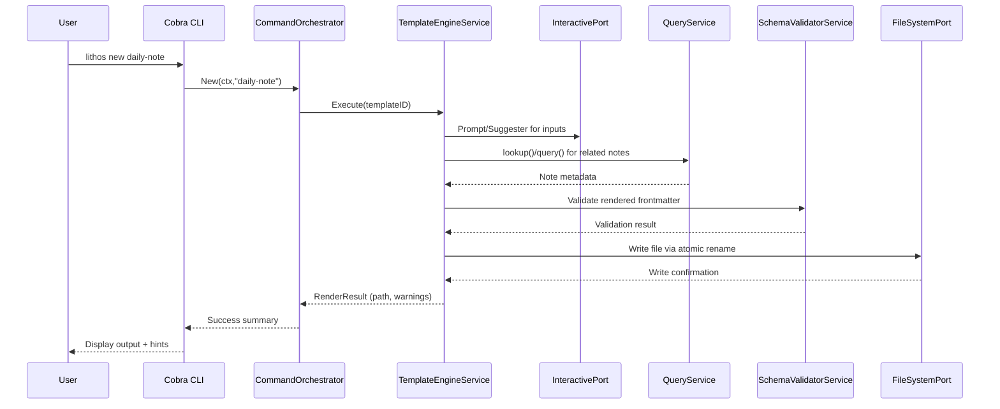
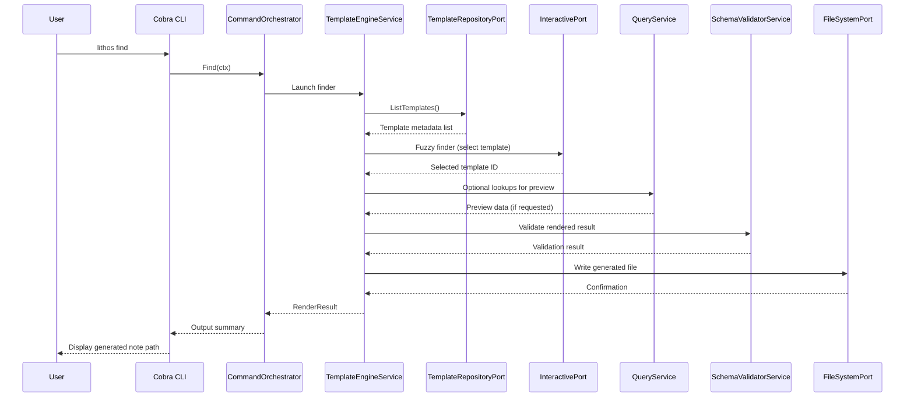
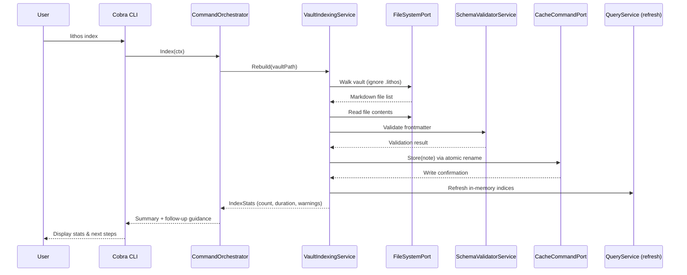

# Core Workflows

## Template Generation (`lithos new`)

**Notes:** Any validation errors bubble back through `RenderResult` for the CLI to display with remediation. Context cancellation propagates downward if the user aborts.

## Template Discovery (`lithos find`)

**Notes:** If the user exits the fuzzy finder without selection, `RenderResult` returns a canceled status and no file is written.

## Vault Indexing (`lithos index`)

**Notes:** Failed validations are reported as warnings (file path + reason) and do not block indexing. Subsequent commands reuse refreshed QueryService indices.

---
