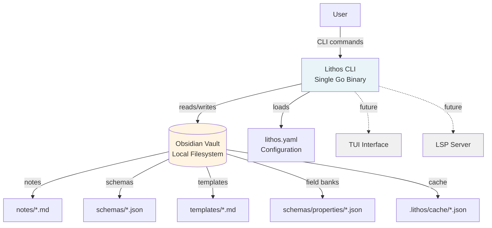

# High Level Architecture

## Technical Summary

Lithos employs a **Hexagonal Architecture (Ports & Adapters)** pattern built as a single-binary Go CLI application. The core domain logic (template engine, schema system, validator) remains pure and framework-agnostic, depending only on port interfaces it defines. External concerns (CLI framework, file I/O, interactive UI) are implemented as adapters that plug into these ports. This architecture directly supports the PRD's "Interface-Driven Architecture" principle, enables trivial testing through adapter substitution, and naturally accommodates the post-MVP roadmap where multiple adapters (CLI, TUI, LSP server) will interact with the same core logic.

## High Level Overview

**Architectural Style:** Hexagonal Architecture (Ports & Adapters)

The system is organized around a **pure domain core** containing all business logic for template processing, schema validation, and note generation. This core defines port interfaces for external dependencies (storage, user interaction, file system). **Adapters** implement these ports using specific technologies (Cobra CLI, file-based cache, PromptUI). The core never depends on adapters; dependency arrows point inward toward the domain.

**Repository Structure:** Single Repository (Monorepo)

The project uses a **single Git repository** containing the Go application source code, test data vault (`testdata/`), and supporting documentation. This aligns with the PRD's MVP scope and solo developer resource constraint.

**Service Architecture:** Monolithic Binary

A **self-contained Go binary** with no external runtime dependencies, distributed as platform-specific executables (macOS x86_64/ARM64, Linux x86_64/ARM64, Windows x86_64). The hexagonal core compiles alongside its adapters into one binary for the MVP; the architecture supports future distribution as a library (Go module) post-MVP.

### Primary User Interaction Flow

1. **CLI Adapter** (Cobra) receives command (`lithos new`, `find`, `index`)
2. **Configuration Adapter** (Viper) loads `lithos.yaml` via FileSystem port
3. **Core Domain** orchestrates:
   - Template Engine loads template via FileSystem port
   - Executes template, calling Interactive port for prompts/suggesters
   - Query Engine retrieves vault data via Storage port
   - Validator checks output via Schema port
4. **FileSystem Adapter** writes generated note to vault
5. **CLI Adapter** displays confirmation or errors to user

### Key Architectural Decisions

- **Hexagonal Over Layered:** Chosen to isolate domain logic from framework churn (Cobra today, TUI tomorrow). Aligns with PRD Technical Assumptions: "Interface-Driven Architecture" and post-MVP vision (Phase 4: LSP, TUI). The slight upfront cost of defining ports is justified by the PRD's explicit future roadmap.

- **Ports Defined by Core:** The domain defines port interfaces for what it needs (storage, user interaction, file operations), not what adapters provide. This prevents core logic from coupling to adapter implementation details (e.g., core doesn't know about CLI framework specifics or UI library styling).

- **Domain Uses Abstract Identifiers:** Core domain uses abstract identifiers rather than infrastructure-specific references (filesystem paths, database keys). Adapters translate between domain identifiers and infrastructure concerns. This decouples domain from storage implementation.

- **Single Binary for MVP:** While hexagonal architecture supports distributed systems, the PRD requires "single standalone binary" (NFR2). All adapters compile with the core. Future: Core could be extracted as a Go module consumed by multiple binaries (CLI, LSP server, TUI).

- **Test Adapters as First-Class Citizens:** Test infrastructure is implemented as test adapters. Production code and test code use the same ports, eliminating the need for mocking frameworks.

- **True CQRS for Storage Layer:** CQRS (Command Query Responsibility Segregation) separates write operations from read operations with distinct models and optimization strategies. Write operations optimize for validation and data integrity. Read operations use denormalized data with in-memory indices for fast queries. Synchronization service keeps read model consistent with write model. This provides independent scaling, multiple specialized indices, and supports future event sourcing.

## High Level Project Diagram

**System Boundaries:**

- **Lithos CLI:** Single standalone Go binary, runs locally on user's machine
- **Obsidian Vault:** Local directory containing markdown notes, JSON schemas, and templates
- **No External Services:** Entirely local operation, no network dependencies for MVP

**Data Flow:**

1. User invokes CLI commands (`lithos new`, `lithos index`, `lithos find`)
2. Lithos reads configuration from `lithos.yaml` (with defaults if not present)
3. Lithos reads templates, schemas, and field banks from vault
4. Lithos generates notes with user interaction (prompts, fuzzy finding)
5. Lithos writes generated notes and cache to vault
6. Lithos validates notes against schemas

**Future Integrations (Post-MVP):**

- TUI interface for terminal-based knowledge management
- LSP server for IDE integration with VS Code, NeoVim

## Architectural and Design Patterns

**1. Hexagonal Architecture (Ports & Adapters)**

*Core domain defines port interfaces; external adapters implement them*

- **Rationale:** Isolates business logic from framework changes. When Phase 4 adds TUI (post-MVP), only a new primary adapter is needed—core remains untouched. Aligns with PRD principle: "Interface-Driven Architecture" and enables trivial testing (swap production adapters for test doubles). → *(Supports Post-MVP Vision: TUI, LSP, Logseq integration)*

*Note: Each port naturally enables the Strategy Pattern—multiple adapter implementations can be swapped at runtime (e.g., production PromptUIAdapter vs. test MockInteractiveAdapter for the InteractivePort).*

**2. Repository Pattern (via StoragePort)**

*StoragePort interface abstracts vault indexing and cache access*

- **Rationale:** Decouples query/indexing logic from storage implementation. MVP uses FileCache adapter; post-MVP can add BoltDB adapter without changing core. PRD Technical Assumptions explicitly require: "Storage must be implemented behind interface." → *(Epic 3, Story 3.1: "Define Storage interface")*

**3. Dependency Injection (Constructor-Based)**

*CLI adapter layer constructs concrete adapter instances and injects them into core components via constructors*

- **Rationale:** Core remains framework-agnostic and doesn't import adapter packages. Enables test seams—unit tests construct core components with mock adapters instead of production ones. No DI framework needed; Go's constructor pattern (`NewTemplateEngine(storage StoragePort, interactive InteractivePort)`) is sufficient for MVP scope. → *(Epic 1.1/4.1: Test harness uses injected mock adapters)*

**4. Builder Pattern (Schema Inheritance Resolution)**

*Schema system resolves inheritance chains (C extends B extends A) into flattened schemas*

- **Rationale:** Simplifies multi-level inheritance while detecting circular dependencies at load time (fail-fast). Immutable source schemas remain unchanged; builder creates resolved copies. → *(Epic 2, Stories 2.5-2.6: Multi-level inheritance + circular detection)*

**5. CQRS (Command Query Responsibility Segregation)**

*Separation of write model and read model with distinct optimization strategies*

- **Rationale:** Data indexing (write) and data querying (read) have fundamentally different optimization needs. The separation is in both **models** (separate structures for writes vs reads) and **operations** (distinct port interfaces). Write model optimizes for validation and data integrity - enforces business rules and maintains canonical representation. Read model optimizes for queries - denormalized with pre-built indices. Synchronization service keeps models consistent. This true CQRS provides independent scaling, multiple specialized indices, and supports future event sourcing. → *(Epic 3: Vault indexing, Epic 5: Template queries)*

*Note: The CQRS pattern future-proofs for larger datasets. Write side can add validation caching and batch processing. Read side can maintain multiple projections optimized for different query patterns without impacting write performance.*

## Design Principles

**Dependency Inversion Principle (DIP):** High-level domain modules depend on abstractions (ports), not concrete adapters. Adapters import core packages and implement port interfaces; core never imports adapters. Enables independent evolution—replace frameworks by swapping adapters. Prevents Go import cycles (mandatory for clean hexagonal architecture).

**Lean Ports:** Port interfaces have 2-5 focused methods representing specific service needs. Adapters handle infrastructure complexity. Prevents God Object ports and interface bloat.

**Interface Segregation Principle (ISP):** Separate interfaces for different concerns even when same adapter implements multiple interfaces. Read operations separate from write operations. User interaction separate from file operations. Services depend only on interfaces they need.

**Lean Domain Models:** Domain models contain only essential data with no behavior or infrastructure dependencies. Complex operations implemented in domain services. Models are pure data structures that can be easily serialized, tested, and composed.

**CQRS with Separate Models:** Write and read concerns use distinct models optimized for their respective purposes. Write models enforce validation and business rules. Read models denormalized for query performance. Synchronization layer keeps models consistent.

**Dependency Injection via main.go:** All dependency wiring happens in application entry point using constructor injection. Infrastructure built first, then domain services, then application services, finally adapters. No DI framework needed—pure Go constructors. See detailed DI pattern documentation in Components section.

**Idiomatic Go Error Handling:** Standard `(T, error)` return signatures throughout. Domain-specific error types implement standard `error` interface. Error wrapping using `fmt.Errorf("context: %w", err)` for proper unwrapping with `errors.Is()` and `errors.As()`.
