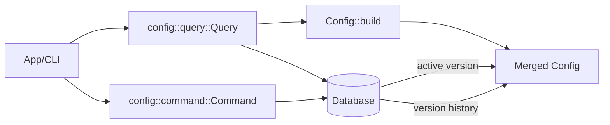

# Tech Spec: Config Models (Global + Vault + Merged Config)

> **Note**: See `docs/design/README.md` for usage instructions.

Related specs:

- [docs/design/002-config-cqrs.md](002-config-cqrs.md) (how config models are persisted and retrieved)
- [docs/design/006-task-management-system.md](006-task-management-system.md) (a major consumer of config-driven schemas/values; keep config model decisions compatible with planned task config)

## 1. Problem Space (The "Why")

### 1.1 Context & Background

The config bounded context defines how Lithos discovers and resolves configuration for a vault operation.

Current implementation lives in:

- `lithos-core/src/config/aggregate.rs` (`Config` aggregate root; merge + validation)
- `lithos-core/src/config/global.rs` (`Global` configuration)
- `lithos-core/src/config/vault.rs` (`Vault` configuration + `Metadata`)
- `lithos-core/src/config/types.rs` (shared config types: `Frontmatter`, `Logging`, `Schema`, `Template`, `SettingValue`)
- `lithos-core/src/config/error.rs` (`ConfigError`)
- `lithos-core/src/config/events.rs` (domain events)

High-level business rules:

- **Precedence**: vault-specific overrides beat global values.
- **Defaults**: system defaults apply when neither level provides a value.
- **Validation**: invalid configs should be rejected at build time.

Design tensions motivating this spec:

- Several configuration fields are represented as `String` with a post-hoc `validate()` (empty-string sentinel), which makes invalid states representable and complicates merging.
- Path-like fields are treated as generic strings; joining and validation are therefore brittle.
- Some “mutually exclusive” shapes are modeled as `Option` pairs that require runtime validation.

Terminology note:

- “Core substrate” (informal) means a foundational type/module that becomes widely reused across many contexts. The risk is making a type “too central” too early, which can lock in awkward constraints.

Clarification:

- `SettingValue` is intended to be **config-specific** in Lithos (even if other contexts have similar types). It should not be treated as a shared cross-context primitive.

Serialization boundary note (serde vs rkyv):

- The current code derives both `serde` and `rkyv` on many config types.
- Going forward, treat these as two distinct concerns:
  - `serde` is needed for **config file I/O** (TOML/YAML/JSON) and human-facing interchange.
  - `rkyv` is needed for **redb persistence** (fast, stable archived bytes).
- If the domain model becomes awkward due to serialization constraints, introduce explicit DTOs:
  - `*File` types (serde-only) for parsing,
  - validated domain types for in-memory logic,
  - persisted record types (rkyv, optionally serde if you want to debug-dump).

### 1.2 Goals & Non-Goals

**Goals**

- Define the **model contracts** for Global/Vault/Merged config:
  - responsibilities, invariants, and intended construction flows.
- Strengthen type-driven design where it reduces invalid states:
  - prefer `Option<T>` over empty-string sentinels,
  - use enums/newtypes for constrained values (log level, config source, etc.),
  - use path types for path operations.
- Keep persisted-format concerns explicit:
  - rkyv derives exist today; treat layout changes as on-disk format decisions.

**Non-Goals**

- Defining the persistence strategy and CQRS behavior in detail (covered by `docs/design/002-config-cqrs.md`).
- Introducing async APIs in core.

### 1.3 Constraints (The Hard Limits)

- **Sync-first core**: config resolution must remain synchronous.
- **Persisted bytes contract**: changes to rkyv-archived model layouts are treated as migrations.
- **No hidden allocations** in getters: prefer borrowed accessors or clear "owned" naming.

## 2. Guide-Level Explanation (The "What")

### 2.1 User/Dev Experience

Most callers should not manually merge config fields. The normal workflow is:

1) Load global and vault configs.
2) Build a merged, validated `Config` aggregate.
3) Use the merged config as immutable runtime input.

Sketch (current shape):

```rust
use lithos_core::config::{aggregate::Config, global::Global, vault::Vault};

let global = Global::default();
let vault = Vault::default();

// The merged aggregate is validated during build.
let merged = Config::build(Some(&global), "/vault", vault)?;

// Use merged values (frontmatter/logging/filesystem paths).
let _log_level = merged.logging.log_level.as_str();
```

### 2.2 Mental Model

Think of config as a two-layer overlay:

- **Global**: lowest precedence. System defaults and user-wide defaults.
- **Vault**: highest precedence. Overrides for the specific vault.
- **Merged Config**: a computed, immutable aggregate used for the current operation.

The key property is that consumers hold **one** `Config` value with all invariants satisfied.

Additional runtime/persistence mental model (for caching + rollback):

- A vault has a **stable identity** (`VaultId`) and a **current location** (vault root path).
- For each vault, we can persist **versioned merged configs** as a read model.
  - There is exactly one **active** merged config per vault at a time.
  - Older versions are retained to support rollback.
  - This “singleton” notion exists at the storage/read-model level (per vault), not as a global singleton in the domain.

## 3. Detailed Design (The "How")

### 3.1 System Architecture



### 3.2 Component & Interface Specifications

#### Component: `Global`

- **Responsibility**: provide the global-level configuration layer.
- **Invariants**:
  - its sub-structures are valid (`Paths`, `Frontmatter`, `Logging`).
  - optional `trusted_vaults` is either absent or valid.

#### Component: `Vault`

- **Responsibility**: provide the vault-level configuration layer (overrides).
- **Invariants**:
  - required vault identity is provided by `Metadata` during merge/build (not necessarily stored in `Vault` itself).
  - override fields should be represented as `Option<T>` (preferred) rather than empty strings.

Vault identity:

- The unique, primary key for a vault is `VaultId` (see 3.4.2).
- The vault root path is the vault’s **current location**; persistence may also keep a canonical `VaultPathKey` mapping to support lookups by path.

#### Component: `Config` (aggregate)

- **Responsibility**: represent the merged, validated runtime configuration.
- **Public Interface**:
  - `Config::build(global: Option<&Global>, vault_path: &str, vault: Vault) -> Result<Config, ConfigError>`
  - `validate(&self) -> Result<(), ConfigError>` (redundant if `build` always validates; keep if useful as a defensive check)
  - `pending_events() -> &[Events]` and `take_events()` for event staging.

- **Invariants**:
  - all required fields are non-empty and internally consistent.
  - constrained values (e.g., log level) are valid.

### 3.3 Integration & Data Flow

Sequence: resolve config for a vault operation.

```mermaid
sequenceDiagram
  participant Caller
  participant Q as config::query::Query
  participant Agg as Config::build
  participant DB as Database

  Caller->>Q: load_global()
  Q->>DB: get_owned("config","global")
  DB-->>Q: Option<Global>

  Caller->>Q: load_vault()
  Q->>DB: get_owned("config","vault")
  DB-->>Q: Option<Vault>

  Caller->>Agg: build(global, vault_path, vault)
  Agg-->>Caller: Config (merged + validated)

If a versioned merged read model is used (recommended for per-vault cache/rollback), the merged `Config` produced above becomes the value that is persisted as a new version.
```

### 3.4 Data Models

This section records the important model decisions.

#### 3.4.1 Type-driven upgrades (recommended)

These changes are recommended because they reduce invalid states, simplify merging, and make the model easier to evolve.

- **Remove empty-string sentinels from the domain**
  - Today, merge uses empty-string checks (`choose_value`) and many structs allow empty strings.
  - Prefer representing “unset/override not provided” as `Option<T>` in the *override* layers.

- **Introduce validated newtypes for repeated invariants**
  - `NonEmptyString` (or more specific types like `FrontmatterKey`, `DirName`, `FileName`).
  - `VaultRoot(PathBuf)` with validation rules.
  - `CacheDir(RelPath)` vs a generic string.

- **Constrain enum-like strings**
  - `Logging.log_level: String` should be `LogLevel` enum.
  - `ConfigUpdated.source: String` should be `ConfigSource` enum.

- **Fix path composition**
  - `Schema::property_bank_path() -> String` should return `PathBuf` (or `VaultRelativePath`) and use join semantics, not string formatting.

- **Model mutual exclusivity as an enum**
  - `TrustedVaults { list: Option<_>, map: Option<_> }` should be `enum TrustedVaults { List(Vec<VaultRoot>), Map(HashMap<Box<str>, VaultRoot>) }` with `#[serde(untagged)]`.

- **Avoid `Deref` for semantic newtypes**
  - `SchemaVersion(pub String)` currently implements `Deref<Target = str>`.
  - Prefer an explicit `as_str()` (and `Display`) so the type boundary stays visible.

#### 3.4.2 Vault identity (required)

- **Decision (project convention)**: introduce a stable `VaultId(Uuid)` and use it as the primary vault identifier.

Rationale:

- Note and Schema use stable identifiers; config should follow the same convention.
- A stable ID makes “vault moved/renamed” a *representable* case (even if not always automatically discoverable).

Required types (recommended):

- `VaultId(Uuid)` (stable identity)
- `VaultRoot(PathBuf)` (current location, validated)
- `VaultPathKey(Box<str>)` (canonical encoding used for lookup/mapping)

Discovery/persistence rule:

- A stable ID only helps with vault moves if it can be re-discovered at the new path.
- Therefore, the vault must persist its ID somewhere stable (e.g., `.lithos/vault-id`), or the application must otherwise be able to prove the new path corresponds to the same vault.

Storage invariants (recommended):

- `vault_id_by_path: VaultPathKey -> VaultId`
- `vault_path_by_id: VaultId -> VaultPathKey`

Canonicalization rules (recommendation):

- Use an absolute path.
- Normalize separators (platform default is fine as long as the encoding is stable).
- Consider resolving symlinks only if you intentionally want “symlinked paths” to collapse to the same vault identity.

#### 3.4.3 Versioned merged config read model (recommended)

To support a single-vault cache and rollback, persist merged configs as immutable versions.

- `ConfigVersion(u64)` (monotonic, per vault)
- `MergedConfigRecord { vault_id: VaultId, version: ConfigVersion, created_at: i64, config: Config }`
- `ActiveMergedConfig { vault_id: VaultId, version: ConfigVersion }`

Design rule: keep “exactly one active merged config per vault” as a storage invariant, not a global domain singleton.

### 3.5 Core Logic & Algorithms

Merge rule: vault overrides global; defaults apply when neither provides a value.

Design rule:

- Merging should be expressed as `Option` selection (`vault.or(global).unwrap_or(default)`) rather than checking for empty strings.

Rollback rule (if versioned merged configs are persisted):

- Rollback is implemented by selecting an older `ConfigVersion` as active for the given vault.
- The merge algorithm must be deterministic so that “rebuild” produces predictable versions.

### 3.6 Recommended Code Modularization

The current config context is functional, but `types.rs` is doing too much and the validation/merge story is spread across several structs.

Constraints respected:

- Keep `command.rs` and `query.rs` at the root of the context.

Recommended module layout (target):

Design rule (idiomatic Rust): prefer a **flat module tree**. Only introduce nested directories when there is sustained pressure (many closely related modules) and the extra hierarchy meaningfully improves navigation.

Target layout (flat, file-per-module):

- `lithos-core/src/config/mod.rs`
  - public re-exports for the main types (`Config`, `Global`, `Vault`, errors)

- `lithos-core/src/config/aggregate.rs`
  - `Config` (merged runtime aggregate)
  - merge/build logic lives here (this is the primary implementation of `Config`)
  - private helper fns for overlay selection (no empty-string sentinels)

- `lithos-core/src/config/global.rs`
  - `Global` + global-only shapes (e.g., `TrustedVaults`)

- `lithos-core/src/config/vault.rs`
  - `Vault` + `Metadata`
  - vault identity/value types that are only meaningful in the vault model:
    - `VaultId`, `VaultRoot`, `VaultPathKey`
    - `SchemaVersion` (if it remains a vault-local concept)

- `lithos-core/src/config/frontmatter.rs`
  - `Frontmatter` + validated newtypes like `FrontmatterKey`

- `lithos-core/src/config/logging.rs`
  - `Logging` + `LogLevel`

- `lithos-core/src/config/schema.rs`
  - `Schema` + schema-related validated value types

- `lithos-core/src/config/template.rs`
  - `Template` + template-related validated value types

- `lithos-core/src/config/setting_value.rs`
  - `SettingValue` (config-specific) and any focused value newtypes/enums it decomposes into

Notes:

- If you want to keep the public surface stable while splitting, `types.rs` can temporarily become a thin re-export module (or be deleted once call sites migrate).
- If `ConfigVersion` and versioned merged-record structs are introduced, place them near their primary owner:
  - if they are aggregate-level read models, keep them in `aggregate.rs` (or `query.rs` if they are strictly query-facing persisted records).

This approach keeps the context readable:

- merge stays with the aggregate (where it is easiest to understand and test),
- vault-only identity types live with `Vault` (so the meaning is obvious), and
- “big types.rs” is decomposed without creating an over-nested module tree.

### 3.7 Validation-in-Types (keep public APIs clean)

Goal: callers should not have to remember to call `.validate()` everywhere.

Recommended pattern:

- Make “always-valid” domain types constructible only through fallible constructors (`try_new`, `new_checked`) or `TryFrom`.
- Use serde integration to validate at deserialization time.
- Keep `validate()` as `pub(crate)` (or omit it) once construction is guaranteed to produce valid instances.

Serde patterns:

- `#[serde(try_from = "String")]` on newtypes like `FrontmatterKey`, `DirName`, `FileName`.
- `#[serde(untagged)]` enums for mutually exclusive shapes (`TrustedVaults`).
- `#[serde(default)]` + `Option<T>` overlays for vault overrides.

rkyv patterns:

- Only require `rkyv` on types that actually cross the DB boundary.
- If serde-friendly shapes diverge from archive-friendly shapes, introduce explicit DTOs at the boundary rather than contorting the core model.

## 4. Alternatives & Decisions (The "Divergence")

### 4.1 Tactical Decisions

#### Decision: Use `Option` overlays rather than empty strings

- **Context**: merging currently uses empty-string sentinels in several places.
- **Choice**: represent “unset” as `None` instead.
- **Alternatives Considered**:
  - _Empty-string sentinel_: easy to deserialize but makes invalid states representable; complicates merge logic. Rejected.

## 5. Operational Readiness (The "Reality Check")

### 5.1 Observability

- Emit a config-loaded/config-merged log at the application boundary (CLI/app), not inside core models.
- Consider structured logging of:
  - which layer provided each value (global/vault/default),
  - config version, and
  - config source.

### 5.2 Migration Strategy

- Any rkyv layout change for persisted config models should be treated as a migration event.
- Prefer introducing persisted DTOs if the model churn becomes frequent.

### 5.3 Security & Privacy

- `SettingValue::Encrypted` must never reveal raw bytes in debug output (current behavior masks bytes).
- Encryption/decryption belongs at the adapter boundary; core stores opaque bytes.

## 6. Pre-Mortem (The "Inversion")

- **Risk**: configuration merge silently accepts invalid data because “unset” is represented as empty strings.
  - _Mitigation_: represent absence as `Option` and make invalid states unrepresentable.

- **Risk**: path concatenation via string formatting produces invalid paths on Windows or with trailing slashes.
  - _Mitigation_: use `PathBuf` joins at the model boundary.

- **Risk**: persisted rkyv layout changes break existing on-disk configs.
  - _Mitigation_: treat layout changes as migrations; consider persisted DTO boundaries.

## 7. Critique & Refinement Log

| Date       | Critique / Issue                              | Resolution                                      |
| :--------- | :-------------------------------------------- | :---------------------------------------------- |
| 2026-02-04 | "Merge uses empty-string sentinels."         | "Recommend Option overlays; see Decision 4.1." |
| 2026-02-04 | "Paths are generic Strings."                 | "Recommend PathBuf/newtypes; see 3.4.1."      |
