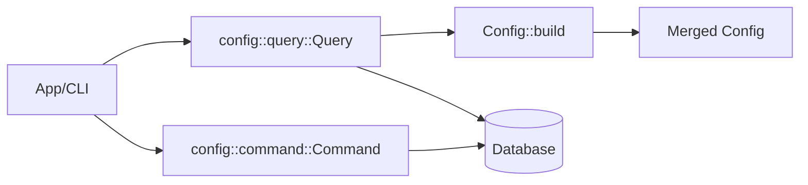
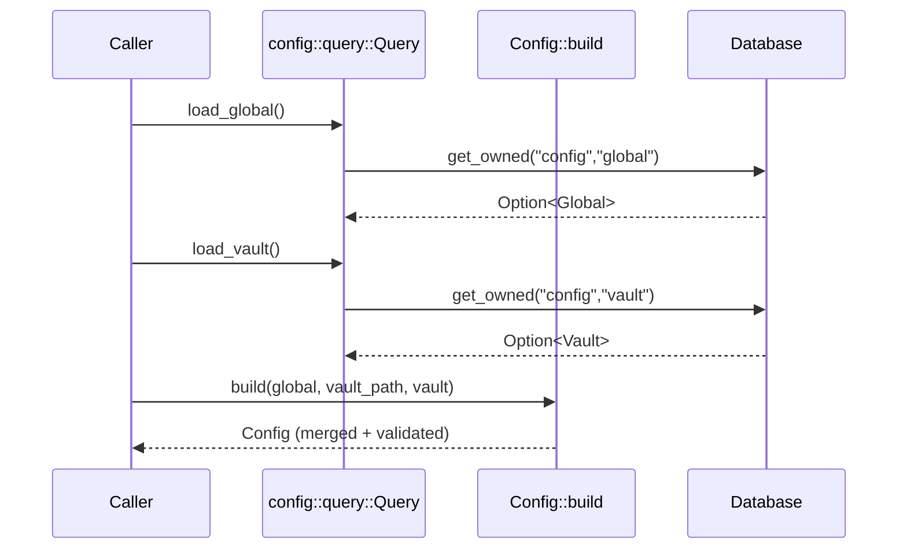

# Tech Spec: Config Models (Global + Vault + Merged Config)

> **Note**: See `docs/design/README.md` for usage instructions.

## 1. Problem Space (The "Why")

### 1.1 Context & Background

The config bounded context defines how Lithos discovers and resolves configuration for a vault operation.

Current implementation lives in:

- `lithos-core/src/config/aggregate.rs` (`Config` aggregate root; merge + validation)
- `lithos-core/src/config/global.rs` (`Global` configuration)
- `lithos-core/src/config/vault.rs` (`Vault` configuration + `Metadata`)
- `lithos-core/src/config/types.rs` (shared config types: `Frontmatter`, `Logging`, `Schema`, `Template`, `SettingValue`)
- `lithos-core/src/config/error.rs` (`ConfigError`)
- `lithos-core/src/config/events.rs` (domain events)

High-level business rules:

- **Precedence**: vault-specific overrides beat global values.
- **Defaults**: system defaults apply when neither level provides a value.
- **Validation**: invalid configs should be rejected at build time.

Design tensions motivating this spec:

- Several configuration fields are represented as `String` with a post-hoc `validate()` (empty-string sentinel), which makes invalid states representable and complicates merging.
- Path-like fields are treated as generic strings; joining and validation are therefore brittle.
- Some “mutually exclusive” shapes are modeled as `Option` pairs that require runtime validation.

### 1.2 Goals & Non-Goals

**Goals**

- Define the **model contracts** for Global/Vault/Merged config:
  - responsibilities, invariants, and intended construction flows.
- Strengthen type-driven design where it reduces invalid states:
  - prefer `Option<T>` over empty-string sentinels,
  - use enums/newtypes for constrained values (log level, config source, etc.),
  - use path types for path operations.
- Keep persisted-format concerns explicit:
  - rkyv derives exist today; treat layout changes as on-disk format decisions.

**Non-Goals**

- Defining the persistence strategy and CQRS behavior in detail (covered by `docs/design/002-config-cqrs.md`).
- Introducing async APIs in core.

### 1.3 Constraints (The Hard Limits)

- **Sync-first core**: config resolution must remain synchronous.
- **Persisted bytes contract**: changes to rkyv-archived model layouts are treated as migrations.
- **No hidden allocations** in getters: prefer borrowed accessors or clear "owned" naming.

## 2. Guide-Level Explanation (The "What")

### 2.1 User/Dev Experience

Most callers should not manually merge config fields. The normal workflow is:

1) Load global and vault configs.
2) Build a merged, validated `Config` aggregate.
3) Use the merged config as immutable runtime input.

Sketch (current shape):

```rust
use lithos_core::config::{aggregate::Config, global::Global, vault::Vault};

let global = Global::default();
let vault = Vault::default();

// The merged aggregate is validated during build.
let merged = Config::build(Some(&global), "/vault", vault)?;

// Use merged values (frontmatter/logging/filesystem paths).
let _log_level = merged.logging.log_level.as_str();
```

### 2.2 Mental Model

Think of config as a two-layer overlay:

- **Global**: lowest precedence. System defaults and user-wide defaults.
- **Vault**: highest precedence. Overrides for the specific vault.
- **Merged Config**: a computed, immutable aggregate used for the current operation.

The key property is that consumers hold **one** `Config` value with all invariants satisfied.

## 3. Detailed Design (The "How")

### 3.1 System Architecture



### 3.2 Component & Interface Specifications

#### Component: `Global`

- **Responsibility**: provide the global-level configuration layer.
- **Invariants**:
  - its sub-structures are valid (`Paths`, `Frontmatter`, `Logging`).
  - optional `trusted_vaults` is either absent or valid.

#### Component: `Vault`

- **Responsibility**: provide the vault-level configuration layer (overrides).
- **Invariants**:
  - required vault identity is provided by `Metadata` during merge/build (not necessarily stored in `Vault` itself).
  - override fields should be represented as `Option<T>` (preferred) rather than empty strings.

#### Component: `Config` (aggregate)

- **Responsibility**: represent the merged, validated runtime configuration.
- **Public Interface**:
  - `Config::build(global: Option<&Global>, vault_path: &str, vault: Vault) -> Result<Config, ConfigError>`
  - `validate(&self) -> Result<(), ConfigError>` (redundant if `build` always validates; keep if useful as a defensive check)
  - `pending_events() -> &[Events]` and `take_events()` for event staging.

- **Invariants**:
  - all required fields are non-empty and internally consistent.
  - constrained values (e.g., log level) are valid.

### 3.3 Integration & Data Flow

Sequence: resolve config for a vault operation.



### 3.4 Data Models

This section records the important model decisions.

#### 3.4.1 Type-driven upgrades (recommended)

These changes are recommended because they reduce invalid states and simplify merge logic.

- **Prefer `Option<T>` over empty-string sentinels**
  - Example: `Logging` should be `Option<LogLevel>` on the vault layer, not `String` that may be empty.

- **Use enums for constrained string values**
  - `LogLevel` should be an enum with `serde` rename support.
  - `ConfigUpdated.source` should become a small enum (e.g., `ConfigSource`).

- **Use path types for path-like fields**
  - Replace `String` path segments with `PathBuf` (or a validated newtype) at the model boundary.
  - Replace `Schema::property_bank_path() -> String` with `-> PathBuf` join.

- **Model mutual exclusivity as an enum**
  - `TrustedVaults { list: Option<_>, map: Option<_> }` should become `enum TrustedVaults { List(Vec<PathBuf>), Map(HashMap<Box<str>, PathBuf>) }` with `#[serde(untagged)]`.

### 3.5 Core Logic & Algorithms

Merge rule: vault overrides global; defaults apply when neither provides a value.

Design rule:

- Merging should be expressed as `Option` selection (`vault.or(global).unwrap_or(default)`) rather than checking for empty strings.

## 4. Alternatives & Decisions (The "Divergence")

### 4.1 Tactical Decisions

#### Decision: Use `Option` overlays rather than empty strings

- **Context**: merging currently uses empty-string sentinels in several places.
- **Choice**: represent “unset” as `None` instead.
- **Alternatives Considered**:
  - _Empty-string sentinel_: easy to deserialize but makes invalid states representable; complicates merge logic. Rejected.

## 5. Operational Readiness (The "Reality Check")

### 5.1 Observability

- Emit a config-loaded/config-merged log at the application boundary (CLI/app), not inside core models.
- Consider structured logging of:
  - which layer provided each value (global/vault/default),
  - config version, and
  - config source.

### 5.2 Migration Strategy

- Any rkyv layout change for persisted config models should be treated as a migration event.
- Prefer introducing persisted DTOs if the model churn becomes frequent.

### 5.3 Security & Privacy

- `SettingValue::Encrypted` must never reveal raw bytes in debug output (current behavior masks bytes).
- Encryption/decryption belongs at the adapter boundary; core stores opaque bytes.

## 6. Pre-Mortem (The "Inversion")

- **Risk**: configuration merge silently accepts invalid data because “unset” is represented as empty strings.
  - _Mitigation_: represent absence as `Option` and make invalid states unrepresentable.

- **Risk**: path concatenation via string formatting produces invalid paths on Windows or with trailing slashes.
  - _Mitigation_: use `PathBuf` joins at the model boundary.

- **Risk**: persisted rkyv layout changes break existing on-disk configs.
  - _Mitigation_: treat layout changes as migrations; consider persisted DTO boundaries.

## 7. Critique & Refinement Log

| Date       | Critique / Issue                              | Resolution                                      |
| :--------- | :-------------------------------------------- | :---------------------------------------------- |
| 2026-02-04 | "Merge uses empty-string sentinels."         | "Recommend Option overlays; see Decision 4.1." |
| 2026-02-04 | "Paths are generic Strings."                 | "Recommend PathBuf/newtypes; see 3.4.1."      |
