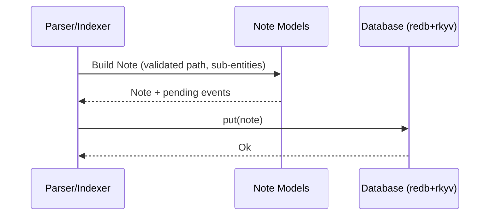

# Tech Spec: Note Models (Aggregate + Value Objects)

> **Note**: See `docs/design/README.md` for usage instructions.

## 1. Problem Space (The "Why")

### 1.1 Context & Background

The note bounded context is the core domain surface for representing an Obsidian-compatible note and its sub-entities.

Current implementation lives in:

- `lithos-core/src/note/aggregate.rs` (`Note`, `NotePath`)
- `lithos-core/src/note/link.rs` (`Link`, `Target`, `Anchor`, etc.)
- `lithos-core/src/note/tag.rs` (`Tag`)
- `lithos-core/src/note/task.rs` (`Task`, `TaskStatus`)
- `lithos-core/src/note/structure.rs` (`Heading`, `Section`)
- `lithos-core/src/note/events.rs` (`NoteCreated`, `FrontmatterValidated`, `NoteEvents`)
- `lithos-core/src/note/frontmatter.rs` (covered by `docs/design/003-note-frontmatter.md`)

System constraints:

- **Sync-first** core (no async in the domain).
- **Persistence** via `redb` + **rkyv**: the `Note` model is archived and stored in `Database`.
- **Performance** and LSP ergonomics rely on **zero-copy** reads where feasible.

Design tensions motivating this spec:

- Some documented invariants (e.g., aggregate consistency) are not strongly enforced by model encapsulation (public fields make it easy to bypass invariants).
- Several model fields use "stringly" representations (paths, offsets, timestamps) where type-driven design could prevent invalid states.
- rkyv is both a performance lever and a persisted-format contract; model evolution must be explicit about compatibility.

Additional Rust best-practice constraints for this bounded context:

- **Allocation transparency**: getters must not hide clones/allocations. If an API allocates/clones, its name must communicate ownership (e.g., `to_owned_*`, `clone_*`).
- **Offset semantics must be explicit**: source coordinates must specify whether they are byte offsets, character offsets, or line/column.
- **Public API evolution**: public enums intended to evolve should use `#[non_exhaustive]` and avoid downstream exhaustive matching.

### 1.2 Goals & Non-Goals

**Goals**

- Define the **data model contracts** for notes and sub-entities:
  - Responsibilities, invariants, and expected APIs.
  - Which parts are persisted (rkyv-archived) vs transient.
- Improve type-driven design to **reduce invalid states** while preserving ergonomics.
- Preserve or improve performance characteristics:
  - Borrowed getters and allocation transparency.
  - Compatibility with rkyv bytecheck validation.

**Non-Goals**

- Defining parsing rules for markdown/wiki-link syntax (covered by parsing modules / ADRs).
- Implementing adapters or application services (covered by CQRS spec).
- Introducing new external dependencies.

### 1.3 Constraints (The Hard Limits)

- **rkyv compatibility**: persisted models must remain `rkyv::{Archive, Serialize, Deserialize}` friendly.
- **Persisted bytes contract**: changes to archived types are treated as format migrations.
- **No unsafe** code.
- **Bounded context isolation**: note models should not depend on other contexts directly.

### 1.4 Minimizing “derive-everything” Blast Radius (rkyv)

rkyv is both a performance lever and a persisted-format contract. If we derive rkyv traits across a large portion of the note model surface, small refactors can accidentally become **format migrations**.

Practical guidance (subject to revisiting as the codebase evolves):

- **Prefer a persistence-shaped DTO boundary** when it meaningfully reduces coupling. The domain `Note` can remain ergonomic while a `PersistedNote`/`NoteRecord` type (storage layer) owns rkyv derives and on-disk representation.
- **Keep archived compute near query code**. Hot-path reads should compute from `Archived*` types inside closures; avoid pulling archived types into broad domain surfaces.
- **Treat layout changes as migrations**. Adding/reordering fields, changing newtype wrappers, or changing rkyv attributes should be considered a persisted-format decision.
- **Use rkyv attributes intentionally**. For recursive/complex shapes, prefer the documented approaches (e.g. `#[rkyv(omit_bounds)]` on recursive fields) to avoid trait-solver blowups.
- **Avoid “accidental persistence dependencies”**. Storage keys, projection encodings, and index tables should remain storage-layer concerns, not domain model concerns.

## 2. Guide-Level Explanation (The "What")

### 2.1 User/Dev Experience

Common workflows:

1) Create a note aggregate with a validated vault-relative path

```rust
use lithos_core::note::aggregate::{Note, NotePath};
use uuid::Uuid;

fn example() -> Result<(), lithos_core::note::error::NoteError> {
  let id = Uuid::now_v7();
  let path = NotePath::try_from("projects/example.md")?;
  let note = Note::new(id, path)?;

  assert_eq!(note.path().as_str(), "projects/example.md");
  Ok(())
}
```

2) Add value objects in a controlled way (builder or narrow mutators)

```rust
use lithos_core::note::link::{Link, Target};

fn example() -> Result<(), lithos_core::note::error::NoteError> {
  let link = Link::new_wikilink(
    Target::Unresolved { raw: "Next Note".into() },
    None,
    None,
    0,
  )?;

  // Intent: no direct `note.links.push(...)` in the public API.
  // Instead: `note.add_link(link)?;`
  let _ = link;
  Ok(())
}

```

3) Read model state via borrowed getters (no clones)

```rust
let tags = note.tags();      // &[Tag]
let links = note.links();    // &[Link]
let fm = note.frontmatter(); // Option<&Frontmatter>
```

### 2.2 Mental Model

- `Note` is the **aggregate root** and owns all note-local entities.
- Sub-entities are **value objects** (links, tags, tasks, structure) with their own invariants.
- The model is persisted and retrieved via rkyv; it must be:
  - structurally stable,
  - bytecheck-validatable at trust boundaries,
  - efficient to read (prefer borrowed access and minimal cloning).

## 3. Detailed Design (The "How")

### 3.1 System Architecture

The note model is a domain component:

- Constructed by ingestion/parsing pipelines.
- Persisted in the DB.
- Queried by CQRS read operations.

Frontmatter is specified separately in `docs/design/003-note-frontmatter.md` and treated as a child value object.

### 3.2 Component & Interface Specifications

### 3.2.1 Type-Driven Design Improvements (Map)

This section enumerates the intended type-driven design improvements for the note model. The goal is to prevent invalid states at compile time (or at construction time), reduce accidental misuse (especially mixing "same representation" primitives), and make APIs self-documenting.

Guiding rules:

- Prefer **validated constructors** + private fields over public structs with post-hoc `validate()`.
- Use **newtypes** to prevent mixing conceptually distinct values with identical representations.
- Keep "validation-heavy" types in the **domain model** when they represent true invariants.
- Keep storage-key encodings and DB-table-specific representations at the **storage boundary**.

Type map (proposed):

- `NoteId(Uuid)`
  - Prevents: mixing note IDs with other UUID uses (e.g., template IDs, vault IDs).
  - Persisted: yes (archives as the wrapped UUID).

- `NotePath(Box<str>)`
  - Prevents: path traversal, absolute paths, wrong extension, empty paths.
  - Persisted: yes.

- `TagPath(Box<str>)`
  - Prevents: storing tags with/without leading `#` inconsistently and mixing tag "display" vs "key" forms.
  - Persisted: yes.
  - Notes: `Tag::new("#a/b")` can accept the display form, while storing a canonical key form (`"a/b"`).

- `HeadingLevel(u8)`
  - Prevents: invalid heading levels outside 1..=6.
  - Persisted: yes.

- `SourceByteOffset(u32)`
  - Prevents: accidentally mixing offsets with unrelated counts and clarifies byte-vs-char semantics.
  - Persisted: yes.
  - Notes: conversion from parser offsets (`usize`) must be fallible (overflow -> error).

- `SourceByteRange { start: SourceByteOffset, end: SourceByteOffset }`
  - Prevents: inverted or mixed-unit ranges.
  - Persisted: yes.

- `NonEmptyBoxStr(Box<str>)` (optional, only if it improves clarity)
  - Prevents: empty `Task.text`, empty `Heading.text`, empty `Target` raw.
  - Persisted: yes.
  - Notes: if this type is too heavy ergonomically, keep `Box<str>` but enforce non-empty in constructors.

#### Component: `Note`

- **Responsibility**: represent a note and own its sub-entities.
- **Persisted**: yes (rkyv archived).
- **Public Interface (target)**:
  - `Note::new(id: Uuid, path: NotePath) -> Result<Note, NoteError>`
  - (preferred) `Note::new(id: NoteId, path: NotePath) -> Result<Note, NoteError>`
  - `id(&self) -> Uuid`
  - (preferred) `id(&self) -> NoteId`
  - `path(&self) -> &NotePath`
  - `frontmatter(&self) -> Option<&Frontmatter>`
  - `links(&self) -> &[Link]`, `tags(&self) -> &[Tag]`, `tasks(&self) -> &[Task]`, ...
  - Controlled mutation (optional, depends on chosen style):
    - `add_link(&mut self, link: Link) -> Result<(), NoteError>`
    - `add_tag(&mut self, tag: Tag) -> Result<(), NoteError>`
    - `set_frontmatter(&mut self, frontmatter: Option<Frontmatter>)`
  - Domain event staging:
    - `take_events(&mut self) -> Vec<NoteEvents>`

- **State/Invariants**
  - `id` is a UUID v7.
  - `path` is vault-relative, non-empty, ends with `.md`, no traversal.
  - Cross-entity consistency rules are enforced (e.g., link invariants).

Type-driven invariants:

- Prefer storing `NoteId` rather than bare `Uuid` inside the aggregate.
- Prefer storing source coordinates (`SourceByteOffset`/`SourceByteRange`) rather than bare `usize`.

- **API design rules (Rust idioms)**
  - Prefer borrowed inputs (`&str`, `&NotePath`, slices) unless ownership is required.
  - Prefer `TryFrom`/`TryInto` for validation and conversion.
  - Prefer `&[T]` and iterators for collection access; do not return `Vec<T>` from getters.
  - Avoid returning `String` or `PathBuf` from getters unless that allocation is the point.
  - If a method clones/allocates, its name must communicate that.

- **Encapsulation policy**
  - Fields that participate in invariants should be private; expose borrowed getters.
  - If the parsing pipeline needs bulk construction, use a builder (`NoteBuilder`) or module-private field access (`pub(crate)`) rather than public fields.

#### Component: `NotePath`

- **Responsibility**: validated vault-relative note path.
- **Persisted**: yes (rkyv archived).
- **Public Interface (target)**:
  - `NotePath::try_from(&str) -> Result<NotePath, NoteError>`
  - `as_str(&self) -> &str`
  - `Display` for logging and error messages.

- **Type-driven improvement**
  - Consider splitting "validated vault relative path" into two layers if needed:
    - `VaultRelativePath` (general)
    - `NotePath` (vault-relative + `md` extension)
  - Only do this if it reduces duplication across contexts.

- **Invariants**
  - Uses `fs::validate_vault_path(path, Some("md"))`.

- **Data representation rules**
  - Internally store as `Box<str>` (or an equivalent immutable owned string) to avoid repeated allocations and to support rkyv archiving.
  - Do not expose raw filesystem paths (`Path`/`PathBuf`) from the domain model; those belong at adapter boundaries.

#### Component: `Link` and link types (`Target`, `Anchor`, `Style`, `EmbedType`)

- **Responsibility**: represent syntactic links and embeds inside a note.
- **Persisted**: yes.
- **Key invariants**
  - Target must be non-empty.
  - Embeds cannot have anchors.
  - External links cannot have block references.

- **Public Interface (current shape retained)**
  - `Link::new_wikilink(...) -> Result<Link, NoteError>`
  - `Link::new_markdown_link(...) -> Result<Link, NoteError>`
  - `Link::new_embed(...) -> Result<Link, NoteError>`
  - Read-only accessors returning borrowed views (`alias() -> Option<&str>`, `target() -> &Target`).

- **Type-driven improvement opportunities (non-breaking)**
  - Introduce semantic newtypes for source coordinates:
    - `SourceByteOffset(u32)` for `position` (preferred)
    - `SourceByteRange { start: SourceByteOffset, end: SourceByteOffset }` for sections

Offset semantics:

- All offsets/ranges in note models MUST be **byte offsets** into the original UTF-8 source.
- Rationale: pulldown-cmark and most parser infrastructure naturally operate in byte offsets; byte offsets are stable and unambiguous for slicing.
- If a caller needs line/column, compute it at the edges (CLI diagnostics / LSP) where the full source is available.

Additional type-driven opportunities:

- Consider a `Url(Box<str>)` newtype for `Target::External` if URL validation becomes important.
- Consider making `Target::Resolved` carry `NoteId` + `NotePath` (validated) rather than raw strings.

#### Component: `Tag`

- **Responsibility**: represent hierarchical tags.
- **Persisted**: yes.
- **Invariants**
  - Must start with `#`.
  - Segments are non-empty and contain only allowed characters.

Type-driven improvement:

- Separate the user-facing display form (with `#`) from the canonical stored key form (`TagPath` without `#`).
- Ensure that any index keys use the canonical form only.

- **Public Interface (target)**
  - `Tag::new(raw: &str) -> Result<Tag, NoteError>`
  - `full_path(&self) -> &str` (without `#`)
  - `segments(&self) -> &[Box<str>]` (or `&[&str]` via iterator)

- **Ergonomics and allocation**
  - Consider providing `segments_iter(&self) -> impl Iterator<Item = &str>` to avoid committing to a concrete storage shape in the public API.

#### Component: `Task` and `TaskStatus`

- **Responsibility**: represent a markdown task item.
- **Persisted**: yes.
- **Invariants**
  - text is non-empty after trim.

- **Public Interface (target)**
  - `Task::new(text: &str, status: TaskStatus, position: SourceOffset) -> Result<Task, NoteError>`

Type-driven improvement:

- Prefer `SourceByteOffset` for positions.
- Consider a `TaskText`/`NonEmptyBoxStr` wrapper if it clarifies invariants.

#### Component: `Heading` and `Section`

- **Responsibility**: represent document structure.
- **Persisted**: yes.
- **Invariants**
  - `Heading.level` is 1..=6.
  - `Heading.text` is non-empty after trim.

Type-driven improvement:

- Prefer `HeadingLevel` and (optionally) `NonEmptyBoxStr` for heading text.

#### Component: `NoteEvents`

- **Responsibility**: represent note-domain events staged for dispatch.
- **Persisted**: no (events are transient).
- **Invariant policy**
  - Events should prefer validated domain types where practical, but do not change persisted event payload types without an explicit migration.

Event staging rules:

- Pending events MUST be staged in-memory and dispatched only after the successful DB transaction commit (Unit of Work).
- Therefore, pending events MUST NOT be part of the persisted `Note` record. If needed, represent staged events outside the archived/persisted type (e.g., a wrapper used only in memory).

### 3.3 Integration & Data Flow

- Notes are produced by parsing pipelines, stored in the DB, then read by query workflows.



### 3.4 Data Models

Canonical model set (persisted unless noted):

- `Note { id: Uuid, path: NotePath, frontmatter: Option<Frontmatter>, links: Vec<Link>, tags: Vec<Tag>, headings: Vec<Heading>, tasks: Vec<Task>, sections: Vec<Section> }`
- `StagedNote { note: Note, pending_events: Vec<NoteEvents> }` (in-memory only, not persisted)
- `NotePath(Box<str>)`
- `Link { target: Target, anchor: Option<Anchor>, position: usize, alias: Option<Box<str>>, style: Style, embed_type: Option<EmbedType> }`
- `Target::{Resolved { id: Uuid, path: Box<str> }, Unresolved { raw: Box<str> }, External { url: Box<str> }}`
- `Tag { full_path: Box<str>, segments: Vec<Box<str>> }` (internal wrappers are fine)
- `Task { text: Box<str>, status: TaskStatus, position: usize }`
- `Heading { level: u8, text: Box<str>, position: usize }`
- `Section { heading: Option<Heading>, content: Box<str>, range: Range<usize> }`

### 3.5 Core Logic & Algorithms

- Validation is split:
  - Per-entity validation in constructors.
  - Cross-entity validation via `Note::validate()`.

### 3.6 rkyv & Persisted-Format Contract

Rules:

- Archived layouts for persisted types are a compatibility contract.
- Prefer **additive** evolution:
  - adding new methods/getters
  - tightening visibility (e.g., `pub` -> private)
  - adding new non-persisted helper types
- Treat the following as breaking unless explicitly planned with migration/clean-slate:
  - changing struct field order/types
  - changing enum variants or their payload types
  - changing rkyv format-control features (endianness/alignment/pointer width)

Validation:

- Any access to archived bytes at trust boundaries must validate via rkyv/bytecheck (e.g., `rkyv::access`).
- Validation should be centralized in the DB/storage boundary rather than scattered across model code.

Type evolution rule:

- Newtypes are encouraged, but changing an existing persisted field from `T` to `Newtype(T)` may still be a breaking archived-layout change depending on rkyv representation and derives. Treat it as a migration decision unless verified safe.

## 4. Alternatives & Decisions (The "Divergence")

### 4.1 Tactical Decisions

#### Decision: Private fields + borrowed getters for invariant-bearing state

- **Context**: Public mutable fields allow bypassing invariants.
- **Choice**: Make fields private and expose borrowed getters; use narrow mutators/builder for controlled construction.
- **Alternatives Considered**:
  - Keep fields public for convenience: rejected (weakens invariants).
  - Use setters: rejected (spreads invariants across call sites).

#### Decision: Newtypes for offsets/timestamps (incremental)

- **Context**: multiple `usize` offsets can be mixed accidentally.
- **Choice**: Introduce `SourceOffset` (and possibly `UnixSeconds`) when adding new APIs.
- **Alternatives Considered**:
  - Keep `usize` everywhere: simplest, but easier to misuse.

## 5. Operational Readiness (The "Reality Check")

### 5.1 Observability

- Model validation failures should be surfaced as typed errors (`NoteError` variants), not stringly errors.
- Trace spans and rich diagnostics belong at app/adapters/CLI edges, not in pure models.

### 5.2 Migration Strategy

- Treat rkyv archived types as a persisted-format contract.
- Allowed changes without migration:
  - visibility changes (`pub` -> private)
  - adding new getters/methods
  - adding new error types (not persisted)
- Breaking changes:
  - changing field types/order in archived structs/enums
  - changing rkyv format-control features

For breaking changes, use the repo’s "clean slate" protocol (rename DB + reindex) unless an explicit migration layer is introduced.

### 5.4 Testing & Benchmarking

- Unit tests: constructors enforce invariants for `NotePath`, `Tag`, `Link`, `Task`, `Heading`.
- Unit tests: conversions into newtypes fail on invalid inputs (e.g., `SourceByteOffset` overflow).
- Round-trip persistence tests: store and retrieve representative notes (including edge cases) and assert invariants still hold.
- Property tests (where useful): tag segment validation and link target parsing invariants.
- Benchmarks: criterion benchmarks for query hot paths comparing `get_owned` vs zero-copy access patterns.

### 5.3 Security & Privacy

- `NotePath` validation relies on the security-critical path validator (`fs::validate_vault_path`).
- Do not accept raw filesystem paths in models.

## 6. Pre-Mortem (The "Inversion")

- **Risk**: Model changes break persisted bytes and corrupt reads.
  - _Mitigation_: Treat archived types as a contract; require explicit migration decision; add tests that round-trip representative notes through DB.

- **Risk**: Public mutable access bypasses invariants and causes downstream failures.
  - _Mitigation_: Private fields + narrow mutators; avoid exposing setters.

## 7. Critique & Refinement Log

| Date       | Critique / Issue                                   | Resolution                                                     |
| :--------- | :------------------------------------------------- | :------------------------------------------------------------- |
| 2026-02-03 | "Are events persisted or transient?"              | Draft assumes transient; verify via DB usage inventory.         |
| 2026-02-03 | "Do we require object-safe ports for query hotpath" | Draft suggests concrete read APIs for zero-copy hot paths.      |

| 2026-02-03 | "Are offsets byte or char based?"                | Specify byte offsets (`SourceByteOffset`) and compute line/col at edges. |
