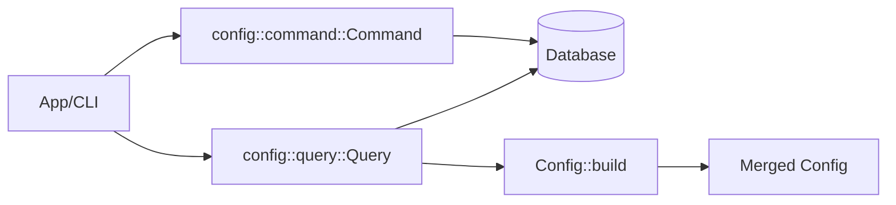
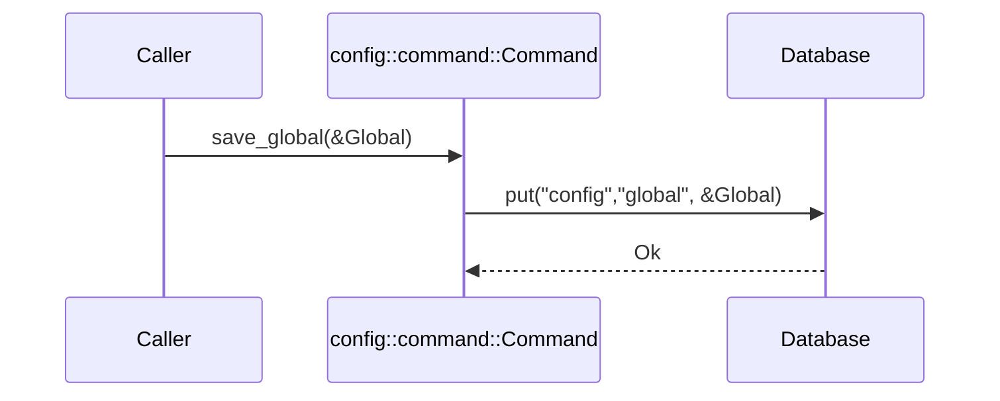
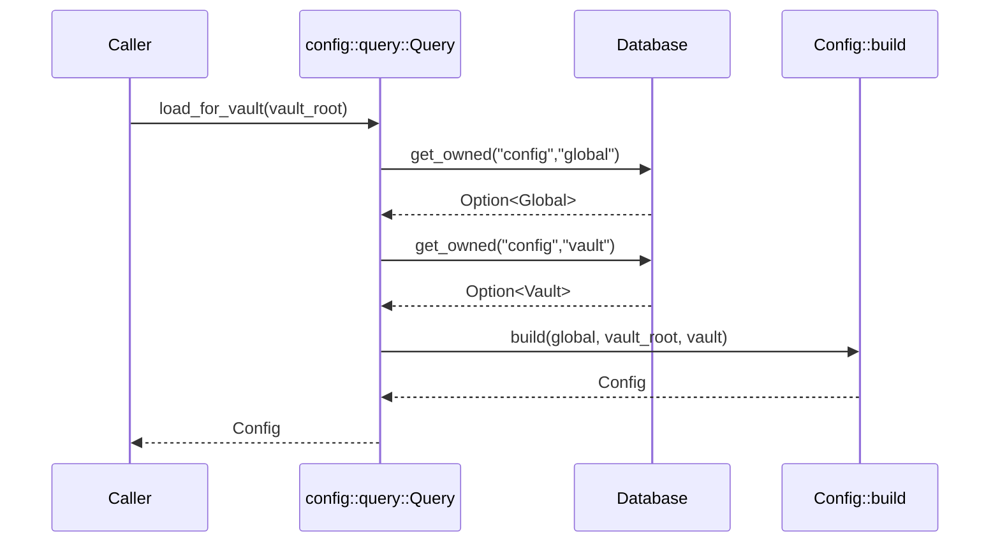

# Tech Spec: Config CQRS (Commands + Queries)

> **Note**: See `docs/design/README.md` for usage instructions.

## 1. Problem Space (The "Why")

### 1.1 Context & Background

The config context uses a CQRS split:

- Commands: persist configuration layers (global, vault).
- Queries: retrieve configuration layers and produce a merged, validated `Config` aggregate.

Current implementation lives in:

- `lithos-core/src/config/ports.rs` (traits `Command`, `Query`)
- `lithos-core/src/config/command.rs` (DB-backed command implementation)
- `lithos-core/src/config/query.rs` (DB-backed query implementation)
- `lithos-core/src/config/aggregate.rs` (`Config::build` merge + validation)

Persistence design:

- `Database::put` stores rkyv-serialized values.
- `Database::get_owned` deserializes into owned values (cold-path), currently used for config.

Design tensions motivating this spec:

- The query merge currently uses a fixed vault path string ("vault"), which is not a stable representation of the caller’s actual vault identity.
- Errors are currently mapped by stringifying DB errors (`to_string()`), which loses structure.
- The context is moving away from strict hexagonal layering; we still want a clean CQRS contract.

### 1.2 Goals & Non-Goals

**Goals**

- Define a stable, ergonomic CQRS surface for configuration:
  - explicit inputs/outputs,
  - clear error contracts,
  - explicit merge behavior.
- Make vault identity/path handling explicit.
- Preserve structured errors across the DB boundary where feasible.

**Non-Goals**

- Adding async CQRS.
- Designing a remote/distributed config service.

### 1.3 Constraints (The Hard Limits)

- **Sync-first** CQRS in core.
- **dyn-compatibility**: the port traits should remain dyn-compatible (no generic closure methods).
- **Persisted bytes contract**: config persistence format changes are migration events.

## 2. Guide-Level Explanation (The "What")

### 2.1 User/Dev Experience

Typical usage from application code:

```rust
use lithos_core::config::{command, query};
use lithos_core::config::ports::{Command as _, Query as _};

let cmd = command::Command::new(&db);
let qry = query::Query::new(&db);

// Save layers
cmd.save_global(&global)?;
cmd.save_vault(&vault)?;

// Load merged runtime config
let merged = qry.load()?;
```

**Important**: in most applications, `load()` should not guess the vault identity/path. The caller should provide it.

### 2.2 Mental Model

- The DB stores **layers** (`Global`, `Vault`), not the merged `Config`.
- The query side retrieves layers and computes a merged, validated `Config` via `Config::build`.
- Command/query are the contract boundary for persistence and error behavior.

## 3. Detailed Design (The "How")

### 3.1 System Architecture



### 3.2 Component & Interface Specifications

#### Component: `config::command::Command`

- **Responsibility**: persist config layers.
- **Current Interface**:
  - `save_global(&self, config: &Global) -> Result<(), ConfigError>`
  - `save_vault(&self, config: &Vault) -> Result<(), ConfigError>`

Recommended refinements:

- Prefer a storage error variant that preserves structure (not a string).
- Consider using distinct error types for command vs query if they diverge.

#### Component: `config::query::Query`

- **Responsibility**: retrieve layers and compute merged config.
- **Current Interface**:
  - `load(&self) -> Result<Config, ConfigError>`
  - `load_global(&self) -> Result<Option<Global>, ConfigError>`
  - `load_vault(&self) -> Result<Option<Vault>, ConfigError>`

Recommended refinements:

- Make vault identity explicit:

```rust
pub struct VaultRoot<'a>(pub &'a std::path::Path);

impl Query<'_> {
  pub fn load_for_vault(
    &self,
    vault_root: VaultRoot<'_>,
  ) -> Result<Config, ConfigError> {
    // load layers, then Config::build(...)
    # todo!()
  }
}
```

This avoids baking an arbitrary string ("vault") into the config aggregate’s metadata.

### 3.3 Integration & Data Flow

#### Persist global config



#### Load merged config (recommended shape)



### 3.4 Data Models

#### Storage layout (current)

- Table: `"config"`
  - Key: `"global"` → value: `Global`
  - Key: `"vault"` → value: `Vault`

This layout is suitable for a single active vault, but it does not support multiple vaults.

#### Multi-vault evolution (future-safe)

If/when multiple vaults are supported, prefer a key that includes vault identity:

- `("vault", VaultId)` or `("vault", VaultPathKey)`

Where `VaultPathKey` is a storage-layer newtype with canonical encoding.

### 3.5 Core Logic & Algorithms

- Query loads layers.
- Query picks a vault identity (must be explicit) and delegates to `Config::build`.
- `Config::build` merges layer values and validates.

Error-handling rules:

- CQRS should avoid `.to_string()` on DB errors in hot paths.
- Prefer a structured `ConfigError::Storage(DbError)` or `ConfigError::Storage { source: DbError }` pattern.

## 4. Alternatives & Decisions (The "Divergence")

### 4.1 Tactical Decisions

#### Decision: Keep command/query concrete and root-scoped

- **Context**: the project is moving away from strict hexagonal boundaries.
- **Choice**: keep `command.rs` and `query.rs` at the root of the config context.
- **Alternatives Considered**:
  - _Move CQRS to adapters_: clearer purity, but not aligned with the current architectural direction. Rejected.

#### Decision: Make vault identity explicit on query load

- **Context**: `load()` currently bakes a fixed string into the merged config’s metadata.
- **Choice**: define `load_for_vault(vault_root)`.
- **Alternatives Considered**:
  - _Hard-coded vault path_: easy but incorrect in real multi-vault usage. Rejected.

## 5. Operational Readiness (The "Reality Check")

### 5.1 Observability

- Instrument `load_for_vault` at the app boundary:
  - cache hit/miss (if added later),
  - time to load global/vault layers,
  - time to merge/validate.

### 5.2 Migration Strategy

- Changes to persisted config layouts require migration planning.
- If error contracts change (e.g., structured storage errors), update the CLI reporting layer.

### 5.3 Security & Privacy

- Treat all persisted bytes as untrusted; validation must happen at the storage boundary.
- Never log decrypted secrets; any decrypted values should remain adapter-owned.

## 6. Pre-Mortem (The "Inversion")

- **Risk**: configuration load uses the wrong vault identity, leading to incorrect paths in runtime behavior.
  - _Mitigation_: require `vault_root` as an explicit argument.

- **Risk**: error mapping stringifies root causes, making debugging harder.
  - _Mitigation_: preserve structured DB errors in `ConfigError`.

## 7. Critique & Refinement Log

| Date       | Critique / Issue                                   | Resolution                                         |
| :--------- | :------------------------------------------------- | :------------------------------------------------- |
| 2026-02-04 | "load() hard-codes vault identity."               | "Recommend load_for_vault; see Decision 4.1."     |
| 2026-02-04 | "Storage errors are eagerly stringified."         | "Recommend structured storage errors; see 3.5."   |
