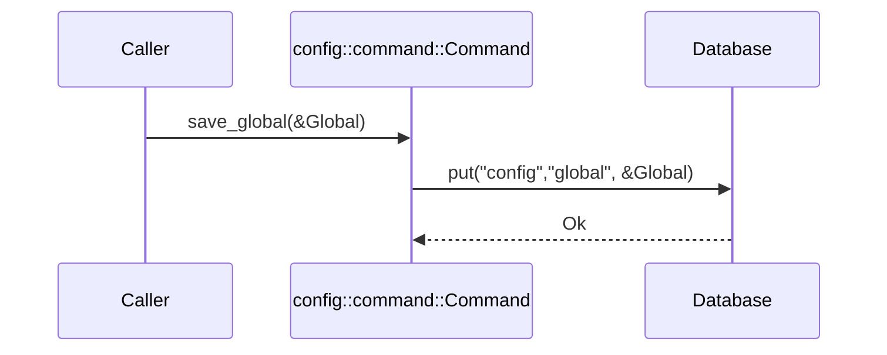
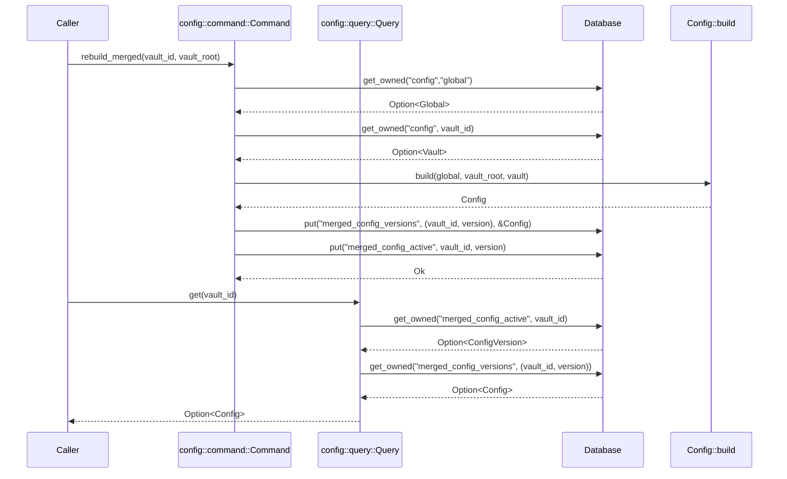

# Tech Spec: Config CQRS (Commands + Queries)

Related specs:

- [docs/design/001-config-models.md](001-config-models.md)
- [docs/design/003-config-task.md](003-config-task.md) (task schema is config-driven; CQRS/storage decisions here should support that direction)

## 1. Problem Space (The "Why")

### 1.1 Context & Background

The config context uses a CQRS split:

- Commands: persist configuration layers (global, vault) and manage the merged-config read model.
- Queries: retrieve the active merged config for a vault.

Current implementation lives in:

- `lithos-core/src/config/ports.rs` (traits `Command`, `Query`)
- `lithos-core/src/config/command.rs` (DB-backed command implementation)
- `lithos-core/src/config/query.rs` (DB-backed query implementation)
- `lithos-core/src/config/aggregate.rs` (`Config::build` merge + validation)

Persistence design:

- `Database::put` stores rkyv-serialized values.
- `Database::get_owned` deserializes into owned values (cold-path), currently used for config.

Design tensions motivating this spec:

- Vault identity must be explicit. The unique, primary key for a vault is `VaultId`.
- We want a per-vault cache of the merged config that is versioned to support rollback.
- The query surface should be small and read-optimized (merged-only).

See `docs/design/001-config-models.md` for the vault-identity discussion and the `VaultRoot`/`VaultPathKey` mapping rules.

### 1.2 Goals & Non-Goals

**Goals**

- Define a stable, ergonomic CQRS surface for configuration:
  - explicit vault identity (`VaultId`),
  - explicit versioning/rollback semantics for the merged-config read model,
  - a query API that primarily provides a `get` for the active merged config.
- Match the error pattern used in other contexts: keep `ConfigError` as the surfaced error type and map storage failures into `ConfigError::Storage`.

**Non-Goals**

- Adding async CQRS.
- Designing a remote/distributed config service.

### 1.3 Constraints (The Hard Limits)

- **Sync-first** CQRS in core.
- **dyn-compatibility**: the port traits should remain dyn-compatible (no generic closure methods).
- **Persisted bytes contract**: config persistence format changes are migration events.

## 1.4 Error Type Strategy

CQRS operations use split error types for clearer domain/storage error separation:

**ConfigCommandError**:
```rust
#[derive(Debug, thiserror::Error)]
pub enum ConfigCommandError {
    #[error("Domain error: {0}")]
    Domain(#[from] ConfigError),

    #[error("Storage error: {0}")]
    Storage(#[from] DbError),
}
```

**ConfigQueryError**:
```rust
#[derive(Debug, thiserror::Error)]
pub enum ConfigQueryError {
    #[error("Storage error: {0}")]
    Storage(#[from] DbError),

    #[error("Data corruption: {0}")]
    Corruption(String),
}
```

**Rationale**: Split error types allow:
- Commands to distinguish domain validation failures from storage failures
- Queries to surface data corruption separately from transient storage errors
- Better error handling at call sites (pattern match on error kind)

## 2. Guide-Level Explanation (The "What")

### 2.1 User/Dev Experience

Typical usage from application code:

```rust
use lithos_core::config::{command, query};
use lithos_core::config::ports::{Command, Query};

let cmd = command::Command::new(&db);
let qry = query::Query::new(&db);

// VaultId is the stable identity; vault_root is the current location.
// (How the app discovers/persists VaultId is covered in 001-config-models.)
let vault_id = vault_id_from_vault_root(vault_root)?;

// Save layers
cmd.save_global(&global)?;
cmd.save_vault(vault_id, &vault)?;

// Rebuild merged runtime config (creates a new version and activates it)
cmd.rebuild_merged(vault_id, vault_root)?;

// Read active merged runtime config
let merged = qry.get(vault_id)?;
```

**Important**: in most applications, `load()` should not guess the vault identity/path. The caller should provide it.

### 2.2 Mental Model

- The DB stores layers (`Global`, `Vault`) and a merged-config read model.
- For each vault (identified by `VaultId`), merged config snapshots are stored as immutable versions.
- One version is marked active per vault; rollback selects an older version as active.
- Command/query are the contract boundary for persistence and error behavior.

## 3. Detailed Design (The "How")

### 3.1 System Architecture

```mermaid
flowchart LR
  Caller[App/CLI] --> Cmd[config::command::Command]
  Caller --> Qry[config::query::Query]
  Cmd --> DB[(Database)]
  Qry --> DB
  Cmd --> Agg[Config::build]
  Agg --> DB
  DB --> Out[Merged Config (active)]
```

### 3.2 Data Models

#### Storage layout (target)

- Table: "vault_id_by_path"
  - Key: `(VaultPathKey)` → value: `VaultId`

- Table: "vault_path_by_id"
  - Key: `(VaultId)` → value: `VaultPathKey`

- Table: "config"
  - Key: "global" → value: `Global`
  - Key: `(vault_id)` → value: `Vault`

- Table: "merged_config_versions"
  - Key: `(vault_id, version)` → value: `Config` (merged)

- Table: "merged_config_active"
  - Key: `(vault_id)` → value: `ConfigVersion` (current active)

Where:

- `vault_id` is the stable vault identity.
- `VaultPathKey` is the canonical encoding of the vault root path (current location) used for reverse lookup.
- `ConfigVersion` is a monotonic version identifier (recommend `u64`).

#### Alternative storage layout (legacy): path-keyed vault identity

If stable IDs are not yet available, a transitional layout may key vault-scoped tables by `VaultPathKey` instead of `VaultId`:

- Table: "config"
  - Key: "global" → value: `Global`
  - Key: `(vault_key)` → value: `Vault`

- Table: "merged_config_versions"
  - Key: `(vault_key, version)` → value: `Config`

- Table: "merged_config_active"
  - Key: `(vault_key)` → value: `ConfigVersion`

Where `vault_key: VaultPathKey` is the canonical encoding of the vault root path.

Note: this layout makes moves/renames harder to model because identity is the path.

With `VaultId` required by convention, prefer the target layout. It only helps with vault moves if the system can re-discover the same ID at the new location (typically by persisting the ID in or near the vault itself).

### 3.3 Component & Interface Specifications

#### Component: `config::command::Command`

- **Responsibility**: persist config layers and manage the merged-config read model.
- **Current Interface**:
  - `save_global(&self, config: &Global) -> Result<(), ConfigError>`
  - `save_vault(&self, config: &Vault) -> Result<(), ConfigError>`

Target interface (matches clarified requirements):

- Layer persistence
  - `save_global(&self, global: &Global) -> Result<(), ConfigError>`
  - `save_vault(&self, vault_id: VaultId, vault: &Vault) -> Result<(), ConfigError>`

- Layer retrieval (kept on command side to keep query focused on merged config)
  - `load_global(&self) -> Result<Option<Global>, ConfigError>`
  - `load_vault(&self, vault_id: VaultId) -> Result<Option<Vault>, ConfigError>`

- Merged read model management
  - `rebuild_merged(&self, vault_id: VaultId, vault_root: &Path) -> Result<ConfigVersion, ConfigError>`
    - loads global+vault layers,
    - builds merged `Config`,
    - persists a new merged-config version for the vault,
    - marks it active.
  - `activate_version(&self, vault_id: VaultId, version: ConfigVersion) -> Result<(), ConfigError>`
  - `rollback(&self, vault_id: VaultId, steps: u32) -> Result<ConfigVersion, ConfigError>` (optional convenience)

Errors:

- Use `ConfigError` end-to-end.
- Map storage failures into `ConfigError::Storage(...)` (stringified) to match Note/Schema behavior.

#### Component: `config::query::Query`

- **Responsibility**: retrieve the active merged config for a vault.
- **Current Interface**:
  - `load(&self) -> Result<Config, ConfigError>`
  - `load_global(&self) -> Result<Option<Global>, ConfigError>`
  - `load_vault(&self) -> Result<Option<Vault>, ConfigError>`

Target interface (query is intentionally small):

- `get(&self, vault_id: VaultId) -> Result<Option<Config>, ConfigError>`

Notes:

- `get` is a read against the merged-config read model, not a “recompute merge” operation.
- Layer reads (`load_global`/`load_vault`) are command-side concerns in this design so the query side stays merged-only.

### 3.4 Integration & Data Flow

#### Persist global config



#### Load merged config (recommended shape)



### 3.5 Core Logic & Algorithms

Core algorithm is split:

- Command-side `rebuild_merged(vault_id, vault_root)`
  - loads global/vault layers,
  - delegates to `Config::build`,
  - persists a new immutable merged-config version,
  - updates the active pointer.

- Query-side `get(vault_id)`
  - reads active version for the vault,
  - returns the merged config stored under that version.

Error-handling rules (match existing contexts):

- Use `ConfigError` end-to-end.
- Map DB failures into `ConfigError::Storage(...)` at the CQRS boundary.
- If we later want structured DB errors, introduce separate CQRS error types as an additive API; don’t change the baseline pattern.

## 4. Alternatives & Decisions (The "Divergence")

### 4.1 Tactical Decisions

#### Decision: Keep command/query concrete and root-scoped

- **Context**: the project is moving away from strict hexagonal boundaries.
- **Choice**: keep `command.rs` and `query.rs` at the root of the config context.
- **Alternatives Considered**:
  - _Move CQRS to adapters_: clearer purity, but not aligned with the current architectural direction. Rejected.

#### Decision: Make vault identity explicit on query load

- **Context**: `load()` currently bakes a fixed string into the merged config’s metadata.
- **Choice**: require `vault_id` for any vault-scoped operation; the query side becomes merged-only via `get(vault_id)`.
- **Alternatives Considered**:
  - _Hard-coded vault path_: easy but incorrect in real multi-vault usage. Rejected.

## 5. Operational Readiness (The "Reality Check")

### 5.1 Observability

- Instrument `rebuild_merged` and `get` at the app boundary:
  - cache hit/miss (if added later),
  - time to load global/vault layers,
  - time to merge/validate.

### 5.2 Migration Strategy

- Changes to persisted config layouts require migration planning.
- If error contracts change (e.g., structured storage errors), update the CLI reporting layer.
- See [Clean-Slate Protocol](../operations/clean-slate-protocol.md) for config revalidation and reindex procedures when config schema changes.

### 5.3 Security & Privacy

- Treat all persisted bytes as untrusted; validation must happen at the storage boundary.
- Never log decrypted secrets; any decrypted values should remain adapter-owned.

Implementation guidance (rkyv + redb):

- Prefer `rkyv::access` (validated) at trust boundaries, and reserve `rkyv::access_unchecked` for cases where the bytes are known to be valid and trusted.
- Do not allow redb scoped guards (like `AccessGuard`) or archived references derived from them to escape the transaction/guard scope; compute owned results inside the scope instead.

## 6. Pre-Mortem (The "Inversion")

- **Risk**: configuration load uses the wrong vault identity, leading to incorrect paths in runtime behavior.
  - _Mitigation_: require `vault_root` as an explicit argument.

- **Risk**: storage errors are stringified, which can make debugging harder.
  - _Mitigation_: include stable operation/key context in `ConfigError::Storage(...)`, and attach richer diagnostics at the CLI/app boundary; if needed, introduce additive CQRS error wrappers later.
- **Risk**: version history grows without bound.
  - _Mitigation_: define a retention policy per vault (e.g., keep last N versions) and prune on rebuild.

## 7. Critique & Refinement Log

| Date       | Critique / Issue                         | Resolution                                         |
| :--------- | :--------------------------------------- | :------------------------------------------------- |
| 2026-02-04 | "load() hard-codes vault identity."      | "Require explicit vault_id; see Decision 4.1."     |
| 2026-02-04 | "Merged config should support rollback." | "Add versioned merged-config read model; see 3.2." |

## 8. References

- rkyv `access` (validated, safe alternative): https://docs.rs/rkyv/latest/rkyv/fn.access.html
- rkyv `access_unchecked` safety contract (bytes must represent a valid archived type): https://docs.rs/rkyv/latest/rkyv/fn.access_unchecked.html
- redb `AccessGuard` docs (scoped accessor; data released when guard is dropped): https://docs.rs/redb/latest/redb/struct.AccessGuard.html
