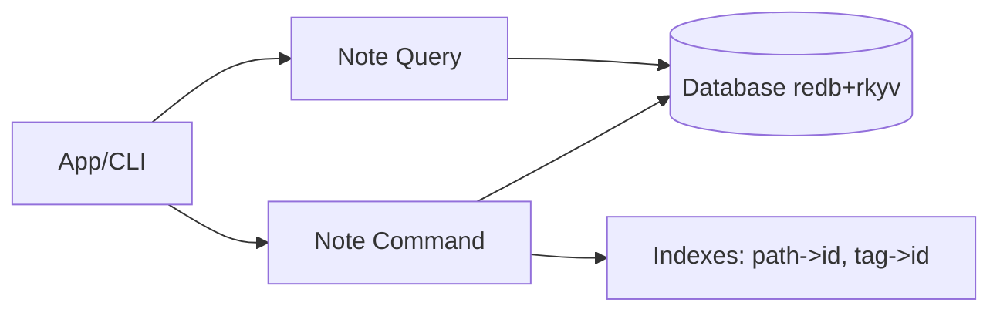

# Tech Spec: Note CQRS (Commands + Queries)

> **Note**: See `docs/design/README.md` for usage instructions.

## 1. Problem Space (The "Why")

### 1.1 Context & Background

The note bounded context uses a CQRS split:

- Commands: create/update/delete note state.
- Queries: retrieve note state.

Current implementation lives in:

- `lithos-core/src/note/ports.rs` (traits `Command`, `Query`)
- `lithos-core/src/note/command.rs` (DB-backed command impl)
- `lithos-core/src/note/query.rs` (DB-backed query impl)
- `lithos-core/src/db.rs` (redb + rkyv primitives)

Persistence design:

- `Database::put` stores rkyv-serialized values (owned bytes).
- `Database::get` provides a closure-based **zero-copy** read API.
- `Database::get_owned` fully deserializes into an owned Rust value (cold-path).

The CQRS note query implementation currently uses `get_owned`, which is correct functionally but does not align with the intent of "zero-copy reads" for hot paths.

Additionally, error mapping currently converts DB errors into stringly note errors in several places, which is allocation-heavy and loses structure.

### 1.2 Goals & Non-Goals

**Goals**

- Define a CQRS interface that is:
  - idiomatic Rust,
  - ergonomic for callers,
  - aligned with rkyv performance requirements.
- Establish explicit error contracts:
  - split error types for command vs query (CQRS alignment),
  - preserve structured error kinds, avoid eager string allocation.
- Define how indexing tables are maintained (path index, tag index).
- Define zero-copy query strategy without breaking object safety requirements.

**Non-Goals**

- Designing the indexing actor / background concurrency (beyond sync-first CQRS surface).
- Implementing cross-context orchestration.

### 1.3 Constraints (The Hard Limits)

- **Sync-first core**: CQRS in core remains synchronous.
- **rkyv is key**: prefer `Database::get` for read hot paths.
- **Object safety**: if `dyn Command`/`dyn Query` are used, trait methods must remain object-safe (no generics, no `impl Trait` args).
- **Persisted bytes contract**: do not change archived model layouts without explicit migration.

Additional CQRS conventions for this repo:

- Prefer **concrete** command/query types and **static methods** on aggregates for the primary code path.
- Use traits only when polymorphism is required (testing, alternate backends).
- Domain events must be staged and dispatched only after transaction commit (Unit of Work).

## 2. Guide-Level Explanation (The "What")

### 2.1 User/Dev Experience

Typical usage from application code:

```rust
use lithos_core::note::{command, query};
use lithos_core::note::aggregate::NotePath;
use lithos_core::note::error::NoteCommandError; // proposed in this spec
use lithos_core::note::ports::{Command as _, Query as _};

let cmd = command::Command::new(&db);
let qry = query::Query::new(&db);

// `NoteCommandError` is the proposed command-side error type in this spec.
fn example() -> Result<(), NoteCommandError> {
  let path = NotePath::try_from("notes/a.md")?;
  let note = cmd.create(path)?;

  let _by_id = qry.find_by_id(note.id)?;
  let _by_path = qry.find_by_path(note.path())?;
  Ok(())
}
```

For high-performance read paths (e.g., LSP), the preferred API is a **concrete** query surface that can be closure-based and zero-copy:

```rust
// Sketch: object-safe traits cannot take generic closures.
// For hot paths, use a concrete type that wraps Database::get.
let note_id = note.id;
let title = qry.with_archived_by_id(note_id, |archived_note| {
    archived_note.id
});
```

### 2.2 Mental Model

- Commands are responsible for maintaining storage invariants and indexes.
- Queries are responsible for retrieving state efficiently.
- There are two query tiers:
  - **Owned** results for mutation/CLI workflows.
  - **Zero-copy** access for hot paths via closure-based APIs (concrete types).

Design rule: the API must make it obvious which tier is being used.

## 3. Detailed Design (The "How")

### 3.1 System Architecture



### 3.2 Component & Interface Specifications

### 3.2.0 Type-Driven Design Improvements (CQRS)

CQRS is a natural place to apply type-driven design because it defines boundaries and contracts.

Principles:

- Commands should accept **validated domain types** wherever practical (e.g., `NotePath`, `TagPath`).
- Queries should accept **borrowed validated types** (e.g., `&NotePath`) to avoid allocation.
- Avoid "stringly typed" storage keys in domain/CQRS layers. If a DB table needs a specific encoding, wrap it in a storage-layer newtype.

Proposed CQRS-specific types:

- `NoteId(Uuid)` (domain type)
  - Used everywhere outside the DB boundary.

- `PathKey(Box<str>)` (storage-layer type)
  - Canonical encoding for index keys; derived from `NotePath`.
  - Keeps DB table encoding concerns out of domain logic.

- `TagKey(Box<str>)` (storage-layer type)
  - Canonical encoding for tag index keys; derived from `TagPath`.

Typed command inputs (optional but recommended):

- `CreateNote { path: NotePath }`
- `UpdateNote { note: Note }`
- `DeleteNote { id: NoteId }`

These structs make commands extensible (future fields) without breaking call sites, and they prevent argument-order bugs.

#### Component: `note::ports::Command`

- **Responsibility**: mutate note state and maintain indexes.
- **Public Interface (target)**:
  - `create(path: NotePath) -> Result<Note, NoteCommandError>` (or `create(cmd: CreateNote)`)
  - `update(note: Note) -> Result<Note, NoteCommandError>` (or `update(cmd: UpdateNote)`)
  - `delete(id: NoteId) -> Result<(), NoteCommandError>` (or `delete(cmd: DeleteNote)`)

- **Errors**
  - Domain validation: `NoteError` (wrapped)
  - Persistence: `DbError` (wrapped)

#### Component: `note::ports::Query`

- **Responsibility**: retrieve note state.
- **Public Interface (baseline, object-safe)**:
  - `find_by_id(id: NoteId) -> Result<Option<Note>, NoteQueryError>`
  - `find_by_path(path: &NotePath) -> Result<Option<Note>, NoteQueryError>`
  - `list() -> Result<Vec<Note>, NoteQueryError>`

- **Zero-copy strategy**

Because trait-object methods cannot accept generic closures, the zero-copy API is provided on a **concrete** query type (or a separate non-trait component) used directly by high-performance callers.

Target concrete methods:

- `with_archived_by_id<R>(&self, id: NoteId, f: impl FnOnce(&ArchivedNote) -> R) -> Result<Option<R>, NoteQueryError>`

This mirrors `Database::get` and allows returning small computed results without deserializing the full note.

Validation rule:

- The concrete zero-copy API must only expose archived values that have been bytecheck-validated at the storage boundary.
- Prefer returning computed values (`R`) rather than exposing archived references outside the closure.

#### Component: CQRS error types

- `NoteCommandError`
  - `Domain(#[from] NoteError)`
  - `Storage(#[from] DbError)`

- `NoteQueryError`
  - `Domain(#[from] NoteError)` (rare, but reserved for future)
  - `Storage(#[from] DbError)`

Design rule: do not eagerly stringify DB errors inside CQRS paths.

Error mapping rules:

- Preserve structured error kinds (domain vs storage).
- Avoid `to_string()` in core CQRS implementations; if a human-readable message is needed, format it at the CLI boundary.
- If callers need stable branching on error cases, provide enums/variants rather than parsing error text.

### 3.2.1 Concrete-first CQRS surface (recommended)

To align with repo conventions, the primary API should be concrete types, with traits as optional polymorphic wrappers.

Recommended structure:

- `note::command::NoteCommand` (concrete) with inherent methods (`create`, `update`, `delete`)
- `note::query::NoteQuery` (concrete) with inherent methods (`find_by_id`, `find_by_path`, `list`, `with_archived_by_id`)
- `note::ports::{Command, Query}` traits remain for tests/alternate backends and can be implemented by the concrete types.

### 3.3 Integration & Data Flow

#### Create note

```mermaid
sequenceDiagram
  participant Caller
  participant Cmd as Note Command
  participant DB as Database

  Caller->>Cmd: create(NotePath)
  Cmd->>Cmd: Note::new(Uuid::now_v7(), path)
  Cmd->>DB: put("notes", id, note)
  Cmd->>DB: multimap_insert("path_to_id", path, id)
  Cmd-->>Caller: Ok(note)

Unit of Work rule:

- Any domain events produced during the command MUST be staged and dispatched only after the transaction commits.
- If command handlers return a `Note`, event dispatch belongs to the application layer (or a dedicated UoW coordinator), not inside the domain model.
```

#### Update note

- Load existing note (owned) to determine index deltas.
- Update:
  - `path_to_id` if path changed.
  - `tags_to_notes` remove old tags, insert new tags.
- Persist updated note.

#### Delete note

- Load existing note (owned) for index cleanup.
- Remove from indexes.
- Delete stored note.

#### Query by path

- Read index `path_to_id` to find `id`.
- Read note by `id`.

### 3.4 Data Models

Storage schema (logical):

- `notes` table: `id -> Note`
- `path_to_id` multimap: `note_path -> id`
- `tags_to_notes` multimap: `tag_full_path -> id`

Notes:

- Indexes are stored as `String` ids today; the format should be treated as an internal adapter concern.
- Future: prefer storing UUID bytes to avoid conversion overhead if profiling shows it matters.

### 3.5 Core Logic & Algorithms

- Command index maintenance is delta-based:
  - On update, compare old vs new path, and old vs new tags.
- Query tiering:
  - Baseline object-safe query methods return owned `Note`.
  - Hot-path methods compute from archived values and return small owned results.

### 3.6 Testing & Benchmarks

- Integration tests:
  - `create` writes `notes` and updates `path_to_id`.
  - `update` maintains path and tag index deltas.
  - `delete` removes note and cleans indexes.
- Corruption tests:
  - If archived bytes fail validation, queries surface a structured storage error and the system can trigger clean-slate/reindex.
- Benchmarks (criterion):
  - `find_by_id(get_owned)` vs `with_archived_by_id` for typical LSP reads.
  - Path lookup via index + note read.

## 4. Alternatives & Decisions (The "Divergence")

### 4.1 Tactical Decisions

#### Decision: Split errors by CQRS port (`NoteCommandError` vs `NoteQueryError`)

- **Context**: CQRS surfaces differ; command failure modes and query failure modes should remain distinct.
- **Choice**: Define two error enums, both wrapping `NoteError` and `DbError`.
- **Alternatives Considered**:
  - Single repository error: rejected (less CQRS-aligned, less precise for callers).

#### Decision: Provide zero-copy reads via concrete query API (not via object-safe trait)

- **Context**: object-safe trait methods cannot accept generic closures required for zero-copy `Database::get` style.
- **Choice**: keep object-safe trait for general use; add concrete zero-copy helpers for hot paths.
- **Alternatives Considered**:
  - Make `Query` generic over closure: rejected (breaks `dyn Query`).
  - Return borrowed references tied to DB transactions: rejected (lifetime leakage; unsafe/coupled to transaction scope).

## 5. Operational Readiness (The "Reality Check")

### 5.1 Observability

- CQRS errors must preserve structured kind information (domain vs storage).
- Tracing spans should be applied in app/adapters layers; core remains minimal.

### 5.2 Migration Strategy

- This spec prefers additive API changes.
- Avoid changing archived model layouts as part of CQRS refactors.
- If storage key formats change (e.g., storing UUID bytes), treat as an adapter migration with clean-slate or explicit migration path.

### 5.3 Security & Privacy

- All filesystem paths must be validated before hitting adapters.
- CQRS should prefer validated types (`NotePath`) at boundaries.

## 6. Pre-Mortem (The "Inversion")

- **Risk**: Query hot paths accidentally use `get_owned` everywhere and regress LSP latency.
  - _Mitigation_: Provide explicit `with_archived_*` methods and add benchmarks/criterion for representative queries.

- **Risk**: Index maintenance becomes inconsistent on update/delete.
  - _Mitigation_: Add integration tests covering create/update/delete and verifying indexes round-trip correctly.

## 7. Critique & Refinement Log

| Date       | Critique / Issue                                           | Resolution                                                     |
| :--------- | :--------------------------------------------------------- | :------------------------------------------------------------- |
| 2026-02-03 | "Do we require `dyn Query` for the hot path?"             | Draft proposes concrete zero-copy methods; confirm call sites. |
| 2026-02-03 | "Are note events staged after commit (Unit of Work)?"     | Draft describes staging; implementation should align with UoW. |
