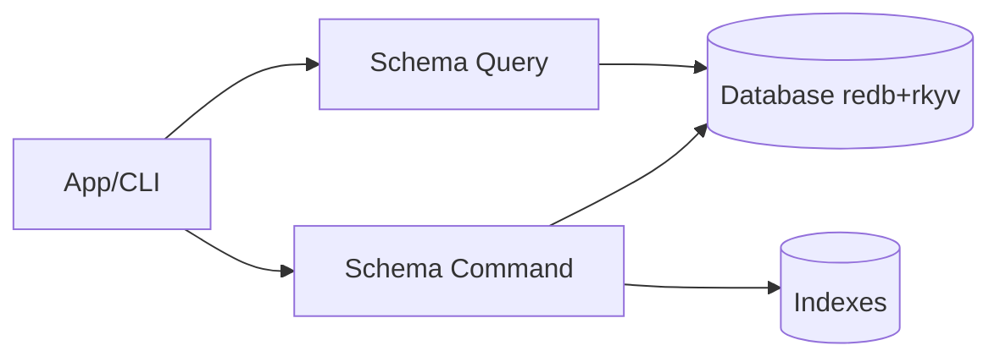

# Tech Spec: Schema CQRS (Commands + Queries)

> **Note**: See `docs/design/README.md` for usage instructions.

## 0. Definition of Done

- CQRS contracts for schema are documented as stable interfaces (inputs/outputs/errors/invariants).
- The design explicitly supports both:
  - cold-path owned reads (CLI workflows), and
  - hot-path zero-copy reads (closure-based).
- Proposed DB tables / indexes are specified and compatible with redb constraints.
- Error contracts avoid stringification in core paths and preserve structured errors.
- The design respects rkyv validation requirements at trust boundaries.

## 1. Problem Space (The "Why")

### 1.1 Context & Background

The schema context persists and retrieves:

- schemas (resolved validation "truth" used at runtime),
- the property bank (reusable property definitions),
- optional indexes (name → id, etc.).

Current state (inventory):

- `lithos-core/src/schema/ports.rs` defines command/query traits.
- `lithos-core/src/schema/command.rs` and `lithos-core/src/schema/query.rs` provide DB-backed implementations.
- The current port signatures do not fully align with the concrete implementations.
- Some operations are stringly-typed (schema name as `&str`) even though validated `SchemaName` exists.

From a performance and correctness perspective, CQRS is the boundary where we must be explicit about:

- storage keys and index maintenance,
- whether returned values are owned or borrowed/archived,
- transaction scoping and event emission.

### 1.2 Goals & Non-Goals

**Goals**

- Define an idiomatic, type-driven CQRS API:
  - use validated domain types (`SchemaName`, `SchemaId`) at the boundary,
  - avoid stringly-typed table keys in CQRS interfaces.
- Provide a clear zero-copy query tier that respects redb guard lifetimes.
- Specify the schema persistence model and required indexes.
- Make errors structured and cheap:
  - no eager `to_string()` of underlying DB errors in the core.

**Non-Goals**

- Building an async orchestration layer (schema CQRS stays sync-first).
- Designing cross-context event buses.

### 1.3 Constraints (The Hard Limits)

- **redb access is transaction-scoped**: values returned by `get()` are guard-based and must not outlive the transaction.
- **rkyv safety**: persisted bytes are untrusted; use safe validation (`rkyv::access` / bytecheck) at trust boundaries.
- **dyn-compatibility**: if trait objects are used (`&dyn Query`), avoid generic methods on the trait surface.
- **Lean**: avoid allocations on hot read paths.
- **Errors**: library surfaces use structured `Result` errors (no `unwrap`/`expect`); reserve `anyhow` for binaries/CLI (see https://github.com/apollographql/rust-best-practices/tree/1c78fa64bb0d5df4a4d18d5923a7ced615f947d1).

## 2. Guide-Level Explanation (The "What")

### 2.1 User/Dev Experience

Concrete-first usage pattern (preferred for performance + ergonomics):

```rust
use lithos_core::schema::{command, query};

let cmd = command::Command::new(&db);
let qry = query::Query::new(&db);

// Save a schema (validated domain object)
cmd.save(&schema)?;

// Owned read (cold path)
let maybe_schema = qry.find_owned_by_name(schema.name())?;

// Zero-copy read (hot path): compute a value inside the closure
let property_count = qry.with_archived_by_name(schema.name(), |archived| {
    archived.properties.len()
})?;
```

Notes:

- `with_archived_*` returns computed owned data, not archived references.
- If a trait-based port is needed for testing, keep the trait surface dyn-compatible and put closure-based APIs on concrete types.

### 2.2 Mental Model

- Commands are the *only* writers and are responsible for maintaining all indexes.
- Queries can offer multiple tiers:
  - **owned**: deserialize to runtime model (simple, cold path)
  - **archived/zero-copy**: compute small results without deserializing

Design rule: API names must make the tier obvious.

## 3. Detailed Design (The "How")

### 3.1 System Architecture



### 3.2 Component & Interface Specifications

#### Component: Schema Command

- **Responsibility**: mutate schema state and maintain storage invariants.

Target concrete interface (recommended):

- `save(&self, schema: &Schema) -> Result<(), SchemaCommandError>`
- `delete_by_name(&self, name: &SchemaName) -> Result<(), SchemaCommandError>`
- `save_property_bank(&self, bank: &PropertyBank) -> Result<(), SchemaCommandError>`

Notes:

- Deletion should be keyed by the schema’s canonical key (see Data Models). If the storage model is name-keyed, expose name-keyed operations.
- If we additionally need id-keyed operations, define and maintain an explicit name↔id index.

Trait port (optional for polymorphism/testing):

- Keep it small and dyn-compatible.
- Prefer taking borrowed types (`&SchemaName`, `&Schema`) to avoid unnecessary cloning.

#### Component: Schema Query

- **Responsibility**: retrieve schema state.

Two-tier query surface:

1) Owned (cold path):

- `find_owned_by_name(&self, name: &SchemaName) -> Result<Option<Schema>, SchemaQueryError>`
- `list_owned(&self) -> Result<Vec<Schema>, SchemaQueryError>`

2) Archived/zero-copy (hot path; concrete-only):

- `with_archived_by_name<R>(&self, name: &SchemaName, f: impl FnOnce(&ArchivedSchema) -> R)
   -> Result<Option<R>, SchemaQueryError>`

Rules for `with_archived_*`:

- It validates archived bytes at the trust boundary.
- It does not allow archived references to escape (closure returns owned `R`).
- It must not leak redb guards or transaction-scoped borrows.

#### Component: CQRS Error Types

- **SchemaCommandError**
  - `Domain(#[from] SchemaError)`
  - `Storage(#[from] DbError)`

- **SchemaQueryError**
  - `Storage(#[from] DbError)`
  - optionally `CorruptData { reason: Box<str> }` when bytecheck/rkyv validation fails

Design rules (Rust API Guidelines + Lithos rules):

- Preserve error structure; avoid `.to_string()` conversions in core.
- Wrap underlying errors as `source` where applicable.
- Error messages should be concise and stable.
- For API and object-safety guidance when exposing trait objects, see the Rust API Guidelines checklist: https://rust-lang.github.io/api-guidelines/checklist.html

### 3.3 Integration & Data Flow

#### Persistence strategy choice

There are two viable strategies for what we store as the value in redb:

A) Store **validated runtime schema** (`Schema`)

- Pros: queries return ready-to-use schemas.
- Cons: any change to runtime model impacts persisted bytes; careful with migrations.

B) Store **serde definitions** (`RawSchema` or a dedicated persisted def)

- Pros: persisted format can be more stable; compilation can evolve.
- Cons: every read requires compilation/validation (might be expensive), unless cached.

This spec recommends A for now (simplicity), but requires explicit migration discipline:

- archived model changes are treated as on-disk migrations.

#### Suggested redb tables / indexes

To avoid “id-keyed API but name-keyed storage” mismatch, pick one canonical key and add indexes.

Recommended:

- Primary table: `schema_by_id: SchemaId -> bytes(ArchivedSchema)`
- Index table: `schema_id_by_name: SchemaNameKey -> SchemaId`

Also:

- `property_by_id: PropertyId -> bytes(ArchivedProperty)`
- `property_id_by_name: PropertyNameKey -> PropertyId`

And (optional):

- `property_bank: singleton -> bytes(ArchivedPropertyBank)`

Key encoding guidance:

- prefer fixed-width keys where possible (`Uuid` as `[u8; 16]` or u128) for performance.
- if using string keys, define a dedicated storage-layer newtype (`SchemaNameKey(Box<str>)`) and keep it out of domain models.

### 3.4 Data Models

#### Storage key newtypes (adapter/storage layer)

```rust
pub struct SchemaNameKey(Box<str>);
pub struct PropertyNameKey(Box<str>);
```

These represent the canonical serialized encoding for keys.

#### Returned values

- Owned tier returns `Schema` / `PropertyBank`.
- Zero-copy tier returns computed owned values `R`.

### 3.5 Core Logic & Algorithms

- Writes should be batched in a single write transaction where possible.
- Domain events are staged during command execution and only dispatched after successful commit.

## 4. Alternatives & Decisions (The "Divergence")

### 4.1 Tactical Decisions

#### Decision: Concrete-first query API for zero-copy

- **Choice**: closure-based `with_archived_*` exists on the concrete query type, not on the dyn port trait.
- **Why**: dyn-compatibility forbids generic methods; concrete types allow the zero-copy pattern.
- **Alternative**: put generic method on trait (rejected; not object-safe).

#### Decision: Canonical key is `SchemaId`

- **Choice**: store schemas by id, and maintain name→id index.
- **Why**: aligns with type-driven identity, avoids renames being “identity changes”, and unlocks future rename operations without data rewrites.
- **Alternative**: store schemas by name only (accepted as interim option, but causes API/port mismatch and makes renames harder).

## 5. Operational Readiness (The "Reality Check")

### 5.1 Observability

- CQRS entrypoints should be instrumented in higher layers (`app` / `cli`), not in core models.
- Emit counters/timers around:
  - schema save/delete
  - schema list/find
  - zero-copy “with_archived” call counts (to spot hot paths)

### 5.2 Migration Strategy

- Introduce new tables/indexes alongside existing ones.
- Implement dual-read during transition:
  - if `schema_by_id` is missing, fall back to legacy `schemas_by_name`.
- After full reindex/upgrade, remove legacy tables.

### 5.3 Security & Privacy

- Treat DB bytes as untrusted.
- On validation failure, return a structured “corrupt data” error and trigger the “clean slate” protocol defined in storage guidance.

## 6. Pre-Mortem (The "Inversion")

- **Risk**: returning archived references across transaction boundaries leads to UB.
  - _Mitigation_: closure-based API that returns owned `R`.

- **Risk**: schema rename becomes painful if name is the primary key.
  - _Mitigation_: make `SchemaId` the canonical storage key with name→id index.

- **Risk**: errors become stringly and hard to branch on.
  - _Mitigation_: typed CQRS errors; avoid `to_string()` conversions.

## 7. Critique & Refinement Log

| Date       | Critique / Issue                                        | Resolution                                                  |
| :--------- | :------------------------------------------------------ | :---------------------------------------------------------- |
| 2026-02-03 | Traits and concrete CQRS signatures misaligned           | Define concrete-first API; keep trait ports minimal          |
| 2026-02-03 | Zero-copy queries conflict with dyn-compatibility        | Put closure-based APIs on concrete query type                |
| 2026-02-03 | Name-keyed storage makes renames hard                    | Recommend `SchemaId` primary key + name→id index            |
| 2026-02-03 | Persisted bytes are untrusted                            | Require rkyv validation at trust boundary; corrupt-data path |
