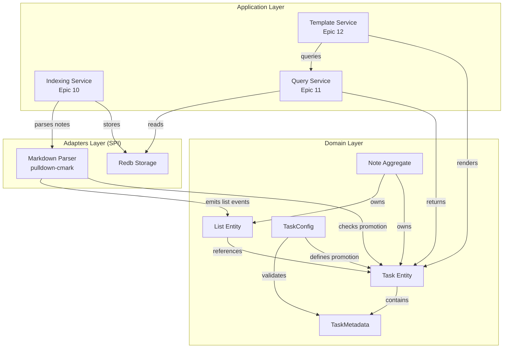
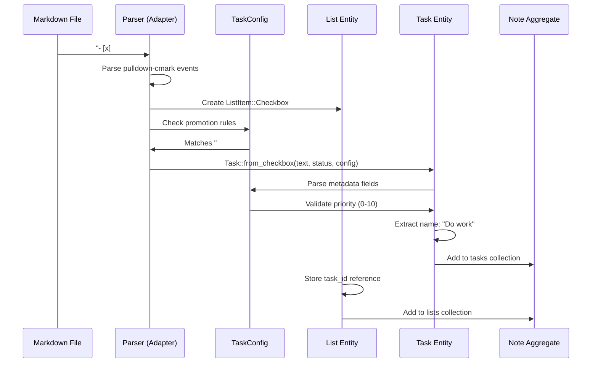
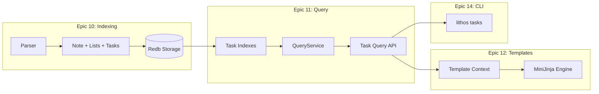

# Tech Spec: Configuration-Driven Task System with List Entities

> **Note**: See `docs/design/README.md` for usage instructions and T-Shirt sizing.

Related specs:

- [docs/design/001-config-models.md](001-config-models.md) (config model/value contracts used by task schema and metadata)
- [docs/design/002-config-cqrs.md](002-config-cqrs.md) (how config layers and merged config are persisted/retrieved)

## 1. Problem Space (The "Why")

### 1.1 Context & Background

**Current State**: The existing `Task` entity ([crates/domain/src/note/task.rs](../../crates/domain/src/note/task.rs)) is too simplistic for real-world task management workflows:

- Only tracks checkbox status (`[x]`, `[ ]`, `[-]`)
- No inline metadata support (`[key:: value]` fields)
- Cannot differentiate between simple checklists and rich tasks
- Missing temporal tracking (due dates, reminders, completion timestamps)
- No support for custom task types or user-defined metadata

**User Context**: Obsidian users leverage plugins like Dataview and Tasks to create rich task management systems with:
- Custom metadata fields (`[priority:: 1]`, `[project:: work]`)
- Temporal emoji markers (⏰ reminder, 📅 due, ✅ completed)
- Task type classification (action items, meetings, research tasks)
- Configurable status symbols beyond basic complete/incomplete

**User Example** (current workflow that fails):
```markdown
- [x] #task Convert SuperMemo to Anki [type:: action_item]
      [time_start:: 14:00] [time_end:: 15:00] [duration_est:: 150]
      ⏰ 2024-07-16 12:25 ➕ 2024-07-16 📅 2024-07-16 ✅ 2024-07-16
```

**Architectural Gap**: pulldown-cmark parses **all list types** (ordered, unordered, task lists), but Lithos only models tasks. Missing the `List` structural entity creates an impedance mismatch between parser events and domain model.

**Why Now**: Epic 11 (Query Service) and Epic 12 (Templates) need rich task metadata for:
- Task queries: `lithos tasks list --overdue --priority 1`
- Template functions: ``
- Reports: Generate weekly task summaries

**Related Decisions**:
- [ADR 0004](../adr/0004-markdown-parsing.md): pulldown-cmark integration
- [Epic 11](../../_bmad-output/planning-artifacts/epics/epic-11-query-service-knowledge-graph-mvp-core.md): Query service
- [Epic 12](../../_bmad-output/planning-artifacts/epics/): Template system (TBD)

### 1.2 Goals & Non-Goals

**Goals**:
1. **Configuration-Driven Metadata**: Users define task schema in vault config (no hardcoded fields)
2. **Type Safety**: Validate metadata types at parse time (enums, bounds, date formats)
3. **Structural Completeness**: Model all list types (ordered, unordered, checkbox) from pulldown-cmark
4. **Task Promotion**: Auto-promote checkbox items to Task entities based on config rules
5. **Dataview Parity**: Support inline metadata (`[key:: value]`) and emoji temporal markers
6. **Query Integration**: Tasks queryable via Epic 11 (`find_tasks_by_field()`, `find_overdue_tasks()`)
7. **Template Access**: Tasks accessible in templates (`{{ task.metadata.get_field("priority") }}`)
8. **Zero Breaking Changes**: Existing task parsing continues to work

**Non-Goals**:
- **Recurring tasks**: No cron-style scheduling (`[repeat:: daily]`) in initial version
- **Task dependencies**: No graph-based dependencies (`[blocked-by:: task-id]`)
- **Time tracking**: No stopwatch/timer CLI integration
- **Subtask nesting**: Parse nested checkboxes as flat items (no parent-child relationships)
- **Pattern extraction**: NO regex extraction from task names (explicit metadata only)
- **Real-time sync**: Task updates require re-indexing (no live file watching in MVP)

### 1.3 Constraints (The Hard Limits)

**Hexagonal Architecture**:
- Domain layer (`crates/domain/`) MUST have zero external dependencies
- TaskConfig lives in domain, parser implementation in adapters
- No pulldown-cmark types in domain entities

**Zero-Copy Performance**:
- Task metadata stored as `SettingValue` (reuses existing config enum)
- Parser must use `&str` slices, not allocate for every metadata field
- Target: Parse 1000 tasks in <100ms (inline with Epic 10 indexing goals)

**Backward Compatibility**:
- Existing checkboxes without metadata remain valid
- Parser must emit both `List` (structural) and `Task` (promoted) entities
- Config defaults must match current behavior (e.g., `[x]` → Complete)

**Data Integrity**:
- Invalid metadata values (bad enum, out-of-bounds) → parse error, not silent failure
- Unconfigured fields stored as `SettingValue::String` (forward compatibility)
- Task IDs must be UUID v7 for stable identity across file renames

**Epic Integration**:
- Must integrate with Epic 11 QueryService (tasks indexed in Redb)
- Must integrate with Epic 12 template system (tasks accessible in MiniJinja context)

**No External State**:
- Task status changes tracked via file modifications only
- No separate task database (tasks are derived from note content during indexing)

## 2. Guide-Level Explanation (The "What")

### 2.1 User/Dev Experience

#### User Perspective: Configuring Tasks

**Step 1: Define Task Schema in Vault Config**

Users create `.lithos/lithos.toml` in their vault:

```toml
[task]
enabled = true

# Promotion rules - what makes a checkbox a "task"
promotion.tags = ["#task", "#todo", "#action-item"]
promotion.auto_promote_with_metadata = true

# Custom status symbols
[task.status]
complete = "x"
incomplete = " "
cancelled = "-"
in_progress = ">"
waiting = "?"

# Temporal markers (emojis + keywords)
[task.temporal.reminder]
emoji = "⏰"
keyword = "reminder"
field = "reminder"
format = "%Y-%m-%d %H:%M"
type = "datetime"

[task.temporal.due]
emoji = "📅"
keyword = "due"
field = "due_date"
format = "%Y-%m-%d"
type = "date"

[task.temporal.completed]
emoji = "✅"
keyword = "completed"
field = "completed_at"
format = "%Y-%m-%d"
type = "date"

# Custom metadata fields
[task.metadata.type]
keyword = "type"
field = "task_type"
type = "enum"
values = ["action_item", "reminder", "meeting", "research"]

[task.metadata.priority]
keyword = "priority"
field = "priority"
type = "integer"
min = 0
max = 10

[task.metadata.project]
keyword = "project"
field = "project_name"
type = "string"

# Query optimization
[task.indexing]
indexed_fields = ["due_date", "priority", "project_name", "task_type"]
```

**Step 2: Write Tasks with Metadata**

In any note:

```markdown
# My Tasks

- [ ] #task Review pull request [priority:: 1] [project:: lithos] 📅 2026-02-01
- [>] #task Implement cache layer [type:: action_item] [priority:: 2] ⏰ 2026-01-31 14:00
- [x] #todo Buy groceries [type:: reminder] ✅ 2026-01-30

## Simple Checklists (not promoted to tasks)
- [ ] Remember to call mom
- [x] Water plants
```

**Step 3: Query Tasks via CLI**

```bash
# List all incomplete tasks
lithos tasks list --status incomplete

# Find overdue tasks
lithos tasks overdue

# Query by metadata
lithos tasks list --field priority --value 1
lithos tasks list --field project_name --value lithos

# Tasks due today
lithos tasks due --when today
```

**Step 4: Use Tasks in Templates**

```jinja
{# templates/weekly-review.md #}
# Weekly Review - {{ date.now().format("%Y-W%V") }}

## Overdue Tasks

- [{{ task.status_symbol }}] {{ task.text }}
  - Priority: {{ task.metadata.get_number("priority") | default(0) }}
  - Due: {{ task.metadata.get_date("due_date") | date("%Y-%m-%d") }}


## This Week's Completed Tasks

- ✅ {{ task.text }} ({{ task.metadata.get_string("project_name") | default("Personal") }})


## Tasks by Project

### {{ project }}

- [{{ task.status_symbol }}] {{ task.text }} (P{{ task.metadata.get_number("priority") }})


```

**Step 5: Create Validated Tasks in Templates**

```jinja
{# templates/daily-tasks.md #}
# Tasks for {{ date.now().format("%Y-%m-%d") }}

{# Config-validated task creation with static values #}
{{ tasks.format_checkbox(
    text="Review pull request",
    status="x",
    metadata={
        "priority": 1,
        "project_name": "lithos",
        "due_date": "2026-02-01"
    }
) }}

{# Bulk task generation #}


{{ tasks.format_checkbox(
    text=item,
    status=" ",
    metadata={"priority": loop.index, "project_name": "lithos"}
) }}


{# Interactive task creation using prompts/suggesters #}
{# Prompts and suggesters are standard template functions #}






{{ tasks.format_checkbox(
    text=task_text,
    status=" ",
    metadata={
        "priority": task_priority,
        "project_name": task_project,
        "type": task_type,
        "due_date": due_date
    }
) }}
```

#### Developer Perspective: Domain Model

**Creating a Task from Config**

```rust
use lithos_domain::{Task, CheckboxStatus, TaskConfig};

// Config loaded from vault
let config: TaskConfig = vault.config().task;

// Parse task from markdown checkbox
let raw_text = "#task Implement feature [priority:: 1] [project:: lithos]";
let task = Task::from_checkbox(
    raw_text.to_owned(),
    CheckboxStatus::Incomplete,
    42, // position in document
    &config,
)?;

// Access metadata
assert_eq!(task.text(), "Implement feature");
assert_eq!(task.metadata.get_number("priority"), Some(1.0));
assert_eq!(task.metadata.get_string("project_name"), Some("lithos"));
```

**Query Service Integration (Epic 11)**

```rust
use lithos_app::QueryService;

// In application layer
let query_service = QueryService::new(cache_reader, event_bus);

// Find tasks by metadata
let high_priority = query_service
    .find_tasks_by_field("priority", &SettingValue::Number(1.0))
    .await?;

// Find overdue tasks
let overdue = query_service.find_overdue_tasks().await?;

// Complex query
let filter = TaskFilter {
    status: Some(CheckboxStatus::Incomplete),
    field_filters: vec![
        ("project_name", SettingValue::String("lithos".into())),
    ],
    due_before: Some(chrono::Utc::now()),
};
let results = query_service.find_tasks(filter).await?;
```

**List Entity (Structural Model)**

```rust
use lithos_domain::{List, ListType, ListItem};

// Parser creates List entities for document structure
let list = List {
    list_type: ListType::Unordered,
    items: vec![
        ListItem::Plain {
            text: "Regular bullet".into(),
            position: 10,
        },
        ListItem::Checkbox {
            text: "#task Do work [priority:: 1]".into(),
            status: CheckboxStatus::Incomplete,
            position: 30,
            task_id: Some(task_uuid), // Links to promoted Task
        },
    ],
    position: 0,
    depth: 0,
};

// Both list and promoted task stored in Note
note.add_list(list);
note.add_task(task); // Promoted from checkbox
```

### 2.2 Mental Model

**Three-Layer Hierarchy**:

```
┌─────────────────────────────────────────────────────────────┐
│ Document Structure (Lists)                                  │
│ - Captures markdown syntax (ordered/unordered/checkbox)     │
│ - Preserves position, nesting, all items                    │
│ - Stored in: Note::lists                                    │
└─────────────────────────────────────────────────────────────┘
                              │
                              │ Promotion (config-driven)
                              ▼
┌─────────────────────────────────────────────────────────────┐
│ Rich Tasks (Promoted Checkboxes)                            │
│ - Has #task tag OR inline metadata                          │
│ - Queryable, indexed, template-accessible                   │
│ - Stored in: Note::tasks                                    │
└─────────────────────────────────────────────────────────────┘
                              │
                              │ References
                              ▼
┌─────────────────────────────────────────────────────────────┐
│ Task Metadata (Config-Defined Schema)                       │
│ - User-defined fields (priority, project, type)             │
│ - Temporal markers (due, reminder, completed)               │
│ - Stored as: HashMap<String, SettingValue>                  │
└─────────────────────────────────────────────────────────────┘
```

**Key Concepts**:

1. **List = Structure, Task = Semantics**
   - Lists are "what markdown wrote"
   - Tasks are "what the user meant" (extracted via config rules)

2. **Promotion = Config-Driven Transformation**
   - Simple checkbox → List only
   - Checkbox with `#task` tag → List + Task
   - Checkbox with metadata → List + Task (if auto_promote enabled)

3. **Metadata = User Schema**
   - Not hardcoded in domain model
   - Defined per vault in config
   - Validated at parse time against config schema

4. **Status Symbols = User Preference**
   - `[x]` might mean "complete" in one vault
   - `[>]` might mean "in_progress" in another vault
   - Config maps symbols → semantic enum values

**Think of it like**:
- **List** = HTML `<ul>` or `<ol>` tag (structure)
- **Task** = Application-level "TODO item" (meaning)
- **TaskConfig** = JSON Schema for task metadata

## 3. Detailed Design (The "How")

### 3.1 System Architecture

#### Component Diagram



#### Data Flow: Markdown → Task Entity



#### Epic Integration Architecture



### 3.2 Data Models

#### Core Domain Entities

```rust
// crates/domain/src/note/list.rs

/// Represents a markdown list (ordered, unordered, or checkbox).
#[derive(Debug, Clone, PartialEq, Serialize, Deserialize)]
#[non_exhaustive]
pub struct List {
    /// Type of list
    list_type: ListType,
    /// Items in this list
    items: Vec<ListItem>,
    /// Start position in document
    position: usize,
    /// Nesting depth (0 = top-level)
    depth: u8,
}

#[derive(Debug, Clone, Copy, PartialEq, Eq, Serialize, Deserialize)]
#[non_exhaustive]
pub enum ListType {
    /// Numbered list (1., 2., 3.)
    Ordered { start: u64 },
    /// Bullet list (-, *, +)
    Unordered,
}

#[derive(Debug, Clone, PartialEq, Serialize, Deserialize)]
#[non_exhaustive]
pub enum ListItem {
    /// Plain list item
    Plain {
        text: Box<str>,
        position: usize,
    },
    /// Checkbox item (may be promoted to Task)
    Checkbox {
        text: Box<str>,
        status: CheckboxStatus,
        position: usize,
        /// If promoted to Task, stores task ID for linkage
        task_id: Option<Uuid>,
    },
}
```

```rust
// crates/domain/src/note/task.rs

/// Rich task entity with user-configured metadata.
#[derive(Debug, Clone, PartialEq, Serialize, Deserialize)]
#[non_exhaustive]
pub struct Task {
    /// UUID v7 for stable identity
    id: Uuid,
    /// Clean task text (before first metadata marker)
    text: Box<str>,
    /// Checkbox status (config-mapped symbol)
    status: CheckboxStatus,
    /// Position in source document
    position: usize,
    /// Tags extracted from text
    tags: Vec<Tag>,
    /// Dynamic metadata (config-defined schema)
    metadata: TaskMetadata,
}

#[derive(Debug, Clone, Copy, PartialEq, Eq, Serialize, Deserialize)]
#[non_exhaustive]
pub enum CheckboxStatus {
    Complete,      // [x]
    Incomplete,    // [ ]
    Cancelled,     // [-]
    InProgress,    // [>]
    Waiting,       // [?]
    Delegated,     // [d]
    Custom(Box<str>), // Fallback for user-defined symbols
}

impl CheckboxStatus {
    /// Parse from config symbol mapping.
    pub fn from_symbol(symbol: &str, config: &TaskConfig) -> Self {
        config.status.get(symbol)
            .and_then(|name| Self::from_config_name(name))
            .unwrap_or_else(|| Self::Custom(symbol.into()))
    }

    fn from_config_name(name: &str) -> Option<Self> {
        match name {
            "complete" => Some(Self::Complete),
            "incomplete" => Some(Self::Incomplete),
            "cancelled" => Some(Self::Cancelled),
            "in_progress" => Some(Self::InProgress),
            "waiting" => Some(Self::Waiting),
            "delegated" => Some(Self::Delegated),
            _ => None,
        }
    }
}
```

```rust
// crates/domain/src/note/task.rs (continued)

use crate::config::SettingValue;

/// Task metadata using config-defined schema.
///
/// Reuses SettingValue from config system for type flexibility.
#[derive(Debug, Clone, PartialEq, Serialize, Deserialize)]
#[non_exhaustive]
pub struct TaskMetadata {
    /// All fields (temporal + custom) as SettingValue
    /// Field names come from TaskConfig definitions
    fields: HashMap<String, SettingValue>,
}

impl TaskMetadata {
    /// Get field by name.
    pub fn get(&self, field: &str) -> Option<&SettingValue> {
        self.fields.get(field)
    }

    /// Get string field (common case).
    pub fn get_string(&self, field: &str) -> Option<&str> {
        match self.get(field)? {
            SettingValue::String(s) => Some(s),
            _ => None,
        }
    }

    /// Get number field.
    pub fn get_number(&self, field: &str) -> Option<f64> {
        match self.get(field)? {
            SettingValue::Number(n) => Some(*n),
            _ => None,
        }
    }

    /// Get date field.
    pub fn get_date(&self, field: &str) -> Option<chrono::DateTime<chrono::Utc>> {
        match self.get(field)? {
            SettingValue::Date(d) => Some(*d),
            _ => None,
        }
    }

    /// Check if task is overdue (requires config to find due_date field).
    pub fn is_overdue(&self, config: &TaskConfig) -> bool {
        let due_field = config.temporal.values()
            .find(|t| t.keyword == "due")
            .map(|t| &t.field);

        if let Some(field_name) = due_field {
            if let Some(due) = self.get_date(field_name) {
                return due < chrono::Utc::now();
            }
        }
        false
    }
}
```

#### Configuration Schema

```rust
// crates/domain/src/config/types.rs (additions)

/// User-defined task metadata schema.
#[derive(Debug, Clone, Serialize, Deserialize)]
#[non_exhaustive]
pub struct TaskConfig {
    /// Enable task parsing
    pub enabled: bool,
    /// Promotion rules
    pub promotion: PromotionRules,
    /// Status symbol mappings (symbol → semantic name)
    pub status: HashMap<String, String>,
    /// Temporal marker definitions
    pub temporal: HashMap<String, TemporalMarkerDef>,
    /// Custom metadata field definitions
    pub metadata: HashMap<String, MetadataFieldDef>,
    /// Indexed fields for query optimization
    pub indexed_fields: Vec<String>,
}

impl Default for TaskConfig {
    fn default() -> Self {
        let mut status = HashMap::new();
        status.insert("x".to_owned(), "complete".to_owned());
        status.insert(" ".to_owned(), "incomplete".to_owned());
        status.insert("-".to_owned(), "cancelled".to_owned());

        Self {
            enabled: false,
            promotion: PromotionRules::default(),
            status,
            temporal: HashMap::new(),
            metadata: HashMap::new(),
            indexed_fields: vec![],
        }
    }
}

#[derive(Debug, Clone, Serialize, Deserialize)]
#[non_exhaustive]
pub struct PromotionRules {
    /// Tags that trigger task promotion
    pub tags: Vec<String>,
    /// Auto-promote checkboxes with any metadata
    pub auto_promote_with_metadata: bool,
}

impl Default for PromotionRules {
    fn default() -> Self {
        Self {
            tags: vec!["#task".to_owned()],
            auto_promote_with_metadata: true,
        }
    }
}

#[derive(Debug, Clone, Serialize, Deserialize)]
#[non_exhaustive]
pub struct TemporalMarkerDef {
    /// Display emoji (e.g., "⏰")
    pub emoji: String,
    /// Inline metadata keyword (e.g., "reminder")
    pub keyword: String,
    /// Internal field name
    pub field: String,
    /// Date/time format string
    pub format: String,
    /// Type: "date", "time", "datetime"
    #[serde(rename = "type")]
    pub value_type: TemporalType,
}

#[derive(Debug, Clone, Copy, PartialEq, Eq, Serialize, Deserialize)]
#[non_exhaustive]
pub enum TemporalType {
    Date,      // YYYY-MM-DD
    Time,      // HH:MM (stored as String in SettingValue)
    DateTime,  // YYYY-MM-DD HH:MM
}

#[derive(Debug, Clone, Serialize, Deserialize)]
#[non_exhaustive]
pub struct MetadataFieldDef {
    /// Inline metadata keyword (e.g., "priority")
    pub keyword: String,
    /// Internal field name
    pub field: String,
    /// Data type
    #[serde(rename = "type")]
    pub value_type: MetadataType,
    /// Optional validation rules
    #[serde(flatten)]
    pub validation: Option<ValidationRules>,
}

#[derive(Debug, Clone, Serialize, Deserialize)]
#[non_exhaustive]
pub enum MetadataType {
    String,
    Integer,
    Float,
    Boolean,
    Enum { values: Vec<String> },
    Time, // HH:MM format
}

#[derive(Debug, Clone, Serialize, Deserialize)]
#[non_exhaustive]
pub struct ValidationRules {
    /// Min value (for numbers)
    pub min: Option<f64>,
    /// Max value (for numbers)
    pub max: Option<f64>,
    /// Regex pattern (for strings)
    pub pattern: Option<String>,
    /// Unit label (e.g., "minutes")
    pub unit: Option<String>,
}
```

#### Storage Schema (Redb Tables)

```rust
// New tables for Epic 11 query support

// Primary task storage (composite key: note UUID + position)
// Foreign key relationship: Uuid references notes table
// Position is line number or byte offset within the note
// When note is deleted → cascade delete all tasks with that note_uuid
tasks: Table<(Uuid, u64), ArchivedTask>
//             ^^^^  ^^^-- Position in source file (stable within file)
//             +--------- Note UUID (foreign key to notes:Table<Uuid, Note>)

// Query indexes (configured via task.indexing.indexed_fields)
// All indexes store task references as (note_uuid, position) tuples
tasks_by_due_date: Table<i64, Vec<(Uuid, u64)>>  // timestamp → task refs
tasks_by_priority: Table<i64, Vec<(Uuid, u64)>>  // priority → task refs
tasks_by_project: Table<String, Vec<(Uuid, u64)>> // project → task refs
tasks_by_status: Table<u8, Vec<(Uuid, u64)>>     // status enum → task refs

// Generic metadata index (for non-indexed fields)
tasks_metadata: Table<(String, String), Vec<(Uuid, u64)>>  // (field, value) → task refs

// Referential integrity:
// - Tasks are derived from markdown during indexing (source of truth = markdown)
// - Note UUID is stable across file renames (moving tasks.md preserves task IDs)
// - Query "all tasks in note X" = scan tasks table where key.0 == note_uuid
// - Deleting note triggers cleanup of all tasks, list items, and index entries
```

### 3.3 Core Logic & Algorithms

#### Algorithm: Task Promotion Decision

```rust
impl Task {
    /// Check if checkbox should be promoted to Task.
    pub fn should_promote(text: &str, config: &TaskConfig) -> bool {
        // Check 1: Has promotion tag?
        if config.promotion.tags.iter().any(|tag| text.contains(tag)) {
            return true;
        }

        // Check 2: Has inline metadata (if auto-promote enabled)?
        if config.promotion.auto_promote_with_metadata {
            // Check for any [keyword:: pattern
            for field_def in config.metadata.values() {
                if text.contains(&format!("[{}::", field_def.keyword)) {
                    return true;
                }
            }

            // Check for any emoji marker
            for temporal_def in config.temporal.values() {
                if text.contains(&temporal_def.emoji) {
                    return true;
                }
            }
        }

        false
    }
}
```

#### Algorithm: Task Name Extraction

```rust
impl Task {
    /// Extract clean task name (before first metadata marker).
    fn extract_task_name(raw_text: &str, config: &TaskConfig) -> String {
        let mut text = raw_text.trim();

        // Remove promotion tags
        for tag in &config.promotion.tags {
            text = text.trim_start_matches(tag).trim();
        }

        // Find first metadata position
        let metadata_start = Self::find_metadata_start(text, config);

        // Task name = everything before metadata
        let task_name = if let Some(pos) = metadata_start {
            &text[..pos]
        } else {
            text
        }.trim();

        task_name.to_owned()
    }

    fn find_metadata_start(text: &str, config: &TaskConfig) -> Option<usize> {
        let mut positions = Vec::new();

        // Check for inline fields: [keyword::
        for field_def in config.metadata.values() {
            let pattern = format!("[{}::", field_def.keyword);
            if let Some(pos) = text.find(&pattern) {
                positions.push(pos);
            }
        }

        // Check for temporal emojis
        for temporal_def in config.temporal.values() {
            if let Some(pos) = text.find(&temporal_def.emoji) {
                positions.push(pos);
            }
        }

        positions.into_iter().min()
    }
}
```

#### Algorithm: Metadata Parsing

```rust
impl Task {
    /// Parse metadata from text using config schema.
    fn parse_metadata(
        text: &str,
        config: &TaskConfig,
    ) -> Result<TaskMetadata, DomainError> {
        let mut fields = HashMap::new();

        // Parse temporal markers
        for temporal_def in config.temporal.values() {
            if let Some(value) = Self::extract_temporal(text, temporal_def)? {
                fields.insert(temporal_def.field.clone(), value);
            }
        }

        // Parse custom metadata fields
        for field_def in config.metadata.values() {
            if let Some(value) = Self::extract_metadata_field(text, field_def)? {
                fields.insert(field_def.field.clone(), value);
            }
        }

        // Parse unconfigured fields (forward compatibility)
        for (key, raw_value) in Self::extract_all_inline_fields(text) {
            if !fields.contains_key(&key) {
                fields.insert(key, SettingValue::String(raw_value));
            }
        }

        Ok(TaskMetadata { fields })
    }

    fn extract_metadata_field(
        text: &str,
        def: &MetadataFieldDef,
    ) -> Result<Option<SettingValue>, DomainError> {
        // Pattern: [keyword:: value]
        let pattern = format!("[{}::", def.keyword);
        let Some(start) = text.find(&pattern) else {
            return Ok(None);
        };

        let value_start = start + pattern.len();
        let value_end = text[value_start..]
            .find(']')
            .map(|i| value_start + i)
            .ok_or_else(|| DomainError::ValidationFailed(
                format!("Unclosed metadata field: {}", def.keyword)
            ))?;

        let raw_value = text[value_start..value_end].trim();

        // Parse according to type
        let value = match &def.value_type {
            MetadataType::String => {
                SettingValue::String(raw_value.to_owned())
            }
            MetadataType::Integer => {
                let num = raw_value.parse::<i64>()
                    .map_err(|_| DomainError::ValidationFailed(
                        format!("Invalid integer: {}", raw_value)
                    ))?;
                SettingValue::Number(num as f64)
            }
            MetadataType::Float => {
                let num = raw_value.parse::<f64>()
                    .map_err(|_| DomainError::ValidationFailed(
                        format!("Invalid float: {}", raw_value)
                    ))?;
                SettingValue::Number(num)
            }
            MetadataType::Boolean => {
                let b = raw_value.parse::<bool>()
                    .map_err(|_| DomainError::ValidationFailed(
                        format!("Invalid boolean: {}", raw_value)
                    ))?;
                SettingValue::Boolean(b)
            }
            MetadataType::Enum { values } => {
                if !values.contains(&raw_value.to_owned()) {
                    return Err(DomainError::ValidationFailed(
                        format!("Invalid enum value: {}. Allowed: {:?}", raw_value, values)
                    ));
                }
                SettingValue::String(raw_value.to_owned())
            }
            MetadataType::Time => {
                // Validate HH:MM format
                if !raw_value.matches(':').count() == 1 {
                    return Err(DomainError::ValidationFailed(
                        format!("Invalid time format: {}", raw_value)
                    ));
                }
                SettingValue::String(raw_value.to_owned())
            }
        };

        // Validate bounds
        if let Some(validation) = &def.validation {
            Self::validate_value(&value, validation)?;
        }

        Ok(Some(value))
    }

    fn validate_value(
        value: &SettingValue,
        rules: &ValidationRules,
    ) -> Result<(), DomainError> {
        if let SettingValue::Number(n) = value {
            if let Some(min) = rules.min {
                if *n < min {
                    return Err(DomainError::ValidationFailed(
                        format!("Value {} below minimum {}", n, min)
                    ));
                }
            }
            if let Some(max) = rules.max {
                if *n > max {
                    return Err(DomainError::ValidationFailed(
                        format!("Value {} above maximum {}", n, max)
                    ));
                }
            }
        }
        Ok(())
    }
}
```

#### Algorithm: Template Task Formatting (Config-Validated)

```rust
impl TaskTemplateContext {
    /// Format task checkbox with config validation.
    ///
    /// Used in templates to generate syntactically correct task checkboxes
    /// with guaranteed-valid metadata based on current vault config.
    ///
    /// Accepts standard template variables from any source:
    /// - Static values: `text="My task"`
    /// - Prompts: `text=prompt("Description?")`
    /// - Suggesters: `metadata={"project": suggester("Pick", projects)}`
    /// - Query results: `metadata={"priority": task.metadata.priority}`
    fn format_checkbox(
        &self,
        text: String,
        status: &str,
        metadata: HashMap<String, SettingValue>,
    ) -> Result<String, TemplateError> {
        let config = self.vault_config.task();

        // 1. Validate status symbol
        let status_enum = CheckboxStatus::from_symbol(status, &config.status)
            .ok_or_else(|| TemplateError::InvalidStatus {
                symbol: status.to_owned(),
                allowed: config.status.all_symbols(),
            })?;

        // 2. Validate all metadata fields against config
        let mut validated_fields = HashMap::new();
        let mut temporal_markers = Vec::new();

        for (key, value) in metadata {
            // Check if field is temporal marker
            if let Some(temporal_def) = config.temporal.get_by_field(&key) {
                // Validate temporal format
                let formatted = validate_temporal_value(
                    &value,
                    temporal_def.value_type,
                    &temporal_def.format,
                )?;
                temporal_markers.push((temporal_def.emoji.clone(), formatted));
                validated_fields.insert(key, value);
                continue;
            }

            // Check if field is custom metadata
            if let Some(field_def) = config.metadata.get(&key) {
                // Validate type and constraints
                validate_metadata_field(&value, field_def)?;
                validated_fields.insert(key, value);
            } else {
                // Unknown field - store as string (forward compat)
                tracing::warn!(
                    field = %key,
                    "Template referenced unknown metadata field"
                );
                validated_fields.insert(key, value);
            }
        }

        // 3. Build formatted checkbox
        let mut parts = vec![];

        // Checkbox symbol
        parts.push(format!("- [{}]", status));

        // Promotion tag (if configured)
        if !config.promotion.tags.is_empty() {
            parts.push(config.promotion.tags[0].clone());
        }

        // Task text
        parts.push(text);

        // Inline metadata fields (non-temporal)
        for (key, value) in &validated_fields {
            if !config.temporal.contains_field(key) {
                let keyword = config.metadata.get(key)
                    .map(|def| def.keyword.as_str())
                    .unwrap_or(key.as_str());
                parts.push(format!("[{}:: {}]", keyword, format_setting_value(value)));
            }
        }

        // Temporal markers (emojis + dates at end)
        for (emoji, date_str) in temporal_markers {
            parts.push(format!("{} {}", emoji, date_str));
        }

        Ok(parts.join(" "))
    }
}

fn validate_temporal_value(
    value: &SettingValue,
    temporal_type: TemporalType,
    format: &str,
) -> Result<String, TemplateError> {
    match (temporal_type, value) {
        (TemporalType::Date, SettingValue::String(s)) => {
            // Parse date string with format
            let parsed = chrono::NaiveDate::parse_from_str(s, format)
                .map_err(|_| TemplateError::InvalidDateFormat {
                    value: s.clone(),
                    expected_format: format.to_owned(),
                })?;
            Ok(parsed.format(format).to_string())
        }
        (TemporalType::DateTime, SettingValue::String(s)) => {
            // Parse datetime string with format
            let parsed = chrono::NaiveDateTime::parse_from_str(s, format)
                .map_err(|_| TemplateError::InvalidDateTimeFormat {
                    value: s.clone(),
                    expected_format: format.to_owned(),
                })?;
            Ok(parsed.format(format).to_string())
        }
        _ => Err(TemplateError::TypeMismatch {
            field: "temporal".to_owned(),
            expected: format!("string matching {}", format),
            actual: format!("{:?}", value),
        }),
    }
}

fn validate_metadata_field(
    value: &SettingValue,
    field_def: &MetadataFieldDef,
) -> Result<(), TemplateError> {
    match field_def.value_type {
        MetadataType::Enum => {
            if let SettingValue::String(s) = value {
                if !field_def.allowed_values.as_ref()
                    .map(|vals| vals.contains(s))
                    .unwrap_or(true)
                {
                    return Err(TemplateError::InvalidEnumValue {
                        field: field_def.field.clone(),
                        value: s.clone(),
                        allowed: field_def.allowed_values.clone().unwrap_or_default(),
                    });
                }
            } else {
                return Err(TemplateError::TypeMismatch {
                    field: field_def.field.clone(),
                    expected: "string (enum)".to_owned(),
                    actual: format!("{:?}", value),
                });
            }
        }
        MetadataType::Integer | MetadataType::Float => {
            if let SettingValue::Number(n) = value {
                if let Some(validation) = &field_def.validation {
                    if let Some(min) = validation.min {
                        if *n < min {
                            return Err(TemplateError::OutOfBounds {
                                field: field_def.field.clone(),
                                value: *n,
                                min: Some(min),
                                max: validation.max,
                            });
                        }
                    }
                    if let Some(max) = validation.max {
                        if *n > max {
                            return Err(TemplateError::OutOfBounds {
                                field: field_def.field.clone(),
                                value: *n,
                                min: validation.min,
                                max: Some(max),
                            });
                        }
                    }
                }
            } else {
                return Err(TemplateError::TypeMismatch {
                    field: field_def.field.clone(),
                    expected: "number".to_owned(),
                    actual: format!("{:?}", value),
                });
            }
        }
        _ => { /* Other types: basic type check only */ }
    }
    Ok(())
}
```

#### Parser Integration Flow

```rust
// Pseudocode for parser (adapters layer)

impl MarkdownParser {
    fn parse_note(&self, markdown: &str, config: &TaskConfig) -> Note {
        let mut note = Note::new(uuid, path)?;
        let mut current_list: Option<List> = None;
        let mut list_text_buffer = String::new();

        for event in Parser::new_ext(markdown, options) {
            match event {
                Event::Start(Tag::List(start_num)) => {
                    current_list = Some(List::new(
                        if start_num.is_some() {
                            ListType::Ordered { start: start_num.unwrap() }
                        } else {
                            ListType::Unordered
                        },
                        current_position,
                    ));
                }

                Event::TaskListMarker(checked) => {
                    // Accumulate text for this item
                    let item_text = consume_until_end_item(&mut parser);

                    let status = if checked {
                        CheckboxStatus::from_symbol("x", config)
                    } else {
                        CheckboxStatus::from_symbol(" ", config)
                    };

                    // Check promotion
                    let (list_item, task) = if Task::should_promote(&item_text, config) {
                        let task = Task::from_checkbox(
                            item_text.clone(),
                            status,
                            current_position,
                            config,
                        )?;

                        let item = ListItem::Checkbox {
                            text: item_text.into(),
                            status,
                            position: current_position,
                            task_id: Some(task.id()),
                        };

                        (item, Some(task))
                    } else {
                        let item = ListItem::Checkbox {
                            text: item_text.into(),
                            status,
                            position: current_position,
                            task_id: None,
                        };
                        (item, None)
                    };

                    current_list.as_mut().unwrap().add_item(list_item);
                    if let Some(t) = task {
                        note.add_task(t);
                    }
                }

                Event::End(Tag::List(_)) => {
                    if let Some(list) = current_list.take() {
                        note.add_list(list);
                    }
                }

                _ => {}
            }
        }

        note
    }
}
```

## 4. Alternatives & Decisions (The "Divergence")

### 4.1 Tactical Decisions

#### Decision: Reuse `SettingValue` for Metadata Storage

**Context**: Need flexible type system for user-defined task metadata.

**Choice**: Use existing `SettingValue` enum from config system.

**Alternatives Considered**:
- **Custom `MetadataValue` enum**: Duplicate type definitions (String, Number, Boolean, Date). **Rejected** - violates DRY, adds complexity.
- **Generic `serde_json::Value`**: Too permissive, no compile-time type checking. **Rejected** - want domain-specific types.
- **Trait-based polymorphism**: `Box<dyn MetadataValue>`. **Rejected** - not `Serialize`, adds heap allocations.

**Rationale**: `SettingValue` already has:
- All needed types (String, Number, Boolean, Date, Array, Object)
- Serde serialization
- Debug masking for sensitive data (Encrypted variant)
- Conversion traits (`From<T>` impls)

**Trade-off**: Couples task metadata to config types, but they're both in domain layer (no boundary violation).

---

#### Decision: No Regex Pattern Extraction from Task Names

**Context**: User requested removal of brittle `_action_item` suffix extraction.

**Choice**: All metadata MUST be explicit via `[key:: value]` syntax.

**Alternatives Considered**:
- **Regex patterns in config**: Allow users to define patterns like `_([a-z_]+)$` to extract metadata. **Rejected** - brittle, couples naming to data.
- **NLP/AI extraction**: "Detect task type from natural language". **Rejected** - unreliable, requires ML models.

**Rationale**:
- **Explicit > Implicit**: `[type:: action_item]` is self-documenting
- **Validation**: Enum types catch typos at parse time
- **Discoverability**: Config shows available fields
- **No Hidden Coupling**: Task name is just a name, not a data container

**Migration**: Users update `_action_item` suffix to `[type:: action_item]` field.

---

#### Decision: User-Configurable Status Symbols

**Context**: Different users use different checkbox symbols (GTD: `[>]`, Waiting: `[?]`).

**Choice**: Status symbols defined in config, mapped to semantic enum values.

**Alternatives Considered**:
- **Hardcoded symbols**: Only `[x]`, `[ ]`, `[-]`. **Rejected** - not flexible.
- **Free-form symbols**: Any symbol allowed, no validation. **Rejected** - breaks queries (how to filter "complete" if symbol varies?).

**Rationale**:
- **Flexibility**: Each vault defines its own symbol set
- **Semantic Stability**: Queries use enum values (`CheckboxStatus::Complete`), not symbols
- **Backward Compat**: Default symbols match existing behavior

**Trade-off**: Config must be loaded before parsing. Acceptable - config already needed for metadata schema.

---

#### Decision: Task Promotion via Config Rules

**Context**: Not all checkboxes are tasks (simple checklists vs. rich tasks).

**Choice**: Promote checkbox to Task when:
1. Has promotion tag (`#task` by default), OR
2. Has inline metadata (if `auto_promote_with_metadata` enabled)

**Alternatives Considered**:
- **Promote all checkboxes**: Simple, but pollutes task queries with grocery lists. **Rejected**.
- **Manual promotion only**: Require `#task` tag always. **Rejected** - UX burden.
- **Separate syntax**: Use different checkbox symbol for tasks (`[t]`). **Rejected** - non-standard markdown.

**Rationale**:
- **Opt-in semantics**: User explicitly marks tasks
- **Metadata implies intent**: If checkbox has `[priority:: 1]`, it's clearly a task
- **Zero false positives**: Simple checklists stay simple

---

#### Decision: Store Task Reference in ListItem

**Context**: Need bidirectional link between List structure and promoted Task.

**Choice**: `ListItem::Checkbox` has optional `task_id: Option<Uuid>`.

**Alternatives Considered**:
- **Separate linkage table**: `HashMap<ListItemPosition, TaskId>`. **Rejected** - adds complexity.
- **Task has list reference**: `Task::list_id`. **Rejected** - violates aggregate boundaries (Task doesn't own List).
- **No linkage**: Keep them independent. **Rejected** - can't navigate from list to task.

**Rationale**:
- List owns the structural relationship
- Task can be queried independently
- Parser can atomically create both and link them

---

#### Decision: Template Task Formatter with Config Validation

**Context**: Users need to generate tasks in templates without manual syntax errors or invalid metadata.

**Choice**: Provide `tasks.format_checkbox(text, status, metadata)` function that validates all fields against vault config.

**Alternatives Considered**:
- **Raw string concatenation**: Let users write `"- [x] #task {{ text }} [priority:: {{ p }}]"` manually. **Rejected** - no validation, brittle to config changes.
- **Separate validation function**: `tasks.validate()` called after formatting. **Rejected** - errors happen after template renders, not during.
- **Auto-correct invalid values**: Silently fix out-of-bounds priority (11 → 10). **Rejected** - masks user errors, breaks expectations.

**Rationale**:
- **Early Errors**: Template fails at render time if metadata invalid (better than silently creating broken tasks)
- **Config Alignment**: Function uses same validation as parser (DRY principle)
- **Discoverability**: Template errors show allowed values/formats ("priority must be 0-10")
- **Forward Compat**: Unknown fields stored as strings (graceful degradation)
- **Interoperability**: Accepts output from prompts/suggesters without special handling (standard template variables)

**Integration Pattern**:
```jinja
{# Prompts and suggesters return primitive types (string, number, etc.) #}
  {# Returns: number #}
        {# Returns: string #}

{# format_checkbox validates and formats them #}
{{ tasks.format_checkbox(
    text="My task",
    metadata={"priority": priority, "project_name": project}
) }}
```

**Trade-off**: Templates require access to `TaskConfig` (loaded before render). Acceptable - config already needed for queries.

---

#### Decision: No Nested Task Hierarchies (MVP)

**Context**: Checkboxes can be nested in markdown.

**Choice**: Parse nested checkboxes as flat items (depth stored in List, but no parent-child in Task).

**Alternatives Considered**:
- **Task parent/child graph**: `Task::subtasks: Vec<Task>`. **Rejected** - complex queries, circular refs.
- **Dependency graph**: `Task::depends_on: Vec<Uuid>`. **Rejected** - future feature, not MVP.

**Rationale**:
- **Structural nesting ≠ semantic dependency**: Indented checkbox might just be formatting
- **Query simplicity**: Flat task list easier to filter/sort
- **Future extension**: Can add `parent_task_id` later without breaking changes

---

#### Decision: IndexedFields in Config for Performance

**Context**: Task queries need fast lookups by metadata fields.

**Choice**: Config specifies `indexed_fields: ["priority", "due_date", "project_name"]`. Parser creates Redb tables for indexed fields.

**Alternatives Considered**:
- **Index all fields**: Create table for every field. **Rejected** - memory waste for rarely-queried fields.
- **Auto-detect hot fields**: Index based on query frequency. **Rejected** - requires stats collection, cold-start problem.
- **No indexes**: Scan all tasks for every query. **Rejected** - violates NFR1 (<500ms queries).

**Rationale**:
- **User control**: Power users index heavily-queried fields
- **Memory/speed trade-off**: User decides based on vault size
- **Explicit config**: No hidden performance cliffs

## 5. Operational Readiness (The "Reality Check")

### 5.1 Observability

**Metrics** (via `tracing`):

```rust
// Task parsing metrics
#[tracing::instrument(level = "debug", skip(config))]
fn parse_tasks(markdown: &str, config: &TaskConfig) -> Vec<Task> {
    let start = Instant::now();
    let result = /* parsing */;

    tracing::debug!(
        task_count = result.len(),
        duration_ms = start.elapsed().as_millis(),
        "Tasks parsed"
    );

    result
}

// Task promotion decision
tracing::debug!(
    text = %checkbox_text,
    has_tag = has_promotion_tag,
    has_metadata = has_inline_metadata,
    promoted = should_promote,
    "Promotion decision"
);

// Metadata validation errors
tracing::warn!(
    field = %field_name,
    value = %raw_value,
    error = %validation_error,
    "Metadata validation failed"
);

// Query performance
#[tracing::instrument(level = "debug")]
async fn find_tasks_by_field(field: &str, value: &SettingValue) -> Result<Vec<Task>> {
    tracing::debug!(
        field = %field,
        cache_hit = is_indexed,
        "Task query executed"
    );
}
```

**Logs**:
- `DEBUG`: Task parsing decisions (promotion, metadata extraction)
- `INFO`: Batch parse completion (1000 tasks indexed)
- `WARN`: Validation failures (bad enum values, out-of-bounds)
- `ERROR`: Parse failures (unclosed brackets, invalid UTF-8)

**Health Checks**:
- Task parse success rate (should be >99%)
- Average parse time per task (<1ms target)
- Metadata validation failure rate (monitor for config issues)

### 5.2 Migration Strategy

**Phase 1: Add Domain Entities** (Non-Breaking)
- Add `List`, `ListItem`, `TaskMetadata` to domain
- Add `TaskConfig` to config types
- No parser changes yet
- **Validation**: Unit tests pass, no regressions

**Phase 2: Update Parser** (Dual-Write)
- Parser emits both old `Task` and new `List` entities
- `Note::tasks` and `Note::lists` coexist
- Old code continues using `Note::tasks` directly
- **Validation**: Existing tests pass, new tests for `List`

**Phase 3: Add Config Support**
- Load `TaskConfig` from vault config
- Parser uses config for promotion/metadata
- Default config matches current behavior (backward compat)
- **Validation**: Parse existing vaults, compare output to Phase 2

**Phase 4: Epic 11 Integration**
- Add task query methods to `QueryService`
- Add Redb indexes for configured fields
- CLI commands for task queries
- **Validation**: Query smoke tests, performance benchmarks

**Phase 5: Epic 12 Integration**
- Add task functions to template context
- Document template API
- Example templates for task reports
- **Validation**: Template rendering tests

**Rollback Strategy**:
- Each phase is a separate PR with feature flag
- Can disable task system via config: `task.enabled = false`
- Falls back to old simple checkbox parsing

### 5.3 Security & Privacy

**No New Attack Surface**:
- Tasks are parsed from user-owned markdown files (same trust level as existing notes)
- No external network requests for task data
- No task-specific authentication/authorization (vault-level permissions apply)

**Validation Protections**:
- Enum validation prevents SQL-injection-style attacks in queries (`[status:: '; DROP TABLE--]` rejected)
- Bounds validation prevents resource exhaustion (`[priority:: 999999999]` rejected)
- Format validation prevents datetime parsing attacks

**PII Considerations**:
- Task metadata may contain sensitive info (`[client:: John Doe]`)
- Already covered by vault encryption (Epic 5)
- Query results use same access control as notes

**Rate Limiting**:
- Task parsing bounded by file size limits (existing vault validation)
- Query result sets limited by Epic 11 pagination (default 1000 tasks)

## 6. Pre-Mortem (The "Inversion")

> Assume it is 6 months from now and this task system failed. Why?

### Risk 1: Config Schema Chaos

**Scenario**: Users create incompatible task configs across vaults. Task exports fail when moving notes between vaults with different schemas.

**Mitigation**:
- Validate config on load (error early if invalid enum values, missing required fields)
- Document config migration guide
- Tool: `lithos config validate-tasks` checks schema consistency
- Unknown fields gracefully stored as `SettingValue::String` (forward compat)

### Risk 2: Query Performance Degradation

**Scenario**: Users index 50+ fields, creating hundreds of Redb tables. Queries slow down, indexing takes minutes.

**Mitigation**:
- Document recommended max indexed fields (5-10)
- Warn if `indexed_fields.len() > 10` on config load
- Benchmark with large datasets (10k+ tasks) before shipping
- Epic 11 pagination prevents loading all tasks into memory

### Risk 3: Metadata Parsing Ambiguity

**Scenario**: User writes `[time:: 14:00]` but config has no `time` field. System stores as custom field, but query fails because field name differs from intent.

**Mitigation**:
- Parser warns for unrecognized fields: `tracing::warn!("Unknown field: time")`
- Tool: `lithos tasks validate` checks all tasks against current config
- Config documentation with field examples

### Risk 4: Status Symbol Collisions

**Scenario**: User configures `[>]` as "in_progress" but another vault uses `[>]` for "forwarded". Notes moved between vaults have wrong status.

**Mitigation**:
- Export/import tool validates status mappings
- CLI: `lithos tasks remap-status --from '>:forwarded' --to '>:in_progress'`
- Documentation: Recommend stable symbols across vaults

### Risk 5: Template Complexity Explosion

**Scenario**: Users create deeply nested task queries in templates. Template rendering takes seconds.

**Mitigation**:
- Epic 12 template timeout (5s default)
- Document query best practices (filter before iterating)
- Caching: Memoize expensive task queries during template render

### Risk 6: Emoji Parsing Inconsistency

**Scenario**: Emoji rendering differs across editors (Vim vs VS Code). Parser fails to detect temporal markers.

**Mitigation**:
- Use Unicode codepoint matching, not visual rendering
- Test suite includes various emoji encodings
- Config allows both emoji AND keyword syntax: `⏰ 2026-01-30` OR `[reminder:: 2026-01-30]`

## 7. Critique & Refinement Log

| Date       | Critique / Issue                                                                 | Resolution                                                                                                   |
| :--------- | :------------------------------------------------------------------------------- | :----------------------------------------------------------------------------------------------------------- |
| 2026-01-30 | "Pattern extraction from task names is brittle"                                 | **RESOLVED**: Removed regex patterns. All metadata must be explicit via `[key:: value]`.                    |
| 2026-01-30 | "Custom MetadataValue enum duplicates SettingValue"                             | **RESOLVED**: Reuse `SettingValue` from config system. Avoid type duplication.                              |
| 2026-01-30 | "Hardcoded status symbols limit user flexibility"                               | **RESOLVED**: Status symbols configurable per vault. Semantic enum values stable for queries.               |
| 2026-01-30 | "No clear distinction between structural lists and semantic tasks"              | **RESOLVED**: Separate `List` (structure) and `Task` (promoted) entities. Linked via `task_id`.             |
| 2026-01-30 | "How does parser know which metadata fields exist?"                              | **RESOLVED**: `TaskConfig` loaded before parsing. Config defines all valid fields.                          |
| 2026-01-30 | "What if task has metadata but no promotion tag?"                                | **RESOLVED**: `auto_promote_with_metadata` config flag. Default: true (metadata implies task).              |
| 2026-01-30 | "Performance concern: Parsing 1000s of tasks with complex metadata"             | **DESIGN NOTE**: Target <100ms for 1000 tasks. Use `&str` slices, lazy metadata parsing if needed.          |
| 2026-01-30 | "Nested tasks (subtasks) not modeled"                                           | **ACCEPTED LIMITATION**: MVP treats all tasks as flat. Depth stored in `List` but not in `Task` hierarchy. |
| 2026-01-30 | "Unknown metadata fields - fail or store?"                                       | **RESOLVED**: Store as `SettingValue::String` for forward compatibility. Warn in logs.                      |
| 2026-01-30 | "How to migrate existing simple tasks to new system?"                            | **RESOLVED**: Dual-write parser (Phase 2). Default config matches old behavior (backward compat).           |
| 2026-01-30 | "Config validation - when to reject invalid schemas?"                            | **RESOLVED**: Validate on load. Enum values checked, bounds validated. Early error prevents bad parses.     |
| 2026-01-30 | "Task query index strategy - index everything or selective?"                     | **RESOLVED**: User configures `indexed_fields`. Parser creates Redb tables for specified fields only.       |
| 2026-01-30 | "Emoji temporal markers - Unicode normalization issues?"                         | **DESIGN NOTE**: Use codepoint matching. Test with various encodings. Allow keyword fallback.               |
| 2026-01-30 | "Template task creation needs prompts/suggesters for metadata values"            | **RESOLVED**: `format_checkbox()` accepts output from standard template prompt/suggester functions. No special integration needed - works with any template variable source. |
| 2026-01-30 | "How do templates get metadata options for suggesters (e.g., existing projects)?" | **RESOLVED**: Epic 11 `query.unique_field_values(field)` returns list of distinct values for suggester options. Config enum values available via `config.task.metadata.<field>.values`. |
| 2026-01-30 | "Task ID stability when file moves/renames"                                      | **RESOLVED**: Use UUID v7 (time-ordered). ID assigned at parse time, stable unless task text changes.       |
| 2026-01-30 | "How to handle task status changes without separate state store?"               | **ACCEPTED LIMITATION**: Status is in markdown file. Changes require file edit + re-index. No live updates. |
| TBD        | _Post-implementation reviews will update this table_                             |                                                                                                              |

---

## Appendices

### A. Config Example (Full)

See Section 2.1 for complete `lithos.toml` example.

### B. Parser Event Flow

See Section 3.3 "Parser Integration Flow" for pseudocode.

### C. Redb Schema DDL

```rust
// Pseudocode for Redb table creation

fn create_task_tables(db: &Database, config: &TaskConfig) -> Result<()> {
    let txn = db.begin_write()?;

    // Primary task storage
    let _ = txn.open_table::<(Uuid, u64), ArchivedTask>("tasks")?;

    // Status index (always created)
    let _ = txn.open_table::<u8, Vec<(Uuid, u64)>>("tasks_by_status")?;

    // Dynamic indexes based on config
    for field_name in &config.indexed_fields {
        let table_name = format!("tasks_by_{}", field_name);

        // Field type determines index key type
        let field_def = config.metadata.get(field_name)
            .or_else(|| config.temporal.get(field_name));

        match field_def.map(|d| &d.value_type) {
            Some(MetadataType::Integer | MetadataType::Float) => {
                let _ = txn.open_table::<i64, Vec<(Uuid, u64)>>(&table_name)?;
            }
            Some(TemporalType::Date | TemporalType::DateTime) => {
                let _ = txn.open_table::<i64, Vec<(Uuid, u64)>>(&table_name)?; // timestamp
            }
            _ => {
                let _ = txn.open_table::<String, Vec<(Uuid, u64)>>(&table_name)?;
            }
        }
    }

    txn.commit()?;
    Ok(())
}
```

### D. Related ADRs (To Be Created)

- **ADR 00XX**: Task metadata schema validation strategy
- **ADR 00XX**: Task query index selection algorithm
- **ADR 00XX**: Template context API for task access

---

**Status**: Draft (awaiting review)
**Next Steps**:
1. Review with architect (validate hexagonal boundaries)
2. Performance engineer review (confirm <100ms parse target feasible)
3. Epic 11/12 team review (confirm API contracts)
4. Create implementation stories
5. Update status to "Approved" after consensus
