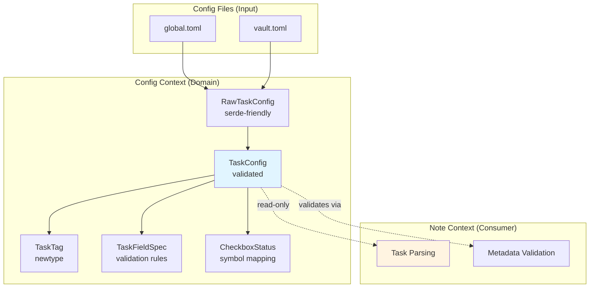
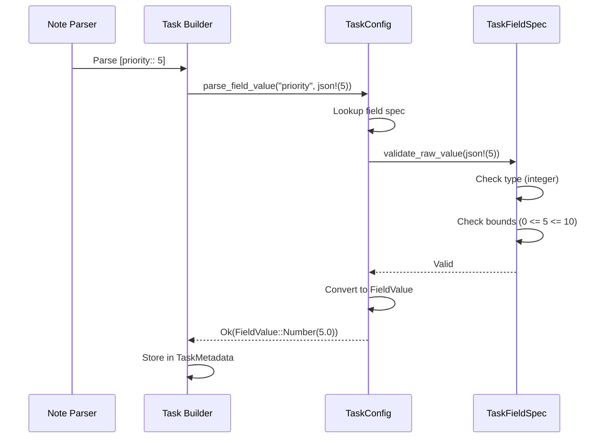

# Tech Spec: Task Configuration Schema

## 1. Problem Space (The "Why")

### 1.1 Context & Background

The Lithos task system requires user-configurable metadata schemas to support rich task management workflows. Currently, there is no formal definition of how task metadata fields, status symbols, and promotion tags are configured.

**Current Gap**: Users cannot define:
- Custom metadata fields (priority, project, due dates)
- Custom status symbols beyond `[x]`, `[ ]`, `[-]`
- Which tags trigger task promotion (`#task`, `#todo`, `#action-item`)
- Field validation rules (enum values, numeric bounds, date formats)

**Why Config Context**: Task configuration is **cross-cutting infrastructure** (like paths, logging, frontmatter config). The Note context consumes this configuration to:
- Validate inline task metadata during parsing
- Map status symbols to semantic names
- Determine which checkboxes are promoted to Task entities

**Related Decisions**:
- [ADR 001: Configuration System](../adr/001-configuration-system.md)
- [Epic 11: Query Service](../../_bmad-output/planning-artifacts/epics/epic-11-query-service-knowledge-graph-mvp-core.md)

### 1.2 Goals & Non-Goals

**Goals**:
1. Define a **user-editable TOML schema** for task metadata fields
2. Support **type-safe field validation** (string/integer/float/boolean/enum/date)
3. Enable **custom status symbols** mapped to semantic names
4. Allow **configurable task tags** for promotion rules
5. Provide **indexed field selection** for query optimization
6. **Zero breaking changes**: Default config matches existing behavior

**Non-Goals**:
- Implementing task parsing (Note context responsibility)
- Query service integration (Epic 11)
- Template rendering (Template context responsibility)
- Recurring tasks, dependencies, or time tracking

### 1.3 Constraints (The Hard Limits)

**Architectural**:
- Config context is **cross-cutting infrastructure** (no business logic)
- Validation logic stays **internal to construction** (newtype pattern)
- Config types are **sync-first** (no async validation)
- No imports from Note/Schema/Template contexts (only infrastructure)

**Compatibility**:
- Default config must match current checkbox behavior (`x/ /-` symbols)
- Invalid config files must produce **structured errors** with field names
- Config changes require vault reindexing (no hot-reload in MVP)

**Performance**:
- Config loaded once at startup (no repeated parsing)
- Field specs compiled during config construction (validation cached)
- Target: Config load + validation < 50ms for typical vaults

**Data Integrity**:
- Invalid field specs (empty enum, min > max) rejected at config load
- Unknown fields in user config trigger warnings (forward compatibility)

## 2. Guide-Level Explanation (The "What")

### 2.1 User/Dev Experience

#### User Perspective: Defining Task Schema

**Step 1: Create Vault Config**

Users create `.lithos/lithos.toml`:

```toml
[task]
enabled = true

# Task promotion tags (which tags indicate "this is a task")
task_tags = ["#task", "#todo", "#action-item"]

# Status symbol mapping
[task.status]
complete = "x"
incomplete = " "
cancelled = "-"
in_progress = ">"
waiting = "?"

# First-class temporal fields (Obsidian plugin compatibility)
[task.dates.due]
keyword = "due"
emoji = "📅"
format = "%Y-%m-%d"

[task.dates.created]
keyword = "created"
format = "%Y-%m-%d"

[task.dates.reminder]
keyword = "reminder"
emoji = "⏰"
format = "%Y-%m-%d %H:%M"

[task.dates.completed]
keyword = "completed"
emoji = "✅"
format = "%Y-%m-%d"

# Type-inferred custom fields (no explicit type= key needed)
[task.fields.priority]
keyword = "priority"
min = 0
max = 10  # Integer inferred from min/max

[task.fields.project_name]
keyword = "project"
pattern = "^[a-z_]+$"  # String inferred from pattern

[task.fields.task_type]
keyword = "type"
values = ["action_item", "reminder", "meeting", "research"]  # Enum inferred from values

[task.fields.estimate_hours]
keyword = "estimate"
min = 0.5
max = 40.0  # Float inferred from min/max

[task.fields.reviewed]
keyword = "reviewed"  # Boolean inferred (no constraints)

# Query optimization
[task.indexing]
indexed_fields = ["due_date", "priority", "project_name", "task_type"]
```

**Step 2: Config Validation**

When Lithos loads the vault:

```bash
$ lithos index --vault my-vault/

✓ Config loaded successfully
  - 4 task fields defined
  - 5 status symbols mapped
  - 3 task tags configured
  - 4 indexed fields
```

**Validation errors are caught early:**

```bash
$ lithos index --vault my-vault/

✗ Config validation failed:
  - task.fields.priority: min (0) cannot be greater than max (-1)
  - task.fields.task_type: enum values cannot be empty
  - task.status: duplicate symbol 'x' mapped to both 'complete' and 'done'
  - task.dates.due: invalid chrono format string '%Y-%m-%d-%H' (unexpected literal)
  - task.fields.project: keyword must be alphanumeric + '_-' (found: 'project.name')
```

#### Developer Perspective: Using TaskConfig

**Loading Config**

```rust
use lithos_core::config::Config;
use lithos_core::config::task::TaskConfig;

// Load and validate vault config
let config = Config::load_vault_config(vault_path)?;

// Access task config (cross-cutting infrastructure)
let task_config: &TaskConfig = &config.task;

assert_eq!(task_config.task_tags().len(), 3);
assert!(task_config.has_task_tag("#task"));
```

**Validating Task Metadata (Note Context Uses This)**

```rust
use serde_json::json;

// Note context calls this during task parsing
let priority_json = json!(5);
let field_value = task_config.parse_field_value("priority", &priority_json)?;

assert_eq!(field_value.as_number(), Some(5.0));

// Validation catches out-of-bounds
let invalid = json!(15);
let err = task_config.parse_field_value("priority", &invalid);
assert!(err.is_err()); // Error: Value 15 exceeds max 10

// Pattern validation (project field has regex)
let project_json = json!("my_project");
let field_value = task_config.parse_field_value("project", &project_json)?;
assert_eq!(field_value.as_str(), Some("my_project"));

let invalid_project = json!("My-Project"); // Capital letter breaks pattern
let err = task_config.parse_field_value("project", &invalid_project);
assert!(err.is_err()); // Error: Pattern mismatch
```

**Parsing Date Fields (First-Class Temporal Support)**

```rust
// Parse due date with inline syntax
if let Some(due_spec) = task_config.due_field() {
    let date_text = "2026-02-10";
    let parsed = task_config.parse_date_value(date_text, due_spec)?;
    assert_eq!(parsed.format("%Y-%m-%d").to_string(), "2026-02-10");
}

// Emoji syntax (Obsidian compatibility)
if let Some(due_spec) = task_config.due_field() {
    if due_spec.emoji() == Some('📅') {
        let emoji_text = "📅 2026-02-10";
        let parsed = task_config.parse_date_value(emoji_text.trim_start_matches("📅 "), due_spec)?;
        assert_eq!(parsed.format("%Y-%m-%d").to_string(), "2026-02-10");
    }
}
```

**Status Symbol Mapping**

```rust
use lithos_core::config::task::{StatusSymbol, StatusName};

let symbol = StatusSymbol('x');
let name = task_config.status().name_for_symbol(symbol);

assert_eq!(name, Some(&StatusName::new("complete")?));
```

### 2.2 Mental Model

**Three-Layer Model**:

```
┌─────────────────────────────────────────────────┐
│ User Config (TOML)                              │
│ - Defines field schema, status mapping, tags   │
│ - May be invalid until validated               │
└─────────────────────────────────────────────────┘
                    │
                    │ Raw → Domain Conversion
                    ▼
┌─────────────────────────────────────────────────┐
│ TaskConfig (Validated Domain)                   │
│ - Invariants guaranteed by construction         │
│ - Used by Note context for validation           │
│ - Cross-cutting infrastructure                  │
└─────────────────────────────────────────────────┘
                    │
                    │ Consumed by Note Context
                    ▼
┌─────────────────────────────────────────────────┐
│ Task Parsing & Validation                       │
│ - Validates inline [key:: value] metadata       │
│ - Maps status symbols to semantic names         │
│ - Checks task tags for promotion                │
└─────────────────────────────────────────────────┘
```

**Key Concepts**:

1. **TaskTag = Promotion Vocabulary**: Config defines which tags mean "this is a task"
2. **TaskFieldSpec = Validation Rules**: Config defines what metadata is allowed
3. **CheckboxStatus = Symbol Mapping**: Config maps `[x]` to semantic "complete"
4. **Validation is Private**: Newtype pattern means validation happens at construction

**Think of it like**:
- **TaskConfig** = JSON Schema for task metadata
- **TaskTag** = Allowed promotion keywords
- **CheckboxStatus** = Character encoding map (symbol ↔ meaning)

## 3. Detailed Design (The "How")

### 3.1 System Architecture



### 3.2 Data Models

#### `TaskTag` (Domain)

- **Purpose**: Validated tag that triggers task promotion (e.g., `#task`, `#todo`)
- **Backing**: `Box<str>`
- **Rules**: Must start with `#`, non-empty, ASCII alphanumeric + `_-`
- **Notes**: Allocated once during config load

```rust
pub struct TaskTag(Box<str>);

impl TaskTag {
    fn try_from(s: &str) -> Result<Self, ConfigError> {
        if !s.starts_with('#') {
            return Err(ConfigError::InvalidTaskTag("Must start with '#'"));
        }
        // Additional validation...
        Ok(TaskTag(s.into()))
    }

    pub fn as_ref(&self) -> &str {
        &self.0
    }
}
```

#### `TaskFieldKeyword` (Domain)

- **Purpose**: Validated keyword for inline task metadata (e.g., `priority`, `due`, `project`)
- **Backing**: `Box<str>`
- **Rules**: Non-empty, alphanumeric + `_-`, <= 64 chars
- **Notes**: Used in inline syntax `[keyword:: value]`

```rust
pub struct TaskFieldKeyword(Box<str>);

impl TaskFieldKeyword {
    pub fn try_from(s: &str) -> Result<Self, ConfigError> {
        if s.is_empty() || s.len() > 64 {
            return Err(ConfigError::InvalidFieldKeyword("Must be 1-64 chars"));
        }
        if !s.chars().all(|c| c.is_alphanumeric() || c == '_' || c == '-') {
            return Err(ConfigError::InvalidFieldKeyword("Only alphanumeric, _, - allowed"));
        }
        Ok(TaskFieldKeyword(s.into()))
    }

    pub fn as_ref(&self) -> &str {
        &self.0
    }
}
```

#### `StatusSymbol` (Domain)

- **Purpose**: Single-character checkbox symbol as written in markdown `[<char>]`
- **Backing**: `char`
- **Rules**: Printable ASCII, non-whitespace
- **Notes**: Copy type

```rust
pub struct StatusSymbol(char);

impl StatusSymbol {
    fn try_from(c: char) -> Result<Self, ConfigError> {
        if !c.is_ascii() || c.is_whitespace() {
            return Err(ConfigError::InvalidStatusSymbol(c));
        }
        Ok(StatusSymbol(c))
    }
}
```

#### `StatusName` (Domain)

- **Purpose**: Semantic status identifier used throughout system (e.g., "complete", "in_progress")
- **Backing**: `Box<str>`
- **Rules**: Non-empty, ASCII alphanumeric + `_`, <= 32 chars
- **Notes**: Used in queries, templates, indexing (stable across vaults)

```rust
pub struct StatusName(Box<str>);

impl StatusName {
    fn try_from(s: &str) -> Result<Self, ConfigError> {
        if s.is_empty() || s.len() > 32 {
            return Err(ConfigError::InvalidStatusName("Must be 1-32 chars"));
        }
        // Additional validation...
        Ok(StatusName(s.into()))
    }

    pub fn as_ref(&self) -> &str {
        &self.0
    }
}
```

#### `DateFieldSpec` (Domain)

- **Purpose**: Validated specification for first-class temporal fields (due, created, reminder, completed)
- **Key rules**: Valid chrono format string, optional emoji
- **Important notes**: Emoji enables Obsidian plugin compatibility (e.g., `📅 2026-02-10`)
- **Shape**:

```rust
#[derive(Debug, Clone)]
pub struct DateFieldSpec {
    keyword: TaskFieldKeyword,
    emoji: Option<char>,
    format: Box<str>,  // chrono format string
}
```

#### `TaskFieldSpec` (Domain)

- **Purpose**: Validated field specification with type constraints
- **Key rules**: Enforced at construction (min <= max, non-empty enum values, valid regex)
- **Important notes**: Contains compiled regex (cached at config load)
- **Shape**:

```rust
#[derive(Debug, Clone)]
pub enum TaskFieldSpec {
    String {
        keyword: TaskFieldKeyword,
        pattern: Option<Arc<regex::Regex>>,
    },
    Integer {
        keyword: TaskFieldKeyword,
        min: Option<i64>,
        max: Option<i64>,
    },
    Float {
        keyword: TaskFieldKeyword,
        min: Option<f64>,
        max: Option<f64>,
    },
    Boolean {
        keyword: TaskFieldKeyword,
    },
    Enum {
        keyword: TaskFieldKeyword,
        values: Vec<Box<str>>,
    },
    DateTime {
        keyword: TaskFieldKeyword,
        format: Box<str>,
        emoji: Option<char>,
    },
}
```

#### `CheckboxStatus` (Domain)

- **Purpose**: Bidirectional mapping between status symbols and semantic names
- **Key rules**: No duplicate symbols or names; at least one mapping
- **Shape**:

```rust
#[derive(Debug, Clone)]
pub struct CheckboxStatus {
    by_name: HashMap<StatusName, StatusSymbol>,
    by_symbol: HashMap<StatusSymbol, StatusName>,
}

impl CheckboxStatus {
    pub fn symbol_for_name(&self, name: &StatusName) -> Option<StatusSymbol> {
        self.by_name.get(name).copied()
    }

    pub fn name_for_symbol(&self, symbol: StatusSymbol) -> Option<&StatusName> {
        self.by_symbol.get(&symbol)
    }
}
```

#### `TaskConfig` (Domain, Aggregate)

- **Purpose**: Validated task configuration aggregate
- **Key rules**: All fields validated at construction; no public mutation
- **Important notes**: Cross-cutting infrastructure consumed by Note context
- **Shape**:

```rust
#[derive(Debug, Clone)]
pub struct TaskConfig {
    enabled: bool,
    task_tags: Vec<TaskTag>,
    status: CheckboxStatus,

    // First-class temporal fields (Obsidian compatibility)
    due_field: Option<DateFieldSpec>,
    created_field: Option<DateFieldSpec>,
    reminder_field: Option<DateFieldSpec>,
    completed_field: Option<DateFieldSpec>,

    // Custom metadata fields (type-inferred)
    fields: HashMap<Box<str>, TaskFieldSpec>,
    indexed_fields: Vec<Box<str>>,
}
```

#### `RawTaskConfig` (Raw/Input)

- **Purpose**: Serde-friendly input shape before validation
- **Notes**: May be invalid; compiled into `TaskConfig`

```rust
#[derive(Debug, Clone, Deserialize)]
pub struct RawTaskConfig {
    pub enabled: Option<bool>,
    pub task_tags: Option<Vec<String>>,
    pub status: Option<HashMap<String, char>>,
    pub dates: Option<RawTaskDates>,
    pub fields: Option<HashMap<String, RawTaskFieldSpec>>,
    pub indexing: Option<RawIndexingConfig>,
}

#[derive(Debug, Clone, Deserialize)]
pub struct RawTaskDates {
    pub due: Option<RawDateFieldSpec>,
    pub created: Option<RawDateFieldSpec>,
    pub reminder: Option<RawDateFieldSpec>,
    pub completed: Option<RawDateFieldSpec>,
}

#[derive(Debug, Clone, Deserialize)]
pub struct RawDateFieldSpec {
    pub keyword: String,
    pub emoji: Option<char>,
    pub format: String,
}

#[derive(Debug, Clone, Deserialize)]
#[serde(untagged)]  // Type inferred from structure
pub enum RawTaskFieldSpec {
    // Enum: has `values` array
    Enum {
        keyword: String,
        values: Vec<String>,
    },
    // Integer: has integer min/max
    Integer {
        keyword: String,
        #[serde(default)]
        min: Option<i64>,
        #[serde(default)]
        max: Option<i64>,
    },
    // Float: has floating-point min/max
    Float {
        keyword: String,
        #[serde(default)]
        min: Option<f64>,
        #[serde(default)]
        max: Option<f64>,
    },
    // DateTime: has format string and optional emoji
    DateTime {
        keyword: String,
        format: String,
        #[serde(default)]
        emoji: Option<char>,
    },
    // String: has regex pattern
    String {
        keyword: String,
        #[serde(default)]
        pattern: Option<String>,
    },
    // Boolean: no constraints (inferred if only keyword present)
    Boolean {
        keyword: String,
    },
}
```

### 3.3 Component & Interface Specifications

#### Component: `TaskConfig`

- **Responsibility**: Validated task configuration aggregate; provides field validation and status mapping for Note context
- **Public Interface**:
  - `TaskConfig::from_raw(raw: RawTaskConfig) -> Result<Self, ConfigError>`
    - _Behavior_: Validates raw config, compiles regex patterns, builds bidirectional status map, constructs first-class date fields
    - _Errors_: Invalid field specs, duplicate mappings, empty required fields, invalid date format strings
  - `task_tags(&self) -> &[TaskTag]`
    - _Behavior_: Returns configured task tags
  - `has_task_tag(&self, text: &str) -> bool`
    - _Behavior_: Checks if text contains any configured task tag
  - `status(&self) -> &CheckboxStatus`
    - _Behavior_: Returns status symbol ↔ name mapping
  - `due_field(&self) -> Option<&DateFieldSpec>`
    - _Behavior_: Returns configured due date field spec (with keyword, emoji, format)
  - `created_field(&self) -> Option<&DateFieldSpec>`
    - _Behavior_: Returns configured created date field spec
  - `reminder_field(&self) -> Option<&DateFieldSpec>`
    - _Behavior_: Returns configured reminder date field spec
  - `completed_field(&self) -> Option<&DateFieldSpec>`
    - _Behavior_: Returns configured completed date field spec
  - `parse_field_value(&self, field_name: &str, json: &serde_json::Value) -> Result<note::value::FieldValue, ConfigError>`
    - _Behavior_: Validates JSON value against field spec and converts to note-owned `FieldValue`
    - _Errors_: Unknown field, type mismatch, out of bounds, pattern mismatch
  - `parse_date_value(&self, text: &str, spec: &DateFieldSpec) -> Result<chrono::NaiveDateTime, ConfigError>`
    - _Behavior_: Parses date text using spec's format string; supports both inline `[due:: 2026-02-10]` and emoji `📅 2026-02-10` formats
    - _Errors_: Parse failure, invalid format
  - `indexed_fields(&self) -> &[Box<str>]`
    - _Behavior_: Returns fields marked for indexing
- **State/Invariants**:
  - All regex patterns successfully compiled
  - All date format strings validated with chrono
  - Status mapping is bijective (1:1)
  - Indexed fields reference valid field names
  - Min <= max for numeric fields
  - Enum values non-empty
  - Date field keywords unique (no collision with custom fields)

#### Component: `DateFieldSpec`

- **Responsibility**: Validated specification for first-class temporal fields
- **Public Interface** (internal to config context):
  - `DateFieldSpec::from_raw(raw: RawDateFieldSpec) -> Result<Self, ConfigError>`
    - _Behavior_: Validates keyword, emoji, and chrono format string
    - _Errors_: Invalid keyword, invalid format string, emoji not single char
  - `keyword(&self) -> &TaskFieldKeyword`
    - _Behavior_: Returns validated keyword
  - `emoji(&self) -> Option<char>`
    - _Behavior_: Returns optional emoji for Obsidian compatibility
  - `format(&self) -> &str`
    - _Behavior_: Returns chrono format string
- **State/Invariants**:
  - Keyword is valid (non-empty, alphanumeric + `_-`, <= 64 chars)
  - Format string is valid chrono format (validated at construction)
  - Emoji (if present) is single char

#### Component: `TaskFieldSpec`

- **Responsibility**: Validated field specification with compiled constraints
- **Public Interface** (internal to config context):
  - `validate_raw_value(&self, value: &serde_json::Value) -> Result<(), ConfigError>`
    - _Behavior_: Validates JSON value against type and constraints (private helper)
    - _Errors_: Type mismatch, out of bounds, pattern mismatch, invalid enum value
- **State/Invariants**:
  - Keyword is valid (non-empty, alphanumeric + `_-`, <= 64 chars)
  - Regex pattern (if present) is compiled
  - Numeric bounds satisfy min <= max
  - Enum values are non-empty
  - DateTime format string is valid chrono format

#### Component: `CheckboxStatus`

- **Responsibility**: Bidirectional mapping between symbols and semantic names
- **Public Interface**:
  - `CheckboxStatus::from_raw(raw: HashMap<String, char>) -> Result<Self, ConfigError>`
    - _Behavior_: Builds bidirectional map, validates uniqueness
    - _Errors_: Duplicate symbols, duplicate names, invalid symbol/name format
  - `symbol_for_name(&self, name: &StatusName) -> Option<StatusSymbol>`
    - _Behavior_: Lookup symbol by semantic name
  - `name_for_symbol(&self, symbol: StatusSymbol) -> Option<&StatusName>`
    - _Behavior_: Lookup semantic name by symbol
- **State/Invariants**:
  - Bijective mapping (no duplicates)
  - At least one mapping exists

### 3.4 Integration & Data Flow

#### Config Loading Flow

```mermaid
sequenceDiagram
    participant User as User Config File
    participant Serde as Serde Deserializer
    participant Raw as RawTaskConfig
    participant Domain as TaskConfig
    participant Note as Note Context

    User->>Serde: Read lithos.toml
    Serde->>Raw: Deserialize
    Raw->>Raw: May be invalid
    Raw->>Domain: TaskConfig::from_raw()
    Domain->>Domain: Validate fields
    Domain->>Domain: Compile regex
    Domain->>Domain: Build status map
    alt Validation Success
        Domain->>Note: Provide validated config
    else Validation Failure
        Domain-->>User: ConfigError with details
    end
```

#### Field Validation Flow (Note Context → Config Context)



#### Dependencies

- **Serde**: TOML/YAML deserialization (`serde`, `toml`, `serde_yaml`)
- **Regex**: Pattern validation (`regex` crate, compiled at config load)
- **Chrono**: Date format validation (`chrono::format::strftime`)
- **Note Context**: Exports `FieldValue` type (config converts to this)

### 3.5 Core Logic & Algorithms

#### Algorithm: Field Value Validation

```rust
impl TaskFieldSpec {
    fn validate_raw_value(&self, value: &serde_json::Value) -> Result<(), ConfigError> {
        match self {
            TaskFieldSpec::Integer { keyword, min, max } => {
                let n = value.as_i64()
                    .ok_or(ConfigError::TypeMismatch {
                        field: keyword.as_ref().into(),
                        expected: "integer"
                    })?;

                if let Some(min) = min {
                    if n < *min {
                        return Err(ConfigError::OutOfBounds {
                            field: keyword.as_ref().into(),
                            value: n,
                            min: Some(*min),
                            max: *max,
                        });
                    }
                }

                if let Some(max) = max {
                    if n > *max {
                        return Err(ConfigError::OutOfBounds {
                            field: keyword.as_ref().into(),
                            value: n,
                            min: *min,
                            max: Some(*max),
                        });
                    }
                }

                Ok(())
            }

            TaskFieldSpec::String { keyword, pattern } => {
                let s = value.as_str()
                    .ok_or(ConfigError::TypeMismatch {
                        field: keyword.as_ref().into(),
                        expected: "string",
                    })?;

                if let Some(re) = pattern {
                    if !re.is_match(s) {
                        return Err(ConfigError::PatternMismatch {
                            field: keyword.as_ref().into(),
                            value: s.to_owned(),
                            pattern: re.as_str().to_owned(),
                        });
                    }
                }

                Ok(())
            }

            TaskFieldSpec::Enum { keyword, values } => {
                let s = value.as_str()
                    .ok_or(ConfigError::TypeMismatch {
                        field: keyword.as_ref().into(),
                        expected: "string (enum)",
                    })?;

                if !values.iter().any(|v| v.as_ref() == s) {
                    return Err(ConfigError::InvalidEnumValue {
                        field: keyword.as_ref().into(),
                        value: s.to_owned(),
                        allowed: values.iter().map(|v| v.to_string()).collect(),
                    });
                }

                Ok(())
            }

            TaskFieldSpec::DateTime { keyword, format, .. } => {
                let s = value.as_str()
                    .ok_or(ConfigError::TypeMismatch {
                        field: keyword.as_ref().into(),
                        expected: "string (datetime)",
                    })?;

                // Validate against chrono format
                chrono::NaiveDateTime::parse_from_str(s, format)
                    .or_else(|_| {
                        // Try date-only parse
                        chrono::NaiveDate::parse_from_str(s, format)
                            .map(|d| d.and_hms_opt(0, 0, 0).unwrap())
                    })
                    .map_err(|e| ConfigError::DateParseError {
                        field: keyword.as_ref().into(),
                        value: s.to_owned(),
                        format: format.clone(),
                        error: e.to_string(),
                    })?;

                Ok(())
            }

            // ... other variants
        }
    }
}
```

#### Algorithm: Status Mapping Construction

```rust
impl CheckboxStatus {
    fn from_raw(raw: HashMap<String, char>) -> Result<Self, ConfigError> {
        let mut by_name = HashMap::new();
        let mut by_symbol = HashMap::new();

        for (name_str, symbol_char) in raw {
            let name = StatusName::try_from(name_str.as_str())?;
            let symbol = StatusSymbol::try_from(symbol_char)?;

            // Check for duplicate names
            if by_name.contains_key(&name) {
                return Err(ConfigError::DuplicateStatusName(name_str));
            }

            // Check for duplicate symbols
            if by_symbol.contains_key(&symbol) {
                return Err(ConfigError::DuplicateStatusSymbol(symbol_char));
            }

            by_name.insert(name.clone(), symbol);
            by_symbol.insert(symbol, name);
        }

        // Require at least one mapping
        if by_name.is_empty() {
            return Err(ConfigError::EmptyStatusMapping);
        }

        Ok(CheckboxStatus { by_name, by_symbol })
    }
}
```

#### Algorithm: Default Config Generation

```rust
impl Default for TaskConfig {
    fn default() -> Self {
        let task_tags = vec![
            TaskTag::try_from("#task").unwrap(),
        ];

        let status = {
            let mut map = HashMap::new();
            map.insert("complete".to_owned(), 'x');
            map.insert("incomplete".to_owned(), ' ');
            map.insert("cancelled".to_owned(), '-');
            CheckboxStatus::from_raw(map).unwrap()
        };

        TaskConfig {
            enabled: false,
            task_tags,
            status,
            fields: HashMap::new(),
            indexed_fields: vec![],
        }
    }
}
```

## 4. Alternatives & Decisions (The "Divergence")

### 4.1 Tactical Decisions

#### Decision: TaskConfig in Config Context (Not Note Context)

- **Context**: Task configuration could live in note context (where it's consumed)
- **Choice**: Place in config context as cross-cutting infrastructure
- **Alternatives Considered**:
  - _Note context_: Config owned by note. **Rejected** - breaks config layering (global vs vault)
  - _Separate task context_: Dedicated bounded context for tasks. **Rejected** - task is note semantics, config is vocabulary
- **Rationale**: Config is cross-cutting infrastructure (like paths, logging). Note context imports config (allowed), but config never imports note (enforced).

#### Decision: Validation is Private (Newtype Pattern)

- **Context**: Should validation be exposed as public API?
- **Choice**: Validation happens at construction; no public `validate()` methods
- **Alternatives Considered**:
  - _Public validation_: Expose `TaskFieldSpec::validate()`. **Rejected** - violates type-driven design (makes invalid states representable)
  - _Builder pattern_: `TaskConfigBuilder` with staged validation. **Rejected** - unnecessary complexity for config
- **Rationale**: Newtype pattern means construction enforces invariants. Public API operates on validated types only.

#### Decision: Regex Compiled at Config Load (Not Lazy)

- **Context**: Regex compilation is expensive; when to compile?
- **Choice**: Compile all regex patterns during `TaskConfig::from_raw()` (eager)
- **Alternatives Considered**:
  - _Lazy compilation_: Compile on first use. **Rejected** - defers errors, adds runtime overhead
  - _Pre-compiled crate_: Generate Rust code from config. **Rejected** - overkill for user config
- **Rationale**: Config loaded once at startup; eager compilation catches invalid patterns early.

#### Decision: StatusSymbol is char (Not String)

- **Context**: Checkbox symbols are single characters in markdown `[<char>]`
- **Choice**: `StatusSymbol(char)` newtype
- **Alternatives Considered**:
  - _String_: Allow multi-char symbols like `[done]`. **Rejected** - non-standard markdown
  - _Enum_: Hardcoded `StatusSymbol::Complete`. **Rejected** - not user-configurable
- **Rationale**: Aligns with markdown checkbox syntax; keeps domain model lean.

#### Decision: Indexed Fields as Vec (Not Set)

- **Context**: Should indexed fields preserve order?
- **Choice**: `Vec<Box<str>>` (ordered)
- **Alternatives Considered**:
  - _HashSet_: Unordered unique fields. **Rejected** - order matters for query planning
  - _BTreeSet_: Sorted unique fields. **Rejected** - user-specified order is meaningful
- **Rationale**: User controls index priority (first = most important for queries).

#### Decision: Type Inference via #[serde(untagged)] (Not Explicit type= Key)

- **Context**: Should users explicitly specify field types in config?
- **Choice**: Infer type from structure using `#[serde(untagged)]` (e.g., `min`/`max` present → Integer)
- **Alternatives Considered**:
  - _Explicit type key_: `type = "integer"` required. **Rejected** - verbose, redundant (structure implies type)
  - _Separate tables per type_: `[task.fields.integer.priority]`. **Rejected** - excessive nesting, breaks ergonomics
  - _Auto-detect from values_: Parse example values to guess type. **Rejected** - fragile, error-prone
- **Rationale**:
  - **User experience**: Cleaner config (no redundant `type =` when constraints already signal intent)
  - **Serde support**: Untagged enums naturally match structure-based discrimination
  - **Validation**: Ambiguous cases caught at config load (e.g., `{keyword = "foo"}` → defaults to Boolean)
  - **Trade-off**: Order matters in untagged enum variants (most specific first: Enum, Integer, Float, DateTime, String, Boolean)

#### Decision: First-Class Date Fields with Emoji Support (Not Generic Custom Fields)

- **Context**: Temporal fields (due, created, reminder, completed) are critical for task management; how to model?
- **Choice**: Dedicated `task.dates.*` config section with `DateFieldSpec` domain type
- **Alternatives Considered**:
  - _Generic DateTime fields_: Treat like any custom field. **Rejected** - loses semantic meaning (queries can't optimize for "due dates")
  - _Hardcoded date fields_: No user configuration. **Rejected** - breaks Obsidian plugin compatibility (users need custom keywords/emojis)
  - _Separate temporal context_: Dedicated bounded context for dates. **Rejected** - overengineering (dates are task vocabulary)
- **Rationale**:
  - **Obsidian compatibility**: Users migrating from Dataview/Tasks/Reminder plugins need emoji support (`📅 2026-02-10`)
  - **Query optimization**: First-class fields enable specialized indexing (temporal range queries)
  - **Validation**: Format strings validated at config load (catches invalid chrono patterns early)
  - **Flexibility**: Users can disable date fields (all `Option<DateFieldSpec>`)

#### Decision: Unified DateTime Type (Not Separate Date/Time/DateTime)

- **Context**: Should date-only, time-only, and datetime be separate types?
- **Choice**: Single `DateTime` variant with format string determining precision
- **Alternatives Considered**:
  - _Separate variants_: `Date`, `Time`, `DateTime` enum variants. **Rejected** - format string already encodes precision
  - _Chrono types directly_: Store `NaiveDate` vs `NaiveDateTime`. **Rejected** - config is TOML strings (parsing happens in Note context)
  - _ISO8601 only_: Hardcode date formats. **Rejected** - breaks user flexibility (some prefer `%m/%d/%Y`)
- **Rationale**:
  - **Chrono alignment**: `chrono::NaiveDateTime::parse_from_str` handles both date-only and datetime formats
  - **Simplicity**: One code path for validation/parsing (format string = source of truth)
  - **User control**: Format string lets users choose precision (`"%Y-%m-%d"` = date-only, `"%Y-%m-%d %H:%M"` = datetime)

#### Decision: TaskFieldKeyword Newtype (Not Bare Box<str>)

- **Context**: Field keywords appear throughout system (configs, queries, templates); should they be validated?
- **Choice**: Newtype `TaskFieldKeyword(Box<str>)` with construction-time validation
- **Alternatives Considered**:
  - _Bare Box<str>_: No validation. **Rejected** - allows invalid keywords (empty, too long, special chars)
  - _Validate at use site_: Check validity every time keyword is used. **Rejected** - duplicates validation logic, runtime overhead
  - _Compile-time validation_: Proc macro. **Rejected** - overkill for user config (not code)
- **Rationale**:
  - **Type safety**: Invalid keywords rejected at config load (not during task parsing)
  - **Performance**: Validation happens once (construction), no runtime checks
  - **Consistency**: Same pattern as `TaskTag`, `StatusName`, `StatusSymbol` (validated newtypes)
  - **Bounds**: 64-char limit prevents abuse (e.g., malicious 10KB keywords)

## 5. Operational Readiness (The "Reality Check")

### 5.1 Observability

**Metrics** (via `tracing`):

```rust
#[tracing::instrument(level = "debug")]
fn load_task_config(raw: RawTaskConfig) -> Result<TaskConfig, ConfigError> {
    let start = Instant::now();
    let result = TaskConfig::from_raw(raw);

    if let Ok(ref config) = result {
        tracing::info!(
            fields_count = config.fields.len(),
            indexed_count = config.indexed_fields.len(),
            task_tags_count = config.task_tags.len(),
            status_mappings = config.status.by_name.len(),
            duration_ms = start.elapsed().as_millis(),
            "Task config loaded"
        );
    }

    result
}
```

**Logs**:
- `INFO`: Config loaded successfully (field counts, duration)
- `WARN`: Unknown fields in user config (forward compatibility)
- `ERROR`: Validation failures (specific field + reason)

**Health Checks**:
- Config validation success rate (should be 100% after initial setup)
- Regex compilation time (detect expensive patterns)

### 5.2 Migration Strategy

**Phase 1: Add TaskConfig Type** (Non-Breaking)
- Add `config/task.rs` with types
- Add `task: Option<TaskConfig>` to `Config` aggregate
- Default to `TaskConfig::default()` if missing

**Phase 2: Update Config Loaders**
- Deserialize `[task]` section from TOML
- Validate and construct `TaskConfig`
- Emit warnings for unknown fields

**Phase 3: Note Context Integration**
- Note context imports `TaskConfig`
- Use for task parsing (see 006b spec)

**Backward Compatibility**:
- Old vaults without `[task]` section use defaults
- Old checkboxes (`[x]`, `[ ]`, `[-]`) continue to work

### 5.3 Security & Privacy

**Regex DoS Prevention**:
- Limit pattern length (< 256 chars)
- Timeout regex compilation (5 seconds)
- Log expensive patterns for review

**No PII in Config**:
- Field names, enum values are vault-specific (not user data)
- Status symbols are single characters (no PII)

## 6. Pre-Mortem (The "Inversion")

- **Risk**: User defines `task_tags = []` (empty), all checkbox promotion breaks
  - _Mitigation_: Require at least one tag in default config; warn if empty

- **Risk**: Regex pattern is malicious (catastrophic backtracking)
  - _Mitigation_: Limit pattern length, timeout compilation, document safe patterns

- **Risk**: Duplicate field names in config (case-insensitive)
  - _Mitigation_: Case-sensitive field names; document convention (snake_case)

- **Risk**: Status symbol conflicts with markdown syntax (`[>]` is quote)
  - _Mitigation_: Document safe symbols; validate non-whitespace printable ASCII

- **Risk**: Config changes require full reindex (slow for large vaults)
  - _Mitigation_: Document in clean-slate protocol; defer hot-reload to future

## 7. Critique & Refinement Log

| Date       | Critique / Issue                                      | Resolution                                                                         |
|:-----------|:------------------------------------------------------|:-----------------------------------------------------------------------------------|
| 2026-02-08 | "Should TaskConfig own promotion logic?"              | No - promotion logic in Note context; config provides tags                         |
| 2026-02-08 | "Should validation be public API?"                    | No - newtype pattern means validation at construction only                         |
| 2026-02-08 | "How does Note context get FieldValue?"               | Config converts serde_json::Value → note::value::FieldValue                        |
| 2026-02-08 | "What if user config has typos in field names?"       | Unknown fields trigger warnings; indexed_fields validated                          |
| 2026-02-08 | "Type inference: Remove explicit `type=` key"         | Use `#[serde(untagged)]` - structure implies type (min/max → Integer)              |
| 2026-02-08 | "First-class date fields for Obsidian compatibility"  | Add `task.dates.*` section with emoji support, dedicated `DateFieldSpec` type      |
| 2026-02-08 | "TaskFieldKeyword newtype for type safety"            | Add validated newtype: alphanumeric + `_-`, non-empty, <= 64 chars                 |
| 2026-02-08 | "Unified DateTime type vs separate Date/Time/DateTime"| Single `DateTime` variant - format string determines precision (aligns with chrono)|

## 8. References

- [Rust API Guidelines: Type Safety](https://rust-lang.github.io/api-guidelines/type-safety.html)
- [Serde: Enum Representations](https://serde.rs/enum-representations.html)
- [Regex Crate Documentation](https://docs.rs/regex/latest/regex/)
- [TOML Specification](https://toml.io/en/)
- [ADR 001: Configuration System](../adr/001-configuration-system.md)
