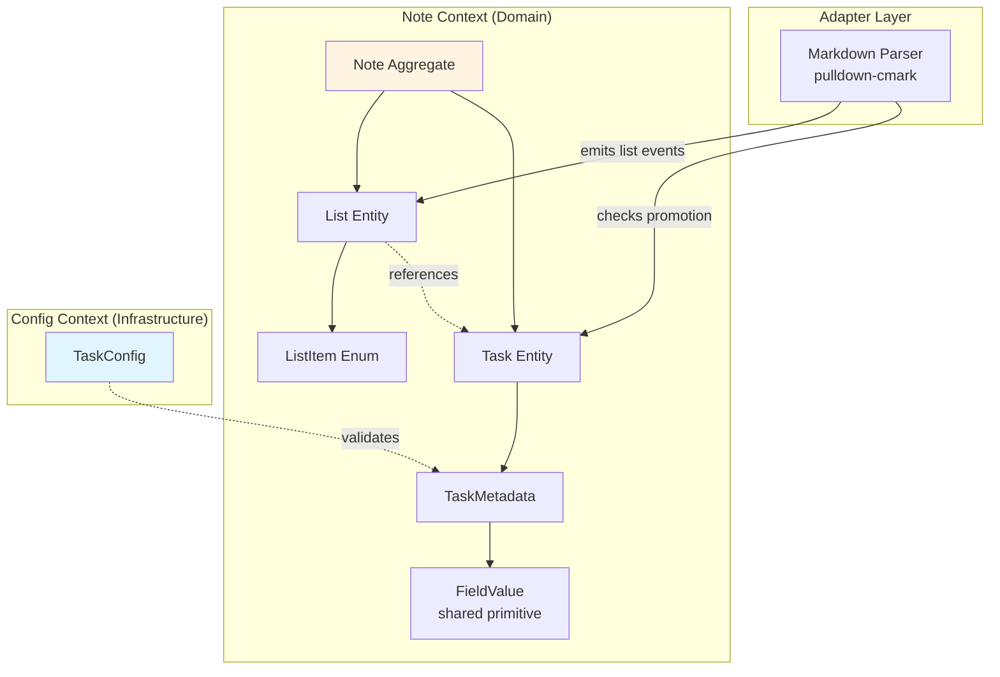
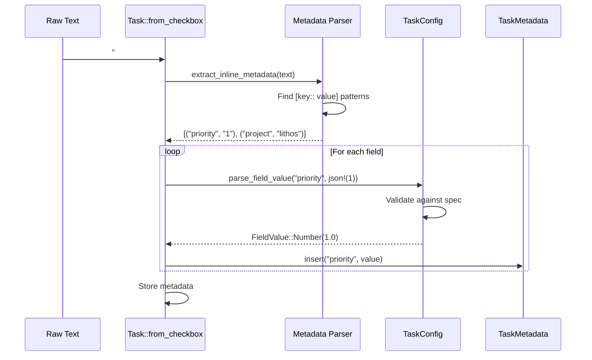

# Tech Spec: Note List and Task Entities

## 1. Problem Space (The "Why")

### 1.1 Context & Background

The Note bounded context currently lacks complete representation of markdown list structures and rich task entities. This creates an impedance mismatch between what the markdown parser (pulldown-cmark) provides and what the domain can model.

**Current Gaps**:
- No `List` entity (ordered lists, unordered lists, task lists not modeled structurally)
- Task entities are too simple (only checkbox status, no metadata)
- No distinction between "checkbox item" (structure) and "task" (semantics)
- No support for inline task metadata (`[priority:: 1]`)

**Architectural Context**:
- pulldown-cmark parses ALL list types (ordered/unordered/checkbox)
- Note context is responsible for note content semantics
- TaskConfig (from config context) provides validation rules

**Why Now**:
- Epic 11 (Query Service) requires rich task metadata for queries
- Epic 12 (Templates) needs task access for template rendering
- Current checkbox-only model cannot support task management workflows

**Related Decisions**:
- [ADR 008: Markdown Parsing](../adr/008-markdown-parsing.md)
- [006a: Task Configuration Schema](./006a-config-task-schema.md)
- [Epic 11: Query Service](../../_bmad-output/planning-artifacts/epics/epic-11-query-service-knowledge-graph-mvp-core.md)

### 1.2 Goals & Non-Goals

**Goals**:
1. Model **all markdown list types** (ordered, unordered, checkbox)
2. Distinguish **List (structure)** from **Task (semantics)**
3. Support **inline task metadata** validated against TaskConfig
4. Enable **task promotion** based on configured tags
5. Preserve **source positions** for all list items (stable within file)
6. Support **both structural queries** (all lists) and **semantic queries** (tasks only)

**Non-Goals**:
- Task CQRS ports (defer to separate CQRS spec)
- Nested task hierarchies (parent-child relationships)
- Task dependencies or recurring tasks
- Template rendering (Template context responsibility)
- Query service implementation (Epic 11)

### 1.3 Constraints (The Hard Limits)

**Architectural**:
- Note context is **sync-first** (no async domain logic)
- **No imports from Schema/Template contexts** (only infrastructure + config)
- Domain types **must not store parser types** (pulldown-cmark is adapter layer)
- Task IDs must be **UUID v7** (time-ordered, stable identity)

**Performance**:
- Parse **1000 tasks in <100ms** (inline with Epic 10 indexing goals)
- Use **`&str` slices during parsing** (no eager allocation)
- **`FieldValue` uses `String`** (simplicity over premature optimization)

**Zero-Copy Constraints**:
- Source positions are byte offsets (stable, zero-copy)
- Metadata parsing uses borrowed slices when possible
- Validation against TaskConfig happens during construction

**Data Integrity**:
- Invalid metadata → parse error (fail-fast)
- Unconfigured fields → stored as `FieldValue::String` (forward compatibility)
- List items without promotion → List only (no Task entity)

## 2. Guide-Level Explanation (The "What")

### 2.1 User/Dev Experience

#### Developer Perspective: Parsing Lists and Tasks

**Creating List Entities**

```rust
use lithos_core::note::list::{List, ListItem, ListType};
use lithos_core::config::task::{StatusSymbol, TaskConfig};

// Parser creates List entities for all markdown lists
let list = List::new(ListType::Unordered);

// Add plain list item
list.add_item(ListItem::Plain {
    text: "Buy milk".into(),
    position: 42,
});

// Add checkbox item (may be promoted to Task later)
list.add_item(ListItem::Checkbox {
    text: "#task Review PR [priority:: 1]".into(),
    status: StatusSymbol(' '),
    position: 78,
    task_id: None, // Set if promoted
});
```

**Promoting Checkboxes to Tasks**

```rust
use lithos_core::note::task::Task;

// Check if checkbox should be promoted
let checkbox_text = "#task Review PR [priority:: 1]";
let should_promote = Task::should_promote(checkbox_text, &task_config);

assert!(should_promote); // Has #task tag

// Create promoted Task
let task = Task::from_checkbox(
    checkbox_text,
    StatusSymbol(' '),
    78, // source position
    &task_config,
)?;

// Access task properties
assert_eq!(task.text(), "Review PR"); // Clean text (no tags/metadata)
assert_eq!(task.status().as_ref(), "incomplete");
assert_eq!(task.metadata().get_number("priority"), Some(1.0));
```

**Querying Lists vs Tasks**

```rust
// Structural query: all lists (regardless of promotion)
for list in note.lists() {
    println!("List type: {:?}", list.list_type());
    for item in list.items() {
        match item {
            ListItem::Plain { text, .. } => println!("- {}", text),
            ListItem::Checkbox { text, status, task_id, .. } => {
                let promoted = if task_id.is_some() { "(task)" } else { "" };
                println!("- [{}] {} {}", status.as_char(), text, promoted);
            }
        }
    }
}

// Semantic query: tasks only
for task in note.tasks() {
    println!("{}: {}", task.id(), task.text());
    if let Some(priority) = task.metadata().get_number("priority") {
        println!("  Priority: {}", priority);
    }
}
```

#### User Perspective: Writing Tasks with Metadata

**In Markdown File** (`notes/my-tasks.md`):

```markdown
# My Tasks

## Work Tasks

- [ ] #task Review pull request [priority:: 1] [project:: lithos]
- [x] #task Update documentation [priority:: 2] [project:: docs]
- [ ] #action-item Fix bug in parser [priority:: 3]

## Simple Checklist (not promoted)

- [ ] Buy groceries
- [x] Water plants
- [ ] Call mom

## Ordered List (not tasks)

1. First step
2. Second step
3. Third step
```

**Parsing Result**:

- **3 List entities** (Work Tasks checkbox list, Simple Checklist, Ordered list)
- **3 Task entities** (promoted from checkboxes with task tags)
- **3 Checkbox ListItems** in Simple Checklist (NOT promoted - no task tags)

### 2.2 Mental Model

**Two-Layer Model**:

```
┌──────────────────────────────────────────────┐
│ Structural Layer (Lists)                     │
│ - All markdown lists (ordered/unordered)     │
│ - All list items (plain/checkbox)            │
│ - Preserves source positions                 │
│ - Stored in: Note::lists                     │
└──────────────────────────────────────────────┘
                    │
                    │ Promotion (config-driven)
                    ▼
┌──────────────────────────────────────────────┐
│ Semantic Layer (Tasks)                       │
│ - Promoted checkboxes only                   │
│ - Rich metadata (config-validated)           │
│ - Queryable, indexed                         │
│ - Stored in: Note::tasks                     │
└──────────────────────────────────────────────┘
```

**Key Concepts**:

1. **List = Structure**: What markdown wrote (ordered/unordered/checkbox syntax)
2. **Task = Semantics**: What the user meant (promoted checkbox with task tag)
3. **FieldValue = Runtime Metadata**: Note-owned value primitive (shared by frontmatter + tasks)
4. **Promotion = Tag-Based**: Checkbox with task tag → Task entity

**Think of it like**:
- **List** = HTML `<ul>` or `<ol>` (document structure)
- **Task** = Application-level TODO item (business semantics)
- **TaskMetadata** = Key-value store validated by TaskConfig

## 3. Detailed Design (The "How")

### 3.1 System Architecture



### 3.2 Data Models

#### `FieldValue` (Domain, Shared Primitive)

- **Purpose**: Runtime representation of note metadata values (shared by frontmatter and task metadata)
- **Key rules**: No validation (stores parsed values as-is)
- **Important notes**: Allocated once during parsing; prefer `String` over `Box<str>` for simplicity
- **Shape**:

```rust
// note/value.rs

#[derive(Debug, Clone, PartialEq)]
pub enum FieldValue {
    String(String),
    Number(f64),
    Boolean(bool),
    Date(chrono::DateTime<chrono::Utc>),
    Array(Vec<FieldValue>),
    Object(HashMap<String, FieldValue>),
}

impl FieldValue {
    pub fn from_json(value: &serde_json::Value) -> Self {
        match value {
            serde_json::Value::String(s) => FieldValue::String(s.clone()),
            serde_json::Value::Number(n) => FieldValue::Number(n.as_f64().unwrap_or(0.0)),
            serde_json::Value::Bool(b) => FieldValue::Boolean(*b),
            serde_json::Value::Array(arr) => {
                FieldValue::Array(arr.iter().map(Self::from_json).collect())
            }
            serde_json::Value::Object(obj) => {
                FieldValue::Object(
                    obj.iter()
                        .map(|(k, v)| (k.clone(), Self::from_json(v)))
                        .collect()
                )
            }
            serde_json::Value::Null => FieldValue::String(String::new()),
        }
    }

    pub fn as_string(&self) -> Option<&str> {
        match self {
            FieldValue::String(s) => Some(s),
            _ => None,
        }
    }

    pub fn as_number(&self) -> Option<f64> {
        match self {
            FieldValue::Number(n) => Some(*n),
            _ => None,
        }
    }

    pub fn as_boolean(&self) -> Option<bool> {
        match self {
            FieldValue::Boolean(b) => Some(*b),
            _ => None,
        }
    }

    pub fn as_date(&self) -> Option<chrono::DateTime<chrono::Utc>> {
        match self {
            FieldValue::Date(d) => Some(*d),
            _ => None,
        }
    }
}
```

#### Small Types (Newtypes/IDs)

| Signature | Purpose | Layer | Rules | Notes |
|-----------|---------|-------|-------|-------|
| `TaskId(Uuid)` | Uniquely identifies a task | Domain | UUID v7 (time-ordered) | Stable across file renames |
| `ListType::Ordered { start: u64 }` | Numbered list starting at N | Domain | start >= 1 | Preserves markdown numbering |
| `ListType::Unordered` | Bullet list | Domain | None | -, *, + markers |

#### `ListItem` (Domain)

- **Purpose**: Single item in a markdown list (plain or checkbox)
- **Key rules**: Position is source byte offset (stable within file)
- **Shape**:

```rust
// note/list.rs

#[derive(Debug, Clone, PartialEq)]
#[non_exhaustive]
pub enum ListItem {
    Plain {
        text: String,
        position: usize,
    },
    Checkbox {
        text: String,
        status: config::task::StatusSymbol,
        position: usize,
        /// Set if this checkbox was promoted to Task
        task_id: Option<TaskId>,
    },
}

impl ListItem {
    pub fn position(&self) -> usize {
        match self {
            ListItem::Plain { position, .. } => *position,
            ListItem::Checkbox { position, .. } => *position,
        }
    }

    pub fn text(&self) -> &str {
        match self {
            ListItem::Plain { text, .. } => text,
            ListItem::Checkbox { text, .. } => text,
        }
    }
}
```

#### `List` (Domain)

- **Purpose**: Markdown list (ordered, unordered, or checkbox)
- **Key rules**: Items stored in source order; depth is nesting level (0 = top-level)
- **Important notes**: No parent-child relationships in MVP (flat structure)
- **Shape**:

```rust
// note/list.rs

#[derive(Debug, Clone, PartialEq)]
pub struct List {
    list_type: ListType,
    items: Vec<ListItem>,
    depth: u8,
}

impl List {
    pub fn new(list_type: ListType) -> Self {
        List {
            list_type,
            items: Vec::new(),
            depth: 0,
        }
    }

    pub fn add_item(&mut self, item: ListItem) {
        self.items.push(item);
    }

    pub fn list_type(&self) -> ListType {
        self.list_type
    }

    pub fn items(&self) -> &[ListItem] {
        &self.items
    }

    pub fn depth(&self) -> u8 {
        self.depth
    }
}

#[derive(Debug, Clone, Copy, PartialEq, Eq)]
#[non_exhaustive]
pub enum ListType {
    Ordered { start: u64 },
    Unordered,
}
```

#### `TaskMetadata` (Domain)

- **Purpose**: Task-specific metadata validated against TaskConfig
- **Key rules**: Field names are canonical (from config); values are FieldValue
- **Shape**:

```rust
// note/task.rs

use super::value::FieldValue;

#[derive(Debug, Clone, PartialEq)]
pub struct TaskMetadata {
    fields: HashMap<String, FieldValue>,
}

impl TaskMetadata {
    pub fn new() -> Self {
        TaskMetadata {
            fields: HashMap::new(),
        }
    }

    pub fn insert(&mut self, field: String, value: FieldValue) {
        self.fields.insert(field, value);
    }

    pub fn get(&self, field: &str) -> Option<&FieldValue> {
        self.fields.get(field)
    }

    pub fn get_string(&self, field: &str) -> Option<&str> {
        self.get(field)?.as_string()
    }

    pub fn get_number(&self, field: &str) -> Option<f64> {
        self.get(field)?.as_number()
    }

    pub fn get_boolean(&self, field: &str) -> Option<bool> {
        self.get(field)?.as_boolean()
    }

    pub fn get_date(&self, field: &str) -> Option<chrono::DateTime<chrono::Utc>> {
        self.get(field)?.as_date()
    }
}
```

#### `Task` (Domain, Aggregate)

- **Purpose**: Promoted task entity with rich metadata
- **Key rules**: Text is clean (no tags/metadata); status is semantic name (not symbol); position is stable byte offset
- **Important notes**: ID is UUID v7 (time-ordered); created during parsing (not user-provided)
- **Shape**:

```rust
// note/task.rs

use crate::config::task::{StatusSymbol, TaskConfig};
use super::value::FieldValue;

#[derive(Debug, Clone, PartialEq)]
pub struct Task {
    id: TaskId,
    text: String,
    status: config::task::StatusName,
    position: usize,
    tags: Vec<String>,
    metadata: TaskMetadata,
}

impl Task {
    /// Create task from checkbox item (validated against config)
    pub fn from_checkbox(
        raw_text: &str,
        status_symbol: StatusSymbol,
        position: usize,
        config: &TaskConfig,
    ) -> Result<Self, NoteError> {
        // Map symbol to semantic name
        let status = config.status()
            .name_for_symbol(status_symbol)
            .ok_or(NoteError::UnknownStatusSymbol(status_symbol))?
            .clone();

        // Extract clean text (before metadata)
        let text = Self::extract_clean_text(raw_text, config);

        // Extract tags
        let tags = Self::extract_tags(raw_text);

        // Parse and validate metadata
        let metadata = Self::parse_metadata(raw_text, config)?;

        Ok(Task {
            id: TaskId(uuid::Uuid::now_v7()),
            text,
            status,
            position,
            tags,
            metadata,
        })
    }

    /// Check if checkbox should be promoted to Task (based on task tags)
    pub fn should_promote(text: &str, config: &TaskConfig) -> bool {
        config.has_task_tag(text)
    }

    pub fn id(&self) -> TaskId {
        self.id
    }

    pub fn text(&self) -> &str {
        &self.text
    }

    pub fn status(&self) -> &config::task::StatusName {
        &self.status
    }

    pub fn position(&self) -> usize {
        self.position
    }

    pub fn tags(&self) -> &[String] {
        &self.tags
    }

    pub fn metadata(&self) -> &TaskMetadata {
        &self.metadata
    }
}
```

### 3.3 Component & Interface Specifications

#### Component: `FieldValue`

- **Responsibility**: Runtime representation of note metadata values (shared primitive)
- **Public Interface**:
  - `FieldValue::from_json(value: &serde_json::Value) -> Self`
    - _Behavior_: Converts serde_json::Value to FieldValue
  - `as_string(&self) -> Option<&str>`
    - _Behavior_: Returns string value if type matches
  - `as_number(&self) -> Option<f64>`
    - _Behavior_: Returns number value if type matches
  - Similar accessors for boolean, date, array, object
- **State/Invariants**: None (stores values as-is, no validation)

#### Component: `List`

- **Responsibility**: Markdown list structure (ordered/unordered/checkbox)
- **Public Interface**:
  - `List::new(list_type: ListType) -> Self`
    - _Behavior_: Creates empty list of specified type
  - `add_item(&mut self, item: ListItem)`
    - _Behavior_: Appends item to list (preserves order)
  - `list_type(&self) -> ListType`
    - _Behavior_: Returns list type
  - `items(&self) -> &[ListItem]`
    - _Behavior_: Returns all items
  - `depth(&self) -> u8`
    - _Behavior_: Returns nesting depth
- **State/Invariants**:
  - Items stored in source order
  - Depth >= 0

#### Component: `Task`

- **Responsibility**: Promoted task entity with validated metadata
- **Public Interface**:
  - `Task::from_checkbox(raw_text: &str, status_symbol: StatusSymbol, position: usize, config: &TaskConfig) -> Result<Self, NoteError>`
    - _Behavior_: Creates task from checkbox text; validates metadata against config
    - _Errors_: Unknown status symbol, invalid metadata, type mismatch, out of bounds
  - `Task::should_promote(text: &str, config: &TaskConfig) -> bool`
    - _Behavior_: Checks if text contains any configured task tag
  - Accessor methods (id, text, status, position, tags, metadata)
- **State/Invariants**:
  - ID is UUID v7 (time-ordered)
  - Status is semantic name (not symbol)
  - Text is clean (no tags/metadata markers)
  - Metadata validated against TaskConfig

#### Component: `TaskMetadata`

- **Responsibility**: Key-value store for task metadata
- **Public Interface**:
  - `new() -> Self`
    - _Behavior_: Creates empty metadata
  - `insert(&mut self, field: String, value: FieldValue)`
    - _Behavior_: Adds field
  - `get(&self, field: &str) -> Option<&FieldValue>`
    - _Behavior_: Retrieves field value
  - Type-specific getters (get_string, get_number, get_boolean, get_date)
- **State/Invariants**: None (stores whatever was validated)

### 3.4 Integration & Data Flow

#### Parsing Flow: Markdown → List + Task

```mermaid
sequenceDiagram
    participant MD as Markdown File
    participant Parser as pulldown-cmark
    participant Adapter as Note Adapter
    participant List as List Entity
    participant Task as Task Entity
    participant Config as TaskConfig
    participant Note as Note Aggregate

    MD->>Parser: "- [x] #task Do work [priority:: 1]"
    Parser->>Adapter: Event::TaskListMarker(true)
    Adapter->>Adapter: Create ListItem::Checkbox
    Adapter->>Config: should_promote(text)
    Config->>Adapter: true (has #task tag)
    Adapter->>Task: from_checkbox(text, status, pos, config)
    Task->>Config: parse_field_value("priority", json!(1))
    Config->>Task: FieldValue::Number(1.0)
    Task->>Adapter: Task created
    Adapter->>List: add_item(checkbox with task_id)
    Adapter->>Note: add_list(list)
    Adapter->>Note: add_task(task)
```

#### Metadata Parsing Flow



#### Dependencies

- **Config Context**: `TaskConfig`, `StatusSymbol`, `StatusName`, `TaskTag`
- **Infrastructure**: `uuid` (v7 IDs), `chrono` (dates), `serde_json` (metadata IR)
- **Parser**: pulldown-cmark (adapter layer, not domain dependency)

### 3.5 Core Logic & Algorithms

#### Algorithm: Task Promotion Decision

```rust
impl Task {
    pub fn should_promote(text: &str, config: &TaskConfig) -> bool {
        config.has_task_tag(text)
    }
}
```

**Rationale**: Simplified to tag-based only (no metadata auto-promotion).

#### Algorithm: Clean Text Extraction

```rust
impl Task {
    fn extract_clean_text(raw_text: &str, config: &TaskConfig) -> String {
        let mut text = raw_text.trim();

        // Remove task tags
        for tag in config.task_tags() {
            text = text.trim_start_matches(tag.as_ref()).trim();
        }

        // Find first metadata marker
        let metadata_start = text.find("[")
            .filter(|&pos| text[pos..].contains("::"))
            .unwrap_or(text.len());

        // Clean text is before metadata
        text[..metadata_start].trim().to_owned()
    }
}
```

#### Algorithm: Inline Metadata Parsing

```rust
impl Task {
    fn parse_metadata(
        text: &str,
        config: &TaskConfig,
    ) -> Result<TaskMetadata, NoteError> {
        let mut metadata = TaskMetadata::new();

        // Pattern: [keyword:: value]
        let re = regex::Regex::new(r"\[([^:]+)::\s*([^\]]+)\]").unwrap();

        for cap in re.captures_iter(text) {
            let keyword = &cap[1];
            let raw_value = &cap[2];

            // Convert to JSON for validation
            let json_value = serde_json::Value::String(raw_value.to_owned());

            // Config validates and converts to FieldValue
            let field_value = config.parse_field_value(keyword, &json_value)
                .map_err(|e| NoteError::InvalidMetadata {
                    field: keyword.to_owned(),
                    source: e,
                })?;

            metadata.insert(keyword.to_owned(), field_value);
        }

        Ok(metadata)
    }
}
```

#### Algorithm: Tag Extraction

```rust
impl Task {
    fn extract_tags(text: &str) -> Vec<String> {
        let re = regex::Regex::new(r"#[\w-]+").unwrap();
        re.find_iter(text)
            .map(|m| m.as_str().to_owned())
            .collect()
    }
}
```

## 4. Alternatives & Decisions (The "Divergence")

### 4.1 Tactical Decisions

#### Decision: FieldValue Uses String (Not Box<str>)

- **Context**: Should metadata values be optimized for memory?
- **Choice**: Use `String` for simplicity
- **Alternatives Considered**:
  - _Box<str>_: Save 8 bytes per string. **Rejected** - premature optimization
  - _Arc<str>_: Share strings across metadata. **Rejected** - unnecessary complexity
- **Rationale**: Metadata values are small (<100 chars typically); allocation overhead negligible. Profile first, optimize later.

#### Decision: Promotion Based on Tags Only

- **Context**: Should checkboxes with metadata (but no tag) be promoted?
- **Choice**: Promotion requires task tag (configured)
- **Alternatives Considered**:
  - _Auto-promote with metadata_: Any checkbox with `[key:: value]` becomes task. **Rejected** - too implicit
  - _Separate checkbox syntax_: Use `[t]` for tasks. **Rejected** - non-standard markdown
- **Rationale**: Explicit is better than implicit; users control semantics via tags.

#### Decision: Task ID is UUID v7

- **Context**: How to uniquely identify tasks across file renames?
- **Choice**: UUID v7 (time-ordered)
- **Alternatives Considered**:
  - _Position-based ID_: `(note_id, position)`. **Rejected** - breaks on file edits
  - _Hash of content_: `hash(text + metadata)`. **Rejected** - changes on edits
  - _UUID v4_: Random. **Rejected** - not time-ordered (harder to debug)
- **Rationale**: UUID v7 provides stable identity + time ordering (useful for "created_at" semantics).

#### Decision: task_id in ListItem (Not Separate Mapping)

- **Context**: How to link List items to promoted Tasks?
- **Choice**: `ListItem::Checkbox` has `task_id: Option<TaskId>`
- **Alternatives Considered**:
  - _Separate HashMap_: `HashMap<usize, TaskId>`. **Rejected** - adds complexity
  - _Task stores list position_: `Task::list_position`. **Rejected** - violates aggregate boundaries
- **Rationale**: List owns structural relationship; optional field makes linkage explicit.

#### Decision: No Nested Task Hierarchies (MVP)

- **Context**: Should nested checkboxes create parent-child tasks?
- **Choice**: Flat task list; depth stored in List only
- **Alternatives Considered**:
  - _Task::subtasks_: Recursive structure. **Rejected** - complex queries, circular refs
  - _Task::parent_id_: Foreign key. **Rejected** - future feature, not MVP
- **Rationale**: Structural nesting ≠ semantic dependency; keep simple for MVP.

## 5. Operational Readiness (The "Reality Check")

### 5.1 Observability

**Metrics** (via `tracing`):

```rust
#[tracing::instrument(level = "debug", skip(config))]
fn parse_tasks(markdown: &str, config: &TaskConfig) -> (Vec<List>, Vec<Task>) {
    let start = Instant::now();
    // ... parsing ...

    tracing::debug!(
        lists_count = lists.len(),
        tasks_count = tasks.len(),
        duration_ms = start.elapsed().as_millis(),
        "Parsed lists and tasks"
    );

    (lists, tasks)
}
```

**Logs**:
- `DEBUG`: Task promotion decisions (tag matched, metadata found)
- `WARN`: Unknown metadata fields (forward compatibility)
- `ERROR`: Validation failures (type mismatch, out of bounds)

### 5.2 Migration Strategy

**Phase 1: Add List Entity** (Non-Breaking)
- Add `note/list.rs` with List/ListItem types
- Add `note::lists: Vec<List>` to Note aggregate
- Parser emits both lists and tasks

**Phase 2: Add FieldValue Primitive**
- Create `note/value.rs` with FieldValue enum
- Move frontmatter to use FieldValue (from current types)
- Add `note/task.rs` using FieldValue for metadata

**Phase 3: Add Task Entity**
- Implement Task::from_checkbox with TaskConfig validation
- Add `note::tasks: Vec<Task>` to Note aggregate
- Wire up promotion logic in parser

**Backward Compatibility**:
- Old notes parse as lists (no tasks promoted)
- Old frontmatter continues to work (FieldValue is superset)

### 5.3 Security & Privacy

**Metadata Injection**:
- Validate all metadata against TaskConfig (prevent arbitrary fields)
- Unknown fields logged but stored (graceful degradation)

**No Code Execution**:
- Metadata values are data only (no eval/exec)
- Template rendering happens in separate context

## 6. Pre-Mortem (The "Inversion")

- **Risk**: User renames task tag from `#task` to `#todo`, all tasks unpromoted
  - _Mitigation_: Document that config changes require reindex; warn in CLI

- **Risk**: Metadata parsing regex is fragile (breaks on nested brackets)
  - _Mitigation_: Use simple `[key:: value]` pattern; document limitations

- **Risk**: FieldValue `String` allocations cause performance issues
  - _Mitigation_: Profile first; migrate to `Box<str>` if proven bottleneck

- **Risk**: Task IDs change across re-parses (not stable)
  - _Mitigation_: UUID v7 is stable for same content; document re-parse behavior

## 7. Critique & Refinement Log

| Date       | Critique / Issue                          | Resolution                                              |
|:-----------|:------------------------------------------|:--------------------------------------------------------|
| 2026-02-08 | "Should FieldValue be in frontmatter.rs?" | No - shared primitive in note/value.rs                  |
| 2026-02-08 | "Promotion rules too complex?"            | Simplified to tag-based only (no auto-promote)          |
| 2026-02-08 | "String vs Box<str> for metadata?"        | Use String for simplicity; optimize later if needed     |
| 2026-02-08 | "How to link List and Task?"              | task_id in ListItem::Checkbox (optional)                |

## 8. References

- [ADR 008: Markdown Parsing](../adr/008-markdown-parsing.md)
- [006a: Task Configuration Schema](./006a-config-task-schema.md)
- [pulldown-cmark Documentation](https://docs.rs/pulldown-cmark/latest/pulldown_cmark/)
- [UUID v7 Specification](https://www.rfc-editor.org/rfc/rfc9562.html#name-uuid-version-7)
- [Rust API Guidelines: Newtype Pattern](https://rust-lang.github.io/api-guidelines/type-safety.html)
