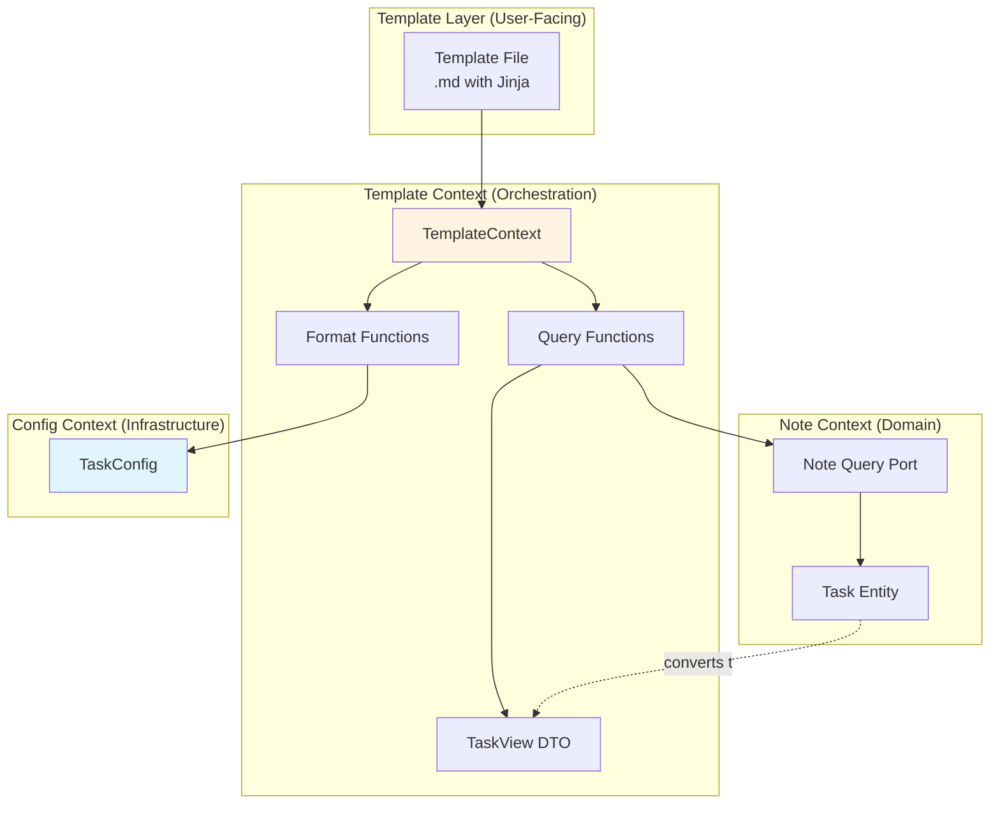
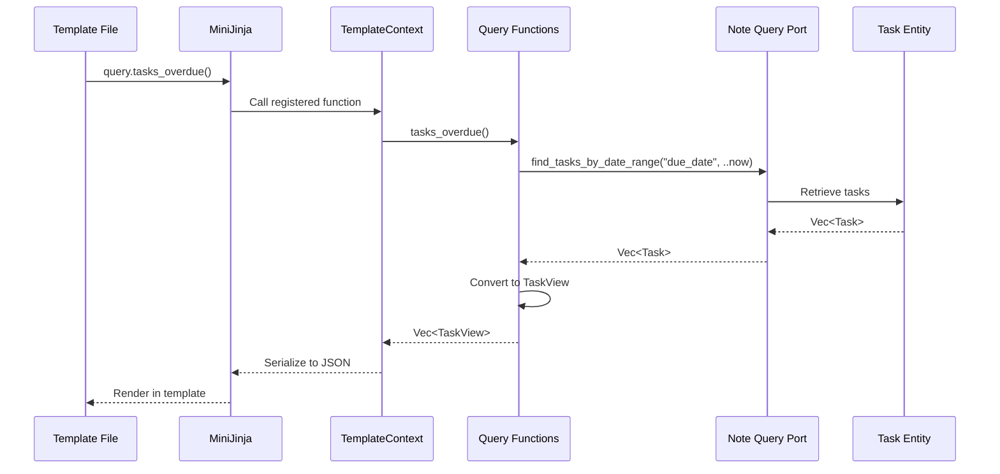
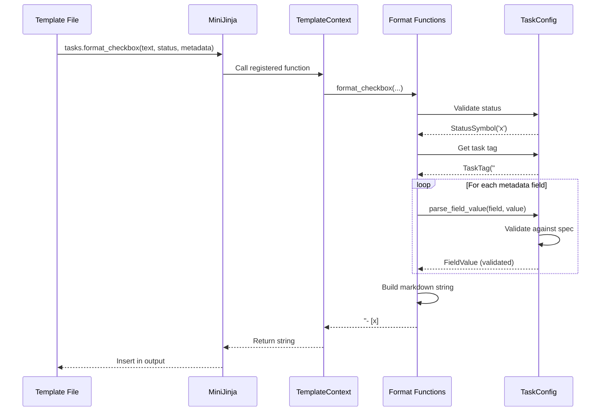

# Tech Spec: Template Task Integration

## 1. Problem Space (The "Why")

### 1.1 Context & Background

The template system (Epic 12) needs to expose tasks for template rendering and provide validated task creation from templates. Currently, there is no formal definition of how tasks integrate with the template context.

**Current Gaps**:
- No task query functions for templates (`query.tasks_overdue()`)
- No task formatting helpers (`tasks.format_checkbox()`)
- No config-validated task creation from templates
- Templates cannot iterate over tasks or display metadata

**Why Template Context**: Task integration spans multiple concerns:
- **Query exposure**: Template context provides task queries (backed by Note CQRS)
- **Formatting**: Templates generate valid task markdown (validated against TaskConfig)
- **User interaction**: Prompts/suggesters populate task metadata

**Related Decisions**:
- [006a: Task Configuration Schema](./006a-config-task-schema.md)
- [006b: Note List and Task Entities](./006b-note-list-task.md)
- [Epic 12: Template System](../../_bmad-output/planning-artifacts/epics/) (TBD)

### 1.2 Goals & Non-Goals

**Goals**:
1. **Expose task queries** for template rendering (tasks by status, field, date range)
2. **Provide task formatting** with config validation (`tasks.format_checkbox()`)
3. **Enable interactive task creation** via prompts/suggesters (standard template functions)
4. **Validate generated tasks** against vault TaskConfig (fail-fast on invalid metadata)
5. **Zero breaking changes**: Existing templates continue to work

**Non-Goals**:
- Template engine selection (MiniJinja assumed, see Epic 12)
- Task CQRS implementation (Note context responsibility)
- Query service internals (Epic 11)
- Real-time task updates (no file watching in MVP)

### 1.3 Constraints (The Hard Limits)

**Architectural**:
- Template context is **application boundary** (orchestrates Note + Config)
- No direct database access (uses Note CQRS ports)
- Formatting **must validate** against TaskConfig (fail-fast)
- Templates are **sync-first** (no async template functions in MVP)

**Performance**:
- Task queries backed by indexes (defined in TaskConfig)
- Template rendering target: <100ms for typical vaults
- Format validation: <1ms per task (config validation cached)

**User Experience**:
- Template errors **must be actionable** ("priority must be 0-10", not "invalid value")
- Generated tasks **must be valid markdown** (no syntax errors)
- Prompts/suggesters use standard template function API (no special task syntax)

**Integration**:
- Query functions return task data (not Task entities - no domain leakage)
- Format functions accept primitive types (strings, numbers, maps)
- Config loaded before template rendering (no lazy loading)

## 2. Guide-Level Explanation (The "What")

### 2.1 User/Dev Experience

#### User Perspective: Using Tasks in Templates

**Template: Weekly Review** (`templates/weekly-review.md`):

```jinja
# Weekly Review - {{ date.now().format("%Y-W%V") }}

## Overdue Tasks

- [{{ task.status_symbol }}] {{ task.text }}
  - Priority: {{ task.metadata.priority | default(0) }}
  - Due: {{ task.metadata.due_date | date("%Y-%m-%d") }}
  - Source: [[{{ task.note_name }}]]

✅ No overdue tasks!


## This Week's Completed Tasks

- ✅ {{ task.text }} ({{ task.metadata.project_name | default("Personal") }})


## Tasks by Project

### {{ project }}

- [{{ task.status_symbol }}] {{ task.text }} (P{{ task.metadata.priority | default(0) }})


```

**Template: Daily Task Creation** (`templates/daily-tasks.md`):

```jinja
# Tasks for {{ date.today() | date("%Y-%m-%d") }}

## Static Tasks (config-validated)

{{ tasks.format_checkbox(
    text="Review pull requests",
    status="incomplete",
    metadata={
        "priority": 1,
        "project_name": "lithos",
        "due_date": date.today() | date("%Y-%m-%d")
    }
) }}

{{ tasks.format_checkbox(
    text="Update documentation",
    status="incomplete",
    metadata={"priority": 2, "project_name": "docs"}
) }}

## Interactive Task Creation (using prompts)





{% set due_date = prompt(
    "Due date (YYYY-MM-DD)?",
    default=date.today() | date("%Y-%m-%d")
) %}

{{ tasks.format_checkbox(
    text=task_text,
    status="incomplete",
    metadata={
        "priority": task_priority,
        "project_name": task_project,
        "type": task_type,
        "due_date": due_date
    }
) }}
```

**Rendering Output** (when template runs):

```markdown
# Tasks for 2026-02-08

## Static Tasks (config-validated)

- [ ] #task Review pull requests [priority:: 1] [project:: lithos] [due_date:: 2026-02-08]

- [ ] #task Update documentation [priority:: 2] [project:: docs]

## Interactive Task Creation (using prompts)

[Prompts user for inputs]

- [ ] #task Write unit tests [priority:: 3] [project:: lithos] [type:: action_item] [due_date:: 2026-02-10]
```

**Validation Errors** (caught at render time):

```bash
$ lithos template render daily-tasks.md

✗ Template rendering failed:
  - Line 15: tasks.format_checkbox() - priority must be 0-10 (got 15)
  - Line 15: tasks.format_checkbox() - unknown field 'invalid_field'
  - Line 15: tasks.format_checkbox() - project_name pattern mismatch (expected ^[a-z_]+$)
```

#### Developer Perspective: Template Context API

**Registering Task Functions**

```rust
use lithos_core::template::context::TemplateContext;
use lithos_core::note::ports::Query as NoteQuery;
use lithos_core::config::task::TaskConfig;

let mut ctx = TemplateContext::new();

// Register query functions (backed by Note CQRS)
ctx.register_query_functions(&note_query, &task_config);

// Register formatting functions
ctx.register_task_functions(&task_config);

// Render template
let output = ctx.render("weekly-review.md", &vault_path)?;
```

**Query Function Implementation** (internal):

```rust
// template/functions/query.rs

pub fn tasks_overdue(
    query: &impl NoteQuery,
    config: &TaskConfig,
) -> Result<Vec<TaskView>, TemplateError> {
    let now = chrono::Utc::now();

    // Query indexed tasks by due_date
    let tasks = query.find_tasks_by_date_range("due_date", ..now)?;

    // Convert to template-friendly view
    tasks.into_iter()
        .map(|task| TaskView::from_task(&task, config))
        .collect()
}
```

**Format Function Implementation** (internal):

```rust
// template/functions/format.rs

pub fn format_checkbox(
    text: String,
    status: String,
    metadata: HashMap<String, TemplateValue>,
    config: &TaskConfig,
) -> Result<String, TemplateError> {
    // Validate status
    let status_symbol = config.status()
        .symbol_for_name(&status)
        .ok_or(TemplateError::InvalidStatus(status))?;

    // Get task tag (first one)
    let task_tag = config.task_tags().first()
        .ok_or(TemplateError::NoTaskTagsConfigured)?;

    // Build base checkbox
    let mut output = format!("- [{}] {} {}", status_symbol.as_char(), task_tag.as_ref(), text);

    // Validate and format metadata
    for (field_name, value) in metadata {
        // Get field spec
        let spec = config.fields().get(&field_name)
            .ok_or(TemplateError::UnknownField(field_name.clone()))?;

        // Convert TemplateValue → serde_json::Value
        let json_value = value.to_json();

        // Validate against spec
        let field_value = config.parse_field_value(&field_name, &json_value)
            .map_err(|e| TemplateError::ValidationFailed {
                field: field_name.clone(),
                source: e,
            })?;

        // Format as inline metadata
        let keyword = spec.keyword();
        output.push_str(&format!(" [{}:: {}]", keyword, format_field_value(&field_value)));
    }

    Ok(output)
}
```

### 2.2 Mental Model

**Three-Layer Integration**:

```
┌─────────────────────────────────────────┐
│ Template (User-Facing)                  │
│ - Jinja syntax                          │
│ - query.* functions (read tasks)        │
│ - tasks.* functions (create tasks)      │
│ - Standard filters (date, default)      │
└─────────────────────────────────────────┘
                  │
                  │ Template Context (Orchestration)
                  ▼
┌─────────────────────────────────────────┐
│ Template Context API                    │
│ - Converts queries to template values   │
│ - Validates task creation               │
│ - Provides TaskView (no domain leakage) │
└─────────────────────────────────────────┘
                  │
          ┌───────┴───────┐
          ▼               ▼
┌─────────────────┐ ┌──────────────┐
│ Note CQRS       │ │ TaskConfig   │
│ (Query tasks)   │ │ (Validate)   │
└─────────────────┘ └──────────────┘
```

**Key Concepts**:

1. **TaskView = Template-Friendly DTO**: No domain entities leaked to templates
2. **Query Functions = Read-Only**: Templates cannot modify tasks (render only)
3. **Format Functions = Validated Creation**: Generated markdown is guaranteed valid
4. **TemplateValue = Template Primitive**: String/Number/Boolean/Array/Object (mirrors FieldValue)

**Think of it like**:
- **query.\*** = SQL SELECT for tasks (read-only)
- **tasks.format_checkbox()** = INSERT statement (validated before output)
- **TaskView** = JSON response from API (not internal domain model)

## 3. Detailed Design (The "How")

### 3.1 System Architecture



### 3.2 Data Models

#### `TaskView` (Template DTO)

- **Purpose**: Template-friendly representation of Task (no domain leakage)
- **Key rules**: All fields public; serializes to JSON for template engine
- **Important notes**: Created from Task entity; includes denormalized data (note_name, status_symbol)
- **Shape**:

```rust
// template/task_view.rs

#[derive(Debug, Clone, Serialize)]
pub struct TaskView {
    pub id: String,
    pub text: String,
    pub status: String,
    pub status_symbol: char,
    pub note_name: String,
    pub metadata: HashMap<String, TemplateValue>,
}

impl TaskView {
    pub fn from_task(task: &Task, config: &TaskConfig) -> Self {
        let status_symbol = config.status()
            .symbol_for_name(task.status())
            .unwrap_or(StatusSymbol(' '));

        let metadata = task.metadata()
            .fields()
            .iter()
            .map(|(k, v)| (k.clone(), TemplateValue::from_field_value(v)))
            .collect();

        TaskView {
            id: task.id().to_string(),
            text: task.text().to_owned(),
            status: task.status().as_ref().to_owned(),
            status_symbol: status_symbol.as_char(),
            note_name: "TODO".to_owned(), // Resolved from note_id
            metadata,
        }
    }
}
```

#### `TemplateValue` (Template Primitive)

- **Purpose**: Template engine value type (mirrors FieldValue, but template-owned)
- **Key rules**: Serializes to serde_json::Value for template engine
- **Shape**:

```rust
// template/value.rs

#[derive(Debug, Clone, Serialize)]
#[serde(untagged)]
pub enum TemplateValue {
    String(String),
    Number(f64),
    Boolean(bool),
    Array(Vec<TemplateValue>),
    Object(HashMap<String, TemplateValue>),
    Null,
}

impl TemplateValue {
    pub fn from_field_value(fv: &note::value::FieldValue) -> Self {
        match fv {
            note::value::FieldValue::String(s) => TemplateValue::String(s.clone()),
            note::value::FieldValue::Number(n) => TemplateValue::Number(*n),
            note::value::FieldValue::Boolean(b) => TemplateValue::Boolean(*b),
            note::value::FieldValue::Date(d) => TemplateValue::String(d.to_rfc3339()),
            note::value::FieldValue::Array(arr) => {
                TemplateValue::Array(arr.iter().map(Self::from_field_value).collect())
            }
            note::value::FieldValue::Object(obj) => {
                TemplateValue::Object(
                    obj.iter()
                        .map(|(k, v)| (k.clone(), Self::from_field_value(v)))
                        .collect()
                )
            }
        }
    }

    pub fn to_json(&self) -> serde_json::Value {
        serde_json::to_value(self).unwrap()
    }
}
```

### 3.3 Component & Interface Specifications

#### Component: `TemplateContext`

- **Responsibility**: Orchestrates template rendering with task query/format functions
- **Public Interface**:
  - `TemplateContext::new() -> Self`
    - _Behavior_: Creates context with empty function registry
  - `register_query_functions(&mut self, query: &impl NoteQuery, config: &TaskConfig)`
    - _Behavior_: Registers task query functions (tasks_overdue, tasks_by_field, etc.)
  - `register_task_functions(&mut self, config: &TaskConfig)`
    - _Behavior_: Registers task formatting functions (format_checkbox)
  - `render(&self, template_name: &str, vault_path: &Path) -> Result<String, TemplateError>`
    - _Behavior_: Renders template with registered functions
    - _Errors_: Template not found, validation failures, query errors
- **State/Invariants**:
  - Functions registered before rendering
  - Config loaded before function registration

#### Component: Query Functions

Query functions are registered as template globals (accessed via `query.*`).

- **Responsibility**: Expose task queries to templates
- **Public Interface** (template-facing):
  - `query.tasks_overdue() -> Vec<TaskView>`
    - _Behavior_: Returns tasks with due_date < now
  - `query.tasks_completed_since(date: DateTime) -> Vec<TaskView>`
    - _Behavior_: Returns tasks with completed_at >= date
  - `query.tasks_by_field(field: String, value: TemplateValue) -> Vec<TaskView>`
    - _Behavior_: Returns tasks where metadata[field] == value
  - `query.task_projects() -> Vec<String>`
    - _Behavior_: Returns unique values of "project_name" field
  - `query.tasks_by_status(status: String) -> Vec<TaskView>`
    - _Behavior_: Returns tasks with given status
- **State/Invariants**: Backed by Note CQRS query port (read-only)

#### Component: Format Functions

Format functions are registered as template globals (accessed via `tasks.*`).

- **Responsibility**: Generate validated task markdown from templates
- **Public Interface** (template-facing):
  - `tasks.format_checkbox(text: String, status: String, metadata: HashMap<String, TemplateValue>) -> Result<String, TemplateError>`
    - _Behavior_: Generates markdown checkbox with validated metadata
    - _Errors_: Invalid status, unknown field, validation failure (type/bounds/pattern)
- **State/Invariants**:
  - Validates all metadata against TaskConfig
  - Uses first task tag from config
  - Returns valid markdown or errors (fail-fast)

### 3.4 Integration & Data Flow

#### Template Rendering Flow (Query)



#### Template Rendering Flow (Format)



#### Dependencies

- **MiniJinja**: Template engine (template context integrates with)
- **Note CQRS**: Query port for task retrieval
- **TaskConfig**: Validation and formatting rules
- **Serde**: JSON serialization for template values

### 3.5 Core Logic & Algorithms

#### Algorithm: Task Query Function Registration

```rust
impl TemplateContext {
    pub fn register_query_functions<Q: NoteQuery>(
        &mut self,
        query: &Q,
        config: &TaskConfig,
    ) {
        let query = Arc::new(query.clone()); // Shared across functions
        let config = Arc::new(config.clone());

        // Register tasks_overdue
        self.engine.add_function("tasks_overdue", move || {
            let now = chrono::Utc::now();
            query.find_tasks_by_date_range("due_date", ..now)
                .map(|tasks| {
                    tasks.into_iter()
                        .map(|t| TaskView::from_task(&t, &config))
                        .collect::<Vec<_>>()
                })
                .map_err(|e| TemplateError::QueryFailed(e))
        });

        // Register tasks_by_field
        self.engine.add_function("tasks_by_field", {
            let query = Arc::clone(&query);
            let config = Arc::clone(&config);
            move |field: String, value: TemplateValue| {
                let field_value = note::value::FieldValue::from_template_value(&value);
                query.find_tasks_by_field(&field, &field_value)
                    .map(|tasks| {
                        tasks.into_iter()
                            .map(|t| TaskView::from_task(&t, &config))
                            .collect::<Vec<_>>()
                    })
                    .map_err(|e| TemplateError::QueryFailed(e))
            }
        });

        // ... other query functions
    }
}
```

#### Algorithm: Checkbox Formatting

```rust
pub fn format_checkbox(
    text: String,
    status: String,
    metadata: HashMap<String, TemplateValue>,
    config: &TaskConfig,
) -> Result<String, TemplateError> {
    // Validate status
    let status_name = config::task::StatusName::try_from(status.as_str())
        .map_err(|_| TemplateError::InvalidStatusName(status.clone()))?;

    let status_symbol = config.status()
        .symbol_for_name(&status_name)
        .ok_or(TemplateError::UnknownStatus(status))?;

    // Get task tag
    let task_tag = config.task_tags().first()
        .ok_or(TemplateError::NoTaskTagsConfigured)?;

    // Build base
    let mut output = format!(
        "- [{}] {} {}",
        status_symbol.as_char(),
        task_tag.as_ref(),
        text
    );

    // Sort metadata keys for deterministic output
    let mut sorted_fields: Vec<_> = metadata.into_iter().collect();
    sorted_fields.sort_by(|a, b| a.0.cmp(&b.0));

    for (field_name, value) in sorted_fields {
        // Get field spec
        let spec = config.fields().get(&field_name)
            .ok_or(TemplateError::UnknownField(field_name.clone()))?;

        // Convert to JSON for validation
        let json_value = value.to_json();

        // Validate
        let field_value = config.parse_field_value(&field_name, &json_value)
            .map_err(|e| TemplateError::ValidationFailed {
                field: field_name.clone(),
                source: e,
            })?;

        // Format
        let formatted = match &field_value {
            note::value::FieldValue::String(s) => s.clone(),
            note::value::FieldValue::Number(n) => n.to_string(),
            note::value::FieldValue::Boolean(b) => b.to_string(),
            note::value::FieldValue::Date(d) => d.format("%Y-%m-%d").to_string(),
            _ => return Err(TemplateError::UnsupportedFieldType(field_name)),
        };

        let keyword = spec.keyword();
        output.push_str(&format!(" [{}:: {}]", keyword, formatted));
    }

    Ok(output)
}
```

## 4. Alternatives & Decisions (The "Divergence")

### 4.1 Tactical Decisions

#### Decision: TaskView DTO (Not Task Entity)

- **Context**: Should templates access Task entities directly?
- **Choice**: Convert to TaskView DTO at boundary
- **Alternatives Considered**:
  - _Direct Task access_: Templates use Task methods. **Rejected** - domain leakage
  - _JSON serialization_: Serialize Task to JSON. **Rejected** - leaks internal structure
- **Rationale**: DTO prevents domain coupling; templates get only what they need.

#### Decision: Query Functions Not Async

- **Context**: Should task queries be async?
- **Choice**: Sync-first for MVP
- **Alternatives Considered**:
  - _Async functions_: `async fn tasks_overdue()`. **Rejected** - adds complexity, not needed for MVP
  - _Blocking in async_: Use `spawn_blocking`. **Rejected** - premature
- **Rationale**: Template rendering is sync; defer async until proven bottleneck.

#### Decision: Fail-Fast Validation (Not Silent)

- **Context**: What if metadata is invalid?
- **Choice**: Template rendering fails with error
- **Alternatives Considered**:
  - _Silent skip_: Ignore invalid fields. **Rejected** - hides user errors
  - _Warning logs_: Log but continue. **Rejected** - generates broken tasks
  - _Auto-correct_: Clamp to bounds. **Rejected** - masks mistakes
- **Rationale**: Early errors prevent broken markdown; user fixes template once.

#### Decision: Prompts/Suggesters are Standard Functions

- **Context**: Should task creation have special prompt syntax?
- **Choice**: Use standard template functions (`prompt()`, `suggester()`)
- **Alternatives Considered**:
  - _Special syntax_: ``. **Rejected** - non-standard, harder to learn
  - _CLI-only_: No interactive prompts. **Rejected** - poor UX
- **Rationale**: Reuse existing template primitives; consistent API.

## 5. Operational Readiness (The "Reality Check")

### 5.1 Observability

**Metrics** (via `tracing`):

```rust
#[tracing::instrument(level = "debug")]
fn render_template(
    template_name: &str,
    context: &TemplateContext,
) -> Result<String, TemplateError> {
    let start = Instant::now();
    let result = context.engine.render(template_name);

    tracing::info!(
        template = %template_name,
        duration_ms = start.elapsed().as_millis(),
        success = result.is_ok(),
        "Template rendered"
    );

    result
}
```

**Logs**:
- `INFO`: Template rendered (name, duration, success)
- `WARN`: Unknown metadata fields used (forward compatibility)
- `ERROR`: Validation failures (field name, expected vs actual)

### 5.2 Migration Strategy

**Phase 1: Add TemplateContext**
- Create `template/context.rs` with TemplateContext
- Add `template/task_view.rs` with TaskView DTO
- Add `template/value.rs` with TemplateValue

**Phase 2: Register Query Functions**
- Implement query function wrappers
- Register with MiniJinja engine
- Add tests with fake Note query

**Phase 3: Register Format Functions**
- Implement format_checkbox with validation
- Add tests with various metadata combinations

**Backward Compatibility**:
- Templates without task functions continue to work
- Task queries return empty lists if no tasks indexed

### 5.3 Security & Privacy

**Template Injection**:
- Templates are user-authored (trusted)
- No eval/exec of template-generated code
- Metadata values are data only

**Query Access Control**:
- Templates can query all tasks (no per-note filtering in MVP)
- Future: Add note permissions to query context

## 6. Pre-Mortem (The "Inversion")

- **Risk**: Task queries are slow (no indexes)
  - _Mitigation_: Use indexed_fields from TaskConfig; document query performance

- **Risk**: Generated markdown has syntax errors
  - _Mitigation_: Validate format output in tests; fail-fast on validation

- **Risk**: TemplateValue conversion loses precision
  - _Mitigation_: Use f64 for numbers (same as FieldValue); document limits

- **Risk**: Prompts block rendering (poor UX)
  - _Mitigation_: Document interactive templates; show progress in CLI

## 7. Critique & Refinement Log

| Date       | Critique / Issue                     | Resolution                                   |
|:-----------|:-------------------------------------|:---------------------------------------------|
| 2026-02-08 | "Should templates access Task?"      | No - use TaskView DTO to prevent coupling    |
| 2026-02-08 | "Async or sync query functions?"     | Sync for MVP; defer async until needed       |
| 2026-02-08 | "Silent fail or error on invalid?"   | Fail-fast with actionable errors             |
| 2026-02-08 | "Special prompt syntax for tasks?"   | No - reuse standard template functions       |

## 8. References

- [006a: Task Configuration Schema](./006a-config-task-schema.md)
- [006b: Note List and Task Entities](./006b-note-list-task.md)
- [MiniJinja Documentation](https://docs.rs/minijinja/latest/minijinja/)
- [Jinja2 Template Designer Documentation](https://jinja.palletsprojects.com/en/3.1.x/templates/)
- [Epic 12: Template System](../../_bmad-output/planning-artifacts/epics/) (TBD)
