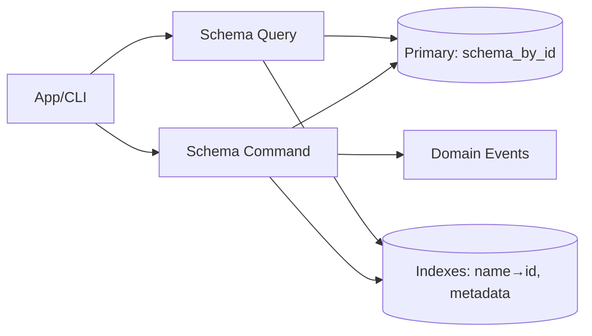
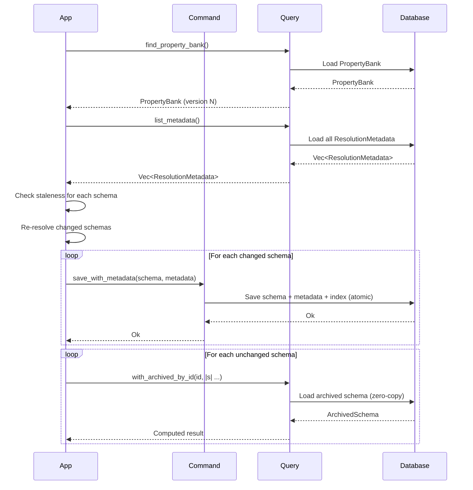
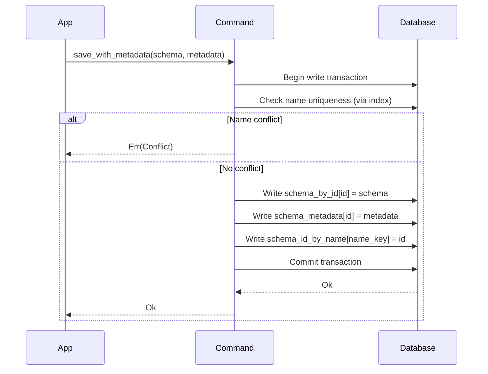
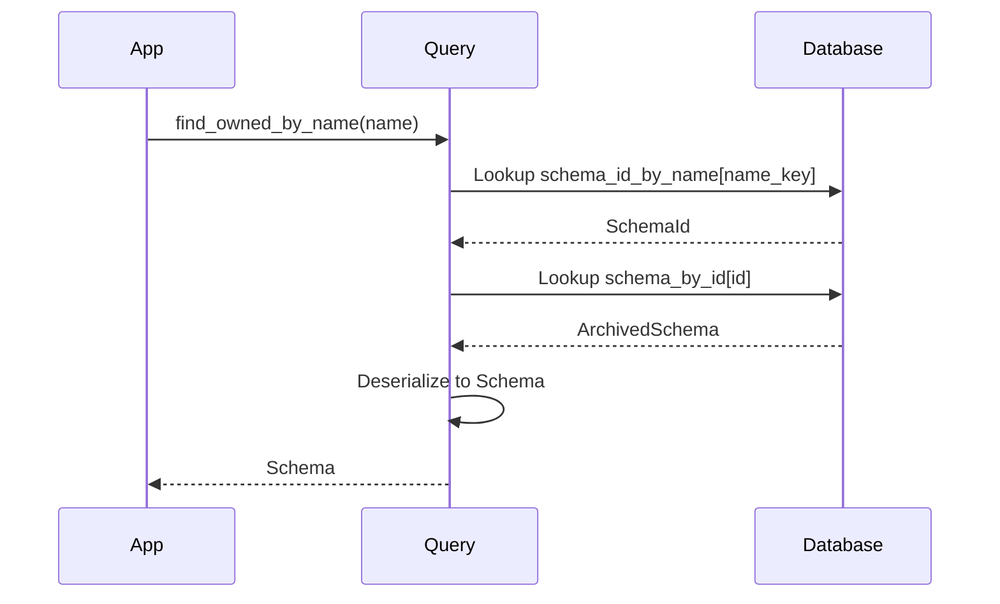

# Tech Spec: Schema CQRS (Commands + Queries)

## 1. Problem Space (The "Why")

### 1.1 Context & Background

The schema context persists and retrieves:

- schemas (resolved validation "truth" used at runtime),
- the property bank (reusable property definitions),
- **resolution metadata** (for incremental resolution and staleness detection),
- indexes (name → id, composite lookups for hot paths).

Current state (inventory):

- `lithos-core/src/schema/ports.rs` defines command/query traits.
- `lithos-core/src/schema/command.rs` and `lithos-core/src/schema/query.rs` provide DB-backed implementations.
- The current port signatures do not fully align with the concrete implementations.
- Some operations are stringly-typed (schema name as `&str`) even though validated `SchemaName` exists.
- **Missing**: Resolution metadata storage and staleness-aware query operations.

From a performance and correctness perspective, CQRS is the boundary where we must be explicit about:

- storage keys and index maintenance (UUID-first with name index),
- whether returned values are owned or borrowed/archived,
- transaction scoping and event emission,
- **incremental resolution support** (storing and querying resolution metadata).

**Incremental Resolution Context**: Schemas are resolved once at first run and stored with resolution metadata. On subsequent runs, CQRS operations must support:

1. **Querying metadata** to determine which schemas need re-resolution (staleness checks).
2. **Saving schemas with metadata** (atomic updates of schema + metadata).
3. **Loading unchanged schemas** efficiently (zero-copy archived reads).

This mirrors the note indexing strategy: **minimize expensive computation, maximize read speed**.

### 1.2 Goals & Non-Goals

**Goals**

- Define an idiomatic, type-driven CQRS API:
  - use validated domain types (`SchemaName`, `SchemaId`) at the boundary,
  - avoid stringly-typed table keys in CQRS interfaces.
- Provide a clear zero-copy query tier that respects redb guard lifetimes.
- Specify the schema persistence model and required indexes:
  - **UUID-first storage** (`SchemaId` primary key) with **name→id index**.
  - **Resolution metadata table** for incremental resolution.
- Make errors structured and cheap:
  - no eager `to_string()` of underlying DB errors in the core,
  - split error types for commands vs queries (pattern-matchable).
- **Support incremental resolution** workflows (save metadata, query staleness).

**Non-Goals**

- Building an async orchestration layer (schema CQRS stays sync-first).
- Designing cross-context event buses.
- Runtime schema refresh without restart (LSP concern for future).

### 1.3 Constraints (The Hard Limits)

- **redb access is transaction-scoped**: values returned by `get()` are guard-based and must not outlive the transaction.
- **rkyv safety**: persisted bytes are untrusted; use safe validation (`rkyv::access` / bytecheck) at trust boundaries.
- **dyn-compatibility**: if trait objects are used (`&dyn Query`), avoid generic methods on the trait surface.
- **Lean**: avoid full deserialization and keep allocations minimal on hot read paths.
- **Alignment is a real constraint**: if redb cannot guarantee alignment for returned byte slices, safe archived access may require copying into an aligned buffer before calling a closure.
- **Errors**: library surfaces use structured `Result` errors (no `unwrap`/`expect`); reserve `anyhow` for binaries/CLI (see https://github.com/apollographql/rust-best-practices/tree/1c78fa64bb0d5df4a4d18d5923a7ced615f947d1).
- **Incremental resolution**: Metadata storage and queries must be efficient (no full schema deserialization for staleness checks).

### 1.4 Error Type Strategy

CQRS operations use split error types for clearer domain/storage error separation:

**SchemaCommandError**:

```rust
#[derive(Debug, thiserror::Error)]
pub enum SchemaCommandError {
    #[error("Domain validation failed")]
    DomainValidation(#[from] SchemaError),

    #[error("Storage operation failed")]
    Storage(#[from] DbError),

    #[error("Conflict: {reason}")]
    Conflict { reason: Box<str> },
}
```

**SchemaQueryError**:

```rust
#[derive(Debug, thiserror::Error)]
pub enum SchemaQueryError {
    #[error("Storage operation failed")]
    Storage(#[from] DbError),

    #[error("Data corruption: {reason}")]
    Corruption { reason: Box<str> },

    #[error("Schema not found: {name}")]
    NotFound { name: Box<str> },
}
```

**Rationale**: Split error types allow:

- Commands to distinguish domain validation failures from storage failures from conflicts (e.g., duplicate name).
- Queries to surface data corruption separately from transient storage errors.
- Better error handling at call sites (pattern match on error kind for retry vs permanent failure logic).
- Structured errors avoid stringly-typed error handling (`if err.to_string().contains(...)`).

### 1.5 Definition of Done

- CQRS contracts for schema are documented as stable interfaces (inputs/outputs/errors/invariants).
- The design explicitly supports both:
  - cold-path owned reads (CLI workflows), and
  - hot-path archived reads (closure-based; zero-deserialize; may require an alignment copy depending on storage).
- Proposed DB tables / indexes are specified and compatible with redb constraints:
  - Primary: `schema_by_id` (UUID-keyed)
  - Index: `schema_id_by_name` (name→id)
  - Metadata: `schema_metadata` (resolution tracking)
- **Resolution metadata** storage and query operations defined.
- Error contracts avoid stringification in core paths and preserve structured errors.
- The design respects rkyv validation requirements at trust boundaries.

## 2. Guide-Level Explanation (The "What")

### 2.1 User/Dev Experience

Concrete-first usage pattern (preferred for performance + ergonomics):

```rust
use lithos_core::schema::{command, query};
use lithos_core::schema::ports::{Command, Query};

let cmd = command::Command::new(&db);
let qry = query::Query::new(&db);

// Save a schema with resolution metadata (atomic)
cmd.save_with_metadata(&schema, &metadata)?;

// Query resolution metadata for staleness checks
let all_metadata = qry.list_metadata()?;
let current_bank_version = bank.version(); // Returns BankVersion (type-safe)
for meta in all_metadata {
    if meta.is_stale(current_bank_version, &parent_hashes, &file_mtimes) {
        // Re-resolve this schema
    }
}

// Owned read (cold path)
let maybe_schema = qry.find_owned_by_name(schema.name())?;

// Archived read (hot path): compute a value inside the closure
let property_count = qry.with_archived_by_id(schema.id(), |archived| {
    archived.properties.len()
})?;

// Name lookup (translates to ID internally)
let schema_id = qry.lookup_id_by_name(schema.name())?;
```

**Incremental Resolution Workflow**:

1. **Load PropertyBank** (first, always).
2. **Query all schema metadata**: `qry.list_metadata()`.
3. **Check staleness** for each schema.
4. **Re-resolve changed** schemas:
   - Parse `RawSchema`, resolve via `SchemaResolver`.
   - Compute new metadata (hash parent, record bank version).
   - Save atomically: `cmd.save_with_metadata(&schema, &metadata)`.
5. **Load unchanged** schemas from DB (zero-copy).

Notes:

- `with_archived_*` returns computed owned data, not archived references.
- The intended performance property is "zero-deserialize"; depending on storage alignment guarantees, the implementation may still do an internal alignment copy before validating/accessing archived bytes.
- This spec follows the repo's CQRS convention of **concrete-first** command/query types, with **traits as optional ports** for polymorphism/testing.
- If a trait-based port is needed, keep the trait surface dyn-compatible and keep closure-based zero-copy APIs on the concrete types.

### 2.2 Mental Model

- **Commands are the _only_ writers** and are responsible for maintaining all indexes (name→id, metadata).
- **Queries offer multiple tiers**:
  - **owned**: deserialize to runtime model (simple, cold path)
  - **archived (zero-deserialize)**: compute small results without deserializing (may still require an alignment copy depending on storage)
  - **metadata-only**: fast staleness checks without loading full schemas
- **UUID-first storage**: `SchemaId` is the primary key; name lookups use index for translation.
- **Resolution metadata** is stored separately for efficient staleness detection.

**Projection/index mindset**:

- CQRS is where we explicitly define which lookups are "instant" and which require loading a full schema.
- For schema, "instant" lookups are typically achieved via **indexes over stable keys** (e.g., name → id).
- Where property lookup becomes a hot path, we can introduce projection indexes that avoid loading a full schema value for common lookups.

**Design rule**: API names must make the tier obvious (`find_owned_*`, `with_archived_*`, `lookup_id_*`).

### 2.3 Read-Optimized Projections (Indexes)

Schema reads become "instant" when we persist **read-optimized projections** that match real query shapes (instead of repeatedly loading/deserializing entire schemas).

Guidance:

- Use projections to convert "lookup by human name" into "lookup by stable id", e.g. `schema_id_by_name: SchemaNameKey -> SchemaId`.
- Prefer **composite-key projections** when a query naturally filters by multiple dimensions, e.g. `(SchemaId, PropertyNameKey) -> PropertyId`.
- Keep projections **storage-shaped** (cheap keys, deterministic encoding) and update them on the command side in the same transaction as the source write.
- **Metadata projections**: Store resolution metadata separately to enable fast staleness checks without deserializing full schemas.

Heuristic for introducing a projection:

- Add it when a query is measurably hot and otherwise requires full schema loads or scans.
- Keep it when it buys a clear performance win without adding too much write amplification or migration burden.

## 3. Detailed Design (The "How")

### 3.1 System Architecture



**Key responsibilities**:

- **Command**: Write schemas, maintain all indexes atomically (name→id, metadata).
- **Query**: Read schemas (owned or archived), read metadata, lookup by name/id.

### 3.2 Data Models

#### Storage Tables (redb)

**Primary table**: `schema_by_id`

- **Key**: `SchemaId` (16 bytes, UUID v7)
- **Value**: `ArchivedSchema` (rkyv bytes)
- **Purpose**: Canonical storage for fully resolved schemas.

**Index table**: `schema_id_by_name`

- **Key**: `SchemaNameKey` (normalized lowercase string)
- **Value**: `SchemaId` (16 bytes)
- **Purpose**: Translate user-provided names to stable IDs.

**Metadata table**: `schema_metadata`

- **Key**: `SchemaId` (16 bytes)
- **Value**: `ArchivedResolutionMetadata` (rkyv bytes)
- **Purpose**: Track resolution dependencies for staleness detection.

**PropertyBank table**: `property_bank`

- **Key**: singleton (empty key or fixed `b"bank"`)
- **Value**: `ArchivedPropertyBank` (rkyv bytes)
- **Purpose**: Store the canonical property registry.

**Optional hot-path projection** (only if benchmarks show it matters):

- `property_id_by_schema_and_name: composite(SchemaId, PropertyNameKey) -> PropertyId`
  - This allows property lookups to start from `(schema_id, property_name)` without scanning or deserializing the entire schema value.
  - Whether this is worth it depends on real workloads (e.g., frequent property resolution during indexing or template evaluation).

#### Storage key newtypes (adapter/storage layer)

```rust
pub struct SchemaNameKey(Box<str>);   // Normalized (lowercase)
pub struct PropertyNameKey(Box<str>); // Normalized (lowercase)
```

These represent the canonical serialized encoding for keys in indexes.

**Normalization rules**:

- Lowercase for case-insensitive lookups.
- Derived from `SchemaName` / `PropertyName` (validated types).
- Used only in storage layer; domain layer uses `SchemaName` / `PropertyName`.

#### Returned values

- **Owned tier**: returns `Schema`, `PropertyBank`, `ResolutionMetadata`.
- **Zero-copy tier**: returns computed owned values `R` (closure-based).
- **Metadata tier**: returns `ResolutionMetadata` only (fast staleness checks).

### 3.3 Component & Interface Specifications

### 3.3.1 Concrete-first CQRS surface (recommended)

This follows the same pattern as the Note CQRS spec: concrete types are the primary API (static dispatch, easiest to keep zero-copy), while port traits remain available for dependency inversion/testing.

Recommended structure:

- `schema::command::Command` (concrete) with inherent methods (`save_with_metadata`, `delete_by_id`, `save_property_bank`).
- `schema::query::Query` (concrete) with inherent methods for owned reads, metadata queries, and closure-based helpers for hot paths (e.g., `with_archived_by_id`).
- `schema::ports::{CommandPort, QueryPort}` traits remain for tests/alternate backends.

Practical guidance:

- If callers require `&dyn ports::QueryPort` / `&dyn ports::CommandPort`, keep the trait surface to the owned tier and dyn-compatible methods.
- If callers can accept generics (`fn f<Q: ports::QueryPort>(q: &Q)`), richer helper APIs may be offered behind `where Self: Sized`.
- The closure-based `with_archived_*` helpers remain on concrete query types because generic methods are not callable on `dyn Trait`.

#### Component: Schema Command

**Responsibility**: Mutate schema state and maintain storage invariants (all indexes updated atomically).

**Target concrete interface** (recommended):

```rust
impl Command {
    // Atomic save: schema + metadata + name index
    pub fn save_with_metadata(
        &self,
        schema: &Schema,
        metadata: &ResolutionMetadata,
    ) -> Result<(), SchemaCommandError>;

    // Delete by ID (canonical key)
    pub fn delete_by_id(&self, id: SchemaId) -> Result<(), SchemaCommandError>;

    // Save PropertyBank with version bump
    pub fn save_property_bank(&self, bank: &PropertyBank) -> Result<(), SchemaCommandError>;

    // Batch save (for bulk resolution)
    pub fn save_batch(
        &self,
        schemas: &[(Schema, ResolutionMetadata)],
    ) -> Result<(), SchemaCommandError>;
}
```

**Invariants maintained by Command**:

1. **Name uniqueness**: Two schemas cannot have the same name (checked before save).
2. **Index consistency**: `schema_id_by_name` always matches `schema_by_id` keys.
3. **Metadata consistency**: `schema_metadata` always exists for every `schema_by_id` entry.
4. **Atomic updates**: Schema + metadata + name index updated in single transaction.

**Error handling**:

- `SchemaCommandError::DomainValidation`: Name validation failed, duplicate name.
- `SchemaCommandError::Storage`: redb transaction failed.
- `SchemaCommandError::Conflict`: Duplicate name on save (clear for retry logic).

**Trait port** (optional for polymorphism/testing):

```rust
pub trait CommandPort {
    fn save_with_metadata(
        &self,
        schema: &Schema,
        metadata: &ResolutionMetadata,
    ) -> Result<(), SchemaCommandError>;

    fn delete_by_id(&self, id: SchemaId) -> Result<(), SchemaCommandError>;

    fn save_property_bank(&self, bank: &PropertyBank) -> Result<(), SchemaCommandError>;
}
```

Keep it small and dyn-compatible. Prefer taking borrowed types (`&Schema`, `&ResolutionMetadata`) to avoid unnecessary cloning.

#### Component: Schema Query

**Responsibility**: Retrieve schema state (multiple tiers for different use cases).

**Three-tier query surface**:

1. **Owned (cold path)**: Deserialize full schemas.

```rust
impl Query {
    // Find by name (translates to ID internally)
    pub fn find_owned_by_name(
        &self,
        name: &SchemaName,
    ) -> Result<Option<Schema>, SchemaQueryError>;

    // Find by ID (direct lookup)
    pub fn find_owned_by_id(
        &self,
        id: SchemaId,
    ) -> Result<Option<Schema>, SchemaQueryError>;

    // List all schemas (expensive)
    pub fn list_owned(&self) -> Result<Vec<Schema>, SchemaQueryError>;

    // Load PropertyBank
    pub fn find_property_bank(&self) -> Result<Option<PropertyBank>, SchemaQueryError>;
}
```

2. **Metadata (fast staleness checks)**: Query metadata without loading schemas.

```rust
impl Query {
    // List all metadata (for staleness checks)
    pub fn list_metadata(&self) -> Result<Vec<ResolutionMetadata>, SchemaQueryError>;

    // Get metadata for specific schema
    pub fn find_metadata_by_id(
        &self,
        id: SchemaId,
    ) -> Result<Option<ResolutionMetadata>, SchemaQueryError>;

    // Lookup ID by name (index translation)
    pub fn lookup_id_by_name(
        &self,
        name: &SchemaName,
    ) -> Result<Option<SchemaId>, SchemaQueryError>;
}
```

3. **Archived/zero-copy (hot path)**: Compute results without deserialization.

```rust
impl Query {
    // Archived read by ID
    pub fn with_archived_by_id<R>(
        &self,
        id: SchemaId,
        f: impl FnOnce(&ArchivedSchema) -> R,
    ) -> Result<Option<R>, SchemaQueryError>;

    // Archived read by name (translates to ID first)
    pub fn with_archived_by_name<R>(
        &self,
        name: &SchemaName,
        f: impl FnOnce(&ArchivedSchema) -> R,
    ) -> Result<Option<R>, SchemaQueryError>;
}
```

**Rules for `with_archived_*`**:

- Validates archived bytes at the trust boundary (rkyv safe access).
- Does not allow archived references to escape (closure returns owned `R`).
- Must not leak redb guards or transaction-scoped borrows.
- If archived access requires properly aligned bytes, it may copy into an aligned buffer internally before validation/access.

**Error handling**:

- `SchemaQueryError::Storage`: redb transaction failed.
- `SchemaQueryError::Corruption`: rkyv validation failed (corrupt data).
- `SchemaQueryError::NotFound`: Schema not found by name/id (clear for 404 logic).

**Trait port** (optional for polymorphism/testing):

```rust
pub trait QueryPort {
    fn find_owned_by_id(&self, id: SchemaId) -> Result<Option<Schema>, SchemaQueryError>;
    fn list_metadata(&self) -> Result<Vec<ResolutionMetadata>, SchemaQueryError>;
    fn lookup_id_by_name(&self, name: &SchemaName) -> Result<Option<SchemaId>, SchemaQueryError>;
}
```

Keep it small and dyn-compatible (no generic methods). Closure-based `with_archived_*` remains on concrete types only.

#### Component: CQRS Error Types

**SchemaCommandError**:

```rust
#[derive(Debug, thiserror::Error)]
pub enum SchemaCommandError {
    #[error("Domain validation failed: {0}")]
    DomainValidation(#[from] SchemaError),

    #[error("Storage operation failed")]
    Storage(#[from] DbError),

    #[error("Conflict: {reason}")]
    Conflict { reason: Box<str> },
}
```

**SchemaQueryError**:

```rust
#[derive(Debug, thiserror::Error)]
pub enum SchemaQueryError {
    #[error("Storage operation failed")]
    Storage(#[from] DbError),

    #[error("Data corruption: {reason}")]
    Corruption { reason: Box<str> },

    #[error("Schema not found: {name}")]
    NotFound { name: Box<str> },
}
```

**Design rules** (Rust API Guidelines + Lithos rules):

- Preserve error structure; avoid `.to_string()` conversions in core.
- Wrap underlying errors as `source` where applicable (`#[from]`).
- Error messages should be concise and stable (avoid exposing internal details).
- Pattern-matchable: Callers can distinguish transient errors (Storage) from permanent failures (Corruption, NotFound, Conflict).
- For API and object-safety guidance when exposing trait objects, see the Rust API Guidelines checklist: https://rust-lang.github.io/api-guidelines/checklist.html

### 3.4 Integration & Data Flow

#### Persistence strategy

**Choice**: Store **validated runtime schemas** (`Schema`) with resolution metadata.

**Rationale**:

- Queries return ready-to-use schemas (no compilation needed).
- Schemas are self-contained (no runtime PropertyBank lookups).
- Incremental resolution minimizes re-computation (only changed schemas resolved).

**Trade-off**: Any change to runtime model impacts persisted bytes; requires explicit migration discipline.

**Migration discipline**:

- Archived model changes are treated as on-disk migrations (documented + tested).
- Breaking changes require data revalidation (see Clean-Slate Protocol).

**Alternative considered**: Store `RawSchema` and compile on load.

- Pros: Persisted format more stable; compilation can evolve.
- Cons: Every read requires compilation/validation (expensive unless cached); negates incremental resolution benefits.
- Rejected: Incremental resolution already minimizes compilation work; storing compiled schemas is simpler.

#### Workflow: Incremental Resolution (Startup)



**Key steps**:

1. **Load PropertyBank** (first, always).
2. **Load all metadata** (fast, no schema deserialization).
3. **Check staleness** (compare bank version, parent hashes, file mtimes).
4. **Re-resolve changed** schemas (parse, resolve, save with new metadata).
5. **Load unchanged** schemas (zero-copy archived reads).

#### Workflow: Save Schema (Atomic)



**Atomicity guarantee**: Schema + metadata + name index updated in single transaction (all or nothing).

#### Workflow: Query by Name (Index Translation)



**Two-step lookup**: Name → ID → Schema. Name index enables UUID-first storage while supporting name-based user queries.

### 3.5 Core Logic & Algorithms

#### Atomic Save Algorithm

```rust
fn save_with_metadata(
    &self,
    schema: &Schema,
    metadata: &ResolutionMetadata,
) -> Result<(), SchemaCommandError> {
    let tx = self.db.begin_write()?;

    // 1. Check name uniqueness (via index)
    let name_key = SchemaNameKey::from(schema.name());
    if let Some(existing_id) = tx.get(schema_id_by_name, &name_key)? {
        if existing_id != schema.id() {
            return Err(SchemaCommandError::Conflict {
                reason: format!("Schema name '{}' already exists", schema.name()).into(),
            });
        }
    }

    // 2. Serialize schema and metadata
    let schema_bytes = rkyv::to_bytes(schema)?;
    let metadata_bytes = rkyv::to_bytes(metadata)?;

    // 3. Write all tables atomically
    tx.insert(schema_by_id, schema.id(), &schema_bytes)?;
    tx.insert(schema_metadata, schema.id(), &metadata_bytes)?;
    tx.insert(schema_id_by_name, &name_key, schema.id())?;

    // 4. Commit (all or nothing)
    tx.commit()?;
    Ok(())
}
```

#### Staleness Check Algorithm

```rust
fn list_stale_schemas(
    &self,
    current_bank_version: BankVersion,
    parent_hashes: &HashMap<SchemaId, SchemaHash>,
    file_mtimes: &HashMap<SchemaId, Timestamp>,
) -> Result<Vec<SchemaId>, SchemaQueryError> {
    let all_metadata = self.list_metadata()?;
    let mut stale = Vec::new();

    for meta in all_metadata {
        let is_stale = meta.bank_version.is_older_than(current_bank_version)
            || meta.parent_hash != parent_hashes.get(&meta.schema_id).copied()
            || meta.file_modified.map_or(false, |stored_mtime| {
                file_mtimes.get(&meta.schema_id).map_or(false, |&current| stored_mtime < current)
            });

        if is_stale {
            stale.push(meta.schema_id);
        }
    }

    Ok(stale)
}
```

**Three staleness triggers** (type-safe with newtypes):

1. **PropertyBank version bump**: `meta.bank_version.is_older_than(current_bank_version)` - clear intent, prevents mixing version with hash/timestamp.
2. **Parent schema content change**: `meta.parent_hash != parent_hashes.get(&meta.schema_id).copied()` - `SchemaHash` prevents mixing with `BankVersion`.
3. **Definition file modified**: `meta.file_modified < current_file_mtime` - `Timestamp` prevents mixing with byte offsets or counts.

## 4. Alternatives & Decisions (The "Divergence")

### 4.1 Tactical Decisions

#### Decision: Concrete-first query API for zero-copy

- **Choice**: closure-based `with_archived_*` exists on the concrete query type, not on the dyn port trait.
- **Why**: dyn-compatibility forbids generic methods; concrete types allow the zero-copy pattern.
- **Alternative**: put generic method on trait (rejected; not object-safe).

#### Decision: Canonical key is `SchemaId` (UUID-first)

- **Choice**: store schemas by id, and maintain name→id index.
- **Why**: aligns with type-driven identity, avoids renames being "identity changes", and unlocks future rename operations without data rewrites.
- **Alternative**: store schemas by name only (rejected; causes API/port mismatch and makes renames harder).

#### Decision: Resolution metadata stored separately

- **Choice**: `schema_metadata` table (separate from `schema_by_id`).
- **Why**: Enables fast staleness checks without deserializing full schemas; cleaner separation of concerns.
- **Alternative**: Embed metadata in `Schema` (rejected; forces full schema deserialization for staleness checks; wasteful).

#### Decision: Atomic save with metadata

- **Choice**: `save_with_metadata(&Schema, &ResolutionMetadata)` updates all tables atomically.
- **Why**: Ensures consistency (no orphaned metadata); simplifies caller (single operation); transactional guarantees.
- **Alternative**: Separate `save(&Schema)` and `save_metadata(&Metadata)` (rejected; error-prone; requires manual transaction management).

#### Decision: Split error types (Command vs Query)

- **Choice**: `SchemaCommandError` and `SchemaQueryError` with specific variants.
- **Why**: Pattern-matchable; clearer intent (commands have validation/conflict errors, queries have corruption/not-found errors); better retry logic.
- **Alternative**: Single `SchemaError` for all operations (rejected; loses distinction between error types; harder to handle correctly).

#### Decision: Batch save operation

- **Choice**: `save_batch(&[(Schema, ResolutionMetadata)])` for bulk resolution.
- **Why**: Single transaction for multiple schemas; reduces write overhead; cleaner rollback on any failure.
- **Alternative**: Loop over `save_with_metadata` (rejected; multiple transactions; slower; harder to make atomic).

## 5. Operational Readiness (The "Reality Check")

### 5.1 Observability

- CQRS entrypoints should be instrumented in higher layers (`app` / `cli`), not in core models.
- Emit counters/timers around:
  - schema save/delete (per-operation timing)
  - schema list/find (distinguish owned vs archived)
  - metadata queries (staleness check overhead)
  - zero-copy "with_archived" call counts (to spot hot paths)
  - staleness check results (how many schemas re-resolved vs loaded)

### 5.2 Migration Strategy

**Phase 1: Type safety** (no storage changes)

- Introduce typed keys (`SchemaId`, `SchemaName`) in CQRS interfaces.
- Update callers to use typed keys instead of strings.

**Phase 2: UUID-first storage** (storage migration)

- Create new tables: `schema_by_id`, `schema_id_by_name`.
- Dual-write during transition: write to both old and new tables.
- Dual-read: if `schema_by_id` is missing, fall back to legacy `schemas_by_name`.
- After full reindex/upgrade, remove legacy tables.

**Phase 3: Resolution metadata** (storage migration)

- Create `schema_metadata` table.
- On first run with new code, recompute metadata for all existing schemas.
- Update save operations to `save_with_metadata`.

**Phase 4: Incremental resolution** (behavior change)

- Implement staleness detection logic (see 3.5).
- Update startup flow to check metadata and re-resolve only changed schemas.
- Measure performance improvement (benchmark startup time with 100+ schemas).

**Clean-Slate Protocol**: See [docs/operations/clean-slate-protocol.md](../operations/clean-slate-protocol.md) for schema revalidation and reindex procedures when storage schema changes.

### 5.3 Security & Privacy

- Treat DB bytes as untrusted (rkyv safe access with `rkyv::access` / bytecheck).
- On validation failure, return a structured "corrupt data" error and trigger the "clean slate" protocol defined in storage guidance.
- Schema names are user-controlled; enforce length limits and character set restrictions (alphanumeric + hyphens/underscores).

## 6. Pre-Mortem (The "Inversion")

Assume it is 6 months from now and this system failed. Why?

- **Risk**: returning archived references across transaction boundaries leads to UB.
  - _Mitigation_: closure-based API that returns owned `R`; lifetime bounds on port traits; static analysis via clippy.

- **Risk**: schema rename becomes painful if name is the primary key.
  - _Mitigation_: make `SchemaId` the canonical storage key with name→id index; rename is just index update.

- **Risk**: errors become stringly and hard to branch on.
  - _Mitigation_: typed CQRS errors (`SchemaCommandError`, `SchemaQueryError`); avoid `to_string()` conversions; pattern-matchable variants.

- **Risk**: metadata and schema get out of sync (orphaned metadata).
  - _Mitigation_: atomic save (`save_with_metadata`) updates both in single transaction; no partial writes.

- **Risk**: staleness checks are slow (deserialize full schemas).
  - _Mitigation_: separate metadata table; fast `list_metadata()` without schema deserialization; hash-based checks.

- **Risk**: name index gets out of sync with primary table (split-brain).
  - _Mitigation_: all index updates in same transaction as primary write; redb transaction guarantees atomicity.

- **Risk**: incremental resolution adds complexity without benefit.
  - _Mitigation_: benchmark before and after; document performance improvement; measure with realistic schema sets (100+ schemas); if no benefit, revert to simpler "always resolve" strategy.

## 7. Critique & Refinement Log

| Date       | Critique / Issue                                    | Resolution                                                                     |
| :--------- | :-------------------------------------------------- | :----------------------------------------------------------------------------- |
| 2026-02-03 | Traits and concrete CQRS signatures misaligned      | Define concrete-first API; keep trait ports minimal                            |
| 2026-02-03 | Zero-copy queries conflict with dyn-compatibility   | Put closure-based APIs on concrete query type                                  |
| 2026-02-03 | Name-keyed storage makes renames hard               | Recommend `SchemaId` primary key + name→id index                               |
| 2026-02-03 | Persisted bytes are untrusted                       | Require rkyv validation at trust boundary; corrupt-data path                   |
| 2026-02-12 | Missing resolution metadata storage                 | Add `schema_metadata` table; `save_with_metadata` operation                    |
| 2026-02-12 | Staleness checks require full schema deserialization| Separate metadata table; fast `list_metadata()` without deserializing schemas  |
| 2026-02-12 | Generic `ValidationFailed(String)` errors           | Split errors: `SchemaCommandError` vs `SchemaQueryError` with specific variants|
| 2026-02-12 | No batch save operation for bulk resolution         | Add `save_batch(&[(Schema, ResolutionMetadata)])` for single-transaction saves |
| 2026-02-12 | Metadata can get orphaned from schema               | Atomic `save_with_metadata` updates both in single transaction                 |
| 2026-02-12 | Raw primitives (u64, i64) in algorithms unclear     | Use newtypes: `BankVersion`, `SchemaHash`, `Timestamp` for type-safe operations|

## 8. References

- [Rust API Guidelines](https://rust-lang.github.io/api-guidelines/)
- [redb Documentation](https://docs.rs/redb/)
- [rkyv Documentation](https://docs.rs/rkyv/)
- [Apollo Rust Best Practices](https://github.com/apollographql/rust-best-practices)
- `docs/design/008-schema-models.md` (domain models)
- `docs/design/010-schema-graph-resolver.md` (resolution logic)
- `docs/design/011-property-spec.md` (property validation)
- `docs/operations/clean-slate-protocol.md` (storage migration guidance)
