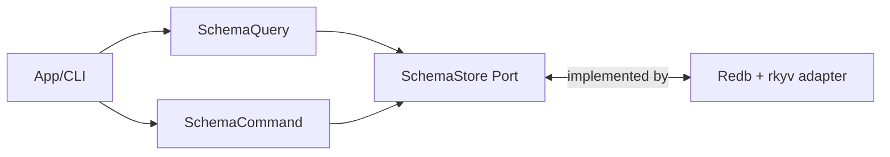

# Tech Spec: Concrete CQRS Generic Over a Storage Port

> **Note**: See `docs/design/README.md` for usage instructions.

## 1. Problem Space (The "Why")

### 1.1 Context & Background

Lithos CQRS specs (e.g. Note/Schema) prefer **concrete-first** command/query types because they:

- keep the happy path ergonomic,
- enable static dispatch,
- make it easy to offer a closure-based “compute-from-archived” hot path.

However, “concrete-first” is often misunderstood as “backend-coupled.” If a query type is defined as:

- `SchemaQuery { db: redb::Database }`

…then the CQRS layer is directly coupled to a specific backend.

This spec documents a sound alternative:

- **Concrete CQRS types that are generic over a storage port** (a trait), e.g.:
  - `SchemaQuery<S: SchemaStore>`
  - `NoteQuery<S: NoteStore>`

This preserves concrete CQRS ergonomics while keeping backend substitution/test seams.

### 1.2 Goals & Non-Goals

**Goals**

- Define an idiomatic Rust pattern for CQRS services that are concrete-first but backend-independent.
- Support a hot read tier that can compute inside a closure over an archived view, without leaking transaction-scoped borrows.
- Be explicit about object-safety limitations and provide recommended escape hatches.

**Non-Goals**

- Mandating a pure hexagonal architecture. (This pattern is compatible with it, but does not require it.)
- Choosing exactly where every port/adapter module lives. This spec focuses on the API shape and invariants.

### 1.3 Constraints (The Hard Limits)

- **Hot-path archived reads are naturally generic**:
  - a `with_archived_*` method typically takes `impl FnOnce(...) -> R`, which is generic over `R`.
- **Generic methods are not object-safe**:
  - if callers require `&dyn SchemaStore`, a generic archived API cannot be called via the vtable.
- **Storage guards / transactions must not escape**:
  - the archived view must not outlive the storage transaction/guard.

## 2. Guide-Level Explanation (The "What")

### 2.1 User/Dev Experience

The CQRS layer remains concrete and ergonomic:

```rust
// Application / caller code
let store = RedbSchemaStore::new(&db);
let query = SchemaQuery::new(store);

// Cold tier: owned value
let schema = query.find_owned_by_name(name)?;

// Hot tier: compute from archived view inside a closure
let property_count = query.with_archived_by_name(name, |arch| {
    arch.properties_len()
})?;
```

But the CQRS type never mentions `redb` directly. It only depends on a port:

- `SchemaQuery<S: SchemaStore>`

You can substitute backends in tests:

```rust
let fake_store = FakeSchemaStore::default();
let query = SchemaQuery::new(fake_store);

assert_eq!(query.find_owned_by_name(name)?, None);
```

### 2.2 Mental Model

Think of this as “concrete CQRS, parameterized by capabilities”:

- CQRS types are concrete and define the application contract.
- The port trait defines what storage capabilities the CQRS type needs.
- The backend adapter is a value you inject that implements the port.

This keeps the *call site* simple while enabling:

- fast hot paths (static dispatch + closure-based archived reads),
- structured errors,
- clean test substitution.

## 3. Detailed Design (The "How")

### 3.1 System Architecture



### 3.2 Component & Interface Specifications

This section specifies the **sound Rust shapes** for:

- the port trait,
- the concrete CQRS type generic over that port,
- the error surface.

#### Component: `SchemaStore` (storage port)

- **Responsibility**: provide the minimal read/write capabilities the schema CQRS layer needs.
- **Key invariant**: any archived/borrowed view must not outlive the call.

A Rust-sound port for “archived compute in a closure” benefits from two features:

- **HRTBs** (`for<'a>`) so the closure can accept a short-lived view.
- Optionally **GATs** (generic associated types) to allow the port to pick the view type.

Proposed port shape:

```rust
/// Storage capability needed by schema queries.
///
/// Notes:
/// - The hot-path method is generic and therefore not object-safe.
/// - The archived view type is chosen by the implementation via `Archived<'a>`.
pub trait SchemaStore {
    type Error;

    /// The archived view passed into hot-path closures.
    ///
    /// Examples:
    /// - `&'a ArchivedSchema` (rkyv)
    /// - `SchemaBytesView<'a>` (validated bytes wrapper)
    type Archived<'a>
    where
        Self: 'a;

    /// Cold-tier: owned model for CLI and mutation workflows.
    fn find_owned_by_name(
        &self,
        name: &SchemaName,
    ) -> Result<Option<Schema>, Self::Error>;

    /// Hot-tier: compute within the scope of a transaction/guard.
    ///
    /// The closure may only observe `Archived<'a>`; it must not cause references
    /// to outlive this call.
    fn with_archived_by_name<R>(
        &self,
        name: &SchemaName,
        f: impl for<'a> FnOnce(Self::Archived<'a>) -> R,
    ) -> Result<Option<R>, Self::Error>;
}
```

Soundness notes:

- `Self::Archived<'a>` is intentionally abstract:
  - a redb+rkyv adapter might use `type Archived<'a> = &'a ArchivedSchema;`
  - another backend might use a validated bytes view.
- The `for<'a>` bound forces `f` to be callable for *any* lifetime `'a` chosen by the implementation.
  - this is what prevents callers from “capturing” a specific lifetime and smuggling borrows out.

Object-safety notes:

- `with_archived_by_name` is generic (`R`) and takes a generic closure; it is not callable through `&dyn SchemaStore`.
- This is acceptable (and intentional) for the “static dispatch hot path” pattern.

#### Component: `SchemaQuery<S>` (concrete CQRS, generic over the port)

- **Responsibility**: provide the schema read API (owned and hot-tier helpers).
- **State/Invariants**:
  - owns or borrows an `S` which implements `SchemaStore`.
  - never returns archived references; archived access is closure-scoped.

Proposed shape:

```rust
pub struct SchemaQuery<S> {
    store: S,
}

impl<S> SchemaQuery<S> {
    pub fn new(store: S) -> Self {
        Self { store }
    }
}

impl<S> SchemaQuery<S>
where
    S: SchemaStore,
{
    pub fn find_owned_by_name(
        &self,
        name: &SchemaName,
    ) -> Result<Option<Schema>, SchemaQueryError<S::Error>> {
        self.store
            .find_owned_by_name(name)
            .map_err(SchemaQueryError::storage)
    }

    pub fn with_archived_by_name<R>(
        &self,
        name: &SchemaName,
        f: impl for<'a> FnOnce(S::Archived<'a>) -> R,
    ) -> Result<Option<R>, SchemaQueryError<S::Error>> {
        self.store
            .with_archived_by_name(name, f)
            .map_err(SchemaQueryError::storage)
    }
}
```

Ergonomics notes (avoid “type parameter bleed”):

- Provide convenience constructors/type aliases for the “default backend”:

```rust
pub type RedbSchemaQuery<'db> = SchemaQuery<RedbSchemaStore<'db>>;

impl<'db> RedbSchemaQuery<'db> {
    pub fn new_redb(db: &'db Database) -> Self {
        Self::new(RedbSchemaStore::new(db))
    }
}
```

This keeps most call sites from ever mentioning `S`.

#### Component: `SchemaQueryError` (CQRS-facing error)

- **Responsibility**: provide a stable error story for callers without eagerly stringifying underlying failures.

Two viable patterns:

1) **Generic over the store error** (maximally reusable):

```rust
pub enum SchemaQueryError<E> {
    Storage(E),
    CorruptData { reason: Box<str> },
}

impl<E> SchemaQueryError<E> {
    fn storage(err: E) -> Self {
        Self::Storage(err)
    }
}
```

2) **Concrete store error type** (simpler public API):

- define `type Error = DbError` or similar on the port implementation,
- and use `SchemaQueryError` without generics.

Guidance:

- Prefer structured errors with sources (`thiserror`) in library code.
- Avoid allocating error strings in the hot path; attach context at the edges (CLI).

### 3.3 Integration & Data Flow

Hot-path flow for `with_archived_by_name`:

1. CQRS method calls `store.with_archived_by_name(name, f)`.
2. Adapter starts a read transaction / guard.
3. Adapter loads the value bytes.
4. Adapter validates and creates the archived view.
   - If alignment is required and the backend cannot guarantee it, the adapter may copy into an aligned buffer before validation/access.
5. Adapter calls `f(archived_view)`.
6. Adapter returns `R` (owned) and drops the transaction/guard.

Critical invariants:

- the closure must not receive any handle that outlives the adapter call,
- the archived view must not escape.

## 4. Alternatives & Decisions (The "Divergence")

### 4.1 Alternatives Considered

#### Alternative A: Concrete CQRS directly coupled to backend

Example:

- `SchemaQuery { db: redb::Database }`

Pros:

- simple types.

Cons:

- backend leaks into CQRS contract,
- harder to test without a real DB,
- makes future backend change a CQRS rewrite.

#### Alternative B: Trait objects everywhere (`&dyn SchemaStore`)

Pros:

- easy to store behind a pointer,
- runtime polymorphism.

Cons:

- hot-path generic APIs (`with_archived_*`) cannot be called on `dyn`.
- you often end up forced into owned reads (or awkward workarounds).

#### Alternative C: Object-safe port + concrete adapter hot-path methods

Pros:

- CQRS can store `&dyn SchemaStoreOwned` for cold tier.

Cons:

- hot-path performance helpers move to adapter-specific code and tend to leak backend types into CQRS call sites.

### 4.2 Decision

Default recommendation:

- Use **concrete CQRS types** that are **generic over a port**.
- Allow the port to expose closure-based archived compute methods (non-object-safe) because the CQRS type is generic and uses static dispatch.
- Provide a second, object-safe “owned-only” port only when you truly need `dyn` (e.g., plugin registries, runtime backend selection).

## 5. Operational Readiness (The "Reality Check")

### 5.1 Observability

Guidance:

- Instrument CQRS entry points and store adapter methods with lightweight spans.
- For hot-path queries, capture:
  - key (redacted if sensitive),
  - result kind (hit/miss),
  - validation failures separately from storage I/O failures.

### 5.2 Security & Data Integrity

- Archived data must be treated as untrusted input.
- Validate before access (bytecheck/rkyv validation) at the boundary.
- On corruption, return a structured error and provide a recovery path (e.g., re-index).

## 6. Pre-Mortem (The "Inversion")

- **Risk**: The port ends up “too wide,” becoming an anemic mirror of the backend.
  - _Mitigation_: keep the port capability-driven; add methods only for validated query shapes.

- **Risk**: Generic parameters proliferate through public APIs.
  - _Mitigation_: provide backend-specific type aliases and constructors; keep `S` mostly internal.

- **Risk**: Callers accidentally demand `dyn` polymorphism and lose access to the hot tier.
  - _Mitigation_: document the split: `SchemaQuery<S>` for hot tier, `SchemaQueryOwned`/object-safe port only for cold tier.

## 7. Critique & Refinement Log

| Date       | Critique / Issue                                         | Resolution                                                                      |
| :--------- | :------------------------------------------------------- | :------------------------------------------------------------------------------ |
| 2026-02-04 | “Concrete-first implies backend coupling.”                | CQRS is concrete over a port (`SchemaQuery<S: SchemaStore>`), not redb directly. |
| 2026-02-04 | “Archived reads aren’t object-safe.”                      | Intentional: hot tier uses static dispatch; provide owned-only object-safe port if needed. |
| 2026-02-04 | “Can a borrow escape via the closure?”                    | Use `for<'a> FnOnce(Self::Archived<'a>)` to prevent lifetime smuggling.         |
