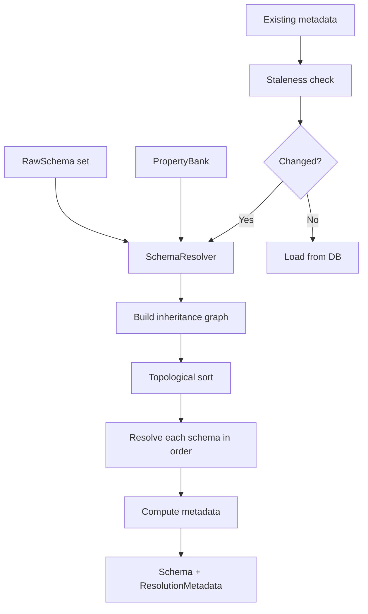

# Tech Spec: Schema Graph + Resolver (Inheritance + $ref + Incremental Resolution)

## 1. Problem Space (The "Why")

### 1.1 Context & Background

Schemas can extend a parent schema and can:

- inherit parent properties,
- exclude inherited properties by name,
- define additional inline properties,
- reference reusable properties via `$ref` (property bank).

The bounded context currently implements:

- `Graph`: a topological ordering + cycle detection service.
- `Resolver`: merges parent properties, applies excludes, and resolves `$ref` through `PropertyBank`.

**New requirement**: **Incremental resolution** with **staleness detection**. On subsequent runs, only changed schemas (based on PropertyBank version, parent schema hashes, or definition file changes) should be re-resolved. This requires tracking resolution dependencies and computing content hashes for staleness checks.

**Unified component decision**: Merge `Graph` and `Resolver` into a single `SchemaResolver` component. This prevents invalid usage patterns (can't resolve before ordering) and encapsulates the full resolution lifecycle.

The main risks in this area are:

- correctness (cycle detection, missing parent behavior, excludes precedence, staleness false positives/negatives),
- determinism (stable ordering for reproducible behavior, stable hashing for staleness detection),
- type-driven clarity (avoid string keys where validated types exist),
- performance (avoid cloning large property definitions unnecessarily, minimize re-resolution work).

### 1.2 Goals & Non-Goals

**Goals**

- Specify a deterministic, easy-to-reason-about inheritance + resolution pipeline.
- Clearly define `$ref` semantics, including boundary responsibilities:
  - adapters parse ref formats,
  - domain resolves typed references.
- Reduce stringly-typed logic:
  - key maps by `PropertyName` not `String`,
  - use `SchemaName` / `SchemaId` as the graph node id.
- **Support incremental resolution**:
  - Track resolution dependencies (parent hashes, PropertyBank version).
  - Detect staleness and re-resolve only changed schemas.
  - Compute content hashes for schemas (for child staleness detection).
- **Unified `SchemaResolver` component**: Merge graph and resolver into single component to encapsulate full resolution lifecycle.
- Provide a migration path toward fewer clones (future: ids/references).

**Non-Goals**

- Implementing multi-parent inheritance or mixins.
- Adding filesystem I/O validation for file properties.
- Runtime schema refresh without restart (LSP concern for future).

### 1.3 Constraints (The Hard Limits)

- Pure logic: SchemaResolver remains deterministic and I/O-free (no DB/file access).
- Lean + performant: avoid unnecessary allocations; pre-allocate when possible.
- `$ref` must not become a "mini parser" inside the domain; format-specific parsing belongs in adapters.
- Type-driven preconditions: represent invariants and required normalization in types (e.g., typed `PropertyRef`), rather than relying on string conventions (see https://rust-analyzer.github.io/book/contributing/style.html).
- **Incremental resolution**: Resolution must be incremental to avoid re-processing unchanged schemas on every run.
- **Hash stability**: Content hashes must be stable (same input → same hash) and exclude metadata fields (timestamps, transient state).

### 1.4 Definition of Done

- Inheritance resolution is specified as a deterministic, testable algorithm.
- `$ref` semantics are precisely defined, including what is adapter-parsed vs domain-resolved.
- Cycle detection and missing-parent behavior is specified and mapped to typed errors.
- Resolver design aligns with type-driven models (no stringly-typed map keys in core).
- The design accounts for performance (minimize cloning, minimize re-resolution) and redb+rkyv zero-copy constraints.
- **`SchemaResolver` unified component** specified (replaces separate Graph + Resolver).
- **Staleness detection algorithm** specified (hash-based, three triggers).
- **Incremental resolution workflow** documented (`resolve_changed()` method).

## 2. Guide-Level Explanation (The "What")

### 2.1 User/Dev Experience

**First run** (full resolution):

```rust
use lithos_core::schema::resolver::SchemaResolver;

// 1. Load PropertyBank (first, always)
let bank = qry.find_property_bank()?.expect("PropertyBank required");

// 2. Load all raw schemas
let raw_schemas: Vec<RawSchema> = load_raw_schemas()?;

// 3. Resolve all schemas
let resolver = SchemaResolver::new(&bank);
let resolved = resolver.resolve_all(raw_schemas)?;

// 4. Save with metadata
for (schema, metadata) in resolved {
    cmd.save_with_metadata(&schema, &metadata)?;
}
```

**Subsequent runs** (incremental resolution):

```rust
// 1. Load PropertyBank
let bank = qry.find_property_bank()?;

// 2. Load all schema metadata
let all_metadata = qry.list_metadata()?;

// 3. Check staleness
let resolver = SchemaResolver::new(&bank);
let parent_hashes = compute_parent_hashes(&all_metadata);
let file_mtimes = check_file_mtimes()?;

let stale_ids: Vec<SchemaId> = all_metadata
    .iter()
    .filter(|meta| meta.is_stale(bank.version(), &parent_hashes, &file_mtimes))
    .map(|meta| meta.schema_id)
    .collect();

// 4. Re-resolve only changed schemas
let stale_raw_schemas = load_raw_schemas_by_id(&stale_ids)?;
let resolved = resolver.resolve_changed(stale_raw_schemas, &all_metadata)?;

// 5. Save updated schemas with new metadata
for (schema, metadata) in resolved {
    cmd.save_with_metadata(&schema, &metadata)?;
}

// 6. Load unchanged schemas from DB (zero-copy)
for schema_id in unchanged_ids {
    let data = qry.with_archived_by_id(schema_id, |archived| {
        // Use archived schema without deserialization
    })?;
}
```

### 2.2 Mental Model

- **SchemaResolver answers**: "Given raw schemas and a PropertyBank, what are the fully resolved schemas (in correct order)?"
- **Incremental resolution**: On subsequent runs, resolver only re-processes changed schemas (detected via staleness checks).
- **Staleness detection**: Compare PropertyBank version, parent content hashes, and file mtimes to determine if a schema needs re-resolution.
- **Unified component**: SchemaResolver encapsulates both graph (ordering) and resolution (merging) logic, preventing invalid usage patterns.

**Resolution lifecycle**:

1. **Build inheritance graph** (internal to SchemaResolver).
2. **Topologically sort** (parents before children).
3. **Resolve each schema** in order (merge parent properties, apply excludes, resolve `$ref`).
4. **Compute metadata** (hash parent content, record PropertyBank version).
5. **Return** resolved schemas with metadata.

**Staleness triggers** (re-resolve if any is true):

1. **PropertyBank version changed** (`meta.bank_version < current_bank_version`).
2. **Parent schema content changed** (`meta.parent_hash != current_parent_hash`).
3. **Definition file modified** (`meta.file_modified < current_file_mtime`).

## 3. Detailed Design (The "How")

### 3.1 System Architecture



**Unified component**: `SchemaResolver` encapsulates graph building, topological sorting, and resolution.

### 3.2 Data Models

#### `SchemaResolver` (Unified Component)

**Purpose**: Single component responsible for building inheritance graph, resolving schemas in correct order, and computing resolution metadata.

**Internal state**:

- Inheritance graph (child → parent edges).
- PropertyBank reference (for `$ref` resolution).
- Resolved schemas cache (for parent lookups during resolution).

**Shape**:

```rust
pub struct SchemaResolver<'a> {
    bank: &'a PropertyBank,
    graph: InheritanceGraph,           // Internal graph structure
    resolved_cache: HashMap<SchemaId, Schema>, // Resolved schemas for parent lookups
}

// Internal graph structure
struct InheritanceGraph {
    edges: HashMap<SchemaId, Option<SchemaId>>, // child -> parent
    names: HashMap<SchemaId, SchemaName>,        // for error messages
}
```

#### Resolver Inputs

**First run** (full resolution):

- `Vec<RawSchema>` (all raw schemas)
- `&PropertyBank` (reusable properties)

**Subsequent runs** (incremental resolution):

- `Vec<RawSchema>` (only changed schemas)
- `Vec<ResolutionMetadata>` (existing metadata for all schemas)
- `&PropertyBank`

#### Resolver Outputs

- `Vec<(Schema, ResolutionMetadata)>` (resolved schemas with metadata)

#### Resolution Metadata (see `008-schema-models.md`)

```rust
pub struct ResolutionMetadata {
    schema_id: SchemaId,
    resolved_at: Timestamp,              // When resolution occurred
    parent_hash: Option<SchemaHash>,     // Hash of parent schema content (if inherited)
    bank_version: BankVersion,           // PropertyBank version at resolution time
    file_modified: Option<Timestamp>,    // File mtime (if sourced from file)
}
```

**Type safety**: Uses newtypes (`BankVersion`, `SchemaHash`, `Timestamp`) instead of raw primitives to prevent mixing conceptually distinct values.

#### Property Reference (typed)

**Purpose**: Replace stringly-typed `$ref` parsing with typed references.

**Shape**:

```rust
pub enum PropertyRef {
    ById(PropertyId),
    ByName(PropertyName),
}
```

**Adapter responsibility**: Parse `$ref` formats (e.g., `#/properties/name`) into `PropertyRef`.

**Domain responsibility**: Resolve `PropertyRef` against `PropertyBank`.

### 3.3 Component & Interface Specifications

#### Component: `SchemaResolver` (Unified Graph + Resolver)

**Responsibility**:

- Build inheritance graph from raw schemas.
- Detect cycles and missing parents.
- Compute deterministic resolution order (parents before children).
- Resolve each schema (merge parent properties, apply excludes, resolve `$ref`).
- Compute resolution metadata (parent hashes, PropertyBank version).

**Public Interface**:

```rust
impl<'a> SchemaResolver<'a> {
    /// Create a new resolver with PropertyBank reference.
    pub fn new(bank: &'a PropertyBank) -> Self;

    /// Resolve all schemas from scratch (first run).
    pub fn resolve_all(
        &mut self,
        raw_schemas: Vec<RawSchema>,
    ) -> Result<Vec<(Schema, ResolutionMetadata)>, SchemaError>;

    /// Resolve only changed schemas (incremental resolution).
    /// Requires existing metadata for parent hash lookups.
    pub fn resolve_changed(
        &mut self,
        raw_schemas: Vec<RawSchema>,
        existing_metadata: &[ResolutionMetadata],
    ) -> Result<Vec<(Schema, ResolutionMetadata)>, SchemaError>;
}
```

**Internal methods** (not public):

```rust
impl<'a> SchemaResolver<'a> {
    // Build inheritance graph from raw schemas
    fn build_graph(&mut self, raw_schemas: &[RawSchema]) -> Result<(), SchemaError>;

    // Topological sort (parents before children)
    fn resolve_order(&self) -> Result<Vec<SchemaId>, SchemaError>;

    // Resolve single schema
    fn resolve_one(
        &mut self,
        raw: RawSchema,
        parent: Option<&Schema>,
    ) -> Result<Schema, SchemaError>;

    // Compute content hash for a schema (for child staleness detection)
    fn compute_hash(&self, schema: &Schema) -> SchemaHash;

    // Build resolution metadata
    fn build_metadata(
        &self,
        schema: &Schema,
        parent_hash: Option<SchemaHash>,
    ) -> ResolutionMetadata;
}
```

**Errors**:

```rust
#[derive(Debug, thiserror::Error)]
pub enum SchemaError {
    #[error("Circular inheritance detected: {schema_name}")]
    CircularInheritance { schema_name: Box<str> },

    #[error("Parent schema not found: {parent_name}")]
    ParentNotFound { parent_name: Box<str> },

    #[error("Property reference not found: {prop_ref}")]
    PropertyRefNotFound { prop_ref: Box<str> },

    #[error("Duplicate property name in schema: {prop_name}")]
    DuplicateProperty { prop_name: Box<str> },

    #[error("Invalid property name: {name}")]
    InvalidPropertyName { name: Box<str> },
}
```

**Determinism requirements**:

- `resolve_order()` sorts initial keys before traversal (stable output).
- Property output is sorted by `PropertyName` for stable serialization.
- Hash computation excludes metadata fields (timestamps, transient state).

**Type-driven improvements**:

- Internal graph map keyed by `SchemaId` (not `String`).
- Internal resolved property map keyed by `PropertyName` (not `String`).
- No public access to internal graph structure (encapsulated).

#### Resolution Algorithm (Detailed)

**`resolve_all()` workflow** (first run):

1. **Build graph**: Parse all `RawSchema`, extract `(id, name, extends)`, build inheritance edges.
2. **Topological sort**: Compute resolution order (parents before children), detect cycles.
3. **Resolve in order**:
   - For each schema in order:
     - Look up parent (if `extends` specified) from resolved cache.
     - Call `resolve_one(raw, parent)`.
     - Store resolved schema in cache (for child lookups).
4. **Compute metadata**:
   - Hash parent content (if parent exists).
   - Record PropertyBank version.
   - Record file mtime (if available).
5. **Return** `Vec<(Schema, ResolutionMetadata)>`.

**`resolve_changed()` workflow** (incremental resolution):

1. **Build graph**: Same as `resolve_all()`, but only for changed schemas.
2. **Load parent schemas**:
   - For each changed schema with `extends`:
     - Look up parent metadata from `existing_metadata`.
     - Load parent schema from DB (or from resolved cache if also changed).
3. **Topological sort**: Compute resolution order (parents before children), detect cycles.
4. **Resolve in order**: Same as `resolve_all()`.
5. **Compute metadata**: Same as `resolve_all()`.
6. **Return** `Vec<(Schema, ResolutionMetadata)>`.

**`resolve_one()` algorithm** (single schema resolution):

1. **Initialize property map**: `HashMap<PropertyName, Property>`.
2. **Inherit parent properties**:
   - If parent exists, insert all parent properties into map.
3. **Apply excludes**:
   - For each excluded name, remove from map.
4. **Resolve own properties**:
   - For each raw property (inline or `$ref`):
     - If `$ref`: look up in PropertyBank by `PropertyRef`.
     - Insert/override in map (child wins on duplicate name).
5. **Validate**:
   - Check for duplicate names (should be prevented by map, but validate for safety).
6. **Sort properties**:
   - Collect properties from map, sort by `PropertyName`.
7. **Build Schema**:
   - Assign `SchemaId`, `SchemaName`, sorted properties.
8. **Return** `Schema`.

**Precedence rules**:

- **Parent properties first**: Start with all parent properties.
- **Excludes remove**: Remove excluded property names from inherited set.
- **Child overrides**: If child defines a property with the same name as parent, child wins.

**Type-driven key usage**:

- Internal resolved map keyed by `PropertyName` (not `String`).
- Avoids repeated `to_string()` allocations.
- Ensures key validity (PropertyName is validated type).

```rust
HashMap<PropertyName, Property> // Type-safe working set
```

#### Hash Computation Algorithm

**Purpose**: Compute stable content hash for schemas to detect parent changes.

**Requirements**:

- **Stable**: Same input → same hash (deterministic).
- **Content-addressed**: Excludes metadata fields (timestamps, IDs that change on re-resolution).
- **Collision-resistant**: Use standard hash algorithm (e.g., `std::hash::Hash` with `DefaultHasher` or `xxhash`).

**Algorithm**:

```rust
fn compute_hash(schema: &Schema) -> SchemaHash {
    use std::hash::{Hash, Hasher};
    use std::collections::hash_map::DefaultHasher;

    let mut hasher = DefaultHasher::new();

    // Hash schema name (stable identifier)
    schema.name().as_str().hash(&mut hasher);

    // Hash properties (sorted order, content only)
    for prop in schema.properties() {
        prop.name().as_str().hash(&mut hasher);
        prop.cardinality().hash(&mut hasher);
        prop.multiplicity().hash(&mut hasher);
        prop.spec().hash(&mut hasher); // PropertySpec must impl Hash
    }

    SchemaHash::from_u64(hasher.finish())
}
```

**Excluded fields** (not hashed):

- `schema.id()` (changes on re-resolution if new UUID assigned).
- `schema.resolved_at()` (timestamp changes on every resolution).
- `schema.bank_version()` (metadata, not content).

**Included fields** (content):

- Schema name (stable identifier).
- Property names, cardinality, multiplicity, specs (the actual schema definition).

#### Staleness Detection Algorithm

**Purpose**: Determine which schemas need re-resolution based on changes to dependencies.

**Three staleness triggers**:

1. **PropertyBank version bump**: `meta.bank_version.is_older_than(current_bank_version)`.
   - Trigger: Any property added/updated/removed in PropertyBank.
   - Rationale: Schema may reference changed property via `$ref`.

2. **Parent schema content change**: `meta.parent_hash != Some(current_parent_hash)`.
   - Trigger: Parent schema re-resolved and content changed.
   - Rationale: Child inherits from changed parent.

3. **Definition file modified**: `meta.file_modified.map_or(false, |t| t < current_file_mtime)`.
   - Trigger: Schema definition file timestamp changed.
   - Rationale: User edited schema definition.

**Algorithm** (type-safe with newtypes):

```rust
fn is_stale(
    meta: &ResolutionMetadata,
    current_bank_version: BankVersion,
    parent_hashes: &HashMap<SchemaId, SchemaHash>,
    file_mtimes: &HashMap<SchemaId, Timestamp>,
) -> bool {
    // Trigger 1: PropertyBank changed (type-safe comparison)
    if meta.bank_version.is_older_than(current_bank_version) {
        return true;
    }

    // Trigger 2: Parent content changed (SchemaHash prevents mixing with BankVersion)
    if let Some(parent_id) = meta.parent_id {
        if meta.parent_hash != parent_hashes.get(&parent_id).copied() {
            return true;
        }
    }

    // Trigger 3: Definition file modified (Timestamp prevents mixing with byte offsets)
    if let Some(stored_mtime) = meta.file_modified {
        if let Some(&current_mtime) = file_mtimes.get(&meta.schema_id) {
            if stored_mtime < current_mtime {
                return true;
            }
        }
    }

    false
}
```

**Type safety benefits**:

- `BankVersion::is_older_than()` is clearer than `<` on raw `u64`.
- Can't accidentally compare `BankVersion` with `SchemaHash` (compile error).
- `Timestamp` prevents mixing file mtimes with byte offsets or counts.

**Performance note**: Staleness check is fast (no schema deserialization required, only metadata).

### 3.4 Integration & Data Flow

**SchemaResolver integration points**:

- **CQRS layer** loads raw schemas, PropertyBank, and existing metadata.
- **CQRS layer** calls `SchemaResolver::resolve_all()` (first run) or `SchemaResolver::resolve_changed()` (incremental).
- **CQRS layer** persists resolved schemas + metadata.

**Parent lookup strategy**:

- On first run: Parent schemas resolved in order and cached internally (no DB access).
- On incremental run: Parent schemas loaded from DB if not in changed set.

**Missing parent handling**:

- SchemaResolver returns `ParentNotFound` error.
- Resolution stops (fail-fast), because partial resolution tends to hide errors.
- Higher layer can decide whether to:
  - Re-resolve from scratch (ignore incremental metadata).
  - Report error to user (missing schema definition).

**Cycle detection**:

- SchemaResolver detects cycles during topological sort.
- Returns `CircularInheritance` error.
- Resolution stops (fail-fast).

### 3.5 Core Logic & Algorithms

#### Graph Algorithm (Topological Sort)

**Algorithm**: Standard DFS topological sort with temporary marks for cycle detection.

**Determinism**: Sort node keys before traversal (stable output across runs).

**Implementation note**:

- Use `HashMap<SchemaId, Option<SchemaId>>` for graph (child → parent edges).
- Explicitly sort collected keys before traversal to keep output stable (HashMap iteration order is non-deterministic).
- Alternative: Use `BTreeMap` for deterministic iteration (trade-off: slower for large graphs).

**Choice**: `HashMap + sort(keys)` is generally faster; keep sorting local to `resolve_order()`.

#### Resolver Algorithm (Property Merging)

**Working set**: Use `HashMap<PropertyName, Property>` keyed by validated type.

**Steps**:

1. **Insert parent properties** first (skip if excluded).
2. **Insert child properties** next (overrides on duplicate name).
3. **Sort output** by `PropertyName` for determinism.

**Performance note**:

- Current approach clones parent properties (acceptable for small schemas).
- Future optimization: Store schemas as `Vec<PropertyId>` and resolve through PropertyBank at validation time (no cloning).

**Avoid anti-pattern**: "Clone to satisfy the borrow checker" (see https://rust-unofficial.github.io/patterns/). If cloning becomes hot-path expensive, prefer restructuring the working set or switching to id-based resolution.

#### `$ref` Resolution

**Adapter responsibility**:

- Parse `$ref` syntax (e.g., `#/properties/name`, `$bank:name`).
- Normalize and validate allowed ref prefixes.
- Convert to typed `PropertyRef`.

**Domain responsibility**:

- Resolve `PropertyRef` against `PropertyBank`.
- Return `Property` or `PropertyRefNotFound` error.

**Example adapter parsing**:

```rust
fn parse_property_ref(ref_str: &str) -> Result<PropertyRef, AdapterError> {
    if let Some(name) = ref_str.strip_prefix("#/properties/") {
        let prop_name = PropertyName::try_from(name)?;
        Ok(PropertyRef::ByName(prop_name))
    } else if let Some(id_str) = ref_str.strip_prefix("$bank:") {
        let uuid = Uuid::parse_str(id_str)?;
        Ok(PropertyRef::ById(PropertyId::from(uuid)))
    } else {
        Err(AdapterError::InvalidRef(ref_str.into()))
    }
}
```

**Domain resolution**:

```rust
fn resolve_ref(&self, prop_ref: PropertyRef) -> Result<Property, SchemaError> {
    match prop_ref {
        PropertyRef::ById(id) => self.bank.get(id)
            .ok_or(SchemaError::PropertyRefNotFound { prop_ref: format!("{}", id).into() })
            .cloned(),
        PropertyRef::ByName(name) => self.bank.get_by_name(&name)
            .ok_or(SchemaError::PropertyRefNotFound { prop_ref: name.as_str().into() })
            .cloned(),
    }
}
```

**Benefit**: Clean separation of parsing (adapter) and resolution (domain). Domain never interprets string formats.

## 4. Alternatives & Decisions (The "Divergence")

### 4.1 Tactical Decisions

#### Decision: Merge Graph and Resolver into unified `SchemaResolver`

- **Choice**: Single `SchemaResolver` component encapsulates graph building, topological sorting, and resolution.
- **Why**: Prevents invalid usage patterns (can't resolve before ordering); encapsulates full lifecycle; simpler API.
- **Alternative**: Keep separate `Graph` and `Resolver` components (rejected; user must orchestrate correctly; easy to misuse).

#### Decision: `$ref` parsing stays out of domain

- **Choice**: Adapters normalize and parse `$ref` syntax; domain resolves typed `PropertyRef`.
- **Why**: Keeps domain small, deterministic, and avoids format lock-in.
- **Alternative**: Parse strings in `SchemaResolver` (rejected; becomes a hidden parser and mixes concerns).

#### Decision: Child overrides parent on duplicate name

- **Choice**: Child definition wins when property name duplicates parent.
- **Why**: Most common inheritance expectation; simplifies mental model.
- **Alternative**: Treat as error (possible future toggle, but not default).

#### Decision: Hash-based staleness detection (not just timestamp)

- **Choice**: Compute content hash for parent schemas to detect changes.
- **Why**: Timestamp-only detection misses manual rollbacks, Git checkouts, and external edits without mtime change.
- **Alternative**: Timestamp-only (rejected; false negatives possible).

#### Decision: Three staleness triggers (bank version, parent hash, file mtime)

- **Choice**: Re-resolve if any of three triggers is true.
- **Why**: Covers all change scenarios (PropertyBank change, parent change, definition change).
- **Alternative**: Single trigger (rejected; misses important change scenarios).

#### Decision: Incremental resolution requires existing metadata

- **Choice**: `resolve_changed()` takes `existing_metadata` parameter for parent hash lookups.
- **Why**: Avoids loading all schemas from DB just to compute parent hashes; fast staleness checks.
- **Alternative**: Load all schemas to compute hashes (rejected; slow, negates incremental resolution benefit).

#### Decision: Fail-fast on missing parent or cycle

- **Choice**: Return error immediately; do not attempt partial resolution.
- **Why**: Partial resolution hides errors and produces invalid schemas.
- **Alternative**: Skip problematic schemas, continue with others (rejected; error-prone, hard to debug).

#### Decision: Internal working map keyed by `PropertyName` (not `String`)

- **Choice**: `HashMap<PropertyName, Property>` working set.
- **Why**: Type safety; avoids repeated `to_string()` allocations; ensures key validity.
- **Alternative**: `HashMap<String, Property>` (rejected; loses type safety; stringly-typed).

## 5. Operational Readiness (The "Reality Check")

### 5.1 Observability

- SchemaResolver should not log by default (deterministic, pure logic).
- CQRS/app layer can log:
  - Number of schemas resolved (total, changed, unchanged).
  - Resolution time (per-schema and total).
  - Staleness check results (how many schemas re-resolved vs loaded).
  - Cycle detection failures (with schema names).
  - Missing parent failures (with parent names).

### 5.2 Migration Strategy

**Phase 1: Unified SchemaResolver** (no storage changes)

- Merge `Graph` and `Resolver` into `SchemaResolver`.
- Update callers to use new API (`resolve_all()`, `resolve_changed()`).
- Tests validate same behavior as before (backward compatibility).

**Phase 2: Typed `PropertyRef`** (no storage changes)

- Introduce `PropertyRef` enum.
- Move `$ref` parsing into adapters (out of domain).
- Update `SchemaResolver` to accept `PropertyRef` instead of raw strings.

**Phase 3: Resolution metadata** (storage migration)

- Update `SchemaResolver` to compute and return `ResolutionMetadata`.
- Update CQRS to persist metadata (see `009-schema-cqrs.md`).
- On first run with new code, recompute metadata for all existing schemas.

**Phase 4: Incremental resolution** (behavior change)

- Implement staleness detection in CQRS layer (see `009-schema-cqrs.md`).
- Update startup flow to call `resolve_changed()` instead of `resolve_all()` on subsequent runs.
- Measure performance improvement (benchmark startup time with 100+ schemas).

**Phase 5: Internal working map** (no external changes)

- Update `SchemaResolver` internal working set to `HashMap<PropertyName, Property>`.
- No API changes; internal refactor only.
- Tests validate same behavior.

### 5.3 Security & Privacy

- `$ref` parsing must reject traversal or unsupported prefixes (adapter-level validation).
- Domain must never interpret filesystem paths for schema inheritance.
- Schema names are user-controlled; enforce length limits and character set restrictions (validated in `SchemaName` type).

## 6. Pre-Mortem (The "Inversion")

Assume it is 6 months from now and this system failed. Why?

- **Risk**: Subtle nondeterminism causes flaky tests and confusing diffs.
  - _Mitigation_: Deterministic key ordering in graph; sorted output properties; stable hash computation.

- **Risk**: `$ref` parsing logic proliferates and becomes inconsistent.
  - _Mitigation_: Define a single adapter-level parser producing `PropertyRef`; domain never interprets strings.

- **Risk**: Schema resolution clones too much, becoming hot-path expensive.
  - _Mitigation_: Treat cloning as acceptable for now; keep a clear path to id-based schema storage (future optimization).

- **Risk**: Staleness detection false positives (unnecessary re-resolution, slow startup).
  - _Mitigation_: Precise hash computation (exclude metadata fields); stable property ordering; idempotent resolution.

- **Risk**: Staleness detection false negatives (missed changes, stale schemas served).
  - _Mitigation_: Hash parent content (not just timestamp); PropertyBank versioning; file mtime tracking; integration tests for staleness scenarios.

- **Risk**: PropertyBank version changes trigger expensive full re-resolution of all schemas.
  - _Mitigation_: Track **which properties changed** in PropertyBank (future optimization); for now, accept full re-resolution as rare event (PropertyBank stable in production).

- **Risk**: Incremental resolution adds complexity without measurable benefit.
  - _Mitigation_: Benchmark before and after; document performance improvement; measure with realistic schema sets (100+ schemas); if no benefit, revert to simpler "always resolve" strategy.

- **Risk**: Missing parent or cycle errors are not actionable (unclear how to fix).
  - _Mitigation_: Error messages include schema names and parent names; provide clear guidance in error text; CLI tool to validate schema definitions before resolution.

## 7. Critique & Refinement Log

| Date       | Critique / Issue                                            | Resolution                                                                     |
| :--------- | :---------------------------------------------------------- | :----------------------------------------------------------------------------- |
| 2026-02-03 | Domain resolver keyed by `String` loses type safety         | Specify `HashMap<PropertyName, Property>` working set                          |
| 2026-02-03 | `$ref` parsing in domain mixes concerns and adds complexity | Move parsing to adapters; domain resolves typed `PropertyRef`                  |
| 2026-02-03 | Inheritance behavior on override not explicit               | Specify "child overrides parent" precedence rule                               |
| 2026-02-12 | Separate Graph and Resolver components allow invalid usage  | Merge into unified `SchemaResolver` (encapsulates full lifecycle)              |
| 2026-02-12 | Missing incremental resolution strategy                     | Add `resolve_changed()` method; staleness detection; resolution metadata       |
| 2026-02-12 | Timestamp-only staleness detection misses changes           | Hash-based parent change detection; three triggers (bank, parent, file)        |
| 2026-02-12 | Staleness checks require loading all schemas                | Store metadata separately; fast staleness checks without schema deserialization|
| 2026-02-12 | No clear parent lookup strategy for incremental resolution  | Load parent from DB if not in changed set; cache resolved parents internally   |
| 2026-02-12 | Raw primitives (u64, i64) in hash/version logic unclear     | Use newtypes: `BankVersion`, `SchemaHash`, `Timestamp` for type-safe operations|

## 8. References

- [Rust API Guidelines](https://rust-lang.github.io/api-guidelines/)
- [Rust Unofficial Patterns](https://rust-unofficial.github.io/patterns/)
- [Rust Analyzer Style Guide](https://rust-analyzer.github.io/book/contributing/style.html)
- `docs/design/008-schema-models.md` (domain models, resolution metadata)
- `docs/design/009-schema-cqrs.md` (storage layer, metadata persistence)
- `docs/design/011-property-spec.md` (property validation)
