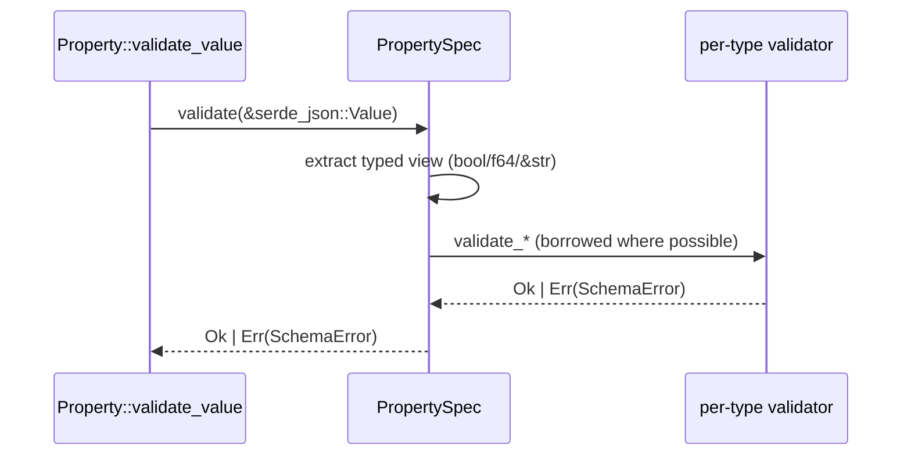
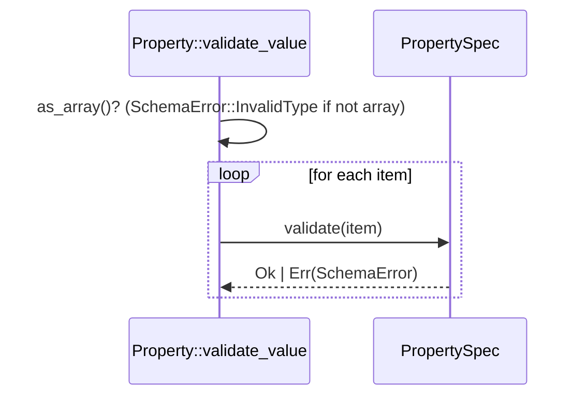

# Tech Spec: PropertySpec (Schema Property Specifications)

## 1. Problem Space (The "Why")

### 1.1 Context & Background

The schema subsystem defines properties with type-specific validation rules.

The module [lithos-core/src/schema/property_spec.rs](../../lithos-core/src/schema/property_spec.rs) is the center of that validation:

- It defines the _validated_ `*Spec` types that carry invariants and are used for runtime validation.
- It validates runtime metadata values (`validate`) using `serde_json::Value` as a universal IR.

Primary consumers:

- [lithos-core/src/schema/property.rs](../../lithos-core/src/schema/property.rs): `Property::validate()` compiles persisted `PropertySpecDef` into validated `PropertySpec`. `Property::validate_value()` calls `spec.validate()` (scalar) or loops and validates array items.

Primary integration point (design intent):

- Raw schema inputs (Serde) should carry a raw spec type (see `RawPropertySpec` below), and schema/property construction compiles it into the validated `PropertySpec`.

Property specification validation is security- and correctness-sensitive. This design specifies behavior that must be true regardless of the implementation details.

#### Observed issues / pain points (design requirements)

The design must explicitly cover and enforce the following:

1. **FileSpec directory restriction uses path component semantics + traversal policy**

- Reject empty paths, `.` / `..` components, absolute paths, and platform prefixes.
- Apply containment checks using `Path` component semantics (not naive string prefix checks).

2. **NumberSpec rejects non-finite values**

- Reject `NaN`, `+∞`, `-∞` for both spec bounds and runtime values.

3. **Regex caching compiles without holding locks and shares compiled regexes**

- Avoid compiling regexes while holding global locks.
- Reuse compiled regexes across validations.

4. **Validation avoids avoidable string allocations**

- Prefer borrowed `&str` views from `serde_json::Value` on hot paths.

5. **String length semantics are explicit**

- Specify whether length is measured in UTF-8 bytes or Unicode scalar values; this design standardizes that choice.

### 1.2 Goals & Non-Goals

**Goals**

- Tighten correctness and security posture:
  - Reject non-finite numeric values (`NaN`, `+∞`, `-∞`) by default.
  - Validate file directory restrictions using path component semantics.
  - Define and enforce a traversal policy for vault-relative paths.
- Improve performance in common validation paths:
  - Remove avoidable allocations from `PropertySpec::validate` for string/date/file values.
  - Remove avoidable allocations from string enum membership checks.
  - Reduce lock contention in regex compilation/caching.
- Clarify behavior contracts:
  - Explicitly define what “min/max” means for strings (bytes vs characters).
  - Improve error messages where the current implementation uses unstructured strings.

**Non-Goals**

- Changing higher-level schema resolution, inheritance, or graph logic.
- Performing filesystem I/O (no `canonicalize`, no existence checks).
- Adding new dependencies. Changes must be achievable with current crates + `std`.
- Avoiding all breaking changes at any cost. (This project is early-stage; if a representation change materially improves correctness/maintainability, it is acceptable with an explicit migration plan.)

### 1.3 Constraints (The Hard Limits)

- **Purity**: property validation must remain deterministic and I/O-free.
- **Thread-safety**: validation and regex caching must remain `Send + Sync`.
- **Schema compatibility**: compatibility is preferred, but early-stage breaking changes are acceptable when they reduce long-term complexity or bug surface area. If we break compatibility, we must document a migration strategy.
- **Error type stability**: existing `SchemaError` variants are used in tests; new variants are allowed, but should be justified.

### 1.4 Definition of Done

- Safety/correctness fixes for validation edge cases are covered by unit tests.
- Existing public APIs either remain compatible, or any breaking changes are explicitly called out in this design and implemented in one cohesive sweep.
- Repo quality gates are green: `mise run fmt`, `mise run lint`, and `mise run test` (or `mise run verify`).

### 1.5 Baseline Behavior Notes (Pre-Change Inventory)

Before implementing changes from this spec, capture/confirm current behavior so we can distinguish “intentional tightening” from accidental breakage:

- **NumberSpec**: min/max/step semantics (inclusive/exclusive), current `NaN`/±∞ handling, step rounding edge cases.
- **StringSpec**: length semantics (bytes vs Unicode scalar values), regex match semantics, enum membership semantics.
- **DateSpec**: accepted formats and timezone handling (chrono parsing behavior).
- **FileSpec**: directory containment semantics, normalization policy, traversal/symlink expectations.

## 2. Guide-Level Explanation (The "What")

### 2.1 User/Dev Experience

This is how schema authors define property specs and how the system validates values.

#### Defining specs (Serde format)

`RawPropertySpec` is internally tagged with `type` and lowercased variants.

Example (YAML-like):

```yaml
# Boolean
{ type: bool }

# Number
{ type: number, min: 0.0, max: 10.0, step: 0.5 }

# String
{ type: string, min_length: 2, max_length: 8, pattern: "^[a-z]+$" }

# Date (chrono format tokens)
{ type: date, format: "%Y-%m-%d" }

# File
{ type: file, directory: "notes/", file_class: "note" }
```

#### Validating a spec

Raw specs (`RawPropertySpec`) are validated/compiled when building `Property` (and by extension when building schema definitions). This produces a validated `PropertySpec` that is safe to use on hot paths.

```rust
use lithos_core::schema::raw::{NumberSpecDef, RawPropertySpec};

let def = RawPropertySpec::Number(NumberSpecDef {
  min: Some(0.0),
  max: Some(10.0),
  step: Some(0.5),
});

let spec = def.try_into_validated()?;
```

#### Validating a runtime value

Metadata values are validated using `serde_json::Value`.

```rust
use lithos_core::schema::property_spec::PropertySpec;
use lithos_core::schema::raw::{RawPropertySpec, StringSpecDef};

let def = RawPropertySpec::String(StringSpecDef {
  min_length: Some(2),
  max_length: Some(8),
  pattern: Some("^[a-z]+$".to_owned()),
  enum_values: None,
});

let spec: PropertySpec = def.try_into_validated()?;
spec.validate(&serde_json::json!("alpha"))?;
```

Array validation is handled one layer up, by `Property::validate_value`.

### 2.2 Mental Model

- A `RawPropertySpec` is the _raw spec input shape_ (Serde-friendly) used by raw schema inputs.
- A `PropertySpec` is the _validated contract_ (invariants guaranteed).
- `try_into_validated()` checks that the contract is coherent and produces the validated form.
- `validate(value)` checks that a runtime value conforms.

Design intent:

- `RawPropertySpec` exists to validate/compile adapter input before `PropertySpec` invariants are relied upon.
- `RawPropertySpec` is not intended as a hot-path runtime validator.

The contract is defined at schema-build time (from raw schema inputs); validation happens at ingestion/query time.

#### Naming note: `RawPropertySpec` vs `PropertySpec`

`Raw*` naming is reserved for adapter-facing schema inputs (schema files being loaded via Serde). Validated spec types (`PropertySpec`) are domain/runtime types with invariants.

Design stance:

1. Define a raw spec type `RawPropertySpec` in `schema::raw` and use it from raw schema inputs (`RawPropertyInline.spec`).
2. Compile/validate that raw spec into the validated `PropertySpec` during schema/property construction.

### 2.3 Modularization Plan (Code Organization)

To keep the schema context maintainable, organize the code so definition types, validated types, and shared helpers are separated:

- `lithos-core/src/schema/property_spec/mod.rs`: public re-exports + module docs.
- `schema/raw.rs`: `RawPropertySpec` and its per-variant `*SpecDef` structs (Serde-only input types).
- `property_spec/validated.rs`: `PropertySpec` and `*Spec` structs + `validate`.
- `property_spec/path.rs`: `VaultRelPath` + `validate_vault_rel_path`.
- `property_spec/regex_cache.rs`: `get_cached_regex` and cache types.
- `property_spec/invariants.rs`: `Bounds`, `FiniteF64`, `Step` and related errors.
- `property_spec/tests.rs` (or keep per-module `#[cfg(test)]`): keep tests close to the relevant module.

## 3. Detailed Design (The "How")

### 3.1 System Architecture

`PropertySpec` is a leaf validator called by the schema domain model.

`RawPropertySpec` is the raw input spec type, compiled at schema-build time into the validated `PropertySpec`.

- `Property::validate()` → compile raw `RawPropertySpec` into validated `PropertySpec`
- `Property::validate_value()` → `PropertySpec::validate()` (or loop for arrays)

`PropertySpec` itself depends on:

- `serde_json` for value IR
- `chrono` for date parsing
- `regex` for pattern validation
- `std::sync` for caching synchronization

### 3.2 Data Models

Naming convention:

- `Raw*` = raw schema input type (Serde)
- `*Spec` = validated runtime contract type (invariants guaranteed)

#### Raw spec representation (schema inputs)

These types are the Serde-facing input shapes used in schema inputs. Their key role is: **validate/compile into `*Spec` before use**.

- `RawPropertySpec` (internally tagged by `type`)
- `BoolSpecDef`, `DateSpecDef`, `FileSpecDef`, `NumberSpecDef`, `StringSpecDef`

They are intentionally “dumb data”: they may be invalid until compiled.

#### Validated spec representation (hot-path runtime)

These types are used for runtime validation, and carry invariants so that invalid states are unrepresentable:

- `PropertySpec`
- `BoolSpec`, `DateSpec`, `FileSpec`, `NumberSpec`, `StringSpec`

Construction happens via compilation/validation:

- `RawPropertySpec::try_into_validated() -> Result<PropertySpec, SchemaError>`

The validated types may use internal helper types (e.g., `Bounds<T>`, `VaultRelPath`, `FiniteF64`, compiled regex handles) and do not need to be Serde-compatible.

#### Internal helper types (used by validated specs)

To improve correctness and reduce repetition, introduce internal helper types used by the validated `*Spec` types:

- `Bounds<T>`: reusable min/max validation (used by `NumberSpec` and `StringSpec` length)
- `FiniteF64`: rejects `NaN` and ±∞ at construction time
- `Step`: guarantees “positive + finite” step increments
- `VaultRelPath`: validates “vault-relative path grammar” for directory and file path strings
- `RegexPattern` / cached compiled regex handle (e.g., `Arc<regex::Regex>`)

### 3.3 Component & Interface Specifications

#### Component: PropertySpec

- **Responsibility**: Validated contract type that validates runtime values against type-specific constraints.
- **Public Interface**:
  - `spec_type(&self) -> PropertySpecType`
    - _Behavior_: returns the type discriminant.
  - `validate(&self, value: &serde_json::Value) -> Result<(), SchemaError>`
    - _Behavior_: validates the provided value against this spec.
    - _Errors_: returns a structured `SchemaError`.

Spec coherence is guaranteed by construction (produced via compilation of `PropertySpecDef`).

#### Component: RawPropertySpec

- **Responsibility**: Raw schema input representation (Serde) for per-property constraints.
  - Used directly by raw property inputs (`RawPropertyInline.spec`).
  - Compiled into the validated `PropertySpec` before runtime validation begins.
- **Public Interface**:
  - `try_into_validated(self) -> Result<PropertySpec, SchemaError>`
    - _Behavior_: validates internal coherence and constructs the validated form.

Error surface expectations (non-exhaustive; aligns with current tests and typical usage patterns):

- Type extraction failures: `SchemaError::InvalidType`
- Date failures: `SchemaError::InvalidDateFormat`
- File path failures: `SchemaError::InvalidDirectoryPath`
- Numeric failures: `SchemaError::NumberOutOfRange`, `SchemaError::InvalidStepValue`
- String failures: `SchemaError::InvalidEnumValue`, `SchemaError::InvalidRegex`
- Generic/other failures: `SchemaError::ValidationFailed`

Invariants:

- No I/O.
- Deterministic.
- Fast for common values.

#### Component: BoolSpec

- **Responsibility**: marker type; ensures JSON type is boolean.
- **Behavior**: always validates after type extraction.

#### Component: DateSpec

- **Responsibility**: validate a string against a chrono format.
- **Contract**:
  - `format` must be non-empty.
  - `validate` checks either `NaiveDateTime::parse_from_str` or `NaiveDate::parse_from_str` against `format`.

Note: This format is **chrono tokens**, not RFC3339 unless the schema uses an RFC3339-like token string.

#### Component: NumberSpec

- **Responsibility**: validate numeric constraints.
- **Contract**:
  - If both present, `min <= max`.
  - If present, `step > 0`.
  - If present, `min`, `max`, and `step` must be finite.
  - Runtime values must be finite.

#### Component: StringSpec

- **Responsibility**: validate string constraints.
- **Contract**:
  - If both present, `min_length <= max_length`.
  - If present, `pattern` must compile.
  - If present, `enum_values` must contain the value.

Length semantics are explicitly defined in this design (see 3.5.4).

#### Component: FileSpec

- **Responsibility**: validate a file reference string (vault-relative).
- **Contract**:
  - If `file_class` is present, it must be non-empty.
  - If `directory` is present, it must be a valid vault-relative directory prefix (see 3.5.2).

Implementation note (repo best practice): even though the persisted representation uses `String`, all internal path operations should be performed via `std::path::Path` / `PathBuf` (never ad-hoc string operations) to align with the project’s “Path Protocol”.

### 3.4 Integration & Data Flow

#### Scalar validation flow



#### Array validation flow



### 3.5 Core Logic & Algorithms

#### 3.5.1 Type-driven development (TDD) improvements

Type-driven development would materially improve this module because the current implementation encodes invariants as ad-hoc runtime checks scattered across methods.

Key opportunities:

1. **Shared min/max invariants**

While NumberSpec uses `min/max` on values and StringSpec uses `min_length/max_length` on lengths, both follow the same _bounds invariants_:

- If both present, `min <= max`.
- Validation is “optional bounds” over an input value.

Introduce a generic helper:

- `Bounds<T> { min: Option<T>, max: Option<T> }` where `T: PartialOrd + Copy`

Used for:

- `Bounds<f64>` in NumberSpec
- `Bounds<usize>` in StringSpec length

This consolidates the invariant and the error paths.

2. **Make invalid states unrepresentable where possible**

Use validated helper types inside the validated `*Spec` structs:

- `FiniteF64` for numeric values and numeric bounds
- `Step` for step increments (positive + finite)
- `VaultRelPath` for vault-relative paths

Persisted `*SpecDef` types can remain simple (`Option<f64>`, `Option<String>`) and are converted into validated types at schema-build time.

3. **Enum values representation (list vs map)**

Today `StringSpec.enum_values: Option<Vec<String>>` is a set-membership constraint.

A map (`BTreeMap<String, String>` or `HashMap<String, String>`) could support:

- display labels
- descriptions
- migration aliases

However, changing the schema format is a compatibility concern. This design treats it as a _future extension_ (see Alternatives), not part of this iteration.

#### 3.5.2 File directory containment (path semantics + traversal policy)

**Current**: string prefix (`starts_with`).

**Proposed**:

- Treat both `FileSpec.directory` and runtime `value` as vault-relative paths.
- Parse using `std::path::Path` and compare using component semantics (`Path::starts_with`).

**Valid VaultRelPath Examples (FileSpec Validation)**:

`VaultRelPath` is used **only** for schema FileSpec directory restrictions.

```rust
// ✅ Valid vault-relative directory paths
VaultRelPath::try_from("notes/")?;
VaultRelPath::try_from("attachments/images/")?;
VaultRelPath::try_from(".")?;  // Root vault directory

// ❌ Invalid
VaultRelPath::try_from("/absolute/path/")?;   // Absolute → Err(AbsolutePath)
VaultRelPath::try_from("../parent/")?;        // Traversal → Err(PathTraversal)
VaultRelPath::try_from("")?;                  // Empty → Err(EmptyPath)
VaultRelPath::try_from("C:\\Windows\\")?;     // Windows prefix → Err(AbsolutePath)
```

**Context Boundary Note**: `VaultRelPath` is schema-domain specific (FileSpec validation). Do NOT confuse with `NotePath` (note context, actual note file paths - see [004-note-models.md](004-note-models.md#322-notepath-validation-examples)).

Traversal policy (I/O-free, conservative):

- Reject absolute paths.
- Reject any path containing `..` components.
- Reject Windows-style prefixes (e.g., `C:`) by rejecting `Component::Prefix`.
- Optionally reject `.` components (or normalize them away).

Containment rule:

- `value_path.starts_with(dir_path)` must be true.
- Additionally, reject the degenerate case where `value_path == dir_path` (directory itself is not a file path).

This keeps validation deterministic and avoids reliance on filesystem state.

Cross-platform note: `std::path::Path` has platform-specific semantics. Vault-relative paths in Lithos should be treated as _syntactic_ “vault paths” (not OS paths). The implementation should explicitly validate components (rejecting `Prefix`/`RootDir`/`ParentDir`) so behavior is consistent across OSes.

#### 3.5.3 Regex caching

**Current**: `OnceLock<Mutex<HashMap<String, Regex>>>`, compile under lock, return cloned `Regex`.

**Proposed**:

- Use `OnceLock` (or `std::sync::LazyLock`) + `RwLock`.
- Store `Arc<regex::Regex>` in the map.

**Pseudocode**:

```rust
fn get_cached_regex(pattern: &str) -> Result<Arc<Regex>, SchemaError> {
    static CACHE: OnceLock<RwLock<HashMap<String, Arc<Regex>>>> = OnceLock::new();
    let cache = CACHE.get_or_init(|| RwLock::new(HashMap::new()));

    // Fast path: read lock
    {
        let lock = cache.read().unwrap_or_else(PoisonError::into_inner);
        if let Some(regex) = lock.get(pattern) {
            return Ok(Arc::clone(regex));
        }
    }

    // Slow path: compile without holding lock
    let compiled = Regex::new(pattern)
        .map_err(|e| SchemaError::InvalidRegex(pattern.to_owned(), e))?;
    let arc = Arc::new(compiled);

    // Insert with write lock (check-before-insert)
    {
        let mut lock = cache.write().unwrap_or_else(PoisonError::into_inner);
        Ok(Arc::clone(lock.entry(pattern.to_owned()).or_insert(arc)))
    }
}
```

**Algorithm**:

1. Read lock: return cached `Arc<Regex>` if present.
2. Miss: compile regex without locks.
3. Write lock: insert if absent; return the stored `Arc`.

This avoids compiling under lock and avoids cloning regex objects.

Poisoning policy: prefer recovering from poisoned locks (`PoisonError::into_inner`) over failing all future validations, since this module is hot-path and used for user-facing errors.

If contention becomes a demonstrated issue, consider a follow-up using a concurrent map (e.g., `dashmap`) or a bounded/LRU cache. This is intentionally deferred in this iteration to avoid adding dependencies and to keep behavior deterministic and simple.

#### 3.5.4 String length semantics

This must be explicit. Options:

- **Bytes** (current): `value.len()`.
- **Unicode scalar values**: `value.chars().count()`.
- **Grapheme clusters**: requires extra crate.

Constraint: no new dependencies.

**String Length Semantics**:

**Current**: Length measured in **UTF-8 bytes** (`value.len()`)

**Rationale**: Simple, fast, matches Rust native string API

**Limitation**: Multi-byte Unicode characters count as multiple "units"

**Example**:
```rust
let text = "café";  // é is 2 bytes
assert_eq!(text.len(), 5);  // bytes: c a f é(2)
assert_eq!(text.chars().count(), 4);  // chars: c a f é
```

**Decision for this iteration**:

- Keep **bytes** semantics to avoid breaking changes.
- Document it explicitly in rustdoc and in schema docs.
- **Future Consideration**: Add `chars().count()` option if user expectations demand it.

#### 3.5.5 Allocation-free validation dispatch

`PropertySpec::validate` should avoid allocating `String` just to satisfy trait types.

Proposed change:

- Introduce borrowed validation methods:
  - `StringSpec::validate_str(&self, value: &str)`
  - `DateSpec::validate_str(&self, value: &str)`
  - `FileSpec::validate_str(&self, value: &str)`

Then `PropertySpec::validate` extracts `&str` from JSON and passes it through without `to_owned()`.

Also remove incidental allocations in `StringSpec::validate_enum` by using a borrowed membership check:

- Prefer `enums.iter().any(|s| s == value)` over `enums.contains(&value.to_owned())`.

If enum lists become large and lookup becomes measurable, consider an internal validated representation that precomputes a set for membership (preferably without changing the persisted schema format).

## 4. Alternatives & Decisions (The "Divergence")

### 4.1 Tactical Decisions

#### Decision: Reject non-finite f64 values

- **Context**: Non-finite floats can bypass min/max and make step validation nonsensical.
- **Choice**: if `!value.is_finite()`, return error.
- **Alternatives**:
  - Allow non-finite: rejected as surprising.
  - Add `allow_non_finite`: possible future extension.

#### Decision: Containment uses Path semantics + rejects traversal segments

- **Context**: Prefix checks are not containment checks.
- **Choice**: use component-based containment; reject `..`.
- **Alternatives**:
  - `canonicalize()` + prefix check: rejected (I/O + symlink complexity).

#### Decision: Keep `enum_values` as a list (for now)

- **Context**: Allowing map form is attractive but adds schema-format complexity and ambiguity.
- **Choice**: keep `Option<Vec<String>>` for this iteration.
- **Alternatives**:
  - `#[serde(untagged)] enum StringEnum { List(Vec<String>), Map(BTreeMap<String,String>) }`.
    - Consider in a follow-up when a concrete UX requirement exists.

## 5. Operational Readiness (The "Reality Check")

### 5.1 Observability

This module is pure. Observability is via surfaced `SchemaError` variants.

Policy:

- Prefer structured variants over free-form strings where feasible.
- Ensure errors include both the failing value and the expected constraint.

### 5.2 Migration Strategy

This is primarily a tightening/refactor. Potential user-visible behavior changes:

- Non-finite numbers are rejected.
- File directory checks become stricter (component-based).

Mitigations:

- Add/extend unit tests that pin behavior.
- Add a short changelog note if this impacts user data.

Compatibility strategy (implementation choice):

- **Additive (preferred)**: introduce stricter internal validation behavior while preserving public API shape; where behavior tightening is user-visible, document it and add targeted tests.
- **Breaking-but-clean**: if tightening requires a public API behavior change, do it in one sweep and update call sites; only acceptable with explicit versioning/release notes.

### 5.3 Test Plan

Tests live alongside the bounded context being validated. For this iteration, the test matrix should at minimum cover:

- **NumberSpec**: finite vs non-finite (`NaN`, `INFINITY`, `NEG_INFINITY`), min/max edges, step rounding/precision edge cases.
- **StringSpec**: length semantics decision (bytes today), regex compile + match, enum membership, empty/none.
- **DateSpec**: accepted formats; confirm timezone behavior implied by chrono parsing functions.
- **FileSpec**: containment positive case, prefix-bypass case, and `..` traversal attempt.

Avoid timing-based tests for caching; validate caching behavior indirectly (e.g., compile once per pattern in a single-threaded test) if needed.

Also: keep tests scoped—avoid PropertySpec tests that indirectly test frontmatter extraction behavior (and vice versa).

### 5.4 Security & Privacy

Improvements:

- More robust directory containment semantics.
- Explicit traversal rejection policy.

No PII, encryption, or access control concerns are introduced here.

## 6. Pre-Mortem (The "Inversion")

- **Risk**: Directory traversal policy rejects legitimate inputs containing `..`.
  - _Mitigation_: Document as vault-relative grammar; normalization can be applied at a higher layer if needed.

- **Risk**: Regex cache grows unbounded if patterns are high-cardinality.
  - _Mitigation_: Patterns should be schema-defined (low cardinality). If needed, add bounded caching later.

- **Risk**: String length semantics (bytes) surprises schema authors.
  - _Mitigation_: Document; add follow-up design decision for `chars().count()` if required.

## 7. Critique & Refinement Log

| Date       | Critique / Issue                                         | Resolution                                                                |
| :--------- | :------------------------------------------------------- | :------------------------------------------------------------------------ |
| 2026-02-02 | "This spec isn’t comprehensive enough."                  | Expanded with explicit contracts, data model, algorithms, and migration.  |
| 2026-02-02 | "Directory restriction is a string prefix check."        | Specify component-based containment + traversal policy.                   |
| 2026-02-02 | "NumberSpec does not reject NaN/∞."                      | Add explicit finite-first numeric validation policy.                      |
| 2026-02-02 | "Regex cache compiles under a mutex and clones Regex."   | Specify `RwLock` + `Arc<Regex>` caching; compile outside locks.           |
| 2026-02-02 | "Can type-driven development improve this?"              | Add internal helper types (`Bounds`, `VaultRelPath`, `PositiveF64`) plan. |
| 2026-02-02 | "String enum_values could be list or key-value mapping." | Record as future extension; preserve current schema format for now.       |

## 8. References

- Rust API Guidelines: https://rust-lang.github.io/api-guidelines/
- `std::convert::TryFrom`: https://doc.rust-lang.org/std/convert/trait.TryFrom.html
- Serde enum representations: https://serde.rs/enum-representations.html
- Chrono docs: https://docs.rs/chrono/latest/chrono/
- `regex` docs: https://docs.rs/regex/latest/regex/
- `std::sync::RwLock`: https://doc.rust-lang.org/std/sync/struct.RwLock.html
- `std::path::Path`: https://doc.rust-lang.org/std/path/struct.Path.html
- `f64` docs: https://doc.rust-lang.org/std/primitive.f64.html
- OWASP Path Traversal: https://owasp.org/www-community/attacks/Path_Traversal

## Appendix A: Idiomatic Rust Review Rubric (Ported From Earlier Plan)

Use a consistent rubric so changes don’t devolve into “refactor by vibes”:

1. **API clarity and ownership**: take borrowed inputs where possible; avoid needless allocation; expose fallible conversions as `Result` with typed errors.
2. **Fallible conversions**: model “this value may not be representable as T” using `TryFrom`/`TryInto` instead of lossy coercions in core APIs.
3. **Parsing and formats are contracts**: date parsing must be explicit about accepted formats/timezones; schema representation must be explicit about Serde tagging and ambiguity.
4. **Avoid avoidable global contention**: avoid compiling regexes while holding a single global exclusive lock; reuse compiled regexes.
5. **Path security/sanity**: directory containment checks should use `Path` semantics (components), not naive string-prefix checks; model traversal threats and normalization/canonicalization tradeoffs explicitly.
6. **Floats allow `NaN`/±∞**: numeric validation should explicitly reject non-finite values unless the spec says otherwise.

## Appendix B: Frontmatter Bounded Context (From Earlier Plan; Out of Scope Here)

The original refactor plan also included a separate bounded context for note/frontmatter extraction. It’s preserved here for completeness, but is not part of this PropertySpec design.

### B.1 Inventory current behavior (frontmatter)

Capture:

- Which frontmatter field types exist (`Boolean`, `Number`, `String`, arrays, objects, dates).
- What each `Frontmatter::get_*` method returns for mismatched types.
- Whether any coercions happen (e.g., “string array” extracting strings only and skipping non-strings).

### B.2 Make “strict extraction” explicit

Problem: permissive coercions can hide data-quality issues and make debugging schema mismatches painful.

Plan:

- Keep today’s convenience getters if needed, but add **strict** APIs:
  - `try_get_*` methods returning `Result<Option<T>, E>` or `Result<T, E>` depending on whether “missing” is distinct from “wrong type”.
  - Implement conversions using `TryFrom<&FieldValue>` (or a small custom trait) so matching is centralized.

Guideline:

- Frontmatter matching should remain _frontmatter-specific_: conversions should match on `FieldValue` variants and return frontmatter-domain errors (not schema errors).

## Appendix C: Current Implementation & Change List (Temporary)

This appendix is intentionally implementation-specific. Remove it once the code matches the design.

Current implementation snapshot:

- Raw schema inputs are defined in `schema::raw`.
- `RawPropertyInline` carries `spec: PropertySpecDef` (current code).
- The main implementation lives in a single file: `lithos-core/src/schema/property_spec.rs`.

Change list (if/when needed):

- Rename/move `PropertySpecDef` → `RawPropertySpec` and relocate it into `schema::raw`.
- Update `RawPropertyInline.spec` to use `RawPropertySpec`.
- Update property/schema construction to compile `RawPropertySpec` → `PropertySpec`.
