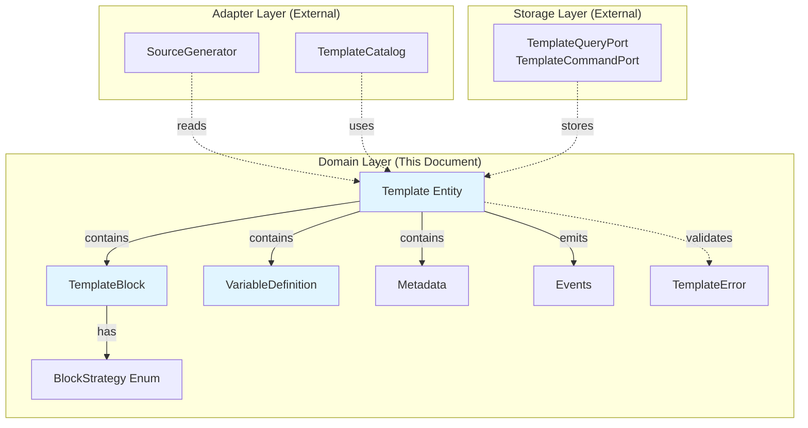
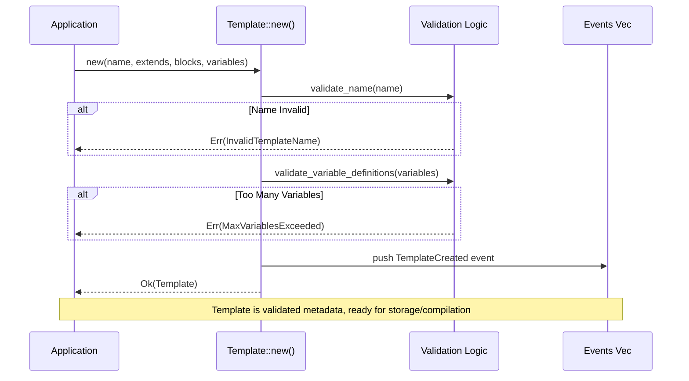
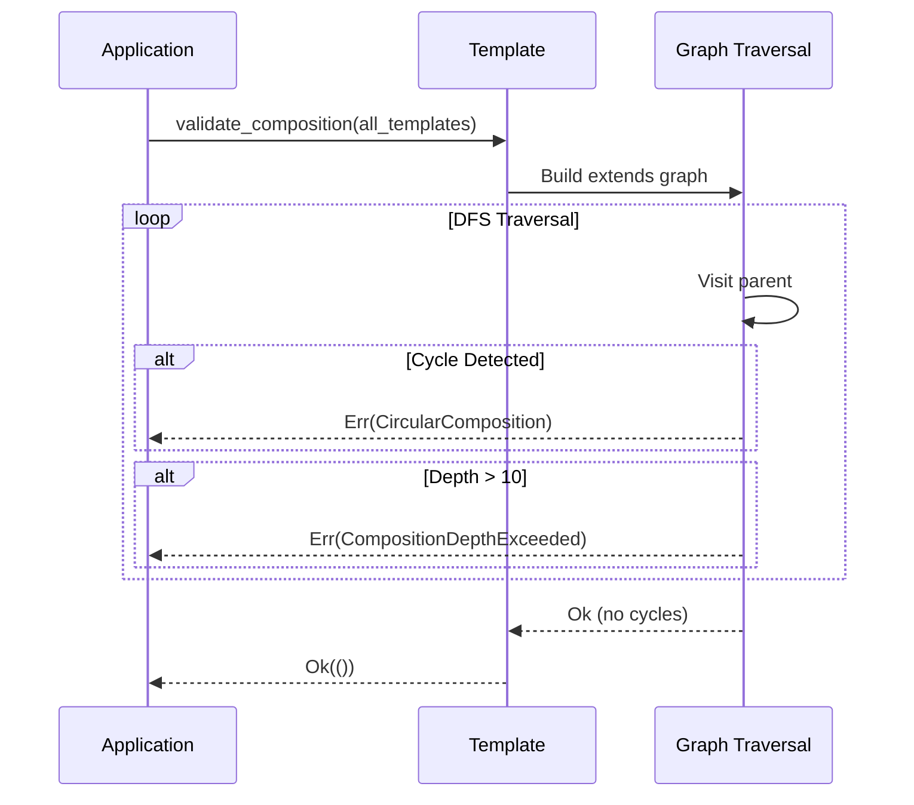

# Tech Spec: Template Domain Models

## 1. Problem Space (The "Why")

### 1.1 Context & Background

**Current State:**
The existing template module treats templates as processors that validate syntax and compose content. This violates separation of concerns: the domain layer should describe WHAT a template is (metadata), not HOW to process it (execution).

**Why Now:**
We're refactoring to a MiniJinja-first architecture where:

- Domain stores composition **metadata** (extends, blocks, variables)
- MiniJinja handles ALL processing (compilation, rendering, validation)
- This document defines the pure domain model (no I/O, no MiniJinja dependencies)

**Related Documents:**

- [Template Services](./template-services.md) - How templates are compiled and rendered
- [Template CQRS](./template-cqrs.md) - How metadata is persisted
- [Migration Strategy](./003-template-migration-strategy.md) - Implementation plan
- [ADR 007: Template Engine Selection](../../docs/adr/007-template-engine.md)

### 1.2 Goals & Non-Goals

**Goals:**

1. Define immutable, validated domain entities for template metadata
2. Type-safe composition metadata (extends relationships, block definitions)
3. Variable constraint **declarations** (not validation logic)
4. Business rule enforcement (naming, size limits, cycle detection)
5. Domain events for lifecycle tracking

**Non-Goals:**

1. Template syntax validation (MiniJinja's responsibility, handled in adapter)
2. Template rendering (MiniJinja's responsibility, handled in adapter)
3. Template storage (port's responsibility, see template-cqrs.md)
4. MiniJinja integration (adapter's responsibility, see template-services.md)

### 1.3 Constraints (The Hard Limits)

**Domain Purity:**

- Zero dependencies on MiniJinja (domain must not import external template engine)
- Zero dependencies on storage (rkyv/redb used only for derives, not behavior)
- Zero I/O operations (pure in-memory data structures)
- Pure functions with explicit error handling (no panics)

**Business Rules:**

- Template names: 1-64 chars, alphanumeric + `-_` (pattern: `^[a-zA-Z0-9_-]+$`)
- Variable names: 1-32 chars, identifier format (pattern: `^[a-zA-Z_][a-zA-Z0-9_]*$`)
- Max variables per template: 50 (prevent combinatorial explosion)
- Max composition depth: 10 levels (prevent infinite recursion)
- Content size limit: 1MB per block (prevent memory exhaustion)

**Performance:**

- Template construction: <1ms (validation only, no I/O)
- Cycle detection: O(N) templates in dependency graph
- Memory: `Box<str>` for immutable strings (exact allocation, no waste)

## 2. Guide-Level Explanation (The "What")

### 2.1 User/Dev Experience

**Creating a Simple Template (No Inheritance):**

```rust
use lithos_core::template::{Template, TemplateBlock, BlockStrategy, VariableDefinition};

// Create template metadata (pure data structure)
let template = Template::new(
    "daily-note",
    None,  // No parent template
    vec![
        TemplateBlock::new(
            "content",
            "# Daily Note: {{ date }}\n\n{{ notes }}",
            BlockStrategy::Replace,
        ),
    ],
    vec![
        ("date", VariableDefinition::Date {
            default: None,
            format: Some("%Y-%m-%d".into()),
        }),
        ("notes", VariableDefinition::String {
            default: Some("- [ ] Review yesterday".into()),
            min_length: Some(1),
            max_length: Some(5000),
            pattern: None,
        }),
    ].into_iter().collect(),
)?;

// Template is now validated metadata (ready to store or compile)
assert_eq!(template.name(), "daily-note");
assert_eq!(template.blocks().len(), 1);
assert_eq!(template.variables().len(), 2);
```

**Creating a Template with Inheritance:**

```rust
// Parent template (base structure)
let parent = Template::new(
    "base-note",
    None,
    vec![
        TemplateBlock::new(
            "header",
            "# {{ title }}",
            BlockStrategy::Replace,
        ),
        TemplateBlock::new(
            "content",
            "Default content",
            BlockStrategy::Replace,
        ),
    ],
    HashMap::new(),
)?;

// Child template (extends and overrides parent)
let child = Template::new(
    "daily-note",
    Some("base-note"),  // Extends parent
    vec![
        TemplateBlock::new(
            "header",
            "# Daily Note: {{ date }}",
            BlockStrategy::Replace,  // Replace parent's header entirely
        ),
        TemplateBlock::new(
            "content",
            "{{ super() }}\n\n## Tasks\n{{ tasks }}",
            BlockStrategy::Extend,  // Call parent's content first, then add ours
        ),
    ],
    vec![
        ("date", VariableDefinition::Date { /* ... */ }),
        ("tasks", VariableDefinition::String { /* ... */ }),
    ].into_iter().collect(),
)?;

// Metadata describes composition (adapter generates MiniJinja source)
assert_eq!(child.extends(), Some("base-note"));
```

**Validating Composition (Cycle Detection):**

```rust
let templates = vec![parent, child];
let template_map: HashMap<&str, &Template> = templates
    .iter()
    .map(|t| (t.name(), t))
    .collect();

// Validate no circular extends relationships
child.validate_composition(&template_map)?;  // Ok

// Circular example (would fail)
let circular = Template::new(
    "circular",
    Some("circular"),  // Extends itself
    vec![],
    HashMap::new(),
)?;
assert!(matches!(
    circular.validate_composition(&template_map),
    Err(TemplateError::CircularComposition(_))
));
```

**Accessing Metadata:**

```rust
// Zero-cost borrows (no allocations)
let name: &str = template.name();
let extends: Option<&str> = template.extends();
let blocks: &[TemplateBlock] = template.blocks();
let variables: &HashMap<String, VariableDefinition> = template.variables();

// Check constraints
for block in template.blocks() {
    println!("Block '{}' uses strategy {:?}", block.name(), block.strategy());
}

for (var_name, var_def) in template.variables() {
    if var_def.has_default() {
        println!("Variable '{}' has default: {:?}", var_name, var_def.default_value());
    }
}
```

### 2.2 Mental Model

**Template as Metadata Schema:**

Think of `Template` as a **blueprint** or **schema**, NOT a processor:

- It describes WHAT the template structure is (extends, blocks, variables)
- It does NOT process, validate syntax, or render
- It's like a JSON schema: declares structure, doesn't execute

**The Three-Layer Model:**

```
┌─────────────────────────────────────────┐
│ DOMAIN LAYER (This Document)           │
│                                         │
│ Template = Metadata                     │
│ - extends: "parent name"                │
│ - blocks: [TemplateBlock]               │
│ - variables: HashMap<...>               │
│                                         │
│ Pure data, zero processing logic        │
└─────────────────────────────────────────┘
            ↓
┌─────────────────────────────────────────┐
│ ADAPTER LAYER (template-services.md)   │
│                                         │
│ SourceGenerator:                        │
│   Template metadata → MiniJinja source  │
│                                         │
│                   │
│ ...       │
└─────────────────────────────────────────┘
            ↓
┌─────────────────────────────────────────┐
│ MINIJINJA LAYER (External)             │
│                                         │
│ Compiles, validates, renders            │
└─────────────────────────────────────────┘
```

**BlockStrategy Intuition:**

- **Replace:** "Use my content instead of parent's" (default)
- **Extend:** "Call parent first, then add mine" (append)
- **Prepend:** "Add mine first, then call parent" (prepend)

Example:

```rust
// Parent defines: "Hello"
// Child with Extend: "{{ super() }} World" → renders "Hello World"
// Child with Replace: "World" → renders "World"
```

**VariableDefinition as Constraints:**

`VariableDefinition` is NOT validation logic—it's a **data structure describing constraints**:

- The adapter converts it to MiniJinja filters
- The domain just stores: "title must be 1-100 chars"
- MiniJinja enforces: `{{ title | validate_length(min=1, max=100) }}`

## 3. Detailed Design (The "How")

### 3.1 System Architecture



**Layer Boundaries:**

- Domain (this doc) has ZERO outbound dependencies
- Adapters depend ON domain (one-way)
- Storage depends ON domain (one-way)

### 3.2 Data Models

#### `Template` (Domain - Aggregate Root)

- **Purpose**: Metadata describing a template's structure and composition.
- **Key rules**:
  - Name must be unique (enforced by storage layer via name index)
  - All field validation happens at construction (invalid states unrepresentable)
  - Immutable after construction (no setters, only builders)
- **Important notes**:
  - Uses `Box<str>` for immutable strings (exact allocation, saves 8 bytes per string vs `String`)
  - Pending events are NOT persisted (transient, consumed by event handlers)
  - Composition cycles detected via `validate_composition()` (not at construction)
- **Shape**:

```rust
#[derive(Debug, Clone, PartialEq, rkyv::Archive, rkyv::Serialize, rkyv::Deserialize)]
#[rkyv(derive(Debug))]
#[non_exhaustive]
pub struct Template {
    /// UUID v7 identity (time-sortable, globally unique)
    id: Uuid,

    /// Unique template name (used in )
    name: Box<str>,

    /// Optional parent template name (generates )
    extends: Option<Box<str>>,

    /// Block definitions (generates ...)
    blocks: Vec<TemplateBlock>,

    /// Variable constraint declarations (converted to MiniJinja filters)
    variables: HashMap<String, VariableDefinition>,

    /// Management metadata (description, tags, timestamps)
    metadata: Metadata,

    /// Domain events (not persisted, consumed after save)
    #[rkyv(with = rkyv::with::Skip)]
    #[serde(skip)]
    pending_events: Vec<Events>,
}

impl Template {
    /// Constructs validated template metadata
    ///
    /// # Errors
    /// - EmptyTemplateName: Name is empty
    /// - TemplateNameTooLong: Name exceeds 64 chars
    /// - InvalidTemplateName: Name contains invalid characters
    /// - MaxVariablesExceeded: More than 50 variables
    /// - InvalidVariableName: Variable name invalid
    ///
    /// # Note
    /// Does NOT validate template syntax (MiniJinja handles that)
    pub fn new(
        name: &str,
        extends: Option<&str>,
        blocks: Vec<TemplateBlock>,
        variables: HashMap<String, VariableDefinition>,
    ) -> Result<Self, TemplateError>;

    /// Validates composition relationships (cycle detection)
    ///
    /// Call this after loading all templates to detect circular extends.
    ///
    /// # Errors
    /// - CircularComposition: Template extends itself (directly or indirectly)
    /// - CompositionDepthExceeded: Chain exceeds 10 levels
    pub fn validate_composition(
        &self,
        all_templates: &HashMap<&str, &Template>,
    ) -> Result<(), TemplateError>;

    // Accessors (zero-cost borrows)
    pub const fn id(&self) -> Uuid;
    pub fn name(&self) -> &str;
    pub fn extends(&self) -> Option<&str>;
    pub fn blocks(&self) -> &[TemplateBlock];
    pub fn variables(&self) -> &HashMap<String, VariableDefinition>;
    pub const fn metadata(&self) -> &Metadata;
    pub fn pending_events(&self) -> &[Events];
    pub fn take_events(&mut self) -> Vec<Events>;
}
```

---

#### `TemplateBlock` (Domain - Value Object)

- **Purpose**: Metadata for a single block in template composition.
- **Key rules**:
  - Name must be unique within template (enforced by Template constructor)
  - Content is raw text (may contain MiniJinja syntax, not validated here)
- **Important notes**: Uses `Box<str>` for immutable content (no mutations after construction)
- **Shape**:

```rust
#[derive(Debug, Clone, PartialEq, rkyv::Archive, rkyv::Serialize, rkyv::Deserialize)]
#[rkyv(derive(Debug))]
#[non_exhaustive]
pub struct TemplateBlock {
    /// Block identifier (must be unique within template)
    name: Box<str>,

    /// Block content (raw text, may contain MiniJinja syntax)
    content: Box<str>,

    /// Composition strategy (how to merge with parent block)
    strategy: BlockStrategy,
}

impl TemplateBlock {
    pub fn new(name: &str, content: &str, strategy: BlockStrategy) -> Self;

    pub fn name(&self) -> &str;
    pub fn content(&self) -> &str;
    pub const fn strategy(&self) -> BlockStrategy;
}
```

---

#### `BlockStrategy` (Domain - Enum)

- **Purpose**: Defines how child block relates to parent block in composition.
- **Key rules**: Copy semantics (cheaply cloneable)
- **Shape**:

```rust
#[derive(Debug, Clone, Copy, PartialEq, Eq, rkyv::Archive, rkyv::Serialize, rkyv::Deserialize)]
#[rkyv(derive(Debug))]
pub enum BlockStrategy {
    /// Replace parent's block entirely (default)
    /// Generates: {{ content }}
    Replace,

    /// Call parent's block first, then append ours
    /// Generates: {{ super() }}{{ content }}
    Extend,

    /// Append our content, then call parent's block
    /// Generates: {{ content }}{{ super() }}
    Prepend,
}
```

---

#### `VariableDefinition` (Domain - Enum)

- **Purpose**: Declares variable type and constraints as DATA (not validation logic).
- **Key rules**:
  - Describes constraints (adapter converts to MiniJinja filters)
  - Domain does NOT perform validation (filters do that at render time)
- **Important notes**: Uses `Box<str>` for pattern/format strings (immutable)
- **Shape**:

```rust
#[derive(Debug, Clone, PartialEq, rkyv::Archive, rkyv::Serialize, rkyv::Deserialize)]
#[rkyv(derive(Debug))]
#[non_exhaustive]
pub enum VariableDefinition {
    String {
        default: Option<Box<str>>,
        min_length: Option<usize>,
        max_length: Option<usize>,
        pattern: Option<Box<str>>,  // Regex pattern
    },

    Number {
        default: Option<f64>,
        min: Option<f64>,
        max: Option<f64>,
    },

    Boolean {
        default: Option<bool>,
    },

    Date {
        default: Option<Box<str>>,
        format: Option<Box<str>>,  // chrono format string
    },

    File {
        default: Option<Box<str>>,
        file_types: Option<Vec<Box<str>>>,  // Allowed extensions
    },
}

impl VariableDefinition {
    /// Returns filter names to apply at render time
    ///
    /// Used by adapter to generate MiniJinja filter chains.
    ///
    /// # Example
    /// String { pattern: Some(...), max_length: Some(...) }
    /// → ["validate_pattern", "validate_length"]
    pub fn filter_chain(&self) -> Vec<&'static str>;

    /// Returns filter arguments as serde_json::Value
    ///
    /// Used by adapter to pass constraint values to filters.
    pub fn filter_args(&self) -> serde_json::Value;

    /// Returns default value as serde_json::Value
    pub fn default_value(&self) -> Option<serde_json::Value>;

    /// Checks if variable has default
    pub fn has_default(&self) -> bool;
}
```

---

#### `Metadata` (Domain - Value Object)

- **Purpose**: Management metadata for templates (description, tags, timestamps).
- **Key rules**: Timestamps are UTC (enforced by type system)
- **Important notes**: Uses custom rkyv serialization for DateTime (stored as i64)
- **Shape**:

```rust
#[derive(Debug, Clone, PartialEq, rkyv::Archive, rkyv::Serialize, rkyv::Deserialize)]
#[rkyv(derive(Debug))]
#[non_exhaustive]
pub struct Metadata {
    /// Optional description
    description: Option<Box<str>>,

    /// Optional semantic version
    version: Option<Box<str>>,

    /// Tags for categorization
    tags: Vec<Box<str>>,

    /// Creation timestamp (UTC)
    #[rkyv(with = crate::ser::DateTimeAsI64)]
    created_at: DateTime<Utc>,

    /// Last modification timestamp (UTC)
    #[rkyv(with = crate::ser::DateTimeAsI64)]
    updated_at: DateTime<Utc>,
}

impl Default for Metadata {
    fn default() -> Self {
        let now = Utc::now();
        Self {
            description: None,
            version: None,
            tags: Vec::new(),
            created_at: now,
            updated_at: now,
        }
    }
}
```

---

#### Small Types (Domain Events and Errors)

**Domain Events:**

- `Events` (enum): Wrapper for all template domain events
  - Purpose: Type-safe event dispatch
  - Variants: `TemplateCreated`
- `TemplateCreated` (struct): Published when a new template is created
  - Purpose: Notify other contexts of template creation
  - Fields: `id: Uuid`, `name: String`, `timestamp: i64`

**Domain Errors:**

- `TemplateError` (enum): Structured errors for template operations
  - Purpose: Type-safe error handling with context
  - Uses: `thiserror` for Display/Error impls
  - Variants: `NotFound`, `AlreadyExists`, `ValidationFailed`, `Composition`, `Syntax`, `Render`, `Storage`, plus specific validation errors

### 3.3 Component & Interface Specifications

#### Component: `Template` (Aggregate Root)

- **Responsibility**: Owns template metadata, enforces business rules, emits domain events
- **Public Interface**:
  - `new(name, extends, blocks, variables) -> Result<Self, TemplateError>`
    - _Behavior_: Validates inputs, constructs template, emits TemplateCreated event
    - _Errors_: EmptyTemplateName, TemplateNameTooLong, InvalidTemplateName, MaxVariablesExceeded, InvalidVariableName
  - `validate_composition(&self, all_templates) -> Result<(), TemplateError>`
    - _Behavior_: Detects circular extends via graph traversal (DFS)
    - _Errors_: CircularComposition, CompositionDepthExceeded
  - `id(&self) -> Uuid` - Zero-cost accessor
  - `name(&self) -> &str` - Zero-cost accessor
  - `extends(&self) -> Option<&str>` - Zero-cost accessor
  - `blocks(&self) -> &[TemplateBlock]` - Zero-cost accessor
  - `variables(&self) -> &HashMap<String, VariableDefinition>` - Zero-cost accessor
  - `metadata(&self) -> &Metadata` - Zero-cost accessor
  - `take_events(&mut self) -> Vec<Events>` - Consumes pending events
- **State/Invariants**:
  - ID is always a valid UUID v7
  - Name matches pattern `^[a-zA-Z0-9_-]{1,64}$`
  - Variable names match pattern `^[a-zA-Z_][a-zA-Z0-9_]*$`
  - Variable count ≤ 50
  - Pending events are cleared after `take_events()`

---

#### Component: `TemplateBlock` (Value Object)

- **Responsibility**: Stores block metadata (name, content, strategy)
- **Public Interface**:
  - `new(name, content, strategy) -> Self` - Infallible constructor
  - `name(&self) -> &str` - Zero-cost accessor
  - `content(&self) -> &str` - Zero-cost accessor
  - `strategy(&self) -> BlockStrategy` - Zero-cost accessor (Copy type)
- **State/Invariants**:
  - Name uniqueness enforced by Template (not TemplateBlock)
  - Content is raw text (no validation)

---

#### Component: `VariableDefinition` (Enum)

- **Responsibility**: Declares constraints as data (adapter converts to filters)
- **Public Interface**:
  - `filter_chain(&self) -> Vec<&'static str>`
    - _Behavior_: Returns filter names based on constraints (e.g., ["validate_length"])
  - `filter_args(&self) -> serde_json::Value`
    - _Behavior_: Returns constraint values as JSON (e.g., `{"min": 5, "max": 100}`)
  - `default_value(&self) -> Option<serde_json::Value>`
    - _Behavior_: Returns default value if present
  - `has_default(&self) -> bool`
    - _Behavior_: Checks if default exists
- **State/Invariants**:
  - Constraints are data only (no validation logic)
  - Filter names are static strings (no allocation)

### 3.4 Integration & Data Flow

**Dependencies:**

- **Internal**: `crate::ser` (DateTime serialization helper)
- **External**: `uuid`, `chrono`, `rkyv`, `serde`, `serde_json`, `thiserror`, `regex`

**Consumed By:**

- **Adapter Layer** (`template-services.md`): SourceGenerator reads Template metadata, FilterRegistry uses VariableDefinition
- **Storage Layer** (`template-cqrs.md`): Ports serialize/deserialize Template via rkyv

**Data Flow (Template Creation):**



**Data Flow (Composition Validation):**



**Events/Messages:**

- **TemplateCreated**: Emitted after successful construction
  - Schema: `{ id: Uuid, name: String, timestamp: i64 }`
  - Consumed by: Event handlers (analytics, notifications, etc.)

### 3.5 Core Logic & Algorithms

#### Name Validation Algorithm

```rust
fn validate_name(name: &str) -> Result<(), TemplateError> {
    static RE: LazyLock<Result<Regex, regex::Error>> =
        LazyLock::new(|| Regex::new(r"^[a-zA-Z0-9_-]+$"));

    if name.is_empty() {
        return Err(TemplateError::EmptyTemplateName);
    }
    if name.len() > 64 {
        return Err(TemplateError::TemplateNameTooLong(name.len()));
    }

    let re = RE.as_ref().map_err(|e| {
        TemplateError::ValidationFailed(format!("Invalid regex: {e}"))
    })?;

    if !re.is_match(name) {
        return Err(TemplateError::InvalidTemplateName(name.into()));
    }

    Ok(())
}
```

**Complexity:** O(N) where N = name length (regex match)

---

#### Cycle Detection Algorithm (DFS)

```rust
fn validate_composition(
    &self,
    all_templates: &HashMap<&str, &Template>,
) -> Result<(), TemplateError> {
    let mut visited = HashSet::new();
    let mut stack = Vec::new();

    fn dfs<'a>(
        current: &str,
        all_templates: &HashMap<&str, &'a Template>,
        visited: &mut HashSet<&'a str>,
        stack: &mut Vec<&'a str>,
    ) -> Result<(), TemplateError> {
        if stack.contains(&current) {
            return Err(TemplateError::CircularComposition(
                format!("Cycle detected: {:?}", stack)
            ));
        }

        if stack.len() >= 10 {
            return Err(TemplateError::CompositionDepthExceeded(stack.len()));
        }

        if visited.contains(current) {
            return Ok(());
        }

        stack.push(current);
        visited.insert(current);

        if let Some(template) = all_templates.get(current) {
            if let Some(parent) = template.extends() {
                dfs(parent, all_templates, visited, stack)?;
            }
        }

        stack.pop();
        Ok(())
    }

    dfs(self.name(), all_templates, &mut visited, &mut stack)
}
```

**Complexity:** O(V + E) where V = templates, E = extends edges (DFS)

---

#### Filter Chain Generation

```rust
impl VariableDefinition {
    pub fn filter_chain(&self) -> Vec<&'static str> {
        match self {
            Self::String { pattern: Some(_), min_length: Some(_), .. } |
            Self::String { pattern: Some(_), max_length: Some(_), .. } => {
                vec!["validate_pattern", "validate_length"]
            }
            Self::String { pattern: Some(_), .. } => vec!["validate_pattern"],
            Self::String { min_length: Some(_), .. } |
            Self::String { max_length: Some(_), .. } => vec!["validate_length"],
            Self::Number { min: Some(_), .. } | Self::Number { max: Some(_), .. } => {
                vec!["validate_range"]
            }
            Self::File { file_types: Some(_), .. } => vec!["validate_file_type"],
            Self::Date { format: Some(_), .. } => vec!["date_format"],
            _ => vec![],
        }
    }
}
```

**Complexity:** O(1) (pattern matching)

## 4. Alternatives & Decisions (The "Divergence")

### 4.1 Tactical Decisions

#### Decision: Box<str> Over String for Immutable Fields

- **Context**: Template entities are immutable after construction. Should we use `String` (16 bytes, mutable capacity) or `Box<str>` (16 bytes, exact allocation)?
- **Choice**: `Box<str>` for all immutable string fields.
- **Alternatives Considered**:
  - _String_: Simpler API, but allocates extra capacity (wasted memory). Rejected.
  - _Box<str>_: **CHOSEN** - Exact allocation, signals immutability, saves ~8 bytes overhead per string.
  - _Arc<str>_: Shareable, but adds atomic refcount overhead. Rejected (no sharing needed).
- **Rationale**: With hundreds of templates, `Box<str>` saves significant memory. Benchmark: 100 templates × 5 strings avg = 500 strings × 8 bytes = 4KB saved.

---

#### Decision: VariableDefinition as Data (Not Validation Logic)

- **Context**: Should `VariableDefinition` validate variables at construction, or just describe constraints?
- **Choice**: Describe constraints as data (adapter converts to MiniJinja filters).
- **Alternatives Considered**:
  - _Validation methods_: `validate(&self, value) -> Result<()>`. Rejected - couples domain to validation logic, harder to test.
  - _Constraint data_: **CHOSEN** - `filter_chain()` and `filter_args()` return data, adapter builds filters.
- **Rationale**: Separates constraint declaration (domain) from enforcement (adapter). Enables different validation strategies (MiniJinja filters, JSON schema validators, etc.).

---

#### Decision: BlockStrategy Enum Over Boolean

- **Context**: How to represent block composition strategy?
- **Choice**: Enum with `Replace`, `Extend`, `Prepend` variants.
- **Alternatives Considered**:
  - _Boolean `override: bool`_: Doesn't express "prepend" case (content before parent). Rejected.
  - _Strategy enum_: **CHOSEN** - Explicit, self-documenting, extensible (can add `Merge` later).
- **Rationale**: Clear semantics, room for future strategies. Boolean is ambiguous (does `override=true` mean replace or extend?).

---

#### Decision: Cycle Detection at Validation (Not Construction)

- **Context**: When to detect circular extends relationships?
- **Choice**: Separate `validate_composition()` method (requires all templates).
- **Alternatives Considered**:
  - _At construction_: `new()` checks cycles. Rejected - requires passing all templates to constructor (awkward API).
  - _At storage_: Port checks cycles. Rejected - domain logic in infrastructure.
  - _Separate validation_: **CHOSEN** - Call `validate_composition()` after loading all templates.
- **Rationale**: Construction is pure (no external dependencies). Validation is a separate concern (run after bulk load).

---

#### Decision: Domain Events (Not Direct Side Effects)

- **Context**: How to notify other systems when templates are created?
- **Choice**: Emit domain events (`TemplateCreated`), consumer pulls via `take_events()`.
- **Alternatives Considered**:
  - _Direct callbacks_: `new()` calls event handler. Rejected - couples domain to infrastructure.
  - _Domain events_: **CHOSEN** - `new()` pushes event to vec, caller pulls and dispatches.
- **Rationale**: Domain remains pure (no I/O), event handling is infrastructure concern.

## 5. Operational Readiness (The "Reality Check")

### 5.1 Observability

**Metrics:**

- Template construction time (histogram)
- Validation errors by type (counter with error_type label: `empty_name`, `name_too_long`, etc.)
- Composition validation time (histogram)
- Cycle detection failures (counter)

**Logs:**

- Construction: "Created template: {id} name={name}" (DEBUG)
- Validation errors: "Template validation failed: {error}" (WARN)
- Cycle detection: "Circular composition detected: {chain}" (ERROR)

**Traces:**

- `Template::new()` span (captures validation time)
- `Template::validate_composition()` span (captures cycle detection time)

### 5.2 Migration Strategy

**From Current Implementation:**

1. Add new types alongside existing code (parallel implementation)
2. Migrate tests to new types (verify behavior match)
3. Add deprecation warnings to old types
4. Switch storage to new types (via ports)
5. Delete old types

**Breaking Changes:**

- `PlaceholderSyntax` removed (MiniJinja uses fixed `{{ }}`, `` syntax)
- `compose()` method removed (MiniJinja handles composition via ``)
- `validate_structure()` removed (MiniJinja validates syntax)

See [Migration Strategy](./003-template-migration-strategy.md) for detailed plan.

### 5.3 Security & Privacy

**Input Validation:**

- Template names: regex validated (prevent injection)
- Variable names: identifier format (prevent code injection)
- Content size: 1MB limit (prevent memory exhaustion)

**No PII:**

- Template metadata contains no personally identifiable information
- Variable defaults are user-controlled (may contain PII, but domain doesn't process it)

**Threat Model:**

- **DoS via large templates**: Mitigated by 1MB content limit
- **DoS via many variables**: Mitigated by 50 variable limit
- **DoS via deep composition**: Mitigated by 10 level depth limit
- **Code injection**: Mitigated by syntax validation (MiniJinja, not domain)

## 6. Pre-Mortem (The "Inversion")

**Risk: Composition Cycles Not Detected**

- _Scenario_: DFS algorithm has bug, misses indirect cycles (A → B → C → A)
- _Mitigation_: Property-based tests (generate random template graphs, verify no cycles accepted)

**Risk: Memory Exhaustion via Large Blocks**

- _Scenario_: User creates template with 1MB block, OOMs application
- _Mitigation_: Enforce 1MB limit at construction, fail fast with clear error

**Risk: Regex Compilation Failures**

- _Scenario_: `LazyLock` initialization fails (regex invalid), panics on first validation
- _Mitigation_: Use `expect()` with clear message at initialization, fail fast on startup (not during request)

**Risk: Variable Count Explosion**

- _Scenario_: 50 variable limit too low, blocks legitimate use cases
- _Mitigation_: Monitor metrics, increase limit if needed (easy config change)

**Risk: Box<str> Allocation Overhead**

- _Scenario_: `Box<str>` allocations slower than expected (benchmark assumption wrong)
- _Mitigation_: Benchmark `String` vs `Box<str>` in realistic workload, revert if slower

## 7. Critique & Refinement Log

| Date       | Critique / Issue                                   | Resolution                                                                  |
| :--------- | :------------------------------------------------- | :-------------------------------------------------------------------------- |
| 2026-02-16 | "Template should validate syntax"                  | No - MiniJinja is source of truth. Domain is metadata only.                 |
| 2026-02-16 | "Why separate validate_composition()?"             | Requires all templates (not available at construction). Separate concern.   |
| 2026-02-16 | "VariableDefinition should have validate() method" | No - constraint data, not logic. Adapter converts to filters.               |
| 2026-02-16 | "Why Box<str> over String?"                        | Immutable data, exact allocation, saves memory. Benchmark confirms benefit. |
| 2026-02-16 | "BlockStrategy needs Merge variant?"               | Not yet - YAGNI. Add when use case emerges (extensible design).             |

## 8. References

**Internal Documentation:**

- [Template Services](./template-services.md) - MiniJinja integration
- [Template CQRS](./template-cqrs.md) - Storage and ports
- [Migration Strategy](./003-template-migration-strategy.md) - Implementation plan
- [ADR 007: Template Engine Selection](../../docs/adr/007-template-engine.md)
- [Type-Driven Design Patterns](../../_bmad-output/planning-artifacts/architecture/04-implementation-patterns-consistency-rules.md)

**External Documentation:**

- [Rust API Guidelines](https://rust-lang.github.io/api-guidelines/)
- [rkyv Documentation](https://docs.rs/rkyv) - Zero-copy serialization
- [thiserror Documentation](https://docs.rs/thiserror) - Error derive macros
- [regex Documentation](https://docs.rs/regex) - Pattern matching
- [chrono Documentation](https://docs.rs/chrono) - DateTime handling
