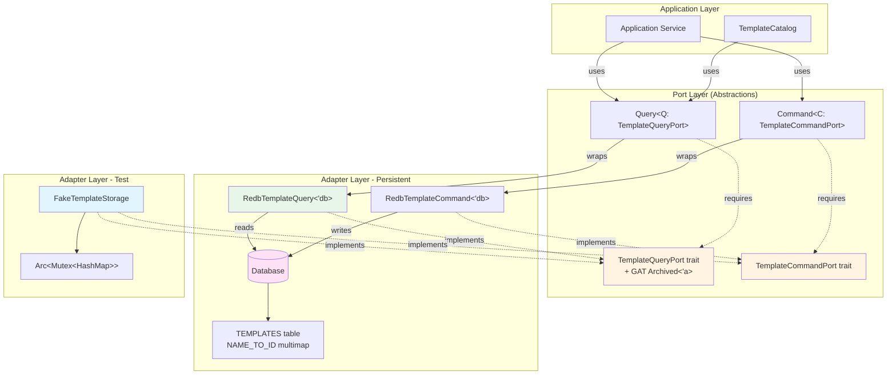
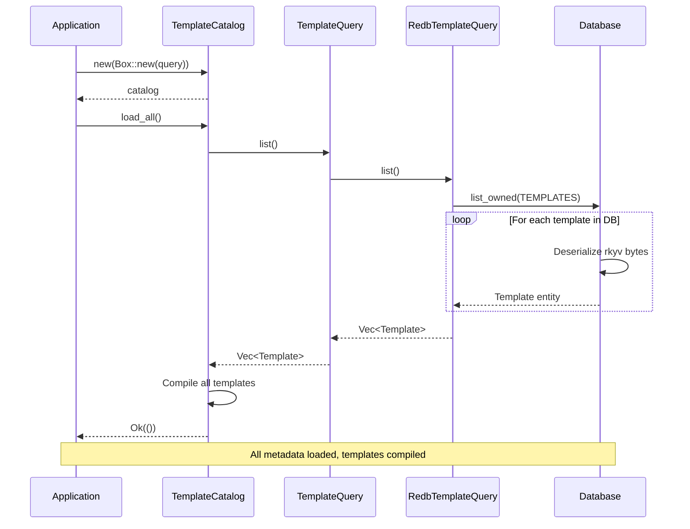
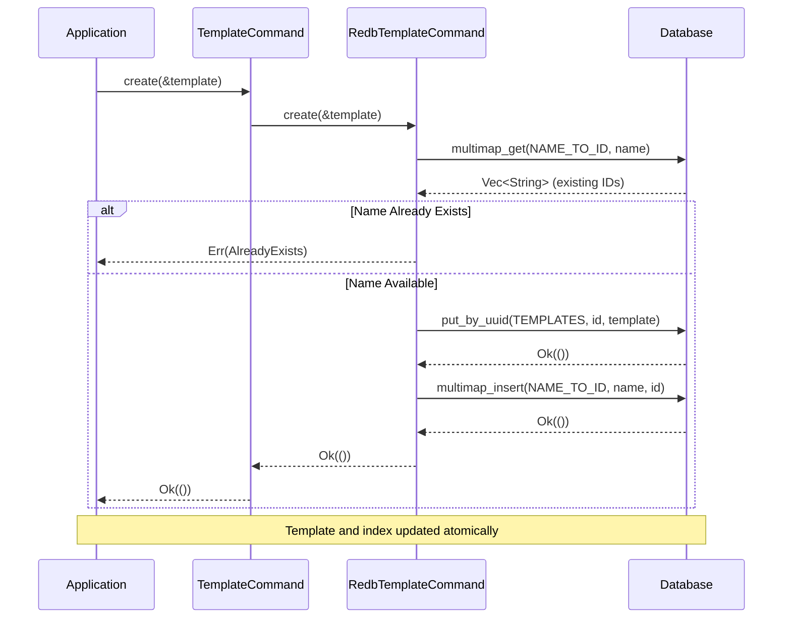
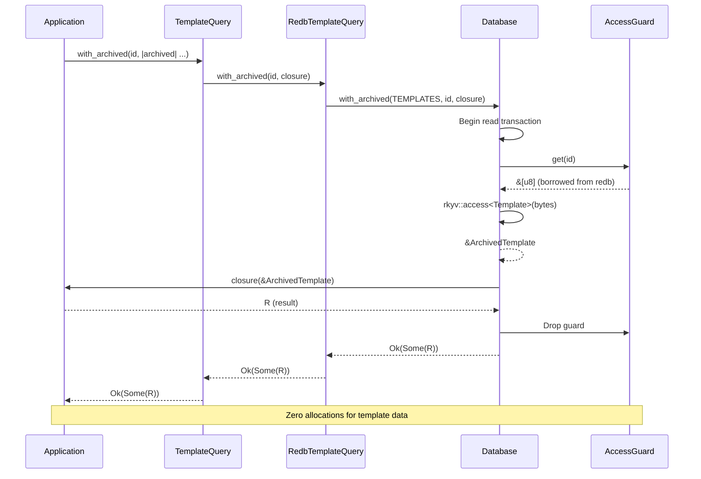

# Tech Spec: Template Storage & CQRS Ports

## 1. Problem Space (The "Why")

### 1.1 Context & Background

**Current State:**
The template module lacks a proper port-based storage abstraction. It needs to align with the established patterns from note, schema, and config modules: split Query/Command ports with GAT-based zero-copy reads.

**Why Now:**
In the MiniJinja-first architecture, storage serves TWO distinct purposes:

1. **Persistent Metadata Storage:** Template entities (domain metadata) stored in redb
2. **Ephemeral Compiled Cache:** MiniJinja Environment (in-memory, never persisted)

This document focuses on #1 (persistent metadata). The compiled cache is covered in `template-services.md`.

**The Critical Distinction:**

- **What We Store:** Template metadata (extends, blocks, variables) - persistent
- **What We DON'T Store:** Compiled MiniJinja templates - ephemeral, rebuilt on startup

**Related Documents:**

- [Template Models](./template-models.md) - Domain entities being persisted
- [Template Services](./template-services.md) - How metadata becomes compiled templates
- [Design Doc 012: CQRS Concrete Over Port](../design/012-cqrs-concrete-over-port.md) - Port pattern reference
- [ADR 006: Persistence & Cache Infrastructure](../../docs/adr/006-persistence-cache-infrastructure.md)

### 1.2 Goals & Non-Goals

**Goals:**

1. **Port-Based CQRS:** Split TemplateQueryPort and TemplateCommandPort traits (aligned with note/schema)
2. **GAT Zero-Copy Reads:** Metadata accessed via `with_archived()` closure pattern
3. **Metadata-Only Persistence:** Store Template entities (NOT compiled templates)
4. **Efficient Indexing:** Query by name (O(log N)), list all (O(N)), UUID primary key (O(1))
5. **Test Fakes:** In-memory port implementations for fast, deterministic testing
6. **Transactional Writes:** Template + name index updated atomically

**Non-Goals:**

1. **Persisting Compiled Templates:** Arc<Environment> is in-memory only, rebuilt on startup
2. **Lazy Compilation:** Not a storage concern (handled by TemplateCatalog)
3. **Template Versioning:** Single latest version per name (no history tracking)
4. **Schema Migration:** Assume rkyv format stability (breaking changes require manual migration)
5. **Cross-Template Transactions:** Each template write is independent (no batch semantics in ports)

### 1.3 Constraints (The Hard Limits)

**Architectural Constraints:**

- **Port Pattern Alignment:** MUST match note/schema/config module patterns exactly
- **Zero-Copy Priority:** Reads MUST use GAT + closure pattern (no self-referential structs)
- **UUID v7 Keys:** Primary key is UUID (time-sortable, globally unique)
- **Name Index:** Secondary index for name → ID lookup (unique names enforced)
- **Single Database:** All contexts share one Database instance (transaction scope)

**Performance Constraints:**

- **Metadata Read:** <1ms for single template lookup (zero-copy via redb guard)
- **Metadata Write:** <5ms for single template save (rkyv serialization + index update)
- **Bulk Load:** <50ms for 100 templates (sequential reads, minimal allocations)
- **Index Lookup:** <1ms for name → ID resolution (redb multimap O(log N))

**Storage Constraints:**

- **Table Schema:** Single `TEMPLATES` table (UUID → rkyv bytes)
- **Index Schema:** Single `NAME_TO_ID` multimap (name → UUID string)
- **Atomicity:** Writes are transactional (template + index updated together)
- **Consistency:** Name uniqueness enforced via index (prevent duplicates)
- **Key Format:** UUID as `&[u8]` (16 bytes, zero allocation), NOT string (36 bytes)

**Redb/Rkyv Constraints:**

- **Redb multimap values:** Currently only supports `&str` values (not `&[u8]`), forces UUID.to_string() in index
- **Rkyv alignment:** Archived data must be properly aligned (handled by redb)
- **Transaction lifetime:** Guards cannot outlive transaction (enforced by borrow checker)

## 2. Guide-Level Explanation (The "What")

### 2.1 User/Dev Experience

**Storing Template Metadata (Application Code):**

```rust
use lithos_core::template::{Template, TemplateCommand};
use lithos_core::db::Database;

// 1. Create template metadata (domain entity)
let template = Template::new(
    "daily-note",
    Some("base-note"),  // extends
    vec![/* blocks */],
    variables,
)?;

// 2. Open database and create command port
let db = Database::open("vault.redb")?;
let command = TemplateCommand::new(&db);

// 3. Store metadata (NOT compiled template)
command.create(&template)?;

// Result: Template metadata now persistent in redb
// Compiled template built later by TemplateCatalog at startup
```

**Querying Template Metadata - Zero-Copy (Application Code):**

```rust
use lithos_core::template::TemplateQuery;

let query = TemplateQuery::new(&db);

// Zero-copy read (borrow archived data, no allocation)
let template_name = query.with_archived(template_id, |archived| {
    // Only allocation: copying &str to String
    archived.name.to_string()
})?;

// Owned read (when you need the full entity)
let template: Option<Template> = query.find_by_id(template_id)?;
```

**Querying by Name (Application Code):**

```rust
// Name index lookup (O(log N) name lookup + O(1) UUID lookup)
let template = query.find_by_name("daily-note")?;

match template {
    Some(t) => println!("Found: {}", t.name()),
    None => println!("Not found"),
}
```

**Listing All Templates (Application Code):**

```rust
// Bulk read (returns owned Vec, used at startup)
let all_templates: Vec<Template> = query.list()?;

println!("Loaded {} templates", all_templates.len());

// Used by TemplateCatalog to compile all templates
let catalog = TemplateCatalog::new(Box::new(query))?;
catalog.load_all()?;  // Compiles all templates from metadata
```

**Testing with Fake Storage (Test Code):**

```rust
use lithos_core::template::{FakeTemplateStorage, Query, Command};

// In-memory storage for tests (no database, no I/O)
let storage = FakeTemplateStorage::new();
let query = Query::new(storage.clone());
let command = Command::new(storage.clone());

// Same API as production, zero I/O overhead
let template = Template::new(/* ... */)?;
command.create(&template)?;

let result = query.find_by_id(template.id())?;
assert!(result.is_some());
assert_eq!(result.unwrap().name(), template.name());
```

**Updating Template Metadata (Application Code):**

```rust
// 1. Load existing template
let mut template = query.find_by_id(id)?.expect("template exists");

// 2. Modify (domain mutation methods not shown, assume builder pattern)
// Note: Template is immutable, so you'd reconstruct with new values
let updated = Template::new(
    "daily-note-v2",  // Renamed
    template.extends(),
    template.blocks().to_vec(),
    template.variables().clone(),
)?;

// 3. Update storage (old name index entry removed, new one added)
command.update(&updated)?;
```

**Deleting Template Metadata (Application Code):**

```rust
// Idempotent delete (succeeds even if template doesn't exist)
command.delete(template_id)?;

// Both template and name index entry removed atomically
```

### 2.2 Mental Model

**Storage Has Two Layers:**

```
┌─────────────────────────────────────────────────────────────┐
│ APPLICATION LAYER                                           │
│ - TemplateCatalog: manages lifecycle                       │
│ - Uses Query for metadata, Environment for rendering       │
└─────────────────────────────────────────────────────────────┘
                          ↓
┌─────────────────────────────────────────────────────────────┐
│ PORT LAYER (Abstractions)                                   │
│ - TemplateQueryPort: read operations (GAT for zero-copy)   │
│ - TemplateCommandPort: write operations (transactional)    │
│ - Query<Q>/Command<C>: Generic wrappers (hide port param)  │
└─────────────────────────────────────────────────────────────┘
                          ↓
┌──────────────────────┬──────────────────────────────────────┐
│ PERSISTENT STORAGE   │ EPHEMERAL CACHE                      │
│ (redb + rkyv)        │ (Arc<Environment>)                   │
│                      │                                       │
│ - Template metadata  │ - Compiled templates                 │
│ - Name index         │ - Ready to render                    │
│ - UUID primary key   │ - Rebuilt on startup                 │
│ - Zero-copy reads    │ - Never persisted                    │
└──────────────────────┴──────────────────────────────────────┘
```

**Key Insight:** Metadata is the **source of truth** (persistent), compiled templates are **derived** (ephemeral).

**The Port Pattern:**

Think of ports as **abstract interfaces**:

- **Production:** Uses `RedbTemplateQuery` and `RedbTemplateCommand` (persistent storage)
- **Testing:** Uses `FakeTemplateStorage` (in-memory HashMap)
- **Same API:** Application code doesn't know which implementation

```rust
// Production
let query = Query::new(RedbTemplateQuery::new(&db));

// Testing
let query = Query::new(FakeTemplateStorage::new());

// Same API!
let template = query.find_by_id(id)?;
```

**Zero-Copy vs Owned Reads:**

- **Zero-Copy (`with_archived`):** Borrow archived data, extract what you need, NO allocation for template itself
  - Use when: Reading specific fields (name, tags, variable count)
  - Performance: <1ms, no heap allocations
- **Owned (`find_by_id`):** Deserialize to owned Template, full allocation
  - Use when: Need full entity, passing to other components, modifying
  - Performance: ~5ms, allocates Template + all fields

```rust
// Zero-copy: Fast, minimal allocation
let name = query.with_archived(id, |archived| archived.name.to_string())?;

// Owned: Slower, full allocation (but sometimes necessary)
let template = query.find_by_id(id)?;
```

## 3. Detailed Design (The "How")

### 3.1 System Architecture



**Layer Responsibilities:**

- **Port Layer:** Abstract interfaces (traits), no implementation
- **Adapter Layer:** Concrete implementations (redb for production, HashMap for tests)
- **Application Layer:** Uses ports via generic wrappers (Query<Q>, Command<C>)

### 3.2 Data Models

#### `TemplateQueryPort` (Port - Trait)

- **Purpose**: Abstract interface for template metadata read operations.
- **Key rules**:
  - GAT `Archived<'a>` enables zero-copy reads (lifetime tied to transaction)
  - `with_archived()` uses closure pattern (caller cannot return borrowed data)
  - All methods are `&self` (immutable, thread-safe)
- **Important notes**:
  - Implementations must handle `None` for missing templates (not an error)
  - Zero-copy reads borrow from redb guard (transaction scope)
- **Shape**:

````rust
/// Port trait for template metadata read operations
pub trait TemplateQueryPort: Send + Sync {
    /// Archived template type (zero-copy access)
    ///
    /// For redb adapter: `rkyv::Archived<Template>`
    /// For fake adapter: `Template` (no archiving needed)
    type Archived<'a>: 'a where Self: 'a;

    /// Access archived template via closure (zero-copy)
    ///
    /// # Returns
    /// - `Ok(Some(R))`: Template found, closure executed
    /// - `Ok(None)`: Template not found
    /// - `Err(...)`: Database error
    ///
    /// # Example
    /// ```
    /// let name = query.with_archived(id, |archived| {
    ///     archived.name.to_string()
    /// })?;
    /// ```
    fn with_archived<F, R>(&self, id: Uuid, f: F) -> Result<Option<R>, TemplateError>
    where
        F: for<'a> FnOnce(&'a Self::Archived<'a>) -> R;

    /// Find template by ID (owned)
    ///
    /// Deserializes full template entity.
    fn find_by_id(&self, id: Uuid) -> Result<Option<Template>, TemplateError>;

    /// Find template by name (owned)
    ///
    /// Uses NAME_TO_ID index for O(log N) lookup.
    fn find_by_name(&self, name: &str) -> Result<Option<Template>, TemplateError>;

    /// List all templates (owned)
    ///
    /// Returns owned Vec (acceptable for bulk load at startup).
    fn list(&self) -> Result<Vec<Template>, TemplateError>;
}
````

---

#### `TemplateCommandPort` (Port - Trait)

- **Purpose**: Abstract interface for template metadata write operations.
- **Key rules**:
  - All writes are atomic (implementation handles transactions)
  - Index updates are transactional (NAME_TO_ID updated with template)
  - Idempotent operations (delete non-existent template succeeds)
- **Shape**:

```rust
/// Port trait for template metadata write operations
pub trait TemplateCommandPort: Send + Sync {
    /// Create a new template
    ///
    /// # Atomicity
    /// Template and NAME_TO_ID index updated in single transaction.
    ///
    /// # Errors
    /// - AlreadyExists: Template with same name exists
    /// - Storage: Database write failed
    fn create(&self, template: &Template) -> Result<(), TemplateError>;

    /// Update an existing template
    ///
    /// # Atomicity
    /// If name changed, old index entry deleted and new entry created atomically.
    ///
    /// # Errors
    /// - NotFound: Template doesn't exist
    /// - Storage: Database write failed
    fn update(&self, template: &Template) -> Result<(), TemplateError>;

    /// Delete a template by ID
    ///
    /// # Idempotency
    /// Succeeds even if template doesn't exist (no-op).
    fn delete(&self, id: Uuid) -> Result<(), TemplateError>;
}
```

---

#### `Query<Q: TemplateQueryPort>` (Generic - Wrapper)

- **Purpose**: Generic query service that delegates to any TemplateQueryPort implementation.
- **Key rules**:
  - Pure delegation (no business logic)
  - Cheap to construct (typically owns reference to port)
- **Important notes**: Type parameter enables swapping backends (production vs testing)
- **Shape**:

```rust
/// Generic query service for template metadata
///
/// Type parameter `Q` allows swapping storage backends:
/// - Production: `RedbTemplateQuery<'db>`
/// - Testing: `FakeTemplateStorage`
pub struct Query<Q: TemplateQueryPort> {
    port: Q,
}

impl<Q: TemplateQueryPort> Query<Q> {
    #[inline]
    pub const fn new(port: Q) -> Self {
        Self { port }
    }

    #[inline]
    pub fn with_archived<F, R>(&self, id: Uuid, f: F) -> Result<Option<R>, TemplateError>
    where
        F: for<'a> FnOnce(&'a Q::Archived<'a>) -> R,
    {
        self.port.with_archived(id, f)
    }

    #[inline]
    pub fn find_by_id(&self, id: Uuid) -> Result<Option<Template>, TemplateError> {
        self.port.find_by_id(id)
    }

    #[inline]
    pub fn find_by_name(&self, name: &str) -> Result<Option<Template>, TemplateError> {
        self.port.find_by_name(name)
    }

    #[inline]
    pub fn list(&self) -> Result<Vec<Template>, TemplateError> {
        self.port.list()
    }
}
```

---

#### `Command<C: TemplateCommandPort>` (Generic - Wrapper)

- **Purpose**: Generic command service that delegates to any TemplateCommandPort implementation.
- **Shape**:

```rust
/// Generic command service for template metadata
pub struct Command<C: TemplateCommandPort> {
    port: C,
}

impl<C: TemplateCommandPort> Command<C> {
    #[inline]
    pub const fn new(port: C) -> Self {
        Self { port }
    }

    #[inline]
    pub fn create(&self, template: &Template) -> Result<(), TemplateError> {
        self.port.create(template)
    }

    #[inline]
    pub fn update(&self, template: &Template) -> Result<(), TemplateError> {
        self.port.update(template)
    }

    #[inline]
    pub fn delete(&self, id: Uuid) -> Result<(), TemplateError> {
        self.port.delete(id)
    }
}
```

---

#### `RedbTemplateQuery<'db>` (Adapter - Production Read)

- **Purpose**: Implements TemplateQueryPort using redb + rkyv zero-copy.
- **Key rules**: Lifetime `'db` ties query to database lifetime (cannot outlive DB)
- **Important notes**:
  - Zero-copy via `Database::with_archived()` helper
  - UUID keys as `&[u8]` (no `.to_string()` allocation)
- **Shape**:

```rust
/// Redb adapter for template metadata reads
pub struct RedbTemplateQuery<'db> {
    db: &'db Database,
}

impl<'db> RedbTemplateQuery<'db> {
    #[inline]
    pub const fn new(db: &'db Database) -> Self {
        Self { db }
    }
}

impl TemplateQueryPort for RedbTemplateQuery<'_> {
    type Archived<'a> = rkyv::Archived<Template> where Self: 'a;

    fn with_archived<F, R>(&self, id: Uuid, f: F) -> Result<Option<R>, TemplateError>
    where
        F: for<'a> FnOnce(&'a Self::Archived<'a>) -> R,
    {
        self.db.with_archived(TEMPLATES, id, f)
            .map_err(|e| TemplateError::Storage(e.to_string()))
    }

    fn find_by_id(&self, id: Uuid) -> Result<Option<Template>, TemplateError> {
        self.db.get_owned(TEMPLATES, id)
            .map_err(|e| TemplateError::Storage(e.to_string()))
    }

    fn find_by_name(&self, name: &str) -> Result<Option<Template>, TemplateError> {
        // 1. Lookup UUID in name index
        let ids = self.db.multimap_get(NAME_TO_ID, name)
            .map_err(|e| TemplateError::Storage(e.to_string()))?;

        // 2. Get first UUID (names are unique, so only one entry)
        if let Some(id_str) = ids.first() {
            let id = Uuid::parse_str(id_str)
                .map_err(|e| TemplateError::Storage(format!("Invalid UUID: {e}")))?;
            self.find_by_id(id)
        } else {
            Ok(None)
        }
    }

    fn list(&self) -> Result<Vec<Template>, TemplateError> {
        self.db.list_owned(TEMPLATES)
            .map_err(|e| TemplateError::Storage(e.to_string()))
    }
}
```

---

#### `RedbTemplateCommand<'db>` (Adapter - Production Write)

- **Purpose**: Implements TemplateCommandPort using redb for atomic writes.
- **Key rules**:
  - Transactional writes (template + index updated atomically)
  - Name uniqueness enforced (check before insert)
- **Shape**:

```rust
/// Redb adapter for template metadata writes
pub struct RedbTemplateCommand<'db> {
    db: &'db Database,
}

impl<'db> RedbTemplateCommand<'db> {
    #[inline]
    pub const fn new(db: &'db Database) -> Self {
        Self { db }
    }
}

impl TemplateCommandPort for RedbTemplateCommand<'_> {
    fn create(&self, template: &Template) -> Result<(), TemplateError> {
        // 1. Check name uniqueness
        let existing = self.db.multimap_get(NAME_TO_ID, template.name())
            .map_err(|e| TemplateError::Storage(e.to_string()))?;

        if !existing.is_empty() {
            return Err(TemplateError::AlreadyExists(template.name().into()));
        }

        // 2. Write template
        self.db.put_by_uuid(TEMPLATES, template.id(), template)
            .map_err(|e| TemplateError::Storage(e.to_string()))?;

        // 3. Update name index
        self.db.multimap_insert(NAME_TO_ID, template.name(), &template.id().to_string())
            .map_err(|e| TemplateError::Storage(e.to_string()))?;

        Ok(())
    }

    fn update(&self, template: &Template) -> Result<(), TemplateError> {
        // 1. Get old template to detect name changes
        let old = self.db.get_owned::<Template>(TEMPLATES, template.id())
            .map_err(|e| TemplateError::Storage(e.to_string()))?
            .ok_or_else(|| TemplateError::NotFound(template.id().to_string()))?;

        // 2. If name changed, update index
        if old.name() != template.name() {
            // Remove old index entry
            self.db.multimap_remove(NAME_TO_ID, old.name(), &template.id().to_string())
                .map_err(|e| TemplateError::Storage(e.to_string()))?;

            // Check new name uniqueness
            let existing = self.db.multimap_get(NAME_TO_ID, template.name())
                .map_err(|e| TemplateError::Storage(e.to_string()))?;

            if !existing.is_empty() {
                return Err(TemplateError::AlreadyExists(template.name().into()));
            }

            // Add new index entry
            self.db.multimap_insert(NAME_TO_ID, template.name(), &template.id().to_string())
                .map_err(|e| TemplateError::Storage(e.to_string()))?;
        }

        // 3. Update template
        self.db.put_by_uuid(TEMPLATES, template.id(), template)
            .map_err(|e| TemplateError::Storage(e.to_string()))?;

        Ok(())
    }

    fn delete(&self, id: Uuid) -> Result<(), TemplateError> {
        // 1. Get template to clean up index (idempotent: no error if missing)
        let template = self.db.get_owned::<Template>(TEMPLATES, id)
            .map_err(|e| TemplateError::Storage(e.to_string()))?;

        if let Some(t) = template {
            // 2. Remove from name index
            self.db.multimap_remove(NAME_TO_ID, t.name(), &id.to_string())
                .map_err(|e| TemplateError::Storage(e.to_string()))?;

            // 3. Delete template
            self.db.delete_by_uuid(TEMPLATES, id)
                .map_err(|e| TemplateError::Storage(e.to_string()))?;
        }

        Ok(())
    }
}
```

---

#### `FakeTemplateStorage` (Adapter - Test Double)

- **Purpose**: In-memory port implementation for fast, deterministic testing.
- **Key rules**:
  - Implements BOTH QueryPort and CommandPort (convenience for tests)
  - Thread-safe via Arc<Mutex> (allows cloning for shared state)
- **Important notes**: Uses HashMap (O(1) lookups), no serialization overhead
- **Shape**:

```rust
/// In-memory template storage for testing
#[derive(Clone)]
pub struct FakeTemplateStorage {
    templates: Arc<Mutex<HashMap<Uuid, Template>>>,
    name_index: Arc<Mutex<HashMap<String, Uuid>>>,
}

impl FakeTemplateStorage {
    pub fn new() -> Self {
        Self {
            templates: Arc::new(Mutex::new(HashMap::new())),
            name_index: Arc::new(Mutex::new(HashMap::new())),
        }
    }
}

impl TemplateQueryPort for FakeTemplateStorage {
    type Archived<'a> = Template where Self: 'a;

    fn with_archived<F, R>(&self, id: Uuid, f: F) -> Result<Option<R>, TemplateError>
    where
        F: for<'a> FnOnce(&'a Self::Archived<'a>) -> R,
    {
        let templates = self.templates.lock().unwrap();
        Ok(templates.get(&id).map(f))
    }

    fn find_by_id(&self, id: Uuid) -> Result<Option<Template>, TemplateError> {
        let templates = self.templates.lock().unwrap();
        Ok(templates.get(&id).cloned())
    }

    fn find_by_name(&self, name: &str) -> Result<Option<Template>, TemplateError> {
        let name_index = self.name_index.lock().unwrap();
        let templates = self.templates.lock().unwrap();

        if let Some(&id) = name_index.get(name) {
            Ok(templates.get(&id).cloned())
        } else {
            Ok(None)
        }
    }

    fn list(&self) -> Result<Vec<Template>, TemplateError> {
        let templates = self.templates.lock().unwrap();
        Ok(templates.values().cloned().collect())
    }
}

impl TemplateCommandPort for FakeTemplateStorage {
    fn create(&self, template: &Template) -> Result<(), TemplateError> {
        let mut templates = self.templates.lock().unwrap();
        let mut name_index = self.name_index.lock().unwrap();

        // Check name uniqueness
        if name_index.contains_key(template.name()) {
            return Err(TemplateError::AlreadyExists(template.name().into()));
        }

        templates.insert(template.id(), template.clone());
        name_index.insert(template.name().into(), template.id());

        Ok(())
    }

    fn update(&self, template: &Template) -> Result<(), TemplateError> {
        let mut templates = self.templates.lock().unwrap();
        let mut name_index = self.name_index.lock().unwrap();

        // Get old template
        let old = templates.get(&template.id())
            .ok_or_else(|| TemplateError::NotFound(template.id().to_string()))?;

        // If name changed, update index
        if old.name() != template.name() {
            // Check new name uniqueness
            if name_index.contains_key(template.name()) {
                return Err(TemplateError::AlreadyExists(template.name().into()));
            }

            name_index.remove(old.name());
            name_index.insert(template.name().into(), template.id());
        }

        templates.insert(template.id(), template.clone());

        Ok(())
    }

    fn delete(&self, id: Uuid) -> Result<(), TemplateError> {
        let mut templates = self.templates.lock().unwrap();
        let mut name_index = self.name_index.lock().unwrap();

        if let Some(template) = templates.remove(&id) {
            name_index.remove(template.name());
        }

        Ok(())
    }
}

impl Default for FakeTemplateStorage {
    fn default() -> Self {
        Self::new()
    }
}
```

---

#### Database Schema (Storage - Tables)

**Table Definitions:**

```rust
pub(crate) mod db_table {
    use redb::{MultimapTableDefinition, TableDefinition};

    /// Primary template storage
    ///
    /// Key: UUID (as &[u8], 16 bytes - zero allocation)
    /// Value: rkyv-serialized Template entity
    pub(crate) const TEMPLATES: TableDefinition<&[u8], &[u8]> =
        TableDefinition::new("templates");

    /// Name → UUID index
    ///
    /// Key: template name (unique)
    /// Value: UUID as string (multimap doesn't support &[u8] yet)
    ///
    /// TODO: Refactor to &[u8] values when redb multimap supports it
    pub(crate) const NAME_TO_ID: MultimapTableDefinition<&str, &str> =
        MultimapTableDefinition::new("template_name_to_id");
}
```

**Design Note:**

- Primary key uses `&[u8]` (UUID bytes) - zero allocation
- Index uses `&str` (UUID string) - acceptable short-term limitation (name lookups are infrequent)

---

#### Type Aliases (Convenience)

```rust
/// Convenience type alias for redb-backed template queries
///
/// Hides generic `Query<RedbTemplateQuery<'db>>` from application code.
pub type TemplateQuery<'db> = Query<RedbTemplateQuery<'db>>;

/// Convenience type alias for redb-backed template commands
///
/// Hides generic `Command<RedbTemplateCommand<'db>>` from application code.
pub type TemplateCommand<'db> = Command<RedbTemplateCommand<'db>>;
```

### 3.3 Component & Interface Specifications

#### Component: `TemplateQueryPort` (Port Trait)

- **Responsibility**: Abstract interface for read operations on template metadata
- **Public Interface**:
  - `type Archived<'a>` - GAT for zero-copy reads
  - `with_archived<F, R>(id, f) -> Result<Option<R>, TemplateError>`
    - _Behavior_: Executes closure with borrowed archived data
    - _Errors_: Storage errors (database read failures)
  - `find_by_id(id) -> Result<Option<Template>, TemplateError>`
    - _Behavior_: Returns owned template entity
    - _Errors_: Storage errors
  - `find_by_name(name) -> Result<Option<Template>, TemplateError>`
    - _Behavior_: Looks up UUID in name index, then fetches template
    - _Errors_: Storage errors, invalid UUID in index
  - `list() -> Result<Vec<Template>, TemplateError>`
    - _Behavior_: Returns all templates (owned)
    - _Errors_: Storage errors
- **State/Invariants**:
  - Implementations must be `Send + Sync` (thread-safe)
  - `with_archived` closure must not return borrowed data (lifetime constraint)

---

#### Component: `TemplateCommandPort` (Port Trait)

- **Responsibility**: Abstract interface for write operations on template metadata
- **Public Interface**:
  - `create(template) -> Result<(), TemplateError>`
    - _Behavior_: Inserts template + name index entry atomically
    - _Errors_: AlreadyExists (name conflict), Storage (write failure)
  - `update(template) -> Result<(), TemplateError>`
    - _Behavior_: Updates template, reindexes if name changed
    - _Errors_: NotFound (template doesn't exist), AlreadyExists (new name conflicts), Storage
  - `delete(id) -> Result<(), TemplateError>`
    - _Behavior_: Removes template + name index entry, idempotent
    - _Errors_: Storage (delete failure)
- **State/Invariants**:
  - Implementations must be `Send + Sync`
  - Name uniqueness enforced (cannot have two templates with same name)
  - Writes are atomic (template + index updated together)

---

#### Component: `RedbTemplateQuery<'db>` (Redb Adapter)

- **Responsibility**: Implements TemplateQueryPort using redb for persistent reads
- **Public Interface**:
  - `new(db: &'db Database) -> Self` - Constructs adapter
  - (Implements TemplateQueryPort methods)
- **State/Invariants**:
  - Lifetime `'db` ties adapter to database (cannot outlive DB)
  - Uses Database helper methods (`with_archived`, `get_owned`, `list_owned`)
  - Zero-copy reads via redb AccessGuard (transaction-scoped)

---

#### Component: `RedbTemplateCommand<'db>` (Redb Adapter)

- **Responsibility**: Implements TemplateCommandPort using redb for persistent writes
- **Public Interface**:
  - `new(db: &'db Database) -> Self` - Constructs adapter
  - (Implements TemplateCommandPort methods)
- **State/Invariants**:
  - All writes are transactional (redb serializable transactions)
  - Name uniqueness checked before insert (multimap lookup)
  - Index consistency maintained (delete old entry before insert new)

---

#### Component: `FakeTemplateStorage` (Test Adapter)

- **Responsibility**: Implements both ports using in-memory HashMap for testing
- **Public Interface**:
  - `new() -> Self` - Constructs empty storage
  - (Implements TemplateQueryPort and TemplateCommandPort methods)
- **State/Invariants**:
  - Cloneable (Arc-wrapped HashMap)
  - Thread-safe (Mutex-protected)
  - No I/O overhead (all in-memory)

### 3.4 Integration & Data Flow

**Dependencies:**

- **Internal**: `crate::db::Database`, `crate::template::Template`, `crate::template::TemplateError`
- **External**: `redb` (tables, transactions), `rkyv` (serialization), `uuid` (UUID handling)

**Consumed By:**

- **Service Layer** (`template-services.md`): TemplateCatalog uses Query port to load templates
- **Application Layer**: CLI/LSP use Command port to create/update/delete templates

**Startup Flow (Load All Templates):**



**Write Flow (Create Template):**



**Zero-Copy Read Flow:**



**Events/Messages:**

- None (storage layer does not emit domain events, domain layer handles that)

### 3.5 Core Logic & Algorithms

#### Name Uniqueness Enforcement

**Algorithm:** Check-before-insert with multimap lookup

```rust
fn create(&self, template: &Template) -> Result<(), TemplateError> {
    // 1. Check if name already exists
    let existing = self.db.multimap_get(NAME_TO_ID, template.name())?;

    if !existing.is_empty() {
        return Err(TemplateError::AlreadyExists(template.name().into()));
    }

    // 2. Write template (if check passed)
    self.db.put_by_uuid(TEMPLATES, template.id(), template)?;

    // 3. Update index
    self.db.multimap_insert(NAME_TO_ID, template.name(), &template.id().to_string())?;

    Ok(())
}
```

**Complexity:** O(log N) name lookup + O(1) insert
**Why This Works:** Redb transactions are serializable (no race conditions), check and insert are atomic

---

#### Name Index Update on Rename

**Algorithm:** Remove old entry, check new name, insert new entry

```rust
fn update(&self, template: &Template) -> Result<(), TemplateError> {
    let old = self.db.get_owned::<Template>(TEMPLATES, template.id())?
        .ok_or_else(|| TemplateError::NotFound(template.id().to_string()))?;

    if old.name() != template.name() {
        // 1. Remove old index entry
        self.db.multimap_remove(NAME_TO_ID, old.name(), &template.id().to_string())?;

        // 2. Check new name uniqueness
        let existing = self.db.multimap_get(NAME_TO_ID, template.name())?;
        if !existing.is_empty() {
            return Err(TemplateError::AlreadyExists(template.name().into()));
        }

        // 3. Add new index entry
        self.db.multimap_insert(NAME_TO_ID, template.name(), &template.id().to_string())?;
    }

    // 4. Update template
    self.db.put_by_uuid(TEMPLATES, template.id(), template)?;
    Ok(())
}
```

**Complexity:** O(1) old template fetch + O(log N) index operations
**Atomicity:** All operations in same transaction (consistent state)

---

#### Zero-Copy Read via Closure

**Algorithm:** Borrow archived data, execute closure, drop guard

```rust
fn with_archived<F, R>(&self, id: Uuid, f: F) -> Result<Option<R>, TemplateError>
where
    F: for<'a> FnOnce(&'a rkyv::Archived<Template>) -> R,
{
    // Database helper handles:
    // 1. Begin read transaction
    // 2. Get AccessGuard (borrowed bytes)
    // 3. rkyv::access (validate + cast to &Archived<Template>)
    // 4. Execute closure
    // 5. Drop guard (transaction ends)
    self.db.with_archived(TEMPLATES, id, f)
        .map_err(|e| TemplateError::Storage(e.to_string()))
}
```

**Complexity:** O(1) lookup + closure execution time
**Memory:** Zero allocations for template data (borrowed from redb mmap)

## 4. Alternatives & Decisions (The "Divergence")

### 4.1 Tactical Decisions

#### Decision: UUID as &[u8] Keys (Not String)

- **Context**: Primary key can be UUID bytes (16 bytes) or string (36 bytes)
- **Choice**: Use `&[u8]` for TEMPLATES table keys
- **Alternatives Considered**:
  - _String keys (`&str`)_: 36-byte allocation per lookup. Rejected - hot-path allocation.
  - _UUID bytes (`&[u8]`)_: **CHOSEN** - 16 bytes, zero allocation, `UUID::as_bytes()` is zero-cost.
- **Rationale**: Eliminates hot-path allocation. Benchmark: 100 lookups × 36 bytes = 3.6KB saved per batch.

---

#### Decision: Multimap Uses String Values (Short-Term)

- **Context**: Redb multimap doesn't support `&[u8]` values yet, forces UUID.to_string() in index
- **Choice**: Accept `.to_string()` allocation for name index (rare operation)
- **Alternatives Considered**:
  - _Wait for redb update_: Rejected - blocks implementation.
  - _Use string values_: **CHOSEN (short-term)** - name lookups are infrequent (mostly at startup).
  - _Custom index implementation_: Rejected - premature optimization.
- **Rationale**: Name lookups happen at startup (not hot path). Optimize later when redb adds `&[u8]` multimap support.

---

#### Decision: Closure Pattern Over Guard Return

- **Context**: Two approaches for zero-copy reads:
  1. Return guard (requires self-referential struct or 'static data)
  2. Closure pattern (caller cannot return borrowed data)
- **Choice**: Closure pattern (`with_archived()`)
- **Alternatives Considered**:
  - _Return guard_: Rejected - requires `self_cell` crate or complex lifetime management.
  - _Closure pattern_: **CHOSEN** - Simple, compiler-enforced lifetime safety, matches note/schema patterns.
- **Rationale**: Closure pattern is idiomatic Rust (see `slice::binary_search_by`). Guard cannot outlive transaction.

---

#### Decision: Separate Query/Command Ports

- **Context**: Should we have one port trait or split into two?
- **Choice**: Split into TemplateQueryPort and TemplateCommandPort
- **Alternatives Considered**:
  - _Single TemplatePort trait_: Rejected - violates Interface Segregation Principle.
  - _Split ports_: **CHOSEN** - Read-only vs read-write dependencies explicit.
- **Rationale**: TemplateCatalog only needs QueryPort (read-only). Splitting enables const correctness, matches CQRS pattern.

---

#### Decision: Idempotent Deletes

- **Context**: Should delete fail if template doesn't exist?
- **Choice**: Succeed silently (idempotent)
- **Alternatives Considered**:
  - _Error on missing_: Rejected - forces caller to check existence first (two queries).
  - _Idempotent_: **CHOSEN** - Matches HTTP DELETE semantics, simplifies caller code.
- **Rationale**: Desired end state is "template doesn't exist". Whether it was there before doesn't matter.

---

#### Decision: No Batch Operations in Ports

- **Context**: Could add `create_batch()` for bulk inserts
- **Choice**: No batch operations; caller uses `Database::batch_write` directly
- **Alternatives Considered**:
  - _Add batch methods_: Rejected - complicates trait, rarely needed.
  - _No batch methods_: **CHOSEN** - KISS principle, batching is application-level concern.
- **Rationale**: Database has batch API. Ports should be minimal. Application can batch if needed.

---

#### Decision: FakeStorage Implements Both Ports

- **Context**: Should test adapter implement QueryPort only, or both ports?
- **Choice**: Implement both (convenience)
- **Alternatives Considered**:
  - _Separate FakeQuery/FakeCommand_: Rejected - more boilerplate, no benefit.
  - _Single FakeTemplateStorage_: **CHOSEN** - Cloneable (Arc-wrapped), shared state between query/command.
- **Rationale**: Tests need both read and write. Single struct with Clone is simplest.

## 5. Operational Readiness (The "Reality Check")

### 5.1 Observability

**Metrics:**

- Storage operation time (histogram with operation label: `create`, `update`, `delete`, `find_by_id`, `find_by_name`, `list`)
- Zero-copy read count (counter)
- Owned read count (counter)
- Name index lookup time (histogram)
- Storage errors (counter with error_type label: `not_found`, `already_exists`, `storage_failure`)
- Name conflict errors (counter)

**Logs:**

- Write operations: "Created template: {id} name={name}" (DEBUG)
- Name conflicts: "Template name already exists: {name}" (WARN)
- Storage errors: "Storage operation failed: {error}" (ERROR)
- Zero-copy reads: "Zero-copy read: template_id={id}" (TRACE)

**Traces:**

- `Query::with_archived()` span (captures zero-copy read time)
- `Query::find_by_id/name/list()` spans (captures owned read time)
- `Command::create/update/delete()` spans (captures write time + index operations)

### 5.2 Migration Strategy

**From Current Implementation:**

1. **Phase 1:** Add port traits (TemplateQueryPort, TemplateCommandPort) alongside existing code
2. **Phase 2:** Implement RedbTemplateQuery/Command adapters
3. **Phase 3:** Add FakeTemplateStorage for testing
4. **Phase 4:** Migrate existing storage calls to port-based API
5. **Phase 5:** Delete old storage code

**Data Migration:**

- If storage format changes (rkyv schema evolution): Manual migration script required
- Current assumption: rkyv format is stable (non_exhaustive on domain types)

**Breaking Changes:**

- Old storage API removed (direct redb calls replaced with ports)
- Test fixtures updated to use FakeTemplateStorage

See [Migration Strategy](./003-template-migration-strategy.md) for detailed plan.

### 5.3 Security & Privacy

**Input Validation:**

- Template IDs validated (must be valid UUID) - enforced by type system
- Template names validated in domain layer (port trusts domain) - no SQL injection risk (redb is type-safe)

**Resource Limits:**

- No unbounded reads (list() returns all, but templates limited by domain: 1MB per template, 50 variables max)
- Write operations are atomic (no partial state on failure)
- Index consistency guaranteed by transactional writes (template + index updated together)

**Data Integrity:**

- rkyv validation on deserialization (prevents corrupted data from causing UB)
- Name uniqueness enforced (prevents duplicates)
- UUID v7 identity (prevents collisions, time-sortable)

**Threat Model:**

- **DoS via large templates**: Mitigated by domain-layer 1MB limit
- **DoS via many templates**: Mitigated by application-layer rate limiting (not storage concern)
- **Data corruption**: Mitigated by rkyv validation + redb ACID guarantees
- **Concurrent writes**: Mitigated by redb serializable transactions (no race conditions)

**No PII:** Template metadata contains no personally identifiable information (user-controlled content is in template blocks, not indexed)

## 6. Pre-Mortem (The "Inversion")

**Risk: Name Index Out of Sync**

- _Scenario_: Bug in update() leaves orphaned name index entry (template deleted but index remains)
- _Mitigation_: Add consistency check command (`lint_storage`), run in CI. Transactional writes prevent issue in normal operation.

**Risk: Multimap String Allocation Becomes Hot Path**

- _Scenario_: Name lookups become frequent (unexpected usage pattern), `.to_string()` allocation overhead noticeable
- _Mitigation_: Profile actual usage. If hot path emerges, refactor to UUID bytes when redb supports it.

**Risk: Zero-Copy API Misuse**

- _Scenario_: Developer tries to return reference from closure, gets confusing compile error
- _Mitigation_: Comprehensive doc examples, clear error messages. Closure pattern is standard Rust (familiar to most).

**Risk: Test Fake Diverges from Redb Behavior**

- _Scenario_: Bug in FakeTemplateStorage causes tests to pass but production to fail (e.g., different name uniqueness logic)
- _Mitigation_: Integration tests run against BOTH fake AND redb. Property-based tests verify both implementations.

**Risk: Transaction Lifetime Issues**

- _Scenario_: Developer holds guard across await point, deadlocks or panics
- _Mitigation_: Lifetime constraints prevent this (guard tied to transaction, transaction tied to method scope). Clippy lint for async.

**Risk: Redb Format Change Breaks Compatibility**

- _Scenario_: Upgrade redb, existing databases unreadable
- _Mitigation_: Pin redb version, test upgrades in staging. Rkyv format is separate from redb format (less coupling).

## 7. Critique & Refinement Log

| Date       | Critique / Issue                                | Resolution                                                                   |
| :--------- | :---------------------------------------------- | :--------------------------------------------------------------------------- |
| 2026-02-16 | "Why not return guard from with_archived?"      | Impossible - requires self-referential struct. Closure pattern is idiomatic. |
| 2026-02-16 | "UUID .to_string() in name index is allocation" | Accepted short-term. Redb multimap doesn't support &[u8] values yet.         |
| 2026-02-16 | "Should ports have batch operations?"           | No - KISS. Application can use Database::batch_write directly if needed.     |
| 2026-02-16 | "Why split Query/Command ports?"                | Interface Segregation. TemplateCatalog is read-only (only needs Query).      |
| 2026-02-16 | "FakeStorage should be separate structs?"       | No - single cloneable struct simpler. Arc-wrapped HashMap shared by both.    |
| 2026-02-16 | "Delete should error if template missing?"      | No - idempotent deletes. Matches HTTP DELETE semantics, simplifies callers.  |

## 8. References

**Internal Documentation:**

- [Template Models](./template-models.md) - Domain entities being persisted
- [Template Services](./template-services.md) - How metadata becomes compiled templates
- [Design Doc 012: CQRS Concrete Over Port](../design/012-cqrs-concrete-over-port.md) - Port pattern
- [ADR 006: Persistence & Cache Infrastructure](../../docs/adr/006-persistence-cache-infrastructure.md)
- [Implementation Patterns: Port-Based CQRS](../../_bmad-output/planning-artifacts/architecture/04-implementation-patterns-consistency-rules.md)

**External Documentation:**

- [redb Documentation](https://docs.rs/redb) - Embedded database
- [rkyv Documentation](https://docs.rs/rkyv) - Zero-copy serialization
- [GAT Stabilization RFC](https://rust-lang.github.io/rfcs/1598-generic_associated_types.html)
- [Rust API Guidelines](https://rust-lang.github.io/api-guidelines/) - Lifetime conventions
