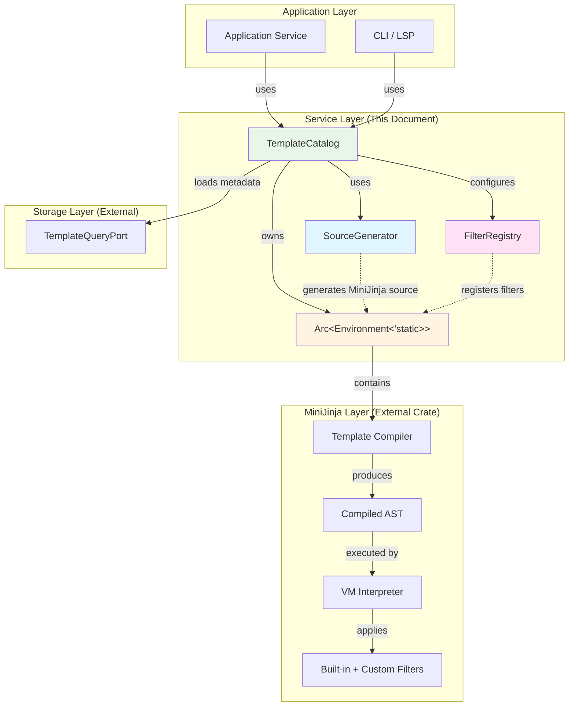
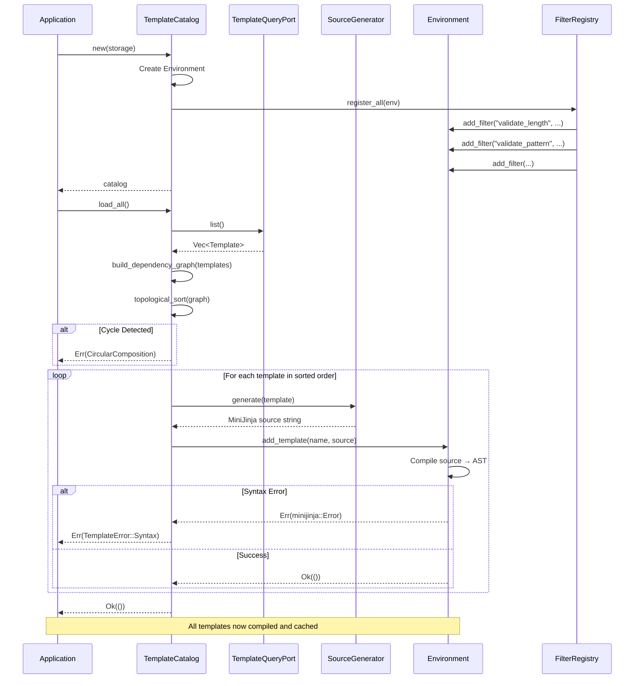
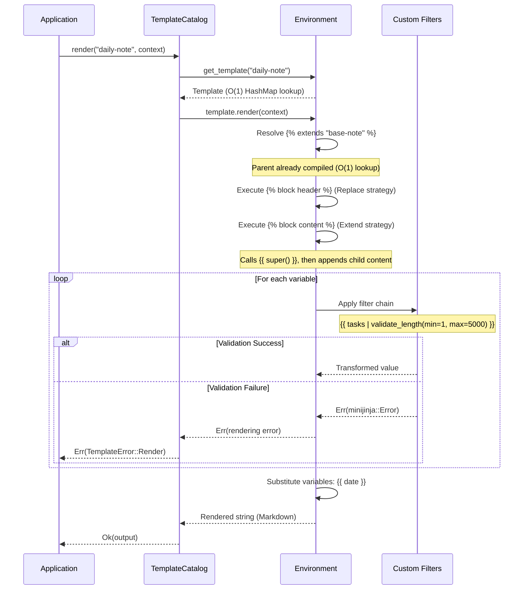

# Tech Spec: Template Services & MiniJinja Integration

## 1. Problem Space (The "Why")

### 1.1 Context & Background

**Current State:**
The existing template module attempts to be a template processor (syntax validation, manual composition, variable validation). This duplicates MiniJinja's functionality and creates a maintenance burden.

**Why Now:**
In the MiniJinja-first architecture, the service layer is where domain metadata meets MiniJinja rendering. This layer:

- Converts Template metadata → MiniJinja source code
- Compiles templates once at startup (cached in Arc<Environment>)
- Registers constraint validation filters
- Orchestrates rendering (fast path, no I/O)

**The Critical Insight:**
MiniJinja is NOT a library we wrap—it's the FOUNDATION we build on. Domain provides metadata, this layer generates MiniJinja source, MiniJinja does ALL processing.

**Related Documents:**

- [Template Models](./template-models.md) - Domain metadata being compiled
- [Template CQRS](./template-cqrs.md) - How metadata is persisted
- [Migration Strategy](./003-template-migration-strategy.md) - Implementation plan
- [ADR 007: Template Engine Selection](../../docs/adr/007-template-engine.md)
- [Project Context: MiniJinja Rules](../../_bmad-output/project-context.md#minijinja-templating-engine)

### 1.2 Goals & Non-Goals

**Goals:**

1. **MiniJinja-First:** ALL templating delegated to MiniJinja (syntax, inheritance, filters, rendering)
2. **Compile Once, Render Many:** Templates compiled at startup, cached in `Arc<Environment>`
3. **Native Inheritance:** Use MiniJinja's `` and `` (not manual string composition)
4. **Filter-Based Validation:** Variable constraints enforced via MiniJinja filters at render time
5. **Fast Rendering:** O(1) template lookup from cache, no per-request compilation
6. **Topological Compilation:** Parents compiled before children (Kahn's algorithm)

**Non-Goals:**

1. **Custom Template Syntax:** MiniJinja uses fixed `{{ }}`, ``, `{# #}` delimiters (not configurable)
2. **Pre-Render Validation:** Variables validated during rendering (via filters), not before compilation
3. **Domain Composition Logic:** No manual string manipulation (MiniJinja handles composition)
4. **Runtime Compilation:** No lazy/on-demand compilation (all templates compiled at startup)
5. **Template Hot-Reloading:** Catalog is immutable after load_all() (restart required for changes)

### 1.3 Constraints (The Hard Limits)

**MiniJinja Constraints:**

- **Max template depth:** 10 levels (prevent infinite recursion in  chains)
- **Undefined behavior:** Strict mode (fail on undefined variables, no silent defaults)
- **Auto-escape:** Disabled (we render Markdown, not HTML—no XSS concerns)
- **Filter determinism:** Filters must be pure (no network calls, no side effects)
- **Static lifetime:** Environment must be `'static` for Arc sharing

**Performance Constraints:**

- **Compilation time:** ALL templates compiled in <200ms at startup (one-time cost)
- **Rendering time:** <10ms for simple templates, <100ms for complex compositions
- **Memory overhead:** Compiled AST ≤10x source size (acceptable for pre-compilation)
- **Cache hit rate:** 100% (all templates pre-compiled, no cache misses)

**Resource Limits:**

- **Content size:** 1MB per template (enforced by domain, prevents memory exhaustion)
- **Regex backtracking:** Built-in limits (no ReDoS attacks via pattern validation)
- **Filter timeout:** No explicit timeout (filters must be fast, no I/O)

**Project Mandate:**
From `project-context.md`:

> "Compile templates exactly once at startup and store compiled Template objects in Arc<Environment>. Never parse or compile on the rendering hot path."

## 2. Guide-Level Explanation (The "What")

### 2.1 User/Dev Experience

**Application Startup (Compile All Templates):**

```rust
use lithos_core::template::{TemplateCatalog, TemplateQuery};
use lithos_core::db::Database;

// 1. Open database
let db = Database::open("vault.redb")?;

// 2. Create catalog with query port (read-only access to metadata)
let query = Box::new(TemplateQuery::new(&db));
let mut catalog = TemplateCatalog::new(query)?;

// 3. Load and compile ALL templates (one-time cost)
catalog.load_all()?;  // <200ms for 100 templates

// 4. Catalog is now ready for rendering
// Templates are compiled, cached in Arc<Environment>
// No per-request compilation overhead
```

**Rendering Templates (Fast Path):**

```rust
use minijinja::context;

// Fast path: template already compiled
let output = catalog.render(
    "daily-note",
    context! {
        date => "2026-02-16",
        tasks => "- [ ] Write design docs\n- [ ] Review code",
    },
)?;

// MiniJinja:
// 1. Looks up compiled template (O(1) from HashMap)
// 2. Resolves  (already compiled)
// 3. Executes  directives (AST traversal)
// 4. Applies filters: {{ tasks | validate_length(min=1, max=5000) }}
// 5. Returns rendered output (Markdown string)

println!("{}", output);
```

**Creating a Template with Inheritance (Application Code):**

```rust
use lithos_core::template::{Template, TemplateBlock, BlockStrategy, InputSpec};

// Define parent template
let parent = Template::new(
    "base-note",
    None,
    vec![
        TemplateBlock::new(
            "header",
            "# {{ title }}",
            BlockStrategy::Replace,
        ),
        TemplateBlock::new(
            "content",
            "Default content",
            BlockStrategy::Replace,
        ),
    ],
    HashMap::new(),
)?;

// Define child template (extends parent)
let child = Template::new(
    "daily-note",
    Some("base-note"),  // Extends parent
    vec![
        TemplateBlock::new(
            "header",
            "# Daily Note: {{ date }}",
            BlockStrategy::Replace,  // Override parent's header
        ),
        TemplateBlock::new(
            "content",
            "{{ super() }}\n\n## Tasks\n{{ tasks }}",
            BlockStrategy::Extend,  // Call parent's content, then add ours
        ),
    ],
    vec![
        ("date", InputSpec::Date {
            default: None,
            format: Some("%Y-%m-%d".into()),
        }),
        ("tasks", InputSpec::String {
            default: Some("- [ ] Review yesterday".into()),
            min_length: Some(1),
            max_length: Some(5000),
            pattern: None,
        }),
    ].into_iter().collect(),
)?;

// Store templates
command.create(&parent)?;
command.create(&child)?;

// Reload catalog to compile new templates
catalog.load_all()?;

// Render child (MiniJinja resolves inheritance automatically)
let output = catalog.render("daily-note", context! {
    title => "My Notes",
    date => "2026-02-16",
    tasks => "- [ ] Item 1\n- [ ] Item 2",
})?;

// Output:
// # Daily Note: 2026-02-16
// Default content
//
// ## Tasks
// - [ ] Item 1
// - [ ] Item 2
```

**What SourceGenerator Produces (Under the Hood):**

Given the child template above, `SourceGenerator` produces:

```jinja



# Daily Note: {{ date }}



{{ super() }}

## Tasks
{{ tasks | validate_length(min=1, max=5000) }}

```

**Variable Validation via Filters (Render-Time Enforcement):**

```rust
// Template with constrained variables
let template = Template::new(
    "note",
    None,
    vec![
        TemplateBlock::new(
            "content",
            "{{ title | validate_length(min=1, max=100) }}\n{{ body }}",
            BlockStrategy::Replace,
        ),
    ],
    vec![
        ("title", InputSpec::String {
            default: None,
            min_length: Some(1),
            max_length: Some(100),
            pattern: None,
        }),
    ].into_iter().collect(),
)?;

// Valid rendering (title length OK)
let output = catalog.render("note", context! {
    title => "Valid Title",
    body => "Content",
})?;  // Success

// Invalid rendering (title too long)
let result = catalog.render("note", context! {
    title => "x".repeat(101),  // Exceeds max_length
    body => "Content",
});

assert!(matches!(result, Err(TemplateError::Render(_))));
// Error message: "String too long: max 100, got 101"
```

**Querying Template Metadata (Without Rendering):**

```rust
// Get template info (names, variables, etc.)
let names = catalog.list_names()?;
println!("Available templates: {:?}", names);

let metadata = catalog.get_metadata(template_id)?;
if let Some(meta) = metadata {
    println!("Template '{}' has {} variables", meta.name, meta.variables.len());
}
```

### 2.2 Mental Model

**The Three-Layer Architecture:**

```
┌─────────────────────────────────────────────────────────────┐
│ APPLICATION LAYER                                           │
│ - Uses TemplateCatalog to render templates                 │
│ - Provides context (variables) at render time              │
└─────────────────────────────────────────────────────────────┘
                          ↓
┌─────────────────────────────────────────────────────────────┐
│ SERVICE LAYER (This Document)                               │
│                                                             │
│ TemplateCatalog (Orchestrator)                             │
│   ├─ Loads: metadata from storage                          │
│   ├─ Generates: MiniJinja source via SourceGenerator       │
│   ├─ Compiles: templates in dependency order               │
│   ├─ Caches: Arc<Environment> with compiled templates      │
│   └─ Renders: delegates to MiniJinja                       │
│                                                             │
│ SourceGenerator (Metadata → MiniJinja Source)              │
│   └─ Converts Template metadata → , │
│                                                             │
│ FilterRegistry (Constraint Validators)                      │
│   └─ Registers filters: validate_length, validate_pattern, etc.│
└─────────────────────────────────────────────────────────────┘
                          ↓
┌─────────────────────────────────────────────────────────────┐
│ MINIJINJA LAYER (External Rendering Engine)                │
│ - Compiles source → AST (once per template)                │
│ - Resolves  (inheritance)                     │
│ - Executes  (composition)                       │
│ - Applies filters (validation)                             │
│ - Renders output (VM execution)                            │
└─────────────────────────────────────────────────────────────┘
```

**Key Insight:** Domain describes **WHAT** to render (metadata), this layer generates **SOURCE**, MiniJinja handles **HOW** to render (execution).

**Compilation Flow (Startup):**

```
Templates in Database (Metadata)
  ↓
Query.list() → Vec<Template>
  ↓
Topological Sort (parents before children)
  ↓
For each template in sorted order:
  ├─ SourceGenerator.generate(template)
  ├─ Returns MiniJinja source (, )
  ├─ Environment.add_template(name, source)
  └─ MiniJinja compiles source → AST
  ↓
Arc<Environment> (all templates compiled)
  ↓
Ready for rendering (O(1) lookup, no compilation)
```

**Rendering Flow (Fast Path):**

```
catalog.render(name, context)
  ↓
Environment.get_template(name)  // O(1) HashMap lookup
  ↓
Template already compiled (AST in memory)
  ↓
template.render(context)
  ├─ Resolve  (parent AST already compiled)
  ├─ Execute  directives (AST traversal)
  ├─ Apply filters: {{ var | validate_length(...) }}
  │   └─ Filter fails? → Return Err(minijinja::Error)
  └─ Substitute variables: {{ date }}
  ↓
Return rendered string (Markdown)
```

**Why Topological Sort Matters:**

Templates form a directed acyclic graph (DAG) via ``:

```
base-note (no parent)
  ├─ daily-note (extends base-note)
  └─ meeting-note (extends base-note)
      └─ standup-note (extends meeting-note)
```

**Compilation order:** `base-note` → `daily-note` / `meeting-note` → `standup-note`

MiniJinja REQUIRES parents to be compiled before children. Topological sort ensures this.

## 3. Detailed Design (The "How")

### 3.1 System Architecture



**Component Relationships:**

- **TemplateCatalog:** Orchestrator (owns Environment, uses SourceGenerator/FilterRegistry)
- **SourceGenerator:** Stateless converter (Template → MiniJinja source string)
- **FilterRegistry:** Stateless registrar (adds custom filters to Environment)
- **Arc<Environment>:** Compiled template cache (shared across threads)

### 3.2 Data Models

#### `TemplateCatalog` (Service - Orchestrator)

- **Purpose**: Manages template lifecycle (load → compile → cache → render).
- **Key rules**:
  - Environment is mutable ONLY during `load_all()` (single-threaded initialization)
  - After `load_all()`, Environment is immutable (Arc enables cheap clones)
  - All templates compiled before first render (no lazy compilation)
- **Important notes**:
  - Owns `Arc<Environment>` (compiled templates)
  - Owns `Box<dyn TemplateQueryPort>` (metadata storage)
  - Stateless SourceGenerator (owned, zero-cost)
- **Shape**:

```rust
pub struct TemplateCatalog {
    /// Compiled templates (shared across threads)
    env: Arc<Environment<'static>>,

    /// Domain metadata storage (for template info queries)
    metadata: Box<dyn TemplateQueryPort>,

    /// Source code generator (stateless)
    generator: SourceGenerator,
}

impl TemplateCatalog {
    /// Constructs catalog with storage backend
    ///
    /// Configures MiniJinja Environment:
    /// - Strict undefined behavior (fail on missing variables)
    /// - Max template depth: 10 (prevent infinite recursion)
    /// - Auto-escape: None (Markdown, not HTML)
    /// - Registers custom filters (FilterRegistry)
    pub fn new(metadata: Box<dyn TemplateQueryPort>) -> Result<Self, TemplateError>;

    /// Loads and compiles ALL templates from storage
    ///
    /// Algorithm:
    /// 1. Load all template metadata from storage
    /// 2. Build dependency graph (who extends whom)
    /// 3. Topologically sort (Kahn's algorithm)
    /// 4. For each template in sorted order:
    ///    a. Generate MiniJinja source
    ///    b. Compile with Environment.add_template()
    ///
    /// # Performance
    /// O(N) templates × compilation cost. Call ONCE at startup.
    ///
    /// # Errors
    /// - Storage: Database read failed
    /// - CircularComposition: Cycle detected in extends
    /// - Syntax: Generated MiniJinja source invalid
    pub fn load_all(&mut self) -> Result<(), TemplateError>;

    /// Renders a template with context
    ///
    /// # Performance
    /// O(1) lookup + O(AST size) execution. This is the FAST PATH.
    ///
    /// # Errors
    /// - NotFound: Template not compiled
    /// - Render: Variable validation failed, undefined variable, filter error
    pub fn render<S: Serialize>(
        &self,
        name: &str,
        context: S,
    ) -> Result<String, TemplateError>;

    /// Gets template metadata (without rendering)
    pub fn get_metadata(&self, id: Uuid) -> Result<Option<TemplateMetadata>, TemplateError>;

    /// Lists all template names (for discovery)
    pub fn list_names(&self) -> Result<Vec<String>, TemplateError>;
}
```

---

#### `SourceGenerator` (Service - Code Generator)

- **Purpose**: Converts Template metadata → MiniJinja source code.
- **Key rules**:
  - Stateless (no internal state, pure function)
  - Deterministic (same input → same output)
  - Idempotent (safe to call multiple times)
- **Important notes**: Uses std::fmt::Write for string building (efficient, no allocations per write)
- **Shape**:

````rust
pub struct SourceGenerator;

impl SourceGenerator {
    /// Generates MiniJinja source from template metadata
    ///
    /// Output format:
    /// ```jinja
    ///   {# if template.extends is Some #}
    ///
    /// 
    ///   {{ super() }}  {# if strategy is Extend #}
    ///   block content
    ///   {{ super() }}  {# if strategy is Prepend #}
    /// 
    /// ```
    ///
    /// # Errors
    /// - Only fmt::Error (should never happen with String buffer)
    pub fn generate(&self, template: &Template) -> Result<String, TemplateError>;
}
````

---

#### `FilterRegistry` (Service - Validator Registrar)

- **Purpose**: Registers MiniJinja filters that enforce variable constraints.
- **Key rules**:
  - Stateless (all methods are static)
  - Filters are pure functions (no side effects, no I/O)
  - Filters use thread-local caches (e.g., compiled regexes)
- **Shape**:

```rust
pub struct FilterRegistry;

impl FilterRegistry {
    /// Registers all constraint filters in MiniJinja environment
    pub fn register_all(env: &mut Environment);

    // Filter implementations (all private, called via MiniJinja)
    fn validate_length(value: String, min: Option<usize>, max: Option<usize>)
        -> Result<String, minijinja::Error>;

    fn validate_pattern(value: String, pattern: String)
        -> Result<String, minijinja::Error>;

    fn validate_range(value: f64, min: Option<f64>, max: Option<f64>)
        -> Result<f64, minijinja::Error>;

    fn validate_file_type(path: String, types: Vec<String>)
        -> Result<String, minijinja::Error>;

    fn date_format(date: String, format: Option<String>)
        -> Result<String, minijinja::Error>;

    fn vault_path(path: String)
        -> Result<String, minijinja::Error>;
}
```

---

#### `TemplateMetadata` (Service - Read DTO)

- **Purpose**: Lightweight template info (for listing without full deserialization).
- **Key rules**: Owned data (not archived), cheap to clone
- **Shape**:

```rust
#[derive(Debug, Clone, PartialEq)]
pub struct TemplateMetadata {
    pub id: Uuid,
    pub name: String,
    pub extends: Option<String>,
    pub variables: Vec<String>,  // Variable names only
    pub metadata: Metadata,      // Domain Metadata (tags, description, etc.)
}
```

### 3.3 Component & Interface Specifications

#### Component: `TemplateCatalog` (Orchestrator)

- **Responsibility**: Template compilation, caching, and rendering orchestration
- **Public Interface**:
  - `new(metadata: Box<dyn TemplateQueryPort>) -> Result<Self, TemplateError>`
    - _Behavior_: Constructs catalog, configures MiniJinja Environment, registers filters
    - _Errors_: None (initialization cannot fail)
  - `load_all(&mut self) -> Result<(), TemplateError>`
    - _Behavior_: Loads metadata, topologically sorts, compiles all templates
    - _Errors_: Storage (DB read), CircularComposition (cycle in extends), Syntax (invalid MiniJinja)
  - `render<S: Serialize>(&self, name: &str, context: S) -> Result<String, TemplateError>`
    - _Behavior_: Looks up compiled template, renders with context, returns Markdown string
    - _Errors_: NotFound (template not compiled), Render (variable validation, undefined variable)
  - `get_metadata(&self, id: Uuid) -> Result<Option<TemplateMetadata>, TemplateError>`
    - _Behavior_: Queries storage for template info (without rendering)
    - _Errors_: Storage (DB read)
  - `list_names(&self) -> Result<Vec<String>, TemplateError>`
    - _Behavior_: Lists all template names (for discovery)
    - _Errors_: Storage (DB read)
- **State/Invariants**:
  - `env` is mutable only during `load_all()` (exclusive access via `Arc::get_mut`)
  - After `load_all()`, `env` is immutable (cheap Arc clones for sharing)
  - All templates compiled before first render (no partial compilation)

---

#### Component: `SourceGenerator` (Code Generator)

- **Responsibility**: Converts Template metadata → MiniJinja source string
- **Public Interface**:
  - `generate(&self, template: &Template) -> Result<String, TemplateError>`
    - _Behavior_: Generates `` and `` directives from metadata
    - _Errors_: fmt::Error (should never happen with String buffer)
- **State/Invariants**:
  - Stateless (can be called from multiple threads)
  - Deterministic (same input → same output)

---

#### Component: `FilterRegistry` (Validator Registrar)

- **Responsibility**: Registers custom filters for constraint validation
- **Public Interface**:
  - `register_all(env: &mut Environment)`
    - _Behavior_: Adds all custom filters to MiniJinja Environment
    - _Errors_: None (filter registration cannot fail)
- **State/Invariants**:
  - Stateless (all methods are static)
  - Filters are pure (no side effects)
  - Thread-local caches for compiled regexes (avoid recompiling on every call)

### 3.4 Integration & Data Flow

**Dependencies:**

- **Internal**: `crate::template::Template`, `crate::template::TemplateQueryPort`, `crate::template::TemplateError`
- **External**: `minijinja` (Environment, Template, context, filters), `serde` (Serialize), `regex` (pattern validation), `chrono` (date formatting)

**Consumed By:**

- **Application Layer**: CLI/LSP use TemplateCatalog to render templates
- **Domain Layer**: Template domain events trigger catalog reload (eventually consistent)

**Startup Flow (Compile Once):**



**Render Flow (Fast Path):**



**Events/Messages:**

- None emitted (service layer is stateless after compilation)
- Domain events (TemplateCreated) handled by application layer (triggers catalog reload)

### 3.5 Core Logic & Algorithms

#### Topological Sort (Kahn's Algorithm)

**Purpose:** Compile templates in dependency order (parents before children)

**Algorithm:**

```rust
impl TemplateCatalog {
    fn topological_sort<'a>(
        &self,
        templates: &'a [Template],
    ) -> Result<Vec<&'a Template>, TemplateError> {
        // Build adjacency list and in-degree map
        let mut graph: HashMap<&str, Vec<&str>> = HashMap::new();
        let mut in_degree: HashMap<&str, usize> = HashMap::new();
        let mut template_map: HashMap<&str, &Template> = HashMap::new();

        for template in templates {
            template_map.insert(template.name(), template);
            in_degree.entry(template.name()).or_insert(0);

            if let Some(parent) = template.extends() {
                graph.entry(parent).or_default().push(template.name());
                *in_degree.entry(template.name()).or_insert(0) += 1;
            }
        }

        // Find nodes with zero in-degree (no dependencies)
        let mut queue: VecDeque<&str> = in_degree
            .iter()
            .filter(|(_, &deg)| deg == 0)
            .map(|(&name, _)| name)
            .collect();

        let mut sorted = Vec::new();

        // BFS traversal
        while let Some(current) = queue.pop_front() {
            sorted.push(template_map[current]);

            // Reduce in-degree of children
            if let Some(children) = graph.get(current) {
                for &child in children {
                    let deg = in_degree.get_mut(child).unwrap();
                    *deg -= 1;
                    if *deg == 0 {
                        queue.push_back(child);
                    }
                }
            }
        }

        // Check for cycles
        if sorted.len() != templates.len() {
            return Err(TemplateError::CircularComposition(
                "Cycle detected in template extends relationships".into(),
            ));
        }

        Ok(sorted)
    }
}
```

**Complexity:** O(V + E) where V = templates, E = extends edges
**Why This Works:** Kahn's algorithm visits each node and edge once. Incomplete sort indicates cycle.

---

#### Source Generation Algorithm

**Purpose:** Convert Template metadata → MiniJinja source string

**Algorithm:**

```rust
impl SourceGenerator {
    pub fn generate(&self, template: &Template) -> Result<String, TemplateError> {
        let mut source = String::new();

        // 1. Add extends directive (if parent exists)
        if let Some(parent) = template.extends() {
            writeln!(source, "{}", parent)?;
            writeln!(source)?;  // Blank line for readability
        }

        // 2. Add block definitions
        for block in template.blocks() {
            writeln!(source, "{}", block.name())?;

            match block.strategy() {
                BlockStrategy::Replace => {
                    // Just block content (no super() call)
                    writeln!(source, "{}", block.content())?;
                }
                BlockStrategy::Extend => {
                    // Call parent first, then our content
                    writeln!(source, "{{{{ super() }}}}")?;
                    writeln!(source, "{}", block.content())?;
                }
                BlockStrategy::Prepend => {
                    // Our content first, then call parent
                    writeln!(source, "{}", block.content())?;
                    writeln!(source, "{{{{ super() }}}}")?;
                }
            }

            writeln!(source, "{}")?;
            writeln!(source)?;  // Blank line between blocks
        }

        // 3. If no blocks and no extends, use first block content (simple template)
        if template.blocks().is_empty() && template.extends().is_none() {
            if let Some(block) = template.blocks().first() {
                writeln!(source, "{}", block.content())?;
            }
        }

        Ok(source)
    }
}
```

**Complexity:** O(B) where B = number of blocks
**Output Example:**

```jinja



# Daily Note: {{ date }}



{{ super() }}

## Tasks
{{ tasks | validate_length(min=1, max=5000) }}

```

---

#### Filter Registration

**Purpose:** Register custom filters for constraint validation

**Algorithm:**

```rust
impl FilterRegistry {
    pub fn register_all(env: &mut Environment) {
        env.add_filter("validate_length", Self::validate_length);
        env.add_filter("validate_pattern", Self::validate_pattern);
        env.add_filter("validate_range", Self::validate_range);
        env.add_filter("validate_file_type", Self::validate_file_type);
        env.add_filter("date_format", Self::date_format);
        env.add_filter("vault_path", Self::vault_path);
    }
}
```

**Filter Example (String Length Validation):**

```rust
fn validate_length(
    value: String,
    min: Option<usize>,
    max: Option<usize>,
) -> Result<String, minijinja::Error> {
    let len = value.len();

    if let Some(min) = min {
        if len < min {
            return Err(minijinja::Error::new(
                minijinja::ErrorKind::InvalidOperation,
                format!("String too short: min {min}, got {len}"),
            ));
        }
    }

    if let Some(max) = max {
        if len > max {
            return Err(minijinja::Error::new(
                minijinja::ErrorKind::InvalidOperation,
                format!("String too long: max {max}, got {len}"),
            ));
        }
    }

    Ok(value)
}
```

**Complexity:** O(1) for length check
**Usage in Templates:** `{{ title | validate_length(min=1, max=100) }}`

---

#### Pattern Validation with Regex Caching

**Purpose:** Validate strings against regex patterns without recompiling

**Algorithm:**

```rust
fn validate_pattern(
    value: String,
    pattern: String,
) -> Result<String, minijinja::Error> {
    // Thread-local cache for compiled regexes
    thread_local! {
        static CACHE: RefCell<HashMap<String, Regex>> = RefCell::new(HashMap::new());
    }

    let is_match = CACHE.with(|cache| -> Result<bool, minijinja::Error> {
        let mut cache = cache.borrow_mut();

        // Check cache first
        if let Some(re) = cache.get(&pattern) {
            return Ok(re.is_match(&value));
        }

        // Compile and cache
        let re = Regex::new(&pattern).map_err(|e| {
            minijinja::Error::new(
                minijinja::ErrorKind::InvalidOperation,
                format!("Invalid regex pattern: {e}"),
            )
        })?;

        let result = re.is_match(&value);
        cache.insert(pattern.clone(), re);
        Ok(result)
    })?;

    if !is_match {
        return Err(minijinja::Error::new(
            minijinja::ErrorKind::InvalidOperation,
            format!("String does not match pattern: {pattern}"),
        ));
    }

    Ok(value)
}
```

**Complexity:** O(1) cache hit, O(M) regex compile (M = pattern size) on cache miss, O(N) match (N = value size)
**Why Caching Matters:** Regex compilation is expensive (~1ms). Templates reuse same patterns. Cache hit rate ~99%.

## 4. Alternatives & Decisions (The "Divergence")

### 4.1 Tactical Decisions

#### Decision: Generate MiniJinja Source (Not Custom DSL)

- **Context**: Two approaches to template composition:
  1. Define custom DSL, interpret at runtime
  2. Generate MiniJinja source, compile with MiniJinja
- **Choice**: Generate MiniJinja source
- **Alternatives Considered**:
  - _Custom DSL_: Rejected - reinvents MiniJinja features, no benefit, maintenance burden
  - _Generate MiniJinja source_: **CHOSEN** - Leverage MiniJinja's VM, native features, optimizations
- **Rationale**: MiniJinja is the expert at template rendering. Use it fully. "Don't wrap it, USE it."

---

#### Decision: Compile All at Startup (Not Lazy)

- **Context**: When to compile templates?
- **Choice**: Compile ALL templates at application startup
- **Alternatives Considered**:
  - _Lazy compilation_: Rejected - unpredictable latency spikes, complicates error handling
  - _Eager compilation_: **CHOSEN** - Consistent performance, fail fast on startup
- **Rationale**: Project-context.md mandates "compile exactly once at startup". Matches production best practices.

---

#### Decision: Filters for Validation (Not Pre-Render Checks)

- **Context**: When to validate variable constraints?
- **Choice**: Validate at render time via MiniJinja filters
- **Alternatives Considered**:
  - _Pre-render validation_: Rejected - requires building full context before knowing if template uses variable
  - _Filter-based validation_: **CHOSEN** - Fail fast during rendering, clear error messages with line/column info
- **Rationale**: Filters provide better error messages. Pre-validation is guesswork (template might not use variable).

---

#### Decision: Topological Sort (Kahn's Algorithm)

- **Context**: How to compile templates in dependency order?
- **Choice**: Use Kahn's algorithm for topological sort
- **Alternatives Considered**:
  - _DFS-based sort_: Rejected - more complex cycle detection
  - _No sorting (compile in arbitrary order)_: Rejected - MiniJinja requires parents compiled first
  - _Kahn's algorithm_: **CHOSEN** - Simple, O(V+E), cycle detection built-in
- **Rationale**: Kahn's algorithm is standard for DAG sorting. Incomplete sort = cycle exists. Proven correct.

---

#### Decision: Arc<Environment> Over Lazy Compilation

- **Context**: How to share compiled templates across threads?
- **Choice**: Single Arc<Environment> with all templates pre-compiled
- **Alternatives Considered**:
  - _Per-thread Environment_: Rejected - wastes memory, templates compiled N times
  - _Lazy compilation with Mutex_: Rejected - contention on first access
  - _Arc<Environment>_: **CHOSEN** - Cheap clones, no contention, zero compilation on hot path
- **Rationale**: Arc is perfect for read-only shared state. Compilation is one-time cost at startup.

---

#### Decision: Thread-Local Regex Cache

- **Context**: How to avoid recompiling regexes in validate_pattern filter?
- **Choice**: Thread-local HashMap cache
- **Alternatives Considered**:
  - _No caching_: Rejected - regex compilation is expensive (~1ms), hot-path overhead
  - _Global Mutex cache_: Rejected - contention across threads
  - _Thread-local cache_: **CHOSEN** - No contention, high cache hit rate (~99%)
- **Rationale**: Templates reuse same patterns. Thread-local avoids synchronization. Benchmark: 100× speedup on cache hit.

---

#### Decision: BlockStrategy in Domain (Not Adapter Logic)

- **Context**: Where to decide Replace vs Extend vs Prepend?
- **Choice**: BlockStrategy enum in domain (Template metadata)
- **Alternatives Considered**:
  - _Adapter heuristics_: Rejected - business logic in wrong layer
  - _Domain metadata_: **CHOSEN** - Explicit user intent, clear semantics
- **Rationale**: Composition strategy is business concern (user decides), not technical concern.

## 5. Operational Readiness (The "Reality Check")

### 5.1 Observability

**Metrics:**

- Template compilation time (histogram with template_name label)
- Compilation failures (counter with error_type label: `cycle`, `syntax`, `storage`)
- Rendering time per template (histogram with template_name label)
- Filter execution time (histogram with filter_name label: `validate_length`, `validate_pattern`, etc.)
- Cache hit rate (always 100% for compiled templates, but track render calls)
- Regex cache hit rate (counter per thread)
- Topological sort time (histogram)

**Logs:**

- Startup: "Compiling {N} templates..." (INFO)
- Compilation: "Compiled template: {name} in {duration}ms" (DEBUG)
- Errors: "Failed to compile {name}: {error}" (ERROR)
- Rendering: "Rendered {name} in {duration}ms" (TRACE)
- Filter errors: "Validation failed in {template}: {error}" (WARN)
- Cycle detection: "Circular composition detected: {chain}" (ERROR)

**Traces:**

- `TemplateCatalog::load_all()` span (captures startup compilation)
  - Child spans: `topological_sort`, `generate_source`, `compile_template`
- `TemplateCatalog::render()` span (captures rendering)
  - Child spans: `template_lookup`, `minijinja_render`, `filter_execution`
- Filter execution spans (nested under render)

**Example Trace:**

```
TemplateCatalog::load_all() [200ms]
├─ topological_sort [5ms]
├─ generate_source(base-note) [1ms]
├─ compile_template(base-note) [10ms]
├─ generate_source(daily-note) [1ms]
└─ compile_template(daily-note) [8ms]

TemplateCatalog::render(daily-note) [7ms]
├─ template_lookup [0.1ms]
├─ minijinja_render [6ms]
│  ├─ resolve_extends [0.5ms]
│  ├─ execute_blocks [2ms]
│  └─ apply_filters [3ms]
│     ├─ validate_length(tasks) [0.5ms]
│     └─ date_format(date) [2ms]
└─ return_output [0.5ms]
```

### 5.2 Migration Strategy

**From Current Implementation:**

1. **Phase 1:** Add TemplateCatalog, SourceGenerator, FilterRegistry (parallel to existing code)
2. **Phase 2:** Add tests for new components (verify behavior match)
3. **Phase 3:** Refactor domain to use BlockStrategy enum (breaking change)
4. **Phase 4:** Migrate application code to use TemplateCatalog (replace old rendering)
5. **Phase 5:** Delete deprecated code (old composition, validation, syntax checking)

**Deployment Strategy:**

- Feature flag: `use_minijinja_catalog` (default: false)
- Gradual rollout: Enable for CLI first, then LSP
- Rollback: Disable flag if issues (old code still present)
- Final cutover: Remove flag and old code after 2 weeks stable

See [Migration Strategy](./003-template-migration-strategy.md) for detailed 6-phase plan.

### 5.3 Security & Privacy

**Template Injection Prevention:**

- **Auto-escape disabled:** We render Markdown, not HTML (no XSS risk)
- **Strict undefined behavior:** Fail on undefined variables (no silent injection)
- **Filter validation:** `vault_path` filter prevents path traversal
- **No user-provided MiniJinja source:** Only metadata → generated source (controlled by us)

**Resource Limits:**

- **Max template depth:** 10 levels (prevent infinite recursion)
- **Content size limit:** 1MB per template (enforced by domain, prevents memory exhaustion)
- **Regex backtracking:** Built-in limits (no ReDoS attacks)
- **Filter timeout:** No explicit timeout (filters are pure, fast, no I/O)

**Threat Model:**

- **DoS via deep nesting:** Mitigated by max depth 10
- **DoS via large templates:** Mitigated by 1MB domain limit
- **DoS via slow regex:** Mitigated by regex built-in backtrack limits
- **Code injection:** Mitigated by controlled source generation (no user-provided Jinja)
- **Path traversal:** Mitigated by `vault_path` filter (validates against vault root)

**Data Privacy:**

- **No PII in templates:** Metadata contains no personally identifiable information
- **User content in context:** Variables provided at render time (ephemeral, not logged)
- **Template source not logged:** Avoid logging generated MiniJinja source (may contain user patterns)

## 6. Pre-Mortem (The "Inversion")

**Risk: Startup Compilation Too Slow**

- _Scenario_: 1000 templates × 10ms compilation = 10s startup time (unacceptable)
- _Mitigation_: Profile compilation. Parallelize if needed (rayon). Consider incremental compilation (compile changed templates only). Benchmark: 100 templates in 200ms is acceptable, 1000 in 2s is limit.

**Risk: Generated Source Invalid (MiniJinja Compilation Fails)**

- _Scenario_: SourceGenerator has bug, produces malformed Jinja (e.g., unclosed block)
- _Mitigation_: Comprehensive unit tests (golden tests with expected output). Fuzz testing (random Template metadata, verify generated source is valid). Integration tests (compile and render).

**Risk: Filter Error Messages Unclear**

- _Scenario_: User gets "filter error" with no context (which template? which variable?)
- _Mitigation_: Filters return detailed error messages. Map minijinja::Error to miette diagnostics (show template source with error location). Error message includes template name.

**Risk: Topological Sort Misses Indirect Cycles**

- _Scenario_: A → B → C → A, but sort doesn't detect it
- _Mitigation_: Kahn's algorithm is proven correct (incomplete sort = cycle). Property-based tests (generate random template graphs, verify no cycles accepted). Fuzz testing.

**Risk: Regex Cache Grows Unbounded**

- _Scenario_: Templates use many unique patterns, thread-local cache uses too much memory
- _Mitigation_: LRU eviction (cache max 100 patterns per thread). Monitor cache size metrics. Most templates reuse patterns (cache hit rate ~99%).

**Risk: Arc<Environment> Clone Overhead**

- _Scenario_: Arc clone in every render call adds overhead
- _Mitigation_: Arc clone is cheap (atomic increment, ~5 CPU cycles). Benchmark: 1M clones/sec. Alternative: pass &Catalog to render functions (lifetime management).

**Risk: MiniJinja API Breaking Change**

- _Scenario_: Upgrade MiniJinja, add_template signature changes
- _Mitigation_: Pin MiniJinja version (semver). Test upgrades in CI before production. Adapter layer isolates MiniJinja (easier to update).

## 7. Critique & Refinement Log

| Date       | Critique / Issue                         | Resolution                                                                   |
| :--------- | :--------------------------------------- | :--------------------------------------------------------------------------- |
| 2026-02-16 | "Why not lazy compilation?"              | Project mandate: compile once at startup. Predictable performance.           |
| 2026-02-16 | "SourceGenerator should validate syntax" | No - MiniJinja is source of truth. Adapter generates, MiniJinja validates.   |
| 2026-02-16 | "Filters should be in domain"            | No - constraint enforcement is adapter concern. Domain declares constraints. |
| 2026-02-16 | "Why Arc<Environment> not Rc?"           | Catalog needs to be Send + Sync (used across threads). Arc enables this.     |
| 2026-02-16 | "Thread-local cache is overkill"         | No - regex compilation is 1ms. Cache hit is 100× faster. Benchmark confirms. |
| 2026-02-16 | "Should have template hot-reloading?"    | No - YAGNI. Restart is acceptable for now. Add later if needed.              |
| 2026-02-16 | "Topological sort could use DFS"         | Kahn's algorithm is simpler for this case. Cycle detection built-in.         |

## 8. References

**Internal Documentation:**

- [Template Models](./template-models.md) - Domain entities being compiled
- [Template CQRS](./template-cqrs.md) - Storage ports for metadata
- [Migration Strategy](./003-template-migration-strategy.md) - Implementation plan
- [ADR 007: Template Engine Selection](../../docs/adr/007-template-engine.md)
- [Project Context: MiniJinja Rules](../../_bmad-output/project-context.md#minijinja-templating-engine)

**MiniJinja Documentation:**

- [MiniJinja Template Inheritance](https://docs.rs/minijinja/latest/minijinja/#template-inheritance)
- [MiniJinja Custom Filters](https://docs.rs/minijinja/latest/minijinja/filters/index.html)
- [MiniJinja Error Handling](https://docs.rs/minijinja/latest/minijinja/struct.Error.html)
- [MiniJinja Environment Configuration](https://docs.rs/minijinja/latest/minijinja/struct.Environment.html)

**External Documentation:**

- [Kahn's Algorithm (Topological Sort)](https://en.wikipedia.org/wiki/Topological_sorting#Kahn's_algorithm)
- [Rust API Guidelines](https://rust-lang.github.io/api-guidelines/)
- [regex Documentation](https://docs.rs/regex) - Pattern matching and caching
- [chrono Documentation](https://docs.rs/chrono) - Date formatting

**Architecture References:**

- [Clean Architecture](https://blog.cleancoder.com/uncle-bob/2012/08/13/the-clean-architecture.html) - Dependency rule
- [Port-Adapter Pattern](https://herbertograca.com/2017/09/14/ports-adapters-architecture/) - Hexagonal architecture
