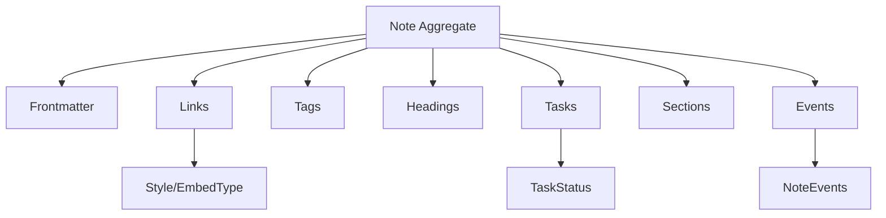
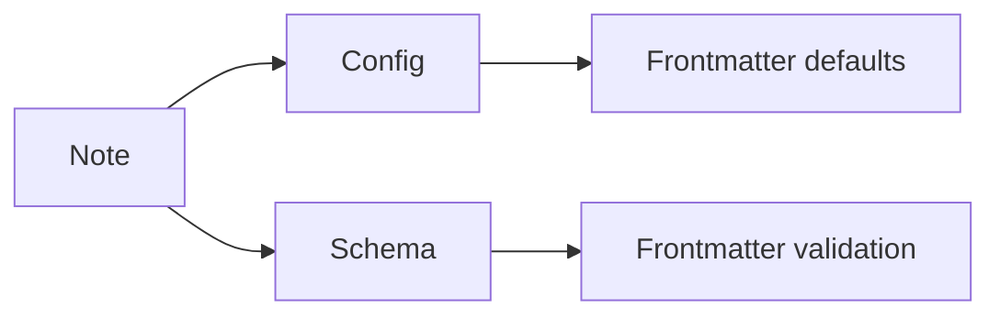
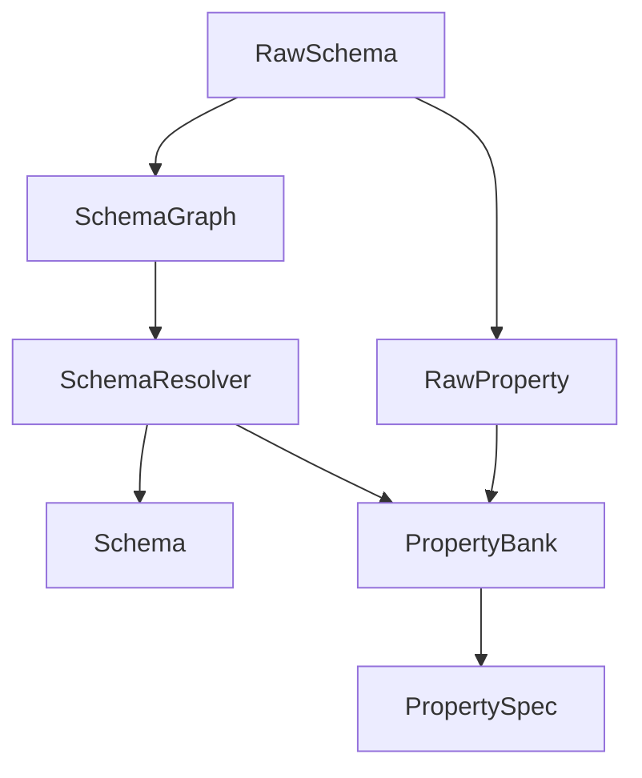
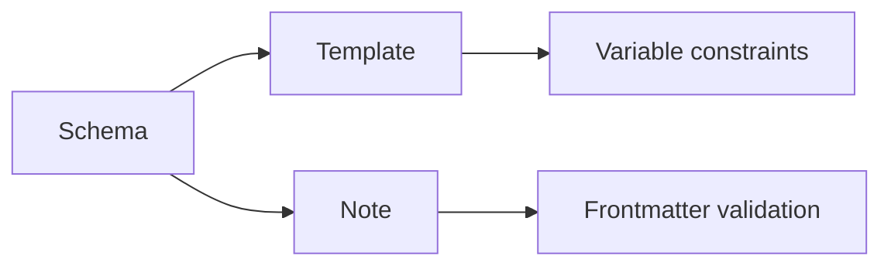
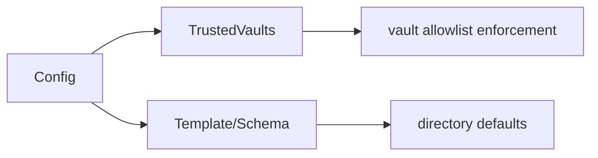
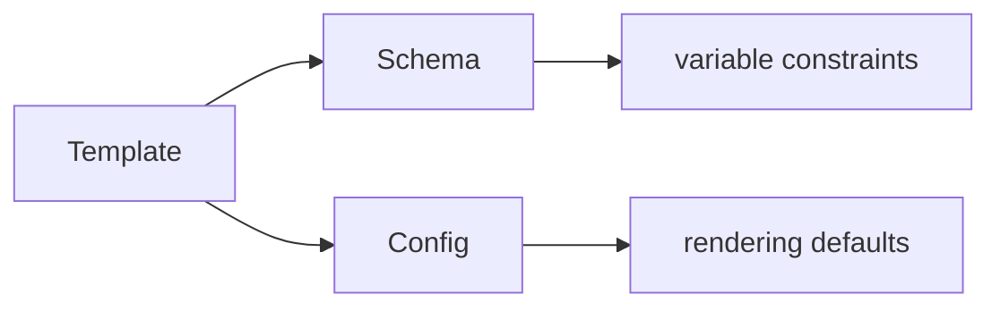
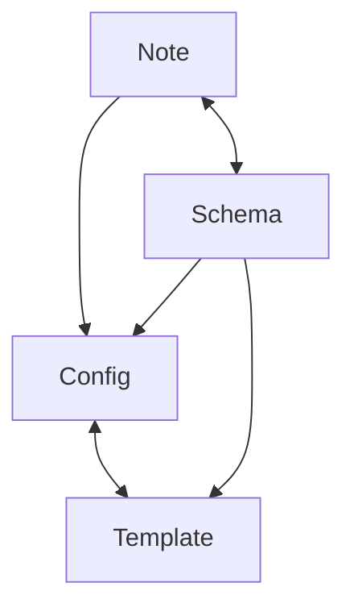

# Epic 3 Domain Models

## Overview

Lithos divides Epic 3 domain modeling into four bounded contexts: Note, Schema, Config, and Template. Together they define the language for metadata-bearing notes, schema-driven validation, hierarchical configuration, and template composition while preserving domain purity and hexagonal boundaries.

The domain layer stays I/O free and focuses on invariants, semantic validation, and event emission. Adapters interpret vault files and configuration formats, while application services orchestrate cross-context contracts such as schema validation for notes and variable validation for templates.

## Table of Contents

- [Documentation Standards](#documentation-standards)
- [Splitting Criteria](#splitting-criteria)
- [Note Bounded Context](#note-bounded-context)
- [Schema Bounded Context](#schema-bounded-context)
- [Config Bounded Context](#config-bounded-context)
- [Template Bounded Context](#template-bounded-context)
- [Bounded Context Contracts](#bounded-context-contracts)
- [Epic 3 Architecture Diagrams](#epic-3-architecture-diagrams)
- [Domain Model Evolution Guidelines](#domain-model-evolution-guidelines)
- [Common Pitfalls & Anti-Patterns](#common-pitfalls--anti-patterns)
- [Cookbook Examples](#cookbook-examples)
- [ADR Mapping](#adr-mapping)

## Documentation Standards

- Use the [domain entity template](domain-entity-template.md) for new entities.
- Document invariants, validation rules, and # Errors behavior for public APIs.
- Include doc-test examples for public structs, enums, traits, and methods.
- Keep domain documentation focused on developer usage rather than end-user workflows.

## Splitting Criteria

Split this document if any of the following occur:

- Total line count exceeds 2000 lines.
- A single bounded context section exceeds 500 lines.
- Readability suffers due to frequent updates or excessive detail.
- A bounded context requires standalone versioned evolution notes.

If split, create `docs/domain/overview.md` and individual context files under `docs/domain/` with a summary retained here.

## Note Bounded Context

### Overview

The Note bounded context models Obsidian notes as immutable aggregates with rich subentities for metadata, structure, and embedded references. Notes are the primary domain entity and capture vault-relative paths, frontmatter metadata, tags, headings, tasks, and outbound references.

The domain layer validates structural and semantic rules at construction time (e.g., path validity, non-empty headings), while orchestration layers apply schema-driven validation and vault-wide consistency rules. Note aggregates emit domain events for downstream processing such as indexing and compliance.

### Structure

- **Note aggregate**: `id`, `path`, `frontmatter`, `links` (includes embeds), `tags`, `headings`, `tasks`, `sections`, `pending_events`.
- **Frontmatter**: `HashMap<String, FieldValue>` with typed accessors and `FromFieldValue` for schema-driven extraction.
- **Link**: `target` (`Resolved`, `Unresolved`, `External`), `anchor`, `position`, `alias`, `style` (wiki/markdown), `embed_type` (optional).
- **Tag**: `full_path`, `segments` (hierarchical).
- **Heading**: `level`, `text`, `position`.
- **Section**: `heading`, `content`, `range`.
- **Task**: `text`, `status`, `position`.
- **Events**: `NoteCreated`, `FrontmatterValidated`, `NoteEvents`.
- **Ports**: `crates/domain/src/ports/note.rs` defines CQRS command/query interfaces.

### Rust-Specific Patterns Used

- **UUID v7 identity** for time-ordered note IDs.
- **Memory optimization** with `Box<str>` for immutable strings.
- **Enums for type safety** (`Style`, `EmbedType`, `TaskStatus`).
- **Error handling** via `DomainError` for validation failures.

### Validation Rules

- Vault paths are non-empty, relative, `.md` extension, no traversal.
- Heading levels must be 1-6; heading text cannot be empty.
- Tag strings require `#` prefix, no empty segments, and regex `^[a-zA-Z0-9_-]+$`.
- Task text must be non-empty.
- Link/embed targets must be non-empty; embeds cannot have anchors; external links cannot use block anchors.
- Frontmatter values must match expected types when accessed via `FromFieldValue`.
- FieldValue date validation expects ISO 8601 formatting.

### Business Logic

- Constructs emit `NoteCreated` domain events.
- `add_link` accepts all link types; ownership is enforced by aggregate containment.
- `validate` enforces link invariants (embeds have no anchors; external links avoid block refs).

### Relationships

- **Note ↔ Config**: frontmatter key lookups and defaults rely on config.
- **Note ↔ Schema**: frontmatter and metadata validated against schema definitions.
- **Internal composition**: links (embeds use `embed_type`), tags, headings, tasks, sections.

### Evolution Guidelines

- Add fields/subentities with defaults and migration notes.
- Modify validation rules with backward compatibility considerations.
- Deprecate fields before removal and supply migration paths.

### Architecture Diagram



### Contract Diagram



## Schema Bounded Context

### Overview

The Schema bounded context defines metadata validation contracts. Schemas describe property definitions, provide inheritance, and map reusable Property definitions through a PropertyBank. Raw schema definitions are resolved into fully merged Schema aggregates via domain services.

This context supports advanced schema composition (extends/excludes), property banks for reuse, and deterministic resolution to support consistent validation across vaults and templates.

### Structure

- **Schema aggregate**: `id`, `name`, `properties`, `pending_events`.
- **SchemaName**: validated name value object.
- **PropertyBank**: dual-indexed registry of properties by ID and name.
- **Property**: `id`, `name`, `required`, `array`, `spec`.
- **PropertySpec**: sum type for `StringSpec`, `NumberSpec`, `BoolSpec`, `DateSpec`, `FileSpec`.
- **RawSchema / RawProperty**: input definitions for adapters.
- **Resolver**: resolves raw schemas with inheritance and `$ref` lookups.
- **Graph**: detects cycles and returns topological order.
- **Events**: `SchemaCreated`, `PropertyBankUpdated`, `SchemaEvents`.
- **Ports**: `crates/domain/src/ports/schema.rs` defines CQRS command/query interfaces.

### Rust-Specific Patterns Used

- **Trait-based polymorphism** via `PropertySpecTrait`.
- **Zero-cost abstraction** for property specs with enum dispatch.
- **Deterministic ordering** for properties to ensure reproducible validation.

### Validation Rules

- Schema names and property names must be non-empty, <= 64 chars, and match alphanumeric/underscore/dash regex.
- Property specs enforce type-specific constraints (string length/enum/regex, number range/step, file directory restrictions, date format).
- Inheritance graph must be acyclic; missing parents error.
- Property bank rejects duplicate names with different definitions.
- Raw schema references must resolve via `PropertyBank` after adapter normalization.

### Business Logic

- `Resolver` merges parent properties and applies excludes before resolving references.
- `Graph` ensures parent schemas resolve before children.
- Property bank emits update events on registration.

### Relationships

- **Schema ↔ PropertyBank**: schema resolution uses the bank for reusable properties.
- **Schema ↔ Schema**: inheritance via `extends` with `excludes`.
- **PropertyBank ↔ PropertySpec**: validation and typing.
- **Template ↔ Schema**: template variable constraints aligned to schema properties.

### Evolution Guidelines

- Add new `PropertySpec` variants with backwards-compatible defaults.
- Maintain stable property names; provide migration for renames.
- Update inheritance carefully with cycle checks and deprecation notes.

### Architecture Diagram



### Contract Diagram



## Config Bounded Context

### Overview

The Config bounded context models hierarchical configuration for global and vault-specific settings. It merges defaults with overrides and exposes a single immutable `Config` aggregate for application use.

Configuration is validated during construction, and path/log-level correctness is enforced before use. Encryption boundaries live in adapters; the domain layer keeps encrypted bytes opaque.

### Structure

- **Config aggregate**: merged configuration (`frontmatter`, `logging`, filesystem settings, metadata).
- **GlobalConfig**: default configuration and trusted vaults.
- **VaultConfig**: vault-specific overrides.
- **VaultMetadataConfig**: vault name, schema version, vault path.
- **GlobalFilesystemConfig/VaultFilesystemConfig**: schema/template directories and cache directory.
- **TrustedVaults**: allowlist for vault paths (list or map format).
- **FrontmatterConfig**: key mapping for metadata.
- **LoggingConfig**: log-level constraints.
- **SettingValue**: polymorphic value for config fields.
- **Events**: `ConfigUpdated`, `ConfigEvents`.
- **Ports**: `crates/domain/src/ports/config.rs` defines CQRS command/query interfaces.

### Rust-Specific Patterns Used

- **Immutable aggregate** after build.
- **Enum-backed settings** with serialized variants.
- **Option-driven overrides** for vault-specific config.

### Validation Rules

- Vault path must be non-empty.
- Log levels limited to debug/info/warn/error.
- Frontmatter keys must be non-empty.
- Filesystem paths must be non-empty.
- Trusted vaults must use either list or map format (not both or neither).
- Cache directory must be non-empty.

### Business Logic

- `Config::build` merges global and vault configs with vault precedence.
- Defaults applied for empty or missing fields.
- `TrustedVaults` enforces a single format (list or map) per config.
- Emits `ConfigUpdated` after merge.

### Relationships

- **Config ↔ Note**: frontmatter key lookup and defaults.
- **Config ↔ Template**: template directory and rendering defaults.
- **Config ↔ Schema**: schema directories and property bank location.
- **Config ↔ TrustedVaults**: allowlist enforcement for vault selection.

### Contract Diagram



### Evolution Guidelines

- Add new config fields with defaults and migration notes.
- Maintain backward compatibility for key names.
- Treat encrypted values as opaque in domain.

## Template Bounded Context

### Overview

The Template bounded context models reusable templates and variable constraints. It captures template content, variable definitions, composition rules, and placeholder syntax while keeping syntax validation minimal and domain-pure.

Template validation is limited to placeholder balance, content size, variable name checks, and composition depth. MiniJinja-specific syntax validation is explicitly handled outside the domain layer.

### Structure

- **Template aggregate**: `id`, `name`, `content`, `syntax`, `variables`, `extends`, `metadata`, `pending_events` (validates name, size, structure, variable names).
- **InputSpec**: typed constraints (string/number/date/file/boolean).
- **PlaceholderSyntax**: prefix/suffix wrapping.
- **Composition**: base template, sections, includes, variable overrides.
- **Section**: inserted content with `InsertionPosition`.
- **Events**: `TemplateCreated`, `TemplateEvents`.
- **Validation helpers**: `validate_content`, `validate_structure`.
- **Ports**: `crates/domain/src/ports/template.rs` defines CQRS command/query interfaces.

### Rust-Specific Patterns Used

- **Enum-driven constraints** for variable types.
- **Thread-local regex cache** for string pattern validation.
- **Composition depth enforcement** to avoid recursion.

### Validation Rules

- Template name non-empty, <= 64 chars, matches alphanumeric name regex.
- Template content size <= 1MB.
- Placeholder delimiters balanced.
- Variable names non-empty, <= 32 chars, identifier-safe, not reserved words.
- Composition depth <= 5; cycle detection enforced.
- Variable overrides must match variable definitions.
- File variables must be vault-relative and match allowed extensions.

### Business Logic

- Template creation emits `TemplateCreated` event.
- Composition applies sections relative to variables or at boundaries.
- Variable definitions validate override values with type-specific rules.

### Relationships

- **Template ↔ Schema**: variable definitions may mirror schema property constraints.
- **Template ↔ Config**: rendering parameters and template directories controlled by config.

### Contract Diagram



### Evolution Guidelines

- Add variable variants with defaults and backward compatibility.
- Expand composition rules with migration notes for depth/constraints.
- Keep syntax validation in adapters to preserve domain purity.

## Bounded Context Contracts

### Note ↔ Config Contract

- Config provides frontmatter key mapping and defaults used by Note accessors.
- Config changes must not invalidate existing notes.
- Vault-specific overrides should remain backward compatible.

```
Note -> Config
  1. Note is loaded/created.
  2. Frontmatter accessors read keys from Config.
  3. Missing fields use Config defaults.
```

### Note ↔ Schema Contract

- Schema validation performed in application layer using Schema definitions.
- Schema evolution must preserve existing valid frontmatter values.

```
Note -> Schema
  1. App layer selects Schema for note.
  2. Schema properties validate frontmatter values.
  3. Validation failures return DomainError.
```

### Template ↔ Schema Contract

- Template variable constraints align with schema property specs where applicable.
- Schema changes require updates to template variable definitions.

```
Template -> Schema
  1. Template variables map to Schema properties.
  2. PropertySpec constraints validate variable values.
```

### Template ↔ Config Contract

- Config supplies template directories and runtime defaults.
- Template rendering must honor config-level boundaries.

```
Template -> Config
  1. Config provides templates directory and rendering defaults.
  2. Template resolution uses Config-scoped settings.
```

### Contract Evolution Rules

- Contract-breaking changes require migration notes and coordinated updates.
- Additive changes should provide defaults and optional behavior.

## Epic 3 Architecture Diagrams



## Domain Model Evolution Guidelines

- Add new fields as optional with defaults.
- Document migrations before removing or renaming fields.
- Keep validation changes backward compatible when possible.
- Version schema/template contracts when making breaking changes.

## Common Pitfalls & Anti-Patterns

### Note Context

- Avoid I/O or vault parsing in domain entities; keep adapters responsible.
- Do not allow empty or absolute paths in Note creation.
- Do not bypass `validate_vault_path` or skip aggregate validation checks.

### Schema Context

- Avoid bypassing `PropertyBank` uniqueness rules.
- Do not allow cyclic schema inheritance.
- Do not resolve `$ref` pointers without adapter normalization.

### Config Context

- Avoid empty key values or undefined log levels.
- Do not treat encrypted settings as plaintext in domain.
- Do not merge vault/global configs without applying defaults.

### Template Context

- Avoid template syntax validation in domain (leave to adapters).
- Avoid unbounded composition depth.
- Do not accept reserved words as variable names.

## Cookbook Examples

### Adding a New Config Level

1. Extend `Global`/`Vault` structs with the new config fields.
2. Update `Config::build` merge logic with default fallback.
3. Add validation in `types.rs` for new fields.
4. Update documentation and config examples.

### Creating a Custom PropertySpec

1. Add new variant to `PropertySpec` and `PropertySpecType`.
2. Implement `PropertySpecTrait` for the new spec.
3. Update validation matrix tests and documentation.

### Adding a New Config Key Mapping

1. Add the key to `Frontmatter` in `crates/domain/src/config/types.rs`.
2. Update defaults and validation to enforce non-empty values.
3. Wire merge logic in `Config::merge_frontmatter`.
4. Update documentation and inventory mappings.

### Creating a Custom InputSpec

1. Add the variant to `InputSpec` and update validation.
2. Extend template variable name checks if needed.
3. Update template docs and examples to include the new variant.

## ADR Mapping

- [ADR 006: Storage (Redb + rkyv)](adr/006-persistence-cache-infrastructure.md)
- [ADR 007: Template Engine (MiniJinja)](adr/007-template-engine.md)
- [ADR 009: Configuration Management (Figment)](adr/009-configuration-management.md)
- [ADR 005: Error Handling (thiserror + miette)](adr/005-error-handling.md)
- [ADR 004: Event Orchestration (Minimal Foundation)](adr/004-event-orchestration.md)
- [ADR 003: Domain Serialization Strategy (Feature-Gated)](adr/003-domain-serialization.md)
