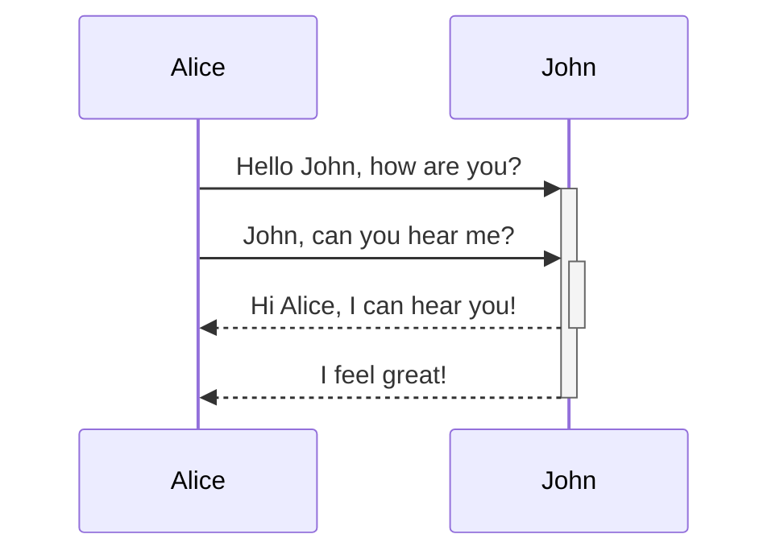
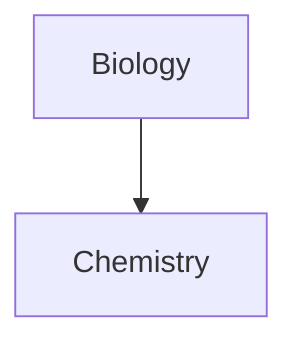

---
aliases:
  - Diagrams_Obsidian Markdown Syntax
title: Format your notes - Obsidian Help
subtitle: 
author: 
date_published: 
publisher: Obsidian Help
url: https://publish.obsidian.md/
type: documentation
file_class: lib_documentation
cssclasses:
date_created: 2023-03-21T12:22
date_modified: 2023-09-05T19:18
tags: markdown/obsidian, obsidian, markdown, mermaid
---
# Diagrams

Obsidian uses [Mermaid](https://mermaid-js.github.io/) to render diagrams and charts. Mermaid also provides [a helpful live editor](https://mermaid-js.github.io/mermaid-live-editor).  
Mermaid provides the following diagram types:

- Flowchart
- Sequence diagram
- Class Diagram
- State Diagram
- Entity Relationship Diagram
- User Journey
- Gantt
- Pie Chart
- Requirement Diagram

```



```
```mermaid 
graph TD 

Biology --> Chemistry ```
```



Obsidian supports linking to notes in Mermaid, these links won't show up on [Graph view](https://help.obsidian.md/Plugins/Graph+view).

````

````


An easier w  
ay to do it is the following:

```


This way, all the note names (at least until `Z[note name]`) are all automatically assigned the class `internal-link` when you use this snippet.

If you use special characters in your note names, you need to put the note name in double quotes.  
`"⨳ special character"`  
It looks like this if you follow the [second option](https://help.obsidian.md/How+to/Format+your+notes#^376b9d):  
`A["⨳ special character"]`
